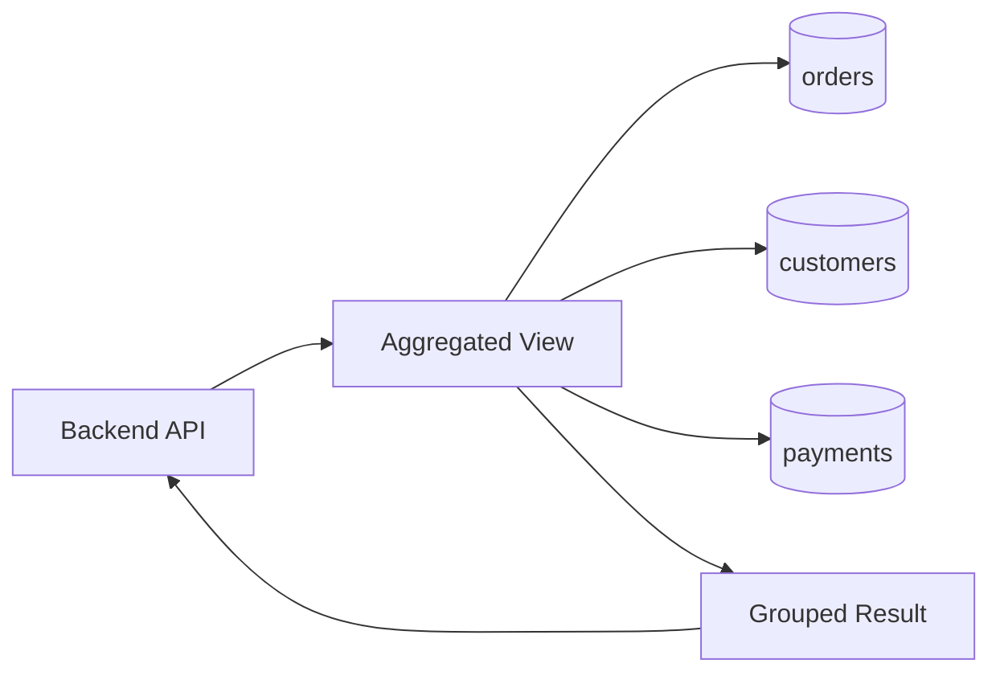
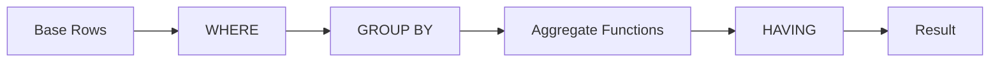

# 07- Views with Aggregations

## Overview

An aggregated view encapsulates a query that combines relational data with operations such as `COUNT`, `SUM`, `AVG`, `MIN`, `MAX`, and `GROUP BY`.

This is useful when multiple backend consumers need the same derived read model, such as:

- Customer order counts and lifetime spend.
- Daily revenue.
- Product sales metrics.
- Tenant-level usage statistics.
- Operational dashboards.
- Reporting queries shared by multiple services.

A typical architecture is:



A normal view generally stores the query definition rather than its computed result. Aggregation therefore still consumes database CPU, memory, I/O, and potentially sorting or hashing resources when the view is queried.

## Why Use Aggregated Views

Without a view, every consumer may implement the same aggregation independently:

```sql
SELECT
    customer_id,
    COUNT(*) AS order_count,
    SUM(total_amount) AS total_spend
FROM orders
GROUP BY customer_id;
```

A view centralizes this relational logic:

```sql
CREATE VIEW customer_order_metrics AS
SELECT
    customer_id,
    COUNT(*) AS order_count,
    SUM(total_amount) AS total_spend
FROM orders
GROUP BY customer_id;
```

Consumers can then query:

```sql
SELECT *
FROM customer_order_metrics
WHERE customer_id = 123;
```

This provides a named read abstraction while keeping the transactional tables normalized.

## Aggregation Semantics

An aggregation changes the **grain** of a result.

For example, the `orders` table may contain:

| order_id | customer_id | total_amount |
|---:|---:|---:|
| 101 | 1 | 100.00 |
| 102 | 1 | 250.00 |
| 103 | 2 | 75.00 |

The source grain is:

> One row per order.

After:

```sql
SELECT
    customer_id,
    COUNT(*) AS order_count,
    SUM(total_amount) AS total_spend
FROM orders
GROUP BY customer_id;
```

the result grain becomes:

> One row per customer.

The distinction is critical when designing production views. Always be able to state what one output row represents.

## Basic Aggregated View

A practical customer metrics view:

```sql
CREATE VIEW customer_order_metrics AS
SELECT
    customer_id,
    COUNT(*) AS order_count,
    SUM(total_amount) AS total_spend,
    AVG(total_amount) AS average_order_value,
    MIN(created_at) AS first_order_at,
    MAX(created_at) AS last_order_at
FROM orders
WHERE status = 'completed'
GROUP BY customer_id;
```

Query it:

```sql
SELECT
    customer_id,
    order_count,
    total_spend,
    average_order_value
FROM customer_order_metrics
WHERE customer_id = 123;
```

The filtering rule is part of the view's semantics: these metrics describe completed orders, not every order.

## Aggregation with JOINs

Aggregated views commonly combine several tables.

```sql
CREATE VIEW customer_order_metrics AS
SELECT
    c.customer_id,
    c.name,
    COUNT(o.order_id) AS order_count,
    COALESCE(SUM(o.total_amount), 0) AS total_spend
FROM customers AS c
LEFT JOIN orders AS o
    ON o.customer_id = c.customer_id
   AND o.status = 'completed'
GROUP BY
    c.customer_id,
    c.name;
```

The `LEFT JOIN` ensures customers with no completed orders remain visible.

`COUNT(o.order_id)` returns `0` for such customers, while `SUM(o.total_amount)` returns `NULL`, which is why `COALESCE` is useful.

```sql
COALESCE(SUM(o.total_amount), 0)
```

means:

> If there are no matching orders, represent total spend as zero.

## COUNT(*) vs COUNT(column)

These expressions have different semantics:

```sql
COUNT(*)
COUNT(order_id)
COUNT(DISTINCT customer_id)
```

`COUNT(*)` counts rows in the grouped result.

`COUNT(column)` counts only non-`NULL` values of that column.

`COUNT(DISTINCT column)` counts unique non-`NULL` values.

For a `LEFT JOIN`, this distinction matters:

```sql
SELECT
    c.customer_id,
    COUNT(*) AS row_count,
    COUNT(o.order_id) AS order_count
FROM customers AS c
LEFT JOIN orders AS o
    ON o.customer_id = c.customer_id
GROUP BY c.customer_id;
```

A customer with no orders still contributes one NULL-extended join row.

Therefore:

```text
COUNT(*)        -> 1
COUNT(o.order_id) -> 0
```

For counting related entities in a `LEFT JOIN`, `COUNT(related_table.primary_key)` is usually the intended expression.

## SUM, AVG, MIN, and MAX

Aggregated views can expose multiple metrics:

```sql
CREATE VIEW product_sales_metrics AS
SELECT
    product_id,
    COUNT(*) AS sale_count,
    SUM(quantity) AS units_sold,
    SUM(quantity * unit_price) AS gross_revenue,
    AVG(unit_price) AS average_unit_price,
    MIN(created_at) AS first_sale_at,
    MAX(created_at) AS last_sale_at
FROM order_items
GROUP BY product_id;
```

Each function answers a different question:

| Function | Typical use |
|---|---|
| `COUNT` | Number of rows/events |
| `SUM` | Total quantity/revenue |
| `AVG` | Mean value |
| `MIN` | Earliest/smallest value |
| `MAX` | Latest/largest value |

Be precise about the business meaning of each metric. For example, `AVG(unit_price)` is not necessarily the same as average revenue per order.

## GROUP BY and View Grain

Every non-aggregated selected column generally needs to be part of the grouping in SQL dialects that enforce standard grouping semantics.

For example:

```sql
SELECT
    customer_id,
    status,
    COUNT(*) AS order_count
FROM orders
GROUP BY
    customer_id,
    status;
```

This produces one row per:

```text
customer_id + status
```

not one row per customer.

The grouping keys define the result grain.

A useful design rule is:

> Before writing `GROUP BY`, define the business grain of the view.

Examples:

| Desired grain | Typical grouping |
|---|---|
| One row per customer | `customer_id` |
| One row per customer/status | `customer_id, status` |
| One row per product | `product_id` |
| One row per day | `DATE(created_at)` |
| One row per tenant/day | `tenant_id, DATE(created_at)` |

## Date-Based Aggregations

Reporting systems frequently aggregate by time.

For example:

```sql
CREATE VIEW daily_order_metrics AS
SELECT
    created_at::date AS order_date,
    COUNT(*) AS order_count,
    SUM(total_amount) AS total_revenue
FROM orders
WHERE status = 'completed'
GROUP BY created_at::date;
```

For large production tables, consider the implications of applying expressions to timestamp columns.

A query such as:

```sql
WHERE created_at::date = DATE '2026-08-30'
```

may prevent efficient use of a simple index depending on the database and plan.

A range predicate is often preferable:

```sql
WHERE created_at >= TIMESTAMPTZ '2026-08-30 00:00:00+00'
  AND created_at <  TIMESTAMPTZ '2026-08-31 00:00:00+00'
```

For recurring reporting, carefully define timezone semantics. "Day" must have an explicit business timezone when the system operates across regions.

## Filtering Before and After Aggregation

`WHERE` and `HAVING` operate at different stages.

Use `WHERE` to filter source rows before aggregation:

```sql
SELECT
    customer_id,
    COUNT(*) AS order_count
FROM orders
WHERE status = 'completed'
GROUP BY customer_id;
```

Use `HAVING` to filter groups after aggregation:

```sql
SELECT
    customer_id,
    COUNT(*) AS order_count
FROM orders
WHERE status = 'completed'
GROUP BY customer_id
HAVING COUNT(*) >= 10;
```

The logical flow is approximately:



Do not use `HAVING` simply because an aggregate view exists. If a predicate can safely filter source rows before grouping, `WHERE` can reduce the amount of data entering the aggregation.

## Avoiding JOIN-Induced Double Counting

One of the most important production risks is incorrect aggregation after joining multiple one-to-many relationships.

Suppose:

```text
Order 100
 ├── Item A
 ├── Item B
 └── Payment 1
```

Joining `orders`, `order_items`, and `payments` may produce:

```text
Order 100 + Item A + Payment 1
Order 100 + Item B + Payment 1
```

If you then calculate:

```sql
SUM(p.amount)
```

the payment may be counted twice.

This is a correctness bug, not merely a performance issue.

### Safer Pattern

Aggregate each independent child relationship before joining:

```sql
CREATE VIEW order_financial_summary AS
SELECT
    o.order_id,
    COALESCE(i.item_total, 0) AS item_total,
    COALESCE(p.payment_total, 0) AS payment_total
FROM orders AS o
LEFT JOIN (
    SELECT
        order_id,
        SUM(quantity * unit_price) AS item_total
    FROM order_items
    GROUP BY order_id
) AS i
    ON i.order_id = o.order_id
LEFT JOIN (
    SELECT
        order_id,
        SUM(amount) AS payment_total
    FROM payments
    GROUP BY order_id
) AS p
    ON p.order_id = o.order_id;
```

Now each child aggregation produces one row per order before the final joins.

The principle is:

> Aggregate independent one-to-many relationships at their natural grain before combining them.

## DISTINCT in Aggregated Views

`DISTINCT` can sometimes solve duplicate counting:

```sql
COUNT(DISTINCT customer_id)
```

but it should not be used as a generic fix for incorrect joins.

For example:

```sql
SELECT
    COUNT(DISTINCT o.order_id)
FROM orders AS o
JOIN order_items AS oi
    ON oi.order_id = o.order_id;
```

may correctly count orders despite multiple item rows.

However, `DISTINCT` can require additional sorting or hashing and may hide an incorrectly modeled join.

First determine why duplicates exist, then choose the correct relational design.

## NULL Semantics

Aggregations interact with `NULL` values.

For example:

```sql
SUM(amount)
AVG(amount)
COUNT(amount)
```

generally ignore `NULL` values, while:

```sql
COUNT(*)
```

counts rows regardless of whether individual columns are `NULL`.

Consider:

```text
amount
------
100
NULL
200
```

Then:

```text
COUNT(*)       = 3
COUNT(amount)  = 2
SUM(amount)    = 300
AVG(amount)    = 150
```

Do not automatically replace every `NULL` with zero. A `NULL` aggregate can represent "no observations," while zero can mean "observed and measured as zero."

The correct representation depends on the business semantics.

## View with Aggregated JOINs

A more realistic reporting view might combine customers and orders:

```sql
CREATE VIEW customer_revenue_metrics AS
SELECT
    c.customer_id,
    c.name,
    COUNT(o.order_id) AS completed_order_count,
    COALESCE(SUM(o.total_amount), 0) AS completed_revenue,
    MAX(o.created_at) AS last_completed_order_at
FROM customers AS c
LEFT JOIN orders AS o
    ON o.customer_id = c.customer_id
   AND o.status = 'completed'
GROUP BY
    c.customer_id,
    c.name;
```

This is a useful read model for an administrative API:

```text
customers
    |
    | LEFT JOIN
    v
completed orders
    |
    | GROUP BY customer
    v
customer_revenue_metrics
    |
    +--> Admin API
    +--> Internal dashboard
    +--> Reporting
```

## Performance Considerations

An aggregated view can be expensive because aggregation may require:

- Sequential scans.
- Index scans.
- Sorting.
- Hash aggregation.
- Large memory allocations.
- Temporary disk usage.
- Parallel execution.

Inspect representative queries with:

```sql
EXPLAIN (ANALYZE, BUFFERS)
SELECT *
FROM customer_revenue_metrics
WHERE customer_id = 123;
```

Pay attention to:

- Estimated vs actual row counts.
- Scan type.
- Join strategy.
- Aggregation strategy.
- Sort operations.
- Hash memory.
- Disk spills.
- Buffer reads.
- Execution time.

A view does not eliminate the underlying work.

## Indexing Strategy

Indexes should be created on underlying tables based on real query patterns.

For example:

```sql
CREATE INDEX idx_orders_customer_status_created
ON orders(customer_id, status, created_at);
```

may help workloads that frequently filter or join using these columns.

However, an index is not automatically beneficial for every aggregation.

For high-volume reporting, evaluate:

- Query selectivity.
- Table size.
- Data distribution.
- Write overhead.
- Index storage.
- Query frequency.
- Execution plans.

Indexes also add cost to `INSERT`, `UPDATE`, and `DELETE` operations.

## Standard View vs Materialized View

When an aggregation is expensive and queried frequently, a materialized view may be a better fit.

| Characteristic | Standard view | Materialized view |
|---|---|---|
| Stores computed result | No | Yes |
| Query-time aggregation | Usually | Usually avoided |
| Freshness | Current underlying data | Refresh-dependent |
| Storage | Minimal | Additional storage |
| Refresh operation | Not required | Required |
| Suitable for | Current read abstractions | Expensive analytical projections |
| Operational complexity | Lower | Higher |

For example, a dashboard requiring near-real-time metrics may use a standard view, while a daily financial reporting workload may benefit from a materialized view refreshed on a controlled schedule.

The correct choice depends on freshness requirements and workload characteristics.

## Application Integration

### Django

A read-only aggregated view can be mapped to an unmanaged model:

```python
class CustomerRevenueMetrics(models.Model):
    customer_id = models.BigIntegerField(primary_key=True)
    name = models.TextField()
    completed_order_count = models.BigIntegerField()
    completed_revenue = models.DecimalField(
        max_digits=18,
        decimal_places=2,
    )

    class Meta:
        managed = False
        db_table = "customer_revenue_metrics"
```

The model should reflect the view's actual row grain.

If the view has one row per customer, `customer_id` is a reasonable primary-key mapping only if that uniqueness is guaranteed by the view definition.

### FastAPI

A repository can query the view directly:

```python
from sqlalchemy import text


def get_customer_metrics(session, customer_id: int):
    result = session.execute(
        text(
            """
            SELECT
                customer_id,
                name,
                completed_order_count,
                completed_revenue
            FROM customer_revenue_metrics
            WHERE customer_id = :customer_id
            """
        ),
        {"customer_id": customer_id},
    )

    return result.mappings().one_or_none()
```

Use parameter binding rather than constructing SQL with string interpolation.

## API and Reporting Boundaries

An aggregated view can be an excellent database read model, but it should not automatically become the public API contract.

A backend service should still own:

- Authorization.
- API field naming.
- Serialization.
- Pagination.
- Validation.
- Versioning.
- Business-specific transformations.

For example:

```text
Database
   |
   v
Aggregated View
   |
   v
Repository
   |
   v
Service Layer
   |
   v
REST / gRPC API
```

This prevents database schema changes from unnecessarily becoming external API changes.

## Security Considerations

Aggregated views can reduce exposure by returning derived metrics instead of raw records.

For example, a reporting role may need:

```text
customer_id
order_count
total_spend
```

but not:

```text
payment_card_reference
internal_risk_score
private_customer_notes
```

Still, a view is not automatically a security boundary.

Review:

- Database role privileges.
- Direct access to base tables.
- Sensitive columns included in joins.
- Row-level security where applicable.
- Tenant isolation.
- View ownership and execution semantics.
- Application authorization.

For multi-tenant systems, including `tenant_id` in the aggregation is often important:

```sql
CREATE VIEW tenant_daily_revenue AS
SELECT
    tenant_id,
    created_at::date AS revenue_date,
    SUM(total_amount) AS revenue
FROM orders
WHERE status = 'completed'
GROUP BY
    tenant_id,
    created_at::date;
```

The application should still enforce tenant authorization rather than assuming the presence of `tenant_id` guarantees isolation.

## Migration and Deployment Considerations

Treat views as versioned database objects.

A schema migration may need to:

1. Add or rename an underlying column.
2. Update the view definition.
3. Deploy application code that consumes the new view shape.

Be careful with rolling deployments.

For example:

```text
Application v1 ──┐
                 ├──> Database View
Application v2 ──┘
```

Both versions may temporarily execute against the same view during deployment.

Prefer additive, backward-compatible changes where possible.

If a view must undergo an incompatible change, consider a versioned view:

```sql
CREATE VIEW customer_revenue_metrics_v2 AS
SELECT
    ...
```

Then migrate consumers before removing the old view.

## Common Mistakes

### Defining the Wrong Grain

A view intended to return one row per customer accidentally groups by customer and order.

**Why it happens:** The developer selects additional columns without considering how they change the grouping.

**Avoid it:** Explicitly document the row grain and verify it with representative data.

### Using COUNT(*) with LEFT JOIN

A customer without orders can incorrectly appear to have one related row.

**Avoid it:** Count a non-null column from the right-side table:

```sql
COUNT(o.order_id)
```

### Double Counting After Multiple JOINs

Independent one-to-many relationships can multiply rows and inflate sums.

**Avoid it:** Aggregate each child relationship before joining it to another one-to-many relation.

### Using DISTINCT as a Band-Aid

`DISTINCT` can hide a flawed join instead of correcting it.

**Avoid it:** Identify the source of duplication and fix the relational shape.

### Confusing NULL with Zero

"No rows" and "a measured value of zero" are not always equivalent.

**Avoid it:** Use `COALESCE` only when zero is the correct business representation.

### Putting Aggregate Filters in WHERE

This is invalid or semantically incorrect:

```sql
WHERE COUNT(*) > 10
```

Use:

```sql
HAVING COUNT(*) > 10
```

### Assuming Views Cache Aggregations

A standard view generally does not persist the computed result.

**Avoid it:** Use indexes, query optimization, caching, or materialized views according to workload requirements.

### Ignoring Timezone Semantics

Grouping timestamps by date without defining a business timezone can produce incorrect daily metrics.

**Avoid it:** Define the reporting timezone explicitly.

### Exposing Raw Financial Metrics Without Semantics

A column named `revenue` can be ambiguous.

It may represent:

- Gross sales.
- Net sales.
- Paid orders.
- Refunded orders excluded.
- Tax-inclusive revenue.
- Tax-exclusive revenue.

**Avoid it:** Encode precise business rules in the view and document metric definitions.

## Interview Traps

| Question | Correct reasoning |
|---|---|
| What determines the grain of an aggregated view? | The grouping keys and aggregation logic. |
| Does a normal view cache aggregate results? | Generally no. |
| Why can `COUNT(*)` be wrong with a `LEFT JOIN`? | The NULL-extended row can still be counted. |
| Why use `COUNT(o.id)` instead? | The related key is NULL when no child row exists. |
| Why can multiple one-to-many joins inflate `SUM()`? | The joins multiply rows before aggregation. |
| Is `DISTINCT` always a good fix for duplicate aggregates? | No. It can hide an incorrect join and introduce additional work. |
| What is the difference between `WHERE` and `HAVING`? | `WHERE` filters source rows before grouping; `HAVING` filters groups after aggregation. |
| Why use `COALESCE(SUM(...), 0)`? | To represent an empty aggregate as zero when that matches the business semantics. |
| When should a materialized view be considered? | When repeated aggregation is expensive and stored results with controlled freshness are acceptable. |
| What should you define before writing `GROUP BY`? | The intended row grain of the view. |

## Production Checklist

Before deploying an aggregated view:

- [ ] Define the exact grain of one output row.
- [ ] Document every metric and its business meaning.
- [ ] Verify `COUNT(*)` vs `COUNT(column)` semantics.
- [ ] Review `NULL` behavior.
- [ ] Check for row multiplication caused by joins.
- [ ] Aggregate independent one-to-many relationships before combining them.
- [ ] Verify `WHERE` and `HAVING` placement.
- [ ] Define timezone semantics for time-based aggregation.
- [ ] Test against production-scale data volumes.
- [ ] Inspect representative queries with `EXPLAIN (ANALYZE, BUFFERS)`.
- [ ] Add indexes based on actual workload rather than assumptions.
- [ ] Determine whether a standard or materialized view is appropriate.
- [ ] Review database privileges and sensitive data exposure.
- [ ] Verify tenant isolation requirements.
- [ ] Test migrations against rolling application deployments.
- [ ] Monitor latency, CPU, memory, I/O, and query-plan regressions.

## Key Takeaways

- **An aggregated view is a reusable read model whose `GROUP BY` and aggregate expressions define the output grain.**
- **Multiple one-to-many joins can silently multiply rows and produce incorrect financial or operational metrics; aggregate independent relationships before joining them.**
- **`COUNT(*)`, `COUNT(column)`, `NULL`, zero, `WHERE`, and `HAVING` have materially different semantics and must be chosen deliberately.**
- **Normal views do not automatically cache expensive aggregations; use execution-plan analysis, indexing, and materialized views when workload characteristics justify them.**
- **Production aggregated views require explicit metric definitions, timezone semantics, security controls, migration compatibility, and monitoring at realistic data volumes.**