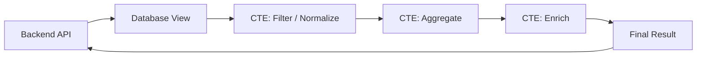

# 08- Views with CTEs

## Overview

A view can contain a Common Table Expression (CTE), allowing a complex query to be organized into named logical stages while exposing a stable database object to consumers.

This combination is useful when a reusable read model requires multiple transformations, such as:

- Filtering a large transactional dataset.
- Aggregating data at an intermediate grain.
- Joining independently aggregated datasets.
- Calculating derived metrics.
- Applying ranking or other window functions.
- Separating complex business logic into understandable query stages.

A typical flow is:



A CTE improves the structure of the query; the view provides a reusable database-level interface. Neither should be assumed to cache the result. For a normal view, the underlying query is generally executed when the view is queried.

## CTEs Inside Views

A view can be defined using a `WITH` clause:

```sql
CREATE VIEW customer_order_metrics AS
WITH completed_orders AS (
    SELECT
        order_id,
        customer_id,
        total_amount,
        created_at
    FROM orders
    WHERE status = 'completed'
),
customer_metrics AS (
    SELECT
        customer_id,
        COUNT(*) AS order_count,
        SUM(total_amount) AS total_spend,
        MAX(created_at) AS last_order_at
    FROM completed_orders
    GROUP BY customer_id
)
SELECT
    customer_id,
    order_count,
    total_spend,
    last_order_at
FROM customer_metrics;
```

Consumers can query the view without needing to understand the internal stages:

```sql
SELECT *
FROM customer_order_metrics
WHERE customer_id = 123;
```

The CTEs are part of the view definition; they do not become independently addressable database objects.

## Why Combine Views and CTEs

A view solves **reuse and abstraction**.

A CTE solves **query organization and composability**.

Together they are useful when a query is complex enough that a single flat `SELECT` becomes difficult to reason about.

| Concern | View | CTE |
|---|---|---|
| Reusable by other queries | Yes | No, scoped to one statement |
| Named database object | Yes | No |
| Organizes complex SQL | Indirectly | Yes |
| Hides implementation from consumers | Yes | No |
| Can represent multiple query stages | Yes, through its definition | Yes |
| Automatically caches results | No for a normal view | No |
| Useful as API/read-model boundary | Yes | No |

The key distinction is scope:

```text
Application
    |
    v
Database View
    |
    +-- CTE A
    |
    +-- CTE B
    |
    +-- CTE C
    |
    v
Final SELECT
```

## Designing CTE Stages

Each CTE should ideally represent a meaningful relational transformation.

For example:

```sql
CREATE VIEW tenant_daily_revenue AS
WITH completed_orders AS (
    SELECT
        tenant_id,
        created_at,
        total_amount
    FROM orders
    WHERE status = 'completed'
),
daily_revenue AS (
    SELECT
        tenant_id,
        created_at::date AS revenue_date,
        SUM(total_amount) AS revenue
    FROM completed_orders
    GROUP BY
        tenant_id,
        created_at::date
)
SELECT
    tenant_id,
    revenue_date,
    revenue
FROM daily_revenue;
```

The stages have clear responsibilities:

```text
orders
  |
  | filter status
  v
completed_orders
  |
  | group by tenant + day
  v
daily_revenue
  |
  v
tenant_daily_revenue view
```

This is easier to review than embedding all transformations into one large query.

## CTEs for Independent Aggregations

CTEs are particularly useful for avoiding double counting across multiple one-to-many relationships.

Suppose an order has multiple items and multiple payments. Joining both child tables directly can multiply rows:

```text
order
 ├── item 1
 ├── item 2
 └── payment 1
     └── payment 2
```

A direct three-table join can produce combinations such as:

```text
item 1 + payment 1
item 1 + payment 2
item 2 + payment 1
item 2 + payment 2
```

Aggregating each child relationship separately avoids this problem:

```sql
CREATE VIEW order_financial_summary AS
WITH item_totals AS (
    SELECT
        order_id,
        SUM(quantity * unit_price) AS item_total
    FROM order_items
    GROUP BY order_id
),
payment_totals AS (
    SELECT
        order_id,
        SUM(amount) AS payment_total
    FROM payments
    GROUP BY order_id
)
SELECT
    o.order_id,
    o.customer_id,
    COALESCE(i.item_total, 0) AS item_total,
    COALESCE(p.payment_total, 0) AS payment_total
FROM orders AS o
LEFT JOIN item_totals AS i
    ON i.order_id = o.order_id
LEFT JOIN payment_totals AS p
    ON p.order_id = o.order_id;
```

Each CTE establishes one row per `order_id` before the final joins.

This pattern is valuable in financial and operational reporting because incorrect row multiplication can produce silently incorrect totals.

## CTEs with Window Functions

CTEs can separate aggregation from window-function processing.

For example, first calculate monthly revenue:

```sql
CREATE VIEW customer_monthly_revenue AS
WITH monthly_revenue AS (
    SELECT
        customer_id,
        DATE_TRUNC('month', created_at) AS month,
        SUM(total_amount) AS revenue
    FROM orders
    WHERE status = 'completed'
    GROUP BY
        customer_id,
        DATE_TRUNC('month', created_at)
)
SELECT
    customer_id,
    month,
    revenue,
    LAG(revenue) OVER (
        PARTITION BY customer_id
        ORDER BY month
    ) AS previous_month_revenue
FROM monthly_revenue;
```

The CTE creates the correct grain:

> One row per customer per month.

The window function then operates on that intermediate result.

This separation is often easier to reason about than trying to combine aggregation and window-function logic in a single query.

## CTEs with Ranking

A view can also use CTEs to create a ranked read model.

```sql
CREATE VIEW top_products_by_category AS
WITH product_sales AS (
    SELECT
        p.category_id,
        oi.product_id,
        SUM(oi.quantity) AS units_sold
    FROM order_items AS oi
    JOIN products AS p
        ON p.product_id = oi.product_id
    GROUP BY
        p.category_id,
        oi.product_id
),
ranked_products AS (
    SELECT
        category_id,
        product_id,
        units_sold,
        DENSE_RANK() OVER (
            PARTITION BY category_id
            ORDER BY units_sold DESC
        ) AS sales_rank
    FROM product_sales
)
SELECT
    category_id,
    product_id,
    units_sold,
    sales_rank
FROM ranked_products
WHERE sales_rank <= 3;
```

The logical stages are:

```text
order_items
    |
    v
product_sales
    |
    v
ranked_products
    |
    v
top_products_by_category
```

This is a common pattern for "top N per group" queries.

## CTEs and Query Grain

The most important design concern is the grain at every stage.

Consider:

```sql
WITH monthly_revenue AS (
    SELECT
        customer_id,
        DATE_TRUNC('month', created_at) AS month,
        SUM(total_amount) AS revenue
    FROM orders
    GROUP BY
        customer_id,
        DATE_TRUNC('month', created_at)
)
```

The CTE's grain is:

```text
one row per customer + month
```

If a later CTE joins another table that contains multiple rows per customer and month, the grain can change.

Before adding another join, ask:

1. What is the current grain?
2. What is the grain of the table being joined?
3. Is the relationship one-to-one, one-to-many, or many-to-many?
4. Does the join preserve the intended grain?
5. Should the joined data be aggregated first?

This discipline prevents many production reporting bugs.

## Recursive CTEs

Some databases support recursive CTEs for hierarchical or graph-like data.

For example, PostgreSQL can represent an organizational hierarchy:

```sql
WITH RECURSIVE employee_tree AS (
    SELECT
        employee_id,
        manager_id,
        name,
        0 AS depth
    FROM employees
    WHERE employee_id = 100

    UNION ALL

    SELECT
        e.employee_id,
        e.manager_id,
        e.name,
        et.depth + 1
    FROM employees AS e
    JOIN employee_tree AS et
        ON e.manager_id = et.employee_id
)
SELECT
    employee_id,
    manager_id,
    name,
    depth
FROM employee_tree;
```

A recursive CTE can be used in a view when the hierarchy itself is a reusable read model.

However, recursive queries require additional operational consideration:

- Hierarchy depth.
- Cycle prevention.
- Maximum execution time.
- Large descendant sets.
- Indexing of parent/child relationships.
- Query-plan behavior.

Do not use recursive CTEs merely because they are expressive. For very large or frequently traversed hierarchies, alternative models such as materialized paths, closure tables, or specialized data structures may be more appropriate.

## CTE Materialization

A common misconception is:

> "A CTE is always a temporary table."

That is not generally correct.

The optimizer may inline or otherwise transform a CTE depending on the database engine and query. PostgreSQL, for example, can inline eligible non-recursive CTEs and also provides `MATERIALIZED` and `NOT MATERIALIZED` options in supported versions.

Example:

```sql
WITH expensive_stage AS MATERIALIZED (
    SELECT
        customer_id,
        SUM(total_amount) AS total_spend
    FROM orders
    GROUP BY customer_id
)
SELECT *
FROM expensive_stage
WHERE total_spend > 10000;
```

Materialization can be useful when deliberately controlling repeated computation or optimizer behavior, but it can also introduce unnecessary intermediate storage or prevent beneficial predicate pushdown.

Treat materialization as a query-optimization decision, not a readability feature.

## View Execution and Optimization

For a normal view, the database generally expands the view definition into the surrounding query during planning.

Conceptually:

```sql
SELECT *
FROM customer_order_metrics
WHERE customer_id = 123;
```

may be optimized as if the database were planning the underlying view query together with:

```sql
WHERE customer_id = 123
```

However, the exact behavior depends on the database engine, view definition, optimizer, and query shape.

Do not assume that:

```text
View
  +
CTE
  =
cached intermediate result
```

That is not what a standard view means.

Use execution-plan inspection to understand actual behavior:

```sql
EXPLAIN (ANALYZE, BUFFERS)
SELECT *
FROM customer_order_metrics
WHERE customer_id = 123;
```

## Performance Considerations

CTEs can improve maintainability without improving runtime performance.

Performance depends on:

- Base-table size.
- Indexes.
- Join cardinality.
- Aggregation strategy.
- Sort operations.
- Hash operations.
- CTE materialization behavior.
- Predicate pushdown.
- Database optimizer.
- Data distribution.
- Query concurrency.

A well-structured CTE query can still be slow if an intermediate stage processes millions of unnecessary rows.

Prefer early filtering when semantically safe:

```sql
WITH completed_orders AS (
    SELECT
        customer_id,
        total_amount
    FROM orders
    WHERE status = 'completed'
)
SELECT
    customer_id,
    SUM(total_amount)
FROM completed_orders
GROUP BY customer_id;
```

Filtering before aggregation can reduce the number of rows entering the aggregation stage.

## When a CTE Is Better Than a Nested Subquery

Both can express similar relational logic.

### Nested Subquery

```sql
SELECT
    customer_id,
    SUM(total_amount) AS total_spend
FROM (
    SELECT
        customer_id,
        total_amount
    FROM orders
    WHERE status = 'completed'
) AS completed_orders
GROUP BY customer_id;
```

### CTE

```sql
WITH completed_orders AS (
    SELECT
        customer_id,
        total_amount
    FROM orders
    WHERE status = 'completed'
)
SELECT
    customer_id,
    SUM(total_amount) AS total_spend
FROM completed_orders
GROUP BY customer_id;
```

The CTE is usually preferable when:

- The intermediate result has a meaningful name.
- There are multiple transformation stages.
- The same logical stage is referenced multiple times.
- The query contains complex joins or window functions.
- Reviewability matters.

A CTE is not inherently faster than an equivalent subquery.

## When a View Is Better Than a CTE

A CTE is statement-scoped:

```text
Query A -> CTE exists only here
Query B -> CTE does not exist
```

A view is database-scoped:

```text
View
 |
 +--> Query A
 +--> Query B
 +--> Query C
```

Use a view when the resulting read model has a stable meaning and multiple consumers need it.

Use a CTE when the transformation is specific to one query or when you need internal stages inside a reusable view.

## View vs CTE vs Materialized View

| Requirement | CTE | Standard View | Materialized View |
|---|---:|---:|---:|
| Reusable across statements | No | Yes | Yes |
| Named database object | No | Yes | Yes |
| Encapsulates query logic | Within statement | Yes | Yes |
| Stores query result | No | No | Yes |
| Automatically reflects base-table changes | Yes | Yes | No |
| Refresh required | No | No | Yes |
| Good for reusable read model | Limited | Yes | Yes |
| Good for organizing complex SQL | Excellent | Good | Good |
| Good for expensive repeated aggregation | Limited | Limited | Often |
| Freshness | Current | Current | Refresh-dependent |

## Application Integration

Views containing CTEs can be consumed like other views from Django, SQLAlchemy, or lower-level database clients.

### Django

```python
class CustomerOrderMetrics(models.Model):
    customer_id = models.BigIntegerField(primary_key=True)
    order_count = models.BigIntegerField()
    total_spend = models.DecimalField(
        max_digits=18,
        decimal_places=2,
    )
    last_order_at = models.DateTimeField(null=True)

    class Meta:
        managed = False
        db_table = "customer_order_metrics"
```

`managed = False` tells Django that migrations should not manage the database object.

The declared primary key must correspond to an actually unique column or combination represented by the view.

### SQLAlchemy

```python
from sqlalchemy import text


def get_customer_metrics(session, customer_id: int):
    result = session.execute(
        text(
            """
            SELECT
                customer_id,
                order_count,
                total_spend,
                last_order_at
            FROM customer_order_metrics
            WHERE customer_id = :customer_id
            """
        ),
        {"customer_id": customer_id},
    )

    return result.mappings().one_or_none()
```

Parameter binding remains important even when the underlying object is a view.

## Security Considerations

A view containing CTEs can encapsulate access to selected data, but it should not be treated as the only security mechanism.

Review:

- Database privileges.
- Base-table permissions.
- Sensitive columns.
- Tenant boundaries.
- Row-level security where applicable.
- Application authorization.
- View ownership and execution semantics.

For a multi-tenant system, tenant identity should be part of the relational design:

```sql
CREATE VIEW tenant_order_metrics AS
WITH completed_orders AS (
    SELECT
        tenant_id,
        customer_id,
        total_amount
    FROM orders
    WHERE status = 'completed'
)
SELECT
    tenant_id,
    customer_id,
    COUNT(*) AS order_count,
    SUM(total_amount) AS total_spend
FROM completed_orders
GROUP BY
    tenant_id,
    customer_id;
```

The application must still authorize access to the requested tenant.

## Migration and Deployment

Treat views as versioned database code.

If a CTE references a column that is being renamed or removed, application and database deployments must account for the dependency.

For rolling deployments, avoid changing a view in a way that immediately breaks older application instances.

A safer migration can be:

```text
Add new database structure
        |
        v
Create/update compatible view
        |
        v
Deploy application
        |
        v
Migrate consumers
        |
        v
Remove deprecated structure
```

For incompatible changes, a versioned view can provide a safer transition:

```sql
CREATE VIEW customer_order_metrics_v2 AS
WITH completed_orders AS (
    SELECT
        customer_id,
        total_amount
    FROM orders
    WHERE status = 'completed'
)
SELECT
    customer_id,
    COUNT(*) AS order_count,
    SUM(total_amount) AS total_spend
FROM completed_orders
GROUP BY customer_id;
```

## Common Mistakes

### Treating CTEs as Guaranteed Temporary Tables

A CTE is a query construct, not automatically a persisted or materialized table.

**Avoid it:** Understand your database optimizer and inspect the execution plan.

### Assuming CTEs Improve Performance

CTEs primarily improve query organization.

**Avoid it:** Measure the actual query using `EXPLAIN ANALYZE` and production-like data.

### Creating Too Many CTE Layers

Excessive decomposition can make a query harder to understand rather than easier.

**Avoid it:** Give each CTE a meaningful relational responsibility.

### Losing Track of Grain

An intermediate CTE may be one row per customer, while a later join changes it to multiple rows per customer.

**Avoid it:** Document the intended grain of important stages.

### Double Counting Through JOINs

Joining multiple independent one-to-many relationships can multiply rows.

**Avoid it:** Aggregate each relationship independently before joining.

### Using Materialization Without Measurement

Forcing materialization can increase memory, I/O, or execution time.

**Avoid it:** Use explicit materialization only when execution-plan analysis supports the decision.

### Hiding Business Logic in Unclear CTE Names

Names such as:

```sql
WITH temp1 AS (...)
```

provide little information.

Prefer:

```sql
WITH completed_orders AS (...)
```

and:

```sql
WITH customer_monthly_revenue AS (...)
```

Names should describe the data represented by the stage.

### Assuming a View Is an API Contract

A database view can provide a stable read abstraction, but it does not replace application-level API contracts.

**Avoid it:** Keep serialization, authorization, and external API compatibility in the service layer.

## Interview Traps

| Question | Correct reasoning |
|---|---|
| Can a view contain a CTE? | Yes, subject to the database engine and view-definition restrictions. |
| Does a CTE automatically materialize? | No. Materialization behavior is database- and optimizer-dependent. |
| Does a standard view cache its CTE result? | No. A normal view does not inherently cache query results. |
| Why use CTEs inside views? | To structure complex reusable query logic into meaningful stages. |
| Are CTEs always faster than subqueries? | No. Equivalent formulations can produce equivalent plans. |
| What determines the grain of a CTE? | Its selected grouping keys and relational operations. |
| Why aggregate child tables before joining them? | To prevent one-to-many joins from multiplying rows and inflating aggregates. |
| When should a materialized view be considered? | When repeated computation is expensive and controlled result freshness is acceptable. |
| What should you inspect when a view is slow? | The actual query plan, row estimates, joins, scans, aggregation, sorting, memory, and I/O. |
| Can a CTE be recursive? | Yes, where the database supports recursive CTEs. |

## Production Checklist

Before deploying a view that uses CTEs:

- [ ] Define the grain of the final view.
- [ ] Define the grain of important intermediate CTEs.
- [ ] Give CTEs meaningful names.
- [ ] Verify filtering occurs at the correct stage.
- [ ] Check for row multiplication across joins.
- [ ] Aggregate independent one-to-many relationships before combining them.
- [ ] Validate `NULL` and zero semantics.
- [ ] Review recursive CTE depth and cycle behavior if applicable.
- [ ] Do not assume CTE materialization behavior.
- [ ] Inspect representative queries with `EXPLAIN (ANALYZE, BUFFERS)`.
- [ ] Test with production-scale data.
- [ ] Validate indexes on underlying tables.
- [ ] Review tenant isolation and database privileges.
- [ ] Check sensitive data exposure.
- [ ] Make view changes compatible with rolling deployments.
- [ ] Consider a materialized view when repeated aggregation is expensive.
- [ ] Monitor query latency, CPU, memory, I/O, and plan regressions.

## Key Takeaways

- **CTEs organize complex query logic into named stages, while views provide reusable database-level read models.**
- **The grain of every CTE and the final view must be explicit; otherwise joins can silently introduce duplicate rows and incorrect aggregates.**
- **CTEs and normal views do not inherently cache results; materialization and performance behavior depend on the database engine and optimizer.**
- **Aggregate independent one-to-many relationships before joining them when building financial, reporting, or operational views.**
- **Use execution plans and production-scale data to validate performance, and treat view definitions as versioned database code during deployments.**