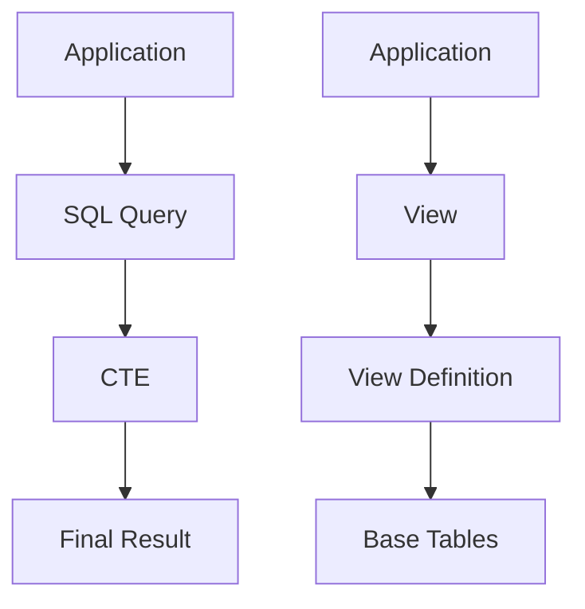
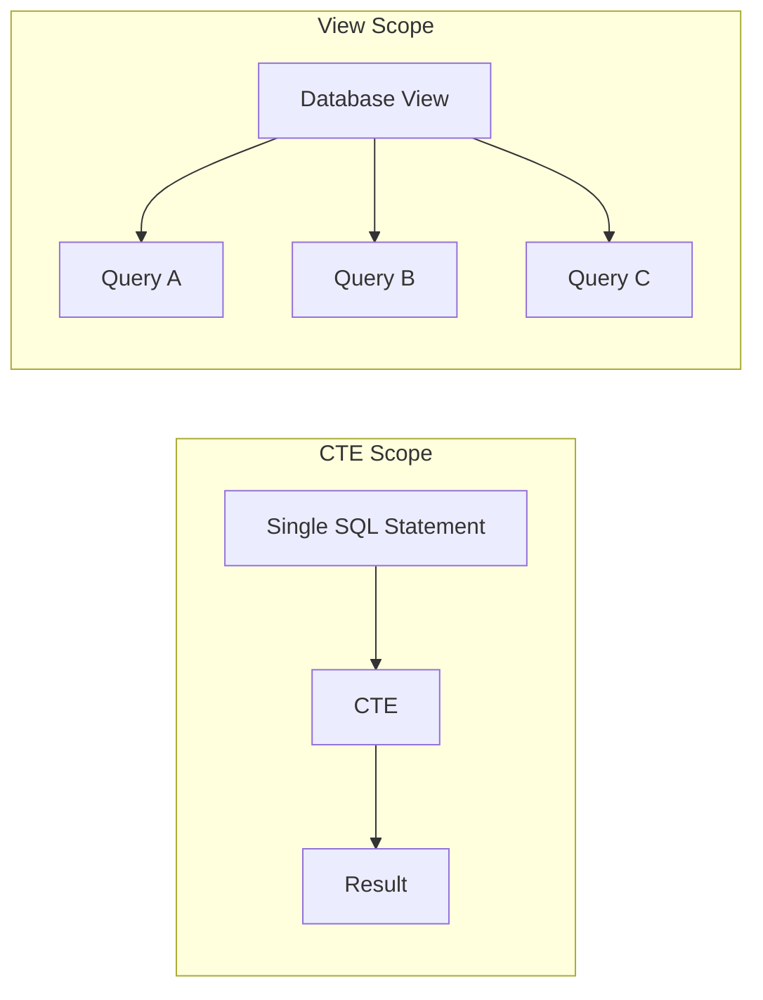
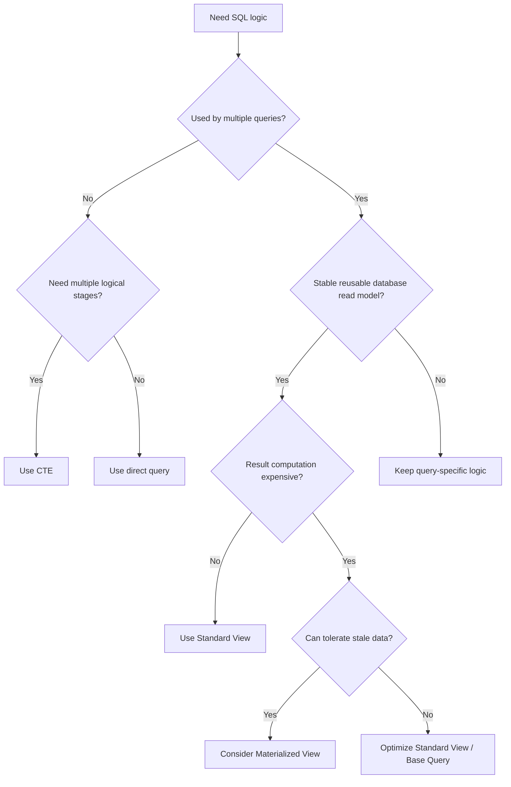

# 09- Views vs CTEs

## Overview

Views and Common Table Expressions (CTEs) both help structure SQL, but they solve different problems.

A **view** is a named database object that exposes a reusable query as a relational interface. A **CTE** is a named query expression whose scope is limited to the statement containing it.

The practical distinction is:

```text
CTE
└── Organize logic inside one SQL statement

View
└── Reuse and expose a query across multiple SQL statements
```

Neither should be assumed to cache results. A standard view normally stores the query definition rather than its result, and a CTE is not inherently a temporary or persisted table.

For backend systems, the choice should be driven by **scope, ownership, reuse, freshness, performance, and API boundaries** rather than by query length alone.

## Core Difference

| Characteristic | CTE | Standard View |
|---|---|---|
| Definition | Query expression | Database object |
| Scope | One SQL statement | Database/schema |
| Reusable across queries | No | Yes |
| Persistent object | No | Yes |
| Stores query results | No | No |
| Supports multiple logical stages | Yes | Yes, inside definition |
| Good for query composition | Excellent | Good |
| Good for reusable read models | Limited | Excellent |
| Requires schema deployment | No | Yes |
| Can be granted permissions as an object | No | Yes |
| Automatically caches results | No | No |
| Refresh required | No | No |
| Typical owner | Query author | Database/application team |

A useful mental model is:



A CTE is an internal component of a statement. A view becomes part of the database's schema.

## CTEs

### What a CTE Is

A CTE is introduced using `WITH` and provides a name for an intermediate query result.

```sql
WITH completed_orders AS (
    SELECT
        order_id,
        customer_id,
        total_amount
    FROM orders
    WHERE status = 'completed'
)
SELECT
    customer_id,
    SUM(total_amount) AS total_spend
FROM completed_orders
GROUP BY customer_id;
```

The CTE exists only for this statement.

### Why CTEs Exist

CTEs primarily provide:

- Query decomposition.
- Named intermediate datasets.
- Cleaner multi-stage transformations.
- Recursive query support where supported.
- A convenient boundary between aggregation and window functions.
- Better readability for complex SQL.

They do not exist primarily as a performance mechanism.

### When to Use a CTE

Prefer a CTE when:

- The logic is specific to one query.
- The intermediate result has a meaningful name.
- Several transformations need to be chained.
- You need to aggregate before joining.
- You need to apply a window function to an intermediate result.
- You need recursive traversal.
- You want to make a complex query easier to review.

Example:

```sql
WITH monthly_revenue AS (
    SELECT
        customer_id,
        DATE_TRUNC('month', created_at) AS month,
        SUM(total_amount) AS revenue
    FROM orders
    WHERE status = 'completed'
    GROUP BY
        customer_id,
        DATE_TRUNC('month', created_at)
)
SELECT
    customer_id,
    month,
    revenue,
    LAG(revenue) OVER (
        PARTITION BY customer_id
        ORDER BY month
    ) AS previous_month_revenue
FROM monthly_revenue;
```

The CTE establishes a clear grain:

> One row per customer per month.

The window function then operates on that known grain.

## Views

### What a View Is

A view is a named database object defined by a query.

```sql
CREATE VIEW customer_order_metrics AS
SELECT
    customer_id,
    COUNT(*) AS order_count,
    SUM(total_amount) AS total_spend
FROM orders
WHERE status = 'completed'
GROUP BY customer_id;
```

Consumers can query it like a relation:

```sql
SELECT *
FROM customer_order_metrics
WHERE customer_id = 123;
```

The caller does not need to know how the result is produced.

### Why Views Exist

Views are useful for creating stable database-level abstractions.

They can:

- Encapsulate complicated joins.
- Expose a controlled set of columns.
- Standardize reporting logic.
- Provide reusable read models.
- Hide implementation details from consumers.
- Provide an object on which database permissions can be granted.
- Reduce duplication of complex SQL across services and reports.

### When to Use a View

A view is a strong choice when:

- Multiple consumers need the same relational model.
- The query represents a stable business concept.
- SQL logic should be centralized.
- You want a database-level access boundary.
- Several applications or reporting workloads consume the same shape.
- You want consumers to depend on a stable schema rather than a complex implementation.

Example:

```text
                    ┌── Django API
                    │
Customer Metrics ───┼── Reporting Job
View                │
                    └── Analytics Query
```

The view becomes a shared database interface.

## The Scope Difference

This is the most important distinction.

A CTE:

```sql
WITH customer_metrics AS (
    SELECT ...
)
SELECT ...
FROM customer_metrics;
```

is available only to that statement.

A view:

```sql
CREATE VIEW customer_metrics AS
SELECT ...;
```

can be queried by many independent statements:

```sql
SELECT * FROM customer_metrics;

SELECT *
FROM customer_metrics
WHERE customer_id = 123;

SELECT COUNT(*)
FROM customer_metrics;
```

Conceptually:



Use a CTE for **local query composition**.

Use a view for **shared database-level reuse**.

## Same Logic: CTE vs View

Suppose the application frequently needs completed customer order totals.

### CTE Version

```sql
WITH customer_order_metrics AS (
    SELECT
        customer_id,
        COUNT(*) AS order_count,
        SUM(total_amount) AS total_spend
    FROM orders
    WHERE status = 'completed'
    GROUP BY customer_id
)
SELECT *
FROM customer_order_metrics
WHERE customer_id = 123;
```

The query author owns the logic.

Another query must repeat it:

```sql
WITH customer_order_metrics AS (
    SELECT
        customer_id,
        COUNT(*) AS order_count,
        SUM(total_amount) AS total_spend
    FROM orders
    WHERE status = 'completed'
    GROUP BY customer_id
)
SELECT *
FROM customer_order_metrics
WHERE total_spend > 10000;
```

### View Version

Create the model once:

```sql
CREATE VIEW customer_order_metrics AS
SELECT
    customer_id,
    COUNT(*) AS order_count,
    SUM(total_amount) AS total_spend
FROM orders
WHERE status = 'completed'
GROUP BY customer_id;
```

Consumers can then reuse it:

```sql
SELECT *
FROM customer_order_metrics
WHERE customer_id = 123;
```

or:

```sql
SELECT *
FROM customer_order_metrics
WHERE total_spend > 10000;
```

The view eliminates duplication of the shared relational logic.

## Views Containing CTEs

These choices are not mutually exclusive.

A view can contain CTEs:

```sql
CREATE VIEW customer_monthly_revenue AS
WITH completed_orders AS (
    SELECT
        customer_id,
        created_at,
        total_amount
    FROM orders
    WHERE status = 'completed'
),
monthly_revenue AS (
    SELECT
        customer_id,
        DATE_TRUNC('month', created_at) AS month,
        SUM(total_amount) AS revenue
    FROM completed_orders
    GROUP BY
        customer_id,
        DATE_TRUNC('month', created_at)
)
SELECT
    customer_id,
    month,
    revenue
FROM monthly_revenue;
```

This combines both scopes:

```text
Reusable database object
        |
        v
      VIEW
        |
        +── CTE: completed_orders
        |
        +── CTE: monthly_revenue
        |
        v
   Final relational model
```

This is often the right design for complex, reusable read models.

## Performance

### Neither Is Automatically Faster

A common misconception is:

> "CTEs are faster than views."

or:

> "Views are faster because the database stores the query."

Neither statement is generally correct.

A standard view normally stores the **definition**, not the computed result.

A CTE also does not inherently mean that the intermediate result is physically materialized.

Actual performance depends on:

- Database engine and version.
- Query optimizer.
- Statistics.
- Indexes.
- Join cardinality.
- Predicate pushdown.
- Aggregation.
- Sort operations.
- CTE materialization behavior.
- Data distribution.
- Query concurrency.

Use an execution plan rather than guessing:

```sql
EXPLAIN (ANALYZE, BUFFERS)
SELECT *
FROM customer_order_metrics
WHERE customer_id = 123;
```

### View Expansion

Conceptually, a database may optimize:

```sql
SELECT *
FROM customer_order_metrics
WHERE customer_id = 123;
```

together with the underlying view definition.

The optimizer may be able to push predicates into the underlying tables.

The exact behavior is database-specific, so do not build performance assumptions around a simplified mental model.

### CTE Materialization

Some database engines and versions may materialize CTEs in particular circumstances, while others may inline them or provide explicit controls.

For PostgreSQL, supported syntax includes:

```sql
WITH customer_metrics AS MATERIALIZED (
    SELECT
        customer_id,
        SUM(total_amount) AS total_spend
    FROM orders
    GROUP BY customer_id
)
SELECT *
FROM customer_metrics
WHERE total_spend > 10000;
```

Materialization can be useful when it avoids repeated computation, but it can also introduce additional memory or I/O and prevent some optimizations.

Treat materialization as an execution-plan decision, not a default property of CTEs.

## Reuse and Ownership

The choice also determines where query ownership lives.

| Situation | Better Fit |
|---|---|
| Logic used by one query | CTE |
| Logic used by several queries | View |
| Complex internal transformation | CTE |
| Stable database read model | View |
| Recursive traversal for one operation | CTE |
| Shared reporting model | View |
| Temporary query decomposition | CTE |
| Database permission boundary | View |
| Expensive repeated computation | Materialized view may be appropriate |

A useful engineering rule is:

> **If the name describes a reusable business-level dataset, consider a view. If it describes an intermediate step in one query, consider a CTE.**

## Maintainability

CTEs improve local readability because each stage can have a focused responsibility:

```sql
WITH eligible_orders AS (...),
monthly_revenue AS (...),
ranked_customers AS (...)
SELECT ...
FROM ranked_customers;
```

Views improve global consistency because multiple consumers use the same definition:

```text
                View
                 |
       +---------+---------+
       |         |         |
    API A     Report B   Job C
```

However, a heavily used view can become a dependency that is difficult to change.

Before modifying a production view, identify:

- Application consumers.
- Reporting consumers.
- ETL jobs.
- Permissions.
- Dependent views.
- Functions or procedures.
- Migration dependencies.

Centralization reduces duplication but increases the importance of compatibility management.

## Security and Access Control

Views can provide a useful database-level projection.

For example, an application may need customer information without exposing internal columns:

```sql
CREATE VIEW customer_directory AS
SELECT
    customer_id,
    display_name,
    created_at
FROM customers;
```

Permissions can then be granted to the view rather than exposing all columns of the underlying table, depending on the database's privilege and ownership semantics.

This can be useful for:

- Sensitive columns.
- Read-only service accounts.
- Reporting users.
- Cross-service database access.
- Controlled data exposure.

However, a view is not automatically a complete authorization system.

For multi-tenant applications, enforce tenant isolation deliberately and consider database features such as row-level security where appropriate.

## Application Integration

Views are commonly mapped as read-only models in backend frameworks.

### Django

```python
class CustomerOrderMetrics(models.Model):
    customer_id = models.BigIntegerField(primary_key=True)
    order_count = models.BigIntegerField()
    total_spend = models.DecimalField(
        max_digits=18,
        decimal_places=2,
    )

    class Meta:
        managed = False
        db_table = "customer_order_metrics"
```

`managed = False` prevents Django migrations from treating the view as a normal managed table.

The declared primary key must actually be unique in the view's result.

For a CTE, there is no database object to map directly. The query normally remains inside a repository, service, manager, or data-access layer.

### FastAPI or Other Services

A service can query a view through its normal database abstraction:

```sql
SELECT
    customer_id,
    order_count,
    total_spend
FROM customer_order_metrics
WHERE customer_id = $1;
```

The service owns the API contract while the database view owns the reusable relational transformation.

Avoid treating the view itself as the public REST or gRPC contract.

## Materialized Views

When the main problem is repeated expensive computation rather than query organization, neither a standard view nor a CTE may be sufficient.

A materialized view stores query results:

```text
Base Tables
     |
     v
Materialized View
     |
     v
Fast Reads
```

Unlike a standard view:

```text
Standard View
    |
    v
Query executes against current base data
```

a materialized view has controlled freshness.

The trade-off is:

| Property | Standard View | Materialized View |
|---|---|---|
| Stores result | No | Yes |
| Freshness | Current | Refresh-dependent |
| Read performance | Depends on underlying query | Often much better |
| Refresh required | No | Yes |
| Additional storage | Minimal | Yes |
| Suitable for expensive aggregates | Sometimes | Often |
| Complexity | Lower | Higher |

Consider materialized views for workloads such as:

- Large reporting aggregations.
- Dashboards with defined freshness requirements.
- Repeated analytical queries.
- Read-heavy derived datasets.

Do not introduce one merely because a standard view is slow. First inspect the execution plan and indexing strategy.

## Decision Framework

Use this decision process:



The decision should be based on **scope and operational requirements**, not on whether one syntax appears shorter.

## Production Considerations

### Query Plans

Do not assume that replacing a CTE with a view, or vice versa, will change performance in a predictable direction.

Compare actual plans:

```sql
EXPLAIN (ANALYZE, BUFFERS)
WITH customer_metrics AS (
    SELECT
        customer_id,
        SUM(total_amount) AS total_spend
    FROM orders
    GROUP BY customer_id
)
SELECT *
FROM customer_metrics
WHERE total_spend > 10000;
```

Then compare the equivalent view-based query.

Look for:

- Sequential scans.
- Index scans.
- Incorrect row estimates.
- Large sorts.
- Hash joins.
- Excessive memory.
- Disk spills.
- Repeated scans.
- Unexpected materialization.
- High actual execution time.

### Indexing

Indexes belong to the underlying tables, not the standard view itself.

For example:

```sql
CREATE INDEX CONCURRENTLY idx_orders_completed_customer
ON orders (customer_id)
WHERE status = 'completed';
```

Whether this index is useful depends on the actual workload and query plan.

Do not add indexes solely because a view references a column. Index based on predicates, joins, ordering, and access patterns.

### Deployment

Views are schema objects and should be treated as versioned database code.

If an application expects:

```text
customer_id
order_count
total_spend
```

then changing or removing columns can break deployed application versions.

For rolling deployments, use compatible migration strategies:

```text
Add compatible database structure
        |
        v
Deploy database changes
        |
        v
Deploy application
        |
        v
Migrate consumers
        |
        v
Remove deprecated structure
```

### Observability

Monitor the actual queries consuming important views.

Useful signals include:

- Query latency.
- Execution frequency.
- Rows returned.
- Rows scanned.
- Database CPU.
- Database memory.
- I/O.
- Lock waits.
- Temporary file usage.
- Execution-plan regressions.

A view can look simple to an application while hiding an expensive join or aggregation underneath.

## Common Mistakes

### Using a View for a One-Off Query

Creating a database object for logic used exactly once adds schema complexity without meaningful reuse.

**Prefer:** a direct query or CTE.

### Repeating the Same Complex Query Everywhere

Copying identical business logic across repositories and reports creates drift.

**Prefer:** a shared view when the relational model is genuinely stable and database-level reuse is appropriate.

### Assuming a View Is Cached

A standard view normally stores the definition, not its result.

**Prefer:** a materialized view when controlled result storage is actually required.

### Assuming a CTE Is a Temporary Table

A CTE is not automatically a physical temporary table.

**Prefer:** understand the optimizer's behavior and inspect the execution plan.

### Choosing Based on Syntax Alone

A shorter SQL statement is not necessarily a better architecture.

**Prefer:** evaluate scope, ownership, consumers, freshness, security, and performance.

### Hiding Too Much Logic in a View

A view with many nested CTEs, joins, aggregations, and business rules can become difficult to debug.

**Prefer:** split responsibilities across well-defined database objects or application-level logic when appropriate.

### Ignoring View Dependencies

Changing a view can break downstream queries, services, reports, or other database objects.

**Prefer:** identify dependencies before schema changes and use compatibility-oriented migrations.

### Treating a View as an API Contract

A database representation and an external API representation have different compatibility requirements.

**Prefer:** keep REST/gRPC schemas under service ownership while using views as database read abstractions.

## Interview Traps

| Question | Correct Answer |
|---|---|
| What is the primary difference between a CTE and a view? | A CTE is statement-scoped; a view is a reusable database object. |
| Is a CTE reusable across multiple queries? | No. Its scope is the statement containing it. |
| Does a standard view store its results? | No. It generally stores the query definition. |
| Is a CTE always materialized? | No. Behavior depends on the database engine and optimizer. |
| Is a view always faster than a CTE? | No. Performance depends on the resulting execution plan. |
| Can a view contain a CTE? | Yes, subject to database-specific restrictions. |
| When should you prefer a CTE? | For query-local decomposition and intermediate transformations. |
| When should you prefer a view? | For stable, reusable database-level read models. |
| When should you consider a materialized view? | When repeated computation is expensive and controlled freshness is acceptable. |
| Where should indexes be created for a standard view? | On the underlying tables based on actual access patterns. |
| Can views help with security? | Yes, they can expose controlled projections and support database privilege boundaries, but they do not replace complete authorization design. |

## Practical Decision Table

| Requirement | Recommended Approach |
|---|---|
| One complex query | CTE |
| Multiple stages in one query | CTE |
| Repeated SQL logic in several queries | View |
| Stable shared read model | View |
| Complex reusable read model | View containing CTEs |
| Expensive repeated aggregation | Materialized view candidate |
| Recursive query | Recursive CTE where supported |
| Sensitive-column projection | View plus appropriate database privileges |
| Frequently changing query logic | Keep query-local unless reuse justifies a view |
| Current data required | Standard view or direct query |
| Stale data acceptable for much faster reads | Materialized view candidate |

## Senior-Level Rule of Thumb

Think in terms of **scope**:

```text
"Does this logic exist to help me write this query?"
                |
                +--> CTE


"Does this query represent a reusable database-level dataset?"
                |
                +--> View


"Is the reusable dataset expensive to compute and allowed to be stale?"
                |
                +--> Materialized View
```

Also consider ownership:

```text
CTE
└── Query author owns the transformation

View
└── Database/schema owners manage the shared abstraction

Materialized View
└── Database owners also manage refresh strategy and freshness
```

This distinction becomes increasingly important in large backend systems where multiple services, reporting jobs, and operational tools depend on the same database.

## Key Takeaways

- **CTEs are statement-scoped tools for composing complex queries; views are reusable database objects for shared relational models.**
- **A standard view does not inherently cache results, and a CTE does not inherently materialize intermediate data.**
- **Choose based on scope, reuse, ownership, freshness, security, and dependency management—not syntax or assumed performance.**
- **Use views containing CTEs when a reusable database read model requires multiple internal transformation stages.**
- **Use materialized views when expensive repeated computation justifies stored results and controlled freshness.**