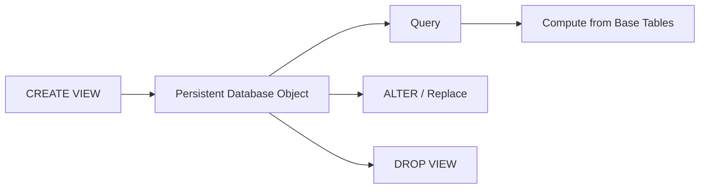
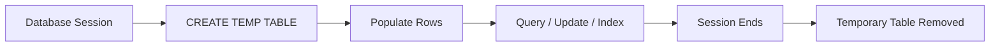
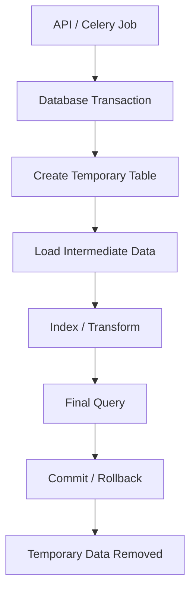
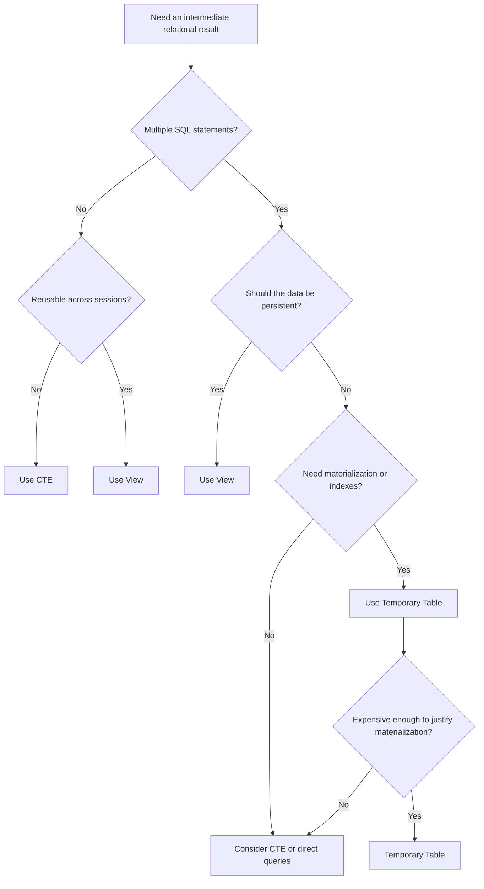

# 10- Views vs Temporary Tables

## Overview

Views and temporary tables both provide an intermediate relational layer between base tables and application queries, but they have fundamentally different lifecycles and purposes.

A **view** is a persistent database object that stores a query definition. A **temporary table** is a physical table created for intermediate data and normally exists only for a session or transaction, depending on the database and configuration.

The key distinction is:

```text
View
└── Persistent query definition
    └── Results are normally computed when queried

Temporary Table
└── Temporary stored relation
    └── Data is materialized and can be indexed/modified
```

This makes the choice primarily about **lifecycle, materialization, mutability, reuse, indexing, and workload characteristics**.

## Core Difference

| Characteristic | View | Temporary Table |
|---|---|---|
| Database object | Persistent | Temporary |
| Stores query definition | Yes | No |
| Stores result rows | Normally no | Yes |
| Lifetime | Persistent until dropped/changed | Usually session/transaction scoped |
| Can be queried multiple times | Yes | Yes, within its lifetime |
| Can be modified directly | Usually restricted | Yes |
| Can have indexes | Standard views generally no | Yes |
| Requires schema deployment | Usually yes | No |
| Useful for shared read models | Excellent | Poor |
| Useful for intermediate processing | Limited | Excellent |
| Useful for repeated access to computed data | Sometimes | Often |
| Supports procedural workflows | No | Yes, through multiple statements |
| Visibility | Potentially shared | Usually session-local |
| Persistence across application restarts | Yes | No |
| Main purpose | Abstraction/reuse | Temporary materialization |

## Views

A view gives a query a persistent name:

```sql
CREATE VIEW active_customers AS
SELECT
    customer_id,
    email,
    created_at
FROM customers
WHERE status = 'active';
```

Consumers can query it repeatedly:

```sql
SELECT *
FROM active_customers
WHERE created_at >= CURRENT_DATE - INTERVAL '30 days';
```

The view normally does not contain a separate copy of the rows. The database maintains the definition and resolves the view when it is queried.

### Best Use Cases

Views are appropriate when:

- Multiple consumers need the same query logic.
- The result represents a stable relational concept.
- You want to hide implementation details.
- You need a reusable read model.
- Database-level access control benefits from exposing selected columns.
- The underlying data should remain current.

Example:

```text
                    ┌── Django API
                    │
active_customers ───┼── Reporting
       VIEW         │
                    └── Admin queries
```

The view becomes a shared database abstraction.

## Temporary Tables

A temporary table stores actual rows for temporary use.

PostgreSQL example:

```sql
CREATE TEMP TABLE customer_totals AS
SELECT
    customer_id,
    SUM(total_amount) AS total_spend
FROM orders
WHERE status = 'completed'
GROUP BY customer_id;
```

The resulting data is physically represented as a temporary relation and can be queried repeatedly:

```sql
SELECT *
FROM customer_totals
WHERE total_spend > 10000;
```

You can also create indexes:

```sql
CREATE INDEX idx_customer_totals_spend
ON customer_totals (total_spend);
```

This is a major difference from a standard view.

### Best Use Cases

Temporary tables are useful when:

- An expensive intermediate result is reused multiple times.
- You need to index an intermediate dataset.
- Multiple SQL statements need to operate on the same intermediate data.
- You need to modify intermediate rows.
- A multi-step ETL or reporting workflow needs explicit stages.
- The intermediate result is large enough that repeatedly recomputing it is undesirable.

## Lifecycle

The lifecycle difference is critical.

### View Lifecycle



A view remains available to future sessions until it is changed or dropped.

### Temporary Table Lifecycle



The exact lifecycle semantics are database-specific. For example, PostgreSQL temporary tables normally exist for the duration of the session unless configured with a shorter lifetime such as transaction or statement scope.

## Materialization

The most important architectural difference is whether the intermediate result is stored.

### View

```text
Application Query
       |
       v
     View
       |
       v
Underlying Query
       |
       v
Base Tables
       |
       v
Current Result
```

The underlying query participates in query execution.

### Temporary Table

```text
Application / SQL Workflow
          |
          v
     Source Query
          |
          v
   Temporary Table
          |
     +----+----+
     |         |
     v         v
   Query A   Query B
```

The intermediate result has been materialized and can be reused.

This can be valuable when several later operations need the same expensive intermediate dataset.

## Performance Comparison

Neither construct is inherently faster.

A view can perform well when the optimizer can efficiently integrate its definition with the outer query.

A temporary table can perform better when:

- The intermediate result is expensive to compute.
- It is reused several times.
- The result can be indexed.
- Materializing it reduces repeated work.

But temporary tables also introduce costs:

- Writing rows.
- Reading them again.
- Temporary storage.
- Index creation.
- Statistics maintenance or analysis where relevant.
- Additional SQL statements.
- More complex transaction behavior.

The correct decision should be based on execution plans and workload characteristics.

## Example: Reusing an Expensive Intermediate Result

Suppose an analytics workflow repeatedly needs completed order totals.

### View

```sql
CREATE VIEW customer_order_totals AS
SELECT
    customer_id,
    SUM(total_amount) AS total_spend
FROM orders
WHERE status = 'completed'
GROUP BY customer_id;
```

A query can consume it:

```sql
SELECT *
FROM customer_order_totals
WHERE total_spend > 10000;
```

If several independent operations use the view, the underlying aggregation may be evaluated as part of those queries.

### Temporary Table

For a multi-step workflow:

```sql
CREATE TEMP TABLE customer_order_totals AS
SELECT
    customer_id,
    SUM(total_amount) AS total_spend
FROM orders
WHERE status = 'completed'
GROUP BY customer_id;

CREATE INDEX idx_customer_order_totals_customer
ON customer_order_totals (customer_id);

CREATE INDEX idx_customer_order_totals_spend
ON customer_order_totals (total_spend);
```

Now multiple operations can reuse the materialized dataset:

```sql
SELECT *
FROM customer_order_totals
WHERE total_spend > 10000;

SELECT COUNT(*)
FROM customer_order_totals
WHERE total_spend > 50000;
```

This is particularly useful when the intermediate result is expensive to compute and is reused enough times to justify materialization.

## Multi-Step Data Processing

Temporary tables become more useful when the workflow itself has multiple stages.

For example:

```text
orders
  |
  v
Filter completed orders
  |
  v
temporary_orders
  |
  v
Aggregate customer totals
  |
  v
customer_totals
  |
  v
Rank customers
  |
  v
final result
```

A view is generally better at representing a stable relational interface:

```text
orders
  |
  v
customer_order_metrics VIEW
  |
  v
Consumers
```

A temporary table is better suited to a controlled processing pipeline:

```text
Step 1 -> Materialize -> Transform -> Materialize -> Transform
```

This distinction matters in reporting jobs, ETL processes, migrations, and complex administrative operations.

## Indexing

### Views

A standard view does not normally have its own independently maintained indexes.

Indexes are created on the underlying tables:

```sql
CREATE INDEX idx_orders_customer_status
ON orders (customer_id, status);
```

The optimizer may use those indexes when executing queries through the view.

### Temporary Tables

Temporary tables can have indexes:

```sql
CREATE INDEX idx_temp_customer
ON customer_order_totals (customer_id);
```

This can significantly improve repeated lookups against a large intermediate dataset.

However, index creation is not free. For a small temporary table, an index may cost more to build than it saves during subsequent queries.

Use indexes based on actual access patterns.

## Statistics and Query Planning

Temporary tables can change the query-planning problem because the database is planning against a newly materialized relation.

For PostgreSQL workloads involving substantial temporary datasets, collecting statistics can improve plans:

```sql
ANALYZE customer_order_totals;
```

This can matter when subsequent joins or filters depend heavily on the distribution of values.

A production workflow should consider:

- Temporary table size.
- Index creation cost.
- Statistics quality.
- Join cardinality.
- Reuse count.
- Query plan stability.

Do not assume that materializing data automatically improves performance.

## Mutability

A standard view is primarily a read abstraction.

Some views can be updated, but updatability depends on the database and view definition.

Temporary tables are ordinary temporary relations from the perspective of SQL operations and can generally be:

- Inserted into.
- Updated.
- Deleted from.
- Indexed.
- Joined.
- Aggregated.

Example:

```sql
UPDATE customer_order_totals
SET total_spend = total_spend * 1.05
WHERE total_spend > 10000;
```

The change affects the temporary table, not the underlying `orders` table.

This makes temporary tables useful for workflows where intermediate data must be manipulated independently from source data.

## Security and Data Isolation

Views can be used as a database-level projection:

```sql
CREATE VIEW customer_directory AS
SELECT
    customer_id,
    display_name,
    created_at
FROM customers;
```

This can help expose only the columns required by a consumer, combined with appropriate database privileges.

Temporary tables provide a different kind of isolation: their contents are generally scoped to the database session.

However, temporary tables should not be treated as a substitute for authorization or tenant isolation.

For multi-tenant applications:

- Enforce tenant boundaries explicitly.
- Use parameterized queries.
- Apply database row-level security where appropriate.
- Avoid copying sensitive data into temporary structures unnecessarily.
- Ensure temporary data is not accidentally exposed through logs or debugging tools.

## Connection Pooling Considerations

Temporary tables require particular care in application environments that use connection pooling.

For example:

```text
Request A
   |
   v
Pooled Connection 17
   |
   +-- CREATE TEMP TABLE

Request A completes

Request B
   |
   v
Pooled Connection 17
   |
   +-- Temporary table may still exist
```

If the temporary table survives the transaction and the connection is returned to the pool, another request may receive the same physical database connection.

This can cause:

- Name collisions.
- Unexpected stale data.
- Incorrect assumptions about session state.
- Resource retention.
- Hard-to-debug application behavior.

### Safe Pattern

Prefer transaction-scoped temporary tables where the database supports them and the workflow fits that lifecycle.

PostgreSQL:

```sql
CREATE TEMP TABLE customer_totals (
    customer_id bigint,
    total_spend numeric(18, 2)
) ON COMMIT DROP;
```

This causes the temporary table to be dropped when the transaction commits.

For application-managed temporary tables, explicitly control lifecycle and avoid assuming that a pooled connection is dedicated to one request.

## Application Architecture

Temporary tables are generally best kept inside controlled database workflows rather than exposed as part of an application's persistent data model.

A typical architecture:



This works well for:

- Celery reporting jobs.
- Data migrations.
- Administrative scripts.
- ETL workflows.
- Bulk processing.
- Complex reconciliation tasks.

A persistent view has a different role:

```text
Django / FastAPI
      |
      v
Persistent View
      |
      v
Production Tables
```

The view can remain part of the database schema and serve many application requests.

## Transaction Behavior

Temporary tables interact with transactions differently from normal persistent tables depending on the database.

PostgreSQL provides explicit control:

```sql
CREATE TEMP TABLE staging_orders
ON COMMIT DROP
AS
SELECT *
FROM orders
WHERE created_at >= CURRENT_DATE;
```

Other options can change what happens at transaction boundaries.

Before using temporary tables in a production workflow, verify:

- Session lifetime.
- Transaction lifetime.
- Commit behavior.
- Rollback behavior.
- Connection-pool behavior.
- Temporary storage limits.

Do not assume lifecycle semantics are identical across PostgreSQL, MySQL, SQL Server, and other database engines.

## Operational Considerations

### Temporary Storage

Large temporary tables can consume substantial database resources.

Monitor:

- Temporary disk usage.
- Database I/O.
- Query duration.
- Temporary file creation.
- Memory pressure.
- Connection count.
- Transaction duration.

A temporary table is not "free" merely because it disappears later.

### Long Transactions

A workflow that creates and processes large temporary datasets inside one long transaction can increase:

- Resource consumption.
- Lock duration.
- Connection occupancy.
- Failure recovery time.

Keep transactions scoped to the actual consistency boundary.

### High Availability

Views are persistent schema objects and therefore participate naturally in normal database replication and backup workflows.

Temporary tables are session-local and generally are not part of the persistent database state that must be restored after a failover.

If a workflow depends on a temporary table, the workflow must be able to recreate it after:

- Connection loss.
- Transaction rollback.
- Database failover.
- Job retry.

This is especially important for Celery or batch-processing workloads.

## When to Use a View

Choose a view when:

- The data should be available to future sessions.
- Multiple consumers need the same relational abstraction.
- The logic represents a stable business or reporting concept.
- Consumers should not need to know the underlying joins.
- You need a persistent database-level permission boundary.
- You want current underlying data rather than a manually materialized snapshot.

Example:

```sql
CREATE VIEW order_summary AS
SELECT
    customer_id,
    COUNT(*) AS order_count,
    SUM(total_amount) AS total_spend
FROM orders
WHERE status = 'completed'
GROUP BY customer_id;
```

## When to Use a Temporary Table

Choose a temporary table when:

- Intermediate data is reused within one workflow.
- You need to index intermediate data.
- You need to modify intermediate rows.
- Multiple statements operate on the same materialized dataset.
- Recomputing the same intermediate result would be expensive.
- The dataset should disappear after the workflow.

Example:

```sql
CREATE TEMP TABLE eligible_orders
ON COMMIT DROP AS
SELECT
    order_id,
    customer_id,
    total_amount
FROM orders
WHERE status = 'completed'
  AND created_at >= CURRENT_DATE - INTERVAL '90 days';
```

## View vs Temporary Table vs CTE

In practice, the decision often includes CTEs as well.

| Requirement | CTE | View | Temporary Table |
|---|---|---|---|
| One SQL statement | Excellent | Possible | Possible |
| Multiple statements | No | Excellent | Excellent |
| Persistent reuse | No | Excellent | No |
| Query-local composition | Excellent | Limited | Limited |
| Materialized intermediate data | Not inherently | No, for standard views | Yes |
| Index intermediate result | No | No | Yes |
| Modify intermediate result | No | Limited | Yes |
| Shared database abstraction | No | Excellent | No |
| Complex multi-step workflow | Limited | Limited | Excellent |
| Recursive query | Excellent | Database-dependent | Possible after materialization |
| Controlled session lifetime | No | No | Yes |
| Current underlying data | Yes | Yes | No; snapshot at load time |

A useful mental model is:

```text
Need logic for one statement?
        |
        +--> CTE

Need a reusable database object?
        |
        +--> View

Need materialized intermediate data for a workflow?
        |
        +--> Temporary Table
```

## Decision Framework



## Production Pitfalls

### Creating Temporary Tables for Every Small Query

Temporary-table creation introduces additional database work.

For a simple transformation:

```sql
WITH eligible_orders AS (...)
SELECT ...
```

may be preferable to:

```sql
CREATE TEMP TABLE eligible_orders AS ...;
SELECT ...;
DROP TABLE eligible_orders;
```

Use materialization when it solves a real workload problem.

### Assuming Temporary Tables Are Always Faster

Materialization has costs.

A temporary table can be slower when:

- The result is small.
- The result is used once.
- Creating indexes dominates execution time.
- Writing and reading the temporary data costs more than recomputing it.

Benchmark using realistic data.

### Leaving Temporary State on Pooled Connections

Session-scoped temporary objects can outlive the request that created them.

Use transaction-scoped lifecycle where appropriate or explicitly clean up session state.

### Materializing Huge Datasets Without Limits

A large temporary table can consume significant memory or disk.

Filter early and project only required columns:

```sql
CREATE TEMP TABLE eligible_orders AS
SELECT
    order_id,
    customer_id,
    total_amount
FROM orders
WHERE status = 'completed';
```

Avoid:

```sql
CREATE TEMP TABLE eligible_orders AS
SELECT *
FROM orders;
```

unless every column is genuinely required.

### Using Temporary Tables as Persistent Storage

Temporary tables disappear by design.

Do not use them as a substitute for:

- Durable staging tables.
- Application state.
- Job checkpoints.
- Persistent caches.
- Materialized views.

If data must survive sessions or failures, use a persistent storage mechanism.

### Ignoring Connection Failures

A temporary table disappears with its session.

A job that assumes the temporary dataset survives a connection failure can produce incorrect results.

Design batch workflows to recreate temporary state safely after retries.

## Interview Traps

| Question | Correct Answer |
|---|---|
| Does a standard view normally store its result rows? | No. It normally stores a query definition. |
| Does a temporary table store rows? | Yes. Its data is materialized. |
| Can a temporary table have indexes? | Yes, subject to database-specific capabilities. |
| Can a standard view normally have its own indexes? | No. Indexes are generally defined on underlying tables; materialized views are different. |
| Which is better for a reusable database read model? | Usually a view. |
| Which is better for multi-step intermediate processing? | Often a temporary table. |
| Is a temporary table visible to every application session? | Normally no; its visibility is database/session dependent and typically session-local. |
| Is a temporary table automatically faster than a view? | No. Materialization has both benefits and costs. |
| Can a temporary table be modified? | Yes, unlike many standard views. |
| Does a view automatically cache its result? | No. A standard view is not a cache. |
| What should you consider with temporary tables and connection pools? | Session-scoped state can survive a request and affect a later request using the same connection. |
| What is another option for reusable but stored query results? | A materialized view may be appropriate when persistence and refresh semantics are desired. |

## Practical Comparison

| Scenario | Recommended | Reason |
|---|---|---|
| Shared customer read model | View | Persistent reusable abstraction |
| One complex API query | CTE | Query-local composition |
| Five statements reuse the same expensive intermediate result | Temporary table | Materialize once and reuse |
| Need an index on intermediate data | Temporary table | Can be indexed |
| Need to update intermediate rows | Temporary table | Supports mutations |
| Reporting definition shared by multiple teams | View | Centralized database contract |
| Expensive dashboard query with controlled freshness | Materialized view | Persistent precomputed result |
| Temporary ETL stage | Temporary table | Workflow-scoped materialization |
| Sensitive-column projection | View | Controlled relational projection |
| Small one-time transformation | CTE | Avoid unnecessary materialization |

## Key Takeaways

- **Views provide persistent, reusable query abstractions; temporary tables provide workflow-scoped materialized data.**
- **Use temporary tables when intermediate results need reuse, indexing, or mutation across multiple SQL statements.**
- **Do not assume temporary tables are faster—materialization, storage, indexing, and statistics introduce real costs.**
- **Connection pooling makes temporary-table lifecycle important because session-scoped state can outlive an application request.**
- **Choose among CTEs, views, and temporary tables based on scope, lifecycle, materialization, reuse, and execution-plan evidence.**