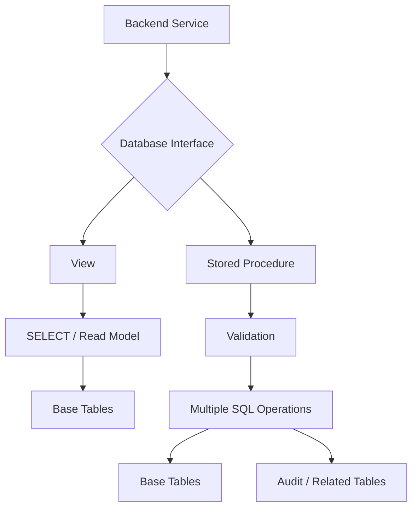
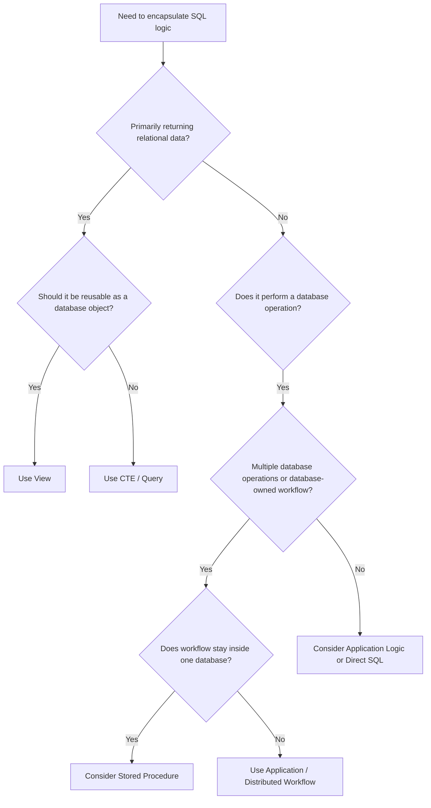

# 11- Views vs Stored Procedures

## Overview

Views and stored procedures both move database logic out of application code, but they solve different problems.

A **view** is primarily a named, reusable relational query. It is consumed like a table and is best suited for exposing a stable read model.

A **stored procedure** is executable database-side logic that can perform multiple operations, accept parameters, modify data, and implement procedural workflows depending on the database engine.

The distinction is therefore not simply "query versus code." It is about **data access abstraction versus database-side behavior**.

```text
                    Database Logic
                          |
              +-----------+-----------+
              |                       |
             View            Stored Procedure
              |                       |
       Reusable query          Executable workflow
              |                       |
        Read-oriented       Read + write + control flow
              |                       |
       SELECT FROM view      CALL procedure(...)
```

For production systems, choose based on ownership, transaction boundaries, performance, security, operational complexity, and how tightly the logic should be coupled to the database.

## Core Difference

| Characteristic | View | Stored Procedure |
|---|---|---|
| Primary purpose | Reusable query abstraction | Encapsulated database operation |
| Invoked as | `SELECT ... FROM view` | `CALL procedure(...)` or database-specific syntax |
| Parameters | Generally no runtime parameters | Yes |
| Returns relational result | Yes | Database-dependent |
| Read operations | Excellent | Excellent |
| Write operations | Limited/conditional | Excellent |
| Multiple SQL statements | No | Yes |
| Procedural control flow | No | Yes |
| Transactions | Participates in caller transaction | Database-dependent |
| Error handling | Query errors | Can implement procedural error handling |
| Reusable across applications | Yes | Yes |
| Application portability | High at SQL level | Lower due to procedural dialect |
| Indexes on object | Standard views: no | Procedure itself: no |
| Execution plan | Based on underlying query | Procedure statements are planned/executed according to DB engine |
| Best for | Read models and abstraction | Stateful or multi-step database workflows |

## Views

A view stores a query definition under a persistent database object name.

```sql
CREATE VIEW customer_order_summary AS
SELECT
    c.customer_id,
    c.email,
    COUNT(o.order_id) AS order_count,
    COALESCE(SUM(o.total_amount), 0) AS total_spend
FROM customers AS c
LEFT JOIN orders AS o
    ON o.customer_id = c.customer_id
GROUP BY
    c.customer_id,
    c.email;
```

Consumers query it like a relation:

```sql
SELECT
    customer_id,
    order_count,
    total_spend
FROM customer_order_summary
WHERE total_spend >= 10000;
```

A standard view normally does not store a separate copy of the result. The database executes the underlying relational expression when the view is queried.

### Why Use a View?

Views are useful when the same relational logic should be:

- Reused by multiple queries.
- Shared across applications or reporting systems.
- Hidden behind a stable database interface.
- Used to expose only selected columns.
- Kept synchronized with current underlying data.

For example, a Django or FastAPI service can consume a view without knowing how many joins or aggregations are required to produce the result.

## Stored Procedures

A stored procedure encapsulates executable database-side logic.

The exact syntax and capabilities vary significantly between database engines. PostgreSQL, SQL Server, Oracle, and MySQL have different procedural languages and transaction semantics.

A PostgreSQL example:

```sql
CREATE PROCEDURE archive_customer_orders(
    p_customer_id bigint
)
LANGUAGE plpgsql
AS $$
BEGIN
    UPDATE orders
    SET archived_at = CURRENT_TIMESTAMP
    WHERE customer_id = p_customer_id
      AND archived_at IS NULL;
END;
$$;
```

It can be invoked with:

```sql
CALL archive_customer_orders(42);
```

Unlike a view, the procedure represents an **operation**, not merely a named query.

## Why Stored Procedures Exist

Stored procedures are useful when database-side execution provides a meaningful advantage, such as:

- Atomic multi-step operations.
- Centralized data integrity workflows.
- High-volume database-side processing.
- Complex transactional operations.
- Reducing application/database round trips.
- Controlled access to underlying tables.
- Legacy database integration.
- Operations that must execute close to the data.

A procedure can combine:

```text
Validation
   |
   v
Read current state
   |
   v
Update multiple tables
   |
   v
Insert audit record
   |
   v
Return / commit according to database semantics
```

This is substantially different from a view.

## Read Model vs Operation

A useful mental model is:

```text
View:
"What data does this relational concept represent?"

Stored Procedure:
"What operation should the database perform?"
```

Example:

```sql
SELECT *
FROM customer_order_summary;
```

answers a **data access** question.

```sql
CALL archive_customer_orders(42);
```

represents an **operation**.

This distinction is useful when designing database APIs.

## Parameterization

One major advantage of stored procedures is accepting parameters.

A view is normally fixed at definition time:

```sql
CREATE VIEW active_orders AS
SELECT *
FROM orders
WHERE status = 'active';
```

The consumer can still filter the view:

```sql
SELECT *
FROM active_orders
WHERE customer_id = 42;
```

But it cannot supply a procedure-like parameter directly to the view definition.

A procedure can explicitly accept values:

```sql
CALL archive_customer_orders(42);
```

This makes procedures suitable for operations that depend on runtime inputs.

## Multi-Step Transactions

Stored procedures become useful when an operation consists of multiple dependent database actions.

Consider transferring account balance:

```text
Validate source account
        |
        v
Debit source
        |
        v
Credit destination
        |
        v
Insert audit record
```

A database-side routine can encapsulate this workflow.

However, transaction semantics are database-specific. In PostgreSQL, transaction control inside procedures has capabilities that differ from functions and from procedures in other database systems.

Do not assume that a stored procedure automatically creates an independent transaction.

The application and database transaction model must be understood explicitly.

## Example: Database-Side Business Operation

Suppose an order cancellation must:

1. Mark the order cancelled.
2. Restore inventory.
3. Record an audit event.

A procedure can encapsulate the database-side operation:

```sql
CREATE PROCEDURE cancel_order(
    p_order_id bigint,
    p_reason text
)
LANGUAGE plpgsql
AS $$
BEGIN
    UPDATE orders
    SET
        status = 'cancelled',
        cancelled_at = CURRENT_TIMESTAMP
    WHERE order_id = p_order_id
      AND status = 'confirmed';

    IF NOT FOUND THEN
        RAISE EXCEPTION 'Order % cannot be cancelled', p_order_id;
    END IF;

    INSERT INTO order_events (
        order_id,
        event_type,
        event_reason,
        created_at
    )
    VALUES (
        p_order_id,
        'cancelled',
        p_reason,
        CURRENT_TIMESTAMP
    );
END;
$$;
```

Application code can then call:

```sql
CALL cancel_order(12345, 'customer_request');
```

The procedure keeps related database operations close to the data.

However, if inventory is stored in another service or database, this approach does not solve distributed transaction consistency. A microservice architecture may instead require an application-level workflow, outbox pattern, saga, or event-driven design.

## View and Procedure Architecture



The view primarily exposes a **relational read interface**.

The procedure exposes a **database operation interface**.

## Performance

Neither views nor stored procedures are automatically faster.

### View Performance

A standard view normally adds a logical abstraction rather than materializing data.

The database optimizer may be able to push predicates through the view and optimize the resulting query.

For example:

```sql
SELECT *
FROM customer_order_summary
WHERE customer_id = 42;
```

can potentially be optimized using indexes on the underlying tables.

Performance depends on:

- Join strategy.
- Cardinality.
- Indexes.
- Aggregations.
- Predicate pushdown.
- Statistics.
- Query shape.
- Database optimizer behavior.

### Stored Procedure Performance

Stored procedures can reduce application/database round trips.

Without a procedure:

```text
Application -> UPDATE
Application -> INSERT
Application -> UPDATE
Application -> SELECT
```

With a database-side operation:

```text
Application -> CALL procedure
                    |
                    +--> UPDATE
                    +--> INSERT
                    +--> UPDATE
                    +--> SELECT
```

This can reduce network overhead and centralize execution.

But procedural code can also become slower or harder to optimize when it uses inefficient row-by-row processing.

Prefer set-based SQL operations where possible:

```sql
UPDATE orders
SET status = 'archived'
WHERE customer_id = p_customer_id
  AND status = 'completed';
```

over procedural loops that execute one statement per row.

## Set-Based SQL vs Procedural Loops

A common stored-procedure mistake is translating application loops directly into database procedural code.

Avoid patterns like:

```text
FOR each row
    UPDATE one row
END FOR
```

when a single set-based statement can perform the same operation.

Prefer:

```sql
UPDATE orders
SET status = 'archived'
WHERE customer_id = p_customer_id;
```

Set-based operations generally allow the database optimizer to choose better execution strategies and reduce statement overhead.

## Security

Views and procedures can both act as database access boundaries.

### Views for Read Access

A view can expose only the columns required by an application:

```sql
CREATE VIEW public_customer_profile AS
SELECT
    customer_id,
    display_name,
    created_at
FROM customers;
```

The application can be granted access to the view rather than the underlying table, depending on the database privilege model.

This can reduce accidental exposure of sensitive columns.

### Procedures for Controlled Writes

A procedure can expose a narrow write interface:

```text
Application
    |
    v
CALL cancel_order(...)
    |
    v
Database procedure
    |
    +--> validate
    +--> update
    +--> audit
```

The application may not need direct write privileges on every underlying table.

This can be useful for highly controlled database operations.

However, authorization still needs to be designed correctly. A procedure that accepts `customer_id` or `user_id` must not assume the caller is authorized to modify that entity merely because the procedure was invoked successfully.

## SQL Injection

Stored procedures do not automatically prevent SQL injection.

Unsafe dynamic SQL can still be vulnerable:

```sql
-- Conceptually unsafe if user-controlled input is concatenated
EXECUTE 'SELECT * FROM orders WHERE status = ''' || p_status || '''';
```

Use parameterized dynamic SQL mechanisms provided by the database.

For PostgreSQL:

```sql
EXECUTE
    'SELECT count(*) FROM orders WHERE status = $1'
USING p_status;
```

The same principle applies in application code:

- Parameterize values.
- Validate identifiers separately when dynamic SQL requires them.
- Avoid concatenating untrusted input into SQL.

## Maintainability

Stored procedures introduce a second programming environment.

A typical backend may already contain:

```text
Python
Django / FastAPI
SQL
Docker
CI/CD
Kubernetes
```

Adding:

```text
PL/pgSQL / T-SQL / PL/SQL
```

creates another language and deployment surface.

This is not inherently bad, but it increases engineering complexity.

Teams should establish:

- Procedure ownership.
- Code review standards.
- Migration strategy.
- Testing strategy.
- Version control.
- Rollback strategy.
- Database compatibility requirements.

Database routines should be treated as production code.

## Version Control and Deployment

Stored procedures and views should generally be managed through database migrations or schema-management tooling.

A migration might contain:

```sql
CREATE OR REPLACE VIEW customer_order_summary AS
SELECT
    customer_id,
    COUNT(*) AS order_count,
    SUM(total_amount) AS total_spend
FROM orders
WHERE status = 'completed'
GROUP BY customer_id;
```

The same principle applies to procedures.

Do not manually modify production procedures through an ad-hoc database console without recording the change in source control.

A production deployment should have a traceable relationship:

```text
Git Commit
    |
    v
Database Migration
    |
    v
View / Procedure Definition
    |
    v
Production Database
```

This is especially important when application releases depend on specific database behavior.

## Schema Coupling

Both views and procedures can tightly couple application behavior to database schema.

For example:

```text
Application
    |
    v
Stored Procedure
    |
    +--> orders
    +--> inventory
    +--> order_events
```

Changing any underlying schema may require changes to the procedure.

This coupling is acceptable when the database owns the workflow, but it becomes problematic when database routines become an undocumented application API.

Treat frequently consumed views and procedures as contracts.

## Portability

Views generally use standard SQL concepts, although advanced features remain database-specific.

Stored procedures are more strongly coupled to the database engine because procedural languages differ.

For example:

| Database | Procedural Technology |
|---|---|
| PostgreSQL | PL/pgSQL and other supported languages |
| SQL Server | T-SQL |
| Oracle | PL/SQL |
| MySQL | Stored-program SQL syntax |

A migration from PostgreSQL to SQL Server can therefore require substantial procedure rewrites.

This matters when portability is an explicit architectural requirement.

## Testing

### Testing Views

View testing should validate:

- Returned columns.
- Join behavior.
- Filtering.
- Aggregations.
- Null handling.
- Duplicate behavior.
- Permission boundaries.

Example:

```sql
SELECT *
FROM customer_order_summary
WHERE customer_id = 42;
```

Test the result against known fixtures.

### Testing Procedures

Procedure tests should validate:

- Valid inputs.
- Invalid inputs.
- Transaction behavior.
- Error handling.
- Concurrency behavior.
- Side effects.
- Idempotency where required.
- Audit records.
- Permission boundaries.

A procedure that updates several tables should be tested as an atomic business operation when atomicity is part of its contract.

## Concurrency Considerations

Stored procedures do not eliminate concurrency problems.

Suppose two requests attempt to modify the same inventory row:

```text
Request A ----+
              |
              v
         Stored Procedure
              |
              v
         Inventory Row
              ^
              |
Request B ----+
```

Correct behavior still depends on:

- Transaction isolation.
- Row-level locks.
- Constraints.
- Atomic updates.
- Serialization strategy.

Prefer database-enforced correctness where possible.

For example:

```sql
UPDATE inventory
SET quantity = quantity - 1
WHERE product_id = 100
  AND quantity > 0;
```

The affected-row count can then determine whether inventory was successfully reserved.

A stored procedure is not a replacement for concurrency control.

## High Availability and Disaster Recovery

Views and stored procedures are schema objects rather than application-local files.

They should therefore be included in:

- Schema migration workflows.
- Database replication strategy.
- Backup and restore validation.
- Disaster recovery procedures.
- Database version compatibility testing.

After a disaster recovery event, the database must contain the correct version of the view/procedure definitions expected by the deployed application.

For read replicas, verify whether the workload is compatible with replica routing. Read-only views can often be queried on replicas, while write procedures cannot.

## Observability

Database routines can make application behavior less visible if teams only monitor application-level metrics.

For production procedures, monitor:

- Execution duration.
- Invocation frequency.
- Error rate.
- Lock waits.
- Deadlocks.
- Rows affected.
- Query plans for expensive statements.
- Database CPU and I/O.
- Transaction duration.

Application telemetry should identify important database operations where possible.

For example:

```text
HTTP request
   |
   v
Service span
   |
   +--> DB CALL cancel_order
             |
             +--> UPDATE orders
             +--> INSERT order_events
```

This makes database-side work easier to diagnose.

## When to Use a View

Choose a view when the requirement is primarily:

- A reusable read model.
- A stable relational abstraction.
- Shared query logic.
- Column-level projection.
- Complex joins hidden behind a simple interface.
- Current data derived from underlying tables.

Example:

```sql
CREATE VIEW active_subscription_summary AS
SELECT
    customer_id,
    plan_id,
    started_at,
    expires_at
FROM subscriptions
WHERE status = 'active';
```

Then:

```sql
SELECT *
FROM active_subscription_summary
WHERE customer_id = 42;
```

## When to Use a Stored Procedure

Choose a stored procedure when the requirement is primarily:

- A database-side operation.
- Multiple dependent SQL statements.
- Controlled writes.
- Database-local transactional processing.
- High-volume data manipulation.
- Reduced application/database round trips.
- A deliberately database-owned workflow.

Example:

```sql
CALL cancel_order(12345, 'customer_request');
```

Use this deliberately rather than simply moving application logic into the database because the procedure happens to be convenient.

## When Not to Use a Stored Procedure

A stored procedure may be a poor choice when:

- Business logic primarily belongs in the application domain.
- The workflow spans multiple external services.
- The team has no operational expertise in database programming.
- Portability across database engines is important.
- The procedure would become a large procedural application hidden inside the database.
- Testing and deployment infrastructure cannot reliably manage database code.

For example:

```text
Order Service
   |
   +--> PostgreSQL
   +--> Payment Service
   +--> Inventory Service
   +--> Notification Service
```

A PostgreSQL procedure cannot provide a true atomic transaction across all of these independent systems.

The distributed workflow should usually be handled at the application or architecture level.

## View vs Stored Procedure vs Application Logic

The real architectural decision is often broader than two database objects.

| Requirement | View | Stored Procedure | Application Logic |
|---|---:|---:|---:|
| Reusable read query | Excellent | Possible | Possible |
| Stable relational interface | Excellent | Limited | Limited |
| Multi-table read | Excellent | Excellent | Excellent |
| Simple write | Poor | Good | Excellent |
| Multi-step database write | Limited | Excellent | Excellent |
| Cross-service workflow | No | Poor | Excellent |
| Domain orchestration | Poor | Limited | Excellent |
| Database-local atomicity | Indirect | Excellent | Depends on transaction boundary |
| Database portability | Good | Lower | Usually better |
| Database-side performance optimization | Good | Excellent | Limited by round trips |
| Shared database logic | Excellent | Excellent | Depends on consumers |
| Procedural control flow | No | Excellent | Excellent |

## Practical Decision Framework



## Common Mistakes

### Using a Procedure for Every Business Rule

Not every business rule belongs in the database.

If the rule requires:

- External APIs.
- Redis.
- Kafka.
- Email.
- Payment providers.
- Multiple microservices.

it is generally an application or distributed-system concern.

### Treating Views as Caches

A standard view normally does not cache query results.

If the goal is to persist computed results for faster reads, consider a **materialized view**, cache, summary table, or other explicitly materialized design.

### Creating Massive Stored Procedures

A procedure containing hundreds or thousands of lines can become difficult to:

- Test.
- Review.
- Debug.
- Deploy.
- Observe.
- Refactor.

Keep database routines focused on database-local responsibilities.

### Ignoring Transaction Semantics

A procedure does not automatically mean "everything is atomic forever."

Understand:

- Caller transaction.
- Procedure semantics.
- Database isolation level.
- Commit/rollback behavior.
- Error propagation.

### Assuming Procedures Solve Race Conditions

Concurrency correctness still requires appropriate:

- Constraints.
- Locks.
- Atomic statements.
- Isolation levels.
- Idempotency.

### Dynamic SQL Without Parameterization

Dynamic SQL can introduce SQL injection and plan-management problems.

Use parameterized execution mechanisms provided by the database.

### Manual Production Changes

Changing a view or procedure manually without a migration creates schema drift.

Keep definitions in source control and deploy them through the same controlled CI/CD path as other database changes.

## Production Recommendations

For a production backend system:

- Treat views and procedures as versioned application dependencies.
- Store definitions in migrations or dedicated database source files.
- Review database routines like application code.
- Keep procedures focused on database-local responsibilities.
- Prefer set-based SQL over row-by-row procedural loops.
- Measure execution plans instead of assuming database-side logic is faster.
- Document transaction and locking expectations.
- Test failure and concurrency paths.
- Monitor procedure execution and database resource usage.
- Avoid using stored procedures to orchestrate independent microservices.
- Use views for stable read models rather than embedding repeated joins throughout application code.
- Reassess complex database logic when schema ownership or service boundaries change.

## Interview Traps

| Question | Correct Answer |
|---|---|
| Is a view executable business logic? | Primarily no; it is a named relational query abstraction. |
| Can a stored procedure accept parameters? | Yes. |
| Can a stored procedure modify data? | Yes, subject to database capabilities and permissions. |
| Does a standard view normally store result rows? | No. |
| Can a view perform complex joins and aggregations? | Yes. |
| Can a standard view contain arbitrary procedural control flow? | No. |
| Are stored procedures portable across databases? | Generally less portable because procedural languages differ. |
| Are stored procedures automatically faster? | No. They can reduce round trips, but execution still depends on SQL, plans, indexes, and workload. |
| Do procedures automatically solve transaction and concurrency problems? | No. Transaction and locking semantics still matter. |
| Should a stored procedure orchestrate payment and Kafka publishing atomically? | No. A database procedure cannot provide atomicity across independent external systems. |
| Is a view a cache? | No. A standard view normally represents a query definition rather than cached results. |
| When is a view usually preferable? | When exposing a reusable relational read model. |
| When is a procedure usually preferable? | When encapsulating a database-local operation involving multiple SQL statements or controlled writes. |

## Key Takeaways

- **Use views to expose reusable relational read models; use stored procedures to encapsulate executable database operations.**
- **Stored procedures are valuable for database-local multi-step workflows, controlled writes, and reducing application/database round trips.**
- **Do not move cross-service business workflows into stored procedures; database transactions cannot provide atomicity across independent services.**
- **Treat views and procedures as production code: version them, test them, monitor them, and deploy them through controlled migrations.**
- **Choose database-side logic based on ownership, transaction boundaries, performance evidence, maintainability, and service architecture—not merely convenience.**