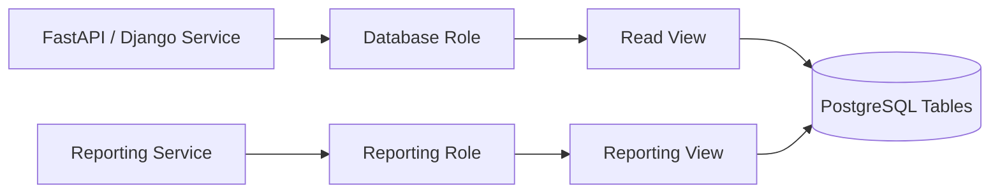

# 12- View Security Use Cases

## Overview

A SQL view can act as a **database-level security boundary** by exposing a controlled representation of underlying tables instead of granting applications or users direct access to those tables.

The primary security value of a view is not that it automatically makes data secure. Its value comes from combining:

- Restricted column exposure.
- Restricted row exposure.
- Controlled privileges.
- Stable database interfaces.
- Separation between consumers and sensitive base tables.

A common production pattern is:

```text
                    Application / Analyst
                            |
                            v
                    +---------------+
                    |   SQL View    |
                    +---------------+
                       /           \
                      v             v
             Allowed Columns    Allowed Rows
                      \             /
                       v           v
                    Base Tables
```

Views are especially useful when different consumers need different representations of the same underlying data.

For example, an `employees` table may contain:

```text
employee_id
name
department
email
salary
national_id
bank_account
```

An application that displays employee directories may only need:

```text
employee_id
name
department
email
```

A view can expose exactly that subset without requiring every consumer to understand or access the full table.

## Security Model

A view should be understood as one layer in a broader database authorization model:

```text
Identity
   |
   v
Database Role
   |
   v
Privileges
   |
   v
View
   |
   +---- Allowed columns
   |
   +---- Allowed rows
   |
   v
Underlying tables
```

Security depends on the interaction between:

- Authentication.
- Database roles.
- `GRANT` / `REVOKE` privileges.
- View definitions.
- Ownership.
- Execution context.
- Row-level security where supported.
- Application authorization.

A view alone does not replace authentication or authorization.

## Column-Level Data Exposure

One of the simplest security use cases is hiding sensitive columns.

Suppose the base table contains:

```sql
CREATE TABLE customers (
    customer_id bigint PRIMARY KEY,
    email text NOT NULL,
    display_name text NOT NULL,
    phone text,
    internal_notes text,
    tax_identifier text,
    created_at timestamptz NOT NULL
);
```

A customer-support application may only need:

```sql
CREATE VIEW support_customer_directory AS
SELECT
    customer_id,
    email,
    display_name,
    phone,
    created_at
FROM customers;
```

The application can query:

```sql
SELECT *
FROM support_customer_directory
WHERE customer_id = 42;
```

The sensitive columns are not part of the view interface.

### Why This Helps

Without the view, an application account might receive:

```sql
GRANT SELECT ON customers TO support_app;
```

which exposes every selectable column.

With a view:

```sql
GRANT SELECT ON support_customer_directory TO support_app;
```

the database interface can expose only the intended projection.

This is particularly useful for:

- Personally identifiable information.
- Financial fields.
- Internal operational metadata.
- Security-related metadata.
- Internal notes.
- Secrets or credential-related columns.

## Row-Level Data Exposure

Views can also restrict which rows are exposed.

For example, an application may only need active customers:

```sql
CREATE VIEW active_customers AS
SELECT
    customer_id,
    email,
    display_name,
    created_at
FROM customers
WHERE status = 'active';
```

The consumer queries:

```sql
SELECT *
FROM active_customers;
```

The inactive records are excluded by the view definition.

This is useful for creating explicit read models such as:

- Active subscriptions.
- Open support tickets.
- Published products.
- Non-deleted records.
- Approved transactions.
- Current account balances.

However, do not assume that filtering rows in a view automatically provides strong tenant isolation. Multi-tenant authorization often requires stronger mechanisms such as database row-level security.

## Multi-Tenant Security

Consider a SaaS database:

```text
organizations
customers
orders
```

where every order belongs to an organization.

A view could expose organization-specific data:

```sql
CREATE VIEW organization_orders AS
SELECT
    order_id,
    organization_id,
    customer_id,
    total_amount,
    status,
    created_at
FROM orders
WHERE deleted_at IS NULL;
```

However, this does **not** automatically mean a user can only access their own organization.

A query such as:

```sql
SELECT *
FROM organization_orders
WHERE organization_id = 123;
```

still depends on the caller being authorized to request organization `123`.

For strong database-enforced tenant isolation, PostgreSQL Row-Level Security can be a better fit:

```text
Application
    |
    v
Database Role
    |
    v
RLS Policy
    |
    v
View / Table
    |
    v
Only authorized tenant rows
```

The important distinction is:

> A view can restrict data exposed by its definition; authorization determines whether a caller is allowed to access a particular row.

## Combining Views with Row-Level Security

Views and row-level security can complement each other.

For example:

```text
              Application
                   |
                   v
             Customer View
                   |
                   v
             Base Table
                   |
                   v
              RLS Policy
                   |
                   v
          Authorized Tenant Rows
```

The view can define the shape of the data while RLS enforces row-level access.

This gives two independent controls:

| Control | Responsibility |
|---|---|
| View projection | Which columns are exposed |
| View filtering | Which rows are represented by the view |
| Database privileges | Which objects a role can access |
| RLS | Which rows a role is permitted to access |
| Application authorization | Which application actions a user can perform |

This separation is preferable to relying on one mechanism for every security requirement.

## Granting Access to Views Instead of Tables

A common production pattern is to expose views to application roles while withholding direct access to base tables.

Conceptually:

```sql
REVOKE ALL ON customers FROM support_app;

GRANT SELECT
ON support_customer_directory
TO support_app;
```

The exact privilege model and required grants depend on the database engine and ownership configuration.

The intended access pattern becomes:

```text
support_app
     |
     | SELECT
     v
support_customer_directory
     |
     | controlled access
     v
customers
```

This creates a narrower database contract.

### Why This Is Useful

It reduces the number of database objects an application can directly access.

Instead of:

```text
Application
   |
   +--> customers
   +--> payments
   +--> employees
   +--> audit_logs
   +--> credentials
```

the application can receive:

```text
Application
   |
   +--> customer_directory
   +--> order_summary
   +--> active_subscriptions
```

This is a useful application of the **principle of least privilege**.

## Hiding Sensitive Columns Is Not Encryption

A view that omits a sensitive column does not encrypt that data.

For example:

```sql
CREATE VIEW public_users AS
SELECT
    user_id,
    username
FROM users;
```

This prevents consumers of the view from seeing other columns through that view, assuming appropriate privileges.

It does not protect the underlying data from:

- Database administrators.
- Roles with direct table access.
- Backups.
- Compromised privileged accounts.
- Other database interfaces with sufficient privileges.

Use encryption, secret management, access controls, and appropriate database security mechanisms for data requiring stronger protection.

## Preventing Accidental Data Exposure

Views can provide a stable interface that makes accidental exposure less likely.

Suppose application code historically executes:

```sql
SELECT *
FROM customers;
```

A schema change adds:

```text
social_security_number
```

The application may unexpectedly gain access to the new column if its database role has direct table access.

A view using an explicit projection:

```sql
CREATE VIEW customer_directory AS
SELECT
    customer_id,
    email,
    display_name,
    created_at
FROM customers;
```

does not automatically expose newly added columns.

This is an important security advantage of explicit column lists.

### Avoid `SELECT *` in Security-Sensitive Views

Prefer:

```sql
CREATE VIEW customer_directory AS
SELECT
    customer_id,
    email,
    display_name,
    created_at
FROM customers;
```

over:

```sql
CREATE VIEW customer_directory AS
SELECT *
FROM customers;
```

Explicit projections make the security contract visible and stable.

## PII Reduction

Views are useful for exposing only the minimum personally identifiable information required by a consumer.

For example:

```sql
CREATE VIEW customer_reporting AS
SELECT
    customer_id,
    country,
    customer_segment,
    created_at
FROM customers;
```

A reporting workload may not need:

```text
email
phone
address
government identifiers
payment information
```

Reducing unnecessary exposure is valuable even when the consumer technically has permission to access the database.

This supports a broader **data minimization** strategy.

## Analytics and Reporting

Reporting users frequently need aggregated business data rather than raw records.

A view can expose summarized information:

```sql
CREATE VIEW monthly_revenue AS
SELECT
    DATE_TRUNC('month', created_at) AS month,
    SUM(total_amount) AS revenue,
    COUNT(*) AS order_count
FROM orders
WHERE status = 'completed'
GROUP BY DATE_TRUNC('month', created_at);
```

A reporting role can query:

```sql
SELECT *
FROM monthly_revenue
ORDER BY month;
```

This can reduce direct access to customer-level transaction data.

However, aggregation does not automatically guarantee anonymity.

Small groups can sometimes allow sensitive information to be inferred through combinations of filters or repeated queries.

For highly sensitive analytics, additional controls may be necessary.

## Security Through Stable Interfaces

A view can decouple consumers from the physical database schema.

Instead of allowing:

```text
Application -> Internal Tables
```

use:

```text
Application -> Public View -> Internal Tables
```

The view becomes a database API.

This can be particularly useful when:

- Multiple applications share a database.
- Legacy systems depend on the schema.
- Internal tables are frequently refactored.
- Different consumers require different representations.

The view can preserve a stable contract while underlying implementation changes.

## Views Across Sensitive Domains

Common examples include:

| Domain | Sensitive Base Data | Safer View |
|---|---|---|
| HR | Salary, tax identifiers, bank details | Employee directory |
| Payments | Card/payment metadata | Transaction summary |
| Healthcare | Clinical records | Operational appointment view |
| SaaS | Other tenants' records | Tenant-scoped read model |
| E-commerce | Customer PII | Order summary |
| Security | Authentication metadata | Operational account status |
| Finance | Account-level transactions | Aggregated reporting view |

The exact security boundary depends on the organization's authorization model and compliance requirements.

## Application Architecture

Views can be particularly useful in backend services that have read-heavy workloads.

For example:



Different roles can receive different database interfaces over the same underlying schema.

This is often cleaner than granting every service broad access to every table.

## Security and Django / FastAPI

Application frameworks still perform user-level authorization.

A typical request flow is:

```text
HTTP Request
    |
    v
Authentication
    |
    v
Application Authorization
    |
    v
Database Connection / Role
    |
    v
Secure View
    |
    v
Database
```

A database view should not be treated as a replacement for:

- Django permissions.
- FastAPI dependency-based authorization.
- OAuth scopes.
- JWT claims.
- Service-to-service authentication.
- Tenant authorization.

Instead, it can provide an additional database-level defense.

## Defense in Depth

For sensitive systems, use multiple independent controls:

```text
                    User
                     |
                     v
              Authentication
                     |
                     v
              Authorization
                     |
                     v
              Service Account
                     |
                     v
              Database Role
                     |
                     v
                  View
                     |
                     v
                   RLS
                     |
                     v
               Base Tables
```

Each layer should have a clear responsibility.

For example:

- Application authorization decides whether a user can perform an operation.
- Database roles restrict accessible objects.
- Views restrict exposed columns and representations.
- RLS restricts row visibility.
- Encryption protects data at rest or in transit.

Avoid assuming that one layer can compensate for every failure in another.

## View Security and SQL Injection

Views do not eliminate SQL injection.

Suppose application code executes:

```sql
SELECT *
FROM customer_directory
WHERE email = 'user-controlled-value';
```

The application must still use parameterized queries.

For Python:

```python
cursor.execute(
    """
    SELECT customer_id, display_name
    FROM customer_directory
    WHERE email = %s
    """,
    [email],
)
```

A secure view and insecure application query can still result in SQL injection.

Security controls solve different problems.

## Security Definer and Security Invoker

Some databases support different execution-security models for views and routines.

PostgreSQL, for example, has historically provided view behavior involving the view owner's privileges, while newer PostgreSQL versions also provide options such as `security_invoker` for views.

This distinction matters when combining views with:

- Row-level security.
- Ownership.
- Table privileges.
- Cross-schema access.

Do not assume that "the caller's permissions always apply to everything underneath the view."

Before deploying a security-sensitive view, verify the database engine's exact privilege and execution semantics for the version in use.

## Cross-Schema Security

A common PostgreSQL architecture separates schemas:

```text
app
├── public application objects
└── secure internal objects
```

For example:

```text
internal.customers
public.customer_directory
```

The application role can receive access to:

```sql
public.customer_directory
```

while direct access to:

```sql
internal.customers
```

is restricted.

This provides a clearer security boundary than exposing every object in one schema.

## Common Security Mistakes

### Granting Table Access Alongside View Access

A view provides little isolation if the same role also has:

```sql
GRANT SELECT ON customers TO application_role;
```

The application can simply bypass the view.

If the view is intended as the security boundary, verify that the consumer role cannot bypass it.

### Using `SELECT *`

A future schema change can unintentionally expose new columns.

Use explicit columns in security-sensitive views.

### Assuming WHERE Means Authorization

This:

```sql
WHERE organization_id = 42
```

does not prove that the caller is authorized to access organization `42`.

Use proper authorization or RLS where appropriate.

### Treating Views as Encryption

A view hides columns from a particular access path; it does not encrypt the underlying data.

### Ignoring View Ownership

Ownership and privilege behavior can determine whether consumers can reach underlying tables.

Always test access using the actual production-like database role.

### Relying Only on Application Authorization

A compromised application credential may bypass application-level checks if the database role has excessive privileges.

Database-level controls provide defense in depth.

### Forgetting Schema Privileges

In PostgreSQL, object privileges are not the only concern. Schema-level access such as `USAGE` can also affect whether a role can resolve and access objects.

Security testing should use the real role and schema configuration.

## Production Security Checklist

Before using a view as a security boundary, verify:

- [ ] The view contains only required columns.
- [ ] The view uses explicit column names rather than `SELECT *`.
- [ ] Row filtering is intentional and tested.
- [ ] Consumer roles do not have unnecessary direct table privileges.
- [ ] Schema privileges are restricted appropriately.
- [ ] View ownership and execution semantics are understood.
- [ ] RLS is used when strong row-level tenant isolation is required.
- [ ] Application authorization remains in place.
- [ ] SQL queries against the view are parameterized.
- [ ] Sensitive data is encrypted where required.
- [ ] Access is tested using the actual application database role.
- [ ] Schema migrations are reviewed for accidental exposure.
- [ ] View definitions are version-controlled.
- [ ] Security-sensitive changes are covered by automated tests.
- [ ] Database audit and access logging meet operational requirements.

## Testing View Security

Do not test only:

```sql
SELECT *
FROM customer_directory;
```

Test privileges directly.

For example, using a dedicated test role:

```sql
SET ROLE support_app;

SELECT *
FROM support_customer_directory;

SELECT *
FROM customers;
```

The second query should fail if direct table access is intentionally prohibited.

Also test:

- Sensitive columns.
- Restricted rows.
- Cross-tenant access.
- Newly added columns.
- View replacement during migrations.
- RLS interaction.
- Role changes.
- Production-like schema privileges.

Security tests should verify **what the role cannot do**, not only what it can do.

## Operational Considerations

Views should be treated as security-sensitive database code when they define access boundaries.

Changes such as:

```sql
CREATE OR REPLACE VIEW ...
```

should go through the normal migration and review process.

Monitor:

- Unexpected access failures.
- Permission changes.
- Queries against sensitive views.
- Direct access attempts against protected tables.
- Changes to view definitions.
- Database role modifications.

For regulated environments, retain appropriate audit records according to organizational and compliance requirements.

## Performance and Security Trade-Offs

Security views can introduce additional query complexity, especially when they contain:

- Multiple joins.
- Aggregations.
- Nested views.
- Complex predicates.
- Security-related filters.

The security boundary should not be implemented blindly.

For high-volume production workloads:

1. Inspect the actual execution plan.
2. Ensure underlying predicates can use appropriate indexes.
3. Monitor query latency.
4. Avoid unnecessary joins and columns.
5. Consider materialized views for suitable read-only reporting workloads.
6. Reevaluate whether a view or a dedicated read model is the right abstraction.

Security correctness comes first, but poor query design can still create operational failures.

## View Security vs Other Controls

| Security Requirement | View | RLS | DB Role | Application Authorization | Encryption |
|---|---:|---:|---:|---:|---:|
| Hide columns | Strong | No | Partial | Partial | Yes, different purpose |
| Filter rows | Yes | Strong | No | Yes | No |
| Tenant isolation | Limited | Strong | Limited | Strong | No |
| Restrict object access | No | No | Strong | No | No |
| Protect data if storage is compromised | No | No | No | No | Yes |
| Enforce user permissions | No | Database-level | Database-level | Strong | No |
| Stable read interface | Strong | No | No | Possible | No |
| Reduce accidental exposure | Strong | Strong | Strong | Strong | No |

These controls are complementary rather than interchangeable.

## Key Takeaways

- **Use views to expose only the columns and rows a consumer actually needs, reducing unnecessary data access.**
- **A view is not an authorization system by itself; combine views with database roles, application authorization, and RLS when stronger isolation is required.**
- **Security-sensitive views should use explicit column lists and must not be bypassable through unnecessary direct privileges on underlying tables.**
- **Test the actual database role, including what it cannot access, because ownership, schema privileges, and execution semantics affect the real security boundary.**
- **Treat security views as production security code: version-control them, review migrations, monitor access, and reassess their performance and isolation guarantees as the system evolves.**