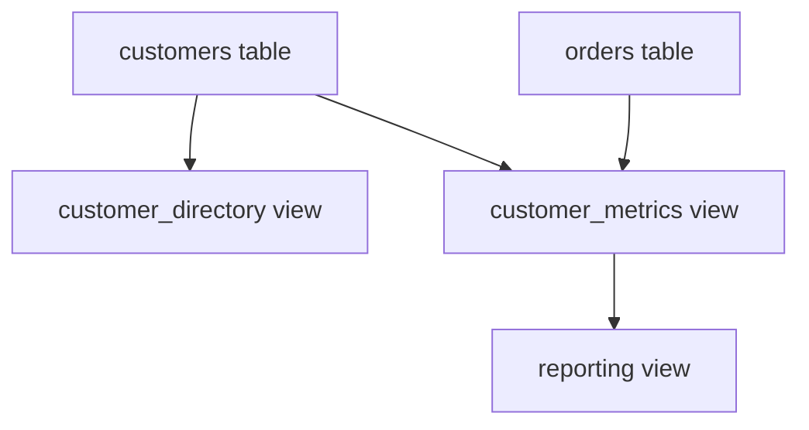
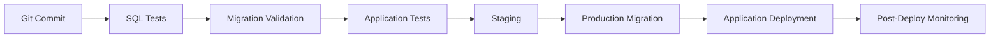

# 13- View Maintenance

## Overview

SQL views are database objects that encapsulate a query behind a stable name. In production systems, the difficult part is rarely creating the view; it is keeping the view correct, performant, secure, and compatible as the underlying schema and application evolve.

View maintenance includes:

- Updating view definitions when source tables change.
- Managing dependencies between tables, views, functions, and schemas.
- Preserving application compatibility during migrations.
- Monitoring query performance.
- Managing indexes or materialized-view refreshes where applicable.
- Testing security and permissions.
- Removing obsolete views safely.
- Version-controlling view definitions alongside database migrations.

A useful mental model is:

```text
Application
    |
    v
    View
    |
    +----------------+
    |                |
    v                v
Base Table       Other Views
    |
    v
Schema / Indexes
```

A view is therefore part of the database's application interface. Changing it can have consequences similar to changing an API contract.

## Why View Maintenance Matters

A view may initially be simple:

```sql
CREATE VIEW active_orders AS
SELECT
    order_id,
    customer_id,
    total_amount
FROM orders
WHERE status = 'active';
```

Months later, the `orders` table may evolve:

```text
orders
├── order_id
├── customer_id
├── total_amount
├── status
├── currency
├── created_at
└── deleted_at
```

The view may now need to account for:

- Soft deletion.
- New business rules.
- Additional columns.
- Changed status semantics.
- New tenant-isolation requirements.
- Performance requirements.

If views are treated as disposable SQL instead of managed database code, they can become a source of correctness and operational problems.

## Treat Views as Version-Controlled Code

Production views should normally be defined in migration files or another version-controlled database deployment mechanism.

A migration might contain:

```sql
CREATE VIEW active_orders AS
SELECT
    order_id,
    customer_id,
    total_amount,
    currency,
    created_at
FROM orders
WHERE status = 'active'
  AND deleted_at IS NULL;
```

The repository should make it possible to determine:

- Which version of the view is deployed.
- Which migration introduced it.
- Which migration changed it.
- Which application version expects its current shape.
- Which tables and objects it depends on.

For Django applications, views can be managed through custom database migrations. For FastAPI or other frameworks, the same principle applies through the project's migration system, such as Alembic.

The important property is **repeatability** rather than the specific migration tool.

## View Definition Changes

The safest way to modify a view depends on the database engine and the nature of the change.

A conceptual change might be:

```sql
CREATE OR REPLACE VIEW active_orders AS
SELECT
    order_id,
    customer_id,
    total_amount,
    currency,
    created_at
FROM orders
WHERE status = 'active'
  AND deleted_at IS NULL;
```

`CREATE OR REPLACE VIEW` is useful for compatible definition changes, but its exact behavior and restrictions are database-specific.

For example, some databases place restrictions on changing:

- Existing column names.
- Column ordering.
- Column data types.
- Dependencies.
- Ownership.
- Permissions.

Do not assume that replacing a view is equivalent to replacing arbitrary application code.

## Additive vs Breaking Changes

View changes should be classified as either compatible or breaking.

| Change | Typical Risk |
|---|---|
| Add a nullable/optional output column | Medium |
| Remove an existing column | High |
| Rename an output column | High |
| Change column type | High |
| Change row-filtering semantics | High |
| Change aggregation semantics | High |
| Add an expensive join | Medium/High |
| Change security behavior | Critical |
| Change ordering guarantees | High if consumers depend on it |
| Replace underlying table | Medium/High |

A view used by multiple services should be treated as a shared contract.

## Column Compatibility

Suppose an API expects:

```sql
SELECT
    order_id,
    total_amount
FROM active_orders;
```

Changing:

```sql
total_amount numeric
```

to:

```sql
total_amount text
```

can break application code even though the view still exists.

Similarly:

```sql
SELECT order_id, total_amount
FROM active_orders;
```

may behave differently if `total_amount` changes from a numeric value to a formatted string.

When changing a view, consider both:

- SQL compatibility.
- Consumer compatibility.

## Renaming View Columns

Renaming an output column is often a breaking change.

Instead of immediately changing:

```text
customer_name
```

to:

```text
display_name
```

a safer migration may temporarily expose both:

```sql
CREATE OR REPLACE VIEW customer_directory AS
SELECT
    customer_id,
    name AS customer_name,
    name AS display_name
FROM customers;
```

Consumers can migrate to `display_name` before `customer_name` is removed.

The exact approach depends on database support and whether duplicate semantic columns are acceptable.

This follows the same principle as backward-compatible API evolution.

## Changing Underlying Tables

Changing a base table does not necessarily require changing every dependent view, but it should trigger dependency analysis.

For example:

```text
orders
   |
   +--> active_orders
   |
   +--> customer_order_summary
   |
   +--> monthly_revenue
```

If `orders.status` changes from:

```text
active
completed
cancelled
```

to:

```text
pending
processing
fulfilled
cancelled
```

multiple views may require updates.

A senior engineer should ask:

> Which database objects depend on this schema element, and do their semantics remain correct?

## Dependency Management

Views can depend on:

- Tables.
- Other views.
- Functions.
- Types.
- Schemas.
- Expressions.
- Extensions.
- Materialized views in some architectures.

This creates a dependency graph:



Changing `customers` can therefore affect multiple layers.

Avoid managing views individually without understanding the dependency graph.

## Nested Views

A view can reference another view:

```sql
CREATE VIEW customer_metrics AS
SELECT
    customer_id,
    COUNT(*) AS order_count
FROM active_orders
GROUP BY customer_id;
```

This can improve logical reuse, but deep view chains can become difficult to maintain.

For example:

```text
View A
  -> View B
      -> View C
          -> View D
              -> Tables
```

Potential problems include:

- Difficult query plans.
- Harder debugging.
- Unexpected predicate behavior.
- Complex dependency management.
- More difficult migrations.
- Difficult ownership and privilege analysis.

Keep view layers reasonably shallow unless the abstraction provides clear value.

## View Maintenance During Schema Migrations

A migration should consider both the schema and dependent views.

Suppose a table column is being removed:

```sql
ALTER TABLE orders
DROP COLUMN legacy_status;
```

If a view still references `legacy_status`, the migration may fail or the view may become invalid depending on the database engine and operation.

A safer migration process is:

```text
Identify dependencies
        |
        v
Update dependent views
        |
        v
Deploy compatible application code
        |
        v
Remove obsolete consumers
        |
        v
Remove obsolete schema
```

The exact ordering depends on database behavior and deployment strategy.

## Zero-Downtime Deployments

Views require special attention during rolling deployments.

Consider:

```text
Application v1 -> View v1
Application v2 -> View v2
```

During a rolling deployment, both application versions may temporarily run simultaneously.

If the view changes immediately to a shape understood only by v2, v1 may fail.

A safer strategy is often:

```text
Phase 1
Application v1
        |
        v
Compatible View

Phase 2
Application v1 + v2
        |
        v
Backward-compatible View

Phase 3
Application v2
        |
        v
New View Contract

Phase 4
Remove legacy compatibility
```

This is the database equivalent of backward-compatible API evolution.

## Expand-and-Contract Pattern

For breaking database changes, use an expand-and-contract approach.

### Expand

Introduce the new representation while keeping the old one:

```sql
CREATE OR REPLACE VIEW order_summary AS
SELECT
    order_id,
    total_amount,
    total_amount AS amount
FROM orders;
```

### Migrate Consumers

Update applications to use:

```text
amount
```

instead of:

```text
total_amount
```

### Contract

After all consumers have migrated, remove the legacy representation.

This pattern reduces deployment coupling across services.

## Testing Views

A view should have automated tests when it is important to application correctness or security.

Test at several levels.

### Shape Tests

Verify expected columns and types.

For example:

```sql
SELECT *
FROM active_orders
LIMIT 0;
```

The application or migration test suite can verify the expected schema.

### Data Semantics Tests

Verify filtering:

```sql
SELECT COUNT(*)
FROM active_orders
WHERE status <> 'active';
```

The expected result should be zero if the view's contract is "active orders."

Also test:

- Soft-deleted records.
- NULL values.
- Boundary dates.
- Duplicate rows.
- Join behavior.
- Aggregation correctness.
- Tenant boundaries.

### Permission Tests

Use the actual consumer role:

```sql
SET ROLE reporting_app;

SELECT *
FROM customer_reporting;
```

Then verify that unauthorized base tables cannot be accessed directly.

### Performance Tests

Test representative workloads:

```sql
EXPLAIN (ANALYZE, BUFFERS)
SELECT *
FROM active_orders
WHERE customer_id = 1001;
```

Do not rely only on unit-level correctness tests.

## Performance Maintenance

A normal view does not usually store its query result. Querying it generally causes the database optimizer to plan and execute the underlying query.

Conceptually:

```text
SELECT FROM view
       |
       v
Expand view definition
       |
       v
Optimize query
       |
       v
Execute against base tables
```

Therefore, maintaining a view's performance usually means maintaining the performance of the underlying query.

Review:

- Indexes.
- Join conditions.
- Filter predicates.
- Cardinality.
- Aggregations.
- Sort operations.
- Partition pruning.
- Statistics.
- Execution plans.

## Indexing Base Tables

You generally do not index a standard view directly.

Instead, indexes belong on the underlying tables.

For example, if:

```sql
CREATE VIEW active_orders AS
SELECT
    order_id,
    customer_id,
    total_amount
FROM orders
WHERE status = 'active';
```

is frequently queried by `customer_id`, an appropriate base-table index may help:

```sql
CREATE INDEX idx_orders_active_customer
ON orders (customer_id)
WHERE status = 'active';
```

Whether this is beneficial depends on the database engine, workload, data distribution, and query plan.

For PostgreSQL, partial indexes can be particularly useful for selective predicates.

Always validate with actual execution plans rather than assuming an index will help.

## Materialized Views

A materialized view differs from a normal view because it stores query results.

```text
Normal View:

Query -> Base Tables -> Result


Materialized View:

Base Tables -> Stored Result
                    |
                    v
                  Query
```

Materialized views can be useful for:

- Expensive aggregations.
- Reporting.
- Dashboards.
- Periodic analytics.
- Read-heavy workloads.

The trade-off is that the stored result can become stale.

Maintenance therefore includes refresh operations:

```text
Base data changes
      |
      v
Materialized result becomes stale
      |
      v
Refresh
      |
      v
New result available
```

For PostgreSQL:

```sql
REFRESH MATERIALIZED VIEW monthly_revenue;
```

Concurrent refresh is possible for supported materialized views when the required unique index and other conditions are satisfied:

```sql
REFRESH MATERIALIZED VIEW CONCURRENTLY monthly_revenue;
```

Refresh behavior, locking, indexing requirements, and concurrency semantics should be validated against the database version and workload.

## Materialized View Maintenance Strategy

Choose a refresh strategy based on business requirements.

| Requirement | Possible Strategy |
|---|---|
| Results can be stale for hours | Scheduled refresh |
| Results need to be current within minutes | Frequent refresh |
| Results must be immediately current | Normal view or transactional read model |
| Expensive analytics | Materialized view |
| Extremely high read volume | Materialized view plus indexes |
| Complex incremental updates | Dedicated read model may be preferable |

Do not introduce materialized views simply because a normal view is slow. First understand the query plan and workload.

## Refresh Scheduling

A production system may use a scheduler or worker:

```text
Celery / Scheduler
       |
       v
Refresh Job
       |
       v
Materialized View
       |
       v
Reporting API
```

The refresh operation should be treated as an operational workload.

Monitor:

- Refresh duration.
- Refresh failures.
- Result staleness.
- Lock contention.
- Database CPU and I/O.
- Query latency after refresh.

## View Security Maintenance

View security can regress over time.

For example, a view originally exposing:

```sql
customer_id,
display_name,
country
```

may later be modified to include:

```sql
email,
phone
```

because a new feature requires them.

That change should trigger a security review.

Review:

- Exposed columns.
- Row predicates.
- Database grants.
- Schema privileges.
- View ownership.
- RLS interaction.
- Consumer roles.
- Sensitive data classification.

Security changes should be treated as intentional API changes.

## Avoid `SELECT *`

Do not use:

```sql
CREATE VIEW customer_directory AS
SELECT *
FROM customers;
```

Prefer:

```sql
CREATE VIEW customer_directory AS
SELECT
    customer_id,
    display_name,
    country,
    created_at
FROM customers;
```

Explicit projections make the view contract predictable and prevent newly added base-table columns from being unintentionally exposed.

This is especially important for security-sensitive views.

## Monitoring View Performance

A view does not necessarily appear as an independent expensive operation in database monitoring.

The database typically observes the underlying query generated after view expansion.

Monitor:

- Query latency.
- Execution frequency.
- Rows scanned.
- Rows returned.
- Buffer/cache behavior.
- CPU consumption.
- Disk I/O.
- Lock waits.
- Query-plan changes.

For PostgreSQL, tools such as `pg_stat_statements` can help identify expensive query patterns when enabled and appropriately configured.

Example:

```sql
SELECT
    calls,
    total_exec_time,
    mean_exec_time,
    rows,
    query
FROM pg_stat_statements
ORDER BY total_exec_time DESC
LIMIT 20;
```

The exact available columns depend on PostgreSQL version.

## Detecting Regressions

A view may become slower even when its SQL definition has not changed.

Possible causes include:

- Table growth.
- Data distribution changes.
- Statistics changes.
- New indexes.
- Removed indexes.
- Query-plan changes.
- Increased concurrency.
- Database configuration changes.
- New consumers issuing different predicates.

Therefore, view maintenance is partly **workload maintenance**.

A query that performs well with 10 million rows may behave differently at 500 million rows.

## Query Plan Review

Use execution plans for important views.

For PostgreSQL:

```sql
EXPLAIN (ANALYZE, BUFFERS)
SELECT
    customer_id,
    COUNT(*) AS order_count
FROM customer_order_summary
WHERE customer_id = 1001
GROUP BY customer_id;
```

Look for:

- Sequential scans over unexpectedly large tables.
- High row counts before filtering.
- Expensive joins.
- Sort spills.
- Hash operations consuming excessive memory.
- Poor cardinality estimates.
- Repeated scans of the same expensive relation.

Do not optimize based solely on the SQL text. Optimize based on the actual workload and execution plan.

## Dependency Discovery

Dependency discovery is database-specific.

PostgreSQL exposes catalog information that can help inspect views and their definitions.

For example:

```sql
SELECT
    schemaname,
    viewname,
    definition
FROM pg_views
WHERE schemaname NOT IN ('pg_catalog', 'information_schema');
```

For a specific view:

```sql
SELECT pg_get_viewdef(
    'public.active_orders'::regclass,
    true
);
```

Dependency inspection can also use PostgreSQL system catalogs such as:

- `pg_depend`
- `pg_rewrite`
- `pg_class`
- `pg_namespace`

The exact catalog query should be encapsulated in tooling rather than repeatedly written manually for production operations.

## Dropping Obsolete Views

Do not immediately execute:

```sql
DROP VIEW old_customer_view;
```

First establish:

- Which applications use it.
- Which reports depend on it.
- Which other views reference it.
- Whether external consumers use it.
- Whether old application versions still exist.
- Whether rollback requires it.

A safer lifecycle is:

```text
Identify consumers
      |
      v
Migrate consumers
      |
      v
Observe usage
      |
      v
Mark deprecated
      |
      v
Remove dependencies
      |
      v
Drop view
```

## `DROP VIEW` and Dependencies

Database engines differ in how dependency checks and cascading drops work.

Avoid using:

```sql
DROP VIEW old_customer_view CASCADE;
```

as a routine cleanup mechanism without inspecting the dependency graph.

`CASCADE` can remove dependent objects, potentially creating a much larger change than intended.

For production migrations, prefer explicit dependency analysis and narrowly scoped changes.

## Renaming Views

Renaming a view can break consumers that reference its existing name.

Instead of:

```sql
ALTER VIEW customer_summary
RENAME TO customer_overview;
```

immediately, consider maintaining compatibility temporarily:

```text
customer_summary
      |
      v
customer_overview
```

The exact implementation depends on the database engine and whether the old object can safely become a compatibility layer.

After consumers migrate, the legacy object can be removed.

## Migration Rollback Considerations

View migrations should have a clear rollback strategy.

For example:

```text
Migration N
    |
    +--> Create new view definition
    |
    v
Application deployment
    |
    v
Migration N+1
    |
    +--> Remove compatibility layer
```

Before deploying, determine whether rollback requires:

- Restoring the previous view definition.
- Restoring permissions.
- Restoring dependent objects.
- Reverting application code.
- Rebuilding a materialized view.

A migration that can be applied but cannot safely be reversed may still be acceptable, but that decision should be explicit.

## CI/CD Integration

Database views should participate in the same delivery pipeline as application code.

A typical deployment pipeline is:



Useful CI checks include:

- Migration ordering.
- View creation.
- View replacement.
- Expected columns.
- Query correctness.
- Permission tests.
- Representative execution plans.
- Compatibility with supported application versions.

For critical databases, validate migrations against production-scale-like data where practical.

## Maintenance Checklist

Before changing a production view:

- [ ] Identify all consumers.
- [ ] Inspect dependent views and objects.
- [ ] Determine whether the change is additive or breaking.
- [ ] Review output columns and data types.
- [ ] Review row-filtering semantics.
- [ ] Review security implications.
- [ ] Check database-specific replacement restrictions.
- [ ] Test against realistic data.
- [ ] Review the execution plan.
- [ ] Verify database privileges.
- [ ] Consider rolling-deployment compatibility.
- [ ] Add or update migration tests.
- [ ] Define rollback or recovery behavior.
- [ ] Monitor after deployment.

For materialized views, additionally verify:

- [ ] Refresh duration.
- [ ] Refresh frequency.
- [ ] Staleness tolerance.
- [ ] Required indexes.
- [ ] Locking behavior.
- [ ] Refresh failure handling.
- [ ] Operational ownership.

## Common Mistakes and Pitfalls

### Treating Views as Disposable SQL

A view can be a shared dependency used by multiple services.

**Avoid it:** manage important views as version-controlled database code.

### Changing a View During a Rolling Deployment

Old application instances may still depend on the previous schema.

**Avoid it:** use backward-compatible changes and expand-and-contract deployment patterns.

### Removing a Column Without Consumer Analysis

The database migration may succeed while application queries fail.

**Avoid it:** search application code, reports, dependent views, and database metadata before removal.

### Ignoring Query Growth

A view can become slow as the underlying tables grow.

**Avoid it:** periodically inspect representative execution plans and production query metrics.

### Using `CASCADE` Without Understanding Dependencies

A cascading drop can remove dependent objects unexpectedly.

**Avoid it:** inspect dependencies first and prefer narrowly scoped migrations.

### Assuming a View Is Materialized

A standard view normally does not cache its result.

**Avoid it:** use a materialized view or dedicated read model when persistent precomputation is actually required.

### Using `SELECT *`

New base-table columns can unexpectedly change the view contract.

**Avoid it:** explicitly specify the intended output columns.

### Ignoring Security During Maintenance

Adding a column or changing a predicate can expose data that was previously restricted.

**Avoid it:** treat security-sensitive view changes as authorization changes.

## Production Maintenance Strategy

A mature database team should treat views as managed production interfaces.

A practical lifecycle is:

```text
Design
  |
  v
Version Control
  |
  v
Automated Tests
  |
  v
Migration Review
  |
  v
Staging Validation
  |
  v
Production Deployment
  |
  v
Performance Monitoring
  |
  v
Periodic Dependency Review
```

For heavily used views, document:

- Purpose.
- Owning team.
- Consumers.
- Security classification.
- Expected freshness.
- Performance expectations.
- Underlying tables.
- Migration history.
- Deprecation policy.

This makes operational ownership explicit and reduces the risk of breaking unknown consumers.

## Key Takeaways

- **Treat important views as version-controlled database interfaces, not disposable SQL; changes require dependency, compatibility, security, and migration analysis.**
- **Use backward-compatible and expand-and-contract patterns when views are consumed during rolling deployments or by multiple services.**
- **Maintain performance by inspecting the underlying query plans, indexes, statistics, and workload; standard views generally do not store their results.**
- **For materialized views, maintenance includes refresh scheduling, staleness management, locking, indexing, failure handling, and monitoring.**
- **Before modifying or dropping a view, identify consumers and dependencies, test the real security boundary, validate production-scale behavior, and define a safe deployment and rollback strategy.**