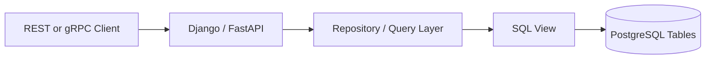

# 14- When to Use Views

## Overview

A SQL view is most useful when a query represents a **stable, reusable database-level interface** rather than merely a convenient way to shorten SQL.

The key engineering question is not:

> "Can this query be a view?"

Almost any sufficiently complex query can be wrapped in a view. The better question is:

> "Does this query deserve a named, reusable, governed database interface?"

Views are particularly valuable for:

- Encapsulating complex joins.
- Providing stable read models to applications.
- Centralizing reusable filtering logic.
- Exposing a controlled subset of table columns.
- Simplifying reporting and analytics queries.
- Creating database-level security boundaries.
- Hiding schema complexity from consumers.

They are less appropriate when the query is highly application-specific, frequently changing, performance-critical in ways that require explicit control, or better represented by a materialized read model.

## The Decision Framework

Use a view when most of these conditions are true:

```text
Is the query reused?
       |
       +-- No --> Keep it as application/query code
       |
       +-- Yes
             |
             v
Does the database own the semantics?
             |
             +-- No --> Keep it in application code
             |
             +-- Yes
                   |
                   v
Does a stable database interface help?
                   |
                   +-- No --> Keep it as a query
                   |
                   +-- Yes
                         |
                         v
                      Use a View
```

A view is a good abstraction when the **database should own the relationship between the underlying schema and the resulting dataset**.

## When Views Are a Good Fit

### Reusable Complex Queries

A view is appropriate when multiple consumers repeatedly implement the same joins and filters.

Without a view:

```sql
SELECT
    o.order_id,
    c.customer_id,
    c.display_name,
    o.total_amount,
    o.created_at
FROM orders AS o
JOIN customers AS c
    ON c.customer_id = o.customer_id
WHERE o.status = 'completed'
  AND o.deleted_at IS NULL;
```

Multiple services or reports might independently reproduce this logic.

Instead:

```sql
CREATE VIEW completed_orders AS
SELECT
    o.order_id,
    c.customer_id,
    c.display_name,
    o.total_amount,
    o.created_at
FROM orders AS o
JOIN customers AS c
    ON c.customer_id = o.customer_id
WHERE o.status = 'completed'
  AND o.deleted_at IS NULL;
```

Consumers can then use:

```sql
SELECT *
FROM completed_orders
WHERE customer_id = 1001;
```

The important benefit is not shorter SQL. It is **centralized semantics**.

If "completed order" has business meaning, having one database definition reduces the chance that different consumers implement slightly different versions.

## When the Database Should Own the Logic

Views are particularly useful when the logic is fundamentally relational.

Examples include:

- Joining normalized entities.
- Selecting canonical columns.
- Applying database-level visibility rules.
- Creating reporting projections.
- Combining related relational data.
- Hiding internal schema structure.

For example:

```sql
CREATE VIEW customer_directory AS
SELECT
    customer_id,
    display_name,
    country,
    created_at
FROM customers
WHERE deleted_at IS NULL;
```

The database now owns the definition of the public customer directory.

This can be preferable to forcing every service to remember:

```sql
WHERE deleted_at IS NULL
```

## Views as Stable Database Interfaces

A well-designed view can act like an internal API.

```text
Base Tables
     |
     v
+----------------+
|      View      |
| Stable schema  |
+----------------+
     |
     +----------+----------+
     |          |          |
     v          v          v
 Django      FastAPI    Reporting
```

The underlying tables can be normalized for transactional workloads while the view exposes a simpler read-oriented structure.

For example:

```text
Internal schema:

customers
addresses
orders
order_items
products

            |
            v

customer_order_summary

            |
            v

Application / Reporting
```

This separation is useful when the storage model and consumption model have different concerns.

## When Views Simplify Backend Applications

A backend service may otherwise contain SQL such as:

```sql
SELECT
    c.customer_id,
    c.display_name,
    COUNT(o.order_id) AS order_count,
    COALESCE(SUM(o.total_amount), 0) AS lifetime_value
FROM customers AS c
LEFT JOIN orders AS o
    ON o.customer_id = c.customer_id
   AND o.status = 'completed'
GROUP BY
    c.customer_id,
    c.display_name;
```

If this is a canonical database-level representation, a view can expose it:

```sql
CREATE VIEW customer_order_summary AS
SELECT
    c.customer_id,
    c.display_name,
    COUNT(o.order_id) AS order_count,
    COALESCE(SUM(o.total_amount), 0) AS lifetime_value
FROM customers AS c
LEFT JOIN orders AS o
    ON o.customer_id = c.customer_id
   AND o.status = 'completed'
GROUP BY
    c.customer_id,
    c.display_name;
```

The application can then issue:

```sql
SELECT *
FROM customer_order_summary
WHERE customer_id = 1001;
```

This can make application code substantially easier to maintain.

## Views for Read Models

A view can provide a relational read model without duplicating data.

For example:

```text
Transactional Model
-------------------

orders
order_items
products
customers
payments

        |
        v

Read View
-------------------
order_details
        |
        v
REST / gRPC API
```

The advantage is that the read model remains derived from the source tables.

There is no synchronization process between the source tables and a normal view.

This is particularly useful when:

- Data must remain current.
- The query is reasonably efficient.
- The read model does not need independent storage.
- Consumers benefit from a stable relational interface.

## Views for Security Boundaries

Views can expose only approved columns and rows.

Suppose the base table contains:

```text
users
├── user_id
├── display_name
├── email
├── phone
├── password_hash
├── internal_notes
└── created_at
```

A reporting consumer may need only:

```sql
CREATE VIEW user_reporting AS
SELECT
    user_id,
    display_name,
    created_at
FROM users;
```

The consumer can be granted access to the view instead of the underlying table, depending on the database's privilege model.

This creates a useful boundary:

```text
Sensitive Base Table
        |
        v
Restricted View
        |
        v
Reporting Role
```

However, a view should not automatically be treated as a complete security boundary. Review:

- View owner.
- Definer/invoker semantics.
- Underlying table privileges.
- Row-level security.
- Database roles.
- Functions referenced by the view.
- Indirect access through other objects.

Security behavior is database-specific.

## Multi-Tenant Systems

Views can sometimes centralize tenant filtering.

For example:

```sql
CREATE VIEW tenant_orders AS
SELECT
    order_id,
    tenant_id,
    customer_id,
    total_amount,
    created_at
FROM orders
WHERE tenant_id = current_setting('app.tenant_id')::bigint;
```

This pattern can be useful in controlled PostgreSQL architectures, but it requires careful session management and security design.

A connection pool must never accidentally retain the wrong tenant context.

For stronger isolation, PostgreSQL Row-Level Security may be a better foundation:

```text
Application
    |
    v
Tenant Context
    |
    v
RLS Policy
    |
    v
Base Table
```

A view can complement RLS, but should not be used as a substitute for robust authorization design when the threat model requires stronger database enforcement.

## Views for Reporting

Reporting is one of the most common practical uses for views.

For example:

```sql
CREATE VIEW daily_order_metrics AS
SELECT
    created_at::date AS order_date,
    COUNT(*) AS order_count,
    SUM(total_amount) AS revenue
FROM orders
WHERE status = 'completed'
GROUP BY created_at::date;
```

Consumers can query:

```sql
SELECT *
FROM daily_order_metrics
WHERE order_date >= CURRENT_DATE - INTERVAL '30 days';
```

This centralizes the definition of the metric.

That is valuable when "revenue" or "completed orders" must mean the same thing across dashboards, internal tools, and operational reports.

## Views for Schema Abstraction

A normalized database schema may not be convenient for every consumer.

Suppose an internal schema changes from:

```text
customers.name
```

to:

```text
customer_profiles.display_name
```

A view can preserve a stable interface:

```sql
CREATE VIEW customer_directory AS
SELECT
    c.customer_id,
    p.display_name
FROM customers AS c
JOIN customer_profiles AS p
    ON p.customer_id = c.customer_id;
```

Consumers continue using:

```sql
SELECT customer_id, display_name
FROM customer_directory;
```

This can reduce coupling between consumers and physical schema changes.

However, a view should not become an excuse to avoid properly managing database migrations.

## Views for Legacy Schema Integration

Views can provide a compatibility layer over legacy databases.

For example:

```text
Legacy Tables
     |
     v
Compatibility View
     |
     v
Modern Application
```

This is useful during incremental modernization.

The application can consume:

```sql
SELECT
    customer_id,
    display_name,
    status
FROM customer_compatibility;
```

while the underlying schema remains complicated.

This can be an effective migration strategy when replacing the legacy schema immediately is too risky.

## When Not to Use Views

A view is not automatically the right abstraction.

Avoid creating a view when it only saves a few lines of SQL:

```sql
CREATE VIEW active_users AS
SELECT *
FROM users
WHERE active = true;
```

If the query is used once and has no meaningful database-level contract, the additional database object may create more operational overhead than value.

Other situations require caution.

## Highly Dynamic Queries

Application-specific filtering is often better kept in application/query code.

For example:

```text
User-selected filters
+
Pagination
+
Sorting
+
Authorization context
+
Feature flags
+
Optional joins
```

can produce highly dynamic SQL.

A static view may not provide meaningful abstraction for this workload.

The view can still be a useful base relation, but do not force every dynamic concern into the view definition.

## Frequently Changing Business Logic

If a query's semantics change constantly with product requirements, putting it in a shared view can create unnecessary migration coupling.

For example:

```text
Marketing experiment
      |
      v
Temporary business rule
      |
      v
Application code
```

may be preferable to repeatedly changing a shared database object.

A view is strongest when the semantics are relatively stable and broadly useful.

## Performance-Critical Queries Requiring Explicit Control

Normal views do not normally materialize results.

Conceptually:

```text
Application Query
      |
      v
View Definition
      |
      v
Query Optimizer
      |
      v
Base Tables
```

Therefore, a view does not inherently make an expensive query faster.

If a query repeatedly performs:

- Large joins.
- Expensive aggregations.
- Complex transformations.
- Large scans.

a materialized view, cache, dedicated read model, or precomputed table may be more appropriate.

## Very Complex View Chains

Avoid excessive nesting:

```text
API View
   |
   v
Business View
   |
   v
Reporting View
   |
   v
Aggregation View
   |
   v
Compatibility View
   |
   v
Base Tables
```

Deep chains can make:

- Query plans difficult to understand.
- Dependencies difficult to manage.
- Performance regressions difficult to diagnose.
- Schema migrations harder.
- Ownership unclear.

Prefer a smaller number of well-defined views with clear ownership.

## Views vs Application Queries

The choice depends on where the abstraction belongs.

| Requirement | View | Application Query |
|---|---|---|
| Reusable relational logic | Strong fit | Possible |
| Database-owned semantics | Strong fit | Weaker |
| Dynamic filtering | Limited | Strong fit |
| API-specific behavior | Usually poor fit | Strong fit |
| Centralized security projection | Strong fit | Possible |
| Complex joins | Strong fit | Possible |
| Rapidly changing product logic | Usually poor fit | Strong fit |
| Stable read model | Strong fit | Possible |
| Database portability | Can be weaker | Often stronger |
| Database-independent tests | Harder | Easier |
| Cross-service shared semantics | Strong fit | Risk of duplication |

The goal is not to maximize the number of views. It is to place logic where it can be maintained correctly.

## Views vs Materialized Views

The choice becomes especially important for expensive read workloads.

| Requirement | Normal View | Materialized View |
|---|---|---|
| Always current data | Strong fit | No, unless refreshed appropriately |
| Stores result | No | Yes |
| Expensive aggregation | Often poor fit | Strong fit |
| Simple reusable query | Strong fit | Usually unnecessary |
| Refresh management | Not required | Required |
| Additional storage | Minimal | Required |
| Read performance | Depends on base query | Often better |
| Staleness | None from storage | Possible |
| Index result directly | Generally no | Yes, where supported |

A materialized view introduces an operational lifecycle:

```text
Base Tables
    |
    v
Materialized View
    |
    +--> Refresh
    |
    +--> Index
    |
    v
Consumers
```

Use it when the performance benefit justifies the additional complexity and freshness trade-off.

## Views vs Temporary Tables

Temporary tables are usually appropriate for intermediate state within a session or transaction.

```text
Temporary Table
    |
    +-- Session scoped
    +-- Explicitly populated
    +-- Can be indexed
    +-- Useful for multi-step processing
```

A view is a persistent query definition:

```text
View
    |
    +-- Database object
    +-- Reusable
    +-- No result storage in a normal view
    +-- Query evaluated when consumed
```

Use a temporary table when you need intermediate materialized data. Use a view when you need a reusable relational definition.

## Views vs Stored Procedures

A view is primarily a relational read abstraction.

A stored procedure is appropriate when the database must execute procedural or multi-step operations.

| Requirement | View | Stored Procedure |
|---|---|---|
| Reusable read query | Strong fit | Possible |
| Composable with SQL | Strong fit | Usually weaker |
| Multi-step mutation | Poor fit | Strong fit |
| Procedural logic | Poor fit | Strong fit |
| Stable read interface | Strong fit | Possible |
| Encapsulated database operation | Limited | Strong fit |

Do not use a stored procedure merely because a query is complicated.

## Views in Django and FastAPI Applications

A view can be exposed through an ORM as a read-oriented database object.

The application architecture might look like:



The application remains responsible for:

- Request validation.
- Authentication.
- Authorization policy.
- Pagination.
- API serialization.
- Business workflow.

The database view owns the relational projection.

For read-heavy endpoints, this can produce a clean separation between:

```text
Application behavior
        +
Database read model
```

Do not expose a view directly just because it exists. The API still needs appropriate authorization and input handling.

## Pagination Considerations

Views can work well with pagination, but the underlying query still determines performance.

For example:

```sql
SELECT
    order_id,
    customer_id,
    total_amount,
    created_at
FROM completed_orders
WHERE customer_id = 1001
ORDER BY created_at DESC, order_id DESC
LIMIT 50;
```

For large datasets, keyset pagination may be preferable to large offsets:

```sql
SELECT
    order_id,
    customer_id,
    total_amount,
    created_at
FROM completed_orders
WHERE customer_id = 1001
  AND (created_at, order_id) < (:last_created_at, :last_order_id)
ORDER BY created_at DESC, order_id DESC
LIMIT 50;
```

The view itself does not eliminate the need for appropriate indexes on the underlying tables.

## Production Decision Matrix

| Scenario | Recommendation |
|---|---|
| Shared complex read query | Use a view |
| Stable relational read model | Use a view |
| Controlled column exposure | Consider a view |
| Canonical reporting metric | Consider a view |
| Legacy schema compatibility | Consider a view |
| One-off application query | Keep as query code |
| Highly dynamic API query | Prefer application/query layer |
| Expensive reusable aggregation | Consider materialized view |
| Multi-step database operation | Consider procedure/function |
| Session-specific intermediate data | Use temporary table |
| Frequently changing product logic | Prefer application layer |
| Strong tenant isolation | Prefer RLS/authorization mechanisms; view may complement |
| Extremely latency-sensitive read model | Consider materialized or dedicated read model |

## Production Considerations

### Ownership

Every important view should have an identifiable owner.

Document:

- Purpose.
- Consumers.
- Source tables.
- Security classification.
- Expected performance.
- Migration history.
- Deprecation strategy.

An owner prevents a view from becoming an orphaned database dependency.

### Performance

Monitor the queries that consume the view rather than assuming the view itself has a fixed cost.

Review:

```sql
EXPLAIN (ANALYZE, BUFFERS)
SELECT *
FROM customer_order_summary
WHERE customer_id = 1001;
```

For PostgreSQL environments, query statistics can be inspected through mechanisms such as `pg_stat_statements` when enabled.

### Scalability

A view scales only as well as its underlying query.

As data grows:

```text
10M rows
   |
   v
Query is acceptable

500M rows
   |
   v
Same query may become expensive
```

Evaluate:

- Index selectivity.
- Join cardinality.
- Partitioning.
- Aggregation cost.
- Query frequency.
- Concurrent consumers.

### Reliability

Treat view changes as database deployments.

A change to a widely used view can break:

- APIs.
- Background workers.
- Dashboards.
- ETL jobs.
- Other views.
- External reporting systems.

Use migrations and automated tests rather than manually modifying production views.

### Security

Explicitly project columns:

```sql
SELECT
    user_id,
    display_name,
    created_at
```

rather than:

```sql
SELECT *
```

Review security implications whenever a view's:

- Columns change.
- Row predicates change.
- Ownership changes.
- Dependencies change.
- Permissions change.

### High Availability

Views themselves generally do not provide high availability.

The availability characteristics come from the database architecture.

For read replicas, verify that:

- The view exists on every required database instance.
- Schema migrations are replicated/applied correctly.
- Consumers tolerate replica lag.
- Read-after-write requirements are understood.

A view may be valid on the primary while a replica is temporarily behind the schema or data state.

### Disaster Recovery

Views are usually definitions rather than independent datasets.

Therefore, disaster recovery requires preserving:

- View definitions.
- Migration history.
- Dependencies.
- Permissions.
- Database extensions/functions used by the view.

For materialized views, recovery may additionally require rebuilding or refreshing stored results.

## Common Mistakes and Pitfalls

### Creating Views for Every Repeated Query

Not every repeated query deserves a database object.

**Why it happens:** developers equate reuse with a view.

**Avoid it:** create a view when the query represents a meaningful, stable database-level abstraction.

### Assuming Views Improve Performance

A normal view generally does not cache its result.

**Why it happens:** the abstraction looks like a precomputed table.

**Avoid it:** inspect the actual execution plan. Use materialization or a dedicated read model when precomputation is required.

### Putting API Logic in Views

Pagination policy, feature flags, user-specific behavior, and API response formatting usually belong elsewhere.

**Avoid it:** keep views focused on relational data modeling.

### Hiding Business Logic in Deep View Chains

A long chain of dependent views can become difficult to reason about.

**Avoid it:** keep dependency depth manageable and document important relationships.

### Using `SELECT *`

New columns can silently become part of the view's output.

**Avoid it:** explicitly define the view's contract.

### Treating a View as Authorization

A view can contribute to a security boundary but should not replace application authorization or stronger database controls where required.

**Avoid it:** model authentication, authorization, tenant isolation, and database privileges independently.

### Ignoring Consumer Compatibility

A view can be used by more consumers than the original author realizes.

**Avoid it:** treat widely consumed views like APIs and use backward-compatible migration strategies.

### Creating a Materialized View Too Early

Materialization adds storage, refresh operations, staleness concerns, and operational complexity.

**Avoid it:** first establish that the normal view's underlying query is actually the bottleneck.

## Interview Traps

### "Do Views Store Data?"

A normal view generally stores the **query definition**, not the query result.

A materialized view stores the result and therefore introduces refresh and staleness considerations.

### "Do Views Improve Query Performance?"

Not inherently.

A normal view is generally optimized together with the query that references it. Performance depends on the resulting execution plan and underlying data access.

### "Should All Business Logic Be in the Database?"

No.

Put logic where its ownership, reuse, consistency, performance, and operational characteristics make sense.

Views are particularly good for stable relational projections, not arbitrary application workflows.

### "Can a View Replace an API?"

Not directly.

A view can provide a stable database-level read interface, while an API still handles authentication, authorization, validation, serialization, rate limiting, and network-level concerns.

## Practical Rule of Thumb

Use a view when the following statement is true:

> **"This dataset has a meaningful database-level definition, multiple consumers benefit from the same relational semantics, and exposing it as a named database object reduces coupling or duplication."**

Prefer another abstraction when:

> **"This query primarily exists to implement one application's dynamic behavior, changes frequently, or requires materialized state or procedural processing."**

The decision should be driven by ownership and operational boundaries, not by query length.

## Key Takeaways

- **Use views for stable, reusable relational projections where the database should own the query semantics and provide a consistent interface to multiple consumers.**
- **Do not use views merely to shorten SQL; one-off, highly dynamic, or rapidly changing application-specific queries usually belong in the application/query layer.**
- **A normal view does not inherently improve performance or cache results; optimize its underlying query or consider materialized/dedicated read models when precomputation is required.**
- **Views can support security and schema abstraction, but they must be designed alongside database privileges, RLS, application authorization, and deployment compatibility.**
- **Choose views based on ownership, reuse, stability, and operational value—not simply on query complexity.**