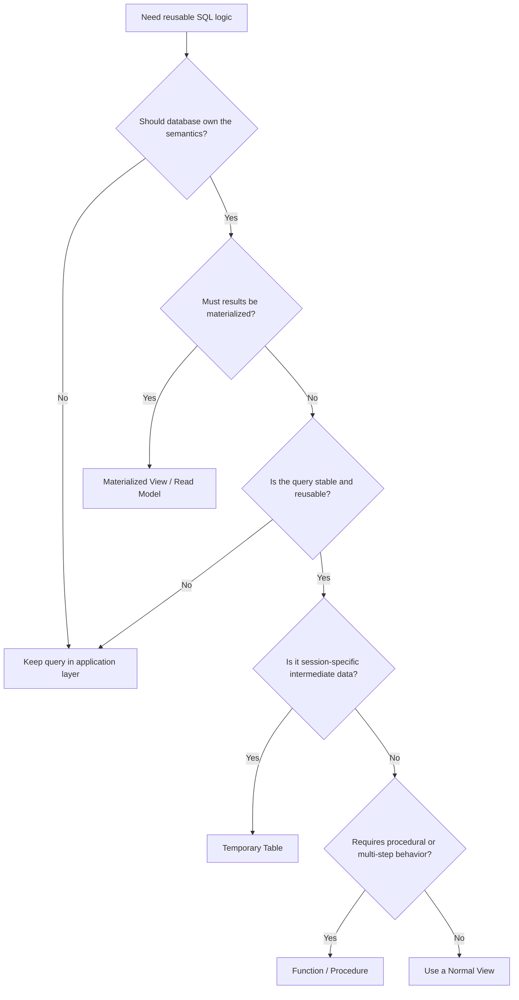

# 15- When Not to Use Views

## Overview

SQL views are useful database abstractions, but they are not a universal replacement for application queries, materialized views, temporary tables, stored procedures, caches, or dedicated read models.

A normal view primarily stores a **query definition**. When a consumer queries the view, the database optimizer generally plans the resulting query against the underlying tables. Therefore, creating a view does not automatically make an expensive query faster or eliminate the cost of joins, filtering, sorting, or aggregation.

The strongest reason to avoid a view is usually not syntax or query complexity. It is **poor ownership of the abstraction**.

Avoid a view when:

- The query is application-specific and used only once.
- The required behavior is highly dynamic.
- Business logic changes frequently.
- The view creates excessive dependency or migration coupling.
- Performance requires precomputed data.
- Session-specific intermediate state is required.
- Procedural or multi-step database operations are needed.
- The view would hide important performance or security behavior.
- A dedicated read model provides a better operational boundary.

## The Core Decision

A useful decision process is:



The objective is to select the **simplest abstraction that matches the ownership, lifecycle, consistency, and performance requirements**.

## When a View Is the Wrong Abstraction

### One-Off Queries

Do not create a persistent view simply because a query is moderately complex.

For example:

```sql
SELECT
    order_id,
    customer_id,
    total_amount
FROM orders
WHERE customer_id = 1001
  AND created_at >= CURRENT_DATE - INTERVAL '30 days';
```

If this query exists only for one endpoint and does not represent a shared database-level concept, application/query-layer SQL is usually sufficient.

Creating a view introduces another database object that must be:

- Migrated.
- Tested.
- Documented.
- Versioned.
- Maintained.
- Considered during schema changes.

The abstraction should justify that operational cost.

### Highly Dynamic Application Queries

Views are static definitions, while many application queries are dynamic.

A search endpoint may support:

```text
keyword
status
country
date range
price range
sorting
pagination
feature flags
user-specific permissions
```

The resulting SQL may vary substantially between requests.

A typical backend architecture is better represented as:

```text
HTTP Request
     |
     v
Application
     |
     +-- Validate filters
     +-- Apply authorization
     +-- Build query
     +-- Apply pagination
     |
     v
Database
```

Do not create dozens of narrowly specialized views to accommodate application-level query combinations.

A reusable base view can still be appropriate if it represents a stable relational model, but dynamic request behavior generally belongs in the query/application layer.

## Rapidly Changing Business Logic

A view can become expensive to maintain when its definition represents volatile product behavior.

For example:

```sql
WHERE
    status = 'active'
    AND subscription_tier IN ('pro', 'enterprise')
    AND created_at >= CURRENT_DATE - INTERVAL '90 days'
```

If product requirements frequently change these rules, embedding them in a shared view means every semantic change becomes a database migration and potentially affects multiple consumers.

Prefer application logic when:

- The rule belongs to one service.
- Product requirements change frequently.
- The logic is experimental.
- Different consumers intentionally need different interpretations.

Use a view when the rule represents a relatively stable database-owned concept.

## Performance-Critical Queries That Need Materialization

A normal view does not cache its result.

Consider:

```sql
CREATE VIEW monthly_customer_revenue AS
SELECT
    customer_id,
    DATE_TRUNC('month', created_at) AS month,
    SUM(total_amount) AS revenue
FROM orders
GROUP BY
    customer_id,
    DATE_TRUNC('month', created_at);
```

Querying it repeatedly can still require substantial work:

```text
orders
   |
   v
scan / index access
   |
   v
grouping
   |
   v
aggregation
   |
   v
view result
```

If the same expensive aggregation is requested frequently, consider:

- Materialized views.
- Precomputed summary tables.
- Event-driven read models.
- Caching.
- Dedicated analytics infrastructure.

A normal view is the wrong abstraction when **precomputation is the actual requirement**.

## Large Analytical Workloads

Views are often convenient for reporting, but convenience does not make them suitable for high-volume analytics.

A query such as:

```sql
SELECT
    customer_id,
    DATE_TRUNC('month', created_at) AS month,
    COUNT(*) AS order_count,
    SUM(total_amount) AS revenue
FROM orders
GROUP BY
    customer_id,
    DATE_TRUNC('month', created_at);
```

may be acceptable at one scale and unacceptable at another.

For large analytical workloads, evaluate:

- Data volume.
- Query frequency.
- Aggregation cost.
- Concurrent users.
- Freshness requirements.
- Database CPU and I/O.
- Locking and resource contention.
- Dedicated analytics systems.

A PostgreSQL transactional database should not necessarily become the primary analytics engine simply because a view makes the SQL convenient.

## Session-Specific Intermediate Results

A normal view is not intended to represent temporary state.

For multi-step processing:

```text
Step 1
  |
  v
Intermediate Dataset
  |
  v
Step 2
  |
  v
Step 3
```

a temporary table may be more appropriate.

For example:

```sql
CREATE TEMP TABLE eligible_orders AS
SELECT
    order_id,
    customer_id,
    total_amount
FROM orders
WHERE status = 'pending';

CREATE INDEX ON eligible_orders (customer_id);

SELECT
    customer_id,
    SUM(total_amount) AS pending_total
FROM eligible_orders
GROUP BY customer_id;
```

A temporary table can be preferable when the intermediate result must be:

- Materialized.
- Reused multiple times.
- Indexed independently.
- Modified during processing.
- Scoped to a session or transaction.

A view cannot provide those characteristics by itself.

## Multi-Step Database Operations

Views are primarily relational read abstractions.

If the requirement is:

```text
Validate inventory
      |
      v
Reserve stock
      |
      v
Create order
      |
      v
Write audit record
      |
      v
Return result
```

a view is not the right abstraction.

Depending on the database and architecture, consider:

- Transactions.
- Stored procedures.
- Database functions.
- Application service logic.

For example, a backend service might coordinate the workflow:

```text
FastAPI / Django
       |
       v
Application Service
       |
       +--> inventory update
       +--> order insert
       +--> audit insert
       |
       v
Transaction
```

The view should not be forced to represent a workflow it was never designed to execute.

## When Application Logic Is the Better Owner

A useful distinction is:

| Logic | Preferred Location |
|---|---|
| Authentication | Application / identity layer |
| API validation | Application |
| Request-specific filtering | Application/query layer |
| Feature flags | Application |
| HTTP response formatting | Application |
| Stable relational joins | Database view |
| Canonical database projection | Database view |
| Database-level column restriction | View + privileges |
| Multi-step transactional workflow | Application or procedure/function |
| Expensive reusable aggregation | Materialized view/read model |
| Session-specific intermediate data | Temporary table |
| Distributed asynchronous processing | Application + queue/workflow system |

The database should own database semantics. The application should own application behavior.

## Views That Hide Performance Problems

A view can make a query look simple while hiding substantial work.

Consider:

```sql
SELECT *
FROM customer_dashboard
WHERE customer_id = 1001;
```

That query looks inexpensive, but `customer_dashboard` might contain:

```sql
JOIN customers
JOIN orders
JOIN payments
JOIN subscriptions
JOIN order_items
JOIN products
GROUP BY ...
WINDOW FUNCTIONS ...
```

The abstraction is useful only if engineers still understand its execution characteristics.

Inspect the actual plan:

```sql
EXPLAIN (ANALYZE, BUFFERS)
SELECT *
FROM customer_dashboard
WHERE customer_id = 1001;
```

Evaluate:

- Sequential scans.
- Index scans.
- Join strategies.
- Row estimates.
- Actual row counts.
- Sort operations.
- Hash operations.
- Temporary disk usage.
- Execution time.
- Buffer reads.

A view should simplify **logical access**, not hide operational reality.

## Deeply Nested Views

Avoid building a dependency chain like:

```text
api_customer_view
        |
        v
customer_summary_view
        |
        v
customer_orders_view
        |
        v
completed_orders_view
        |
        v
orders_with_items_view
        |
        v
orders
```

Deep view hierarchies create several problems:

- Harder query-plan analysis.
- More difficult schema migrations.
- Greater dependency coupling.
- Unclear ownership.
- Difficult debugging.
- Unexpected performance regressions.

A small number of well-defined views is generally easier to operate than a large graph of dependent views.

## Views That Encode Unstable Experiments

Avoid putting temporary experiments into shared views.

For example:

```text
A/B test
   |
   v
temporary business rule
   |
   v
application query
```

is often preferable to:

```text
A/B test
   |
   v
shared database view
   |
   v
multiple consumers
```

A temporary experiment should not accidentally become a database-wide contract.

If the logic eventually becomes stable and shared, it can be promoted into an appropriate database abstraction.

## Views With Consumer-Specific Semantics

Suppose three consumers require different definitions:

```text
Operations:
"Active customer"

Billing:
"Active customer"

Marketing:
"Active customer"
```

If each definition has intentionally different semantics, creating one shared `active_customers` view may be misleading.

A shared view is appropriate when the semantics are genuinely shared.

Otherwise, forcing different concepts into one view can create:

- Ambiguous naming.
- Incorrect assumptions.
- Consumer coupling.
- Difficult authorization rules.

Names should describe stable semantics, not merely convenient query results.

## Views as an Inappropriate Security Boundary

Views can restrict columns and rows, but blindly relying on a view for security can be dangerous.

For example:

```sql
CREATE VIEW public_users AS
SELECT
    user_id,
    display_name,
    email
FROM users;
```

The security model must still account for:

- Who can query the view.
- Who can query the underlying table.
- View owner semantics.
- Definer/invoker behavior.
- Row-level security.
- Functions referenced by the view.
- Other database objects that expose the same data.

A view should be part of a deliberate security model, not a shortcut around authorization.

For multi-tenant systems, stronger database controls such as PostgreSQL Row-Level Security may be appropriate depending on the threat model.

## Views With `SELECT *`

Avoid:

```sql
CREATE VIEW customer_summary AS
SELECT *
FROM customers;
```

This creates an unstable interface.

If the table gains a sensitive column:

```text
customers
├── customer_id
├── name
├── email
├── internal_notes
└── payment_reference
```

the view's output can change unexpectedly depending on database behavior and view-definition semantics.

Prefer explicit columns:

```sql
CREATE VIEW customer_summary AS
SELECT
    customer_id,
    name,
    email
FROM customers;
```

Explicit projection makes the view's contract clearer.

## Views That Need Independent Indexing

Normal views generally do not have their own stored result set on which you can simply create indexes.

If the requirement is:

```text
Query result
    +
Independent indexes
    +
Persistent storage
    +
Fast repeated access
```

a materialized view or dedicated table may be a better fit.

For PostgreSQL, a materialized view can be indexed:

```sql
CREATE MATERIALIZED VIEW customer_metrics AS
SELECT
    customer_id,
    COUNT(*) AS order_count,
    SUM(total_amount) AS lifetime_value
FROM orders
GROUP BY customer_id;

CREATE INDEX idx_customer_metrics_customer_id
    ON customer_metrics (customer_id);
```

The trade-off is that the result must be refreshed.

## Views and Caching

Do not create a view when the real requirement is caching.

These are different problems:

```text
View:
"How should this relational dataset be defined?"

Cache:
"How can I avoid recomputing or retrieving this result?"
```

For a high-read, relatively stable result, an architecture might instead be:

```text
Client
  |
  v
API
  |
  +----> Redis
  |        |
  |        +--> Cache hit
  |
  +----> PostgreSQL
           |
           v
        View / Query
```

The view and cache can coexist, but they solve different problems.

## Views and Dedicated Read Models

For very high read volume, a dedicated read model can be more appropriate.

For example:

```text
Transactional PostgreSQL
          |
          v
       Events
          |
          v
        Kafka
          |
          v
 Read Model Builder
          |
          v
Read Database / Search Store
          |
          v
      API Clients
```

A normal view is not a substitute for an architecture that requires:

- Independent scaling.
- Precomputed data.
- Specialized indexes.
- Event-driven updates.
- Read/write workload isolation.

This becomes increasingly important in microservice architectures and high-scale systems.

## Migration and Deployment Risk

A view can create hidden deployment dependencies.

Suppose:

```text
Migration A
  changes orders.customer_id

Migration B
  changes completed_orders view

Migration C
  changes reporting query
```

A poorly ordered deployment can break consumers.

Treat important views as versioned database interfaces.

A production migration should consider:

- Existing consumers.
- Dependency ordering.
- Backward compatibility.
- Rollback behavior.
- Replica propagation.
- Long-running queries.
- Deployment sequencing.

For widely consumed views, avoid breaking schema changes when a compatibility period is practical.

## Dependency Management

Before removing or changing a view, determine its consumers.

Potential consumers include:

- Django query layers.
- FastAPI repositories.
- Celery workers.
- Reporting jobs.
- BI tools.
- ETL pipelines.
- Other views.
- Ad hoc operational scripts.

A view may be more widely depended upon than its location in the repository suggests.

Database dependency inspection should therefore be part of change planning.

## Production Decision Matrix

| Situation | Preferred Approach |
|---|---|
| Stable reusable relational projection | Normal view |
| One-off query | Application/query layer |
| Highly dynamic filtering | Application/query layer |
| Rapidly changing business rule | Application layer |
| Expensive repeated aggregation | Materialized view/read model |
| Need persistent indexed result | Materialized view/table |
| Session-specific intermediate data | Temporary table |
| Multi-step database workflow | Function/procedure/application transaction |
| High-volume distributed read model | Dedicated read model |
| Cache requirement | Redis or another cache |
| Database-level column projection | View + privileges |
| Strong tenant isolation | RLS and/or carefully designed authorization |
| Complex analytics at scale | Analytics platform / warehouse |

## Production Review Checklist

Before creating a view, ask:

### Ownership

- Does the database own this logic?
- Is the semantic definition stable?
- Is there a clear owner?

### Reuse

- Will multiple consumers use it?
- Does it eliminate meaningful duplication?
- Is the abstraction likely to remain useful?

### Performance

- What is the expected row volume?
- What is the execution plan?
- Which indexes support the underlying query?
- Will the query run frequently?
- Could materialization be more appropriate?

### Security

- Does the view expose sensitive columns?
- Who can query it?
- Can users bypass it through base tables?
- Does RLS need to be involved?

### Operations

- Is the view managed through migrations?
- Are dependencies documented?
- Can it be changed without breaking consumers?
- Is rollback possible?
- Does it exist consistently across primary and replica environments?

### Architecture

- Is this actually a caching problem?
- Is this actually a read-model problem?
- Is this actually a temporary-processing problem?
- Is this actually procedural database logic?

## Common Mistakes

### Mistaking Reuse for a Requirement

A query appearing twice does not automatically justify a view.

**Better approach:** determine whether the duplicated logic represents a stable shared database concept.

### Assuming a View Is a Cache

A normal view generally does not store query results.

**Better approach:** use materialization or caching when reducing repeated computation is the requirement.

### Creating Views for Every API Endpoint

API endpoints frequently have different filters, authorization rules, and response requirements.

**Better approach:** create views around stable relational models rather than individual HTTP endpoints.

### Hiding Expensive Queries Behind Simple Names

A view named `customer_dashboard` may hide substantial database work.

**Better approach:** profile the actual query plan and document performance characteristics.

### Building Deep View Chains

Nested views can make debugging and migrations difficult.

**Better approach:** keep view dependencies understandable and shallow.

### Putting Volatile Business Rules in Shared Views

Frequent product changes can turn a shared view into a migration bottleneck.

**Better approach:** keep unstable application behavior in the application layer.

### Using Views Instead of Proper Authorization

A restricted projection is not automatically equivalent to an authorization system.

**Better approach:** combine views with database privileges, RLS where appropriate, and application authorization.

### Using a View When Materialization Is Required

If repeated execution is the bottleneck, a normal view does not solve it.

**Better approach:** consider materialized views, summary tables, caches, or dedicated read models.

## Interview Traps

### "Should I Use a View Whenever SQL Is Complex?"

No.

Complexity alone is not a sufficient reason.

The important questions are:

- Who owns the semantics?
- Is it reusable?
- Is it stable?
- Does it need materialization?
- What are the operational dependencies?

### "Does a View Improve Performance?"

Not inherently.

A normal view generally represents a reusable query definition. The underlying query still has to execute.

### "When Should I Use a Materialized View Instead?"

When the read workload benefits from storing the computed result and the system can tolerate the associated refresh lifecycle and possible staleness.

### "Can a View Replace Redis?"

No.

A view defines relational data access. Redis is commonly used to reduce repeated database work through caching or other data structures.

They solve different problems.

### "Can a View Replace a Temporary Table?"

Not when you need session-scoped materialized intermediate data that can be independently indexed or modified.

### "Can a View Replace a Stored Procedure?"

Not when the requirement is procedural, multi-step, or mutation-oriented database behavior.

## Practical Rule of Thumb

Use a normal view when:

```text
Stable semantics
      +
Reusable relational projection
      +
Database-owned logic
      +
No requirement for stored results
      +
Manageable query cost
```

Do not use a normal view when the requirement is primarily:

```text
Dynamic application behavior
        OR
Precomputed results
        OR
Temporary intermediate state
        OR
Procedural workflow
        OR
Caching
        OR
Independent high-scale read infrastructure
```

The senior-level decision is to identify the **actual problem being solved** before choosing the database object.

## Key Takeaways

- **Do not create views merely because a query is complex or duplicated; use them when a stable, reusable relational abstraction belongs in the database.**
- **Avoid normal views when the real requirement is materialization, caching, temporary state, procedural execution, or a dedicated scalable read model.**
- **Highly dynamic, rapidly changing, API-specific behavior generally belongs in the application/query layer rather than a shared database view.**
- **A view can hide expensive execution plans and create dependency coupling, so profile queries and treat important views as production database interfaces.**
- **Choose the abstraction based on ownership, lifecycle, performance, security, and operational requirements—not on SQL complexity alone.**