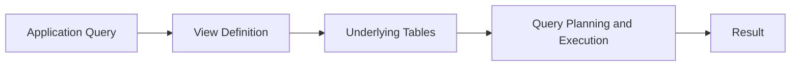
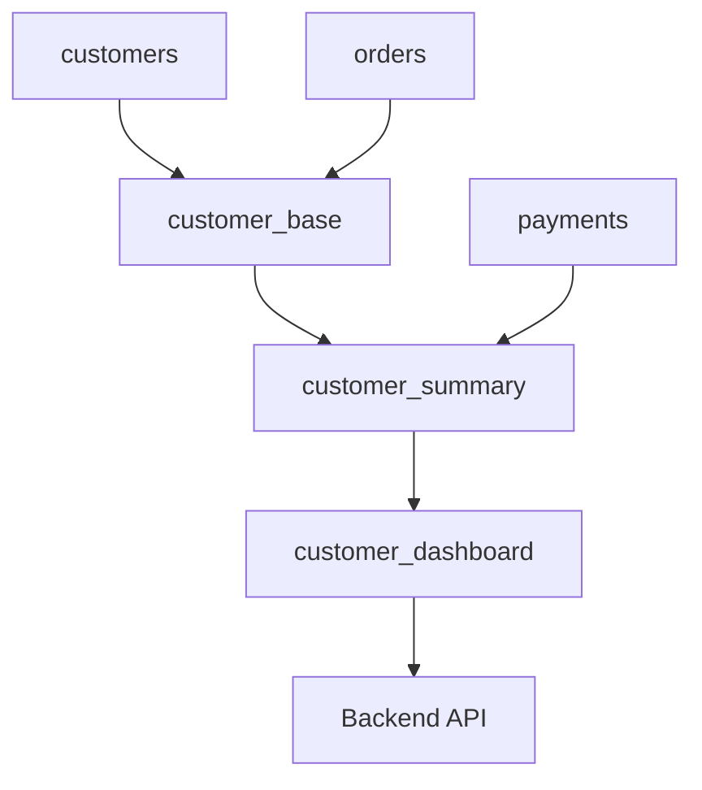

# 16- Common View Mistakes

## Overview

SQL views provide reusable database-level abstractions over queries, but they also introduce another layer of indirection into the data-access architecture. Most view-related production problems are not caused by invalid SQL; they come from incorrect assumptions about performance, ownership, security, dependencies, or lifecycle management.

A well-designed view should have a clear purpose, stable semantics, explicit columns, predictable performance, and an understood dependency boundary.

Common failure modes include:

- Treating a view as a cache.
- Assuming a view automatically improves performance.
- Using `SELECT *`.
- Building deeply nested view hierarchies.
- Hiding expensive joins and aggregations.
- Creating views for individual API endpoints.
- Embedding unstable business logic.
- Ignoring permissions and security boundaries.
- Breaking consumers during schema changes.
- Using a normal view when materialization is required.
- Failing to test execution plans and production-scale data.

The examples use PostgreSQL syntax because PostgreSQL exposes the relevant behavior clearly, but the engineering principles apply broadly across relational databases.

## Mistake: Assuming a View Materializes Data

A normal view stores a **query definition**, not its result set.

```sql
CREATE VIEW active_orders AS
SELECT
    order_id,
    customer_id,
    total_amount
FROM orders
WHERE status = 'active';
```

This does not mean the database permanently stores the rows returned by the query.

When an application executes:

```sql
SELECT *
FROM active_orders
WHERE customer_id = 1001;
```

the database must still execute the underlying relational operation.

Conceptually:



If the real requirement is to avoid repeatedly computing an expensive result, evaluate:

- Materialized views.
- Summary tables.
- Read models.
- Redis or another cache.
- Dedicated analytical storage.

### Why This Mistake Happens

The abstraction looks like a table:

```sql
SELECT * FROM active_orders;
```

but its storage and execution semantics are different.

### Production Rule

**A normal view improves query abstraction; it does not inherently eliminate query execution cost.**

## Mistake: Assuming Views Automatically Improve Performance

A view does not automatically make an expensive query faster.

Consider:

```sql
CREATE VIEW customer_revenue AS
SELECT
    customer_id,
    SUM(total_amount) AS revenue
FROM orders
GROUP BY customer_id;
```

This query still requires grouping and aggregation when the result is needed.

Before introducing a view for performance reasons, inspect the actual execution plan:

```sql
EXPLAIN (ANALYZE, BUFFERS)
SELECT *
FROM customer_revenue
WHERE customer_id = 1001;
```

Evaluate:

| Signal | What to Investigate |
|---|---|
| Sequential scan | Whether filtering/indexing is appropriate |
| High actual rows | Cardinality and filtering |
| Large estimate mismatch | Statistics or query design |
| Expensive sort | Ordering and available indexes |
| Hash operations | Join/aggregation strategy |
| High buffer reads | I/O pressure |
| High execution time | Overall query cost |
| Temporary disk usage | Sort/hash memory pressure |

The optimization target should be the **execution plan**, not the existence of a view.

## Mistake: Using `SELECT *`

Avoid:

```sql
CREATE VIEW customer_public AS
SELECT *
FROM customers;
```

A view should normally expose an explicit projection:

```sql
CREATE VIEW customer_public AS
SELECT
    customer_id,
    name,
    email,
    created_at
FROM customers;
```

Explicit columns provide a stable contract and prevent accidental exposure of newly introduced columns.

This matters particularly when tables contain:

- Internal metadata.
- Authentication information.
- Payment-related data.
- Operational flags.
- Personally identifiable information.
- Future columns whose exposure has not been reviewed.

### Production Rule

Treat a view's column list as an API contract.

## Mistake: Exposing Sensitive Columns Through a View

A view can unintentionally expose data that was previously inaccessible to a consumer.

For example:

```sql
CREATE VIEW customer_details AS
SELECT
    customer_id,
    name,
    email,
    password_hash,
    internal_notes
FROM customers;
```

The fact that a column is available through a view does not make it safe to expose.

Prefer explicit least-privilege projections:

```sql
CREATE VIEW customer_public AS
SELECT
    customer_id,
    name,
    email
FROM customers;
```

Then control access to the view separately from access to underlying tables.

A security model should answer:

- Who owns the view?
- Who can query the view?
- Who can query the base tables?
- Can users bypass the view?
- Does Row-Level Security apply?
- Does the view contain security-sensitive functions?
- Are database roles correctly separated?

For multi-tenant systems, views should not be treated as a universal replacement for tenant authorization or PostgreSQL Row-Level Security.

## Mistake: Creating a View for Every API Endpoint

A common architecture mistake is mapping HTTP endpoints directly to database views:

```text
GET /customers
    -> customers_view

GET /customers/{id}/orders
    -> customer_orders_view

GET /customers/{id}/dashboard
    -> customer_dashboard_view
```

This can create excessive coupling between:

- HTTP APIs.
- Database objects.
- Product requirements.
- Database migrations.

API queries frequently have dynamic requirements such as:

- Pagination.
- Filtering.
- Sorting.
- Authorization.
- Feature flags.
- Request-specific fields.
- Optional joins.

Those concerns often belong in the application/query layer.

Use a view when it represents a **stable database-level projection**, not simply because an endpoint needs a query.

## Mistake: Putting Volatile Business Logic in Views

Consider:

```sql
CREATE VIEW eligible_customers AS
SELECT customer_id
FROM customers
WHERE
    status = 'active'
    AND subscription_tier IN ('pro', 'enterprise')
    AND created_at >= CURRENT_DATE - INTERVAL '90 days';
```

If these rules change frequently because of product experiments, pricing changes, or feature flags, the view can become a migration bottleneck.

This is particularly problematic when multiple application services depend on the same view but require slightly different interpretations.

Prefer application-owned logic when:

- The rule changes frequently.
- The behavior is experimental.
- The rule is specific to one service.
- The logic depends on runtime configuration.
- Different consumers intentionally have different semantics.

Keep database views focused on stable relational concepts.

## Mistake: Building Deeply Nested Views

A view can reference another view:

```text
orders_view
    |
    v
completed_orders_view
    |
    v
customer_order_summary_view
    |
    v
customer_dashboard_view
```

A small amount of composition can improve organization. Excessive nesting creates a dependency graph that becomes difficult to reason about.

Problems include:

- Difficult execution-plan analysis.
- Harder debugging.
- More complicated migrations.
- Unexpected performance regressions.
- Hidden dependencies.
- Difficult ownership.
- Increased blast radius from changes.

Prefer a relatively shallow dependency hierarchy.

When a view becomes difficult to explain, consider whether its logic should be:

- Simplified.
- Moved into a lower-level view.
- Rewritten as a direct query.
- Materialized.
- Converted into a dedicated read model.

## Mistake: Hiding Expensive Joins

A view can make a complicated query appear trivial:

```sql
SELECT *
FROM customer_dashboard
WHERE customer_id = 1001;
```

The underlying definition might contain:

```sql
CREATE VIEW customer_dashboard AS
SELECT
    c.customer_id,
    c.name,
    COUNT(DISTINCT o.order_id) AS order_count,
    SUM(p.amount) AS amount_paid
FROM customers c
LEFT JOIN orders o
    ON o.customer_id = c.customer_id
LEFT JOIN payments p
    ON p.order_id = o.order_id
GROUP BY
    c.customer_id,
    c.name;
```

The short application query does not mean the database work is small.

A senior engineer should be able to move from:

```text
API query
    |
    v
View
    |
    v
Execution plan
    |
    v
Tables + indexes + joins + aggregation
```

and understand where the actual cost occurs.

## Mistake: Using `SELECT *` Against a View

Even when the view itself has an explicit projection, application code should avoid blindly selecting every view column when only a subset is needed.

Prefer:

```sql
SELECT
    customer_id,
    name
FROM customer_public
WHERE customer_id = $1;
```

over:

```sql
SELECT *
FROM customer_public
WHERE customer_id = $1;
```

This reduces unnecessary data transfer and makes application dependencies explicit.

For backend APIs, this becomes relevant when the view contains:

- Large text fields.
- JSON documents.
- Derived fields.
- Expensive expressions.
- Future columns.

## Mistake: Treating a View Like a Table With Its Own Indexes

A normal view generally does not have an independently stored result set that can simply receive indexes.

If a query requires:

```text
Persistent result
+
Independent indexes
+
Repeated fast reads
```

a materialized view or dedicated table may be more appropriate.

For example:

```sql
CREATE MATERIALIZED VIEW customer_metrics AS
SELECT
    customer_id,
    COUNT(*) AS order_count,
    SUM(total_amount) AS lifetime_value
FROM orders
GROUP BY customer_id;

CREATE INDEX idx_customer_metrics_customer
    ON customer_metrics (customer_id);
```

This introduces a different lifecycle because the data must be refreshed.

The choice becomes:

| Requirement | Normal View | Materialized View |
|---|---:|---:|
| Stores query definition | Yes | Yes |
| Stores result data | No | Yes |
| Independent indexes on result | No | Yes |
| Always reflects current base data | Generally yes | No |
| Refresh required | No | Yes |
| Useful for expensive repeated reads | Sometimes | Often |

## Mistake: Ignoring Query Cardinality

A view may work well with thousands of rows and become problematic with hundreds of millions.

For example:

```sql
CREATE VIEW order_history AS
SELECT
    order_id,
    customer_id,
    created_at,
    total_amount
FROM orders;
```

This may be harmless as a logical abstraction, but queries against it still operate over the underlying `orders` data.

Always consider:

- Table size.
- Expected growth.
- Query selectivity.
- Index availability.
- Join cardinality.
- Aggregation volume.
- Concurrent access.

A view should be evaluated against **production-scale data**, not only development fixtures.

## Mistake: Forgetting Indexes on Base Tables

If a view contains:

```sql
JOIN orders
    ON orders.customer_id = customers.customer_id
```

the relevant index generally belongs on the underlying tables.

For example:

```sql
CREATE INDEX idx_orders_customer_id
    ON orders (customer_id);
```

Creating the view does not create an appropriate indexing strategy automatically.

The optimization process is:

```text
View
  |
  v
Underlying SQL
  |
  v
Execution Plan
  |
  v
Indexes / statistics / query structure
```

Tune the underlying database objects rather than expecting the view abstraction to solve performance problems.

## Mistake: Using Views Instead of Caching

A view and a cache solve different problems.

```text
View:
Reusable definition of relational data

Cache:
Avoid repeated computation or database access
```

A backend service might legitimately use both:

```text
                +--> Redis
                |      |
Client --> API -+      +--> Cache hit
                |
                +--> PostgreSQL
                       |
                       v
                      View
```

If the requirement is to reduce repeated reads, evaluate caching independently.

Do not create a view and assume that it provides cache semantics.

## Mistake: Using Views Instead of Temporary Tables

Temporary tables are appropriate when a workflow requires session-specific intermediate state.

For example:

```sql
CREATE TEMP TABLE eligible_orders AS
SELECT
    order_id,
    customer_id,
    total_amount
FROM orders
WHERE status = 'pending';

CREATE INDEX idx_eligible_orders_customer
    ON eligible_orders (customer_id);
```

A temporary table can then be:

- Reused across multiple statements.
- Indexed.
- Modified.
- Scoped to a session or transaction.

A normal view cannot provide the same behavior.

Choose based on lifecycle:

| Requirement | View | Temporary Table |
|---|---:|---:|
| Persistent database object | Yes | No |
| Session-specific | No | Yes |
| Stores intermediate data | No | Yes |
| Can be independently indexed | No | Yes |
| Can be modified | No | Yes |
| Reusable across sessions | Yes | No |

## Mistake: Using Views for Procedural Workflows

Views are primarily read-oriented relational abstractions.

They are not a substitute for:

- Transactions.
- Stored procedures.
- Database functions.
- Application service orchestration.

For example:

```text
Reserve inventory
       |
       v
Create order
       |
       v
Write payment record
       |
       v
Write audit record
```

This is a workflow, not a view.

A Django or FastAPI service may coordinate such operations within a database transaction, while a stored procedure/function may be appropriate for strongly database-owned procedural behavior.

## Mistake: Breaking View Consumers During Schema Changes

Views often become implicit contracts between the database and multiple consumers.

A change such as:

```sql
DROP VIEW customer_summary;
CREATE VIEW customer_summary AS ...;
```

can affect:

- API services.
- Background workers.
- BI tools.
- Reporting jobs.
- Other views.
- Data pipelines.
- Operational scripts.

Before changing a heavily consumed view, identify dependencies and evaluate compatibility.

A safer deployment strategy may involve:

```text
Compatible schema
      |
      v
Deploy application
      |
      v
Migrate consumers
      |
      v
Remove deprecated interface
```

Database migrations should be treated as production deployments, not isolated SQL edits.

## Mistake: Ignoring View Dependencies

A view may depend on:

- Tables.
- Columns.
- Other views.
- Functions.
- Types.
- Extensions.
- Security policies.

The dependency graph can look like:



Changing a lower-level object can therefore have a large blast radius.

Before production changes, inspect database dependencies and test downstream consumers.

## Mistake: Assuming View Semantics Are Identical Across Databases

SQL views are standardized conceptually, but database engines differ in areas such as:

- Updatability rules.
- Optimizer behavior.
- Security semantics.
- Materialized view capabilities.
- Dependency handling.
- Function behavior.
- `CHECK OPTION` support.
- Privilege semantics.

Do not assume that behavior observed in PostgreSQL will be identical in MySQL, SQL Server, Oracle, or another database.

Production documentation should identify the database engine and version where behavior matters.

## Mistake: Ignoring Updatability Rules

Some views can support `INSERT`, `UPDATE`, or `DELETE`; others cannot.

A view containing:

- Aggregations.
- `GROUP BY`.
- `DISTINCT`.
- Complex joins.
- Window functions.

may not be naturally updatable.

Do not assume:

```sql
UPDATE customer_summary
SET ...
```

is equivalent to updating a base table.

If a view is intentionally used for writes, document:

- Which operations are supported.
- Which columns are writable.
- Whether `WITH CHECK OPTION` is used.
- Which database-specific rules apply.

## Mistake: Using a View as the Only Authorization Layer

Consider:

```sql
CREATE VIEW tenant_orders AS
SELECT *
FROM orders
WHERE tenant_id = current_setting('app.tenant_id')::bigint;
```

Even if this design is technically valid in a particular PostgreSQL configuration, the security model must consider how `app.tenant_id` is set, whether clients can influence it, whether base-table access exists, and whether connection pooling can cause session-state problems.

For application authorization, enforce identity and tenant context deliberately.

For database-enforced tenant isolation, evaluate PostgreSQL Row-Level Security and role/session design rather than assuming a view alone is sufficient.

## Mistake: Ignoring Connection Pooling and Session State

Database connection pools change how session-scoped database state behaves.

For example, designs involving:

```sql
SET app.current_user_id = '123';
```

must account for connection reuse.

A connection may later be assigned to another request.

This creates a serious risk if session state is not reliably initialized, reset, or transaction-scoped.

For applications using Django, SQLAlchemy, async database drivers, or other pooled connections, security-sensitive session state requires deliberate lifecycle management.

## Mistake: Assuming Views Are Free at Deployment Time

Creating a view definition may be inexpensive, but changing a heavily used view can have operational consequences.

Consider:

```sql
CREATE OR REPLACE VIEW customer_dashboard AS
SELECT ...
```

Even when the DDL itself is fast, the new query definition can change runtime behavior for every consumer immediately after deployment.

Potential effects include:

- Increased CPU.
- Increased I/O.
- Different join plans.
- Higher latency.
- Replica pressure.
- Query timeouts.
- Connection pool saturation.

A view change should therefore be performance-tested like application code.

## Mistake: Not Testing With Realistic Data

A view can appear fast locally:

```text
Development:
50,000 rows
Execution: 5 ms
```

and behave differently in production:

```text
Production:
500,000,000 rows
Execution: 4 seconds
```

Test representative:

- Row counts.
- Data distribution.
- Cardinality.
- Null patterns.
- Skew.
- Concurrent load.

For critical views, capture execution plans and performance baselines before deployment.

## Mistake: Ignoring Monitoring

A view does not usually need monitoring as an isolated object, but queries using important views should be observable.

Monitor:

- Query latency.
- Query frequency.
- Database CPU.
- Database I/O.
- Buffer/cache behavior.
- Slow queries.
- Lock waits.
- Connection utilization.
- Replication impact.

In PostgreSQL, tools such as `pg_stat_statements` can help identify expensive query patterns.

The objective is to answer:

> Which consumers are using this view, how often, and at what cost?

## Mistake: Creating Views Without Ownership

A view with no clear owner can become database infrastructure that nobody feels responsible for.

Every important view should have an identifiable owner responsible for:

- Definition.
- Documentation.
- Performance.
- Security.
- Consumer compatibility.
- Migration lifecycle.

A practical ownership model is:

```text
Service / Team
      |
      v
Database View
      |
      +--> Definition
      +--> Tests
      +--> Performance baseline
      +--> Security review
      +--> Consumer documentation
```

## Mistake: Treating View Names as Implementation Details

A widely consumed view is effectively an interface.

For example:

```sql
customer_account_summary
```

communicates a semantic contract.

If the view instead has a vague name:

```sql
query_7
```

or:

```sql
customer_data
```

consumers cannot reliably understand what it guarantees.

Good names describe the stable business/data concept represented by the view.

## Mistake: Creating Duplicate Views

Teams sometimes create multiple views that contain almost identical SQL:

```text
active_customers
active_customer_list
customer_active_records
current_customers
```

This increases maintenance cost and creates ambiguity.

Before creating a new view, search for existing database objects that provide the same semantic contract.

Prefer:

```text
One stable shared view
        |
        +--> Consumer A
        +--> Consumer B
        +--> Consumer C
```

when those consumers genuinely require the same semantics.

## Mistake: Using Views to Avoid Understanding the Query Plan

A view should reduce conceptual duplication, not eliminate database expertise.

A senior engineer should still understand:

```text
Application query
      |
      v
View expansion / optimization
      |
      v
Join strategy
      |
      v
Indexes + statistics
      |
      v
I/O + CPU
      |
      v
Latency
```

When a production query becomes slow, the first question should not be:

> "Can we remove the view?"

The better question is:

> "What execution plan is the database actually producing, and why?"

## Common View Mistakes at a Glance

| Mistake | Why It Is Dangerous | Better Practice |
|---|---|---|
| Treating views as caches | Does not eliminate computation | Use caching/materialization |
| Assuming views improve performance | Abstraction does not guarantee optimization | Inspect `EXPLAIN` |
| `SELECT *` | Unstable and potentially unsafe contract | Explicit columns |
| View per API endpoint | Tight application/database coupling | Stable database abstractions |
| Deep view nesting | Difficult dependencies and debugging | Keep hierarchy shallow |
| Hidden expensive joins | Simple query can hide large costs | Profile underlying plan |
| Missing base-table indexes | View cannot compensate for poor indexing | Index join/filter columns |
| Volatile business logic | Frequent migrations and coupling | Keep unstable logic in application |
| Ignoring permissions | Possible data exposure | Explicit privileges/RLS |
| Using views for temporary state | No session-scoped materialized result | Temporary tables |
| Using views for workflows | Views are not procedural orchestration | Transactions/functions/procedures |
| Ignoring dependencies | Changes can break consumers | Dependency analysis |
| No ownership | Objects become unmanaged infrastructure | Assign clear ownership |
| No production-scale testing | Development results become misleading | Test realistic cardinality |
| No monitoring | Regressions remain invisible | Monitor query behavior |

## Production Checklist

Before creating or modifying a view, verify:

### Design

- [ ] The view represents a stable relational concept.
- [ ] The database is the correct owner of the logic.
- [ ] The view has a clear name and owner.
- [ ] The projection uses explicit columns.
- [ ] The dependency hierarchy is understandable.

### Performance

- [ ] The underlying query has been reviewed.
- [ ] `EXPLAIN (ANALYZE, BUFFERS)` has been considered for critical queries.
- [ ] Required indexes exist on base tables.
- [ ] Cardinality has been evaluated using realistic data.
- [ ] Materialization has been considered where appropriate.

### Security

- [ ] Sensitive columns are excluded unless explicitly required.
- [ ] Permissions are intentionally configured.
- [ ] Base-table access cannot accidentally bypass the intended boundary.
- [ ] Tenant isolation has been reviewed.
- [ ] RLS or other database security controls are considered where appropriate.
- [ ] Session state is safe when connection pooling is involved.

### Operations

- [ ] The view is managed through version-controlled migrations.
- [ ] Consumers and dependencies are known.
- [ ] Backward compatibility has been evaluated.
- [ ] Production performance has been tested.
- [ ] Rollback or forward-fix strategy exists.
- [ ] Important query behavior is observable.

## Interview Traps

### "Are Views Just Cached Tables?"

No. A normal view is generally a stored query definition. A materialized view is different because it stores the computed result.

### "Does Creating a View Make a Query Faster?"

Not inherently. Performance depends on the resulting execution plan, indexes, statistics, data volume, and database engine behavior.

### "Why Is `SELECT *` Bad in a View?"

It creates an unstable interface and can accidentally expose newly introduced columns.

### "Can Every View Be Updated?"

No. Updatability depends on the view definition and database engine. Aggregations, grouping, distinct operations, and complex relational transformations can prevent direct updates.

### "Should Every API Endpoint Have Its Own View?"

No. That creates unnecessary coupling. Views should generally represent stable database-level concepts rather than HTTP endpoints.

### "When Should a View Become a Materialized View?"

When repeated execution of an expensive query is a significant cost and the system can accept the refresh lifecycle and potential data staleness.

### "Can Views Replace Row-Level Security?"

Not as a general rule. A view can participate in a security design, but authorization and tenant isolation require deliberate privilege and policy design.

## Key Takeaways

- **Treat views as stable database interfaces, not cached tables, automatic performance optimizations, or API endpoint implementations.**
- **Use explicit columns, clear ownership, shallow dependencies, deliberate permissions, and version-controlled migrations for production views.**
- **Always evaluate the underlying execution plan, indexes, cardinality, and workload; a view can hide expensive database operations without removing them.**
- **Use materialized views, temporary tables, caches, procedures, or application logic when those abstractions better match the actual lifecycle and performance requirements.**
- **The most dangerous view mistakes come from ignoring security, dependencies, schema evolution, and production-scale behavior rather than from SQL syntax errors.**