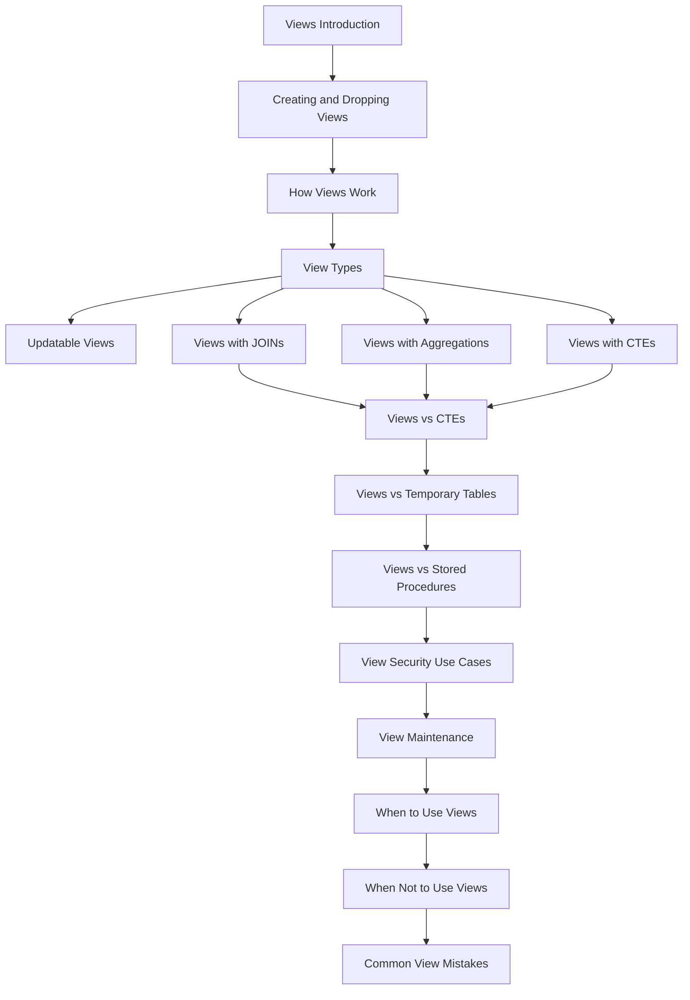

# README

## Overview

SQL views provide reusable database-level abstractions over queries. They allow teams to expose stable projections of relational data while keeping complex joins, filtering, and derived fields centralized in the database.

This section progresses from basic view creation to production concerns such as updatability, security, performance, maintainability, and choosing views against alternatives such as CTEs, temporary tables, materialized views, and stored procedures.

The emphasis is on understanding **when a view is the right abstraction**, not simply how to create one.

## Navigation

- [01- Views Introduction](./01-%20Views%20Introduction.md) — View fundamentals, purpose, characteristics, and use cases
- [02- Creating and Dropping Views](./02-%20Creating%20and%20Dropping%20Views.md) — CREATE VIEW, CREATE OR REPLACE VIEW, and DROP VIEW
- [03- How Views Work](./03-%20How%20Views%20Work.md) — Query expansion, execution, optimization, and lifecycle
- [04- View Types](./04-%20View%20Types.md) — Normal, materialized, recursive, and specialized view patterns
- [05- Updatable Views](./05-%20Updatable%20Views.md) — INSERT, UPDATE, DELETE, and view updatability rules
- [06- Views with JOINs](./06-%20Views%20with%20JOINs.md) — Combining related tables through database-level projections
- [07- Views with Aggregations](./07-%20Views%20with%20Aggregations.md) — GROUP BY, aggregate functions, reporting, and performance
- [08- Views with CTEs](./08-%20Views%20with%20CTEs.md) — Using CTEs to structure complex view definitions
- [09- Views vs CTEs](./09-%20Views%20vs%20CTEs.md) — Choosing persistent views versus query-local CTEs
- [10- Views vs Temporary Tables](./10-%20Views%20vs%20Temporary%20Tables.md) — Persistent abstractions versus session-specific intermediate data
- [11- Views vs Stored Procedures](./11-%20Views%20vs%20Stored%20Procedures.md) — Declarative data access versus procedural database logic
- [12- View Security Use Cases](./12-%20View%20Security%20Use%20Cases.md) — Data exposure, privileges, tenant isolation, and security boundaries
- [13- View Maintenance](./13-%20View%20Maintenance.md) — Dependencies, migrations, compatibility, monitoring, and ownership
- [14- When to Use Views](./14-%20When%20to%20Use%20Views.md) — Practical decision criteria and production use cases
- [15- When Not to Use Views](./15-%20When%20Not%20to%20Use%20Views.md) — Cases where application queries, CTEs, tables, or other abstractions are better
- [16- Common View Mistakes](./16-%20Common%20View%20Mistakes.md) — Performance, security, maintainability, dependency, and design pitfalls

## Recommended Reading Order



## Core Progression

### Fundamentals

Start with the mechanics and mental model:

- [01- Views Introduction](./01-%20Views%20Introduction.md)
- [02- Creating and Dropping Views](./02-%20Creating%20and%20Dropping%20Views.md)
- [03- How Views Work](./03-%20How%20Views%20Work.md)
- [04- View Types](./04-%20View%20Types.md)

These establish what a view represents, how the database executes it, and how different view types behave.

### Query Composition

Then move into views containing increasingly complex relational logic:

- [05- Updatable Views](./05-%20Updatable%20Views.md)
- [06- Views with JOINs](./06-%20Views%20with%20JOINs.md)
- [07- Views with Aggregations](./07-%20Views%20with%20Aggregations.md)
- [08- Views with CTEs](./08-%20Views%20with%20CTEs.md)

The important engineering question is not whether complex SQL can be placed inside a view, but whether the resulting abstraction remains understandable, performant, and maintainable.

### Choosing the Right Abstraction

These documents focus on architectural trade-offs:

- [09- Views vs CTEs](./09-%20Views%20vs%20CTEs.md)
- [10- Views vs Temporary Tables](./10-%20Views%20vs%20Temporary%20Tables.md)
- [11- Views vs Stored Procedures](./11-%20Views%20vs%20Stored%20Procedures.md)

The goal is to distinguish **persistent database abstractions** from **query-local transformations**, **temporary state**, and **procedural database logic**.

### Production Engineering

Finish with security, operations, and decision-making:

- [12- View Security Use Cases](./12-%20View%20Security%20Use%20Cases.md)
- [13- View Maintenance](./13-%20View%20Maintenance.md)
- [14- When to Use Views](./14-%20When%20to%20Use%20Views.md)
- [15- When Not to Use Views](./15-%20When%20Not%20to%20Use%20Views.md)
- [16- Common View Mistakes](./16-%20Common%20View%20Mistakes.md)

These topics move beyond SQL syntax into ownership, schema evolution, security boundaries, performance analysis, dependency management, and production design.

## View Decision Framework

When considering a view, evaluate the requirement across these dimensions:

| Question | Favor a View When... | Consider an Alternative When... |
|---|---|---|
| Reuse | Multiple consumers need the same stable query semantics | Only one query needs the logic |
| Ownership | The logic belongs naturally at the database layer | The behavior is application-specific |
| Data freshness | Consumers need current base-table data | Slightly stale data is acceptable and computation is expensive |
| Complexity | The view creates a useful relational abstraction | The abstraction hides excessive complexity |
| Performance | The underlying query performs acceptably | Repeated expensive computation requires materialization/cache |
| Security | A controlled database projection is useful | Authorization requires richer application or RLS semantics |
| Lifecycle | The interface is relatively stable | Requirements change frequently |
| State | Data can be derived directly from base tables | Session-specific intermediate state is required |
| Procedures | Read-oriented relational access is sufficient | Multi-step procedural workflow is required |

## Production Considerations

A production view should be treated as part of the database API rather than as disposable SQL.

Key practices include:

- Define explicit columns instead of relying on `SELECT *`.
- Give views clear, semantic names.
- Keep view dependency chains understandable.
- Manage definitions through version-controlled migrations.
- Identify downstream consumers before changing a view.
- Review execution plans for performance-critical views.
- Index the underlying tables according to actual access patterns.
- Keep sensitive columns out of views unless explicitly required.
- Apply database privileges deliberately.
- Consider Row-Level Security separately when strong tenant isolation is required.
- Monitor query latency and resource consumption for heavily used views.
- Use materialized views or dedicated read models when repeated computation is the actual bottleneck.
- Assign ownership for important production views.

## Backend Integration

Views are particularly useful when several backend components require the same stable relational projection.

For example:

```text
                    +----------------+
                    | PostgreSQL     |
                    |                |
                    | Base Tables    |
                    +-------+--------+
                            |
                            v
                    +---------------+
                    | Database View |
                    +-------+-------+
                            |
              +-------------+-------------+
              |                           |
              v                           v
       +-------------+             +-------------+
       | Django API  |             | FastAPI API |
       +-------------+             +-------------+
              |                           |
              v                           v
         REST clients                gRPC clients
```

The view should represent a database-level contract rather than become a one-to-one representation of an HTTP endpoint.

## Related Concepts

Views should be understood alongside the other SQL abstractions in this area:

| Concept | Primary Purpose |
|---|---|
| View | Persistent reusable query abstraction |
| Materialized View | Persisted result of a query for faster repeated reads |
| CTE | Query-local structure for composing SQL |
| Temporary Table | Session- or transaction-scoped intermediate data |
| Stored Procedure | Database-owned procedural workflow |
| Database Function | Reusable database-side computation |
| Cache | Avoid repeated computation or database access |
| Read Model | Application/architecture-level representation optimized for reads |

The central design principle is:

> Choose the abstraction based on data lifecycle, ownership, consistency requirements, performance characteristics, and operational complexity—not simply on how convenient the SQL syntax looks.

## Key Takeaways

- **Views are persistent database interfaces that should represent stable relational concepts, not individual API endpoints by default.**
- **Understand how views execute before using them for performance; a normal view does not inherently materialize or cache its results.**
- **Choose between views, CTEs, temporary tables, materialized views, stored procedures, and application logic based on lifecycle and ownership requirements.**
- **Production views require deliberate security, dependency management, schema evolution, performance testing, monitoring, and ownership.**
- **The final decision should optimize for correctness, maintainability, performance, and operational simplicity rather than merely reducing SQL duplication.**