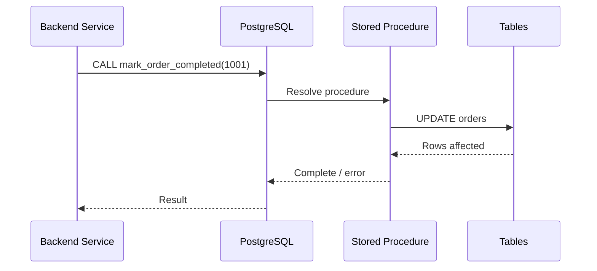
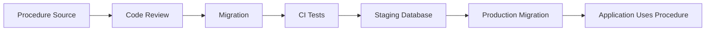

# 01- Stored Procedures Introduction

## Overview

A stored procedure is a named, database-resident program that can execute SQL statements and procedural logic, often including parameters, variables, conditionals, loops, error handling, and transaction-related operations depending on the database engine.

Stored procedures move part of the application's execution model into the database:

```text
Application
    |
    | CALL procedure(...)
    v
Database
    |
    +--> Validate inputs
    +--> Read data
    +--> Apply business/database logic
    +--> Modify data
    +--> Return results
    |
    v
Application
```

They are most valuable when logic is tightly coupled to database state and benefits from executing close to the data. They become less attractive when they introduce unnecessary coupling, duplicate application logic, complicate deployment, or make testing and observability harder.

This document uses PostgreSQL terminology and PL/pgSQL examples. Stored procedure capabilities and exact semantics differ across database engines.

## Procedure vs Function

Terminology varies by database system. PostgreSQL distinguishes **functions** from **procedures**.

A PostgreSQL function is invoked as part of an expression or with `SELECT`, while a procedure is invoked with `CALL`.

```sql
SELECT calculate_order_total(1001);
```

versus:

```sql
CALL process_order(1001);
```

The distinction matters because transaction control capabilities differ. PostgreSQL procedures can use transaction control in contexts where functions cannot, subject to PostgreSQL's invocation rules.

Other database systems use the term "stored procedure" more broadly, so always verify the behavior of the target engine.

| Characteristic | Stored Procedure | Function |
|---|---|---|
| Named database object | Yes | Yes |
| Parameters | Yes | Yes |
| Procedural logic | Typically | Typically |
| Called with `CALL` | PostgreSQL procedures | No |
| Can participate in expressions | Generally no | Yes |
| Common use | Database workflows / commands | Reusable computation / queries |
| Return model | Database-engine specific | Database-engine specific |

## Why Stored Procedures Exist

Stored procedures solve several database-level problems.

### Encapsulating Database Workflows

A procedure can group multiple database operations behind one interface:

```sql
CALL process_order(1001);
```

Internally, it might:

1. Validate the order.
2. Check inventory.
3. Update inventory.
4. Update order state.
5. Record an audit event.

This can prevent multiple clients from implementing slightly different versions of the same database workflow.

### Reducing Network Round Trips

Without a procedure:

```text
Application -> DB: Check order
Application -> DB: Check inventory
Application -> DB: Update inventory
Application -> DB: Update order
Application -> DB: Insert audit
```

A procedure can consolidate the interaction:

```text
Application -> DB: CALL process_order(...)
                         |
                         +--> Check order
                         +--> Check inventory
                         +--> Update inventory
                         +--> Update order
                         +--> Insert audit
```

This can reduce application/database round trips, although network latency is only one part of overall query performance.

### Centralizing Database-Owned Rules

Some rules naturally belong close to the database because they protect data integrity across multiple consumers.

Examples include:

- Ledger operations.
- Inventory adjustments.
- Database-side reconciliation.
- Complex bulk transformations.
- Administrative maintenance workflows.
- Controlled state transitions.

A procedure can provide a controlled entry point instead of allowing every consumer to reproduce the same SQL sequence.

## Basic Structure

A PostgreSQL procedure can be defined with `CREATE PROCEDURE`.

```sql
CREATE OR REPLACE PROCEDURE mark_order_completed(p_order_id bigint)
LANGUAGE plpgsql
AS $$
BEGIN
    UPDATE orders
    SET
        status = 'completed',
        completed_at = CURRENT_TIMESTAMP
    WHERE order_id = p_order_id
      AND status = 'processing';

    IF NOT FOUND THEN
        RAISE EXCEPTION
            'Order % does not exist or is not processing',
            p_order_id;
    END IF;
END;
$$;
```

Invoke it with:

```sql
CALL mark_order_completed(1001);
```

The procedure becomes a database object with its own lifecycle.

## How Execution Works

At a high level:



The database is responsible for:

- Resolving the procedure.
- Validating argument types.
- Executing the procedural statements.
- Enforcing permissions.
- Managing database execution context.
- Applying constraints and triggers.
- Reporting errors.

The procedure does not bypass normal database correctness mechanisms.

## Parameters

Procedures commonly accept input parameters.

```sql
CREATE OR REPLACE PROCEDURE cancel_order(
    p_order_id bigint,
    p_reason text
)
LANGUAGE plpgsql
AS $$
BEGIN
    UPDATE orders
    SET
        status = 'cancelled',
        cancellation_reason = p_reason,
        cancelled_at = CURRENT_TIMESTAMP
    WHERE order_id = p_order_id
      AND status IN ('pending', 'processing');

    IF NOT FOUND THEN
        RAISE EXCEPTION
            'Order % cannot be cancelled',
            p_order_id;
    END IF;
END;
$$;
```

Call it with:

```sql
CALL cancel_order(
    1001,
    'Customer requested cancellation'
);
```

### Parameter Best Practices

Prefer:

- Explicit parameter types.
- Consistent parameter naming.
- Input validation.
- Meaningful parameter names.
- Stable procedure interfaces.

Avoid ambiguous interfaces such as:

```sql
CALL process(1, 2, 3, NULL, NULL, NULL);
```

A procedure is an API at the database boundary. Its interface should be understandable without reading its implementation.

## Variables and Procedural Logic

PL/pgSQL allows local variables and control flow.

```sql
CREATE OR REPLACE PROCEDURE apply_discount(
    p_order_id bigint,
    p_discount numeric
)
LANGUAGE plpgsql
AS $$
DECLARE
    v_total numeric;
BEGIN
    SELECT total_amount
    INTO v_total
    FROM orders
    WHERE order_id = p_order_id
    FOR UPDATE;

    IF NOT FOUND THEN
        RAISE EXCEPTION 'Order % not found', p_order_id;
    END IF;

    IF p_discount < 0 OR p_discount > v_total THEN
        RAISE EXCEPTION 'Invalid discount for order %', p_order_id;
    END IF;

    UPDATE orders
    SET total_amount = total_amount - p_discount
    WHERE order_id = p_order_id;
END;
$$;
```

This demonstrates an important database-level pattern:

```text
Read required state
       |
       v
Lock relevant row
       |
       v
Validate state
       |
       v
Modify state
```

For concurrency-sensitive workflows, the locking strategy matters as much as the procedural logic.

## Stored Procedures and Transactions

Stored procedures often appear in discussions about transactions because they can group multiple operations into one database-side workflow.

For example:

```sql
BEGIN;

CALL process_order(1001);

COMMIT;
```

The exact transaction behavior depends on the database engine.

In PostgreSQL, a procedure can have transaction-control capabilities unavailable to a function, but transaction commands inside a procedure are subject to restrictions based on how the procedure is invoked.

Do not assume:

```text
CALL procedure
=
automatic independent transaction
```

A procedure does not automatically imply a separate transaction boundary.

For application-owned transactions, the backend framework may still control the transaction:

```text
Django/FastAPI service
        |
        v
BEGIN
        |
        v
CALL database procedure
        |
        v
COMMIT / ROLLBACK
```

The transaction ownership model should be explicit.

## Stored Procedures vs Application Logic

The key architectural decision is determining where the behavior belongs.

| Consideration | Application Logic | Stored Procedure |
|---|---|---|
| Business logic changes frequently | Strong fit | Often weaker fit |
| Database-specific logic | Weak fit | Strong fit |
| Multiple database consumers | Can duplicate logic | Strong fit |
| Complex database workflow | Sometimes inefficient | Strong fit |
| Unit testing | Usually easier | Database test environment required |
| Deployment | Application deployment | Database migration/deployment |
| Portability | Usually higher | Usually lower |
| Database round trips | Potentially higher | Can reduce them |
| Database coupling | Lower | Higher |
| Data integrity enforcement | Limited to DB constraints | Strong database integration |

A useful rule is:

> Put logic in the database when database ownership provides a concrete correctness, consistency, performance, or security advantage.

Do not move logic into a procedure simply because the SQL is complicated.

## Stored Procedures vs Views

Views and stored procedures solve different problems.

```text
View
    |
    +--> Represents data
    +--> Primarily declarative
    +--> Queryable with SELECT

Stored Procedure
    |
    +--> Performs an operation
    +--> Can contain procedural logic
    +--> Invoked explicitly
```

For example:

```sql
SELECT *
FROM customer_account_summary;
```

is a read abstraction.

Whereas:

```sql
CALL close_customer_account(1001);
```

represents an operation.

| Requirement | View | Stored Procedure |
|---|---:|---:|
| Reusable read projection | Yes | Not primary purpose |
| Complex database workflow | No | Yes |
| Procedural branching | No | Yes |
| Multi-step mutation | No | Yes |
| API-like database operation | Limited | Strong fit |
| Aggregated read model | Yes | Not primary purpose |

## Stored Procedures in Backend Systems

A typical architecture might look like:

```text
                   +------------------+
                   | API Gateway/Nginx|
                   +--------+---------+
                            |
                            v
                   +------------------+
                   | Django/FastAPI   |
                   | Service          |
                   +--------+---------+
                            |
                     CALL procedure
                            |
                            v
                   +------------------+
                   | PostgreSQL       |
                   |                  |
                   | Procedure        |
                   +--------+---------+
                            |
                 +----------+----------+
                 |          |          |
                 v          v          v
              Orders    Inventory    Audit
```

This can be useful when multiple services must invoke the same database-owned operation.

However, in a microservices architecture, sharing one database and exposing stored procedures across services can create strong coupling.

A procedure should not become a mechanism for bypassing service ownership boundaries without deliberate architectural justification.

## Advantages

### Strong Database Consistency

A procedure can execute related changes close to the data and rely directly on:

- Transactions.
- Constraints.
- Locks.
- Foreign keys.
- Database functions.
- Triggers.

This can make certain state transitions easier to enforce consistently.

### Reduced Round Trips

Multiple operations can be executed through one database call.

This is especially useful for latency-sensitive workflows involving several dependent database operations.

### Centralized Database Logic

Multiple consumers can use one implementation:

```text
Service A ----+
              |
Service B ----+--> Stored Procedure --> Database
              |
Admin Tool ---+
```

This avoids reproducing identical database workflows in several clients.

### Controlled Database Interface

Permissions can be designed around procedure execution rather than granting broad access to underlying tables, depending on the database engine and security model.

## Limitations

### Database Vendor Coupling

PL/pgSQL, T-SQL, PL/SQL, and other procedural languages are not interchangeable.

A procedure written for PostgreSQL may require substantial rewriting for another database engine.

### More Complex Testing

Application unit tests usually do not execute the real database engine.

Procedure correctness therefore requires database integration tests against a representative database version and schema.

### Deployment Coupling

A procedure is part of the database schema.

Changes should normally be deployed through migrations or another controlled database deployment mechanism.

### Debugging Complexity

A request can cross several layers:

```text
HTTP
  -> Application
  -> ORM/Driver
  -> Procedure
  -> Function
  -> Trigger
  -> Table
```

When database-side logic becomes excessive, tracing failures becomes harder.

### Potential for Hidden Business Logic

A procedure can hide significant behavior behind:

```sql
CALL process_order(...);
```

The application developer may not immediately see:

- Which tables are modified.
- Which locks are acquired.
- Which validations occur.
- Which side effects happen.
- Which errors are possible.

Good naming and documentation are therefore important.

## Performance Considerations

Stored procedures can reduce round trips, but they do not magically make SQL fast.

The underlying operations still depend on:

- Indexes.
- Join strategies.
- Cardinality.
- Query plans.
- Lock contention.
- I/O.
- CPU.
- Network transfer.
- Concurrent workload.

A procedure containing:

```sql
FOR record IN
    SELECT ...
LOOP
    UPDATE ...
END LOOP;
```

may perform poorly when a set-based SQL operation would work better.

Prefer:

```sql
UPDATE orders
SET status = 'processed'
WHERE status = 'pending';
```

over procedural row-by-row processing when the operation can be expressed efficiently as a set operation.

### Performance Rule

**Use procedural control flow when the workflow requires it; use set-based SQL whenever the database can perform the operation directly.**

## Security Considerations

Stored procedures can become part of a database security boundary.

A carefully designed procedure can expose a narrow operation:

```sql
CALL transfer_funds(
    1001,
    2002,
    500.00
);
```

instead of granting a role unrestricted `UPDATE` access to account tables.

However, security depends on the complete privilege model.

Review:

- `EXECUTE` privileges.
- Table privileges.
- Function/procedure ownership.
- `SECURITY DEFINER` behavior where applicable.
- `search_path` handling.
- Input validation.
- SQL injection risks in dynamic SQL.
- Row-Level Security interaction.
- Audit requirements.

Dynamic SQL is particularly important:

```sql
EXECUTE format(
    'DELETE FROM %I WHERE id = $1',
    p_table_name
)
USING p_id;
```

Identifiers and values require different handling. Use database-provided quoting mechanisms rather than concatenating untrusted input into SQL.

For security-sensitive procedures, review the complete execution context rather than assuming procedure encapsulation is sufficient.

## Error Handling

Database procedures can validate conditions and raise errors.

```sql
IF p_amount <= 0 THEN
    RAISE EXCEPTION 'Amount must be positive';
END IF;
```

Applications should treat these errors as part of the database interface.

A backend service should map database failures deliberately:

```text
Database error
      |
      v
Database driver
      |
      v
Application exception handling
      |
      v
Domain/API response
```

Do not expose raw database error messages directly to API clients.

Use stable application-level error mapping where appropriate.

## Naming and Interface Design

Prefer names that communicate the operation:

```text
create_invoice
finalize_order
reserve_inventory
close_account
rebuild_customer_metrics
```

Avoid generic names:

```text
process_data
execute_task
run_operation
update_record
```

A good procedure interface should make clear:

- What operation it performs.
- Which entity it operates on.
- Which inputs are required.
- What failure conditions exist.
- What side effects occur.

## Version Control and Deployment

Stored procedures should be treated as source-controlled production code.

A typical migration might contain:

```sql
CREATE OR REPLACE PROCEDURE finalize_order(
    p_order_id bigint
)
LANGUAGE plpgsql
AS $$
BEGIN
    UPDATE orders
    SET status = 'completed'
    WHERE order_id = p_order_id
      AND status = 'processing';

    IF NOT FOUND THEN
        RAISE EXCEPTION 'Order cannot be finalized';
    END IF;
END;
$$;
```

Deployment should follow a controlled sequence:



Avoid manually editing production procedures through an interactive SQL console unless the operation is an emergency and is subsequently reconciled with source control.

## Observability

Database-side logic needs operational visibility.

For important procedures, monitor:

- Invocation frequency.
- Execution duration.
- Error rate.
- Lock waits.
- Deadlocks.
- Rows affected.
- Query-level resource consumption.
- Transaction duration.

The application should also log the operation context:

```text
request_id
user/service identity
procedure name
relevant entity ID
execution duration
success/failure
database error category
```

Avoid logging sensitive procedure arguments indiscriminately.

## Common Mistakes

### Putting All Business Logic in Stored Procedures

A database can technically contain substantial business logic, but that does not mean it should.

Problems include:

- Reduced portability.
- Harder application-level testing.
- Database-heavy deployment processes.
- Difficult local development.
- Hidden dependencies.
- Strong database coupling.

Use database procedures selectively.

### Performing Row-by-Row Processing

Procedural loops can create large numbers of database operations.

Prefer set-based SQL when possible.

### Granting Excessive Permissions

Do not assume procedure-based access is secure automatically.

Review whether application roles can still directly modify the underlying tables.

### Hiding Side Effects

A procedure called:

```sql
CALL update_customer(...);
```

should not unexpectedly:

- Delete unrelated records.
- Publish external events.
- Modify many unrelated tables.
- Change security state.

Keep side effects explicit and documented.

### Ignoring Locking

A procedure can hold locks for longer than expected.

Long-running procedures can cause:

```text
Lock contention
    |
    v
Queued transactions
    |
    v
Connection pool saturation
    |
    v
API latency
```

Keep transactions and critical sections appropriately scoped.

### Using Dynamic SQL Without Care

Never construct dynamic SQL by directly concatenating untrusted values.

Use parameterization for values and proper identifier-quoting mechanisms for identifiers.

### Treating Procedures as Invisible Infrastructure

Procedures are schema objects and should have:

- Source control.
- Code review.
- Tests.
- Ownership.
- Documentation.
- Deployment procedures.
- Monitoring where operationally important.

## When Stored Procedures Are a Good Fit

Stored procedures are strong candidates when:

- Several consumers require the same database-owned operation.
- Correctness depends on atomic multi-step database changes.
- The workflow is tightly coupled to relational state.
- Reducing database round trips has measurable value.
- Database-level permissions should expose a narrow operation.
- Bulk database operations benefit from database-side execution.
- The logic is relatively stable.
- Database portability is not a primary requirement.

## When to Prefer Application Logic

Application code is often a better fit when:

- Rules change frequently.
- Logic depends heavily on external services.
- Behavior is product-specific.
- Feature flags and experimentation dominate the workflow.
- The logic is easier to unit test outside the database.
- The service owns the business process.
- Database portability matters.
- The procedure would become a large application hidden inside the database.

A useful boundary is:

```text
Database
    |
    +--> Data integrity
    +--> Relational transformations
    +--> Database-local workflows
    +--> Atomic state transitions

Application
    |
    +--> Product/business orchestration
    +--> External service calls
    +--> API behavior
    +--> Feature flags
    +--> Distributed workflows
```

The boundary is architectural, not absolute.

## Production Checklist

Before introducing a stored procedure, verify:

- [ ] The database is the appropriate owner of the logic.
- [ ] The procedure has a clear and stable interface.
- [ ] Input validation is explicit.
- [ ] Transaction ownership is understood.
- [ ] Lock behavior has been reviewed.
- [ ] Set-based SQL is used where appropriate.
- [ ] Required indexes exist.
- [ ] Execution performance has been tested with realistic data.
- [ ] Error behavior is documented.
- [ ] Permissions follow least privilege.
- [ ] Dynamic SQL is safely parameterized/quoted.
- [ ] Dependencies are known.
- [ ] The procedure is version-controlled.
- [ ] CI executes database integration tests.
- [ ] Deployment and rollback strategy are defined.
- [ ] Important production behavior is observable.
- [ ] Application code maps database errors safely.

## Interview Traps

### "Does a Stored Procedure Automatically Run in Its Own Transaction?"

No. Transaction behavior is database-specific and depends on how the procedure is invoked and the surrounding transaction context.

### "Are Stored Procedures Always Faster?"

No. They can reduce round trips and execute logic close to the data, but poor SQL, inefficient loops, locking, missing indexes, and bad query plans can still make them slow.

### "Should All Business Logic Be Stored in the Database?"

No. Database procedures are appropriate for selected database-owned operations. Application-level orchestration often remains the better architectural boundary.

### "Why Use a Stored Procedure Instead of Multiple SQL Statements?"

Potential advantages include atomic database workflows, centralized logic, reduced round trips, and controlled database permissions.

### "Are Stored Procedures Portable?"

Usually not fully. Procedural languages and database-specific capabilities vary substantially between engines.

### "Can a Stored Procedure Replace Database Constraints?"

No. Procedures can implement rules, but fundamental invariants should generally also be protected with appropriate database constraints such as `NOT NULL`, `UNIQUE`, `CHECK`, and foreign keys where applicable.

## Key Takeaways

- **Stored procedures are database-resident operations that are most valuable when correctness, atomicity, performance, or security benefits justify moving logic into the database.**
- **A procedure is not automatically faster; execution still depends on SQL quality, indexes, query plans, locking, I/O, and workload characteristics.**
- **Keep database-owned workflows focused and stable, while application services remain responsible for API behavior, external integrations, and distributed business orchestration.**
- **Treat procedures as production code: version-control them, test them against the real database engine, review permissions and locking, and deploy them through controlled migrations.**
- **Use procedures deliberately because they increase database coupling and can make testing, debugging, portability, and deployment more complex.**