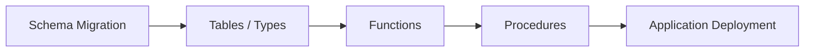

# 02- Stored Procedure Structure

## Overview

A stored procedure is a named database object that encapsulates one or more SQL statements and, depending on the database engine, procedural logic such as variables, conditionals, loops, exception handling, and transaction-related operations.

Understanding the structure of a stored procedure is important because production procedures are more than a block of SQL. They have a defined interface, execution context, dependency graph, transaction behavior, error semantics, and security model.

This document uses **PostgreSQL and PL/pgSQL** examples. Syntax and capabilities differ across PostgreSQL, MySQL, SQL Server, Oracle, and other database engines.

A useful mental model is:

```text
Procedure Definition
        |
        +--> Name
        +--> Parameters
        +--> Language
        +--> Execution/security attributes
        +--> Declaration section
        +--> Executable section
        +--> Error handling
        |
        v
Database Object
        |
        v
CALL procedure(...)
```

## Basic Procedure Structure

The basic PostgreSQL structure is:

```sql
CREATE OR REPLACE PROCEDURE procedure_name(
    parameter_name data_type
)
LANGUAGE plpgsql
AS $$
DECLARE
    -- Local variables
BEGIN
    -- SQL and procedural statements
END;
$$;
```

A practical example:

```sql
CREATE OR REPLACE PROCEDURE mark_order_completed(
    p_order_id bigint
)
LANGUAGE plpgsql
AS $$
BEGIN
    UPDATE orders
    SET
        status = 'completed',
        completed_at = CURRENT_TIMESTAMP
    WHERE order_id = p_order_id
      AND status = 'processing';

    IF NOT FOUND THEN
        RAISE EXCEPTION
            'Order % does not exist or is not processing',
            p_order_id;
    END IF;
END;
$$;
```

The procedure can then be invoked with:

```sql
CALL mark_order_completed(1001);
```

The structure separates the **procedure interface** from its **implementation**:

```text
CALL mark_order_completed(1001)
                |
                v
        Parameter binding
                |
                v
        Procedure execution
                |
        +-------+-------+
        |               |
        v               v
      SQL           PL/pgSQL
   statements       control flow
        |               |
        +-------+-------+
                |
                v
          Database state
```

## Procedure Name

The procedure name identifies the database object.

```sql
CREATE OR REPLACE PROCEDURE finalize_order(...)
```

Choose names that communicate an operation:

```text
create_invoice
finalize_order
cancel_order
reserve_inventory
recalculate_account_balance
archive_old_events
```

Avoid vague names:

```text
process_data
run_task
update_record
do_operation
```

A procedure is effectively an API at the database boundary. Its name should communicate the operation without requiring callers to inspect the implementation.

### Naming Considerations

Prefer:

- A verb describing the operation.
- An explicit entity where useful.
- Consistent naming conventions across the schema.
- Names that remain meaningful as implementation details evolve.

Do not encode implementation details unnecessarily:

```text
update_orders_using_cursor_v2
```

The caller should depend on the behavior, not how the procedure happens to implement it.

## Parameters

Parameters define the procedure's input interface.

```sql
CREATE OR REPLACE PROCEDURE cancel_order(
    p_order_id bigint,
    p_reason text
)
LANGUAGE plpgsql
AS $$
BEGIN
    UPDATE orders
    SET
        status = 'cancelled',
        cancellation_reason = p_reason,
        cancelled_at = CURRENT_TIMESTAMP
    WHERE order_id = p_order_id
      AND status IN ('pending', 'processing');
END;
$$;
```

Invoke it with:

```sql
CALL cancel_order(
    1001,
    'Customer requested cancellation'
);
```

### Parameter Naming

A common PostgreSQL convention is to prefix procedure parameters with `p_`:

```sql
p_order_id
p_customer_id
p_amount
p_reason
```

This makes the distinction between parameters and table columns obvious.

For example:

```sql
UPDATE orders
SET status = 'cancelled'
WHERE order_id = p_order_id;
```

Without clear naming, code such as this can become ambiguous or error-prone:

```sql
WHERE order_id = order_id;
```

The parameter contract should also be documented when the procedure is consumed by multiple applications or services.

## Parameter Data Types

Use the narrowest appropriate type that matches the domain.

```sql
CREATE OR REPLACE PROCEDURE adjust_inventory(
    p_product_id bigint,
    p_quantity integer
)
LANGUAGE plpgsql
AS $$
BEGIN
    UPDATE inventory
    SET quantity = quantity + p_quantity
    WHERE product_id = p_product_id;
END;
$$;
```

Avoid using generic types such as `text` for every parameter merely to simplify the interface.

Strong parameter types provide:

- Earlier validation.
- Better API clarity.
- Fewer implicit conversions.
- Better documentation.
- Reduced ambiguity.

## Default Parameters

PostgreSQL supports default parameter values.

```sql
CREATE OR REPLACE PROCEDURE archive_orders(
    p_before timestamp with time zone,
    p_batch_size integer DEFAULT 1000
)
LANGUAGE plpgsql
AS $$
BEGIN
    DELETE FROM orders
    WHERE created_at < p_before
    LIMIT p_batch_size;
END;
$$;
```

When using defaults, ensure the default represents a safe production behavior.

For destructive operations, implicit defaults can be dangerous. Prefer explicit arguments when omission could result in an unexpectedly large operation.

## The Language Clause

The `LANGUAGE` clause specifies the implementation language.

```sql
LANGUAGE plpgsql
```

PostgreSQL supports multiple procedural languages depending on installation and configuration.

For database-centric procedural logic, PL/pgSQL is the standard choice in PostgreSQL.

The language affects:

- Syntax.
- Control flow.
- Available APIs.
- Error handling.
- Performance characteristics.
- Security considerations.

Do not assume that PL/pgSQL syntax or semantics transfer to another database engine.

## The Procedure Body

The procedure body is commonly enclosed using PostgreSQL dollar quoting:

```sql
AS $$
BEGIN
    -- Procedure implementation
END;
$$;
```

Dollar quoting avoids the need to escape single quotes throughout procedural code.

For example:

```sql
RAISE EXCEPTION 'Order % not found', p_order_id;
```

is easier to maintain than deeply escaped string literals.

A custom dollar-quote tag can also be used:

```sql
AS $procedure$
BEGIN
    -- Procedure implementation
END;
$procedure$;
```

This becomes useful when the procedure body itself contains complex quoted SQL.

## The Declaration Section

PL/pgSQL procedures can define local variables between `DECLARE` and `BEGIN`.

```sql
CREATE OR REPLACE PROCEDURE process_payment(
    p_payment_id bigint
)
LANGUAGE plpgsql
AS $$
DECLARE
    v_amount numeric;
    v_status text;
BEGIN
    SELECT amount, status
    INTO v_amount, v_status
    FROM payments
    WHERE payment_id = p_payment_id;

    -- Further processing
END;
$$;
```

A common naming convention is:

```text
p_  -> procedure parameter
v_  -> local variable
```

This makes the execution context easier to understand.

### Variable Initialization

Variables can be initialized when declared:

```sql
DECLARE
    v_attempts integer := 0;
    v_processed_at timestamptz := CURRENT_TIMESTAMP;
```

Use initialization when the default value is meaningful to the procedure's logic.

## Variable Scope

Variables declared in an outer block are available within nested blocks unless shadowed.

```sql
DECLARE
    v_total numeric := 0;
BEGIN
    -- v_total is available here

    DECLARE
        v_discount numeric := 10;
    BEGIN
        -- Both variables are available here
    END;
END;
```

Avoid excessive nesting and shadowing because it increases cognitive load and makes debugging harder.

## Executable Section

The executable section starts with `BEGIN` and ends with `END`.

```sql
BEGIN
    UPDATE orders
    SET status = 'completed'
    WHERE order_id = p_order_id;
END;
```

It can contain:

- `SELECT ... INTO`.
- `INSERT`.
- `UPDATE`.
- `DELETE`.
- Conditional statements.
- Loops.
- Procedure/function calls.
- Exception blocks.
- Dynamic SQL.
- Other PL/pgSQL statements.

The `BEGIN`/`END` block is a **PL/pgSQL code block**. It should not automatically be interpreted as a transaction boundary.

## SQL Statements Inside Procedures

Most database operations remain ordinary SQL.

```sql
BEGIN
    UPDATE inventory
    SET quantity = quantity - p_quantity
    WHERE product_id = p_product_id;

    INSERT INTO inventory_audit (
        product_id,
        quantity_delta,
        created_at
    )
    VALUES (
        p_product_id,
        -p_quantity,
        CURRENT_TIMESTAMP
    );
END;
```

The procedural language controls the workflow while SQL performs the relational operations.

Prefer set-based SQL whenever possible rather than replacing efficient SQL with procedural loops.

## `SELECT INTO`

PL/pgSQL uses `SELECT ... INTO` to assign query results to variables.

```sql
DECLARE
    v_status text;
BEGIN
    SELECT status
    INTO v_status
    FROM orders
    WHERE order_id = p_order_id;

    IF v_status IS NULL THEN
        RAISE EXCEPTION 'Order % not found', p_order_id;
    END IF;
END;
```

For important state transitions, explicitly consider:

- What happens when zero rows are returned?
- What happens when multiple rows are returned?
- Should the selected row be locked?
- Can the data change concurrently?

For example:

```sql
SELECT status
INTO v_status
FROM orders
WHERE order_id = p_order_id
FOR UPDATE;
```

The lock may be required when the procedure reads state and subsequently modifies the same row.

## Conditional Logic

PL/pgSQL supports `IF`, `ELSIF`, and `ELSE`.

```sql
IF p_amount <= 0 THEN
    RAISE EXCEPTION 'Amount must be positive';
ELSIF p_amount > 100000 THEN
    RAISE EXCEPTION 'Amount exceeds permitted limit';
ELSE
    -- Continue processing
END IF;
```

Conditional logic is useful when subsequent database operations depend on current state.

Avoid deeply nested conditional logic. If a procedure starts resembling an entire application service, reconsider whether the responsibility belongs in the database.

## `CASE` Expressions

For value selection, SQL `CASE` is often preferable to procedural branching.

```sql
SELECT CASE
    WHEN total_amount >= 1000 THEN 'premium'
    WHEN total_amount >= 500 THEN 'standard'
    ELSE 'basic'
END
INTO v_customer_tier
FROM orders
WHERE order_id = p_order_id;
```

Use SQL expressions for data transformation and PL/pgSQL control flow for workflow decisions.

## Loops

Procedures can iterate over records.

```sql
DECLARE
    v_order record;
BEGIN
    FOR v_order IN
        SELECT order_id
        FROM orders
        WHERE status = 'pending'
    LOOP
        UPDATE orders
        SET status = 'processing'
        WHERE order_id = v_order.order_id;
    END LOOP;
END;
```

This is sometimes appropriate when each iteration requires genuinely different procedural behavior.

However, row-by-row processing is frequently slower than a set-based operation.

Prefer:

```sql
UPDATE orders
SET status = 'processing'
WHERE status = 'pending';
```

when the operation can be expressed as one set-based statement.

## Exception Handling

PL/pgSQL supports exception blocks.

```sql
BEGIN
    INSERT INTO payments (
        order_id,
        amount
    )
    VALUES (
        p_order_id,
        p_amount
    );

EXCEPTION
    WHEN unique_violation THEN
        RAISE EXCEPTION
            'Payment already exists for order %',
            p_order_id;
END;
```

Exception handling should be used for meaningful recovery or translation of expected database errors.

Avoid catching every exception without re-raising or handling it correctly:

```sql
EXCEPTION
    WHEN OTHERS THEN
        NULL;
```

This can hide serious production failures.

## Transaction Context

One of the most important structural distinctions is:

```text
PL/pgSQL BEGIN/END
        !=
Transaction BEGIN/COMMIT
```

A procedure body being wrapped in:

```sql
BEGIN
    ...
END;
```

does not mean the body automatically creates a separate transaction.

The caller may execute:

```sql
BEGIN;

CALL process_order(1001);

COMMIT;
```

The procedure executes within the surrounding transaction context unless the database-specific rules allow and require different transaction control.

Transaction semantics must therefore be designed explicitly.

## Procedure Attributes

Production procedure definitions may include additional attributes depending on the database engine.

For PostgreSQL, attributes can include security-related execution behavior and transaction characteristics.

For example:

```sql
CREATE OR REPLACE PROCEDURE refresh_reporting_data()
LANGUAGE plpgsql
SECURITY INVOKER
AS $$
BEGIN
    -- Refresh logic
END;
$$;
```

`SECURITY INVOKER` means the procedure executes with the privileges of the caller.

Security behavior becomes particularly important when using `SECURITY DEFINER`.

Do not use elevated execution privileges without understanding:

- Ownership.
- Object privileges.
- `search_path`.
- Dynamic SQL.
- Role inheritance.
- Row-Level Security.
- Which objects the procedure can access.

## Security Definer Procedures

A `SECURITY DEFINER` routine executes with the privileges of its owner rather than the caller.

This can be useful when exposing a controlled operation without granting direct access to underlying tables.

Conceptually:

```text
Application Role
      |
      | EXECUTE
      v
SECURITY DEFINER Procedure
      |
      | Owner privileges
      v
Protected Tables
```

This is a powerful security mechanism and therefore requires careful hardening.

A security-definer procedure should have:

- A controlled owner role.
- Minimal required privileges.
- A safe `search_path`.
- Carefully controlled dynamic SQL.
- Explicit `EXECUTE` privileges.
- No unnecessary access to attacker-controlled objects.

Do not treat `SECURITY DEFINER` as a generic way to "make permissions work."

## Dynamic SQL

When SQL structure must be determined at runtime, PostgreSQL provides `EXECUTE`.

```sql
EXECUTE format(
    'UPDATE %I SET status = $1 WHERE id = $2',
    p_table_name
)
USING p_status, p_id;
```

There are two different categories of dynamic data:

| Dynamic Element | Safe Technique |
|---|---|
| Data value | `USING` parameters |
| SQL identifier | `%I` through `format()` |
| SQL literal | Avoid manual concatenation; parameterize where possible |

Never build dynamic SQL using direct concatenation of untrusted input:

```sql
EXECUTE 'UPDATE ' || p_table_name ||
        ' SET status = ''' || p_status || '''';
```

This can create SQL injection vulnerabilities.

## Calling Other Database Objects

Procedures can call other procedures and functions.

```sql
BEGIN
    PERFORM validate_order(p_order_id);
    PERFORM calculate_order_total(p_order_id);

    CALL write_order_audit(p_order_id);
END;
```

This allows database logic to be decomposed into reusable components.

However, excessive chaining can create a difficult dependency graph:

```text
procedure A
   |
   +--> function B
   |      |
   |      +--> function C
   |
   +--> procedure D
          |
          +--> trigger E
                 |
                 +--> function F
```

For critical procedures, understand the complete dependency chain before making changes.

## Procedure Dependencies

A procedure can depend on:

- Tables.
- Views.
- Functions.
- Other procedures.
- Types.
- Sequences.
- Extensions.
- Triggers.
- Roles and privileges.

These dependencies should be considered during schema migrations.

A production deployment might therefore look like:



The exact ordering depends on the dependencies and database engine.

## Procedure Return Behavior

Procedures and functions should not be treated as interchangeable.

A PostgreSQL procedure is invoked using:

```sql
CALL process_order(1001);
```

A function can participate in SQL expressions:

```sql
SELECT calculate_order_total(1001);
```

If the primary requirement is to compute or return a value that naturally participates in queries, a function may be a better abstraction.

If the primary requirement is an explicit database operation, a procedure may be appropriate.

## Result Sets and Output Interfaces

Procedure result behavior varies by database engine.

PostgreSQL procedures do not behave exactly like functions that return scalar values or result sets. When designing a procedure interface, be explicit about how callers obtain information:

- OUT/INOUT parameters where supported and appropriate.
- Tables affected by the operation.
- Status records.
- Separate functions for queries.
- Exceptions for failure conditions.

For example, rather than forcing a mutation procedure to become a general-purpose query API:

```text
CALL finalize_order(...)
```

can perform the mutation while a separate query can retrieve the resulting state:

```sql
SELECT *
FROM orders
WHERE order_id = 1001;
```

This separation often produces a clearer contract.

## A Production-Oriented Example

Consider an inventory reservation workflow.

Requirements:

- Verify the product exists.
- Lock the inventory row.
- Verify sufficient stock.
- Decrement available inventory.
- Record the reservation.
- Fail atomically if the reservation cannot be created.

A simplified PostgreSQL procedure:

```sql
CREATE OR REPLACE PROCEDURE reserve_inventory(
    p_product_id bigint,
    p_order_id bigint,
    p_quantity integer
)
LANGUAGE plpgsql
AS $$
DECLARE
    v_available integer;
BEGIN
    IF p_quantity <= 0 THEN
        RAISE EXCEPTION 'Quantity must be positive';
    END IF;

    SELECT available_quantity
    INTO v_available
    FROM inventory
    WHERE product_id = p_product_id
    FOR UPDATE;

    IF NOT FOUND THEN
        RAISE EXCEPTION
            'Product % does not have an inventory record',
            p_product_id;
    END IF;

    IF v_available < p_quantity THEN
        RAISE EXCEPTION
            'Insufficient inventory for product %',
            p_product_id;
    END IF;

    UPDATE inventory
    SET available_quantity = available_quantity - p_quantity
    WHERE product_id = p_product_id;

    INSERT INTO inventory_reservations (
        product_id,
        order_id,
        quantity,
        created_at
    )
    VALUES (
        p_product_id,
        p_order_id,
        p_quantity,
        CURRENT_TIMESTAMP
    );
END;
$$;
```

The important part is not the syntax. The procedure combines:

```text
Input validation
      |
      v
Row-level locking
      |
      v
State validation
      |
      v
State mutation
      |
      v
Audit/domain record
```

This is a strong candidate for database-owned logic when inventory correctness must be enforced close to the data.

## Backend Integration

A Python backend can invoke a PostgreSQL procedure through a database driver.

For example, using Django's database connection:

```python
from django.db import connection


def reserve_inventory(product_id: int, order_id: int, quantity: int) -> None:
    with connection.cursor() as cursor:
        cursor.execute(
            "CALL reserve_inventory(%s, %s, %s)",
            [product_id, order_id, quantity],
        )
```

The application should not construct procedure calls through string interpolation:

```python
# Avoid
cursor.execute(
    f"CALL reserve_inventory({product_id}, {order_id}, {quantity})"
)
```

Use the database driver's parameterization facilities.

At the architecture level:

```text
HTTP Request
     |
     v
Django / FastAPI
     |
     | Parameterized CALL
     v
PostgreSQL
     |
     v
Stored Procedure
     |
     +--> Validate
     +--> Lock
     +--> Update
     +--> Insert
     |
     v
Transaction Result
     |
     v
Application Response
```

The API service remains responsible for HTTP behavior, authentication, external integrations, and API-level error mapping. The procedure owns only the database workflow assigned to it.

## Performance Considerations

A procedure itself is not a performance optimization.

Evaluate:

- Query plans.
- Index usage.
- Row counts.
- Lock duration.
- Transaction duration.
- Network round trips.
- Temporary data.
- Memory consumption.
- CPU consumption.
- Concurrent execution.

A procedure may improve performance when it replaces many application/database round trips:

```text
Before:
App -> DB
App -> DB
App -> DB
App -> DB

After:
App -> DB
       |
       +--> SQL
       +--> SQL
       +--> SQL
       +--> SQL
```

But poorly written procedural loops can produce the opposite result.

For large datasets, prefer set-based statements and benchmark the actual workload.

## Locking Considerations

Procedures that modify shared state should explicitly consider concurrency.

For example:

```sql
SELECT available_quantity
INTO v_available
FROM inventory
WHERE product_id = p_product_id
FOR UPDATE;
```

The lock ensures concurrent transactions do not independently read and modify the same inventory state without coordination.

However, locking can also cause:

- Lock waits.
- Deadlocks.
- Increased transaction duration.
- Connection pool exhaustion.
- Increased API latency.

Keep critical sections short and acquire multiple locks in a consistent order where possible.

## Testing

Stored procedures should be tested against the actual database engine.

Useful test categories include:

| Test | Purpose |
|---|---|
| Happy path | Verify expected state transition |
| Invalid input | Verify validation |
| Missing entity | Verify failure behavior |
| Duplicate operation | Verify constraints/idempotency |
| Concurrent execution | Verify locking behavior |
| Rollback | Verify atomicity |
| Permission test | Verify database security |
| Large dataset | Detect performance problems |

For example:

```sql
CALL reserve_inventory(101, 5001, 2);

SELECT available_quantity
FROM inventory
WHERE product_id = 101;

SELECT *
FROM inventory_reservations
WHERE order_id = 5001;
```

Concurrency tests are especially important for procedures handling:

- Payments.
- Inventory.
- Counters.
- Balances.
- Quotas.
- Resource allocation.

## Version Control and Migrations

Procedure definitions should live in source control alongside schema migrations.

A migration might contain:

```sql
CREATE OR REPLACE PROCEDURE mark_order_completed(
    p_order_id bigint
)
LANGUAGE plpgsql
AS $$
BEGIN
    UPDATE orders
    SET
        status = 'completed',
        completed_at = CURRENT_TIMESTAMP
    WHERE order_id = p_order_id
      AND status = 'processing';

    IF NOT FOUND THEN
        RAISE EXCEPTION 'Order cannot be completed';
    END IF;
END;
$$;
```

A mature deployment process should include:

```text
Developer change
      |
      v
Code review
      |
      v
Migration tests
      |
      v
Staging database
      |
      v
Production migration
      |
      v
Application deployment
```

Avoid relying on manually maintained procedures that exist only in a production database.

## Common Structural Mistakes

### Ambiguous Parameter Names

Avoid:

```sql
CREATE PROCEDURE update_order(order_id bigint)
```

followed by:

```sql
WHERE order_id = order_id;
```

Prefer:

```sql
CREATE PROCEDURE update_order(p_order_id bigint)
```

and:

```sql
WHERE order_id = p_order_id;
```

### Overly Large Procedures

A procedure containing hundreds or thousands of lines is difficult to:

- Test.
- Review.
- Debug.
- Deploy.
- Reason about.

Split reusable database operations into appropriately scoped functions or procedures when the resulting dependency structure remains understandable.

### Mixing Application Concerns Into SQL

Avoid embedding concerns such as:

- HTTP status codes.
- REST response formatting.
- External API calls.
- Feature flag orchestration.
- Email delivery.
- Complex distributed workflows.

A database procedure should generally remain focused on database-owned responsibilities.

### Catching Every Error

Avoid:

```sql
EXCEPTION
    WHEN OTHERS THEN
        NULL;
```

This can convert a real production failure into an apparent success.

If an exception is caught, either recover intentionally or re-raise an appropriately contextualized error.

### Ignoring Transaction Context

Do not assume:

```sql
BEGIN
    ...
END;
```

creates an independent transaction.

Understand who owns the transaction: the application, the procedure, or the database execution context.

### Row-by-Row Processing

Avoid procedural loops when a set-based SQL operation is available.

The database optimizer can often execute:

```sql
UPDATE orders
SET status = 'archived'
WHERE created_at < p_cutoff;
```

more efficiently than a loop issuing individual updates.

## Security Checklist

Before deploying a production procedure, verify:

- [ ] Parameters are strongly typed.
- [ ] Application calls use parameterized SQL.
- [ ] Dynamic SQL uses safe identifier quoting and parameter binding.
- [ ] `EXECUTE` privileges are granted only to required roles.
- [ ] Direct table privileges are reviewed.
- [ ] `SECURITY DEFINER` is used only when necessary.
- [ ] Security-definer procedures have a controlled owner.
- [ ] `search_path` behavior is understood and hardened where applicable.
- [ ] Sensitive data is not unnecessarily returned or logged.
- [ ] Database errors are not exposed directly through API responses.

## Production Checklist

Before deploying a stored procedure:

- [ ] Procedure name and interface are clear.
- [ ] Parameter types match domain requirements.
- [ ] Transaction ownership is documented.
- [ ] Locking behavior is understood.
- [ ] Set-based SQL is preferred where applicable.
- [ ] Error behavior is deterministic.
- [ ] Concurrency behavior has been tested.
- [ ] Required indexes exist.
- [ ] Performance has been tested with realistic data volumes.
- [ ] Dependencies are understood.
- [ ] Permissions follow least privilege.
- [ ] Procedure source is version-controlled.
- [ ] Schema changes are deployed through migrations.
- [ ] Application-level error mapping is defined.
- [ ] Operationally important procedures are observable.

## Interview Traps

### Is `BEGIN ... END` a Transaction?

No. In PL/pgSQL, `BEGIN ... END` defines a code block. Transaction boundaries are a separate concept.

### Does `CREATE OR REPLACE PROCEDURE` Mean the Procedure Is Automatically Versioned?

No. The database stores the current definition, but version history should be managed through source control and migrations.

### Should Every Procedure Use Loops?

No. Set-based SQL is generally preferred when the operation can be expressed as a relational operation.

### Are Parameters the Same as Local Variables?

No. Parameters form the procedure's external interface. Local variables exist only during execution.

### Should a Procedure Catch `WHEN OTHERS`?

Only when there is a deliberate reason to handle the error. Silently swallowing unexpected errors is dangerous.

### Does a Procedure Automatically Make an Operation Atomic?

Not by the procedure definition alone. Atomicity depends on transaction boundaries, database behavior, constraints, and the statements executed.

### Are Procedures Always Better Than Application Code?

No. Procedures are useful for selected database-owned workflows, but moving too much application logic into the database increases coupling and operational complexity.

## Key Takeaways

- **A stored procedure has a clear structure: interface, language, declaration section, executable logic, and optional exception/security behavior.**
- **Use strongly typed, clearly named parameters and local variables to make the database API predictable and maintainable.**
- **`BEGIN ... END` is a procedural block, not automatically a transaction boundary; transaction ownership must be understood explicitly.**
- **Prefer set-based SQL over row-by-row procedural loops, and design locking and concurrency behavior deliberately for shared state.**
- **Treat procedures as production code: version-control them, test them against the real database engine, secure their execution privileges, and deploy them through controlled migrations.**