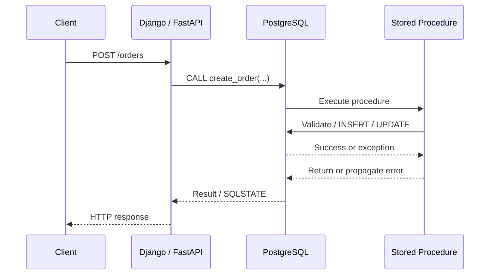

# 06- Error Handling

## Overview

Error handling in stored procedures determines how database failures and business-rule violations are detected, reported, transformed, and propagated to the caller. In PostgreSQL, PL/pgSQL provides structured exception handling through `BEGIN ... EXCEPTION ... END` blocks.

Good error handling is more than catching exceptions. A production stored procedure should distinguish between:

- Expected business failures.
- Invalid input.
- Constraint violations.
- Concurrency failures.
- Infrastructure or database failures.
- Unexpected programming errors.

The goal is to preserve transactional correctness, expose useful diagnostics, avoid hiding failures, and give application code a stable error contract.

## Error Handling Model

A PL/pgSQL block can define an exception handler:

```sql
BEGIN
    -- Database operations.
EXCEPTION
    WHEN unique_violation THEN
        -- Handle duplicate data.
END;
```

The general structure is:

```sql
BEGIN
    statements;
EXCEPTION
    WHEN condition THEN
        handler_statements;
    WHEN another_condition THEN
        handler_statements;
END;
```

If an exception occurs in the block:

1. PostgreSQL stops executing the remaining statements in that block.
2. PostgreSQL searches the exception handlers for a matching condition.
3. The matching handler executes.
4. If no handler matches, the exception propagates to the surrounding transaction/caller.
5. If the handler completes normally, execution continues after the exception block.

This provides localized recovery without requiring every failure to be handled at the top level.

## Business Errors Versus Database Errors

A critical design decision is distinguishing business failures from technical failures.

| Error type | Example | Typical handling |
|---|---|---|
| Input validation | Quantity is negative | `RAISE EXCEPTION` |
| Business rule | Order cannot be cancelled | `RAISE EXCEPTION` with domain message |
| Missing required row | Order does not exist | Explicit check or `INTO STRICT` |
| Duplicate data | Unique constraint violation | Constraint or targeted exception handling |
| Foreign key failure | Referenced customer does not exist | Usually allow/translate constraint error |
| Serialization failure | Concurrent transactions conflict | Propagate so application can retry |
| Deadlock | Transactions lock resources in opposite order | Propagate so caller can retry |
| Unexpected programming error | Invalid variable/state | Usually propagate |
| Infrastructure failure | Database connection loss | Outside normal procedure recovery |

Not every exception should be caught.

A procedure that catches every possible error and returns success has effectively destroyed the database's failure signal.

## Raising Errors

Use `RAISE EXCEPTION` when the procedure must reject an operation.

```sql
IF p_quantity <= 0 THEN
    RAISE EXCEPTION
        'Quantity must be greater than zero';
END IF;
```

For context-rich errors:

```sql
RAISE EXCEPTION
    'Order % cannot transition from % to %',
    p_order_id,
    v_current_status,
    p_target_status;
```

This is preferable to returning an ambiguous value such as:

```text
false
```

when the caller needs to know why an operation failed.

## Exception Severity Levels

`RAISE` supports multiple severity levels.

Common levels include:

- `DEBUG`
- `LOG`
- `INFO`
- `NOTICE`
- `WARNING`
- `EXCEPTION`

For example:

```sql
RAISE NOTICE 'Processing order %', p_order_id;
```

`EXCEPTION` is different because it raises an error and aborts the current transaction unless caught by an enclosing exception block.

In production application code, avoid relying on `NOTICE` as a primary observability mechanism. Use structured database and application logging for operational diagnostics.

## SQLSTATE

PostgreSQL errors have SQLSTATE codes that provide machine-readable error classifications.

You can assign a custom SQLSTATE class for application-specific errors:

```sql
RAISE EXCEPTION
    'Order % cannot be cancelled',
    p_order_id
    USING ERRCODE = 'P0001';
```

For more structured application/database contracts, custom SQLSTATE values can distinguish categories of domain errors.

The application should generally avoid depending on human-readable error strings for programmatic control flow.

Prefer:

```text
SQLSTATE -> application error category
```

over:

```text
error message text -> application error category
```

Error messages can change; error codes should provide the stable classification.

## `USING` for Structured Errors

`RAISE` supports additional error attributes through `USING`.

```sql
RAISE EXCEPTION
    'Order % cannot be cancelled',
    p_order_id
    USING
        ERRCODE = 'P0001',
        HINT = 'Only pending orders can be cancelled';
```

Common fields include:

| Field | Purpose |
|---|---|
| `ERRCODE` | SQLSTATE error code |
| `MESSAGE` | Error message |
| `DETAIL` | Additional diagnostic detail |
| `HINT` | Suggested corrective action |
| `COLUMN` | Related column |
| `CONSTRAINT` | Related constraint |
| `DATATYPE` | Related data type |
| `TABLE` | Related table |
| `SCHEMA` | Related schema |

For application-facing errors, keep messages useful without exposing internal database structure unnecessarily.

## Handling Unique Violations

Suppose a payment must be unique per order:

```sql
CREATE UNIQUE INDEX payments_order_id_unique
ON payments (order_id);
```

The procedure can handle duplicate insertion:

```sql
BEGIN
    INSERT INTO payments (
        order_id,
        amount
    )
    VALUES (
        p_order_id,
        p_amount
    );

EXCEPTION
    WHEN unique_violation THEN
        RAISE EXCEPTION
            'A payment already exists for order %',
            p_order_id;
END;
```

However, do not use an exception when an atomic SQL operation expresses the intended behavior more clearly.

For idempotent creation, PostgreSQL's conflict handling is often better:

```sql
INSERT INTO payments (
    order_id,
    amount
)
VALUES (
    p_order_id,
    p_amount
)
ON CONFLICT (order_id) DO NOTHING;
```

The unique constraint remains the source of truth.

## Handling `NO_DATA_FOUND`

`SELECT ... INTO STRICT` raises an exception when no row is found.

```sql
SELECT status
INTO STRICT v_status
FROM orders
WHERE order_id = p_order_id;
```

A missing row raises `NO_DATA_FOUND`.

It can be handled explicitly:

```sql
BEGIN
    SELECT status
    INTO STRICT v_status
    FROM orders
    WHERE order_id = p_order_id;

EXCEPTION
    WHEN NO_DATA_FOUND THEN
        RAISE EXCEPTION
            'Order % does not exist',
            p_order_id;
END;
```

This is useful when a missing row represents an invalid business operation.

## Handling `TOO_MANY_ROWS`

`INTO STRICT` also raises an error when more than one row is returned.

```sql
SELECT customer_id
INTO STRICT v_customer_id
FROM orders
WHERE external_reference = p_reference;
```

If `external_reference` is supposed to be unique, the database schema should enforce that invariant:

```sql
CREATE UNIQUE INDEX orders_external_reference_unique
ON orders (external_reference);
```

Do not use exception handling as a substitute for a missing uniqueness constraint.

## Constraint Violations

Database constraints are often the strongest way to enforce invariants.

Examples include:

```sql
ALTER TABLE orders
ADD CONSTRAINT orders_total_non_negative
CHECK (total_amount >= 0);
```

If an invalid value reaches the database:

```sql
INSERT INTO orders (total_amount)
VALUES (-10);
```

PostgreSQL raises a constraint violation.

In many cases, the correct behavior is to allow the database error to propagate rather than catching it inside the procedure.

Catch and translate a constraint violation only when doing so adds meaningful domain semantics or creates a stable API contract.

## Exception Blocks and Transaction Behavior

Exception blocks have important transactional semantics.

Consider:

```sql
BEGIN
    UPDATE accounts
    SET balance = balance - 100
    WHERE account_id = 1;

    INSERT INTO payments (account_id, amount)
    VALUES (1, 100);

EXCEPTION
    WHEN unique_violation THEN
        RAISE NOTICE 'Payment already exists';
END;
```

When an error occurs inside the block, PostgreSQL rolls back the database changes made within that block before executing the handler.

This is similar to a localized rollback boundary.

However, the outer transaction is not necessarily rolled back merely because the inner block handled the exception.

This makes exception blocks useful for controlled recovery, but it also means developers must understand exactly which statements belong to the protected block.

## Nested Exception Blocks

Exception blocks can be nested:

```sql
BEGIN
    BEGIN
        INSERT INTO audit_events (
            event_type,
            entity_id
        )
        VALUES (
            'order_created',
            p_order_id
        );

    EXCEPTION
        WHEN unique_violation THEN
            RAISE NOTICE 'Audit event already exists';
    END;

    UPDATE orders
    SET status = 'created'
    WHERE order_id = p_order_id;
END;
```

The inner block can recover from a specific error while allowing the outer operation to continue.

Use nesting carefully. Excessive exception nesting makes transactional behavior difficult to reason about.

## `WHEN OTHERS`

`WHEN OTHERS` catches almost every error condition.

```sql
BEGIN
    -- Operation.
EXCEPTION
    WHEN OTHERS THEN
        RAISE;
END;
```

This example is effectively redundant because the error is simply re-raised.

The dangerous pattern is:

```sql
EXCEPTION
    WHEN OTHERS THEN
        NULL;
```

This silently converts failure into success.

Another problematic pattern is:

```sql
EXCEPTION
    WHEN OTHERS THEN
        RAISE NOTICE 'Something went wrong';
```

The original error is swallowed.

A safer generic handler preserves the original error:

```sql
EXCEPTION
    WHEN OTHERS THEN
        RAISE;
```

Or, if additional context is genuinely required, capture diagnostics and re-raise deliberately.

## Capturing Error Diagnostics

PL/pgSQL provides `GET STACKED DIAGNOSTICS` inside an exception handler.

```sql
DECLARE
    v_sqlstate text;
    v_message text;
    v_detail text;
BEGIN
    -- Operation.
EXCEPTION
    WHEN OTHERS THEN
        GET STACKED DIAGNOSTICS
            v_sqlstate = RETURNED_SQLSTATE,
            v_message = MESSAGE_TEXT,
            v_detail = PG_EXCEPTION_DETAIL;

        RAISE EXCEPTION
            'Database operation failed: %',
            v_message
            USING
                ERRCODE = v_sqlstate,
                DETAIL = v_detail;
END;
```

Useful diagnostics include:

| Diagnostic | Meaning |
|---|---|
| `RETURNED_SQLSTATE` | SQLSTATE of the original exception |
| `MESSAGE_TEXT` | Primary error message |
| `PG_EXCEPTION_DETAIL` | Detailed error information |
| `PG_EXCEPTION_HINT` | Hint supplied by PostgreSQL |
| `PG_EXCEPTION_CONTEXT` | PL/pgSQL execution context |
| `SCHEMA_NAME` | Related schema |
| `TABLE_NAME` | Related table |
| `COLUMN_NAME` | Related column |
| `CONSTRAINT_NAME` | Related constraint |

Diagnostics are particularly useful for centralized database logging or controlled error translation.

Do not blindly expose `PG_EXCEPTION_CONTEXT`, table names, SQL details, or internal diagnostics to external API consumers.

## Preserving the Original Error

When translating an error, preserve useful information whenever possible.

A poor implementation:

```sql
EXCEPTION
    WHEN OTHERS THEN
        RAISE EXCEPTION 'Operation failed';
```

This discards the original SQLSTATE and diagnostic context.

A better design is to either let unexpected exceptions propagate naturally or explicitly preserve the original error classification when adding context.

For known exceptions:

```sql
EXCEPTION
    WHEN unique_violation THEN
        RAISE EXCEPTION
            'Payment already exists for order %',
            p_order_id
            USING ERRCODE = '23505';
```

The caller can still classify the failure as a unique violation.

## Error Handling and Application APIs

A typical backend request path looks like:



The application layer should translate database errors into appropriate API semantics.

For example:

| Database condition | Application interpretation | Possible HTTP response |
|---|---|---|
| Invalid input | Client request is invalid | `400` |
| Unauthorized operation | Permission denied | `403` |
| Missing entity | Resource not found | `404` |
| Business conflict | State conflicts with request | `409` |
| Serialization failure | Transaction should be retried | `409` or retry internally |
| Deadlock | Transient database conflict | Retry |
| Unexpected database failure | Server failure | `500` |

The exact mapping depends on the application's API contract.

The stored procedure should not attempt to manufacture HTTP semantics. Database code should communicate database/domain semantics; the API layer should map them to transport-level responses.

## Retryable Errors

Some errors are transient and should generally be retried by the application or transaction coordinator.

Common examples include:

- `serialization_failure`
- `deadlock_detected`

Do not catch these and return a normal business response.

A typical architecture is:

```text
Database
   |
   +--> serialization failure
   |
   v
Stored procedure
   |
   v
Application
   |
   +--> classify SQLSTATE
   |
   +--> retry transaction
   |
   v
Client response
```

Retries must cover the **entire transaction**, not merely the statement that failed.

This is because the transaction's serialization or locking assumptions may no longer be valid.

Use bounded retries with backoff rather than infinite retry loops.

## Error Handling and Idempotency

Error handling becomes especially important for APIs, Celery jobs, and Kafka consumers because operations may be retried.

Suppose an API request creates a payment:

```text
Client
  |
  | request
  v
API
  |
  | transaction
  v
Stored procedure
  |
  +--> INSERT payment
  |
  v
Commit
```

If the client times out after the database commits, it may retry the request.

The procedure should use a stable idempotency key or unique business identifier:

```sql
CREATE UNIQUE INDEX payments_idempotency_key_unique
ON payments (idempotency_key);
```

Then retries can safely resolve to the existing operation instead of creating duplicate state.

Error handling and idempotency should therefore be designed together.

## Error Handling With Locks

Errors can occur while holding locks.

For example:

```sql
BEGIN
    SELECT status
    INTO STRICT v_status
    FROM orders
    WHERE order_id = p_order_id
    FOR UPDATE;

    IF v_status <> 'pending' THEN
        RAISE EXCEPTION
            'Order % is not pending',
            p_order_id;
    END IF;

    UPDATE orders
    SET status = 'processing'
    WHERE order_id = p_order_id;
END;
```

The exception aborts the transaction or appropriate enclosing block, releasing locks according to PostgreSQL transaction semantics.

Keep transactions short and avoid performing slow external work while database locks are held.

Do not call external HTTP services from inside a transaction and hold critical rows locked while waiting for network responses.

## Error Handling in Background Jobs

Stored procedures are often called by Celery workers or Kafka consumers.

The worker should distinguish:

```text
Permanent business failure
        |
        +--> Do not retry indefinitely

Transient database failure
        |
        +--> Retry with backoff

Unexpected failure
        |
        +--> Log + alert + bounded retry policy
```

For example, a duplicate message may represent successful idempotent processing rather than a reason for repeated retries.

The database should expose enough error information for the worker to classify the outcome reliably.

## Logging and Observability

Do not use stored procedure exceptions as the only observability mechanism.

Production monitoring should correlate:

- Application request ID.
- Job/message ID.
- Database operation.
- Procedure name.
- SQLSTATE.
- Error category.
- Execution duration.
- Retry count.

Avoid logging sensitive values such as:

- Passwords.
- Authentication tokens.
- Payment credentials.
- Personal data that is not required for diagnosis.

A useful application log might conceptually contain:

```text
operation=create_order
procedure=create_order
sqlstate=23505
error_category=duplicate_order
request_id=...
duration_ms=...
```

The exact implementation depends on the application's logging infrastructure.

## Security Considerations

Error messages can become an information disclosure channel.

Avoid exposing raw database errors directly to external clients:

```text
ERROR: duplicate key value violates unique constraint
"users_email_key"
```

This may reveal schema details that are irrelevant to the client.

Prefer an application-level error such as:

```text
An account already exists for this email address.
```

while retaining detailed diagnostics in internal logs.

For privileged stored procedures:

- Keep exception messages intentionally scoped.
- Avoid leaking internal object names.
- Do not expose SQL text unnecessarily.
- Review `SECURITY DEFINER` procedures carefully.
- Avoid dynamic SQL based on untrusted input.
- Preserve authorization checks even when an operation fails.

## Performance Considerations

Exception handling has overhead, so exception blocks should not be used as ordinary control flow for high-frequency expected conditions when a normal SQL predicate can express the logic.

Prefer:

```sql
UPDATE inventory
SET available_quantity = available_quantity - p_quantity
WHERE product_id = p_product_id
  AND available_quantity >= p_quantity;

IF NOT FOUND THEN
    RAISE EXCEPTION 'Insufficient inventory';
END IF;
```

over intentionally causing an exception whenever inventory is insufficient.

Likewise, prefer `INSERT ... ON CONFLICT` when its semantics match the desired behavior instead of deliberately attempting an insert and catching `unique_violation` for every expected duplicate.

Exception handling is most valuable for genuinely exceptional control flow and targeted recovery.

## Production Best Practices

### Handle Specific Exceptions

Prefer:

```sql
EXCEPTION
    WHEN unique_violation THEN
        ...
```

over:

```sql
EXCEPTION
    WHEN OTHERS THEN
        ...
```

Specific handlers make the intended recovery behavior clear.

### Preserve SQLSTATE

When translating a known database error, preserve or intentionally define a stable SQLSTATE.

### Do Not Swallow Errors

Avoid:

```sql
WHEN OTHERS THEN
    NULL;
```

Failures should either be handled intentionally or propagated.

### Prefer Constraints Over Manual Checks

Use database constraints for durable data invariants.

### Prefer Atomic SQL Over Exception-Driven Control Flow

Use:

- `ON CONFLICT`
- conditional `UPDATE`
- `INSERT ... SELECT`
- appropriate locking

when they express the operation more directly.

### Keep Transactions Short

Do not hold locks while performing external network operations or long-running application work.

### Design for Retries

Assume APIs, workers, and distributed systems can retry operations.

Use idempotency keys and unique constraints where appropriate.

### Keep External Error Contracts Stable

The database can provide SQLSTATE and domain-specific error information; the application should translate this into stable API or job semantics.

## Common Mistakes

| Mistake | Why it is problematic | Better approach |
|---|---|---|
| `WHEN OTHERS THEN NULL` | Silently hides failures | Propagate or handle deliberately |
| Catching every exception | Masks programming and infrastructure failures | Catch specific expected errors |
| Using error messages for program logic | Messages are unstable | Use SQLSTATE/error categories |
| Returning HTTP concepts from SQL | Couples database logic to transport | Map database errors in the API layer |
| Using exceptions for expected duplicates | Adds unnecessary exceptional control flow | Use `ON CONFLICT` when appropriate |
| Replacing all errors with `"Operation failed"` | Loses useful diagnostics | Preserve classification and context |
| Ignoring constraint errors | Can hide real integrity problems | Let constraints protect data |
| Retrying only the failed statement | Transaction state may no longer be valid | Retry the complete transaction |
| Logging raw database diagnostics externally | Can leak schema/internal details | Sanitize at the API boundary |
| Holding locks during slow work | Increases contention and deadlocks | Keep transactions short |
| Treating every error as retryable | Can create retry storms | Classify permanent vs transient failures |
| Using exception blocks for normal branching | Adds unnecessary overhead and complexity | Use predicates and conditional SQL |

## Testing Error Paths

Error handling requires explicit tests because the happy path does not validate failure semantics.

Test at least:

| Scenario | Expected behavior |
|---|---|
| Invalid parameter | Clear domain error |
| Missing row | Correct not-found behavior |
| Duplicate request | Idempotent or conflict behavior |
| Constraint violation | Correct classification |
| Invalid state transition | Business error |
| Serialization failure | Transaction retry |
| Deadlock | Bounded retry |
| Unexpected exception | Propagates and is observable |
| Error inside nested block | Correct rollback scope |
| Partial operation failure | No invalid partial state |
| Sensitive diagnostic data | Not exposed to clients |

For concurrency behavior, use integration tests against PostgreSQL rather than relying only on mocked procedure calls.

## Interview Traps

### Should Every Exception Be Caught?

No. Catch only errors that the procedure can meaningfully handle or translate. Unexpected errors should normally propagate.

### What Is Wrong With `WHEN OTHERS THEN NULL`?

It suppresses the failure and can cause the caller to believe the operation succeeded. It also destroys observability and makes data corruption or partial failures harder to diagnose.

### Does Catching an Exception Automatically Commit the Work?

No. Exception handling does not commit the transaction. Statements inside the exception-protected block that occurred before the error are rolled back when the exception is handled, while the surrounding transaction can continue if the handler completes normally.

### Why Use `ON CONFLICT` Instead of Catching `unique_violation`?

When duplicate handling is expected behavior, `ON CONFLICT` expresses the intent declaratively and avoids using exceptions as normal control flow.

### Should the Database Return HTTP 409?

No. A stored procedure should communicate database/domain semantics. Django, FastAPI, or another API layer should translate those semantics into HTTP responses.

### Why Should Serialization Failures Usually Propagate?

A serialization failure indicates that the transaction's assumptions cannot be preserved. Retrying only an individual statement may not be sufficient; the transaction should generally be retried as a unit.

### What Is the Difference Between a Constraint and Exception Handling?

A constraint defines an invariant that PostgreSQL enforces automatically. Exception handling defines what procedural code should do when an operation fails. Exception handling should not replace constraints.

## Key Takeaways

- **Catch specific expected errors, preserve meaningful SQLSTATE information, and let unexpected failures propagate.**
- **Use constraints, atomic DML, and `ON CONFLICT` to prevent invalid state rather than relying on exception-driven control flow.**
- **Treat serialization failures and deadlocks as transient transaction-level failures that should be retried with bounded backoff.**
- **Keep database error semantics separate from HTTP/API semantics; translate SQLSTATE and domain errors at the application boundary.**
- **Never silently swallow exceptions, and ensure error paths are observable, tested, concurrency-safe, and free of sensitive information.**