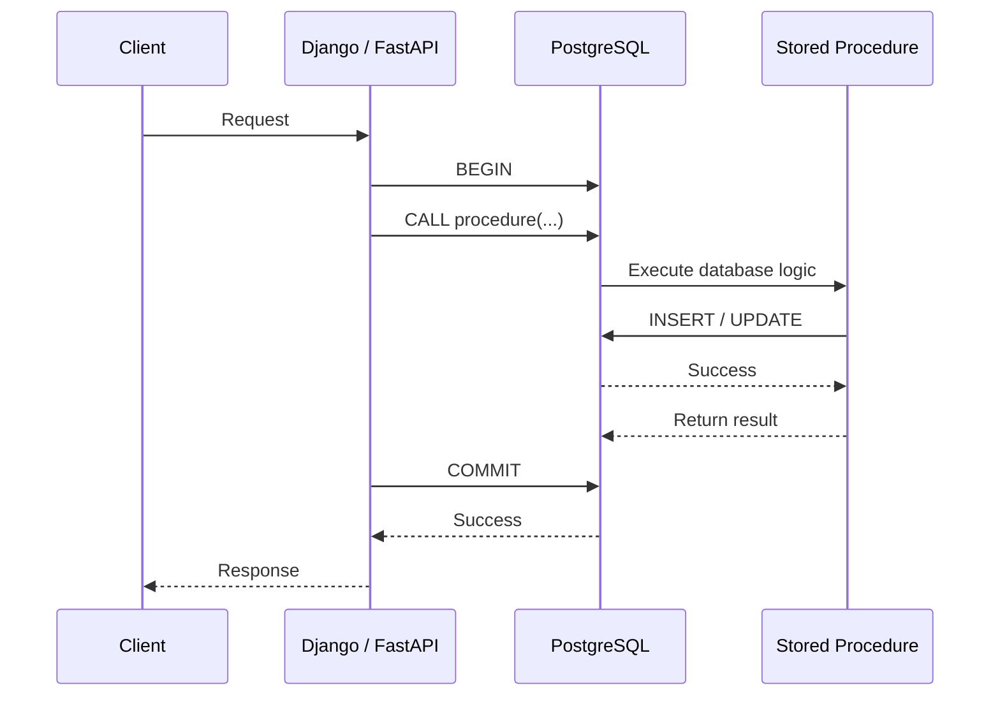
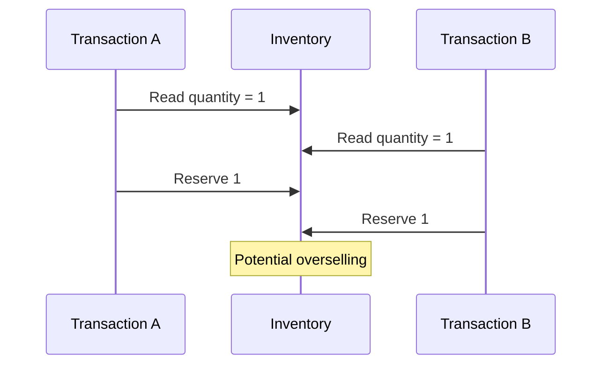
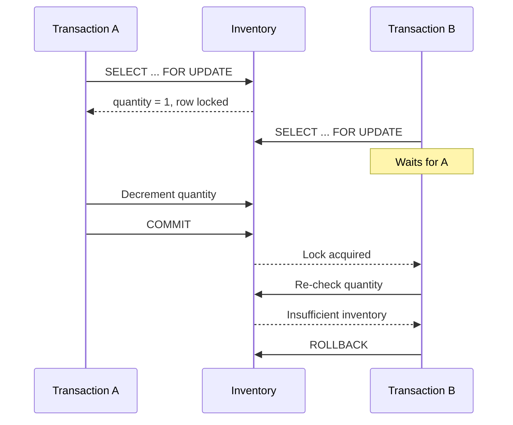
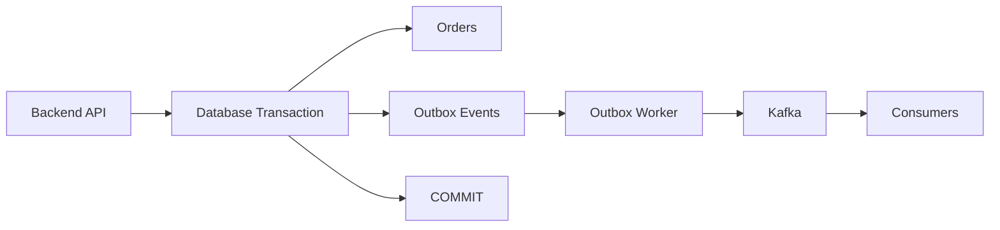

# 07- Transactions in Stored Procedures

## Overview

Transactions define the atomicity boundary for database operations. In stored procedures, they determine whether a group of reads and writes succeeds as a consistent unit or is rolled back when an operation fails.

The important production distinction is that **a stored procedure does not automatically own the transaction**. In PostgreSQL, transaction control depends on whether the routine is a procedure invoked with `CALL`, a function invoked within a transaction, and how the application manages the database connection.

For backend systems, transaction design should answer:

- Which operations must commit or roll back together?
- Which rows must be locked?
- What isolation level is required?
- What happens when concurrent requests modify the same data?
- Which errors are retryable?
- How long can locks be held?
- Where is the transaction boundary controlled?

A procedure should be designed around these questions rather than simply wrapping every operation in procedural code.

## Transaction Fundamentals

A transaction groups database operations into an atomic unit.

The core properties are commonly described as **ACID**:

| Property | Meaning | Production implication |
|---|---|---|
| Atomicity | All participating changes succeed or are rolled back | Prevents partial state |
| Consistency | Constraints and invariants remain valid | Protects database correctness |
| Isolation | Concurrent transactions observe controlled effects | Prevents concurrency anomalies |
| Durability | Committed changes survive failures | Supports reliable persistence |

A typical backend operation might look like:

```text
HTTP request
    |
    v
Application
    |
    v
BEGIN
    |
    +--> validate order
    |
    +--> reserve inventory
    |
    +--> create order
    |
    +--> create audit record
    |
    v
COMMIT
```

If any required operation fails, the transaction should normally roll back.

## Transaction Boundaries

A transaction boundary determines what belongs to the same atomic operation.

For example, creating an order and decrementing inventory may need to happen atomically:

```text
Transaction
├── Create order
├── Create order items
├── Reserve inventory
└── Commit
```

If inventory reservation fails, committing the order without the reservation may leave the system inconsistent.

However, not every related action belongs in the same transaction.

For example, sending an email should generally not happen while holding database locks:

```text
Database transaction
    |
    +--> persist order
    |
    +--> commit
    |
    v
Message/outbox
    |
    v
Email worker
```

This is one reason transactional outbox patterns are common in production systems.

## Functions Versus Procedures

PostgreSQL distinguishes functions and procedures.

A function is normally invoked as part of a SQL statement:

```sql
SELECT create_order(...);
```

A procedure is invoked using:

```sql
CALL create_order(...);
```

Procedures have transaction-control capabilities that functions do not have, subject to PostgreSQL's rules about the surrounding transaction context.

For most application code, however, it is usually preferable to let the application transaction boundary remain explicit rather than embedding arbitrary commits inside database routines.

This keeps transaction ownership understandable across Django, FastAPI, Celery, and other callers.

## Application-Managed Transactions

A common production architecture is:



The application owns the transaction:

```sql
BEGIN;

CALL process_order(1001);

COMMIT;
```

If the procedure raises an exception:

```sql
BEGIN;

CALL process_order(1001);

-- Procedure failure prevents successful commit.
ROLLBACK;
```

This model is particularly useful when several database operations performed by the application and stored procedure must participate in the same transaction.

## PostgreSQL Procedure Transaction Control

PostgreSQL procedures can use transaction-control statements such as `COMMIT` and `ROLLBACK` in contexts where PostgreSQL permits them.

For example:

```sql
CREATE OR REPLACE PROCEDURE process_batch()
LANGUAGE plpgsql
AS $$
BEGIN
    INSERT INTO processed_batches (batch_id)
    VALUES (1);

    COMMIT;

    INSERT INTO processed_batches (batch_id)
    VALUES (2);

    COMMIT;
END;
$$;
```

This is fundamentally different from ordinary procedural exception handling and should be used deliberately.

Transaction control inside a procedure can make the procedure difficult to compose with application-managed transactions.

For request/response backend operations, prefer a clear transaction owner.

## Transaction Ownership

A useful rule is:

> One layer should clearly own the transaction boundary.

Possible owners include:

| Owner | Typical use |
|---|---|
| API/application | Request-scoped business transaction |
| Worker | Background job transaction |
| Stored procedure | Specialized database-side workflow |
| Database session | Administrative/batch processing |

The problematic architecture is ambiguous ownership:

```text
API
 └── BEGIN
      └── procedure
           └── COMMIT
                └── API assumes transaction is still active
```

The application may believe it controls atomicity while the procedure has already committed part of the operation.

This makes failure recovery and reasoning about consistency substantially harder.

## Exception Handling and Rollback

PL/pgSQL exception blocks create important rollback behavior.

Consider:

```sql
CREATE OR REPLACE FUNCTION create_order(
    p_customer_id bigint,
    p_total numeric
)
RETURNS bigint
LANGUAGE plpgsql
AS $$
DECLARE
    v_order_id bigint;
BEGIN
    INSERT INTO orders (customer_id, total_amount)
    VALUES (p_customer_id, p_total)
    RETURNING order_id INTO v_order_id;

    INSERT INTO order_audit (order_id, event_type)
    VALUES (v_order_id, 'created');

    RETURN v_order_id;
END;
$$;
```

If the audit insert fails, the enclosing transaction can be rolled back, preventing the order from being committed independently.

With an exception block:

```sql
BEGIN
    INSERT INTO orders (customer_id, total_amount)
    VALUES (p_customer_id, p_total);

EXCEPTION
    WHEN unique_violation THEN
        RAISE EXCEPTION 'Order already exists';
END;
```

The statements executed inside the protected block are rolled back when the exception is handled.

This allows localized recovery but does not mean that every statement in the surrounding transaction is automatically discarded.

## Savepoint-Like Behavior of Exception Blocks

PL/pgSQL exception blocks behave similarly to subtransactions.

Conceptually:

```text
Outer transaction
    |
    +--> Statement A
    |
    +--> Exception block
    |       |
    |       +--> Statement B
    |       +--> Statement C fails
    |       +--> rollback block changes
    |
    +--> Statement D
    |
    v
COMMIT
```

If the exception is caught and the handler completes normally, the outer transaction can continue.

This is powerful but should not be abused.

Excessive exception blocks can increase complexity and make transaction behavior difficult to reason about.

## Locks Inside Stored Procedures

Transactions and locks are tightly coupled.

Consider inventory reservation:

```sql
CREATE OR REPLACE FUNCTION reserve_inventory(
    p_product_id bigint,
    p_quantity integer
)
RETURNS void
LANGUAGE plpgsql
AS $$
DECLARE
    v_available integer;
BEGIN
    SELECT available_quantity
    INTO v_available
    FROM inventory
    WHERE product_id = p_product_id
    FOR UPDATE;

    IF v_available < p_quantity THEN
        RAISE EXCEPTION
            'Insufficient inventory for product %',
            p_product_id;
    END IF;

    UPDATE inventory
    SET available_quantity = available_quantity - p_quantity
    WHERE product_id = p_product_id;
END;
$$;
```

`FOR UPDATE` locks the selected row so competing transactions cannot simultaneously modify it as though it were still available.

The transaction remains responsible for determining when that lock is released.

Locks are normally held until the transaction ends.

## Concurrency Flow

Without appropriate locking or an equivalent atomic operation, two requests can observe the same inventory:



With row locking:



The second transaction must still validate the current state after obtaining the lock.

## Prefer Atomic Updates When Possible

Sometimes explicit row locking is unnecessary because a single atomic update expresses the invariant.

For inventory:

```sql
UPDATE inventory
SET available_quantity = available_quantity - p_quantity
WHERE product_id = p_product_id
  AND available_quantity >= p_quantity;
```

Then check whether a row was affected:

```sql
IF NOT FOUND THEN
    RAISE EXCEPTION
        'Insufficient inventory for product %',
        p_product_id;
END IF;
```

This can be simpler and more efficient than performing a separate read followed by an update.

The important engineering question is not:

> "Should I always use `FOR UPDATE`?"

It is:

> "What database operation safely enforces the invariant under concurrency?"

## Isolation Levels

Transaction isolation controls how concurrent transactions interact.

PostgreSQL provides:

- `Read Committed`
- `Repeatable Read`
- `Serializable`

The default is generally `Read Committed`.

| Isolation level | Typical use | Trade-off |
|---|---|---|
| Read Committed | Most CRUD/API transactions | Good general-purpose concurrency |
| Repeatable Read | Consistent transaction snapshot | More serialization conflicts |
| Serializable | Strongest transactional guarantees | Higher retry requirements |

Higher isolation is not automatically better.

It can increase contention and serialization failures.

Choose the weakest isolation level that correctly enforces the application's invariants.

## Serialization Failures

At stronger isolation levels, PostgreSQL may abort a transaction with a serialization failure.

The application should generally retry the **whole transaction**.

Conceptually:

```text
BEGIN
  |
  +--> stored procedure
  |
  +--> serialization failure
  |
ROLLBACK
  |
  v
Retry entire transaction
```

Do not simply retry one failed statement while keeping the invalid transaction state.

A bounded retry policy with exponential backoff is generally preferable:

```text
attempt 1 -> immediate retry
attempt 2 -> short backoff
attempt 3 -> longer backoff
attempt 4 -> fail
```

The exact policy should reflect workload and latency requirements.

## Deadlocks

A deadlock occurs when transactions wait on resources held by each other.

Example:

```text
Transaction A                  Transaction B

Lock Order #1                  Lock Order #2
      |                              |
      v                              v
Wait for Order #2             Wait for Order #1
      |                              |
      +---------- DEADLOCK ----------+
```

A common prevention strategy is to acquire locks in a consistent order.

For example:

```text
Always lock:
customer -> order -> inventory
```

rather than sometimes:

```text
customer -> order
```

and elsewhere:

```text
inventory -> customer
```

PostgreSQL detects deadlocks and aborts one transaction.

The application should treat deadlocks as potentially retryable transient failures.

## Transaction Duration

Long transactions are dangerous in high-throughput systems.

They can:

- Hold locks longer.
- Increase contention.
- Increase deadlock probability.
- Keep old row versions visible longer.
- Increase database resource consumption.
- Increase request latency.
- Reduce overall throughput.

Avoid:

```text
BEGIN
  |
  +--> lock rows
  |
  +--> call external HTTP API
  |
  +--> wait 3 seconds
  |
  +--> update database
  |
COMMIT
```

Prefer:

```text
Persist transaction
      |
      v
COMMIT
      |
      v
Publish durable event
      |
      v
Background worker
      |
      v
External API
```

The transactional outbox pattern is often appropriate when an external side effect must reliably follow a database change.

## Transactional Outbox

Suppose an order creation must eventually publish an event to Kafka.

Do not rely on:

```text
COMMIT database
      |
      v
Publish Kafka event
```

If Kafka publishing fails after the database commits, the database and event stream diverge.

Instead:



The database transaction writes both:

```sql
INSERT INTO orders (...);

INSERT INTO outbox_events (
    event_type,
    aggregate_id,
    payload
)
VALUES (
    'order.created',
    v_order_id,
    v_payload
);
```

A separate worker publishes pending outbox records.

This separates database atomicity from external message delivery while maintaining a durable handoff.

## Stored Procedures and Application Transaction Management

### Django

Django commonly manages transaction boundaries with `transaction.atomic()`.

Conceptually:

```python
from django.db import connection, transaction

with transaction.atomic():
    with connection.cursor() as cursor:
        cursor.execute(
            "CALL process_order(%s)",
            [order_id],
        )
```

The stored procedure participates in the transaction managed by the application when the database operation is executed through that transaction context.

### FastAPI

FastAPI does not itself define database transaction semantics. The application or database-session layer normally owns the transaction.

A typical service design is:

```text
Request
  |
  v
Service
  |
  +--> begin transaction
  |
  +--> call database routine
  |
  +--> commit / rollback
  |
  v
Response
```

The important principle is to make transaction ownership explicit rather than relying on framework magic.

## Transactions and Connection Pools

Connection pooling adds an important operational consideration.

A transaction is associated with a database session/connection.

If a connection is returned to the pool while a transaction is still open, another request can inherit unexpected transactional state.

Production connection handling should ensure:

```text
Acquire connection
       |
       v
BEGIN
       |
       v
Execute database work
       |
       +--> COMMIT
       |       or
       +--> ROLLBACK
       |
       v
Return clean connection to pool
```

Application frameworks and drivers generally provide mechanisms to manage this correctly, but custom connection-pool code must be especially careful.

## Transactions and Background Workers

Celery and Kafka consumers often perform database operations that should be atomic.

For example:

```text
Kafka message
     |
     v
Consumer
     |
     v
BEGIN
     |
     +--> update database
     +--> record message ID
     |
     v
COMMIT
```

For at-least-once delivery, use an idempotency mechanism.

A unique constraint can protect message processing:

```sql
CREATE UNIQUE INDEX processed_messages_message_id_unique
ON processed_messages (message_id);
```

The database transaction can then atomically record processing state alongside the business changes.

## Transaction Boundaries and External Side Effects

Do not assume database rollback can undo external actions.

This cannot be made atomic simply by placing everything conceptually inside one procedure:

```text
Database transaction
    |
    +--> update database
    |
    +--> send HTTP request
    |
    +--> database error
    |
    v
ROLLBACK
```

The HTTP request cannot be rolled back by PostgreSQL.

The external system may already have processed the request.

For distributed workflows, use appropriate patterns such as:

- Transactional outbox.
- Idempotency keys.
- Durable queues.
- Compensating actions.
- Saga-style workflows where appropriate.

## Error Handling Strategy

Transaction failures should be classified.

| Failure | Typical response |
|---|---|
| Validation failure | Roll back and return client/domain error |
| Business rule violation | Roll back and return domain error |
| Unique constraint violation | Handle or translate if expected |
| Foreign key violation | Usually propagate/translate |
| Deadlock | Roll back and retry |
| Serialization failure | Roll back and retry |
| Connection failure | Roll back/reconnect/retry where safe |
| Unexpected programming error | Roll back and surface/alert |
| External dependency failure | Use outbox/retry/compensation strategy |

Never assume that retrying an operation is safe.

Retries require the operation to be idempotent or otherwise designed for duplicate execution.

## Production Transaction Design

### Keep Transactions Small

Only include operations that must be atomic.

### Lock Late and Release Quickly

Acquire locks as close as practical to the mutation and commit promptly.

### Use Consistent Lock Ordering

Define ordering rules for operations that can touch multiple resources.

### Avoid External I/O

Do not hold database locks while waiting for:

- HTTP requests.
- Kafka acknowledgements.
- Redis operations that can block.
- File operations.
- Slow third-party services.

### Prefer Database Constraints

Use:

- `UNIQUE`
- `CHECK`
- `FOREIGN KEY`
- `NOT NULL`
- exclusion constraints where appropriate

to enforce invariants.

### Design for Retry

Assume transient failures can happen.

Use:

- Idempotency keys.
- Unique business identifiers.
- Bounded retries.
- Exponential backoff.
- Transaction-level retry.

### Make Transaction Ownership Explicit

Avoid mixing application-managed transactions with procedure-level transaction control unless there is a strong reason.

## Monitoring Transactions

Production monitoring should track transaction-related signals such as:

- Transaction duration.
- Lock wait duration.
- Deadlocks.
- Serialization failures.
- Rollback rate.
- Connection pool utilization.
- Long-running transactions.
- Query latency.
- Database CPU and I/O.
- Replication lag where relevant.

For PostgreSQL, operational investigation commonly involves views such as:

```sql
SELECT
    pid,
    usename,
    state,
    wait_event_type,
    wait_event,
    xact_start,
    query_start,
    query
FROM pg_stat_activity
WHERE xact_start IS NOT NULL
ORDER BY xact_start;
```

Long-running transactions deserve investigation because they can create both locking and storage-management pressure.

Lock inspection can also be performed using PostgreSQL's lock-related system views.

## Reliability and High Availability

Transactions provide atomicity, but they do not automatically provide high availability.

A production PostgreSQL deployment may use:

```text
Application
    |
    v
Connection endpoint
    |
    v
Primary PostgreSQL
    |
    +--> WAL replication
    |
    v
Standby
```

Transaction design should account for failover.

For example:

- Retry only operations that are safe to retry.
- Use idempotency for request replays.
- Do not assume a committed response was received by the client.
- Configure appropriate connection and statement timeouts.
- Test failover behavior.
- Understand replication guarantees required by the application.

A database failover can result in clients retrying operations whose commit status is ambiguous.

Idempotency is therefore a reliability concern, not merely an API design feature.

## Disaster Recovery

Transactions protect consistency during normal operation but do not replace backups.

Production systems should separately address:

- Automated backups.
- Point-in-time recovery.
- WAL retention.
- Replica strategy.
- Recovery testing.
- Restore-time objectives.
- Recovery-point objectives.

A transactionally correct database can still be lost if the storage or deployment is destroyed without recoverable backups.

## Common Mistakes

| Mistake | Why it is problematic | Better approach |
|---|---|---|
| Committing inside every procedure | Breaks larger application transaction boundaries | Define clear transaction ownership |
| Keeping transactions open during HTTP calls | Holds locks and increases contention | Commit before external work |
| Assuming rollback undoes Kafka/HTTP effects | External systems are not part of PostgreSQL transactions | Use outbox/idempotency/compensation |
| Retrying one statement after serialization failure | Transaction may no longer be valid | Retry the entire transaction |
| Ignoring deadlocks | Can cause repeated request failures | Consistent lock ordering + bounded retry |
| Locking rows unnecessarily | Reduces concurrency | Use atomic SQL where sufficient |
| Holding locks for slow processing | Increases latency and contention | Keep critical transactions short |
| No idempotency on retried operations | Can create duplicate state | Unique constraints/idempotency keys |
| Relying only on application checks | Concurrent requests can bypass them | Enforce invariants in the database |
| Mixing procedure commits with application transactions | Makes atomicity difficult to reason about | Establish one transaction owner |
| Ignoring connection-pool state | Can leak transactional state between requests | Always finish transactions before release |
| Using stronger isolation everywhere | Can increase conflicts and retries | Choose isolation based on required guarantees |

## Interview Traps

### Does Calling a Stored Procedure Automatically Start and Commit a Transaction?

No. PostgreSQL transaction behavior depends on how the routine is invoked and the surrounding transaction context. A procedure call participates in the surrounding transaction unless transaction control is explicitly used in a context where PostgreSQL permits it.

### Can a Function Execute `COMMIT`?

No. PostgreSQL functions cannot perform transaction control such as `COMMIT` or `ROLLBACK`.

### Why Should External HTTP Calls Not Usually Be Inside a Database Transaction?

Because PostgreSQL cannot roll back the external operation. Holding database locks while waiting for the network also increases contention and transaction duration.

### Does `ROLLBACK` Undo a Kafka Message?

No. PostgreSQL transaction rollback only affects PostgreSQL transactional state. Kafka, HTTP services, Redis, and other external systems require their own delivery or compensation strategy.

### Why Retry the Entire Transaction After Serialization Failure?

Because the transaction's complete read/write ordering was invalidated by concurrent activity. Retrying only the failed statement does not necessarily restore a valid transaction state.

### Is `SELECT ... FOR UPDATE` Always Required for Concurrent Updates?

No. An atomic conditional `UPDATE` can often enforce the invariant more efficiently. Lock explicitly when the workflow requires a read-modify-write sequence that cannot be safely represented by a single atomic statement.

### Does a Transaction Guarantee High Availability?

No. Transactions provide atomicity and consistency guarantees within the database system. High availability requires replication, failover, health checks, connection management, and operational architecture.

### Are Higher Isolation Levels Always Better?

No. Stronger isolation provides stronger guarantees but can increase contention and transaction aborts. Use the lowest level that safely satisfies the application's consistency requirements.

## Key Takeaways

- **Define one clear transaction owner and keep the atomic boundary limited to operations that must succeed or fail together.**
- **Use atomic SQL, appropriate row locks, constraints, and consistent lock ordering to make concurrent stored-procedure operations safe.**
- **Keep transactions short and never rely on database rollback to undo external HTTP, Kafka, or other distributed side effects.**
- **Treat deadlocks and serialization failures as transaction-level retry conditions and retry the complete transaction with bounded backoff.**
- **Design transaction workflows for idempotency, observability, connection-pool safety, failover, and disaster recovery—not just successful execution.**