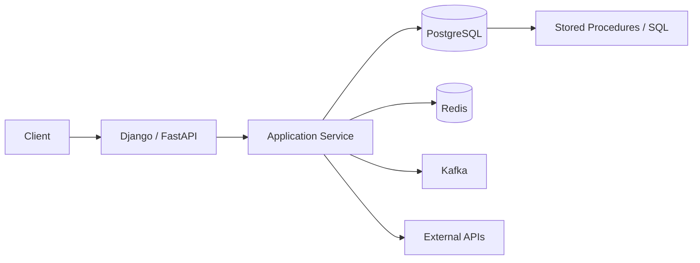
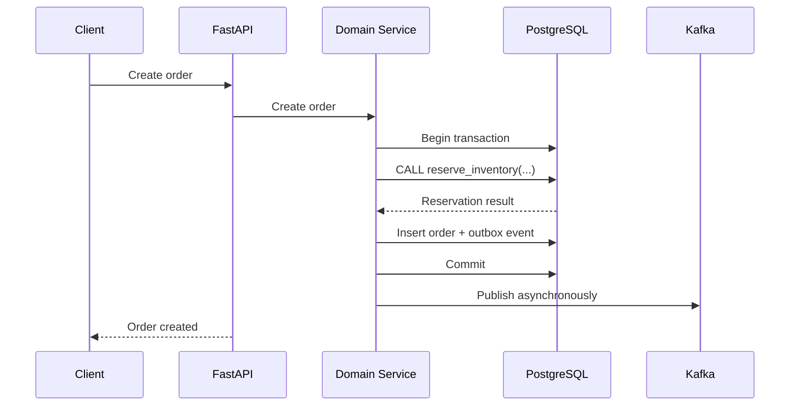

# 08- Stored Procedures vs Application Logic

## Overview

Stored procedures and application logic are two places where backend systems can implement business behavior. The decision is not simply about whether SQL or Python is "better"; it is about choosing the layer that provides the strongest combination of correctness, performance, maintainability, security, and operational control for a particular responsibility.

A useful production boundary is:

- **Database:** data integrity, relational operations, set-based processing, concurrency-sensitive mutations, and logic that must remain close to the data.
- **Application:** domain orchestration, external integrations, API behavior, workflow coordination, complex business policies, and logic that benefits from application-language tooling.
- **Shared boundary:** transactions, authorization decisions, idempotency, validation, and event publication often require deliberate coordination between both layers.

The key architectural question is:

> Where should this piece of logic live so that the system remains correct, observable, maintainable, and scalable?

## What Stored Procedures Provide

A stored procedure is executable logic persisted inside the database and invoked through the database interface.

For example, PostgreSQL can encapsulate an inventory operation:

```sql
CREATE OR REPLACE PROCEDURE reserve_inventory(
    p_product_id bigint,
    p_quantity integer
)
LANGUAGE plpgsql
AS $$
BEGIN
    UPDATE inventory
    SET available_quantity = available_quantity - p_quantity
    WHERE product_id = p_product_id
      AND available_quantity >= p_quantity;

    IF NOT FOUND THEN
        RAISE EXCEPTION 'Insufficient inventory';
    END IF;
END;
$$;
```

The database can execute this operation close to the data:

```sql
CALL reserve_inventory(1001, 2);
```

The procedure can directly use:

- SQL queries.
- Transactions and transaction context.
- Constraints.
- Locks.
- Database indexes.
- Set-based operations.
- Database-specific features.
- Server-side execution plans.

This makes stored procedures particularly useful when correctness depends heavily on database concurrency and atomicity.

## What Application Logic Provides

Application logic executes in the backend service, typically using a general-purpose language such as Python.

For example:

```python
def reserve_inventory(product_id: int, quantity: int) -> None:
    inventory = repository.get_inventory_for_update(product_id)

    if inventory.available_quantity < quantity:
        raise InsufficientInventoryError(product_id)

    inventory.available_quantity -= quantity
    repository.save(inventory)
```

The application layer can naturally integrate with:

- REST APIs.
- gRPC.
- Redis.
- Kafka.
- Celery.
- External HTTP services.
- Authentication systems.
- Authorization systems.
- Feature flags.
- Application telemetry.
- Domain-specific libraries.

This makes application logic better suited for orchestration and behavior that extends beyond the database.

## Architectural Boundary

A typical backend system looks like:



The database should not become a replacement for the entire application service layer.

Likewise, the application should not reimplement database guarantees that PostgreSQL can enforce more reliably.

## Comparison

| Concern | Stored Procedure | Application Logic |
|---|---|---|
| Data proximity | Excellent | Requires database round trips |
| Complex SQL | Excellent | Usually less natural |
| Database concurrency | Excellent | Requires careful transaction management |
| Database constraints | Native | Must ultimately rely on DB |
| External API calls | Poor fit | Excellent |
| Kafka integration | Poor fit | Excellent |
| Redis integration | Poor fit | Excellent |
| Domain orchestration | Limited | Excellent |
| Unit testing | More specialized | Excellent ecosystem |
| Debugging | Database-specific | Mature application tooling |
| Version control | Requires database migration discipline | Native source-control workflow |
| Deployment independence | Lower | Higher |
| Database portability | Lower | Higher at the application layer |
| Set-based data processing | Excellent | Often inefficient |
| API-level behavior | Poor fit | Excellent |
| Security through database permissions | Strong | Requires additional controls |
| Operational observability | Database-specific | Usually broader tooling |

Neither side wins universally.

## When Logic Belongs in the Database

Database-side logic is a strong candidate when the behavior is fundamentally about protecting or manipulating relational data.

### Enforcing Data Invariants

Critical invariants should normally be enforced by database constraints rather than application checks alone.

For example:

```sql
ALTER TABLE accounts
ADD CONSTRAINT accounts_balance_nonnegative
CHECK (balance >= 0);
```

Application validation is useful for user feedback, but the database constraint remains the final protection against concurrent or unexpected writes.

### Concurrency-Sensitive Operations

Consider inventory:

```text
Request A ──┐
            ├── PostgreSQL ──> inventory row
Request B ──┘
```

If correctness requires a read-modify-write operation under database locking, keeping the critical operation close to PostgreSQL can simplify the design.

A single atomic update may be even better:

```sql
UPDATE inventory
SET available_quantity = available_quantity - $1
WHERE product_id = $2
  AND available_quantity >= $1;
```

The important point is not that stored procedures are mandatory. The database should own the invariant.

### Heavy Set-Based Processing

Suppose a batch operation affects millions of rows.

Doing this:

```text
Database -> application
Database -> application
Database -> application
...
```

can be significantly worse than letting PostgreSQL perform a set-based operation:

```sql
UPDATE invoices
SET status = 'overdue'
WHERE status = 'open'
  AND due_at < CURRENT_TIMESTAMP;
```

Moving millions of rows through Python simply to perform relational transformations is often unnecessary.

### Database-Centric Workflows

Stored procedures can be appropriate when several operations form a tightly coupled database transaction:

```text
Procedure
 ├── validate database state
 ├── lock required rows
 ├── modify multiple tables
 ├── record audit information
 └── return result
```

This can reduce application/database round trips and centralize concurrency-sensitive behavior.

## When Logic Belongs in the Application

Application code is usually the better location when the behavior represents domain orchestration rather than database manipulation.

### External Integrations

Do not put external HTTP workflows into a stored procedure merely because they happen after a database change.

For example:

```text
Create order
    |
    +--> PostgreSQL
    |
    +--> Stripe
    |
    +--> Shipping API
    |
    +--> Email provider
```

The application is the natural coordinator.

A database transaction cannot automatically roll back an external API call.

### Messaging

Kafka and other messaging systems generally belong in application infrastructure:

```text
Application
    |
    +--> PostgreSQL
    |
    +--> Kafka
    |
    +--> Redis
```

When a database change and event publication must be coordinated, a transactional outbox is usually a better architecture than attempting to make the database procedure responsible for the entire messaging workflow.

### Complex Domain Rules

Rules involving many external or domain concepts are generally easier to express in Python than PL/pgSQL.

For example:

```text
Order
 ├── customer eligibility
 ├── subscription status
 ├── promotion engine
 ├── fraud service
 ├── inventory
 ├── payment provider
 └── shipping rules
```

The application can coordinate these components while delegating the database-specific mutation to SQL.

### Business Workflows

Long-running workflows are poor candidates for stored procedures.

Examples include:

- Payment authorization.
- Customer onboarding.
- Email verification.
- Document processing.
- Multi-step approval workflows.
- Asynchronous fulfillment.
- Third-party provisioning.

These workflows benefit from application-level state machines, queues, retries, and observability.

## Hybrid Architecture

In mature systems, the best design is often hybrid.

For example:



Here:

- Python owns request and domain orchestration.
- PostgreSQL owns transactional data manipulation.
- The database enforces invariants.
- The outbox provides durable event handoff.
- Kafka handles asynchronous distribution.

This separation keeps each layer responsible for what it does best.

## A Practical Decision Framework

Use the following questions when deciding where logic belongs:

| Question | Favors |
|---|---|
| Does it enforce a database invariant? | Database |
| Does it require row-level locking? | Database |
| Is it primarily a complex SQL transformation? | Database |
| Does it process large sets of rows? | Database |
| Does it need external APIs? | Application |
| Does it interact with Kafka? | Application |
| Does it coordinate multiple services? | Application |
| Does it contain complex domain policy? | Application |
| Does it need rich application testing/debugging? | Application |
| Must multiple applications share the exact same database operation? | Potentially database |
| Is portability across database engines important? | Application |
| Is latency dominated by database round trips? | Potentially database |
| Does the logic change independently from database schema? | Usually application |
| Is correctness dependent on database constraints? | Database |

This should be treated as a design heuristic, not a rigid rule.

## Performance Considerations

Stored procedures can reduce network round trips.

Consider an operation requiring:

```text
Application -> SELECT
Application -> validation
Application -> UPDATE
Application -> INSERT
```

A database-side routine can potentially perform the workflow with one invocation:

```text
Application -> CALL procedure
                    |
                    +--> SELECT
                    +--> UPDATE
                    +--> INSERT
                    |
                    v
                 Result
```

This can matter for high-latency database connections or chatty workflows.

However, stored procedures are not automatically faster.

Performance still depends on:

- Query plans.
- Indexes.
- Lock contention.
- Cardinality.
- Data volume.
- Transaction duration.
- Network latency.
- Connection pooling.
- Procedure implementation.
- Number of SQL statements executed internally.

Moving inefficient SQL into a procedure does not make it efficient.

## Maintainability Trade-Offs

Application code generally benefits from mature engineering tooling:

- Static analysis.
- IDE navigation.
- Type checking.
- Unit testing.
- Integration testing.
- Debugging.
- Dependency management.
- Code review workflows.

Database routines require comparable discipline.

A production database repository should treat stored procedures as versioned source code:

```text
repository/
├── migrations/
│   ├── 001_create_inventory.sql
│   ├── 002_create_reservation_procedure.sql
│   └── 003_update_reservation_procedure.sql
├── application/
├── tests/
└── ci/
```

A procedure should not be manually modified in production and then forgotten in source control.

## Deployment Considerations

Application deployments and database deployments have different compatibility requirements.

Suppose version `N` of the application expects:

```sql
CALL reserve_inventory(product_id, quantity);
```

while version `N+1` expects:

```sql
CALL reserve_inventory(product_id, quantity, request_id);
```

A rolling deployment can temporarily run both application versions.

Database changes therefore need backward-compatible rollout strategies.

A safer sequence is often:

```text
Deploy database change
        |
        v
Support old + new application behavior
        |
        v
Deploy new application
        |
        v
Remove obsolete database behavior
```

This is particularly important in Kubernetes environments where multiple application replicas may be running different versions during deployment.

## Versioning Stored Procedures

Avoid breaking procedure contracts during rolling deployments.

Prefer additive changes where practical.

For example:

```sql
CREATE OR REPLACE PROCEDURE reserve_inventory(
    p_product_id bigint,
    p_quantity integer,
    p_request_id uuid DEFAULT NULL
)
...
```

However, PostgreSQL routine overloading, defaults, function/procedure identity rules, and application driver behavior need to be considered carefully.

For major interface changes, explicitly version the routine:

```text
reserve_inventory_v1
reserve_inventory_v2
```

or use a migration strategy that keeps both contracts available during deployment.

The correct choice depends on how many clients consume the routine.

## Security Considerations

Stored procedures can provide a useful security boundary.

Instead of granting an application broad table permissions:

```text
Application
   |
   +--> SELECT/INSERT/UPDATE on many tables
```

a system can sometimes expose controlled database operations:

```text
Application
   |
   +--> EXECUTE procedure
                |
                v
        Restricted database operations
```

This can reduce direct table access.

However, stored procedures are not automatically secure.

Important considerations include:

- Principle of least privilege.
- Procedure ownership.
- `EXECUTE` privileges.
- `SECURITY DEFINER` usage.
- `search_path` safety.
- Dynamic SQL injection.
- Input validation.
- Row-level security.
- Audit logging.

Dynamic SQL requires particular care:

```sql
EXECUTE 'SELECT ... WHERE id = ' || p_id;
```

should not be used to construct SQL from untrusted input.

Prefer parameterized dynamic SQL:

```sql
EXECUTE
    'SELECT ... WHERE id = $1'
USING p_id;
```

Security-sensitive procedures should receive dedicated review.

## Testing Strategy

Testing requirements differ by layer.

### Stored Procedure Tests

Test:

- Valid inputs.
- Invalid inputs.
- Constraint violations.
- Transaction behavior.
- Concurrent execution.
- Locking behavior.
- Deadlocks where relevant.
- Boundary conditions.
- Permission behavior.
- Execution plans for critical routines.

Example:

```sql
BEGIN;

CALL reserve_inventory(1001, 2);

SELECT available_quantity
FROM inventory
WHERE product_id = 1001;

ROLLBACK;
```

For concurrency-sensitive logic, tests should exercise multiple transactions rather than only sequential execution.

### Application Tests

Test:

- Domain behavior.
- API behavior.
- Error mapping.
- Authorization.
- External integration behavior.
- Retry behavior.
- Event publication.
- Idempotency.
- Workflow orchestration.

Neither test suite replaces the other.

## Observability

Stored procedures can complicate observability if all application behavior appears as a generic database call:

```text
API
  |
  +--> CALL process_order(...)
```

Production systems should make important operations observable through:

- Structured application logs.
- Database query statistics.
- Procedure-specific metrics where available.
- Transaction latency.
- Lock wait metrics.
- Error rates.
- Trace spans.
- Correlation/request IDs.

A useful trace should make it possible to distinguish:

```text
POST /orders
  |
  +--> create order
  |
  +--> reserve inventory
  |      |
  |      +--> PostgreSQL procedure
  |
  +--> enqueue order-created event
```

Observability should cross the application/database boundary.

## Scalability Considerations

Stored procedures can improve scalability when they eliminate unnecessary data movement and round trips.

For example:

```text
Bad for large datasets:

PostgreSQL
    |
    v
Python
    |
    v
Transform millions of rows
    |
    v
PostgreSQL
```

A set-based SQL operation may be preferable:

```text
PostgreSQL
    |
    v
Set-based transformation
    |
    v
Updated data
```

However, centralizing too much business logic in PostgreSQL can create a database bottleneck.

Potential consequences include:

- More CPU pressure on the primary.
- Longer transactions.
- Higher lock contention.
- Harder horizontal scaling.
- Increased coupling to one database.
- More difficult read/write separation.

A database should remain the system of record, not necessarily the entire application runtime.

## Microservices Considerations

Stored procedures become more complicated in a microservices architecture.

If several services directly share one database:

```text
Service A ──┐
Service B ──┼──> Shared PostgreSQL
Service C ──┘
```

stored procedures can become an implicit integration contract.

This can create tight coupling:

```text
Service A
   |
   +--> procedure
          |
          +--> table X
          +--> table Y
          +--> business rule Z
```

A schema or procedure change can affect multiple services.

A stronger service boundary usually means that one service owns its data and exposes behavior through an API or event contract.

Stored procedures remain useful inside that service's database, but they should not become an accidental cross-service API.

## Common Anti-Patterns

### Putting Everything in Stored Procedures

This turns PostgreSQL into the application runtime.

Problems include:

- Difficult domain testing.
- Database-specific code everywhere.
- Reduced application portability.
- Harder integration with external systems.
- Complex deployment coordination.

### Putting Everything in Python

This can be equally problematic.

Examples:

- Fetching thousands of rows into Python to filter them.
- Performing read-check-write logic without concurrency protection.
- Reimplementing constraints in application code.
- Making multiple unnecessary database round trips.

The database should perform database work efficiently.

### Duplicating the Same Business Rule

For example:

```text
Python:
    if balance >= amount

Database:
    if balance >= amount
```

If these rules evolve independently, they can diverge.

Critical invariants should have one authoritative enforcement point, usually the database when they concern persistent relational state.

### Hiding Too Much Logic in Procedures

A procedure called:

```sql
CALL process_customer();
```

may internally perform dozens of unrelated operations.

This makes behavior difficult to reason about.

Procedure boundaries should be cohesive and explicit.

### Treating Procedures as Private Implementation Details

Once multiple applications depend on a procedure, its signature becomes an API contract.

Changes should therefore follow:

- Version control.
- Code review.
- Compatibility analysis.
- Automated testing.
- Migration discipline.
- Rollback planning.

## Production Decision Matrix

| Scenario | Recommended approach |
|---|---|
| `CHECK`/`UNIQUE` invariant | Database constraint |
| Simple CRUD | Application + SQL/ORM |
| Complex set-based update | SQL or stored procedure |
| High-contention inventory reservation | Database atomic operation/procedure |
| Multi-service workflow | Application/orchestration layer |
| External payment API | Application |
| Kafka event publication | Application + outbox |
| Large database batch | SQL/procedure |
| Complex domain policy | Application |
| Database security boundary | Potentially stored procedure |
| Long-running workflow | Application + queue/workflow engine |
| Database-specific optimization | SQL/procedure |
| Cross-database portability requirement | Prefer application logic where practical |

## Recommended Architecture

For a modern Python backend using PostgreSQL, a pragmatic architecture is:

```text
                   ┌──────────────────┐
                   │   REST / gRPC     │
                   └────────┬─────────┘
                            │
                            v
                   ┌──────────────────┐
                   │ Application      │
                   │ Service Layer    │
                   └───────┬──────────┘
                           │
             ┌─────────────┼─────────────┐
             │             │             │
             v             v             v
        PostgreSQL       Redis         Kafka
             │
             v
     Constraints / SQL /
     Stored Procedures
```

The application layer should orchestrate the system, while PostgreSQL remains responsible for data integrity and efficient relational operations.

## Practical Rule of Thumb

Use a stored procedure when the logic is:

- Close to the data.
- Transaction-sensitive.
- Concurrency-sensitive.
- Set-oriented.
- Database-specific.
- Reused by multiple trusted database clients.

Prefer application logic when the logic is:

- Domain-heavy.
- Integration-heavy.
- Workflow-oriented.
- Long-running.
- Asynchronous.
- Dependent on external systems.
- Frequently changing independently from database internals.

When both characteristics apply, use a hybrid design rather than forcing all logic into one layer.

## Interview Traps

### Are Stored Procedures Faster Than Application Code?

Not inherently. They can reduce round trips and perform set-based operations efficiently, but performance depends on query plans, indexes, locking, transaction duration, and implementation quality.

### Should All Business Logic Be in the Database?

No. Data invariants and database-centric operations often belong in the database, while domain orchestration and external integrations generally belong in the application.

### Should All Business Logic Be in Python?

No. Application code should not replace database constraints, concurrency guarantees, or efficient set-based SQL operations.

### Why Can Stored Procedures Be a Problem in Microservices?

They can create hidden coupling when multiple services depend on shared database schemas and procedure contracts, weakening service ownership boundaries.

### What Is the Best Layer for a Unique Constraint?

The database. The application can validate uniqueness for user experience, but only the database can reliably enforce it under concurrent writes.

### Why Is a Stored Procedure Not a Replacement for a Service Layer?

A stored procedure operates inside the database boundary. A service layer can coordinate databases, queues, caches, external APIs, authorization systems, and long-running workflows.

### Is Using an ORM Incompatible With Stored Procedures?

No. Django, SQLAlchemy, and other application frameworks can invoke stored procedures or raw SQL where appropriate. The decision should be based on the responsibility being implemented.

## Key Takeaways

- **Put data integrity, concurrency-sensitive mutations, and set-based database operations close to PostgreSQL; put domain orchestration and external integrations in the application.**
- **Do not treat stored procedures or application logic as universally superior—choose the layer that provides the strongest correctness, performance, and maintainability characteristics.**
- **Use hybrid designs when application workflows require database-side atomic operations, constraints, or locking.**
- **Treat heavily used stored procedures as versioned APIs with migration, testing, security, observability, and backward-compatibility requirements.**
- **Avoid both extremes: a database that contains the entire application and an application that inefficiently reimplements database responsibilities.**