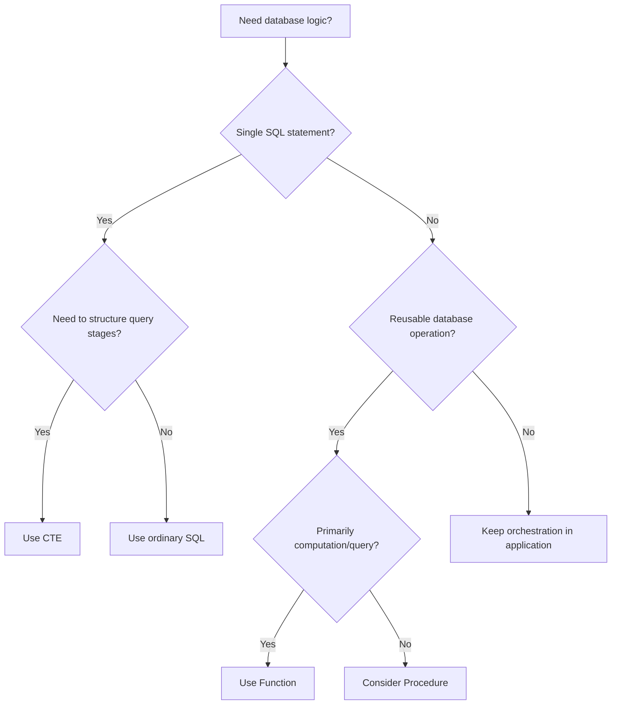

# 10- Stored Procedures vs CTEs

## Overview

Stored procedures and Common Table Expressions (CTEs) solve fundamentally different problems.

A **stored procedure** is a persistent database routine that encapsulates an operation and is invoked explicitly with `CALL`. A **CTE** is a query-scoped named subquery introduced with `WITH` that helps structure a single SQL statement.

The key distinction is scope and purpose:

| Aspect | Stored Procedure | CTE |
|---|---|---|
| Lifetime | Persistent database object | Exists only for one SQL statement |
| Primary purpose | Encapsulate reusable database operations | Structure a complex query |
| Invocation | `CALL procedure_name(...)` | `WITH name AS (...)` |
| Reusable across statements | Yes | No |
| Can contain procedural control flow | Yes, depending on language | No |
| Can execute multiple SQL statements | Yes | No; belongs to one statement |
| Can modify data | Yes | A CTE can support `INSERT`, `UPDATE`, or `DELETE` statements |
| Can return query results | Not like a function | Yes, as part of the enclosing statement |
| Transaction control | PostgreSQL procedures can control transactions under specific conditions | No |
| Query optimization | Depends on contained statements | Integrated into the enclosing statement |
| Best fit | Database operations/workflows | Complex query composition |

A senior engineer should not choose between them based on which syntax looks cleaner. Choose based on **lifecycle, reuse, transaction ownership, query composition, performance, and application architecture**.

## CTEs

A CTE is a temporary named query expression scoped to a single SQL statement.

For example:

```sql
WITH active_orders AS (
    SELECT
        id,
        customer_id,
        total_amount
    FROM orders
    WHERE status = 'active'
)
SELECT
    customer_id,
    COUNT(*) AS order_count,
    SUM(total_amount) AS total_amount
FROM active_orders
GROUP BY customer_id;
```

The CTE exists only while this statement executes.

It is useful for breaking a complex query into logical stages:

```text
Base tables
    |
    v
CTE: filtered data
    |
    v
CTE: aggregated data
    |
    v
Final SELECT
```

A CTE does not create a persistent database object.

## Stored Procedures

A stored procedure is a persistent database object containing executable database logic.

For example:

```sql
CREATE OR REPLACE PROCEDURE archive_old_orders(
    p_cutoff timestamptz
)
LANGUAGE plpgsql
AS $$
BEGIN
    UPDATE orders
    SET archived_at = CURRENT_TIMESTAMP
    WHERE created_at < p_cutoff
      AND archived_at IS NULL;

    INSERT INTO maintenance_log(operation, executed_at)
    VALUES ('archive_old_orders', CURRENT_TIMESTAMP);
END;
$$;
```

The procedure persists until it is replaced or dropped:

```sql
CALL archive_old_orders(
    CURRENT_TIMESTAMP - INTERVAL '2 years'
);
```

Unlike a CTE, the procedure can become a reusable database-level API.

## Scope and Lifetime

This is the first distinction to establish.

### CTE Scope

A CTE belongs to one SQL statement:

```sql
WITH recent_orders AS (
    SELECT *
    FROM orders
    WHERE created_at >= CURRENT_DATE - INTERVAL '30 days'
)
SELECT *
FROM recent_orders;
```

This works:

```sql
WITH recent_orders AS (...)
SELECT * FROM recent_orders;
```

This does not:

```sql
SELECT * FROM recent_orders;
```

The name disappears after the statement completes.

### Procedure Scope

A procedure is stored in the database catalog:

```sql
CREATE OR REPLACE PROCEDURE archive_old_orders(...)
...
```

It can later be called by multiple clients:

```text
Django application
       |
FastAPI service
       |
Admin job
       |
Maintenance script
       |
       v
PostgreSQL
       |
       v
archive_old_orders()
```

This makes procedures appropriate when database behavior itself needs a reusable interface.

## Query Composition vs Operation Encapsulation

The most useful mental model is:

> **CTE = structure a query. Procedure = encapsulate an operation.**

Consider a reporting query.

```sql
WITH monthly_orders AS (
    SELECT
        customer_id,
        DATE_TRUNC('month', created_at) AS month,
        SUM(total_amount) AS revenue
    FROM orders
    WHERE status = 'completed'
    GROUP BY customer_id, DATE_TRUNC('month', created_at)
)
SELECT
    customer_id,
    month,
    revenue
FROM monthly_orders
WHERE revenue > 10000
ORDER BY month DESC, revenue DESC;
```

The CTE makes the query easier to reason about without introducing a persistent database object.

A procedure would be unnecessary if the requirement is simply to execute this query once.

## CTEs for Multi-Stage Queries

CTEs are especially useful when a query has several logical stages.

```sql
WITH eligible_orders AS (
    SELECT
        id,
        customer_id,
        total_amount
    FROM orders
    WHERE status = 'completed'
),
customer_totals AS (
    SELECT
        customer_id,
        SUM(total_amount) AS total_spend
    FROM eligible_orders
    GROUP BY customer_id
),
qualified_customers AS (
    SELECT
        customer_id,
        total_spend
    FROM customer_totals
    WHERE total_spend >= 5000
)
SELECT
    c.id,
    c.email,
    q.total_spend
FROM qualified_customers q
JOIN customers c
    ON c.id = q.customer_id
ORDER BY q.total_spend DESC;
```

Each CTE expresses a logical transformation.

This is often easier to maintain than deeply nested subqueries.

## Recursive CTEs

CTEs can also express recursive queries.

For example, an organizational hierarchy:

```sql
WITH RECURSIVE employee_tree AS (
    SELECT
        id,
        manager_id,
        name,
        0 AS depth
    FROM employees
    WHERE id = 100

    UNION ALL

    SELECT
        e.id,
        e.manager_id,
        e.name,
        et.depth + 1
    FROM employees e
    JOIN employee_tree et
        ON e.manager_id = et.id
)
SELECT
    id,
    manager_id,
    name,
    depth
FROM employee_tree
ORDER BY depth, id;
```

A stored procedure is not required simply because the query is complex.

If the requirement is query composition, a CTE remains the appropriate abstraction.

## CTEs and Data Modification

CTEs are not restricted to `SELECT`.

PostgreSQL supports data-modifying statements inside CTEs.

For example:

```sql
WITH updated_order AS (
    UPDATE orders
    SET
        status = 'cancelled',
        updated_at = CURRENT_TIMESTAMP
    WHERE id = 1001
      AND status = 'pending'
    RETURNING id, customer_id
)
INSERT INTO order_events (
    order_id,
    event_type,
    created_at
)
SELECT
    id,
    'cancelled',
    CURRENT_TIMESTAMP
FROM updated_order;
```

This can atomically connect related operations inside one SQL statement.

That does **not** make the CTE equivalent to a stored procedure.

The CTE is still scoped to the statement and cannot independently implement a reusable procedural workflow.

## Stored Procedures for Multi-Step Operations

A procedure becomes useful when the operation itself needs to be reusable.

```sql
CREATE OR REPLACE PROCEDURE cancel_order(
    p_order_id bigint,
    p_reason text
)
LANGUAGE plpgsql
AS $$
BEGIN
    UPDATE orders
    SET
        status = 'cancelled',
        cancellation_reason = p_reason,
        updated_at = CURRENT_TIMESTAMP
    WHERE id = p_order_id
      AND status = 'pending';

    IF NOT FOUND THEN
        RAISE EXCEPTION
            'Order % cannot be cancelled',
            p_order_id;
    END IF;

    INSERT INTO order_events (
        order_id,
        event_type,
        metadata,
        created_at
    )
    VALUES (
        p_order_id,
        'cancelled',
        jsonb_build_object('reason', p_reason),
        CURRENT_TIMESTAMP
    );
END;
$$;
```

The application can then invoke the operation:

```sql
CALL cancel_order(1001, 'customer_request');
```

The procedure provides a stable database-level operation.

## Internal Control Flow

A procedure can contain procedural logic such as:

- `IF`
- `CASE`
- `LOOP`
- `WHILE`
- Exception handling
- Local variables
- Multiple SQL statements

For example:

```sql
CREATE OR REPLACE PROCEDURE apply_credit(
    p_customer_id bigint,
    p_amount numeric
)
LANGUAGE plpgsql
AS $$
DECLARE
    v_balance numeric;
BEGIN
    SELECT credit_balance
    INTO v_balance
    FROM customers
    WHERE id = p_customer_id
    FOR UPDATE;

    IF v_balance IS NULL THEN
        RAISE EXCEPTION
            'Customer % not found',
            p_customer_id;
    END IF;

    IF p_amount <= 0 THEN
        RAISE EXCEPTION
            'Credit amount must be positive';
    END IF;

    UPDATE customers
    SET credit_balance = credit_balance + p_amount
    WHERE id = p_customer_id;
END;
$$;
```

A CTE cannot replace this entire procedural structure.

A CTE is a relational query construct, not a procedural programming environment.

## Transaction Semantics

Transaction behavior is another major distinction.

A CTE executes as part of its enclosing SQL statement:

```sql
BEGIN;

WITH updated_order AS (
    UPDATE orders
    SET status = 'cancelled'
    WHERE id = 1001
    RETURNING id
)
INSERT INTO order_events(order_id, event_type)
SELECT id, 'cancelled'
FROM updated_order;

COMMIT;
```

The CTE does not own the transaction.

### Procedures

PostgreSQL procedures can use transaction control in permitted calling contexts.

```sql
CREATE OR REPLACE PROCEDURE process_batch()
LANGUAGE plpgsql
AS $$
BEGIN
    INSERT INTO maintenance_log(operation)
    VALUES ('batch_started');

    COMMIT;

    INSERT INTO maintenance_log(operation)
    VALUES ('next_batch_started');

    COMMIT;
END;
$$;
```

However, transaction control inside a procedure changes the operational model and should be used deliberately.

A procedure called inside an explicit transaction block cannot simply end the caller's transaction whenever it wants.

Therefore:

| Requirement | CTE | Procedure |
|---|---:|---:|
| Participate in caller transaction | Yes | Yes |
| Own multiple SQL operations | Within one statement | Yes |
| Explicit transaction control | No | Possible under PostgreSQL rules |
| Statement-level atomicity | Yes | Depends on invocation/transaction design |

## Performance

Neither CTEs nor procedures are inherently faster.

Performance depends on the actual SQL execution.

### CTE Performance

Modern PostgreSQL can often inline non-recursive, side-effect-free CTEs when beneficial. You can also explicitly control materialization.

```sql
WITH recent_orders AS NOT MATERIALIZED (
    SELECT
        id,
        customer_id,
        total_amount
    FROM orders
    WHERE created_at >= CURRENT_DATE - INTERVAL '30 days'
)
SELECT *
FROM recent_orders
WHERE total_amount > 1000;
```

Alternatively:

```sql
WITH recent_orders AS MATERIALIZED (
    SELECT
        id,
        customer_id,
        total_amount
    FROM orders
    WHERE created_at >= CURRENT_DATE - INTERVAL '30 days'
)
SELECT *
FROM recent_orders;
```

`MATERIALIZED` and `NOT MATERIALIZED` affect planning and execution trade-offs. They should be chosen based on the query plan rather than used as generic performance switches.

### Procedure Performance

A procedure can reduce application/database round trips.

Without a procedure:

```text
Application
   |
   +--> UPDATE
   |
   +--> SELECT
   |
   +--> INSERT
   |
   +--> UPDATE
```

With a procedure:

```text
Application
   |
   | CALL
   v
Procedure
   |
   +--> UPDATE
   +--> SELECT
   +--> INSERT
   +--> UPDATE
```

This can reduce network round trips, but it does not automatically make the underlying SQL efficient.

A procedure that executes poor queries will remain slow.

## CTE vs Temporary Table vs Procedure

These are sometimes confused because all can appear in complex database workflows.

| Tool | Scope | Persistence | Main Use |
|---|---|---|---|
| CTE | One statement | None | Query composition |
| Temporary table | Session/transaction | Temporary | Intermediate materialized data |
| Procedure | Database-wide object | Persistent | Reusable operation |
| Function | Database-wide object | Persistent | Reusable computation/query |

Use a CTE when the intermediate result exists only to make one statement clearer.

Use a temporary table when the intermediate result needs to be materialized and reused across multiple statements within a session/workflow.

Use a procedure when the entire operation needs a persistent callable database interface.

## CTE vs Function

A function is closer to a reusable database abstraction than a CTE, but they still differ.

```sql
WITH customer_orders AS (
    SELECT *
    FROM orders
    WHERE customer_id = 42
)
SELECT *
FROM customer_orders;
```

The CTE exists only in this query.

A function:

```sql
CREATE OR REPLACE FUNCTION get_customer_orders(
    p_customer_id bigint
)
RETURNS TABLE (
    order_id bigint,
    status text,
    created_at timestamptz
)
LANGUAGE sql
STABLE
AS $$
    SELECT id, status, created_at
    FROM orders
    WHERE customer_id = p_customer_id;
$$;
```

can be reused:

```sql
SELECT *
FROM get_customer_orders(42);
```

The general hierarchy is:

```text
One query
   |
   +--> CTE

Reusable query/computation
   |
   +--> Function

Reusable operational workflow
   |
   +--> Procedure
```

## Application Backend Example

Consider a Django service generating a customer dashboard.

A single query can use CTEs:

```python
from django.db import connection


def get_customer_dashboard(customer_id: int) -> list[dict]:
    query = """
        WITH recent_orders AS (
            SELECT
                id,
                total_amount
            FROM orders
            WHERE customer_id = %s
              AND created_at >= CURRENT_DATE - INTERVAL '30 days'
        )
        SELECT
            COUNT(*) AS order_count,
            COALESCE(SUM(total_amount), 0) AS total_spend
        FROM recent_orders;
    """

    with connection.cursor() as cursor:
        cursor.execute(query, [customer_id])
        row = cursor.fetchone()

    return [{
        "order_count": row[0],
        "total_spend": row[1],
    }]
```

A CTE is appropriate because the query is part of one request and does not need to become a persistent database operation.

For a reusable database command such as closing an account and performing several coordinated database updates, a procedure may be appropriate:

```python
from django.db import connection


def close_customer_account(customer_id: int) -> None:
    with connection.cursor() as cursor:
        cursor.execute(
            "CALL close_customer_account(%s)",
            [customer_id],
        )
```

The application still owns broader workflow concerns such as:

- Authentication.
- Authorization.
- External API calls.
- Event publication.
- HTTP response handling.
- Retries across distributed systems.

## Architecture Decision

A useful decision flow is:



The key is to avoid treating database routines as the default solution for every complex query.

## When to Use CTEs

Use a CTE when:

- A query has multiple logical stages.
- A subquery is reused within the same statement.
- A recursive query is required.
- Data-modifying operations need to be composed within one statement.
- Naming intermediate relations improves readability.
- Query logic needs to remain close to the calling query.

Example:

```sql
WITH eligible_customers AS (
    SELECT id
    FROM customers
    WHERE status = 'active'
)
SELECT
    o.customer_id,
    COUNT(*) AS order_count
FROM orders o
JOIN eligible_customers c
    ON c.id = o.customer_id
GROUP BY o.customer_id;
```

## When to Use Stored Procedures

Use a procedure when:

- The database operation is reused by multiple clients.
- Multiple database statements form one cohesive operation.
- Database-side procedural control flow is valuable.
- A database-level security boundary is useful.
- Database-native maintenance or batch processing is required.
- PostgreSQL transaction control is genuinely needed and compatible with the invocation model.

Avoid creating a procedure merely because a query contains several lines.

## When Not to Use Either

Do not automatically move logic into SQL because the logic is complicated.

Application logic is generally a better fit when the workflow involves:

- External HTTP services.
- Kafka.
- Redis.
- Celery.
- Email providers.
- Payment gateways.
- Complex domain orchestration.
- Distributed retries.
- Cross-service coordination.

For example:

```text
REST API
   |
   v
Application Service
   |
   +--> PostgreSQL
   |      |
   |      +--> CTE
   |      +--> Function
   |      +--> Procedure
   |
   +--> Payment Provider
   |
   +--> Kafka
   |
   +--> Redis
```

A database transaction cannot atomically roll back an HTTP request or Kafka publication without an appropriate distributed-systems pattern such as an outbox architecture.

## Common Mistakes

### Using a Procedure Just to Avoid Writing a CTE

A complex query does not automatically justify a stored procedure.

If the operation is one SQL statement, a CTE may be the cleaner abstraction.

### Treating CTEs as Persistent Views

A CTE disappears after the statement finishes.

If multiple independent queries need the same abstraction, consider:

- A view.
- A function.
- A procedure.
- Application-level query composition.

### Assuming CTEs Are Always Materialized

Modern PostgreSQL may inline eligible CTEs.

Do not assume:

```text
CTE = temporary table
```

Inspect the actual execution plan.

### Assuming a Procedure Automatically Improves Performance

A procedure can reduce round trips, but it cannot compensate for:

- Missing indexes.
- Poor join strategies.
- Large scans.
- Excessive locking.
- N+1 query patterns inside the procedure.

### Putting Business Orchestration in a Procedure

A procedure should not become a hidden workflow engine for external systems.

Avoid designs where a database procedure attempts to conceptually coordinate:

```text
Database
   |
   +--> HTTP API
   +--> Kafka
   +--> Redis
   +--> Email
```

Keep distributed orchestration in the application/service layer.

### Ignoring Transaction Ownership

A procedure that commits internally can conflict with the application's transaction assumptions.

Define explicitly which layer owns the transaction boundary.

### Overusing CTEs

A query with many CTEs can become harder to optimize and maintain.

Use CTEs to clarify meaningful relational stages, not simply to split every few lines of SQL into another named block.

## Production Considerations

### Performance

For CTEs:

- Inspect `EXPLAIN (ANALYZE, BUFFERS)`.
- Understand whether PostgreSQL inlines or materializes the CTE.
- Avoid unnecessarily processing large intermediate datasets.
- Prefer set-based operations.
- Benchmark `MATERIALIZED` versus `NOT MATERIALIZED` when relevant.

For procedures:

- Profile the SQL executed inside the routine.
- Monitor execution duration.
- Monitor lock waits.
- Keep transactions appropriately scoped.
- Avoid row-by-row procedural loops when set-based SQL can solve the problem.

### Locking

A procedure performing several writes can hold locks for a significant period.

For example:

```text
CALL procedure
     |
     +--> lock customer
     |
     +--> lock orders
     |
     +--> update transactions
     |
     +--> insert audit records
     |
     v
commit
```

Long transactions can increase:

- Lock contention.
- Deadlocks.
- Connection occupancy.
- Replication lag.
- Vacuum pressure in PostgreSQL.

Design lock acquisition order consistently across concurrent workflows.

### Security

For procedures exposed as database APIs:

- Grant only required `EXECUTE` privileges.
- Avoid unnecessary direct table privileges.
- Carefully review `SECURITY DEFINER` routines.
- Control `search_path` for security-sensitive routines.
- Validate inputs.
- Avoid unsafe dynamic SQL.

CTEs inherit the permissions of the statement's execution context. They do not create an independent authorization boundary.

### Observability

Monitor database routines using:

- PostgreSQL statement statistics.
- Query duration.
- Lock waits.
- Error rates.
- Transaction duration.
- Rows affected.
- Database CPU and I/O.
- Connection pool saturation.

Application logs should correlate database operations with request or job identifiers where practical.

## Decision Matrix

| Situation | Recommended Approach |
|---|---|
| One complex query | CTE |
| Recursive hierarchy query | Recursive CTE |
| Intermediate query stage | CTE |
| One statement requiring multiple related writes | CTE with data-modifying statements where appropriate |
| Reusable computation | Function |
| Reusable query interface | Function |
| Reusable multi-step database command | Procedure |
| Database maintenance workflow | Procedure |
| Transaction-control requirement | Procedure, where PostgreSQL permits it |
| REST/gRPC orchestration | Application |
| Kafka workflow | Application |
| Redis coordination | Application |
| External API workflow | Application |
| Complex distributed business process | Application/workflow layer |

## Interview Traps

### Are CTEs Stored in the Database?

No. A normal CTE is scoped to the SQL statement in which it is defined.

### Is a CTE the Same as a Temporary Table?

No.

A CTE is a query construct. A temporary table is an actual temporary relation that can be referenced by subsequent statements within its applicable lifetime.

### Are CTEs Always Materialized?

No. PostgreSQL can inline eligible CTEs, and `MATERIALIZED` / `NOT MATERIALIZED` can influence the behavior.

### Can a CTE Modify Data?

Yes. PostgreSQL supports data-modifying statements in CTEs, commonly combined with `RETURNING`.

### Can a Procedure Replace Any Complex CTE?

No. A procedure and CTE have different purposes. A CTE structures one statement; a procedure encapsulates a persistent callable operation.

### Which Is Faster: CTE or Procedure?

There is no general answer. A CTE affects the query plan of a statement, while a procedure is a container for one or more database operations. Measure the actual workload.

### When Would You Choose a CTE Over a Procedure?

Choose a CTE when the logic is query-scoped and does not need to become a reusable database-level operation.

### When Would You Choose a Procedure Over a CTE?

Choose a procedure when multiple clients need to invoke a reusable database operation or when procedural control flow and appropriate database-level transaction management are required.

## Key Takeaways

- **A CTE structures a single SQL statement; a stored procedure encapsulates a persistent, callable database operation.**
- **Use CTEs for query composition, recursive queries, and statement-scoped data transformations rather than turning every complex query into a stored procedure.**
- **Use procedures for reusable multi-step database operations, database-native workflows, and transaction-control scenarios where PostgreSQL permits them.**
- **Neither abstraction guarantees better performance; inspect execution plans, materialization behavior, locking, transaction duration, and round trips.**
- **Keep distributed orchestration involving Kafka, Redis, external APIs, and other services in the application layer rather than hiding it inside database routines.**