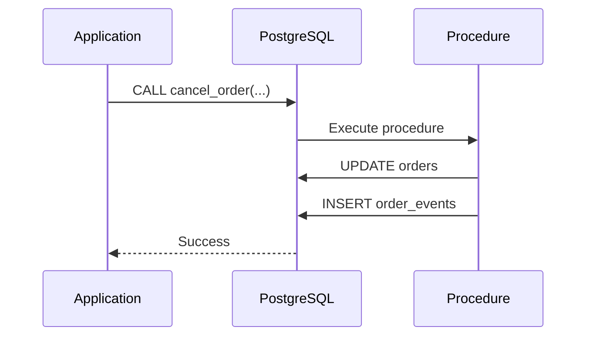
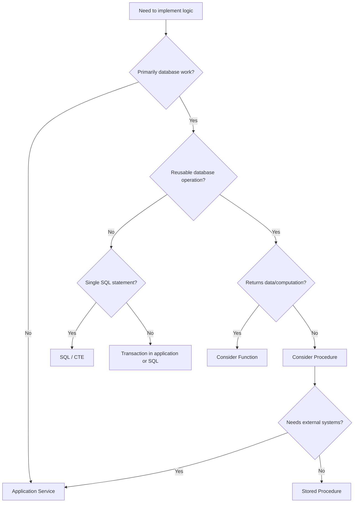

# 11- When to Use Stored Procedures

## Overview

A stored procedure is a persistent database routine that encapsulates one or more database operations behind a callable interface. In PostgreSQL, it is created with `CREATE PROCEDURE` and invoked with `CALL`.

Stored procedures are most valuable when the **database itself should own a reusable operation**, particularly when that operation consists of multiple SQL statements, requires database-side control flow, or benefits from a tightly controlled database permission boundary.

They should not be treated as a replacement for application services. A production backend typically separates responsibilities:

```text
Client
  |
  v
Nginx / Load Balancer
  |
  v
Django / FastAPI / gRPC Service
  |
  +--------------------+
  |                    |
  v                    v
PostgreSQL            Redis / Kafka
  |
  +--> SQL queries
  +--> Views
  +--> Functions
  +--> Stored Procedures
```

The engineering question is not:

> "Can this logic be written as a stored procedure?"

It usually can.

The better question is:

> "Should this logic be owned and executed by the database?"

## What a Stored Procedure Is

A stored procedure is a persistent database object containing executable logic.

A PostgreSQL example:

```sql
CREATE OR REPLACE PROCEDURE archive_old_orders(
    p_cutoff timestamptz
)
LANGUAGE plpgsql
AS $$
BEGIN
    UPDATE orders
    SET
        archived_at = CURRENT_TIMESTAMP,
        updated_at = CURRENT_TIMESTAMP
    WHERE created_at < p_cutoff
      AND archived_at IS NULL;
END;
$$;
```

It can then be called from SQL:

```sql
CALL archive_old_orders(
    CURRENT_TIMESTAMP - INTERVAL '2 years'
);
```

Unlike a CTE, the procedure persists in the database catalog and can be invoked repeatedly by different clients that have permission to execute it.

## Why Stored Procedures Exist

Stored procedures provide a database-level abstraction for operations that should execute close to the data.

They are particularly useful when:

- Several SQL statements form one cohesive operation.
- The operation is reused by multiple applications or jobs.
- Database-side validation or control flow is valuable.
- Reducing application-to-database round trips matters.
- A database-level permission boundary is useful.
- Maintenance or batch operations are naturally database-centric.
- The database must expose a controlled command rather than direct table manipulation.

The main architectural benefit is that callers can invoke an operation without needing to know every SQL statement required to perform it.

## When Stored Procedures Are a Good Fit

### Multi-Step Database Operations

Suppose cancelling an order requires:

1. Updating the order.
2. Validating that the order is cancellable.
3. Recording an audit event.
4. Updating related database state.

A procedure can encapsulate this operation:

```sql
CREATE OR REPLACE PROCEDURE cancel_order(
    p_order_id bigint,
    p_reason text
)
LANGUAGE plpgsql
AS $$
BEGIN
    UPDATE orders
    SET
        status = 'cancelled',
        cancellation_reason = p_reason,
        updated_at = CURRENT_TIMESTAMP
    WHERE id = p_order_id
      AND status = 'pending';

    IF NOT FOUND THEN
        RAISE EXCEPTION
            'Order % cannot be cancelled',
            p_order_id;
    END IF;

    INSERT INTO order_events (
        order_id,
        event_type,
        metadata,
        created_at
    )
    VALUES (
        p_order_id,
        'cancelled',
        jsonb_build_object('reason', p_reason),
        CURRENT_TIMESTAMP
    );
END;
$$;
```

The caller only needs to execute:

```sql
CALL cancel_order(1001, 'customer_request');
```

This is a strong use case because the database operation has a clear boundary and consists primarily of database work.

## Reusable Database Operations

A procedure is useful when the same database operation is invoked from multiple entry points.

For example:

```text
                 +--> Django API
                 |
                 +--> FastAPI worker
                 |
                 +--> Celery job
                 |
                 +--> Admin maintenance script
                 |
                 v
        PostgreSQL Procedure
                 |
                 +--> UPDATE
                 +--> INSERT
                 +--> validation
                 +--> audit
```

Without a shared database routine, each caller may implement slightly different versions of the operation.

A procedure can centralize the database-specific behavior.

However, this benefit must be balanced against the cost of coupling multiple applications to the database implementation.

## Reducing Database Round Trips

Suppose an application needs to execute several dependent database operations:

```text
Application
    |
    +--> SELECT
    |
    +--> UPDATE
    |
    +--> INSERT
    |
    +--> UPDATE
```

Each interaction can introduce network and connection overhead.

A procedure can move the workflow into PostgreSQL:

```text
Application
    |
    | CALL
    v
PostgreSQL
    |
    +--> SELECT
    +--> UPDATE
    +--> INSERT
    +--> UPDATE
```

This can reduce round trips and keep dependent operations close to the data.

However, fewer round trips do not automatically mean lower latency. The SQL inside the procedure still determines most of the database execution cost.

Always benchmark the actual workload.

## Database-Centric Batch Processing

Stored procedures can be appropriate for database maintenance and batch operations.

For example:

```sql
CREATE OR REPLACE PROCEDURE mark_expired_sessions()
LANGUAGE plpgsql
AS $$
BEGIN
    UPDATE user_sessions
    SET
        status = 'expired',
        updated_at = CURRENT_TIMESTAMP
    WHERE status = 'active'
      AND expires_at <= CURRENT_TIMESTAMP;
END;
$$;
```

A scheduled job can invoke it:

```sql
CALL mark_expired_sessions();
```

This can be preferable to transferring a large amount of data into an application simply to perform a database-side transformation.

For very large datasets, design the procedure around:

- Batching.
- Indexes.
- Lock duration.
- Transaction size.
- Vacuum behavior.
- Replication impact.
- Statement timeout.
- Retry behavior.

## Database-Level Security Boundaries

Stored procedures can be useful when callers should be allowed to perform an operation without receiving unrestricted table access.

For example, an application role might be granted:

```sql
GRANT EXECUTE
ON PROCEDURE cancel_order(bigint, text)
TO application_role;
```

while direct table permissions are restricted.

This creates a controlled database API:

```text
Application Role
      |
      | EXECUTE
      v
cancel_order(...)
      |
      +--> orders
      +--> order_events
```

This can be valuable for sensitive operations.

Security-sensitive procedures require careful design, especially when using PostgreSQL `SECURITY DEFINER`.

## Security Definer Procedures

A `SECURITY DEFINER` routine executes with the privileges of its owner rather than the caller.

This can support controlled privilege elevation:

```sql
CREATE OR REPLACE PROCEDURE rotate_application_secret(
    p_secret_id bigint
)
LANGUAGE plpgsql
SECURITY DEFINER
AS $$
BEGIN
    UPDATE application_secrets
    SET
        rotated_at = CURRENT_TIMESTAMP
    WHERE id = p_secret_id;
END;
$$;
```

This feature must be treated as security-sensitive.

For security-definer routines:

- Use a dedicated owner role with only required privileges.
- Avoid granting ownership to application roles.
- Explicitly control `search_path`.
- Avoid unsafe dynamic SQL.
- Validate identifiers and values.
- Grant `EXECUTE` only to intended roles.
- Review every object referenced by the routine.

A procedure should never become an accidental privilege-escalation mechanism.

## Complex Database Validation

Procedures can centralize validation that depends heavily on database state.

For example:

```sql
CREATE OR REPLACE PROCEDURE reserve_inventory(
    p_product_id bigint,
    p_quantity integer
)
LANGUAGE plpgsql
AS $$
DECLARE
    v_available integer;
BEGIN
    IF p_quantity <= 0 THEN
        RAISE EXCEPTION 'Quantity must be positive';
    END IF;

    SELECT inventory_count
    INTO v_available
    FROM products
    WHERE id = p_product_id
    FOR UPDATE;

    IF NOT FOUND THEN
        RAISE EXCEPTION
            'Product % does not exist',
            p_product_id;
    END IF;

    IF v_available < p_quantity THEN
        RAISE EXCEPTION
            'Insufficient inventory for product %',
            p_product_id;
    END IF;

    UPDATE products
    SET inventory_count = inventory_count - p_quantity
    WHERE id = p_product_id;
END;
$$;
```

The `FOR UPDATE` lock ensures the relevant row is protected while the procedure performs the availability check and update.

This is a strong database-side use case because correctness depends directly on transactional database state.

## Transactional Integrity

A stored procedure can keep tightly coupled database operations within the same transaction context.

For example:

```sql
CALL cancel_order(1001, 'customer_request');
```

The procedure can update multiple tables as part of the transaction in which it is invoked.

Conceptually:



If an error aborts the transaction, the database can roll back the affected work according to the transaction context.

This is useful when the operations are tightly coupled and should not be partially committed.

## Transaction Ownership

Be explicit about which layer owns the transaction boundary.

A common production design is:

```text
Application
    |
    | transaction boundary
    v
CALL procedure
    |
    +--> SQL operation A
    +--> SQL operation B
    +--> SQL operation C
    |
    v
Application COMMIT
```

PostgreSQL procedures have capabilities that functions do not, including transaction control under specific invocation conditions. That does not mean every procedure should commit independently.

Unexpected transaction control can conflict with application behavior, connection pooling, retry logic, and framework-managed transactions.

For Django or SQLAlchemy-based services, document whether the procedure expects:

- An existing transaction.
- Autocommit execution.
- The caller to commit.
- A specific isolation level.

## When Procedures Are Better Than Application Logic

Stored procedures are often a strong choice when the logic is:

| Characteristic | Procedure Fit |
|---|---:|
| Primarily database operations | High |
| Multiple related writes | High |
| Requires database locking | High |
| Needs database-side validation | High |
| Reused by multiple database clients | High |
| Requires minimal network round trips | High |
| Database maintenance task | High |
| Requires external HTTP APIs | Low |
| Requires Kafka coordination | Low |
| Requires Redis workflows | Low |
| Complex domain orchestration | Low |
| Business logic frequently changed by application teams | Often low |

The closer the logic is to **database state and transactional consistency**, the stronger the case for a procedure.

## When Application Logic Is Better

Do not use a stored procedure when the operation primarily orchestrates external systems.

For example:

```text
Order Service
    |
    +--> PostgreSQL
    |
    +--> Payment Provider
    |
    +--> Kafka
    |
    +--> Redis
    |
    +--> Email Provider
```

A database procedure cannot provide an atomic transaction across these independent systems.

Application-level orchestration is generally more appropriate:

```text
API
 |
 v
Application Service
 |
 +--> PostgreSQL transaction
 |
 +--> Outbox
 |
 v
Kafka
 |
 +--> Payment workflow
 +--> Notification workflow
```

The **outbox pattern** can be used when a database state change and an event publication must be made reliable.

The procedure can potentially participate in the database portion, but the distributed workflow should remain outside PostgreSQL.

## Stored Procedures vs Functions

Do not choose a procedure merely because reusable database logic is required.

PostgreSQL functions and procedures have different interfaces and capabilities.

| Requirement | Function | Procedure |
|---|---:|---:|
| Persistent database routine | Yes | Yes |
| Called with `SELECT` | Yes | No |
| Called with `CALL` | No | Yes |
| Returns a value | Yes | Not as a function return value |
| Useful inside SQL expressions | Yes | No |
| Procedural control flow | Yes | Yes |
| Multiple SQL statements | Yes | Yes |
| Transaction control | Restricted | Possible under PostgreSQL rules |
| Best for reusable computation/query | Yes | Usually no |
| Best for database command/workflow | Sometimes | Yes |

A useful rule:

> **Function = reusable computation/query. Procedure = reusable database operation.**

## Stored Procedures vs Views

A view exposes a reusable query abstraction.

A procedure executes an operation.

```text
View
 |
 +--> SELECT
 |
 +--> reusable read model


Procedure
 |
 +--> UPDATE
 +--> INSERT
 +--> validation
 +--> control flow
 |
 +--> reusable operation
```

Use a view when consumers need a consistent relational representation.

Use a procedure when consumers need to **cause an operation**.

For example:

```sql
SELECT *
FROM active_customer_orders;
```

is naturally view-oriented.

```sql
CALL cancel_order(1001, 'customer_request');
```

is procedure-oriented.

## Stored Procedures vs CTEs

A CTE is scoped to one SQL statement.

```sql
WITH recent_orders AS (
    SELECT *
    FROM orders
    WHERE created_at >= CURRENT_DATE - INTERVAL '30 days'
)
SELECT *
FROM recent_orders;
```

A procedure persists independently:

```sql
CALL archive_old_orders(...);
```

Use a CTE when the requirement is:

> "How should I structure this query?"

Use a procedure when the requirement is:

> "What reusable database operation should callers invoke?"

## Stored Procedures vs Application Services

The distinction is architectural.

| Concern | Stored Procedure | Application Service |
|---|---|---|
| SQL execution | Excellent | Good |
| Database transactions | Excellent | Good |
| Database locking | Excellent | Good |
| External API calls | Not appropriate | Excellent |
| Kafka integration | Not appropriate | Excellent |
| Redis integration | Not appropriate | Excellent |
| HTTP/gRPC orchestration | Not appropriate | Excellent |
| Domain logic | Limited/DB-centric | Strong |
| Database portability | Lower | Usually higher |
| Application testing ecosystem | More limited | Strong |
| Centralized database enforcement | Strong | Depends on architecture |

A mature architecture often uses both:

```text
Application Service
       |
       +--> Domain validation
       |
       +--> External integrations
       |
       +--> CALL database procedure
                  |
                  +--> Lock rows
                  +--> Validate DB state
                  +--> Update tables
                  +--> Write audit records
```

This keeps responsibilities explicit.

## Production Considerations

### Performance

Measure the actual workload rather than assuming procedures are faster.

Evaluate:

- Execution duration.
- Query plans.
- Index usage.
- Rows scanned.
- Lock waits.
- Buffer reads.
- CPU consumption.
- Network round trips.
- Connection pool utilization.

For PostgreSQL, investigate queries using:

```sql
EXPLAIN (ANALYZE, BUFFERS)
SELECT ...
```

For procedure-heavy workloads, inspect the SQL statements executed by the routine and monitor them using PostgreSQL query statistics.

### Lock Duration

Procedures that perform several writes can hold locks for the duration of a transaction.

Long-running procedures can cause:

- Lock contention.
- Deadlocks.
- Connection pool exhaustion.
- Increased transaction age.
- Replication lag.
- Vacuum pressure.

Avoid unnecessary work while holding database locks.

### Deadlocks

A procedure can make deadlocks easier to introduce if multiple procedures acquire locks in inconsistent orders.

For example:

```text
Procedure A:
  lock customer
  lock order

Procedure B:
  lock order
  lock customer
```

Concurrent execution can produce:

```text
Transaction A -> customer -> waiting for order
Transaction B -> order    -> waiting for customer
```

Establish consistent lock ordering across related operations.

### Large Batch Operations

Avoid processing millions of rows through procedural row-by-row loops when set-based SQL is possible.

Prefer:

```sql
UPDATE orders
SET archived_at = CURRENT_TIMESTAMP
WHERE created_at < CURRENT_TIMESTAMP - INTERVAL '2 years'
  AND archived_at IS NULL;
```

over repeatedly fetching and updating individual rows.

For very large operations, consider batching to control:

- Transaction size.
- Lock duration.
- WAL generation.
- Replication lag.
- Resource utilization.

## Deployment and Versioning

Stored procedures are database schema objects and should be managed through the same deployment discipline as application code.

Do not manually edit production procedures as an undocumented operational shortcut.

Treat procedure definitions as version-controlled database migrations:

```text
Git
 |
 +--> migration
       |
       v
CI/CD
 |
 v
staging database
 |
 v
production database
```

A deployment should make procedure changes reproducible.

Consider:

- Backward compatibility.
- Rollback strategy.
- Concurrent application versions.
- Long-running transactions.
- Locking caused by migration statements.
- Dependency ordering.
- Database permissions.

When deploying a procedure change, ensure old application instances can safely coexist with the new database definition during rolling deployments.

## Testing

Stored procedures should have automated tests.

Test at several levels:

### Functional Tests

Verify:

- Valid inputs.
- Invalid inputs.
- Expected database changes.
- Expected exceptions.
- Boundary conditions.

### Transaction Tests

Verify behavior when an intermediate operation fails.

For example:

```text
UPDATE succeeds
       |
       v
INSERT audit fails
       |
       v
Expected transaction behavior
```

### Concurrency Tests

For procedures that modify shared state, test concurrent calls.

Inventory reservation is a classic example:

```text
Transaction A ----+
                  |
                  +--> reserve_inventory()
                  |
Transaction B ----+
```

Verify that concurrent calls cannot oversell inventory.

### Performance Tests

Measure:

- Small datasets.
- Production-sized datasets.
- High concurrency.
- Lock contention.
- Long-running transactions.

## Observability

Production procedure usage should be observable.

Monitor:

| Metric | Why It Matters |
|---|---|
| Execution duration | Detect slow operations |
| Error rate | Detect correctness/runtime failures |
| Lock waits | Detect contention |
| Deadlocks | Detect concurrency problems |
| Rows affected | Detect unexpected workload |
| Transaction duration | Detect long-running transactions |
| Database CPU | Detect resource pressure |
| Database I/O | Detect expensive operations |
| Connection usage | Detect pool saturation |

Application logs should include enough context to identify the operation that invoked the procedure without logging sensitive parameters.

## Security Best Practices

For production procedures:

- Grant `EXECUTE` only to required roles.
- Avoid granting unnecessary table privileges.
- Use `SECURITY DEFINER` only when necessary.
- Secure `search_path` for security-definer routines.
- Avoid concatenating untrusted values into dynamic SQL.
- Validate inputs at the database boundary.
- Keep privileged routines narrowly scoped.
- Audit sensitive operations.
- Avoid exposing database internals through detailed error messages.

For dynamic SQL, use parameterization and identifier-safe mechanisms rather than string concatenation.

## Common Mistakes

### Putting All Business Logic in Procedures

A procedure should not become a giant application replacement.

A 2,000-line procedure containing domain rules, integration logic, notification behavior, and workflow orchestration is difficult to evolve.

Keep database routines focused on database-centric responsibilities.

### Using Procedures for External Integrations

Do not attempt to make PostgreSQL the orchestration layer for:

- Payment APIs.
- Kafka.
- Redis.
- Email providers.
- Other microservices.

Use application-level orchestration.

### Assuming Procedures Eliminate All Application Logic

The application still owns:

- HTTP/gRPC contracts.
- Authentication.
- Authorization policy.
- External services.
- Distributed retries.
- API response semantics.
- Cross-service workflows.

### Ignoring Transaction Boundaries

A procedure can behave correctly in isolation but incorrectly when called inside an application's transaction model.

Document transaction expectations explicitly.

### Row-by-Row Processing

Procedural loops can be dramatically slower than set-based SQL for large datasets.

Before writing:

```sql
FOR record IN ...
LOOP
    UPDATE ...
END LOOP;
```

ask whether a single `INSERT`, `UPDATE`, `DELETE`, or CTE-based statement can perform the operation.

### Overusing Procedures for Simple Queries

If a query can be expressed cleanly as:

```sql
SELECT ...
```

or:

```sql
WITH ...
SELECT ...
```

creating a procedure may add unnecessary abstraction.

### Ignoring Database Portability

Stored procedures are tightly coupled to database-specific languages and behavior.

A PostgreSQL `plpgsql` procedure is not directly portable to MySQL or another database engine.

This is acceptable when PostgreSQL-specific behavior is an intentional architectural decision.

### Manual Production Changes

Manual procedure edits create schema drift.

Use migrations and version control so that every environment receives the same definition.

## Decision Framework

Use this decision flow when evaluating a new piece of logic:



The decision should be driven by ownership and operational boundaries rather than code size alone.

## Practical Backend Example

Consider an order cancellation endpoint:

```text
POST /orders/1001/cancel
          |
          v
    Django / FastAPI
          |
          +--> authenticate
          +--> authorize
          +--> validate request
          |
          v
    PostgreSQL transaction
          |
          +--> CALL cancel_order(...)
          |       |
          |       +--> validate order state
          |       +--> update order
          |       +--> insert audit event
          |
          v
       commit
          |
          v
    Outbox event
          |
          v
        Kafka
```

The procedure owns the **database consistency boundary**.

The application owns:

- Authentication.
- Authorization.
- HTTP semantics.
- Distributed event handling.
- External integrations.

This division is often more maintainable than putting the entire workflow into either layer.

## Strong Use Cases

Stored procedures are particularly compelling for:

| Use Case | Why |
|---|---|
| Inventory reservation | Requires atomic database state changes and locking |
| Financial ledger operations | Strong transactional requirements |
| Account state transitions | Multiple related database updates |
| Audit-sensitive operations | Centralized enforcement |
| Database maintenance | Naturally database-centric |
| Batch transformations | Avoid unnecessary data movement |
| Shared database command | Multiple clients require the same operation |
| Privileged database operation | Can provide controlled `EXECUTE` access |
| Data lifecycle management | Database state is the primary concern |

Financial and security-sensitive operations require additional review, testing, and operational controls regardless of whether a procedure is used.

## Weak Use Cases

Procedures are generally a poor fit for:

| Use Case | Better Fit |
|---|---|
| REST API orchestration | Application service |
| gRPC workflow | Application service |
| Kafka workflows | Application/service layer |
| Redis coordination | Application/service layer |
| Payment provider integration | Application service |
| Email workflows | Application/Celery |
| Complex cross-service workflows | Workflow/application layer |
| Frequently changing domain rules | Application layer |
| Simple read query | SQL / view / function |
| One-off query transformation | CTE |

## Interview Traps

### "Should Stored Procedures Contain All Business Logic?"

No.

They are appropriate for database-centric logic, not necessarily for the entire domain model or distributed workflow.

### "Are Stored Procedures Always Faster?"

No.

They can reduce round trips and move execution close to the data, but poor SQL, locking, indexing, and transaction design can still make them slow.

### "Can Stored Procedures Replace Application Services?"

No.

They cannot naturally own HTTP, external APIs, Kafka, Redis, authentication flows, or distributed workflow coordination.

### "Should Every Multi-Statement Operation Be a Procedure?"

No.

Application-managed transactions may be preferable when the logic belongs to the application and only the database operations need to be grouped atomically.

### "When Is a Procedure Stronger Than Application Logic?"

When the operation is fundamentally database-centric, requires database-level locking or consistency, is reused by multiple database clients, or benefits from a controlled database execution boundary.

### "Can a Procedure Be Called from Django or FastAPI?"

Yes.

For example:

```python
from django.db import connection


def cancel_order(order_id: int, reason: str) -> None:
    with connection.cursor() as cursor:
        cursor.execute(
            "CALL cancel_order(%s, %s)",
            [order_id, reason],
        )
```

The procedure remains a PostgreSQL object while the application remains responsible for its surrounding service behavior.

## Key Takeaways

- **Use stored procedures when the database should own a reusable, database-centric operation rather than simply because the SQL is complex.**
- **Procedures are particularly valuable for multi-step transactional operations, database locking, batch processing, shared database commands, and controlled database permission boundaries.**
- **Keep external integrations and distributed orchestration in the application/service layer; a database procedure should not become a cross-service workflow engine.**
- **Treat procedures as version-controlled schema objects with automated testing, observability, security review, and explicit transaction ownership.**
- **Choose procedures based on architectural responsibility, not an assumption that database-side code is automatically faster or more reliable.**