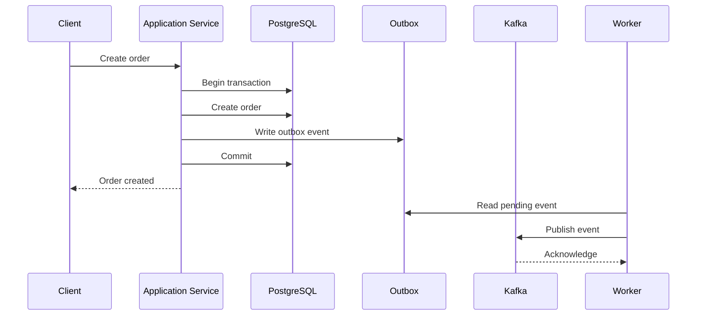
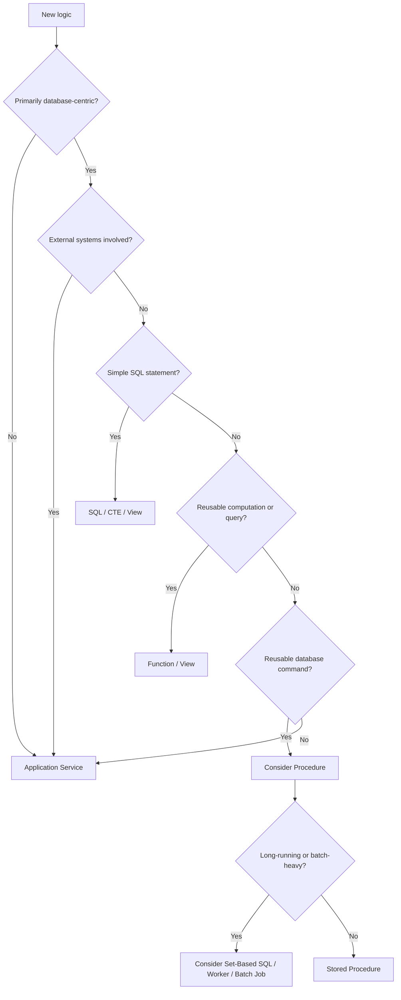

# 12- When Not to Use Stored Procedures

## Overview

Stored procedures are useful when the database should own a reusable, transactional operation. They are not a general-purpose replacement for application services, domain logic, or distributed workflow orchestration.

The primary reason **not** to use a stored procedure is architectural ownership. If the logic primarily belongs to the application layer, depends on external systems, changes frequently with product behavior, or must remain portable across database engines, moving it into PostgreSQL can create unnecessary coupling and operational complexity.

A practical backend architecture usually looks like:

```text
Client
  |
  v
API / Application Service
  |
  +----------------------+
  |                      |
  v                      v
PostgreSQL             External Systems
  |                      |
  +--> SQL               +--> Kafka
  +--> Views             +--> Redis
  +--> Functions         +--> Payment APIs
  +--> Procedures        +--> Other Services
```

The goal is not to minimize application code or maximize database code. The goal is to put each responsibility in the layer that can own it safely, test it effectively, and evolve it without unnecessary coupling.

## When a Stored Procedure Is Usually the Wrong Choice

Avoid stored procedures when the logic:

- Primarily orchestrates external services.
- Contains complex application-domain behavior.
- Changes frequently with product requirements.
- Requires substantial application-level testing or tooling.
- Needs database portability.
- Is already expressed cleanly as a single SQL statement.
- Is primarily a read model.
- Requires asynchronous workflows.
- Depends on HTTP, Kafka, Redis, Celery, or other infrastructure.
- Would create a large, difficult-to-maintain database program.
- Duplicates logic that belongs naturally in the application service layer.

## External Service Integration

A database transaction cannot atomically coordinate arbitrary external systems.

Consider an order workflow:

```text
Application
    |
    +--> PostgreSQL
    |
    +--> Payment Provider
    |
    +--> Kafka
    |
    +--> Email Provider
```

Putting this workflow into a stored procedure is a poor architectural boundary.

The database should not become responsible for:

- Calling payment APIs.
- Publishing business events directly to Kafka.
- Sending emails.
- Calling other microservices.
- Managing HTTP retries.
- Coordinating distributed workflows.

A better architecture is:



The database owns the local transactional state.

The application and infrastructure own the distributed workflow.

## Complex Domain Logic

Stored procedures are a poor fit for domain logic that is primarily concerned with business behavior rather than database state.

For example, an application may have rules such as:

```text
Customer subscription
    |
    +--> Check account eligibility
    +--> Apply promotion
    +--> Calculate pricing
    +--> Check regional rules
    +--> Call tax provider
    +--> Create payment intent
    +--> Send notification
```

Some of these operations may read or write the database, but the workflow itself is not fundamentally a database operation.

An application service is generally a better owner:

```python
class SubscriptionService:
    def create_subscription(self, customer_id: int, plan_id: int):
        customer = self.customer_repository.get(customer_id)
        plan = self.plan_repository.get(plan_id)

        self.validate_eligibility(customer, plan)

        price = self.pricing_service.calculate(customer, plan)
        payment = self.payment_service.create_payment(price)

        return self.subscription_repository.create(
            customer=customer,
            plan=plan,
            payment_id=payment.id,
        )
```

The database should still enforce database-level invariants such as foreign keys, uniqueness, and appropriate transactional constraints.

## Frequently Changing Business Rules

Stored procedures become expensive when business rules change frequently.

Suppose pricing rules change every few weeks:

```text
2026-01 -> pricing rule A
2026-02 -> pricing rule B
2026-03 -> pricing rule C
2026-04 -> pricing rule D
```

If those rules are embedded deeply in database procedures, every change becomes a database deployment concern.

This can create:

- More complicated migrations.
- More difficult rollback procedures.
- Coordination between application and database releases.
- Increased database deployment risk.
- Reduced visibility for application developers.

Frequently changing product behavior is usually easier to evolve in application code with normal CI/CD, testing, code review, and deployment tooling.

## Database Portability

Stored procedures are strongly coupled to the database engine and its procedural language.

For example:

```sql
CREATE OR REPLACE PROCEDURE archive_orders()
LANGUAGE plpgsql
AS $$
BEGIN
    UPDATE orders
    SET archived_at = CURRENT_TIMESTAMP
    WHERE archived_at IS NULL;
END;
$$;
```

This PostgreSQL-specific implementation cannot simply be moved to another database engine.

Portability matters when:

- Multiple database engines are supported.
- A product may migrate databases.
- An organization maintains database-independent libraries.
- Tests use different database engines.
- Vendor independence is a strategic requirement.

If PostgreSQL is an intentional long-term architectural choice, database-specific routines may be completely reasonable.

The important point is to make the coupling deliberate.

## Simple SQL Operations

Do not create a procedure merely because SQL needs to be reused once or because an operation contains more than one line.

For a simple query:

```sql
SELECT id, email, created_at
FROM customers
WHERE id = $1;
```

a procedure may add unnecessary abstraction.

Similarly, a single database update may be clearer as ordinary SQL:

```sql
UPDATE customers
SET last_login_at = CURRENT_TIMESTAMP
WHERE id = $1;
```

The additional lifecycle of a procedure includes:

- Database object management.
- Permissions.
- Migration/versioning.
- Deployment coordination.
- Testing.
- Dependency management.

Use that complexity only when the abstraction provides meaningful value.

## Read Queries and Reporting

Stored procedures are generally not the first choice for reusable read models.

For reusable relational reads, consider:

- Views.
- Materialized views.
- Functions.
- CTEs.
- Parameterized application queries.

For example:

```sql
CREATE VIEW active_customer_orders AS
SELECT
    o.id,
    o.customer_id,
    o.total_amount,
    o.created_at
FROM orders AS o
WHERE o.status = 'active';
```

Consumers can query:

```sql
SELECT *
FROM active_customer_orders
WHERE customer_id = $1;
```

A procedure is command-oriented; a view is representation-oriented.

## When a Function Is Better

If the database routine primarily represents a computation or query and needs to participate naturally in SQL, a PostgreSQL function is often more appropriate.

For example:

```sql
CREATE OR REPLACE FUNCTION calculate_order_total(
    p_order_id bigint
)
RETURNS numeric
LANGUAGE sql
AS $$
    SELECT COALESCE(SUM(quantity * unit_price), 0)
    FROM order_items
    WHERE order_id = p_order_id;
$$;
```

It can be used as part of SQL:

```sql
SELECT
    id,
    calculate_order_total(id) AS total
FROM orders;
```

A procedure is generally better suited to a database command or workflow.

A function is generally better suited to reusable computation or querying.

## When a CTE Is Better

A CTE is scoped to a single SQL statement and is often sufficient for query composition.

```sql
WITH recent_orders AS (
    SELECT
        id,
        customer_id,
        total_amount
    FROM orders
    WHERE created_at >= CURRENT_TIMESTAMP - INTERVAL '30 days'
)
SELECT
    customer_id,
    SUM(total_amount) AS revenue
FROM recent_orders
GROUP BY customer_id;
```

Creating a stored procedure for a query that has no meaningful reusable operation boundary adds unnecessary database surface area.

Use a CTE when the problem is primarily:

> "How should this SQL statement be structured?"

Use a procedure when the problem is:

> "What reusable database operation should callers execute?"

## Application-Level Transaction Management

A stored procedure is not automatically better just because multiple SQL statements must be atomic.

The application can manage a transaction:

```python
from django.db import transaction


def cancel_order(order_id: int, reason: str) -> None:
    with transaction.atomic():
        order = (
            Order.objects
            .select_for_update()
            .get(id=order_id)
        )

        if order.status != "pending":
            raise ValueError("Order cannot be cancelled")

        order.status = "cancelled"
        order.cancellation_reason = reason
        order.save(
            update_fields=[
                "status",
                "cancellation_reason",
            ]
        )

        OrderEvent.objects.create(
            order=order,
            event_type="cancelled",
            metadata={"reason": reason},
        )
```

This may be preferable when the operation contains substantial application-level behavior.

The transaction boundary should be chosen based on where the business operation belongs, not simply on the number of SQL statements involved.

## Large and Complex Procedures

A procedure that grows into hundreds or thousands of lines is usually a warning sign.

For example:

```text
cancel_order()
    |
    +--> validate customer
    +--> calculate refund
    +--> call payment provider
    +--> update inventory
    +--> calculate loyalty points
    +--> generate notification
    +--> publish Kafka event
    +--> update analytics
    +--> write audit records
```

This is no longer a focused database operation.

Large procedures introduce:

- Difficult code navigation.
- Complex dependency relationships.
- Harder local testing.
- More complicated deployments.
- Greater database CPU usage.
- Larger transaction scopes.
- Higher lock contention risk.
- Reduced separation between domain and persistence logic.

A procedure should generally have a narrow, explicit responsibility.

## Asynchronous Workflows

Do not use stored procedures as substitutes for asynchronous job systems.

For example:

```text
API
 |
 v
Application
 |
 +--> Database transaction
 |
 +--> enqueue task
        |
        v
      Celery
        |
        +--> process image
        +--> send email
        +--> call external API
```

A database procedure should not be used to simulate:

- Job queues.
- Retry schedulers.
- Long-running workers.
- Event processors.
- Distributed workflow engines.

For asynchronous workloads, use appropriate application infrastructure such as Celery, Kafka consumers, or managed AWS services.

## Long-Running Operations

Stored procedures can become problematic when they perform expensive work inside a transaction.

Examples include:

- Large table scans.
- Millions of row updates.
- Complex procedural loops.
- Large data transformations.
- Long-running aggregation jobs.

Potential consequences include:

- Long-held locks.
- Increased WAL generation.
- Replication lag.
- Vacuum delays.
- Connection pool pressure.
- Increased transaction age.

For large data operations, consider:

- Set-based SQL.
- Controlled batching.
- Background workers.
- Dedicated maintenance jobs.
- Partitioning.
- Incremental processing.

## Row-by-Row Processing

A common reason procedures become inefficient is procedural row-by-row processing.

Avoid patterns such as:

```sql
FOR order_record IN
    SELECT id
    FROM orders
    WHERE status = 'pending'
LOOP
    UPDATE orders
    SET status = 'processing'
    WHERE id = order_record.id;
END LOOP;
```

When possible, replace the loop with set-based SQL:

```sql
UPDATE orders
SET status = 'processing'
WHERE status = 'pending';
```

Set-based operations usually allow the database optimizer to execute the operation more efficiently.

Procedural control flow should be used when it provides genuine value rather than merely translating application-style loops into SQL.

## High-Concurrency Workloads

Stored procedures do not eliminate concurrency problems.

A procedure that modifies shared state can still experience:

- Deadlocks.
- Lock contention.
- Serialization failures.
- Unique constraint conflicts.
- Transaction retries.

For example:

```text
Transaction A
    |
    +--> lock customer
    |
    +--> lock order

Transaction B
    |
    +--> lock order
    |
    +--> lock customer
```

This can create a deadlock.

If the application already has a well-defined transaction strategy, moving logic into a procedure does not automatically improve concurrency.

Design explicit locking rules and test concurrent execution.

## Security and Privilege Complexity

Stored procedures can reduce direct table access, but they can also introduce security risks.

The risk becomes especially important with `SECURITY DEFINER`.

A poorly designed security-definer routine can accidentally expose privileges to callers.

Avoid using procedures as an excuse to bypass the application's authorization model.

For example:

```text
Application authorization
        |
        v
CALL privileged procedure
        |
        v
Database operation
```

The procedure should not assume that every caller is authorized merely because they can execute it.

Use:

- Narrow `EXECUTE` grants.
- Dedicated database roles.
- Secure `search_path` handling.
- Strict input validation.
- Safe dynamic SQL.
- Auditing for privileged operations.

## Testing and Tooling Constraints

Application code often has a mature testing ecosystem around:

- Unit tests.
- Integration tests.
- Mocking.
- Static analysis.
- Type checking.
- Code coverage.
- CI/CD.
- Application observability.

Stored procedure logic requires database-aware testing.

That is not inherently bad, but it increases the operational cost of putting application behavior into the database.

A team should be comfortable with:

- Database test fixtures.
- Migration testing.
- Concurrent transaction testing.
- Procedure-specific integration tests.
- Query-plan analysis.
- Database deployment pipelines.

If the team cannot reliably test and deploy database routines, extensive procedure usage becomes risky.

## Deployment Coupling

Application deployments and database deployments are already coupled when schema changes are required.

Stored procedures can increase that coupling.

Consider:

```text
Application v1
      |
      +--> expects procedure version A

Application v2
      |
      +--> expects procedure version B
```

During a rolling deployment, both versions may temporarily run simultaneously.

A procedure change must therefore be compatible with the active application versions.

Prefer additive, backward-compatible migrations when possible:

```text
Deploy database change
        |
        v
Deploy application
        |
        v
Remove obsolete database behavior later
```

Avoid changing a procedure in a way that immediately breaks older application instances during rolling deployment.

## Production Decision Matrix

| Situation | Procedure? | Preferred Approach |
|---|---:|---|
| Atomic multi-table database operation | Often | Procedure or application transaction |
| Database-specific locking workflow | Often | Procedure |
| Shared database command | Often | Procedure |
| Simple `SELECT` | No | SQL |
| Complex reusable read | Usually no | View/function |
| Query composition | No | CTE |
| Pure calculation | Usually no | Function/application code |
| External API orchestration | No | Application service |
| Kafka workflow | No | Application/worker |
| Redis workflow | No | Application |
| Email processing | No | Application/Celery |
| Frequently changing product rules | Usually no | Application service |
| Cross-service transaction | No | Distributed workflow/outbox |
| Database portability required | Usually no | Application/portable SQL |
| Large asynchronous batch job | Usually no | Worker/batch system |
| Database maintenance operation | Often | Procedure or database job |

## Practical Decision Framework

Use the following questions before introducing a stored procedure:



The strongest reason to reject a procedure is usually not technical capability. It is poor ownership of the responsibility.

## Common Mistakes

### "Stored Procedures Are More Professional"

They are neither inherently more nor less professional.

A procedure is an architectural tool. It should be introduced when its database-level ownership provides a measurable benefit.

### "Move Everything Close to the Data"

Data locality is useful, but not every piece of business logic belongs in the database.

Moving too much logic into PostgreSQL can turn the database into an application runtime.

### "Fewer Network Calls Always Means Faster"

Reducing network round trips can help, but procedure execution can still be dominated by:

- Poor query plans.
- Missing indexes.
- Lock contention.
- Excessive transaction duration.
- Inefficient procedural loops.

Benchmark the complete operation.

### "Procedures Guarantee Better Consistency"

A procedure can provide a strong database transaction boundary, but it does not provide distributed atomicity.

A procedure cannot automatically make:

```text
PostgreSQL + Kafka + Redis + Payment API
```

one atomic transaction.

### "A Procedure Is Easier Because It Hides SQL"

Abstraction is useful only when the hidden implementation has a stable and meaningful contract.

Poorly documented procedures can make behavior harder to discover than application code.

### "The Application Should Never Contain SQL"

Modern applications can legitimately use:

- ORM queries.
- Raw SQL.
- CTEs.
- Views.
- Functions.
- Procedures.

The right choice depends on the operation and its ownership.

## Interview Traps

### When should you avoid stored procedures?

Avoid them when logic primarily belongs to the application layer, requires external integrations, changes frequently, needs portability, or would create an excessively complex database program.

### Are stored procedures bad practice?

No.

They are appropriate for specific database-centric workloads. The mistake is treating them as a universal application architecture.

### Are stored procedures faster than application code?

Not inherently.

They may reduce network round trips and execute close to the data, but execution performance still depends on SQL quality, indexing, locking, transaction design, and database resources.

### Can a stored procedure coordinate a microservice workflow?

Not appropriately.

Microservice orchestration belongs in application or workflow infrastructure. Database procedures should generally remain inside the database consistency boundary.

### Should application transactions be replaced by procedures?

Not automatically.

If the business operation belongs to the application and only its database writes need atomicity, an application-managed transaction may be simpler and more maintainable.

### What is the strongest signal that a procedure is becoming an anti-pattern?

When the procedure starts owning responsibilities unrelated to database state, such as external integrations, complex domain orchestration, asynchronous processing, or rapidly changing product rules.

## Recommended Architecture

A balanced architecture often looks like:

```text
                    API Request
                         |
                         v
                Application Service
                         |
              +----------+----------+
              |                     |
              v                     v
       Domain/Application       PostgreSQL
           Logic                    |
              |              +------+------+
              |              |             |
              |            Views        Procedures
              |              |             |
              +--------------+-------------+
                             |
                             v
                         Outbox
                             |
                             v
                           Kafka
                             |
                             v
                     Async Consumers
```

Use the database for what it is exceptionally good at:

- Transactions.
- Constraints.
- Locking.
- Relational operations.
- Set-based processing.
- Data integrity.
- Database-local workflows.

Use the application layer for what it is better positioned to own:

- Domain orchestration.
- API contracts.
- Authentication and authorization.
- External integrations.
- Distributed workflows.
- Asynchronous processing.
- Frequently changing business behavior.

## Key Takeaways

- **Do not use stored procedures for logic whose primary responsibility belongs to the application, especially external integrations, distributed workflows, or frequently changing domain behavior.**
- **Simple queries, reusable read models, and database computations are often better represented by SQL, CTEs, views, or functions.**
- **Stored procedures do not provide distributed atomicity across PostgreSQL, Kafka, Redis, payment providers, or other external systems.**
- **Avoid large, long-running, row-by-row procedures; they can increase lock contention, transaction duration, replication pressure, and operational complexity.**
- **Choose the database/application boundary deliberately: keep database integrity close to the data while keeping application orchestration in the application layer.**