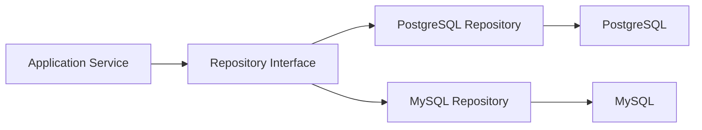

# 13- Database Portability Considerations

## Overview

Database portability is the ability to move an application's database workload between database engines, or to support multiple database engines, without rewriting a substantial portion of the system.

Stored procedures are one of the strongest sources of database-specific coupling because their syntax, procedural languages, transaction semantics, built-in functions, privilege models, and runtime behavior vary significantly between database engines.

For example, a PostgreSQL procedure may use PL/pgSQL:

```sql
CREATE OR REPLACE PROCEDURE archive_old_orders(
    p_cutoff_date date
)
LANGUAGE plpgsql
AS $$
BEGIN
    UPDATE orders
    SET archived_at = CURRENT_TIMESTAMP
    WHERE created_at < p_cutoff_date
      AND archived_at IS NULL;
END;
$$;
```

Moving this implementation to MySQL, SQL Server, or Oracle generally requires a database-specific rewrite rather than a simple schema migration.

Portability is therefore not a property that should be maximized unconditionally. It is an architectural trade-off:

```text
More database-specific behavior
          |
          v
+-----------------------------+
| Better access to vendor     |
| capabilities                |
|                             |
| But greater migration cost  |
| and platform coupling       |
+-----------------------------+
          |
          v
More portable application
```

The correct decision depends on whether the organization intentionally treats a particular database engine as part of the platform architecture.

## What Creates Database Coupling

Stored procedures can couple an application to a database through several layers.

| Coupling Area | Example | Portability Impact |
|---|---|---|
| Procedural language | PL/pgSQL, T-SQL, PL/SQL | High |
| Data types | `jsonb`, arrays, spatial types | High |
| Built-in functions | Vendor-specific date/string functions | Medium–High |
| Transaction semantics | Savepoints, isolation behavior | High |
| Locking | `FOR UPDATE`, advisory locks | High |
| Error handling | Vendor-specific exception mechanisms | High |
| Dynamic SQL | Engine-specific syntax and APIs | High |
| Extensions | PostgreSQL extensions | Very high |
| Security model | Roles, definer privileges | High |
| Query syntax | Pagination, upserts, recursive SQL | Medium |
| Index features | Partial indexes, expression indexes | Medium–High |

The important distinction is between **standard SQL** and **database-specific capabilities**.

A query can look like SQL while still depending heavily on one database engine.

## Why Portability Matters

Database portability is valuable when the organization expects the database technology to change or vary.

Typical reasons include:

- Cloud migration.
- Vendor exit strategies.
- Acquisition integration.
- Supporting multiple customer environments.
- Regulatory or regional infrastructure requirements.
- Running different databases for different workloads.
- Testing against multiple database implementations.
- Avoiding excessive vendor lock-in.

For example:

```text
Application
    |
    v
Repository / Data Access Layer
    |
    +------ PostgreSQL
    |
    +------ MySQL
    |
    +------ SQL Server
```

If the application contains hundreds of database-specific procedures, changing the database engine becomes substantially more expensive.

## Portability Is Not Free

Avoid treating portability as an absolute requirement.

Supporting multiple database engines often means deliberately avoiding useful database-specific features.

For example, PostgreSQL provides capabilities such as:

- `jsonb`.
- Arrays.
- Partial indexes.
- Expression indexes.
- `LISTEN`/`NOTIFY`.
- Advisory locks.
- Rich `RETURNING` support.
- PostgreSQL-specific extensions.
- PL/pgSQL.
- Advanced indexing options.

Restricting the application to the lowest common denominator may make the system more portable but can also:

- Reduce performance.
- Increase application complexity.
- Prevent useful database optimizations.
- Require more application-side processing.
- Make sophisticated queries harder to express.

The correct question is not:

> "Can we avoid database-specific SQL?"

It is:

> "Is the value of this database-specific capability greater than the cost of the resulting coupling?"

## Stored Procedures and Portability

Stored procedures generally have a higher portability cost than ordinary SQL.

Consider:

```sql
CREATE OR REPLACE PROCEDURE process_order(
    p_order_id bigint
)
LANGUAGE plpgsql
AS $$
DECLARE
    v_total numeric;
BEGIN
    SELECT COALESCE(SUM(quantity * unit_price), 0)
    INTO v_total
    FROM order_items
    WHERE order_id = p_order_id;

    UPDATE orders
    SET total_amount = v_total,
        processed_at = CURRENT_TIMESTAMP
    WHERE id = p_order_id;
END;
$$;
```

The following elements are PostgreSQL-specific:

- `CREATE OR REPLACE PROCEDURE` syntax.
- `LANGUAGE plpgsql`.
- PL/pgSQL variable declarations.
- `DECLARE`.
- `SELECT ... INTO`.
- Procedural block syntax.
- PostgreSQL data types and functions.

A migration therefore requires more than translating SQL keywords.

It requires mapping the **execution model** to the target database.

## SQL Portability vs Procedure Portability

| Approach | Portability | Database Capability | Maintenance |
|---|---:|---:|---:|
| Standard SQL | High | Moderate | Low |
| ORM abstraction | High for common operations | Limited for advanced features | Moderate |
| Raw vendor-specific SQL | Low | High | Moderate |
| Database function | Low–Medium | High | Moderate |
| Stored procedure | Low | High | Moderate–High |
| Vendor-specific extension | Very low | Very high | High |

Portability should therefore be evaluated at the individual feature level rather than treated as a binary application property.

## Database-Specific Procedural Languages

Different databases expose different procedural environments.

| Database | Common Procedural Language | Typical Routine Model |
|---|---|---|
| PostgreSQL | PL/pgSQL | Functions and procedures |
| MySQL | SQL/PSM | Procedures and functions |
| SQL Server | T-SQL | Stored procedures and functions |
| Oracle | PL/SQL | Procedures and functions |

Even when the business operation is identical, the implementation details can differ significantly.

For example:

```text
Business Operation
      |
      +--> PostgreSQL implementation
      |       PL/pgSQL
      |
      +--> MySQL implementation
      |       SQL/PSM
      |
      +--> SQL Server implementation
      |       T-SQL
      |
      +--> Oracle implementation
              PL/SQL
```

This means a portable stored-procedure abstraction usually requires maintaining multiple implementations.

## Database Abstraction Layers

Application frameworks can reduce database coupling for common operations.

Django ORM, SQLAlchemy, and similar abstractions can express many operations without committing the application to a particular SQL dialect.

For example, application code can express:

```python
customer = Customer.objects.get(id=customer_id)
```

instead of embedding database-specific SQL.

This improves portability for common CRUD operations.

However, abstraction layers do not eliminate database differences.

Advanced queries may still require:

- Raw SQL.
- Vendor-specific expressions.
- Database-specific migrations.
- Custom indexes.
- Native functions.
- Stored procedures.

Treat ORM portability as a useful abstraction, not as proof that the entire application is database-independent.

## Repository and Data Access Boundaries

A repository or data-access layer can isolate database-specific implementation.



For example:

```python
from typing import Protocol


class OrderRepository(Protocol):
    def archive_before(self, cutoff_date: str) -> int:
        ...


class PostgresOrderRepository:
    def archive_before(self, cutoff_date: str) -> int:
        # PostgreSQL-specific implementation.
        ...
```

This can contain database-specific details without exposing them throughout the application.

However, an abstraction becomes counterproductive if it attempts to hide fundamental behavioral differences between databases.

## The Leaky Abstraction Problem

Suppose PostgreSQL supports an operation efficiently but another database does not.

An abstraction like:

```python
repository.lock_customer(customer_id)
```

may appear portable.

But the actual semantics may differ:

```text
PostgreSQL
    |
    +--> row-level locking

Database B
    |
    +--> different locking behavior

Database C
    |
    +--> operation unavailable
```

The abstraction can therefore hide an important architectural difference.

Senior engineers should ask:

- Are the semantics equivalent?
- Are isolation guarantees equivalent?
- Is performance equivalent?
- Are failure modes equivalent?
- Are concurrency guarantees equivalent?

Portability requires **behavioral compatibility**, not merely syntactic compatibility.

## Transaction Portability

Transactions are another important portability boundary.

A procedure may depend on assumptions about:

- Isolation levels.
- Lock duration.
- Savepoints.
- Deadlock detection.
- Constraint timing.
- Autocommit behavior.
- Transaction boundaries.

For example:

```text
Application
    |
    v
BEGIN
    |
    v
CALL procedure
    |
    +--> multiple writes
    |
    v
COMMIT
```

The application must understand whether the target database provides equivalent semantics.

A successful translation of procedure syntax does not guarantee equivalent transaction behavior.

## Concurrency and Locking

Database portability becomes particularly difficult when procedures depend on sophisticated concurrency behavior.

For example:

```sql
SELECT id
FROM orders
WHERE id = p_order_id
FOR UPDATE;
```

A procedure may rely on this lock to prevent concurrent modification.

A migration must verify:

- Lock compatibility.
- Isolation-level behavior.
- Deadlock behavior.
- Lock duration.
- Index interaction.
- Transaction semantics.

Do not assume that equivalent-looking SQL produces equivalent concurrency behavior across database engines.

## Vendor-Specific Data Types

Database-specific data types are another significant source of coupling.

PostgreSQL example:

```sql
CREATE TABLE customer_preferences (
    customer_id bigint PRIMARY KEY,
    preferences jsonb NOT NULL
);
```

An application that depends heavily on `jsonb` operators and indexes is already coupled to PostgreSQL.

A stored procedure might use:

```sql
SELECT preferences ->> 'language'
FROM customer_preferences
WHERE customer_id = $1;
```

Moving this logic to another database may require rewriting both:

- The schema.
- The procedure implementation.

When portability is important, minimize unnecessary dependence on vendor-specific types and operators.

## Database Extensions

Extensions increase coupling even further.

For PostgreSQL:

```sql
CREATE EXTENSION IF NOT EXISTS pg_trgm;
```

If procedures or queries depend on extension-provided functionality, the portability boundary extends beyond PostgreSQL itself.

Before adopting an extension, determine:

- Is it required for correctness or only optimization?
- Is an equivalent capability available elsewhere?
- Can the application degrade gracefully?
- How difficult would migration be?

Vendor extensions are often excellent engineering choices when the database platform is intentionally fixed.

They are poor choices when strict multi-database portability is a requirement.

## Migration Strategy

If database portability is an explicit requirement, treat database routines as versioned application artifacts.

A repository might look like:

```text
database/
├── migrations/
├── procedures/
│   ├── postgres/
│   │   ├── archive_orders.sql
│   │   └── process_order.sql
│   └── mysql/
│       ├── archive_orders.sql
│       └── process_order.sql
└── tests/
    ├── postgres/
    └── mysql/
```

CI should validate every supported implementation.

```text
Pull Request
     |
     v
Database Tests
     |
     +--> PostgreSQL
     |
     +--> MySQL
     |
     v
Application Tests
     |
     v
Deployment
```

Containerized database instances make this practical for many development and CI environments.

## Versioning Procedures

Stored procedures should be version-controlled like application code.

Avoid manual production edits such as:

```text
psql production
    |
    +--> manually edit procedure
```

Instead:

```text
Git
 |
 v
Migration
 |
 v
CI validation
 |
 v
Staging
 |
 v
Production
```

This provides:

- Reproducibility.
- Code review.
- Auditability.
- Rollback visibility.
- Consistent environments.

If multiple database engines are supported, each implementation should be versioned and tested as part of the same release process.

## Backward-Compatible Deployment

Database portability is not only about migration between vendors.

It also affects normal application deployment.

Suppose:

```text
Application v1 --> procedure v1
Application v2 --> procedure v2
```

During a rolling deployment, both application versions may temporarily coexist.

Prefer additive database changes:

```text
Deploy compatible database changes
              |
              v
Deploy application
              |
              v
Switch traffic
              |
              v
Remove obsolete database behavior
```

This strategy reduces compatibility problems during deployment.

## Testing Portability

If multiple databases are genuinely supported, test the behavior on every supported engine.

A useful test matrix is:

| Capability | PostgreSQL | MySQL | SQL Server |
|---|---:|---:|---:|
| CRUD behavior | Test | Test | Test |
| Procedure behavior | Test | Test | Test |
| Transaction behavior | Test | Test | Test |
| Constraint behavior | Test | Test | Test |
| Error behavior | Test | Test | Test |
| Concurrency behavior | Test | Test | Test |
| Performance-sensitive queries | Test | Test | Test |

Do not rely solely on unit tests running against SQLite when production uses PostgreSQL.

For example:

```text
Development
    |
    +--> SQLite

Production
    |
    +--> PostgreSQL
```

This can hide differences involving:

- SQL syntax.
- Constraints.
- Transactions.
- Locking.
- Data types.
- Query planning.
- Index behavior.

Integration tests should use the production database engine whenever database behavior matters.

## Docker-Based Testing

Docker can make database-specific integration tests easier to reproduce.

Example:

```yaml
services:
  postgres:
    image: postgres:18
    environment:
      POSTGRES_DB: app
      POSTGRES_USER: app
      POSTGRES_PASSWORD: app
    ports:
      - "5432:5432"

  mysql:
    image: mysql:8.4
    environment:
      MYSQL_DATABASE: app
      MYSQL_USER: app
      MYSQL_PASSWORD: app
      MYSQL_ROOT_PASSWORD: root
    ports:
      - "3306:3306"
```

In CI, the application test suite can run against each supported engine.

The exact versions should match the versions supported in production.

## Performance Portability

A query that is fast on one database may be slow on another.

Database engines differ in:

- Query optimizers.
- Index selection.
- Join strategies.
- Statistics.
- Parallel execution.
- Memory management.
- Storage engines.
- Execution plans.

For example:

```sql
SELECT customer_id, COUNT(*)
FROM orders
GROUP BY customer_id;
```

The SQL is portable, but its execution plan is not.

Therefore:

> SQL portability does not imply performance portability.

Performance-sensitive queries must be benchmarked on each supported database.

## Explain Plans

When portability matters, inspect execution plans separately.

PostgreSQL:

```sql
EXPLAIN (ANALYZE, BUFFERS)
SELECT customer_id, COUNT(*)
FROM orders
GROUP BY customer_id;
```

Do not assume that an index or query optimization that works on PostgreSQL will produce the same result on another database.

The optimization strategy should be validated against the actual target engine.

## Portability and Cloud Architecture

Cloud database services can increase the importance of this decision.

For example:

```text
Application
    |
    v
Managed PostgreSQL
    |
    +--> AWS RDS
    +--> Aurora PostgreSQL
```

If the organization has intentionally standardized on PostgreSQL, using PostgreSQL-specific procedures can be entirely reasonable.

In that architecture, PostgreSQL is not an incidental implementation detail. It is part of the platform.

Portability becomes more important when the architecture is:

```text
Application
    |
    +--> Customer PostgreSQL
    +--> Customer MySQL
    +--> Customer SQL Server
```

Multi-tenant products supporting customer-selected databases have fundamentally different portability requirements.

## When Database-Specific Procedures Are Reasonable

Database-specific procedures are usually reasonable when:

- PostgreSQL is an intentional platform choice.
- The organization controls the database environment.
- The procedure provides meaningful transactional or performance benefits.
- The workload is strongly database-centric.
- The team has strong database engineering practices.
- Database-specific functionality provides important value.
- Portability is not a near-term requirement.

For example:

```text
Application
     |
     v
PostgreSQL
     |
     +--> Procedure
     +--> Function
     +--> View
     +--> PostgreSQL-specific index
```

This can be an excellent architecture.

The key is that the coupling is intentional.

## When Portability Should Influence the Design

Portability should carry more weight when:

- Multiple database vendors are supported.
- Database migration is a realistic business requirement.
- Customers choose their database engine.
- A database vendor lock-in strategy is unacceptable.
- The application is distributed as software deployed into customer environments.
- The organization is likely to change infrastructure providers.

In those cases, keep the database boundary narrower and avoid deeply embedding business behavior in vendor-specific procedures.

## Common Mistakes

### Assuming SQL Means Portable

SQL is standardized, but real-world SQL implementations contain substantial vendor-specific behavior.

**Avoid it:** identify dialect-specific syntax, types, functions, operators, indexes, and procedural features.

### Using an ORM and Assuming the Database Is Portable

An ORM abstracts common operations but does not abstract every database capability.

**Avoid it:** test database-specific queries and migrations against every supported engine.

### Writing One Procedure and Translating It Later

Procedural languages have different semantics, not just different syntax.

**Avoid it:** treat each supported implementation as a separate database artifact and test its behavior.

### Testing Only Against SQLite

SQLite behaves differently from PostgreSQL, MySQL, and SQL Server in many important areas.

**Avoid it:** use the production database engine for integration tests.

### Ignoring Performance Differences

Portable SQL can still generate dramatically different execution plans.

**Avoid it:** benchmark performance-sensitive operations on each target engine.

### Hiding Semantic Differences Behind Interfaces

An interface can make two implementations look identical while their transaction or concurrency behavior differs.

**Avoid it:** define behavioral guarantees explicitly, not just method signatures.

### Avoiding All Vendor-Specific Features

Extreme portability can result in poor use of the database platform.

**Avoid it:** accept intentional coupling when the capability provides substantial business or technical value.

## Production Checklist

Before introducing a database-specific stored procedure, evaluate:

- **Portability:** Is database migration a realistic requirement?
- **Ownership:** Does the logic genuinely belong in the database?
- **Semantics:** Can equivalent behavior be implemented on another engine?
- **Transactions:** Are isolation and locking guarantees database-specific?
- **Data types:** Does the procedure depend on vendor-specific types?
- **Extensions:** Does it depend on database extensions?
- **Testing:** Can the routine be tested in CI?
- **Deployment:** Is it version-controlled and migrated safely?
- **Performance:** Has the operation been benchmarked?
- **Operations:** Can the team monitor and troubleshoot it?
- **Rollback:** Can changes be reverted safely?
- **Documentation:** Is the database-specific contract explicit?

## Interview Traps

### Are stored procedures inherently bad for portability?

No. They simply have a high portability cost because procedural languages and database behavior differ significantly between engines.

### Is ORM usage enough to make an application database-independent?

No. ORMs abstract common operations but cannot eliminate differences in advanced SQL, transactions, locking, data types, indexes, and database-specific features.

### Does standard SQL guarantee equivalent performance?

No. Different database engines can choose very different execution plans for the same SQL.

### Should you avoid PostgreSQL-specific features?

Not necessarily. If PostgreSQL is an intentional platform decision, using its strengths can be the correct engineering choice.

### How should a multi-database application handle stored procedures?

Prefer a narrow database-specific layer with separate implementations, explicit behavioral contracts, version-controlled migrations, and integration tests for every supported engine.

### What is the biggest portability mistake?

Designing for portability without defining whether portability is actually a business or architectural requirement. Unnecessary portability can add complexity just as excessive database coupling can.

## Key Takeaways

- **Stored procedures create strong database-engine coupling because procedural languages, transaction semantics, locking, data types, and extensions vary across database engines.**
- **Portability is an architectural trade-off, not an absolute goal; intentional PostgreSQL-specific behavior can be correct when PostgreSQL is the chosen platform.**
- **If multiple database engines are genuinely supported, isolate vendor-specific code, version each implementation, and test behavior against every supported engine.**
- **SQL portability does not guarantee transaction, concurrency, or performance portability; validate semantics and execution plans on the actual target databases.**
- **Choose database-specific features deliberately by comparing their operational and performance benefits against the long-term cost of vendor coupling.**