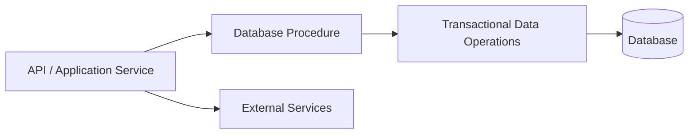

# 14- Common Stored Procedure Mistakes

## Overview

Stored procedures can centralize transactional operations, enforce database-side invariants, reduce application/database round trips, and encapsulate data-intensive workflows. They can also introduce difficult-to-debug failures when transaction boundaries, permissions, dynamic SQL, error handling, or performance are handled incorrectly.

The most serious stored procedure mistakes are rarely syntax errors. They are usually architectural or operational mistakes:

- Putting too much business logic inside the database.
- Creating procedures with unclear transaction ownership.
- Returning inconsistent error information.
- Building dynamic SQL unsafely.
- Performing row-by-row processing where set-based SQL is appropriate.
- Ignoring locking and concurrency behavior.
- Deploying procedures manually.
- Granting excessive database privileges.
- Treating procedures as ordinary application code without database-specific testing.

A production-quality procedure should have an explicit contract covering inputs, outputs, transaction behavior, permissions, failure semantics, and expected performance.

## Common Mistakes at a Glance

| Mistake | Typical Impact | Better Practice |
|---|---|---|
| Excessive business logic | Difficult maintenance and testing | Keep database logic focused on data integrity and data-intensive operations |
| Row-by-row processing | Poor performance at scale | Prefer set-based SQL |
| Ambiguous transactions | Partial updates or unexpected commits | Define transaction ownership explicitly |
| Unsafe dynamic SQL | SQL injection or incorrect queries | Parameterize values and safely construct identifiers |
| Swallowing exceptions | Silent corruption or incorrect success responses | Propagate or explicitly translate errors |
| Overly broad permissions | Security compromise | Grant least privilege |
| Missing indexes | Slow procedures and lock contention | Inspect execution plans and index access paths |
| Manual deployment | Configuration drift | Version procedures through migrations |
| No concurrency testing | Race conditions and deadlocks | Test realistic concurrent workloads |
| Database-specific assumptions | Migration difficulty | Make portability requirements explicit |
| Excessive result sets | Application complexity and network overhead | Define a stable output contract |
| Hidden side effects | Difficult reasoning and debugging | Document every write and external dependency |

## Putting Too Much Business Logic in Procedures

### The Problem

A stored procedure can technically contain substantial business logic, but technical capability does not automatically make it the right location.

For example, a procedure that performs:

```text
Validate customer
    ↓
Calculate pricing
    ↓
Apply promotions
    ↓
Call external service
    ↓
Generate notification
    ↓
Update database
    ↓
Publish event
```

can become difficult to understand and test.

Database procedures are generally strongest when they handle operations that benefit directly from database locality:

- Atomic multi-row updates.
- Data validation that must hold regardless of the caller.
- Complex data transformations.
- Aggregation-heavy operations.
- Transactional workflows tightly coupled to relational state.

Application code is usually a better location for:

- HTTP communication.
- External API orchestration.
- Complex domain workflows.
- Business rules requiring many external dependencies.
- Logic that must be shared across databases or services.

### Production Guideline

Prefer a clear boundary:



The application owns orchestration; the database owns operations that require database-local consistency or efficient data processing.

## Row-by-Row Processing

One of the most common performance mistakes is processing records individually inside a procedural loop.

Problematic pattern:

```sql
FOR order_record IN
    SELECT id
    FROM orders
    WHERE status = 'pending'
LOOP
    UPDATE orders
    SET status = 'processing'
    WHERE id = order_record.id;
END LOOP;
```

This performs procedural work around operations that may be expressed as one set-based statement.

Prefer:

```sql
UPDATE orders
SET status = 'processing'
WHERE status = 'pending';
```

The set-based version generally gives the optimizer more freedom and avoids procedural overhead.

### When a Loop Is Justified

Loops can still be appropriate when:

- Each iteration requires genuinely different procedural behavior.
- Operations depend sequentially on previous results.
- The database API does not provide an appropriate set-based operation.
- The workload is intentionally bounded.

Before introducing a loop, ask whether the operation can be expressed using:

- `UPDATE`.
- `INSERT ... SELECT`.
- `DELETE`.
- `MERGE` where supported and appropriate.
- CTEs.
- Window functions.
- Aggregation.
- Temporary tables.

## Ignoring Indexes

A procedure can be logically correct while being operationally disastrous.

Consider:

```sql
UPDATE orders
SET status = 'archived'
WHERE customer_id = p_customer_id
  AND created_at < p_cutoff;
```

If the database cannot efficiently locate qualifying rows, the procedure may scan a large table and hold locks for a long time.

The appropriate index depends on:

- Table size.
- Selectivity.
- Query frequency.
- Write frequency.
- Existing indexes.
- Database optimizer behavior.

For PostgreSQL, inspect the plan:

```sql
EXPLAIN (ANALYZE, BUFFERS)
UPDATE orders
SET status = 'archived'
WHERE customer_id = 1001
  AND created_at < DATE '2026-01-01';
```

Do not add indexes blindly. Indexes improve reads but increase storage requirements and write overhead.

## Ambiguous Transaction Ownership

One of the most dangerous design problems is not knowing who owns the transaction.

Consider:

```text
Application
    |
    v
BEGIN
    |
    v
CALL procedure
    |
    +--> UPDATE A
    +--> UPDATE B
    |
    v
COMMIT
```

The application may expect the entire operation to be part of its transaction.

If the procedure independently assumes responsibility for transaction boundaries, the behavior may conflict with the caller or with the database engine's transaction model.

### Define the Contract

Document whether the procedure:

- Expects an existing transaction.
- Is intended to run as a standalone operation.
- Can commit or roll back.
- Uses savepoints.
- Requires a particular isolation level.

For PostgreSQL in particular, functions and procedures have different transaction capabilities, and transaction control has restrictions depending on how a procedure is invoked.

Do not assume that all database engines provide equivalent transaction behavior.

## Swallowing Errors

A procedure should not convert a serious database failure into an apparently successful operation.

Bad pattern:

```sql
BEGIN
    UPDATE accounts
    SET balance = balance - p_amount
    WHERE id = p_account_id;

EXCEPTION
    WHEN OTHERS THEN
        NULL;
END;
```

The caller may interpret the procedure's completion as success even though the operation failed.

This can lead to:

- Incorrect API responses.
- Inconsistent application state.
- Missing audit records.
- Silent data loss.
- Difficult production debugging.

Prefer either propagating the original error or translating it into a deliberate, documented application-level error.

## Catching Every Exception

Broad exception handling is another common mistake.

Conceptually:

```sql
EXCEPTION
    WHEN OTHERS THEN
        -- Log everything
        -- Return success
```

is usually a poor design.

Different failures have different meanings:

| Failure | Appropriate Response |
|---|---|
| Validation failure | Return a clear domain error |
| Unique constraint violation | Translate if expected |
| Foreign-key violation | Usually propagate or translate deliberately |
| Deadlock | Allow retry at an appropriate layer |
| Serialization failure | Usually retry at transaction boundary |
| Unexpected database error | Preserve failure and investigate |

Do not treat expected business errors and infrastructure failures as equivalent.

## Unsafe Dynamic SQL

Dynamic SQL is sometimes necessary for dynamic identifiers, optional clauses, partition operations, administrative routines, or other advanced use cases.

It becomes dangerous when untrusted values are concatenated into SQL.

Unsafe:

```sql
EXECUTE 'DELETE FROM orders WHERE customer_id = ' || p_customer_id;
```

Even when a parameter currently appears numeric, building SQL through string concatenation creates unnecessary injection risk and makes the query harder to reason about.

Prefer parameter binding for values where the database supports it.

PostgreSQL example:

```sql
EXECUTE
    'DELETE FROM orders WHERE customer_id = $1'
USING p_customer_id;
```

Identifiers such as table or column names cannot generally be passed as ordinary value parameters. They must be safely constructed using the database's identifier-quoting facilities and, preferably, validated against an allowlist.

### Production Rule

Treat these differently:

```text
Values
  → Parameterize

Identifiers
  → Validate + safely quote

SQL structure
  → Keep static whenever possible
```

## Trusting Input Validation in the Application

Application validation is useful but should not be the only protection for critical database invariants.

For example, an API may validate:

```python
if quantity <= 0:
    raise ValueError("Invalid quantity")
```

Another service, batch process, migration, or administrative script may bypass that validation.

Critical invariants should be enforced as close to the data as practical.

Use:

- `NOT NULL`.
- `CHECK`.
- `UNIQUE`.
- Foreign keys.
- Exclusion constraints where appropriate.
- Transactions.
- Database-side validation where necessary.

A procedure should complement database constraints rather than attempting to replace them all.

## Performing Excessive Work in One Transaction

A procedure that processes millions of rows in one transaction can create significant operational pressure.

Potential effects include:

- Long lock duration.
- Large transaction logs.
- Increased replication lag.
- Longer vacuum or cleanup delays depending on the database.
- Large rollback costs.
- Increased contention.
- Difficult recovery.

For large workloads, consider controlled batching when atomic processing of the entire dataset is not required.

For example:

```text
10 million rows
      |
      v
Batch 1 → commit
Batch 2 → commit
Batch 3 → commit
...
```

Batching changes the transactional semantics, so it should never be introduced merely as a performance optimization without verifying the correctness requirements.

## Assuming Procedures Are Automatically Faster

A stored procedure can reduce application/database round trips, but it is not inherently faster.

Performance depends on:

- Query plans.
- Indexes.
- Amount of data processed.
- Network round trips.
- Locking.
- Transaction duration.
- Procedural overhead.
- Database configuration.

A poorly designed procedure can be slower than well-designed application SQL.

Measure the actual workload rather than assuming database-side execution is faster.

## Ignoring Locking and Concurrency

Procedures often combine multiple reads and writes, making concurrency behavior particularly important.

Example:

```sql
SELECT balance
INTO v_balance
FROM accounts
WHERE id = p_account_id;

IF v_balance >= p_amount THEN
    UPDATE accounts
    SET balance = balance - p_amount
    WHERE id = p_account_id;
END IF;
```

Two concurrent transactions can potentially read the same balance before either performs the update, depending on the isolation level and implementation.

A safer design may use an atomic conditional update:

```sql
UPDATE accounts
SET balance = balance - p_amount
WHERE id = p_account_id
  AND balance >= p_amount;
```

The application can then check whether one row was affected.

The key principle is:

> Prefer atomic database operations over read-then-write sequences when concurrency matters.

## Holding Locks While Performing Unnecessary Work

Avoid keeping database locks while doing unrelated processing.

Bad workflow:

```text
Acquire row lock
    ↓
Complex computation
    ↓
External API call
    ↓
Wait
    ↓
Database update
    ↓
Release lock
```

This can create unnecessary contention.

Prefer:

```text
Prepare data
    ↓
Perform required database transaction
    ↓
Commit quickly
    ↓
Perform independent external work
```

When external operations must participate in the workflow, consider patterns such as an outbox rather than holding database locks while waiting on a remote service.

## Hidden Side Effects

A procedure named:

```text
get_customer()
```

should not unexpectedly:

- Update customer data.
- Write audit records.
- Delete rows.
- Emit events.
- Modify unrelated tables.

Unexpected side effects make procedures difficult to reason about and can surprise callers.

Names should communicate behavior clearly.

Prefer names such as:

```text
get_customer
archive_customer
recalculate_customer_balance
create_order
```

rather than ambiguous names that conceal writes.

## Returning an Unstable Interface

A procedure can become an internal API.

If different versions return different columns or meanings without a coordinated migration, application consumers can break.

Define explicitly:

- Input parameters.
- Parameter types.
- Nullability expectations.
- Return values.
- Result-set shape.
- Error semantics.
- Side effects.

For example:

```text
create_order(
    customer_id,
    currency,
    items
)
        |
        v
returns
    order_id
    total_amount
    status
```

Treat changes to this contract as API changes.

## Returning Too Much Data

A procedure that returns thousands of rows when the application needs only a count wastes:

- Database CPU.
- Network bandwidth.
- Application memory.
- Serialization/deserialization time.

Prefer returning only what the caller needs.

Bad:

```text
Database → 100,000 rows → Application → count
```

Better:

```text
Database → COUNT(*) → Application
```

Push data-intensive aggregation into the database when that reduces unnecessary data movement.

## Misusing Temporary Tables

Temporary tables can be useful for complex transformations and intermediate datasets, but unnecessary temporary objects can add overhead and complicate execution.

Before introducing one, consider:

- A CTE.
- A derived table.
- A window function.
- A direct `INSERT ... SELECT`.
- An indexed staging table when persistence is genuinely needed.

Temporary tables become more reasonable when intermediate data is reused multiple times or needs its own indexing/statistics characteristics.

## Using Dynamic SQL for Static Queries

Dynamic SQL is sometimes used even when the query structure is known.

For example, generating:

```text
SELECT ...
```

through string concatenation when the query could simply be written as static SQL increases:

- Complexity.
- Injection risk.
- Debugging difficulty.
- Testing burden.

Use dynamic SQL because the SQL structure genuinely needs to vary, not because it appears more flexible.

## Excessive Procedure Size

A procedure containing hundreds or thousands of lines becomes difficult to:

- Review.
- Test.
- Debug.
- Deploy.
- Profile.
- Understand.

Split cohesive operations into smaller routines where that improves maintainability.

However, avoid blindly decomposing every statement into a separate procedure. Excessive fragmentation can create an equally difficult call graph.

A good procedure should have a clear responsibility and predictable side effects.

## Ignoring Database-Specific Behavior

Stored procedures frequently depend on database-specific features.

For example:

```sql
LANGUAGE plpgsql
```

creates PostgreSQL coupling.

Other examples include:

- Vendor-specific data types.
- Locking syntax.
- Error codes.
- JSON operators.
- Extensions.
- Transaction semantics.
- Procedural language features.

This is not automatically wrong.

The mistake is failing to recognize the coupling.

If PostgreSQL is an intentional architectural dependency, use PostgreSQL capabilities when they provide meaningful value. If multi-database portability is a requirement, isolate and test vendor-specific implementations.

## Granting Excessive Permissions

Procedures can become security boundaries, so permissions must be designed deliberately.

Avoid giving an application account unrestricted access merely because a procedure needs to modify a small set of tables.

Prefer:

```text
Application role
      |
      +--> EXECUTE on required procedure
                     |
                     v
               Required tables
```

rather than:

```text
Application role
      |
      +--> Full database privileges
```

Review:

- `EXECUTE` privileges.
- Ownership.
- `SECURITY DEFINER` usage where applicable.
- `search_path` behavior.
- Role membership.
- Direct table privileges.
- Dynamic SQL execution context.

Security-definer routines require particular care because they can execute with the privileges of their owner.

## Unsafe `SECURITY DEFINER` Design

In PostgreSQL, a `SECURITY DEFINER` function can execute with the privileges of its owner.

This can be useful for controlled privilege escalation, but an unsafe implementation can expose privileged operations.

Security-sensitive routines should:

- Use a trusted, controlled `search_path`.
- Avoid resolving attacker-controlled objects.
- Restrict dynamic SQL.
- Validate inputs.
- Grant `EXECUTE` only to intended roles.
- Avoid unnecessary ownership privileges.

Security-definer code should be reviewed like privileged application code.

## Ignoring `search_path`

PostgreSQL name resolution can be affected by `search_path`.

Code such as:

```sql
SELECT * FROM users;
```

may resolve differently depending on the session's search path.

This becomes especially important for security-definer routines.

Where security or correctness requires it, qualify objects explicitly:

```sql
SELECT *
FROM app.users;
```

and use an appropriate controlled `search_path` configuration.

## Manual Production Changes

Editing a production procedure manually creates configuration drift.

Problematic workflow:

```text
Developer
   |
   v
Production database
   |
   +--> Manual ALTER PROCEDURE
```

Prefer:

```text
Git
 |
 v
Migration
 |
 v
CI
 |
 v
Staging
 |
 v
Production
```

Procedure definitions should be:

- Version-controlled.
- Code-reviewed.
- Tested.
- Included in deployment automation.
- Traceable to an application release.

## Deploying Incompatible Procedure Changes

Application and database changes may be deployed independently during rolling deployments.

Suppose application version A expects:

```text
procedure(input_a)
```

while version B expects:

```text
procedure(input_a, input_b)
```

Changing the procedure without considering mixed-version deployment can break requests during rollout.

Prefer backward-compatible database changes where possible:

```text
Deploy compatible database version
          ↓
Deploy application
          ↓
Migrate callers
          ↓
Remove obsolete database interface
```

This is particularly important in Kubernetes and other rolling-deployment environments.

## Missing Observability

Procedures execute inside the database, so application logs alone may not explain their behavior.

Production observability should cover:

- Execution duration.
- Call frequency.
- Error frequency.
- Lock waits.
- Deadlocks.
- Slow queries.
- Query plans.
- Replication impact.
- Transaction duration.

Useful PostgreSQL capabilities include database logging and statistics facilities such as `pg_stat_statements`.

The exact instrumentation strategy depends on the database engine and production environment.

## Logging Sensitive Data

Do not blindly log procedure parameters.

Parameters may contain:

- Customer information.
- Authentication data.
- Financial values.
- Tokens.
- Personally identifiable information.

Prefer structured operational metadata such as:

```text
procedure=archive_orders
duration_ms=184
rows_affected=4210
status=success
```

rather than logging complete sensitive input payloads.

## Ignoring Deadlocks and Retryable Errors

A procedure that modifies multiple resources can participate in deadlocks.

For example:

```text
Transaction A:
lock Customer 1
lock Customer 2

Transaction B:
lock Customer 2
lock Customer 1
```

The database may detect the deadlock and abort one transaction.

Do not solve this by simply catching every error.

Better approaches include:

- Consistent lock ordering.
- Short transactions.
- Appropriate indexes.
- Avoiding unnecessary locks.
- Retrying known transient errors at the correct transaction boundary.

Retry logic should be bounded and idempotency should be considered.

## Failing to Design for Idempotency

Stored procedures used by:

- Celery workers.
- Kafka consumers.
- Retryable API requests.
- Scheduled jobs.

may execute more than once.

For example:

```text
Request
   |
   v
Procedure
   |
   X timeout
   |
   v
Caller retries
   |
   v
Procedure executes again
```

If the operation is not idempotent, duplicate effects can occur.

Possible techniques include:

- Unique business keys.
- Idempotency keys.
- Upserts.
- Status transitions.
- Deduplication tables.
- Conditional updates.

The correct mechanism depends on the operation and consistency requirements.

## Performing External Network Calls from Database Logic

Database-side code should generally not become an HTTP orchestration layer.

This creates undesirable coupling:

```text
Transaction
   |
   v
Database procedure
   |
   v
HTTP service
   |
   v
Network timeout
   |
   v
Long-running database transaction
```

External systems have independent availability and latency characteristics.

Prefer application-level orchestration or asynchronous patterns such as:

```text
Database transaction
      |
      v
Outbox event
      |
      v
Kafka / Worker
      |
      v
External service
```

This keeps database transactions focused and makes failure handling more explicit.

## Not Considering Replication

A write-heavy procedure can create substantial replication pressure.

For example:

```text
Primary
  |
  +--> large UPDATE
  |
  v
WAL / transaction log
  |
  v
Replica
```

Large operations can increase:

- Replication lag.
- Replica recovery time.
- Read latency.
- Storage consumption.

Before executing large production procedures, consider:

- Batch size.
- Transaction duration.
- Replication topology.
- Maintenance windows.
- Replica workload.
- Rollback requirements.

## Ignoring Disaster Recovery

Procedures are part of the application's executable database state.

A backup that contains data but fails to preserve required schema objects or deployment metadata can leave the system incomplete after recovery.

Treat these as recoverable artifacts:

- Tables.
- Indexes.
- Constraints.
- Views.
- Functions.
- Procedures.
- Triggers.
- Required extensions.
- Database roles and permissions where appropriate.

Test restoration rather than assuming backups are sufficient.

## Common Beginner Mistakes

| Mistake | Why It Happens | Prevention |
|---|---|---|
| Using loops for every operation | Procedural thinking is familiar | Prefer set-based SQL |
| Catching `WHEN OTHERS` and doing nothing | Wants the procedure to "keep going" | Handle only expected errors |
| Concatenating parameters into SQL | Seems simple | Parameterize values |
| Updating millions of rows in one transaction | Procedure appears atomic | Evaluate batching and operational impact |
| Ignoring indexes | Focuses only on correctness | Inspect execution plans |
| Putting every business rule in SQL | Database feels like a central place | Define application/database ownership |
| Manual procedure edits | Quick production fix | Use migrations |
| Testing only happy paths | Procedure appears deterministic | Test failures and concurrency |
| Giving the application full DB access | Simplifies permissions | Use least privilege |
| Assuming procedures are always faster | Fewer network calls | Benchmark actual workloads |

## Production Pitfalls for Experienced Engineers

Experienced engineers can make more subtle mistakes because the procedure itself is technically sophisticated.

### Optimizing for Portability When the Platform Is Fixed

Avoiding useful PostgreSQL capabilities solely for theoretical portability can unnecessarily increase application complexity.

If PostgreSQL is a deliberate platform standard, database-specific optimizations can be appropriate.

### Optimizing for Performance Without Considering Locks

A query that is fast in isolation may cause severe contention under concurrent load.

Always consider:

```text
Query latency
+
Rows affected
+
Lock duration
+
Concurrency
+
Replication impact
```

### Treating Procedure Changes as Internal

Procedures are often consumed by multiple services, jobs, scripts, and migrations.

Changing their interface can therefore be equivalent to changing an API.

### Assuming Unit Tests Are Enough

A procedure can pass functional tests while failing under:

- Concurrent execution.
- Production-scale data.
- Different query plans.
- Real isolation levels.
- Replication load.

Use integration and performance testing for critical routines.

## A Production Review Checklist

Before approving a stored procedure, review:

### Correctness

- Are all required invariants enforced?
- Are null and boundary cases handled?
- Are affected-row counts interpreted correctly?
- Are race conditions addressed?
- Are retry scenarios safe?

### Transactions

- Who owns the transaction?
- What isolation level is required?
- How long can locks be held?
- What happens after an error?
- Can partial work become visible?

### Performance

- Are operations set-based?
- Are appropriate indexes available?
- What does the execution plan show?
- How many rows can be affected?
- What happens at production data volume?

### Security

- Does the caller have only required privileges?
- Is dynamic SQL safely constructed?
- Are security-definer routines necessary?
- Is object resolution controlled?
- Are sensitive values excluded from logs?

### Deployment

- Is the procedure version-controlled?
- Is it deployed through migrations?
- Is the migration backward compatible?
- Can rolling deployments safely coexist?
- Is rollback behavior understood?

### Operations

- Can execution time be measured?
- Can failures be diagnosed?
- Are deadlocks and lock waits observable?
- Could the operation increase replication lag?
- Has the procedure been tested under realistic load?

## Decision Framework

Before adding logic to a stored procedure, evaluate the operation across these dimensions:

| Question | Favors Stored Procedure | Favors Application |
|---|---|---|
| Requires atomic multi-table database changes? | Yes | Sometimes |
| Data-intensive transformation? | Yes | Sometimes |
| Must enforce database invariant? | Yes | No |
| Requires external API calls? | No | Yes |
| Complex domain orchestration? | Usually no | Yes |
| Needs database-specific optimization? | Yes | Sometimes |
| Must support multiple database vendors? | Usually no | Yes |
| Requires easy unit testing without a DB? | No | Yes |
| Benefits from reduced DB round trips? | Yes | Sometimes |
| Depends on database transaction semantics? | Yes | Sometimes |

The goal is not to minimize stored procedures. The goal is to place each responsibility where it can be implemented, tested, operated, and evolved safely.

## Key Takeaways

- **Most stored procedure failures come from transaction, concurrency, security, deployment, and operational mistakes rather than SQL syntax errors.**
- **Prefer set-based operations, short transactions, explicit error handling, and atomic database operations over procedural row-by-row processing.**
- **Treat procedures as production APIs: version their definitions, protect their permissions, document their contracts, and deploy them through controlled migrations.**
- **Dynamic SQL, security-definer routines, locking, retry behavior, and large transactions require explicit security and reliability design.**
- **A good stored procedure is not merely correct; it must remain predictable under production scale, concurrency, failures, rolling deployments, and recovery scenarios.**