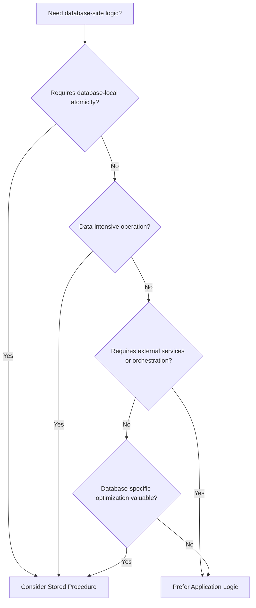
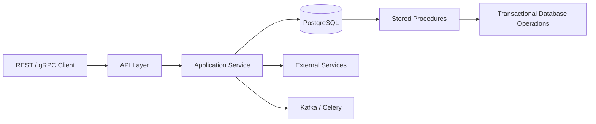

# README

## Overview

Stored procedures are database-side programs used to encapsulate operations that require procedural logic, transactional coordination, or close interaction with relational data.

They can be valuable in backend systems when logic benefits from executing close to the data, especially for atomic multi-step operations, data-intensive processing, database-enforced workflows, and reducing unnecessary application/database round trips.

They also introduce database coupling, deployment complexity, concurrency concerns, and a second execution environment that backend engineers must understand. The goal is therefore not to maximize or minimize stored procedure usage, but to make deliberate decisions about which responsibilities belong in the database.

This section progresses from stored procedure fundamentals through implementation details, parameters, control flow, transactions, error handling, architectural trade-offs, and production considerations.

## Navigation

| # | File | Description |
|---|---|---|
| 01 | [01- Stored Procedures Introduction](./01-%20Stored%20Procedures%20Introduction.md) | Purpose, characteristics, execution model, use cases, advantages, and limitations |
| 02 | [02- Stored Procedure Structure](./02-%20Stored%20Procedure%20Structure.md) | Anatomy, declaration sections, executable statements, parameters, and database-specific structure |
| 03 | [03- Parameters](./03-%20Parameters.md) | Input, output, and inout parameters, parameter types, defaults, and validation |
| 04 | [04- Variables and Control Flow](./04-%20Variables%20and%20Control%20Flow.md) | Local variables, assignments, conditional execution, loops, and procedural control flow |
| 05 | [05- Conditional Logic](./05-%20Conditional%20Logic.md) | IF, ELSE, CASE, branching strategies, null handling, and conditional database operations |
| 06 | [06- Error Handling](./06-%20Error%20Handling.md) | Exceptions, error propagation, custom errors, rollback behavior, and retryable failures |
| 07 | [07- Transactions in Stored Procedures](./07-%20Transactions%20in%20Stored%20Procedures.md) | Transaction boundaries, atomicity, isolation, locking, and rollback behavior |
| 08 | [08- Stored Procedures vs Application Logic](./08-%20Stored%20Procedures%20vs%20Application%20Logic.md) | Responsibility boundaries between database-side logic and application code |
| 09 | [09- Stored Procedures vs Functions](./09-%20Stored%20Procedures%20vs%20Functions.md) | Invocation, return behavior, transaction capabilities, side effects, and use cases |
| 10 | [10- Stored Procedures vs CTEs](./10-%20Stored%20Procedures%20vs%20CTEs.md) | Choosing between procedural routines and declarative query composition |
| 11 | [11- When to Use Stored Procedures](./11-%20When%20to%20Use%20Stored%20Procedures.md) | Practical decision criteria and production scenarios |
| 12 | [12- When Not to Use Stored Procedures](./12-%20When%20Not%20to%20Use%20Stored%20Procedures.md) | Situations where application logic, queries, or other objects are a better fit |
| 13 | [13- Database Portability Considerations](./13-%20Database%20Portability%20Considerations.md) | Vendor-specific behavior, portability trade-offs, and migration implications |
| 14 | [14- Common Stored Procedure Mistakes](./14-%20Common%20Stored%20Procedure%20Mistakes.md) | Correctness, performance, security, concurrency, and operational failures |

## Stored Procedure Decision Model

A stored procedure is generally a stronger candidate when the operation is tightly coupled to database state and benefits from executing close to the data.



The decision should consider more than execution speed. Transaction ownership, concurrency, maintainability, deployment strategy, database portability, security, observability, and team expertise are equally important.

## Relationship to Application Architecture

A typical backend architecture may place orchestration in the application while allowing stored procedures to handle database-local operations.



A stored procedure should not automatically become the entire business-service layer. In a microservices architecture, application services commonly own workflow orchestration while the database provides transactional and integrity guarantees.

## Production Concerns

When stored procedures are used in production, evaluate them as executable application components rather than treating them as ordinary database configuration.

### Performance

Consider:

- Execution plans.
- Index usage.
- Rows scanned and modified.
- Lock duration.
- Transaction duration.
- Network round trips.
- Large result sets.
- Procedural loops versus set-based operations.
- Replication impact.

A procedure is not inherently faster simply because it executes inside the database. Measure the complete request path.

### Transactions and Concurrency

Stored procedures frequently perform multiple database operations within a single logical workflow. Their transaction behavior must therefore be explicit.

Review:

- Transaction ownership.
- Isolation level.
- Lock acquisition order.
- Deadlock behavior.
- Retryability.
- Idempotency.
- Rollback semantics.
- Maximum transaction duration.

Prefer atomic SQL operations when they eliminate unsafe read-then-write sequences.

### Security

Stored procedures can provide useful privilege boundaries, but they can also become privilege-escalation paths when poorly designed.

Review:

- `EXECUTE` permissions.
- Database roles.
- Ownership.
- Dynamic SQL.
- Security-definer routines.
- Object qualification.
- `search_path`.
- Sensitive data logging.

Grant callers only the privileges required for their intended operations.

### Deployment

Procedure definitions should be version-controlled and deployed through the same controlled delivery process as application code.

```text
Git
  |
  v
Migration
  |
  v
CI Validation
  |
  v
Staging
  |
  v
Production
```

Avoid manually editing production procedures because it creates configuration drift and makes rollback and auditing difficult.

For rolling deployments, design procedure changes so old and new application versions can safely coexist during the transition.

## Backend Integration

Stored procedures can be invoked from Python applications using the database driver's supported calling mechanism.

For example, an application may call a database routine through a parameterized database operation rather than constructing SQL from user input.

The application should generally own:

- HTTP request handling.
- Authentication and authorization at the service boundary.
- External API calls.
- Service-to-service orchestration.
- Background job coordination.
- API response formatting.

The database may own:

- Atomic data modifications.
- Database-local validation.
- Complex data transformations.
- High-volume relational operations.
- Operations requiring tight transactional consistency.

The boundary should be explicit rather than determined by convenience.

## Recommended Reading Order

For a first pass, read the documents in filename order:

1. [01- Stored Procedures Introduction](./01-%20Stored%20Procedures%20Introduction.md)
2. [02- Stored Procedure Structure](./02-%20Stored%20Procedure%20Structure.md)
3. [03- Parameters](./03-%20Parameters.md)
4. [04- Variables and Control Flow](./04-%20Variables%20and%20Control%20Flow.md)
5. [05- Conditional Logic](./05-%20Conditional%20Logic.md)
6. [06- Error Handling](./06-%20Error%20Handling.md)
7. [07- Transactions in Stored Procedures](./07-%20Transactions%20in%20Stored%20Procedures.md)
8. [08- Stored Procedures vs Application Logic](./08-%20Stored%20Procedures%20vs%20Application%20Logic.md)
9. [09- Stored Procedures vs Functions](./09-%20Stored%20Procedures%20vs%20Functions.md)
10. [10- Stored Procedures vs CTEs](./10-%20Stored%20Procedures%20vs%20CTEs.md)
11. [11- When to Use Stored Procedures](./11-%20When%20to%20Use%20Stored%20Procedures.md)
12. [12- When Not to Use Stored Procedures](./12-%20When%20Not%20to%20Use%20Stored%20Procedures.md)
13. [13- Database Portability Considerations](./13-%20Database%20Portability%20Considerations.md)
14. [14- Common Stored Procedure Mistakes](./14-%20Common%20Stored%20Procedure%20Mistakes.md)

The sequence intentionally moves from implementation mechanics to architectural judgment and production engineering.

## Engineering Principles

Keep these principles in mind while working through the section:

- **Database locality matters:** operations that require large amounts of relational data processing can benefit from executing close to the data.
- **Atomicity matters more than location:** put logic where the required consistency guarantees can be enforced reliably.
- **Procedures are interfaces:** parameters, return values, errors, permissions, and side effects form a contract with their callers.
- **Set-based SQL should be preferred:** procedural loops should have a clear justification.
- **Transaction boundaries must be deliberate:** unclear ownership creates correctness and concurrency problems.
- **Security boundaries must be explicit:** procedure execution privileges should follow least-privilege principles.
- **Database coupling is a trade-off:** PostgreSQL-specific capabilities can be valuable when PostgreSQL is an intentional platform choice.
- **Deployment is part of design:** procedure changes must be versioned, tested, migrated, and compatible with application rollout strategies.

## Key Takeaways

- **Stored procedures are most valuable for database-local, transactional, and data-intensive operations where executing logic close to the data provides a meaningful engineering advantage.**
- **Application services should generally own orchestration and external interactions, while database routines should focus on responsibilities that benefit from database guarantees and locality.**
- **Production procedures require explicit design for transactions, concurrency, security, performance, observability, and deployment compatibility.**
- **Database-specific stored procedure features create portability trade-offs that should be accepted deliberately rather than accidentally.**
- **Treat stored procedures as version-controlled production code with stable contracts, controlled permissions, automated deployment, and realistic integration testing.**