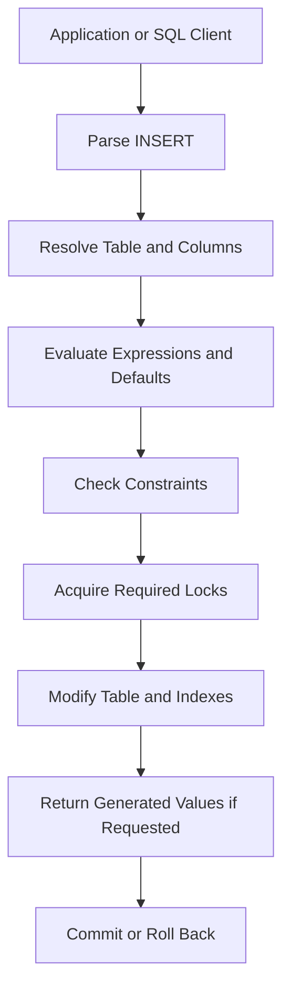

# 01- INSERT Fundamentals

## Overview

`INSERT` adds new rows to a relational table. Although the syntax is straightforward, production-grade inserts require careful consideration of column mapping, constraints, defaults, generated values, transactions, concurrency, bulk loading, and application/database boundaries.

For backend systems, `INSERT` is commonly executed through application code such as Django, SQLAlchemy, or a database driver, but the underlying database semantics remain the same. A robust implementation treats insertion as a state transition governed by the database schema rather than simply as "writing values into columns."

This document focuses on PostgreSQL syntax and behavior where database-specific details matter, while keeping the core SQL concepts broadly applicable.

## Basic INSERT Syntax

The most explicit and maintainable form specifies the target columns:

```sql
INSERT INTO users (email, display_name, status)
VALUES ('alice@example.com', 'Alice', 'active');
```

The database maps each supplied value to the corresponding column.

Prefer explicit column lists even when inserting into all currently known columns:

```sql
INSERT INTO users (email, display_name, status)
VALUES ('alice@example.com', 'Alice', 'active');
```

Avoid relying on physical table column order:

```sql
-- Fragile: depends on the table's column order.
INSERT INTO users
VALUES ('alice@example.com', 'Alice', 'active');
```

Schema changes can make positional inserts fail or, more dangerously, cause incorrect values to be assigned when assumptions about column order are no longer valid.

## How INSERT Works

A simplified execution flow is:



The database does substantially more than append a row:

1. Parse and validate the statement.
2. Resolve the target relation and columns.
3. Evaluate supplied expressions and defaults.
4. Check data types.
5. Enforce `NOT NULL`, `CHECK`, `UNIQUE`, primary-key, and foreign-key constraints.
6. Update the table storage and relevant indexes.
7. Make the change visible according to transaction semantics.
8. Commit or roll back the transaction.
9. Optionally return inserted values.

The exact storage and locking implementation varies by database engine.

## Specifying Columns Explicitly

Explicit column lists are a production best practice.

```sql
INSERT INTO orders (
    customer_id,
    total_amount,
    currency,
    status
)
VALUES (
    42,
    129.99,
    'USD',
    'pending'
);
```

This provides:

- Protection against column-order assumptions.
- Better readability.
- Safer schema evolution.
- Easier code review.
- Clear mapping between application data and database state.

The number and compatible types of values must match the specified columns.

```sql
-- Valid
INSERT INTO users (email, status)
VALUES ('alice@example.com', 'active');

-- Invalid if three columns are specified but only two values exist
INSERT INTO users (email, display_name, status)
VALUES ('alice@example.com', 'active');
```

## Data Types and Implicit Conversion

Values supplied to `INSERT` must be compatible with the target column types.

For example:

```sql
INSERT INTO products (
    name,
    price,
    quantity
)
VALUES (
    'Keyboard',
    79.99,
    10
);
```

Avoid depending unnecessarily on implicit type conversions.

Prefer expressions whose types clearly match the target schema:

```sql
INSERT INTO events (
    event_type,
    occurred_at
)
VALUES (
    'user.created',
    CURRENT_TIMESTAMP
);
```

For application-generated SQL, parameter binding should be used rather than manually interpolating values.

## NULL and DEFAULT

`NULL` represents the absence of a value; it is not equivalent to an empty string, zero, or a default value.

```sql
INSERT INTO users (email, display_name)
VALUES ('alice@example.com', NULL);
```

If a column has a default, `DEFAULT` allows the database to supply it:

```sql
INSERT INTO users (
    email,
    status
)
VALUES (
    'alice@example.com',
    DEFAULT
);
```

A column can also be omitted entirely:

```sql
INSERT INTO users (email)
VALUES ('alice@example.com');
```

If `status` has a default, the database evaluates that default.

### NULL vs DEFAULT

| Input | Meaning |
|---|---|
| Omit column | Let column default apply, if defined |
| `DEFAULT` | Explicitly request the column default |
| `NULL` | Store SQL `NULL`, if permitted |
| Literal value | Store the supplied value |

A common production mistake is assuming that `NULL` causes a column's default to be used. It does not.

## Generated and Default Values

Modern schemas commonly let the database generate values such as:

- Primary keys.
- Timestamps.
- UUIDs.
- Status values.
- Derived values.
- Audit metadata.

For example:

```sql
CREATE TABLE users (
    id BIGINT GENERATED ALWAYS AS IDENTITY PRIMARY KEY,
    email TEXT NOT NULL UNIQUE,
    created_at TIMESTAMPTZ NOT NULL DEFAULT CURRENT_TIMESTAMP,
    status TEXT NOT NULL DEFAULT 'active'
);
```

The application can then provide only business input:

```sql
INSERT INTO users (email)
VALUES ('alice@example.com');
```

This is generally preferable to manually generating database-owned identifiers or timestamps when the database is the authoritative source for those values.

## Returning Inserted Values

PostgreSQL supports `RETURNING`, which is particularly useful when the database generates values.

```sql
INSERT INTO users (email)
VALUES ('alice@example.com')
RETURNING id, email, created_at;
```

This avoids a separate query such as:

```sql
INSERT INTO users (email)
VALUES ('alice@example.com');

SELECT id
FROM users
WHERE email = 'alice@example.com';
```

The second pattern can introduce unnecessary work and can be problematic when the lookup is not guaranteed to identify exactly the row just inserted.

A backend service can therefore perform one database round trip and receive the generated identifier immediately.

## INSERT ... SELECT

`INSERT` does not require literal `VALUES`. Existing query results can be inserted directly into another table.

```sql
INSERT INTO user_audit (
    user_id,
    event_type,
    created_at
)
SELECT
    id,
    'migration.imported',
    CURRENT_TIMESTAMP
FROM users
WHERE status = 'active';
```

This is useful for:

- Data migrations.
- Materialization workflows.
- Archival operations.
- ETL-style transformations.
- Bulk data movement.
- Creating derived records.

The source query and target insert execute as part of the same statement and transaction context.

## Multi-Row INSERT

Multiple rows can be inserted in one statement:

```sql
INSERT INTO products (
    sku,
    name,
    price
)
VALUES
    ('KB-001', 'Keyboard', 79.99),
    ('MS-001', 'Mouse', 29.99),
    ('HD-001', 'Headset', 89.99);
```

This generally reduces client/server round trips compared with issuing separate statements.

However, very large `VALUES` statements can become inefficient because of:

- Large SQL payloads.
- Increased parsing overhead.
- Large transactions.
- Memory consumption.
- Longer lock duration.
- More difficult error isolation.

For large-scale ingestion, database-specific bulk-loading mechanisms such as PostgreSQL `COPY` are often more appropriate.

## INSERT and Constraints

Constraints are part of the database's correctness boundary.

Consider:

```sql
CREATE TABLE accounts (
    id BIGINT GENERATED ALWAYS AS IDENTITY PRIMARY KEY,
    email TEXT NOT NULL UNIQUE,
    balance NUMERIC(19, 4) NOT NULL CHECK (balance >= 0)
);
```

An insert must satisfy all constraints:

```sql
INSERT INTO accounts (email, balance)
VALUES ('alice@example.com', 100.00);
```

Potential failures include:

| Constraint | Example failure |
|---|---|
| `NOT NULL` | Required column receives `NULL` |
| `UNIQUE` | Duplicate email |
| Primary key | Duplicate identifier |
| Foreign key | Referenced parent does not exist |
| `CHECK` | Balance violates business invariant |
| Data type | Value cannot be represented by target type |

Constraints should enforce invariants that must remain true regardless of which application, service, script, or migration writes to the database.

## Foreign Keys

Foreign-key constraints prevent references to nonexistent parent records.

```sql
INSERT INTO orders (customer_id, total_amount)
VALUES (42, 129.99);
```

If customer `42` does not exist and the schema defines a foreign key, the insert fails.

This is important in distributed systems because application-level validation alone creates a race window:

```text
Application checks customer exists
        |
        v
Another transaction deletes customer
        |
        v
Application attempts INSERT
        |
        v
Database must enforce final integrity
```

The database constraint remains the authoritative protection.

## INSERT and Transactions

A single `INSERT` is atomic with respect to the transaction containing it.

For multiple related inserts:

```sql
BEGIN;

INSERT INTO orders (customer_id, total_amount)
VALUES (42, 129.99)
RETURNING id;

INSERT INTO order_items (order_id, product_id, quantity)
VALUES (1001, 55, 2);

COMMIT;
```

If a failure occurs and the transaction is rolled back, the transaction's changes are not committed.

In application frameworks such as Django, transaction boundaries are commonly managed by application-level transaction APIs, while the database remains responsible for enforcing atomicity.

The key engineering decision is where the transaction boundary belongs. Do not assume that each SQL statement represents an independent business transaction.

## INSERT and Concurrency

Concurrent inserts can expose race conditions when uniqueness or business rules are implemented only through application checks.

Avoid:

```text
SELECT whether email exists
        |
        v
If not, INSERT
```

Two requests can both observe that the email does not exist and then attempt to insert it.

Prefer a database uniqueness constraint:

```sql
CREATE UNIQUE INDEX users_email_unique
ON users (email);
```

Then concurrent attempts are serialized by the database's uniqueness mechanism.

For operations that need conflict-aware behavior, PostgreSQL provides `ON CONFLICT`.

```sql
INSERT INTO users (email, status)
VALUES ('alice@example.com', 'active')
ON CONFLICT (email)
DO UPDATE SET status = EXCLUDED.status
RETURNING id, email, status;
```

This can be substantially safer than implementing uniqueness through a check-then-insert sequence in application code.

## INSERT ... ON CONFLICT

PostgreSQL's `ON CONFLICT` supports common upsert patterns.

### Ignore Conflicts

```sql
INSERT INTO user_roles (user_id, role)
VALUES (42, 'admin')
ON CONFLICT (user_id, role)
DO NOTHING;
```

Use this when duplicate insertion is an expected and harmless condition.

### Update on Conflict

```sql
INSERT INTO inventory (sku, quantity)
VALUES ('KB-001', 10)
ON CONFLICT (sku)
DO UPDATE
SET quantity = inventory.quantity + EXCLUDED.quantity;
```

Here:

- `inventory.quantity` refers to the existing row.
- `EXCLUDED.quantity` refers to the attempted inserted value.

This pattern is useful for atomic counter or inventory adjustments, but its correctness depends on the business invariant and concurrency model.

## Insert Performance

For high-throughput systems, insertion cost is affected by more than the base table.

Every relevant index generally adds write work.

For example:

```text
INSERT
  |
  +--> Table storage
  |
  +--> Primary key index
  |
  +--> Unique index
  |
  +--> Secondary index
  |
  +--> Additional indexes
```

A table with many indexes can have significantly higher write amplification than a minimally indexed table.

Before adding an index, consider both:

- Read performance.
- Write cost.

Other factors include:

- Row size.
- Index count.
- Constraint checks.
- Trigger execution.
- Foreign-key checks.
- Transaction size.
- WAL generation.
- Replication throughput.
- Storage characteristics.

## Bulk INSERT Strategies

The appropriate method depends on workload size.

| Workload | Typical approach |
|---|---|
| Single business operation | Parameterized `INSERT` |
| Small batch | Multi-row `INSERT` |
| Data transformation | `INSERT ... SELECT` |
| Large PostgreSQL ingestion | `COPY` |
| Asynchronous ingestion | Queue + batch writer |
| Large migration | Staged/batched writes |

For very large datasets, avoid one enormous transaction unless there is a strong correctness requirement. Large transactions can increase WAL volume, lock duration, replication lag, vacuum pressure, and recovery time.

Batching can improve operational characteristics:

```text
Input stream
    |
    v
Batch 1 --> INSERT --> Commit
    |
    v
Batch 2 --> INSERT --> Commit
    |
    v
Batch 3 --> INSERT --> Commit
```

The correct batch size should be determined through measurement rather than a universal fixed number.

## Application Integration

Application code should use parameterized queries.

For example, with Python's DB-API style:

```python
cursor.execute(
    """
    INSERT INTO users (email, display_name)
    VALUES (%s, %s)
    RETURNING id
    """,
    (email, display_name),
)

user_id = cursor.fetchone()[0]
```

Do not construct SQL by concatenating untrusted input:

```python
# Unsafe
query = f"""
INSERT INTO users (email)
VALUES ('{email}')
"""
cursor.execute(query)
```

Parameterized queries ensure that data is treated as data rather than executable SQL.

Django's ORM and other database abstractions provide parameterization automatically for normal query operations, but raw SQL paths must still be handled carefully.

## Security Considerations

`INSERT` operations should be protected at multiple layers:

- Validate input at the API boundary.
- Use parameterized queries.
- Enforce database constraints.
- Apply least-privilege database permissions.
- Avoid exposing raw database errors directly to clients.
- Protect sensitive fields.
- Audit privileged data modifications where required.

Do not rely on application validation as the only protection for critical invariants.

A database user used by a read-only API should not have `INSERT` privileges simply because the same database contains writable tables.

## Observability

Insertion problems should be diagnosable without exposing sensitive data.

Monitor:

- Insert throughput.
- Statement latency.
- Error rates.
- Constraint violations.
- Deadlocks.
- Lock waits.
- Transaction duration.
- Replication lag.
- WAL generation.
- Database connection pool saturation.

Avoid logging complete SQL statements when they may contain sensitive information. Prefer structured metadata such as operation name, table category, latency, row count, and error classification.

## Common Mistakes

| Mistake | Why it causes problems | Better approach |
|---|---|---|
| Omitting the column list | Couples code to column order | Explicitly specify columns |
| Using string interpolation | Creates SQL injection risk | Use parameterized queries |
| Treating `NULL` as `DEFAULT` | Defaults are not applied to explicit `NULL` | Omit the column or use `DEFAULT` |
| Checking uniqueness before inserting | Creates race conditions | Use `UNIQUE` + conflict handling |
| Inserting rows one at a time | Excessive round trips | Batch where appropriate |
| Creating excessive indexes | Increases write amplification | Index according to workload |
| Using one huge transaction | Increases WAL, locks, and recovery cost | Batch when atomicity allows |
| Ignoring generated values | Causes unnecessary follow-up queries | Use `RETURNING` where supported |
| Relying only on application validation | Other writers can violate invariants | Enforce critical invariants in the database |
| Exposing raw database errors | Can leak schema or implementation details | Map errors to safe application-level responses |

## Interview Traps

### Does INSERT always append a row?

No. A statement can fail due to constraints, triggers, type errors, permissions, conflicts, or other database conditions.

### Is INSERT atomic?

A single statement is atomic within the transaction model of the database. Whether multiple statements are atomic together depends on the transaction boundary.

### Is multi-row INSERT always better?

No. It reduces round trips, but extremely large statements can create large transactions and operational pressure. Bulk-loading mechanisms may be better for very large datasets.

### Why is a UNIQUE constraint better than checking first?

Because the database can enforce uniqueness under concurrency. A separate application check is vulnerable to race conditions.

### Why use RETURNING?

It allows the database to return generated or affected values as part of the write operation, often eliminating a follow-up query.

## Production Checklist

Before shipping a significant insertion path, verify:

- [ ] Column lists are explicit.
- [ ] Inputs are parameterized.
- [ ] Required constraints exist in the database.
- [ ] Generated values are database-owned where appropriate.
- [ ] `RETURNING` is used where it avoids unnecessary reads.
- [ ] Uniqueness is enforced with database constraints.
- [ ] Conflict behavior is explicitly defined.
- [ ] Transaction boundaries match business requirements.
- [ ] Batch size has been tested for high-volume workloads.
- [ ] Index count and write amplification have been considered.
- [ ] Constraint and deadlock failures are observable.
- [ ] Database permissions follow least privilege.
- [ ] Migration and rollback behavior has been tested.
- [ ] Application error handling does not expose sensitive database details.

## Key Takeaways

- **Use explicit column lists and parameterized queries for reliable and secure `INSERT` operations.**
- **Let the database enforce critical invariants through constraints rather than relying solely on application-level validation.**
- **Use transactions, uniqueness constraints, and conflict handling deliberately when concurrent requests can modify the same logical data.**
- **Optimize high-volume inserts through batching or database-native bulk-loading mechanisms while controlling transaction size and write amplification.**
- **Treat generated values, observability, permissions, and schema evolution as part of the production design of every important insert path.**