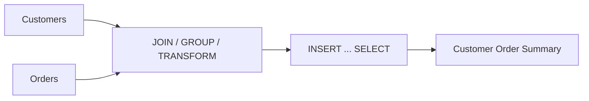

# 03- INSERT from SELECT

## Overview

`INSERT ... SELECT` inserts rows produced by a query directly into a target table. Unlike `INSERT ... VALUES`, the source data comes from another table, view, CTE, or query expression rather than being supplied entirely as literal values.

It is one of the most important SQL patterns for database-side data movement:

```sql
INSERT INTO target_table (column_a, column_b)
SELECT column_a, column_b
FROM source_table
WHERE ...;
```

The database performs the read, filtering, transformation, and write within the SQL operation. This avoids unnecessarily transferring large datasets through application code.

Common backend uses include:

- Migrating data between tables.
- Creating audit or history records.
- Populating summary tables.
- Copying records into staging tables.
- Archiving old data.
- Materializing derived data.
- Backfilling newly introduced columns or tables.
- Moving data during deployment migrations.

## Why INSERT ... SELECT Matters

Consider an application that needs to copy one million qualifying records.

An inefficient approach is:

```text
PostgreSQL
    |
    | SELECT 1,000,000 rows
    v
Application
    |
    | Transform / serialize
    v
PostgreSQL
    |
    | INSERT 1,000,000 rows
    v
Target table
```

`INSERT ... SELECT` keeps the data path inside the database:

```text
PostgreSQL
    |
    +--> Scan source
    |
    +--> Filter
    |
    +--> Transform
    |
    +--> Insert target
    |
    v
Target table
```

This can reduce:

- Network traffic.
- Application memory usage.
- Serialization/deserialization.
- Application CPU.
- Database round trips.
- Operational complexity.

The database optimizer can also choose an execution plan for the complete operation.

## Basic Syntax

```sql
INSERT INTO target_table (
    target_column_1,
    target_column_2,
    target_column_3
)
SELECT
    source_column_1,
    source_column_2,
    source_column_3
FROM source_table
WHERE condition;
```

For example:

```sql
INSERT INTO user_archive (
    user_id,
    email,
    archived_at
)
SELECT
    id,
    email,
    CURRENT_TIMESTAMP
FROM users
WHERE deleted_at IS NOT NULL;
```

The source query determines which rows are inserted.

## Column Mapping

The selected expressions map positionally to the target columns.

```sql
INSERT INTO customer_summary (
    customer_id,
    email,
    account_status
)
SELECT
    id,
    email,
    status
FROM customers;
```

The first selected expression maps to `customer_id`, the second to `email`, and the third to `account_status`.

The number of target columns and selected expressions must be compatible.

Avoid relying on implicit column ordering:

```sql
-- Fragile
INSERT INTO customer_summary
SELECT *
FROM customers;
```

Prefer explicit mappings:

```sql
INSERT INTO customer_summary (
    customer_id,
    email,
    account_status
)
SELECT
    id,
    email,
    status
FROM customers;
```

Explicit mappings make migrations safer and prevent accidental breakage when schemas evolve.

## Filtering Source Rows

`WHERE` controls which source rows are inserted.

```sql
INSERT INTO order_archive (
    order_id,
    customer_id,
    total_amount,
    archived_at
)
SELECT
    id,
    customer_id,
    total_amount,
    CURRENT_TIMESTAMP
FROM orders
WHERE status = 'completed'
  AND completed_at < CURRENT_TIMESTAMP - INTERVAL '90 days';
```

This pattern is useful for retention and archival workflows.

The source table may contain millions of rows while only a subset is inserted.

## Transforming Data

The `SELECT` portion can transform source data before insertion.

```sql
INSERT INTO user_search (
    user_id,
    search_name,
    normalized_email
)
SELECT
    id,
    LOWER(TRIM(first_name || ' ' || last_name)),
    LOWER(TRIM(email))
FROM users
WHERE deleted_at IS NULL;
```

The database performs the transformation without requiring the application to retrieve and rewrite the records.

Common transformations include:

- Type conversion.
- String normalization.
- Date calculations.
- Conditional expressions.
- Arithmetic.
- JSON extraction.
- Aggregation.
- Derived columns.

## Using Constants and Defaults

The source query can combine table columns with constant expressions.

```sql
INSERT INTO audit_events (
    user_id,
    event_type,
    source,
    created_at
)
SELECT
    id,
    'account.imported',
    'migration',
    CURRENT_TIMESTAMP
FROM users
WHERE imported_at IS NOT NULL;
```

A target column can also use its database default by omitting it from the target column list.

```sql
INSERT INTO audit_events (
    user_id,
    event_type
)
SELECT
    id,
    'account.imported'
FROM users;
```

If `created_at` has a default such as `CURRENT_TIMESTAMP`, PostgreSQL evaluates that default for the inserted rows.

## INSERT ... SELECT with JOIN

Source rows can come from multiple tables.

```sql
INSERT INTO customer_order_summary (
    customer_id,
    customer_email,
    order_count,
    total_spent
)
SELECT
    c.id,
    c.email,
    COUNT(o.id),
    COALESCE(SUM(o.total_amount), 0)
FROM customers AS c
LEFT JOIN orders AS o
    ON o.customer_id = c.id
GROUP BY
    c.id,
    c.email;
```

The source query is not restricted to a single table.

This makes `INSERT ... SELECT` particularly useful for materializing derived data.



## INSERT ... SELECT with CTEs

Complex source logic can be separated using a Common Table Expression.

```sql
WITH eligible_orders AS (
    SELECT
        id,
        customer_id,
        total_amount
    FROM orders
    WHERE status = 'completed'
      AND completed_at >= CURRENT_DATE - INTERVAL '30 days'
)
INSERT INTO monthly_order_metrics (
    order_id,
    customer_id,
    amount,
    captured_at
)
SELECT
    id,
    customer_id,
    total_amount,
    CURRENT_TIMESTAMP
FROM eligible_orders;
```

CTEs are useful when the source query requires multiple logical stages.

For more complex workflows, this can improve readability without moving processing into application code.

## INSERT ... SELECT with Aggregation

Aggregation is useful when building summary or reporting tables.

```sql
INSERT INTO daily_sales (
    sales_date,
    order_count,
    total_revenue
)
SELECT
    order_date::date,
    COUNT(*),
    SUM(total_amount)
FROM orders
WHERE status = 'completed'
GROUP BY order_date::date;
```

This pattern moves aggregation into the database.

However, summary-table designs require careful consideration of:

- Refresh strategy.
- Duplicate prevention.
- Incremental processing.
- Concurrent writers.
- Late-arriving data.
- Reprocessing.
- Transaction boundaries.

## INSERT ... SELECT with DISTINCT

`DISTINCT` can remove duplicate source rows.

```sql
INSERT INTO customer_tags (
    customer_id,
    tag
)
SELECT DISTINCT
    customer_id,
    tag
FROM imported_customer_tags;
```

This is useful when the target has uniqueness requirements.

However, `DISTINCT` should not be used as a substitute for understanding why duplicates exist.

If the target has a uniqueness invariant, enforce it with a database constraint:

```sql
CREATE UNIQUE INDEX customer_tags_unique
ON customer_tags (customer_id, tag);
```

Then choose explicit conflict semantics when duplicates are possible.

## Preventing Duplicate Inserts

Repeated execution of an `INSERT ... SELECT` can insert the same records multiple times.

For example:

```sql
INSERT INTO user_archive (
    user_id,
    email,
    archived_at
)
SELECT
    id,
    email,
    CURRENT_TIMESTAMP
FROM users
WHERE deleted_at IS NOT NULL;
```

Running this twice can create duplicate archive records unless the target schema prevents them.

A uniqueness constraint is safer:

```sql
CREATE UNIQUE INDEX user_archive_user_id_unique
ON user_archive (user_id);
```

Then PostgreSQL can handle repeated processing:

```sql
INSERT INTO user_archive (
    user_id,
    email,
    archived_at
)
SELECT
    id,
    email,
    CURRENT_TIMESTAMP
FROM users
WHERE deleted_at IS NOT NULL
ON CONFLICT (user_id)
DO NOTHING;
```

For production workflows, prefer database-enforced idempotency over application-side existence checks.

## INSERT ... SELECT with ON CONFLICT

PostgreSQL supports upsert behavior when the target has an appropriate unique constraint or index.

```sql
INSERT INTO customer_metrics (
    customer_id,
    order_count,
    total_spent
)
SELECT
    customer_id,
    COUNT(*),
    SUM(total_amount)
FROM orders
WHERE status = 'completed'
GROUP BY customer_id
ON CONFLICT (customer_id)
DO UPDATE
SET
    order_count = EXCLUDED.order_count,
    total_spent = EXCLUDED.total_spent;
```

Here:

- `EXCLUDED` represents the row proposed for insertion.
- Existing rows are updated when the unique key conflicts.

This is useful for rebuilding or incrementally refreshing derived tables.

## INSERT ... SELECT with RETURNING

PostgreSQL can return information about inserted rows.

```sql
INSERT INTO user_archive (
    user_id,
    email,
    archived_at
)
SELECT
    id,
    email,
    CURRENT_TIMESTAMP
FROM users
WHERE deleted_at IS NOT NULL
RETURNING user_id, archived_at;
```

This is useful when the application needs to know which rows were actually inserted.

It is also useful with conflict handling:

```sql
INSERT INTO customer_tags (
    customer_id,
    tag
)
SELECT DISTINCT
    customer_id,
    tag
FROM imported_customer_tags
ON CONFLICT (customer_id, tag)
DO NOTHING
RETURNING customer_id, tag;
```

Only rows actually inserted are returned.

## Transaction Behavior

`INSERT ... SELECT` is a single SQL statement and participates in the current transaction.

```sql
BEGIN;

INSERT INTO user_archive (
    user_id,
    email,
    archived_at
)
SELECT
    id,
    email,
    CURRENT_TIMESTAMP
FROM users
WHERE deleted_at IS NOT NULL;

DELETE FROM users
WHERE deleted_at IS NOT NULL;

COMMIT;
```

This pattern can provide atomic movement when the business requirement is:

```text
Copy rows
    |
    v
Verify/write archive
    |
    v
Remove source rows
```

If the transaction fails and is rolled back, both operations are rolled back.

For large archival operations, however, one enormous transaction may be operationally expensive.

## Large-Scale Data Movement

For millions or billions of rows, avoid assuming that a single statement is always optimal.

A large `INSERT ... SELECT` can generate substantial:

- WAL.
- Disk I/O.
- Lock activity.
- Index maintenance.
- Replication traffic.
- Transaction duration.
- Vacuum pressure.
- Replica lag.

A safer operational approach may be to process data in bounded batches.

For example:

```sql
INSERT INTO order_archive (
    order_id,
    customer_id,
    total_amount,
    archived_at
)
SELECT
    id,
    customer_id,
    total_amount,
    CURRENT_TIMESTAMP
FROM orders
WHERE id > 100000
  AND id <= 110000
  AND status = 'completed';
```

Keyset-style batching is generally preferable to repeatedly using large `OFFSET` values on large tables.

The exact batch size should be determined through load testing and production telemetry.

## Query Planning and Performance

`INSERT ... SELECT` performance depends heavily on the source query.

Inspect the plan with:

```sql
EXPLAIN
INSERT INTO customer_order_summary (
    customer_id,
    order_count
)
SELECT
    customer_id,
    COUNT(*)
FROM orders
GROUP BY customer_id;
```

For actual execution statistics:

```sql
EXPLAIN (ANALYZE, BUFFERS)
INSERT INTO customer_order_summary (
    customer_id,
    order_count
)
SELECT
    customer_id,
    COUNT(*)
FROM orders
GROUP BY customer_id;
```

`EXPLAIN ANALYZE` executes the statement, so do not casually run it against production tables if the statement modifies data.

A safer approach for destructive or expensive operations is to first inspect the source query independently:

```sql
EXPLAIN (ANALYZE, BUFFERS)
SELECT
    customer_id,
    COUNT(*)
FROM orders
GROUP BY customer_id;
```

Then validate the complete write operation in a controlled environment.

## Indexing the Source Query

Indexes can improve the source side of an `INSERT ... SELECT`.

For example:

```sql
INSERT INTO order_archive (
    order_id,
    customer_id,
    total_amount,
    archived_at
)
SELECT
    id,
    customer_id,
    total_amount,
    CURRENT_TIMESTAMP
FROM orders
WHERE status = 'completed'
  AND completed_at < CURRENT_TIMESTAMP - INTERVAL '90 days';
```

An appropriate index may help PostgreSQL locate qualifying rows efficiently:

```sql
CREATE INDEX orders_archive_candidates_idx
ON orders (completed_at, id)
WHERE status = 'completed';
```

However, indexes also have maintenance cost. Do not add indexes solely because an `INSERT ... SELECT` exists; validate the execution plan and broader workload.

## Target-Side Write Cost

Optimizing the source query is only half of the problem.

Every target row may require updates to:

- Table storage.
- Primary-key indexes.
- Unique indexes.
- Secondary indexes.
- Foreign-key relationships.
- Triggers.
- WAL.

For write-heavy targets, excessive indexes can become a significant bottleneck.

A useful mental model is:

```text
Source query cost
        +
Target row write cost
        +
Index maintenance
        +
Constraint checks
        +
Trigger execution
        +
WAL / replication
        =
Total operation cost
```

## Foreign Keys and Constraints

`INSERT ... SELECT` does not bypass normal database constraints.

```sql
INSERT INTO order_items (
    order_id,
    product_id,
    quantity
)
SELECT
    legacy_order_id,
    product_id,
    quantity
FROM legacy_order_items;
```

If `order_id` references `orders(id)`, every inserted value must satisfy the foreign-key constraint.

For migrations, validate referential integrity before attempting the final write.

Do not disable constraints merely to make a migration complete faster unless the migration procedure explicitly controls integrity and includes a safe validation/recovery strategy.

## Trigger Behavior

Triggers can execute as part of the insert.

For example, a target table might have an audit trigger:

```text
INSERT ... SELECT
       |
       v
Target row inserted
       |
       v
AFTER INSERT trigger
       |
       v
Audit row written
```

This means the apparent cost of an `INSERT ... SELECT` may be significantly higher than the source query alone suggests.

Before running a large migration or backfill, identify:

- `BEFORE INSERT` triggers.
- `AFTER INSERT` triggers.
- Row-level triggers.
- Statement-level triggers.
- Cascading operations.

A million-row backfill can therefore trigger a million row-level operations.

## Concurrency Considerations

An `INSERT ... SELECT` reads from source tables while writing to the target.

Concurrent modifications can affect which rows are selected depending on the transaction isolation level and timing.

For example:

```text
Transaction A
    |
    | INSERT ... SELECT
    |-------------------->
    |
Transaction B
    |
    | modifies source rows
    |
    +-------------------->
```

At PostgreSQL's default `READ COMMITTED` isolation, each statement operates using a snapshot established for that statement. More complex workflows may require explicit transaction design and isolation choices.

Do not assume that a long-running migration sees a continuously changing source table in one static state unless the transaction semantics guarantee that behavior.

## Data Migration Pattern

`INSERT ... SELECT` is frequently used during schema migrations.

Suppose a system introduces a dedicated profile table:

```sql
CREATE TABLE user_profiles (
    user_id BIGINT PRIMARY KEY REFERENCES users(id),
    display_name TEXT,
    created_at TIMESTAMPTZ NOT NULL DEFAULT CURRENT_TIMESTAMP
);
```

Existing data can be backfilled:

```sql
INSERT INTO user_profiles (
    user_id,
    display_name
)
SELECT
    id,
    display_name
FROM users
WHERE display_name IS NOT NULL;
```

A production migration should consider:

- Whether the operation can run while traffic continues.
- Whether the source data can change during the backfill.
- Whether the operation is restartable.
- Whether duplicate execution is safe.
- Whether replicas can keep up.
- Whether the migration locks critical objects.
- Whether the operation needs batching.

For large production tables, use an online migration strategy rather than assuming the backfill can run as one blocking operation.

## Archive Pattern

A common archival workflow is:

```sql
BEGIN;

INSERT INTO order_archive (
    order_id,
    customer_id,
    total_amount,
    archived_at
)
SELECT
    id,
    customer_id,
    total_amount,
    CURRENT_TIMESTAMP
FROM orders
WHERE status = 'completed'
  AND completed_at < CURRENT_TIMESTAMP - INTERVAL '365 days';

DELETE FROM orders
WHERE status = 'completed'
  AND completed_at < CURRENT_TIMESTAMP - INTERVAL '365 days';

COMMIT;
```

This is only safe if the selection criteria and deletion criteria are guaranteed to refer to the exact same logical set and the transaction provides the required consistency.

For high-volume systems, a safer architecture is often:

```text
Production Table
      |
      | bounded batch
      v
Archive Table
      |
      | verification
      v
Delete Source Batch
      |
      v
Commit
```

The archive should generally have an idempotency key or unique constraint so a failed/retried batch does not create duplicate archive records.

## Application Integration

Application code should generally issue `INSERT ... SELECT` when the operation is fundamentally database-side.

For example, a Django migration may use SQL directly when ORM expressions would be unnecessarily complex:

```python
from django.db import migrations


def populate_profiles(apps, schema_editor):
    schema_editor.execute(
        """
        INSERT INTO user_profiles (user_id, display_name)
        SELECT id, display_name
        FROM users
        WHERE display_name IS NOT NULL
        """
    )


class Migration(migrations.Migration):
    dependencies = [
        ("accounts", "0012_create_user_profiles"),
    ]

    operations = [
        migrations.RunPython(populate_profiles),
    ]
```

For large tables, the migration should be designed around deployment safety rather than only SQL correctness.

In zero-downtime environments, consider separating:

1. Schema creation.
2. Backfill.
3. Application rollout.
4. Read-path migration.
5. Cleanup.

## Security Considerations

`INSERT ... SELECT` can move large amounts of data without application-level filtering, so database permissions become particularly important.

A database role capable of running:

```sql
INSERT INTO sensitive_target
SELECT ...
FROM sensitive_source;
```

may effectively have access to sensitive data movement even if the application never exposes that data through an API.

Apply:

- Least-privilege database roles.
- Appropriate schema permissions.
- Controlled migration credentials.
- Auditing for sensitive data movement.
- Explicit column selection.
- Parameterized predicates when values originate from users.

Avoid giving general application roles unnecessary access to migration or administrative tables.

## Common Mistakes

| Mistake | Why it happens | Better approach |
|---|---|---|
| `SELECT *` into a target table | Convenient during development | Explicit column mapping |
| Fetching rows into Python first | Familiar application pattern | Let the database perform data movement |
| No uniqueness constraint | Assuming the query runs once | Make the operation idempotent |
| Using `DISTINCT` to hide bad data | Treating symptoms instead of cause | Understand and enforce the data invariant |
| One massive production backfill | Optimizes for simplicity | Batch and monitor |
| Ignoring target indexes | Focusing only on source query | Account for write amplification |
| Ignoring triggers | Assuming insert only writes one table | Audit trigger behavior |
| Blind retries | Assuming timeout means failure | Use idempotency and conflict handling |
| Using `OFFSET` for huge batches | Easy pagination model | Prefer keyset/range batching |
| Running `EXPLAIN ANALYZE` on production writes | Forgetting that it executes the statement | Test safely and inspect source plans first |
| Disabling constraints casually | Trying to accelerate migration | Preserve integrity or use a controlled migration strategy |
| Using application memory for large copies | Not recognizing database-side processing | Use `INSERT ... SELECT` or bulk-loading tools |

## Performance and Operational Checklist

Before executing a significant `INSERT ... SELECT` in production:

- [ ] Verify the source query independently.
- [ ] Confirm target column mappings explicitly.
- [ ] Check source indexes and execution plans.
- [ ] Check target indexes and write amplification.
- [ ] Identify foreign keys and triggers.
- [ ] Define duplicate and conflict behavior.
- [ ] Make retries safe.
- [ ] Determine appropriate transaction boundaries.
- [ ] Estimate affected row count.
- [ ] Test realistic data volumes.
- [ ] Consider batching for large operations.
- [ ] Monitor database CPU and I/O.
- [ ] Monitor WAL generation and replication lag.
- [ ] Monitor lock waits and transaction duration.
- [ ] Have a rollback or recovery strategy.
- [ ] Consider application traffic occurring concurrently.
- [ ] Validate the resulting row counts and data integrity.

## Key Takeaways

- **`INSERT ... SELECT` keeps data movement inside the database, reducing network, serialization, and application-memory overhead.**
- **Use explicit target columns and carefully designed source queries; avoid fragile `SELECT *` mappings.**
- **For production backfills and archival jobs, design for idempotency, concurrency, bounded transactions, retries, and observability.**
- **Performance depends on both the source query and target-side costs such as indexes, constraints, triggers, WAL, and replication.**
- **For large-scale operations, benchmark and batch deliberately rather than assuming one massive `INSERT ... SELECT` is optimal.**