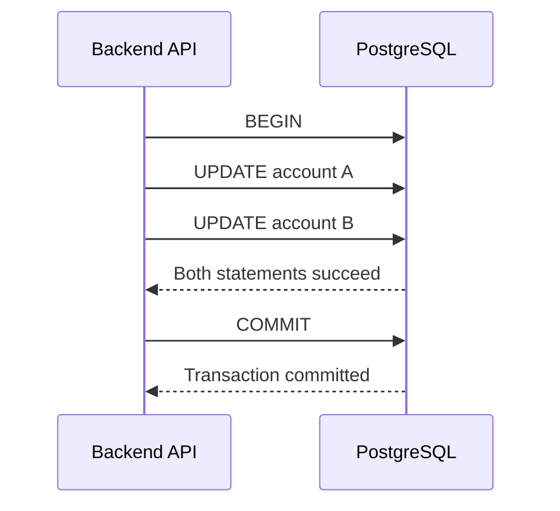

# 04- UPDATE Fundamentals

## Overview

`UPDATE` modifies existing rows in a table. It is the primary SQL operation for changing persisted state after data has already been inserted.

The basic form is:

```sql
UPDATE table_name
SET column_name = new_value
WHERE condition;
```

Unlike `INSERT`, an `UPDATE` does not create new rows. It locates rows that satisfy the `WHERE` condition and writes new versions of those rows.

For backend systems, `UPDATE` is involved in operations such as:

- Changing an order status.
- Updating user profile information.
- Recording payment state.
- Marking messages as processed.
- Updating inventory quantities.
- Maintaining denormalized counters.
- Implementing soft deletes.
- Applying data migrations and backfills.

Because `UPDATE` changes existing state, an incorrect predicate can affect far more rows than intended. In production systems, understanding row targeting, transactions, locking, indexes, concurrency, and write amplification is as important as knowing the syntax.

## Basic Syntax

```sql
UPDATE table_name
SET
    column_a = value_a,
    column_b = value_b
WHERE condition;
```

Example:

```sql
UPDATE orders
SET
    status = 'shipped',
    shipped_at = CURRENT_TIMESTAMP
WHERE id = 10042;
```

The execution conceptually consists of:

```text
Find rows matching WHERE
        |
        v
Evaluate SET expressions
        |
        v
Validate constraints
        |
        v
Write updated row versions
        |
        v
Maintain indexes / triggers / WAL
```

The `WHERE` clause determines which rows are eligible for modification.

## Why the WHERE Clause Matters

An `UPDATE` without a `WHERE` applies to every row in the target table.

```sql
-- Potentially catastrophic
UPDATE orders
SET status = 'cancelled';
```

This is syntactically valid SQL. The database has no way to infer that only one order was intended.

Prefer:

```sql
UPDATE orders
SET status = 'cancelled'
WHERE id = 10042;
```

For production operations, first validate the predicate:

```sql
SELECT id
FROM orders
WHERE id = 10042;
```

Then execute the corresponding `UPDATE`.

For larger operations, inspect the expected affected-row count before modifying data:

```sql
SELECT COUNT(*)
FROM orders
WHERE status = 'pending'
  AND expires_at < CURRENT_TIMESTAMP;
```

Then:

```sql
UPDATE orders
SET status = 'expired'
WHERE status = 'pending'
  AND expires_at < CURRENT_TIMESTAMP;
```

The predicate should be explicit about the current state as well as the desired transition when possible.

## Updating Multiple Columns

A single `UPDATE` can modify multiple columns atomically.

```sql
UPDATE users
SET
    first_name = 'Arjun',
    last_name = 'Sharma',
    updated_at = CURRENT_TIMESTAMP
WHERE id = 501;
```

This is preferable to issuing separate statements:

```sql
UPDATE users
SET first_name = 'Arjun'
WHERE id = 501;

UPDATE users
SET last_name = 'Sharma'
WHERE id = 501;
```

The single statement reduces round trips and provides a clearer atomic state transition.

## Updating from Existing Column Values

`SET` expressions can reference the current value of a column.

```sql
UPDATE products
SET stock_quantity = stock_quantity - 1
WHERE id = 42;
```

This is preferable to:

```text
SELECT stock_quantity
        |
        v
Application calculates stock - 1
        |
        v
UPDATE products SET stock_quantity = calculated_value
```

The latter introduces a race condition when multiple requests update the same row concurrently.

The database-side expression:

```sql
stock_quantity = stock_quantity - 1
```

allows the database to perform the arithmetic as part of the write operation.

## Conditional Updates

`CASE` expressions can apply different values to different rows.

```sql
UPDATE orders
SET priority =
    CASE
        WHEN total_amount >= 100000 THEN 'high'
        WHEN total_amount >= 25000 THEN 'medium'
        ELSE 'normal'
    END
WHERE status = 'pending';
```

This is useful for data migrations, backfills, and bulk state changes.

The alternative of retrieving every row into Python, calculating the value, and writing it back individually is generally less efficient for database-local transformations.

## Updating with Expressions

SQL expressions can be used directly.

```sql
UPDATE products
SET
    price = ROUND(price * 1.05, 2),
    updated_at = CURRENT_TIMESTAMP
WHERE category = 'electronics';
```

The database evaluates the expression against each qualifying row.

Common expressions include:

- Arithmetic.
- String functions.
- Date/time functions.
- `CASE`.
- `COALESCE`.
- JSON operators.
- Type casts.
- Subqueries.

## Updating NULL Values

Use `IS NULL` and `IS NOT NULL` when filtering nullable columns.

```sql
UPDATE users
SET status = 'inactive'
WHERE deleted_at IS NOT NULL;
```

Do not write:

```sql
WHERE deleted_at = NULL;
```

`NULL` represents an unknown or absent value and does not compare using normal equality operators.

To replace missing values:

```sql
UPDATE customers
SET country = 'IN'
WHERE country IS NULL;
```

## UPDATE and NULL Semantics

`COALESCE` is useful when deriving a new value from nullable columns.

```sql
UPDATE customer_profiles
SET display_name = COALESCE(display_name, email)
WHERE display_name IS NULL;
```

This updates only profiles without a display name.

Be careful when using `COALESCE` because the fallback value must satisfy the target column's business and data-quality requirements.

## Updating with a JOIN

SQL dialects differ in how they express joins in `UPDATE`.

In PostgreSQL, `UPDATE ... FROM` is commonly used:

```sql
UPDATE orders AS o
SET
    customer_tier = c.tier
FROM customers AS c
WHERE o.customer_id = c.id
  AND o.customer_tier IS DISTINCT FROM c.tier;
```

The source table supplies values used to update the target rows.

The important production concern is **source-row uniqueness**. If the join produces multiple source rows for one target row, PostgreSQL's behavior does not provide a deterministic business rule for which matching source row should supply the value.

Therefore, ensure the source relation is unique for each target row when the update requires a single value.

## Updating with a Subquery

A correlated or scalar subquery can derive a new value.

```sql
UPDATE customers AS c
SET total_spent = (
    SELECT COALESCE(SUM(o.total_amount), 0)
    FROM orders AS o
    WHERE o.customer_id = c.id
);
```

For large datasets, always inspect the execution plan. A logically correct correlated query can still be expensive depending on the optimizer, indexes, and data distribution.

Sometimes an aggregated derived table joined through `UPDATE ... FROM` is easier for the optimizer to execute efficiently.

## Updating Based on Another Table

A common backend requirement is synchronizing derived state.

```sql
UPDATE inventory AS i
SET available = (i.quantity > 0)
FROM products AS p
WHERE i.product_id = p.id
  AND p.is_active = TRUE;
```

The source table can provide conditions or values without requiring application-level data movement.

## RETURNING in PostgreSQL

PostgreSQL supports `RETURNING` to retrieve rows affected by an `UPDATE`.

```sql
UPDATE orders
SET
    status = 'shipped',
    shipped_at = CURRENT_TIMESTAMP
WHERE id = 10042
RETURNING id, status, shipped_at;
```

This is useful when an API needs the resulting database state without performing a separate `SELECT`.

It also helps distinguish what was actually modified.

For example:

```sql
UPDATE orders
SET status = 'cancelled'
WHERE id = 10042
  AND status = 'pending'
RETURNING id;
```

If no row is returned, the order was not in the expected state or did not exist.

This pattern is particularly useful for enforcing state-transition preconditions.

## Safe State Transitions

A production API should avoid blindly overwriting state when the current state matters.

Instead of:

```sql
UPDATE payments
SET status = 'captured'
WHERE id = 9001;
```

use:

```sql
UPDATE payments
SET
    status = 'captured',
    captured_at = CURRENT_TIMESTAMP
WHERE id = 9001
  AND status = 'authorized'
RETURNING id, status, captured_at;
```

This makes the state transition conditional.

The application can treat zero returned rows as:

- Payment does not exist.
- Payment is already captured.
- Payment is in an incompatible state.

The exact API response should be determined by the application's business contract.

## UPDATE and Transactions

`UPDATE` participates in transactions.

```sql
BEGIN;

UPDATE accounts
SET balance = balance - 100
WHERE id = 1;

UPDATE accounts
SET balance = balance + 100
WHERE id = 2;

COMMIT;
```

If the transaction rolls back, both updates are rolled back.

This matters for operations where multiple writes must represent one business state transition.



For financial or inventory workflows, transaction boundaries should be designed around business invariants rather than individual SQL statements.

## UPDATE and Row Locks

When a row is updated, PostgreSQL obtains the necessary row-level locking behavior to protect the modification.

For example:

```sql
UPDATE inventory
SET quantity = quantity - 1
WHERE product_id = 42
  AND quantity > 0;
```

Concurrent updates to the same row cannot simply overwrite each other as if no synchronization existed.

The database coordinates conflicting writes according to its concurrency-control and locking rules.

For more complex workflows, explicit locking may be appropriate:

```sql
BEGIN;

SELECT quantity
FROM inventory
WHERE product_id = 42
FOR UPDATE;

UPDATE inventory
SET quantity = quantity - 1
WHERE product_id = 42;

COMMIT;
```

Use explicit locks only when the business operation requires a read-modify-write sequence that cannot be safely expressed as one atomic statement.

Locks increase contention and can contribute to deadlocks when transactions acquire resources in inconsistent orders.

## Optimistic Concurrency Control

For APIs where multiple clients can modify the same entity, a version column can prevent lost updates.

Example schema:

```sql
CREATE TABLE documents (
    id BIGINT PRIMARY KEY,
    content TEXT NOT NULL,
    version BIGINT NOT NULL DEFAULT 1
);
```

Update only the version the client originally read:

```sql
UPDATE documents
SET
    content = 'new content',
    version = version + 1
WHERE id = 42
  AND version = 7
RETURNING id, version;
```

If zero rows are returned, another transaction has already modified the document.

This pattern is commonly called **optimistic locking** or **compare-and-swap** at the application level.

It is useful when:

- Conflicts are relatively uncommon.
- Holding database locks for a long workflow is undesirable.
- The application can retry or report a conflict.

## UPDATE and MVCC

PostgreSQL uses MVCC (Multi-Version Concurrency Control). An update generally creates a new row version rather than modifying the old physical version in place.

Conceptually:

```text
Old row version
      |
      | UPDATE
      v
New row version

Old version becomes obsolete
      |
      v
VACUUM eventually reclaims space
```

This has important operational implications.

Frequent updates can produce:

- Dead tuples.
- Additional table I/O.
- Index maintenance.
- WAL generation.
- Vacuum work.
- Table bloat if cleanup cannot keep up.

Therefore, `UPDATE` is not necessarily a cheap in-place byte modification.

## HOT Updates in PostgreSQL

PostgreSQL can sometimes perform a **Heap-Only Tuple (HOT)** update when indexed columns do not need new index entries and sufficient space exists on the same heap page.

For example, repeatedly updating a non-indexed `updated_at` column may be cheaper than updating an indexed column.

This does not mean `updated_at` should automatically be excluded from indexes; indexing decisions should follow query requirements.

The senior-level consideration is to understand that:

> An update's cost depends on both the row and the indexes affected by the update.

## Index Impact

Suppose a table contains:

```sql
CREATE INDEX orders_status_idx
ON orders (status);
```

An update to `status` may require index maintenance:

```sql
UPDATE orders
SET status = 'completed'
WHERE id = 10042;
```

Updating heavily indexed columns can therefore be significantly more expensive than updating non-indexed columns.

Before large updates, consider:

- Number of affected rows.
- Number of indexes.
- Index selectivity.
- WAL volume.
- Replica capacity.
- Vacuum requirements.
- Lock duration.

## WHERE Clause and Indexes

A selective predicate can make row discovery significantly faster.

For example:

```sql
UPDATE orders
SET status = 'expired'
WHERE customer_id = 12345
  AND status = 'pending';
```

An appropriate index may help locate candidates:

```sql
CREATE INDEX orders_customer_status_idx
ON orders (customer_id, status);
```

Do not create indexes solely because a column appears in an `UPDATE`. Indexes also increase write cost and storage usage.

Use `EXPLAIN` against the equivalent selection:

```sql
EXPLAIN
SELECT id
FROM orders
WHERE customer_id = 12345
  AND status = 'pending';
```

This is often a safer first step for understanding row discovery.

## Bulk UPDATE

Bulk updates are useful for controlled migrations and data maintenance.

```sql
UPDATE users
SET
    status = 'inactive',
    updated_at = CURRENT_TIMESTAMP
WHERE last_login_at < CURRENT_TIMESTAMP - INTERVAL '1 year'
  AND status = 'active';
```

A bulk update can be much more efficient than updating each row through the application.

However, a large update can generate substantial:

- WAL.
- Disk I/O.
- Replication traffic.
- Lock contention.
- Vacuum work.
- Transaction duration.

For very large tables, batching may be safer.

## Batching Large Updates

A common PostgreSQL pattern is to select a bounded set of primary keys and update those rows.

```sql
WITH batch AS (
    SELECT id
    FROM orders
    WHERE status = 'pending'
      AND expires_at < CURRENT_TIMESTAMP
    ORDER BY id
    LIMIT 5000
)
UPDATE orders AS o
SET
    status = 'expired',
    updated_at = CURRENT_TIMESTAMP
FROM batch
WHERE o.id = batch.id;
```

This allows a worker to repeat the operation until no rows remain.

The exact batch size should be chosen based on:

- Row size.
- Index structure.
- Database capacity.
- Replication lag.
- Lock contention.
- Transaction duration.

Do not blindly choose a batch size such as 1,000 or 10,000 for every workload.

## UPDATE from Application Code

Django and SQLAlchemy-style ORMs commonly provide bulk-update APIs that translate to SQL updates.

For example, Django:

```python
from django.utils import timezone

Order.objects.filter(
    status="pending",
    expires_at__lt=timezone.now(),
).update(
    status="expired",
    updated_at=timezone.now(),
)
```

This is fundamentally different from:

```python
for order in orders:
    order.status = "expired"
    order.save()
```

The loop can produce one database write per object and may trigger model-level behavior individually.

Bulk update APIs generally execute a database-side update, but ORM-specific semantics should be verified. In Django, `QuerySet.update()` performs SQL directly and does not call each model's `save()` method or emit the model's `save()` signals.

This distinction matters when application code relies on model hooks.

## UPDATE and API Request Flow

A typical backend request might look like:

```text
HTTP PATCH /orders/10042
          |
          v
Nginx / Load Balancer
          |
          v
Django / FastAPI
          |
          | Validate request
          | Authenticate / authorize
          | Validate state transition
          v
Database transaction
          |
          | UPDATE ... WHERE ...
          v
PostgreSQL
          |
          | Constraints / locks / indexes / WAL
          v
Updated row
          |
          v
API response
```

The database should enforce invariants that must remain true regardless of which service or job performs the update.

Application validation remains useful for user-facing errors, but it should not be the only protection against concurrent writes.

## Security Considerations

Never construct dynamic SQL by concatenating untrusted input.

Unsafe:

```python
query = f"""
UPDATE users
SET status = '{status}'
WHERE id = {user_id}
"""
```

Use parameterized queries:

```python
cursor.execute(
    """
    UPDATE users
    SET status = %s
    WHERE id = %s
    """,
    [status, user_id],
)
```

For dynamic identifiers such as column names, ordinary query parameters cannot be used as substitutes. Use an allowlist:

```python
allowed_columns = {
    "display_name": "display_name",
    "timezone": "timezone",
}

column = allowed_columns[user_input]
```

Then construct SQL using only the trusted allowlisted identifier.

Also apply least-privilege database permissions. A service should not have unrestricted update access merely because it can connect to the database.

## Monitoring UPDATE Operations

For production systems, monitor more than query latency.

Relevant signals include:

| Signal | Why it matters |
|---|---|
| Query latency | Detects slow updates |
| Rows affected | Detects unexpectedly broad operations |
| Lock wait time | Indicates contention |
| Transaction duration | Long transactions delay cleanup |
| WAL generation | Indicates write amplification |
| Replica lag | Shows replication pressure |
| Dead tuples | Indicates cleanup pressure |
| Table/index bloat | Shows accumulated storage overhead |
| Deadlocks | Indicates conflicting transaction behavior |
| Database CPU/I/O | Shows resource saturation |

For PostgreSQL, query-level monitoring can be supported by tools such as `pg_stat_statements`, while database metrics can be collected through your normal observability stack.

## Common Production Pitfalls

| Pitfall | Why it happens | Safer approach |
|---|---|---|
| Missing `WHERE` | Developer assumes one row implicitly | Always verify the predicate |
| Weak `WHERE` predicate | Business identity is not encoded | Include primary key or state conditions |
| Read-then-write race | Application calculates a new value from stale data | Use atomic SQL expressions or optimistic locking |
| Updating one column per query | Application code is written incrementally | Update related fields together |
| Huge single transaction | Simplicity is prioritized | Batch when operationally appropriate |
| Ignoring indexes | Focus is only on row matching | Account for index maintenance |
| Ignoring triggers | Assuming only the target row changes | Inspect trigger behavior |
| Blind retries | Timeouts are interpreted as failures | Design idempotent updates |
| No state condition | Invalid state transitions are possible | Encode transition preconditions |
| Dynamic SQL concatenation | Convenience | Parameterize values and allowlist identifiers |
| Ignoring affected-row count | Assuming the operation succeeded | Check `rowcount` or use `RETURNING` |
| Updating indexed columns frequently | Query optimization ignores write cost | Measure read benefit against write overhead |

## Common Interview Traps

### `UPDATE` Does Not Guarantee One Row

This:

```sql
UPDATE users
SET status = 'active'
WHERE email = 'user@example.com';
```

may update zero, one, or many rows unless the schema guarantees email uniqueness.

A unique constraint provides the database-level guarantee:

```sql
CREATE UNIQUE INDEX users_email_unique
ON users (email);
```

### `UPDATE` Is Not Automatically Idempotent

An update such as:

```sql
UPDATE accounts
SET balance = balance - 100
WHERE id = 1;
```

is not idempotent. Running it twice changes the balance twice.

An update that sets an absolute state can be idempotent:

```sql
UPDATE accounts
SET status = 'suspended'
WHERE id = 1;
```

Idempotency depends on the operation's semantics, not simply on the fact that it uses `UPDATE`.

### Application Transactions Are Not the Same as Database Constraints

Wrapping code in a transaction does not automatically protect business invariants if concurrent transactions can violate them.

Use an appropriate combination of:

- Transactions.
- Constraints.
- Conditional updates.
- Row locks.
- Optimistic concurrency.
- Appropriate isolation levels.

### Zero Updated Rows Can Be Meaningful

This:

```sql
UPDATE payments
SET status = 'captured'
WHERE id = 42
  AND status = 'authorized';
```

returning zero rows is not necessarily an error.

It may indicate that:

- The payment does not exist.
- It was already captured.
- It is in another state.
- Another transaction changed it first.

The application should distinguish these cases when the API contract requires it.

## Production Checklist

Before executing a significant `UPDATE`:

- [ ] Verify the `WHERE` predicate with `SELECT`.
- [ ] Confirm the expected number of affected rows.
- [ ] Check whether the predicate uses appropriate indexes.
- [ ] Confirm the update cannot affect unintended tenants or customers.
- [ ] Check foreign-key and check constraints.
- [ ] Identify triggers that may execute.
- [ ] Consider concurrent writers.
- [ ] Define state-transition conditions where appropriate.
- [ ] Make retry behavior explicit.
- [ ] Consider optimistic or pessimistic concurrency control.
- [ ] Estimate WAL and replication impact for large updates.
- [ ] Batch very large operations when appropriate.
- [ ] Monitor lock waits and transaction duration.
- [ ] Test against production-scale data.
- [ ] Have a rollback or recovery strategy for high-risk changes.
- [ ] Verify the affected rows after completion.

## Key Takeaways

- **`UPDATE` changes existing row state, and the `WHERE` clause is the primary protection against unintended mass modification.**
- **Prefer atomic database expressions and conditional state transitions over application-side read-modify-write logic.**
- **Production `UPDATE` performance depends on row discovery, indexes, MVCC, WAL, triggers, locking, and vacuum overhead—not just SQL execution time.**
- **Use transactions, constraints, row locks, or optimistic concurrency control according to the business invariant and concurrency model.**
- **For large updates, design for batching, observability, safe retries, replication impact, and recovery rather than treating the operation as a simple SQL statement.**