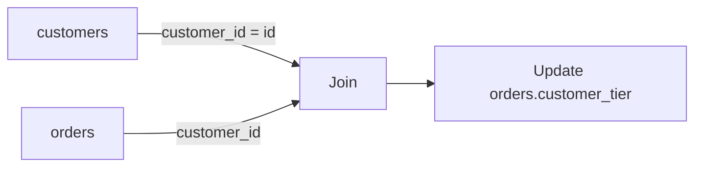

# 05- UPDATE with JOIN

## Overview

`UPDATE ... JOIN` updates rows in one table using data or conditions from another table. It is useful when the value to be written depends on related data stored elsewhere.

The exact syntax is database-specific. PostgreSQL commonly uses `UPDATE ... FROM`, while MySQL and SQL Server provide their own `JOIN`-based forms.

A typical production use case is synchronizing derived state:

```text
Source table
    |
    | JOIN
    v
Target rows
    |
    | SET derived values
    v
Updated target table
```

This technique is often preferable to retrieving source rows into Python, calculating values in application code, and issuing individual updates.

## Why UPDATE with JOIN Exists

Without a join-based update, an application might perform:

```text
SELECT source data
        |
        v
Application / Python
        |
        | Calculate updates
        v
Multiple UPDATE statements
```

This introduces additional network round trips and can create concurrency problems.

A database-side update can instead perform the operation as one SQL statement:

```text
Target table
      |
      | JOIN
      v
Source table
      |
      v
Compute new values
      |
      v
Update target rows
```

The database can optimize the join, filtering, and write operation using its query planner and indexes.

## PostgreSQL Syntax

PostgreSQL uses `FROM` rather than putting the join directly after `UPDATE`.

```sql
UPDATE target_table AS t
SET target_column = s.source_column
FROM source_table AS s
WHERE t.source_id = s.id;
```

Example:

```sql
UPDATE orders AS o
SET customer_tier = c.tier
FROM customers AS c
WHERE o.customer_id = c.id;
```

This updates `orders.customer_tier` using the corresponding `customers.tier`.

### Important PostgreSQL Detail

The target table is specified immediately after `UPDATE`:

```sql
UPDATE orders AS o
```

The source table appears in:

```sql
FROM customers AS c
```

The relationship between them is established in:

```sql
WHERE o.customer_id = c.id;
```

The `WHERE` clause therefore serves both as the join condition and as an optional filter.

For example:

```sql
UPDATE orders AS o
SET customer_tier = c.tier
FROM customers AS c
WHERE o.customer_id = c.id
  AND o.status = 'pending';
```

Only pending orders are modified.

## MySQL Syntax

MySQL commonly expresses the same operation with an explicit `JOIN`:

```sql
UPDATE orders AS o
JOIN customers AS c
    ON o.customer_id = c.id
SET o.customer_tier = c.tier
WHERE o.status = 'pending';
```

The conceptual operation is the same:

1. Match target rows to source rows.
2. Apply optional filters.
3. Evaluate the `SET` expressions.
4. Update the target rows.

## SQL Server Syntax

SQL Server commonly uses:

```sql
UPDATE o
SET o.customer_tier = c.tier
FROM orders AS o
JOIN customers AS c
    ON o.customer_id = c.id
WHERE o.status = 'pending';
```

The syntax differs from PostgreSQL and MySQL, which is one reason portable SQL should avoid relying on vendor-specific update-join syntax unless the database platform is intentionally fixed.

## Basic Example

Consider:

```sql
CREATE TABLE customers (
    id BIGINT PRIMARY KEY,
    tier TEXT NOT NULL
);

CREATE TABLE orders (
    id BIGINT PRIMARY KEY,
    customer_id BIGINT NOT NULL,
    customer_tier TEXT
);
```

Populate the derived order tier:

```sql
UPDATE orders AS o
SET customer_tier = c.tier
FROM customers AS c
WHERE o.customer_id = c.id;
```

The data flow is:



## Updating Multiple Columns

A join can supply multiple values.

```sql
UPDATE orders AS o
SET
    customer_tier = c.tier,
    customer_region = c.region,
    updated_at = CURRENT_TIMESTAMP
FROM customers AS c
WHERE o.customer_id = c.id;
```

This is generally preferable to issuing separate statements for each derived column.

The operation also keeps related values synchronized within the same database statement.

## Joining Through Multiple Tables

A PostgreSQL update can use multiple source tables.

```sql
UPDATE orders AS o
SET
    shipping_zone = z.zone_name,
    shipping_cost = z.base_cost
FROM customers AS c
JOIN shipping_zones AS z
    ON z.region = c.region
WHERE o.customer_id = c.id;
```

The logical relationship is:

```text
orders
   |
   | customer_id
   v
customers
   |
   | region
   v
shipping_zones
   |
   v
Derived shipping values
```

Use this when the target value is naturally derived from related relational data.

## Joining with Additional Conditions

Join conditions and update filters should be explicit.

```sql
UPDATE orders AS o
SET discount_percent = p.discount_percent
FROM customer_pricing AS p
WHERE o.customer_id = p.customer_id
  AND o.created_at >= p.valid_from
  AND o.created_at < COALESCE(p.valid_until, 'infinity'::timestamp)
  AND o.status = 'pending';
```

This is substantially safer than joining only on `customer_id` when multiple pricing records can exist for a customer.

The join must represent the business relationship, not merely a convenient foreign-key relationship.

## The Most Important Risk: Duplicate Source Rows

Suppose:

```text
orders
id | customer_id
---+------------
101| 42
```

and:

```text
customer_pricing
customer_id | discount
------------+---------
42          | 10
42          | 20
```

A join produces multiple source rows for the same target order.

That is dangerous because the intended business rule is ambiguous.

In PostgreSQL, when an `UPDATE ... FROM` join produces multiple matching source rows for a target row, the target row is updated once, but which matching source row supplies the values is not a deterministic business rule you should rely upon.

### Safer Approach

Make the source relation unique before performing the update.

For example, select the latest pricing record explicitly:

```sql
WITH latest_pricing AS (
    SELECT DISTINCT ON (customer_id)
        customer_id,
        discount_percent
    FROM customer_pricing
    ORDER BY customer_id, valid_from DESC, id DESC
)
UPDATE orders AS o
SET discount_percent = p.discount_percent
FROM latest_pricing AS p
WHERE o.customer_id = p.customer_id
  AND o.status = 'pending';
```

The important principle is:

> Every target row should have a well-defined source row before a join-based update is executed.

## Detecting Duplicate Matches Before UPDATE

Before executing a production update, inspect the join.

```sql
SELECT
    o.id,
    COUNT(*) AS matching_sources
FROM orders AS o
JOIN customer_pricing AS p
    ON o.customer_id = p.customer_id
WHERE o.status = 'pending'
GROUP BY o.id
HAVING COUNT(*) > 1;
```

If this returns rows, the update requires an explicit rule for choosing the source record.

This validation step is especially important during migrations and data backfills.

## Updating Only Changed Rows

Avoid rewriting rows whose values are already correct when the database supports an appropriate comparison.

PostgreSQL:

```sql
UPDATE orders AS o
SET customer_tier = c.tier
FROM customers AS c
WHERE o.customer_id = c.id
  AND o.customer_tier IS DISTINCT FROM c.tier;
```

`IS DISTINCT FROM` handles `NULL` values safely.

For example:

```text
NULL IS DISTINCT FROM 'gold'  -> TRUE
NULL IS DISTINCT FROM NULL    -> FALSE
'gold' IS DISTINCT FROM 'gold' -> FALSE
```

This can reduce unnecessary writes, WAL generation, index maintenance, and vacuum pressure.

## UPDATE with JOIN vs Correlated Subquery

Some updates can be expressed using either a join or a subquery.

Using `UPDATE ... FROM`:

```sql
UPDATE orders AS o
SET customer_tier = c.tier
FROM customers AS c
WHERE o.customer_id = c.id;
```

Using a correlated subquery:

```sql
UPDATE orders AS o
SET customer_tier = (
    SELECT c.tier
    FROM customers AS c
    WHERE c.id = o.customer_id
);
```

The join form often communicates the relational operation more directly.

However, do not assume one syntax is always faster. Query planners can transform logically equivalent queries differently depending on the database, statistics, indexes, and data distribution.

For production workloads, inspect the execution plan and measure.

## UPDATE with JOIN vs Application-Side Updates

Consider a Django application that needs to synchronize thousands of orders.

An inefficient approach might be:

```python
for order in orders:
    order.customer_tier = order.customer.tier
    order.save(update_fields=["customer_tier"])
```

This can result in many database operations.

A database-side update can perform the transformation in one statement:

```sql
UPDATE orders AS o
SET customer_tier = c.tier
FROM customers AS c
WHERE o.customer_id = c.id;
```

Advantages include:

- Fewer network round trips.
- Set-based execution.
- Better database-level optimization.
- Atomicity at the statement level.
- Less application memory usage.
- Easier execution as a migration or backfill.

However, application-level logic may still be preferable when the transformation requires complex business logic that is not naturally expressed in SQL.

## Transaction Boundaries

A join update is one statement, but large updates can still have significant transactional impact.

```sql
BEGIN;

UPDATE orders AS o
SET customer_tier = c.tier
FROM customers AS c
WHERE o.customer_id = c.id
  AND o.customer_tier IS DISTINCT FROM c.tier;

COMMIT;
```

A large single transaction may generate substantial:

- WAL.
- Locking activity.
- Replication traffic.
- Vacuum pressure.
- Transaction duration.

For a very large table, consider batching the target rows.

## Batching JOIN Updates

PostgreSQL can use a CTE to identify a bounded set of target rows:

```sql
WITH batch AS (
    SELECT o.id
    FROM orders AS o
    JOIN customers AS c
        ON c.id = o.customer_id
    WHERE o.status = 'pending'
      AND o.customer_tier IS DISTINCT FROM c.tier
    ORDER BY o.id
    LIMIT 5000
)
UPDATE orders AS o
SET customer_tier = c.tier
FROM customers AS c
JOIN batch AS b
    ON b.id = o.id
WHERE o.customer_id = c.id;
```

A worker can execute this repeatedly until no qualifying rows remain.

The batch size should be based on measured workload characteristics rather than an arbitrary universal value.

Monitor:

- Query latency.
- Lock waits.
- WAL generation.
- Replica lag.
- CPU and I/O.
- Vacuum activity.

## Indexing for UPDATE with JOIN

Join updates commonly benefit from indexes on the columns used to match rows.

For:

```sql
UPDATE orders AS o
SET customer_tier = c.tier
FROM customers AS c
WHERE o.customer_id = c.id;
```

the relevant columns are:

```text
orders.customer_id
customers.id
```

`customers.id` is normally indexed because it is the primary key.

An index on `orders.customer_id` may be useful depending on the execution plan and workload:

```sql
CREATE INDEX orders_customer_id_idx
ON orders (customer_id);
```

Do not add indexes automatically. Indexes improve some reads but increase:

- Storage usage.
- INSERT cost.
- UPDATE cost for indexed columns.
- Vacuum and maintenance work.

Use `EXPLAIN` to understand the planned access path.

## Execution Plan Analysis

For a large update, inspect the corresponding join query first:

```sql
EXPLAIN
SELECT o.id, c.tier
FROM orders AS o
JOIN customers AS c
    ON c.id = o.customer_id
WHERE o.status = 'pending';
```

For more detailed production analysis:

```sql
EXPLAIN (ANALYZE, BUFFERS)
SELECT o.id, c.tier
FROM orders AS o
JOIN customers AS c
    ON c.id = o.customer_id
WHERE o.status = 'pending';
```

`EXPLAIN ANALYZE` actually executes the query, so use it carefully against production data. For high-risk operations, validate in a staging environment or use an appropriate production-safe analysis strategy.

## Constraints and Referential Integrity

A join update does not bypass database constraints.

For example:

```sql
UPDATE orders AS o
SET customer_id = c.replacement_customer_id
FROM customer_migrations AS c
WHERE o.customer_id = c.old_customer_id;
```

If the new value violates a foreign key or another constraint, the statement can fail.

This is beneficial because database constraints remain a final enforcement layer for data integrity.

Do not assume that because the source and target tables are related, every possible derived value is valid.

## Triggers

Triggers may execute as a result of updates.

For example:

```sql
UPDATE orders AS o
SET customer_tier = c.tier
FROM customers AS c
WHERE o.customer_id = c.id;
```

may cause:

```text
UPDATE orders
      |
      v
BEFORE UPDATE trigger
      |
      v
Row modification
      |
      v
AFTER UPDATE trigger
```

Before running a large backfill, determine whether triggers:

- Write audit records.
- Publish events.
- Update denormalized tables.
- Perform additional validation.
- Generate external side effects.

Trigger behavior can dramatically increase the cost of a bulk update.

## UPDATE with JOIN and MVCC

In PostgreSQL, an update generally creates a new row version under MVCC rather than simply overwriting the existing physical row.

Therefore, a join update affecting millions of rows can create substantial database maintenance work.

Potential consequences include:

- Increased table size.
- Increased WAL.
- More replica traffic.
- Dead tuples.
- Longer vacuum cycles.
- Index maintenance.
- Increased I/O.

This is one reason a logically simple update can become an operationally significant event.

## Multi-Tenant Systems

Join updates require particular care in multi-tenant applications.

Consider:

```sql
UPDATE orders AS o
SET customer_tier = c.tier
FROM customers AS c
WHERE o.customer_id = c.id;
```

If IDs are globally unique and the schema guarantees tenant isolation, this may be sufficient.

If IDs are only unique within tenants, the join must include tenant identity:

```sql
UPDATE orders AS o
SET customer_tier = c.tier
FROM customers AS c
WHERE o.tenant_id = c.tenant_id
  AND o.customer_id = c.id;
```

Missing tenant predicates can cause cross-tenant data corruption.

The database schema should ideally encode tenant relationships through appropriate constraints rather than relying solely on application conventions.

## Security Considerations

Do not construct join predicates or values from untrusted input through string concatenation.

Unsafe:

```python
query = f"""
UPDATE orders
SET customer_tier = '{tier}'
WHERE customer_id = {customer_id}
"""
```

Use parameterized queries:

```python
cursor.execute(
    """
    UPDATE orders
    SET customer_tier = %s
    WHERE customer_id = %s
    """,
    [tier, customer_id],
)
```

For dynamic table or column identifiers, use an explicit allowlist rather than treating identifiers as ordinary values.

Also ensure the database role executing the update has only the permissions required by the service or migration.

## Production Use Cases

`UPDATE with JOIN` is particularly useful for:

| Use case | Example |
|---|---|
| Data synchronization | Copy customer attributes into orders |
| Backfills | Populate a newly added derived column |
| Data migrations | Transform records using legacy mappings |
| Denormalized state | Refresh materialized application fields |
| Status maintenance | Update records based on related entities |
| Pricing updates | Apply current pricing rules |
| Tenant migrations | Remap records using migration tables |
| Reporting preparation | Populate operational aggregates |

It is less appropriate when the transformation requires substantial domain logic, external service calls, or behavior that should remain in the application layer.

## Production Workflow

For a significant join update, use a controlled workflow.

### Validate the Source Relationship

```sql
SELECT
    o.id,
    c.id,
    c.tier
FROM orders AS o
JOIN customers AS c
    ON c.id = o.customer_id
WHERE o.status = 'pending'
LIMIT 100;
```

### Check Match Cardinality

```sql
SELECT
    o.id,
    COUNT(*) AS source_count
FROM orders AS o
JOIN customer_pricing AS p
    ON p.customer_id = o.customer_id
GROUP BY o.id
HAVING COUNT(*) > 1;
```

### Measure the Affected Rows

```sql
SELECT COUNT(*)
FROM orders AS o
JOIN customers AS c
    ON c.id = o.customer_id
WHERE o.status = 'pending'
  AND o.customer_tier IS DISTINCT FROM c.tier;
```

### Execute the Update

```sql
UPDATE orders AS o
SET customer_tier = c.tier
FROM customers AS c
WHERE o.customer_id = c.id
  AND o.status = 'pending'
  AND o.customer_tier IS DISTINCT FROM c.tier;
```

### Validate the Result

```sql
SELECT COUNT(*)
FROM orders AS o
JOIN customers AS c
    ON c.id = o.customer_id
WHERE o.status = 'pending'
  AND o.customer_tier IS DISTINCT FROM c.tier;
```

The expected result after a complete synchronization is normally zero, assuming no concurrent changes are intentionally occurring.

## Common Mistakes

| Mistake | Problem | Safer approach |
|---|---|---|
| Duplicate source rows | Source value is ambiguous | Enforce uniqueness or deduplicate explicitly |
| Missing target filter | Too many rows are modified | Validate the target predicate |
| Missing tenant condition | Cross-tenant updates | Include tenant identity where required |
| No pre-update validation | Unexpected row count | Run equivalent `SELECT` first |
| Updating unchanged rows | Unnecessary write amplification | Compare old and new values |
| Assuming syntax is portable | SQL dialect differences | Use the target DB's syntax |
| Ignoring indexes | Expensive joins | Inspect execution plans |
| Huge single transaction | WAL, locks, and replication pressure | Batch large operations |
| Ignoring triggers | Unexpected side effects | Inspect trigger definitions |
| Blind source selection | Wrong related record | Define deterministic source selection |
| Assuming one-to-one relationships | Multiple matches | Verify cardinality explicitly |
| Testing only on small data | Production plan differs | Test with production-scale characteristics |

## Interview Traps

### A JOIN Does Not Automatically Mean One Source Row

A foreign-key relationship from the target to a source table usually gives one source row for each target row, but joins against other tables may not.

Always reason about **cardinality**.

### UPDATE with JOIN Is Database-Specific

These are not interchangeable:

```sql
-- PostgreSQL
UPDATE orders AS o
SET customer_tier = c.tier
FROM customers AS c
WHERE o.customer_id = c.id;
```

```sql
-- MySQL
UPDATE orders AS o
JOIN customers AS c
    ON o.customer_id = c.id
SET o.customer_tier = c.tier;
```

The relational intent is similar, but the syntax and some behavioral details differ.

### UPDATE Is Not SELECT

A query that returns the expected rows does not automatically guarantee that the corresponding update is safe.

The `SET` expressions, triggers, constraints, concurrent transactions, and affected-row count must also be considered.

### One Statement Does Not Mean Low Operational Cost

A single SQL statement can still:

- Update millions of rows.
- Generate large WAL volumes.
- Hold locks for a long time.
- Increase replica lag.
- Trigger expensive downstream work.

Set-based SQL improves execution efficiency but does not eliminate resource constraints.

## Operational Checklist

Before executing a production-scale `UPDATE` with a join:

- [ ] Confirm the target table.
- [ ] Validate the join relationship with `SELECT`.
- [ ] Verify source-row cardinality.
- [ ] Check for duplicate source matches.
- [ ] Confirm tenant boundaries.
- [ ] Measure expected affected rows.
- [ ] Identify indexes used by the join.
- [ ] Inspect the execution plan.
- [ ] Check triggers and constraints.
- [ ] Consider concurrent writers.
- [ ] Determine whether unchanged rows can be skipped.
- [ ] Estimate WAL and replication impact.
- [ ] Decide whether batching is required.
- [ ] Test against production-scale data.
- [ ] Define rollback or recovery procedures.
- [ ] Monitor locks, latency, I/O, and replica lag during execution.
- [ ] Validate the resulting data after completion.

## Key Takeaways

- **`UPDATE` with a join performs set-based data modification using related rows, but the exact syntax is database-specific.**
- **The source relationship must be deterministic; duplicate source matches can make the resulting update ambiguous and unsafe.**
- **Validate the join and affected-row count with `SELECT` before executing a significant update, especially for migrations and backfills.**
- **Large join updates can create substantial WAL, locking, replication, MVCC, and vacuum overhead, so batching and observability may be required.**
- **Production-safe join updates account for cardinality, indexes, tenant boundaries, constraints, triggers, concurrency, and recovery—not just SQL correctness.**