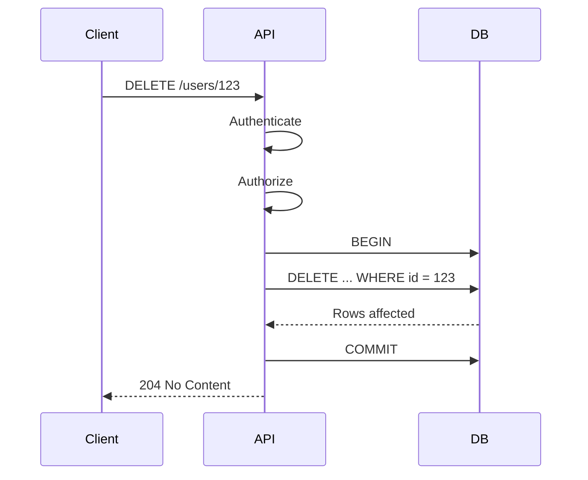
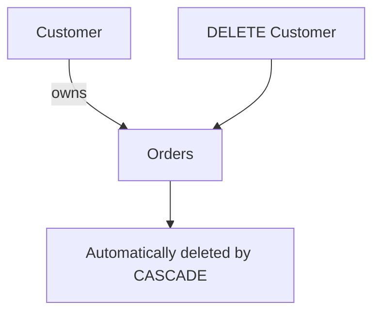
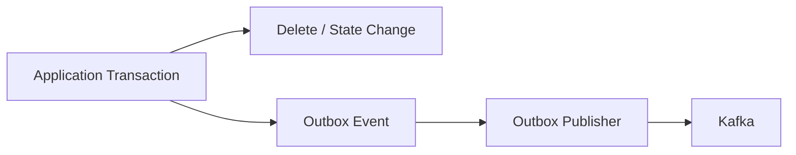

# 06- DELETE Fundamentals

## Overview

`DELETE` removes rows from a table based on a search condition. Unlike `UPDATE`, which changes existing row values, `DELETE` changes the existence of rows themselves.

The basic form is:

```sql
DELETE FROM table_name
WHERE condition;
```

For example:

```sql
DELETE FROM sessions
WHERE expires_at < CURRENT_TIMESTAMP;
```

`DELETE` is a powerful data-modification operation because an incorrect predicate can remove far more data than intended. In production systems, safe deletion therefore requires more than knowing the syntax: engineers must understand predicates, transactions, foreign keys, cascading behavior, locks, MVCC, indexing, batching, recovery, and application-level deletion policies.

## Basic DELETE Syntax

A production-safe `DELETE` normally contains an explicit `WHERE` clause:

```sql
DELETE FROM users
WHERE id = 12345;
```

The database:

1. Identifies rows matching the predicate.
2. Checks relevant constraints and triggers.
3. Locks or marks the affected rows according to the database's concurrency model.
4. Performs the deletion within the current transaction.
5. Makes the change durable when the transaction commits.

### DELETE Without WHERE

This removes every row from the table:

```sql
DELETE FROM users;
```

It is syntactically valid but dangerous.

The difference is fundamental:

| Statement | Effect |
|---|---|
| `DELETE FROM users WHERE id = 123` | Deletes matching row(s) |
| `DELETE FROM users WHERE status = 'inactive'` | Deletes all inactive rows |
| `DELETE FROM users` | Deletes every row |

Do not depend on a UI, ORM, or application layer to prevent accidental unrestricted deletes.

## Understanding the WHERE Predicate

The `WHERE` clause determines which rows are deleted.

```sql
DELETE FROM orders
WHERE status = 'cancelled'
  AND created_at < CURRENT_TIMESTAMP - INTERVAL '90 days';
```

The predicate should represent the complete business rule for deletion.

For critical operations, first execute the equivalent `SELECT`:

```sql
SELECT id
FROM orders
WHERE status = 'cancelled'
  AND created_at < CURRENT_TIMESTAMP - INTERVAL '90 days';
```

Then inspect:

- Number of rows.
- Representative records.
- Tenant boundaries.
- Related records.
- Whether the condition matches the intended business policy.

Only then execute the `DELETE`.

## DELETE by Primary Key

Deleting by a primary key is usually the simplest and safest form:

```sql
DELETE FROM users
WHERE id = 12345;
```

Because primary keys are indexed, the database can generally locate the target efficiently.

For application APIs, this commonly corresponds to an endpoint such as:

```text
DELETE /users/{id}
```

The backend should still enforce authorization and business rules before issuing the SQL statement.

A valid identifier does not imply that the caller is allowed to delete the corresponding row.

## DELETE Multiple Rows

SQL is set-oriented, so one statement can remove many rows:

```sql
DELETE FROM sessions
WHERE user_id = 12345;
```

This is usually more efficient than:

```python
for session in sessions:
    session.delete()
```

because the application does not need to issue one database request per row.

However, deleting millions of rows in a single transaction can create substantial database and replication pressure. Set-based SQL improves efficiency but does not eliminate operational limits.

## DELETE and NULL

Use `IS NULL` and `IS NOT NULL` when testing nullability:

```sql
DELETE FROM audit_records
WHERE archived_at IS NULL
  AND created_at < CURRENT_TIMESTAMP - INTERVAL '30 days';
```

Do not use:

```sql
DELETE FROM audit_records
WHERE archived_at = NULL;
```

`NULL` represents an unknown or absent value, so normal equality does not evaluate to `TRUE` for it.

## DELETE with RETURNING

PostgreSQL supports `RETURNING`, which can return deleted rows as part of the statement:

```sql
DELETE FROM sessions
WHERE expires_at < CURRENT_TIMESTAMP
RETURNING id, user_id;
```

This is useful when the application needs identifiers or metadata for the rows actually deleted.

For example:

```python
cursor.execute(
    """
    DELETE FROM sessions
    WHERE expires_at < CURRENT_TIMESTAMP
    RETURNING id, user_id
    """
)

deleted_sessions = cursor.fetchall()
```

This avoids performing a separate `SELECT` after deletion to determine what was removed.

Do not use returned rows as a substitute for authorization or precondition checks.

## DELETE Inside a Transaction

`DELETE` participates in database transactions.

```sql
BEGIN;

DELETE FROM orders
WHERE id = 1001;

-- Validate application-specific conditions.

COMMIT;
```

If something fails before commit:

```sql
ROLLBACK;
```

The exact concurrency and visibility behavior depends on the database's transaction model, but the key engineering principle is the same: perform destructive operations inside an explicitly understood transaction boundary.

For a backend request, the transaction might be controlled by Django, SQLAlchemy, or another database abstraction rather than explicit SQL `BEGIN` and `COMMIT`.

## DELETE Request Lifecycle

A typical API deletion can look like:



The database is responsible for enforcing database-level integrity, while the application is responsible for authentication, authorization, API semantics, and business-level policy.

## Checking the Affected Row Count

A deletion API should distinguish between:

- A row that was successfully deleted.
- A row that did not exist.
- A row that existed but the caller was not authorized to delete.

For example:

```sql
DELETE FROM users
WHERE id = 12345
RETURNING id;
```

The application can use the result to determine whether a row was actually deleted.

For security-sensitive APIs, be careful about exposing whether a resource exists. Some systems intentionally return the same external response for nonexistent and unauthorized resources to reduce information disclosure.

## Foreign Keys and DELETE

Foreign keys can prevent or propagate deletions.

Suppose:

```sql
CREATE TABLE customers (
    id BIGINT PRIMARY KEY
);

CREATE TABLE orders (
    id BIGINT PRIMARY KEY,
    customer_id BIGINT NOT NULL
        REFERENCES customers(id)
);
```

Deleting a customer that still has orders can fail:

```sql
DELETE FROM customers
WHERE id = 42;
```

The database rejects the operation if the foreign key uses the default restrictive behavior.

This protects referential integrity.

## ON DELETE CASCADE

A foreign key can explicitly define cascading behavior:

```sql
CREATE TABLE orders (
    id BIGINT PRIMARY KEY,
    customer_id BIGINT NOT NULL
        REFERENCES customers(id)
        ON DELETE CASCADE
);
```

Now:

```sql
DELETE FROM customers
WHERE id = 42;
```

can automatically delete related orders.

The relationship becomes:



### When CASCADE Is Appropriate

Use cascading deletes when child records have no meaningful independent lifecycle.

Typical examples include:

- Temporary session records owned by a user.
- Join-table rows.
- Dependent configuration records.
- Internal metadata that cannot exist without its parent.

### When CASCADE Is Dangerous

Avoid broad cascading behavior when child data:

- Must be retained for compliance.
- Is independently valuable.
- Is large enough to make parent deletion expensive.
- Has downstream operational consequences.
- Represents financial or audit history.

A single parent deletion can otherwise trigger a large and unexpected write operation.

## Foreign Key Actions

Common actions include:

| Action | Behavior |
|---|---|
| `NO ACTION` | Rejects the resulting invalid relationship, subject to constraint timing |
| `RESTRICT` | Rejects deletion when dependent rows exist |
| `CASCADE` | Deletes dependent rows |
| `SET NULL` | Sets the child foreign key to `NULL` |
| `SET DEFAULT` | Sets the child foreign key to its default |

The correct choice depends on ownership and lifecycle semantics, not convenience.

## DELETE vs TRUNCATE

`DELETE` and `TRUNCATE` are both destructive, but they serve different purposes.

| Property | `DELETE` | `TRUNCATE` |
|---|---|---|
| Row filtering | Yes | No ordinary row-level `WHERE` |
| Removes selected rows | Yes | No |
| Deletes all rows efficiently | Usually less efficient | Usually optimized for this use case |
| Row-level triggers | Database-dependent behavior | Different trigger semantics |
| Foreign-key behavior | Normal FK rules | More restrictive/DB-specific |
| Identity/sequence behavior | Usually preserved | Database-specific options |
| Typical use | Targeted data removal | Emptying an entire table |
| Recovery | Transactional in major DBs, subject to DB semantics | Transactional in PostgreSQL; semantics vary by DB |

Never substitute `TRUNCATE` for `DELETE` merely because both can make a table empty.

## DELETE with JOIN or Related Tables

Deleting rows based on another table is database-specific.

PostgreSQL commonly uses `USING`:

```sql
DELETE FROM orders AS o
USING customers AS c
WHERE o.customer_id = c.id
  AND c.status = 'closed'
  AND o.created_at < CURRENT_TIMESTAMP - INTERVAL '1 year';
```

This deletes old orders belonging to closed customers.

As with `UPDATE ... JOIN`, verify the relationship before executing the destructive statement.

First inspect it:

```sql
SELECT o.id
FROM orders AS o
JOIN customers AS c
    ON c.id = o.customer_id
WHERE c.status = 'closed'
  AND o.created_at < CURRENT_TIMESTAMP - INTERVAL '1 year';
```

The `SELECT` is your validation query; the `DELETE` is the destructive operation.

## DELETE Using a Subquery

A subquery can express the same business relationship:

```sql
DELETE FROM orders
WHERE customer_id IN (
    SELECT id
    FROM customers
    WHERE status = 'closed'
);
```

This can be appropriate when the relationship is naturally expressed as membership in a set.

For large operations, inspect the execution plan rather than assuming one syntax is faster than another.

## Large-Scale DELETE

Deleting millions of rows in one transaction can be operationally expensive.

Potential effects include:

- Large WAL generation.
- Replica lag.
- Long-running transactions.
- Lock contention.
- Dead tuples under MVCC.
- Increased vacuum workload.
- Increased storage and I/O pressure.
- Long recovery or replication catch-up times.

For large cleanup jobs, batch the deletion.

PostgreSQL example:

```sql
WITH batch AS (
    SELECT id
    FROM sessions
    WHERE expires_at < CURRENT_TIMESTAMP
    ORDER BY id
    LIMIT 5000
)
DELETE FROM sessions AS s
USING batch
WHERE s.id = batch.id;
```

A worker can repeatedly execute the statement until no rows remain.

The batch size should be chosen based on:

- Row size.
- Index structure.
- Database capacity.
- Replica topology.
- Acceptable lock duration.
- Background workload.

## Batching Strategy

A production cleanup worker might follow:

```text
Find bounded batch
      |
      v
Delete batch
      |
      v
Commit
      |
      v
Observe database health
      |
      v
More rows?
   /       \
 Yes       No
  |         |
  +-----> Done
```

Committing each batch limits transaction duration and reduces the amount of work that must be rolled back if a batch fails.

However, batching does not automatically eliminate contention. Each batch still acquires locks and generates database work.

## Keyset-Style Batching

For very large tables, avoid repeatedly scanning the same range when possible.

For example:

```sql
DELETE FROM events
WHERE id > 100000
  AND id <= 105000
  AND created_at < CURRENT_TIMESTAMP - INTERVAL '90 days';
```

A worker can advance through a stable indexed key range.

This can be more predictable than repeatedly finding the first `N` qualifying rows, particularly when the table and indexes are large.

The exact strategy should be validated with the database's execution plan and workload characteristics.

## Indexing DELETE Predicates

Consider:

```sql
DELETE FROM sessions
WHERE expires_at < CURRENT_TIMESTAMP;
```

If the table is large and expiration cleanup is frequent, an appropriate index on `expires_at` may reduce the amount of data the database must inspect.

```sql
CREATE INDEX sessions_expires_at_idx
ON sessions (expires_at);
```

But indexes have a write cost. Every additional index can make inserts and relevant updates more expensive and consume storage.

For production systems, use:

```sql
EXPLAIN
SELECT id
FROM sessions
WHERE expires_at < CURRENT_TIMESTAMP;
```

to understand the access path before choosing an index.

## MVCC and Physical Storage

In MVCC databases such as PostgreSQL, deleting a row does not necessarily mean its physical storage is immediately returned to the operating system.

The deleted row version remains relevant to transactions that may still need to see it. Later vacuum processing reclaims space for reuse.

A large deletion can therefore create:

```text
DELETE millions of rows
        |
        v
Many dead row versions
        |
        v
VACUUM work
        |
        v
Space becomes reusable
```

This is an important distinction between **logical deletion** and **physical storage reclamation**.

Large purge jobs should therefore be evaluated for their effect on vacuum, storage, and table/index health.

## Soft Delete vs Hard Delete

Many business systems do not physically delete records immediately.

A soft delete typically uses a column such as:

```sql
UPDATE users
SET deleted_at = CURRENT_TIMESTAMP
WHERE id = 12345;
```

Application queries then exclude deleted rows:

```sql
SELECT *
FROM users
WHERE deleted_at IS NULL;
```

### Comparison

| Approach | Advantages | Limitations |
|---|---|---|
| Hard delete | Actually removes the record | Recovery is harder; relationships may be affected |
| Soft delete | Supports recovery and historical state | Every query must respect deletion state |
| Archive | Keeps historical data separate | Adds lifecycle and operational complexity |

Soft deletion is not automatically safer. It can cause hidden records, uniqueness issues, storage growth, and accidental inclusion in queries.

Use it when the domain requires recoverability or historical retention, not merely because `DELETE` feels dangerous.

## Security and Authorization

SQL correctness does not provide application authorization.

A backend endpoint such as:

```text
DELETE /accounts/123
```

should normally perform:

1. Authentication.
2. Authorization.
3. Tenant/resource ownership validation.
4. Business-rule validation.
5. Transactional deletion or archival.
6. Audit logging where required.

The SQL itself might be:

```sql
DELETE FROM accounts
WHERE id = $1
  AND tenant_id = $2;
```

Including tenant identity in the predicate provides an additional defense against cross-tenant deletion.

Do not rely exclusively on an application-side lookup such as:

```text
SELECT account
DELETE account
```

without considering concurrent changes and tenant boundaries. Where appropriate, encode authorization boundaries directly into the data-modification predicate and database design.

## Parameterized DELETE

Never interpolate untrusted values into SQL.

Unsafe:

```python
query = f"DELETE FROM users WHERE id = {user_id}"
cursor.execute(query)
```

Use parameters:

```python
cursor.execute(
    "DELETE FROM users WHERE id = %s",
    [user_id],
)
```

Parameterized SQL protects values from being interpreted as SQL syntax.

For dynamically selected columns or tables, use a strict allowlist because identifiers generally cannot be passed as ordinary value parameters.

## Auditing Destructive Operations

Production systems may need to record:

- Who initiated the deletion.
- What resource was deleted.
- When it happened.
- Why it happened.
- Which tenant it belonged to.
- Whether the operation was automated.
- Correlation/request ID.
- Relevant before-state metadata.

For example:

```text
API request
    |
    +--> Authorization
    |
    +--> DELETE
    |
    +--> Audit event
    |
    v
Response
```

Do not assume application logs alone are sufficient for compliance-sensitive systems. Audit requirements should be designed explicitly.

## Events and External Side Effects

A database delete and an external event are not automatically atomic.

Consider:

```text
DELETE database row
        |
        X
Kafka publish fails
```

The database state and event stream can become inconsistent.

If deletion must produce a reliable event, consider an outbox pattern:



The transaction commits the database change and outbox record together. A separate publisher then delivers the event to Kafka.

This is generally more reliable than trying to coordinate an ordinary database transaction directly with an external message broker.

## DELETE and ORMs

Django and other ORMs often expose deletion APIs, but their semantics can differ from direct SQL.

For example, a framework may:

- Load objects before deletion.
- Execute cascades in application code.
- Run model-level hooks.
- Issue multiple SQL statements.
- Generate audit records.

Therefore, do not assume:

```python
Model.objects.filter(...).delete()
```

is operationally equivalent to:

```sql
DELETE FROM table
WHERE ...;
```

Understand the ORM's deletion semantics before using it for large-scale cleanup.

For bulk operations, inspect generated SQL and measure the actual database workload.

## Reliability and Recovery

Before a destructive production operation, determine what recovery means.

Possible strategies include:

- Transaction rollback before commit.
- Database backups.
- Point-in-time recovery.
- Replica-based recovery strategies.
- Soft deletion.
- Archival tables.
- Application-level audit history.

A transaction rollback only helps while the transaction remains uncommitted. Once committed, recovery generally requires another mechanism.

For high-risk deletes, validate backup and point-in-time recovery procedures rather than assuming they work because backups exist.

## Common Mistakes

| Mistake | Why it happens | Safer approach |
|---|---|---|
| Missing `WHERE` | Accidental omission | Require explicit review for unrestricted deletes |
| Wrong predicate | Business condition is incomplete | Run equivalent `SELECT` first |
| Missing tenant condition | Authorization boundary exists only in application code | Include tenant scope where appropriate |
| Ignoring foreign keys | Related data is overlooked | Inspect FK actions before deletion |
| Blind `CASCADE` | Parent-child ownership is misunderstood | Use cascade only for true dependent data |
| Deleting millions of rows at once | Set-based SQL appears inherently safe | Batch large purges |
| Ignoring MVCC | Logical delete assumed to reclaim disk immediately | Account for vacuum/storage behavior |
| No audit trail | Delete considered a simple CRUD action | Record destructive operations where required |
| ORM assumptions | ORM behavior differs from raw SQL | Inspect generated SQL and cascade semantics |
| Unparameterized values | SQL constructed through strings | Use parameterized queries |
| No recovery plan | Delete considered reversible | Validate backup/PITR or archival strategy |
| No preflight count | Query appears obviously correct | Measure affected rows first |

## Production Checklist

Before executing a significant `DELETE`:

- [ ] Confirm the target table.
- [ ] Confirm the exact `WHERE` predicate.
- [ ] Run the equivalent `SELECT`.
- [ ] Measure the expected row count.
- [ ] Inspect representative rows.
- [ ] Verify tenant boundaries.
- [ ] Check foreign keys and cascade behavior.
- [ ] Check triggers and application hooks.
- [ ] Inspect relevant indexes and the execution plan.
- [ ] Estimate WAL and replication impact.
- [ ] Determine whether batching is required.
- [ ] Check database and replica health.
- [ ] Confirm audit requirements.
- [ ] Confirm backup or recovery capability.
- [ ] Test the operation against production-scale data.
- [ ] Monitor locks, latency, I/O, and replica lag.
- [ ] Validate the result after completion.

## Interview Considerations

Senior-level DELETE questions often test more than syntax.

Be prepared to explain:

- Why `DELETE` can be expensive even with a selective predicate.
- How foreign keys affect deletion.
- When `ON DELETE CASCADE` is appropriate.
- Why large deletes can create MVCC and vacuum pressure.
- How to safely delete millions of rows.
- The difference between hard and soft deletion.
- Why authorization should be reflected in the data-modification boundary.
- How a database deletion can be reliably propagated to Kafka or another event system.
- Why an ORM bulk delete may not have the same semantics as direct SQL.
- How backups and point-in-time recovery affect destructive operations.

A strong production answer should discuss **correctness, concurrency, integrity, observability, and recovery**, not just the SQL statement.

## Key Takeaways

- **Always treat `DELETE` as a destructive operation: validate the predicate and affected-row count before executing significant deletes.**
- **Foreign keys, cascades, triggers, and application hooks can make one `DELETE` affect substantially more data than the target table suggests.**
- **Large deletes can generate significant MVCC, WAL, vacuum, locking, storage, and replication overhead; batch them when necessary.**
- **Authorization, tenant isolation, parameterized SQL, auditing, and recovery procedures are part of production-safe deletion design.**
- **Choose hard delete, soft delete, archival, or cascading behavior based on domain lifecycle and recovery requirements—not convenience.**