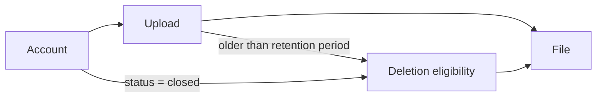
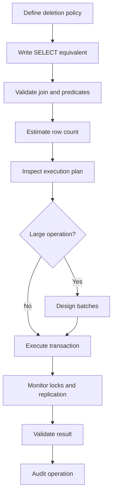

# 07- DELETE with JOIN

## Overview

`DELETE` with a join removes rows from one target table based on conditions involving another table. It is useful when deletion eligibility depends on related data rather than columns in the target table alone.

A common production example is deleting orders belonging to customers that have been deactivated:

```sql
DELETE FROM orders AS o
USING customers AS c
WHERE o.customer_id = c.id
  AND c.status = 'deactivated'
  AND o.created_at < CURRENT_TIMESTAMP - INTERVAL '2 years';
```

The important distinction is that the **join identifies which target rows qualify for deletion**. The related table is normally used as a filtering source; it is not automatically deleted unless foreign-key actions such as `ON DELETE CASCADE` cause additional effects.

`DELETE` syntax varies across database engines. PostgreSQL's `DELETE ... USING` is particularly useful for joined deletes, while MySQL and SQL Server provide different forms.

## Why DELETE with JOIN Exists

Many deletion rules are relational:

- Delete orders belonging to disabled customers.
- Delete sessions belonging to deleted users.
- Delete staging records associated with completed imports.
- Delete membership records for inactive organizations.
- Delete records whose parent satisfies a retention policy.

Without a join, the application might first retrieve related IDs:

```text
SELECT qualifying customer IDs
        |
        v
Application
        |
        v
DELETE orders WHERE customer_id IN (...)
```

A joined delete allows the database to perform the relationship evaluation as part of the data-modification operation.

This generally provides a cleaner set-based operation and avoids unnecessarily moving intermediate IDs through the application.

## Core Pattern

### PostgreSQL

PostgreSQL uses `USING` for this pattern:

```sql
DELETE FROM orders AS o
USING customers AS c
WHERE o.customer_id = c.id
  AND c.status = 'closed';
```

Conceptually:

```text
customers
    |
    | customer_id = id
    v
matching orders
    |
    v
DELETE from orders
```

Only rows from `orders` are deleted.

### MySQL

MySQL supports multi-table `DELETE` syntax. To delete only from `orders`:

```sql
DELETE o
FROM orders AS o
JOIN customers AS c
  ON c.id = o.customer_id
WHERE c.status = 'closed';
```

### SQL Server

SQL Server commonly uses the target table in the `FROM` clause:

```sql
DELETE o
FROM orders AS o
JOIN customers AS c
  ON c.id = o.customer_id
WHERE c.status = 'closed';
```

The business intent is the same, but the syntax is not portable.

## Database Syntax Comparison

| Database | Common joined-delete form | Main consideration |
|---|---|---|
| PostgreSQL | `DELETE ... USING` | Clear separation between target and source tables |
| MySQL | `DELETE target FROM ... JOIN ...` | Target alias must be specified correctly |
| SQL Server | `DELETE target FROM ... JOIN ...` | Target is explicitly referenced in `FROM` |
| SQLite | No general PostgreSQL-style joined-delete syntax | Often use `EXISTS` or a subquery |

When supporting multiple database engines, prefer portable patterns where practical rather than hiding database-specific SQL behind an abstraction that becomes difficult to maintain.

## Validate Before DELETE

A joined delete should almost always be preceded by an equivalent `SELECT`.

Suppose the intended operation is:

```sql
DELETE FROM orders AS o
USING customers AS c
WHERE o.customer_id = c.id
  AND c.status = 'closed'
  AND o.created_at < CURRENT_TIMESTAMP - INTERVAL '2 years';
```

First run:

```sql
SELECT o.id, o.customer_id, o.created_at
FROM orders AS o
JOIN customers AS c
  ON c.id = o.customer_id
WHERE c.status = 'closed'
  AND o.created_at < CURRENT_TIMESTAMP - INTERVAL '2 years';
```

Verify:

- The join relationship.
- The business predicates.
- Tenant boundaries.
- Expected row count.
- Representative records.
- Whether related data is affected.

Only after the result is validated should the destructive statement be executed.

## INNER JOIN Semantics

Most joined deletes behave conceptually like an inner join:

```sql
DELETE FROM orders AS o
USING customers AS c
WHERE o.customer_id = c.id
  AND c.status = 'inactive';
```

An order is eligible only when a matching customer exists and the customer satisfies the condition.

This is useful when the existence of the related row is itself part of the deletion rule.

## DELETE with EXISTS

Sometimes `EXISTS` expresses the intent more clearly:

```sql
DELETE FROM orders AS o
WHERE EXISTS (
    SELECT 1
    FROM customers AS c
    WHERE c.id = o.customer_id
      AND c.status = 'inactive'
);
```

This means:

> Delete an order when at least one qualifying customer exists for it.

### JOIN vs EXISTS

| Pattern | Strength |
|---|---|
| `DELETE ... USING` / joined delete | Natural when thinking in terms of a relationship |
| `DELETE ... WHERE EXISTS` | Explicitly expresses an existence condition |
| `DELETE ... WHERE IN (subquery)` | Useful for membership in a derived set |

Do not assume one form is always faster. Query planning, indexes, cardinality, constraints, and database version determine the actual execution strategy.

Use `EXPLAIN` or the database's equivalent to verify performance.

## Example: Multi-Tenant Cleanup

Consider:

```text
tenants
  |
  +-- users
        |
        +-- sessions
```

Suppose expired sessions should be removed only for tenants that have been suspended.

PostgreSQL:

```sql
DELETE FROM sessions AS s
USING users AS u
JOIN tenants AS t
  ON t.id = u.tenant_id
WHERE s.user_id = u.id
  AND t.status = 'suspended'
  AND s.expires_at < CURRENT_TIMESTAMP;
```

A production query should preserve tenant isolation explicitly.

For systems where the application already knows the tenant, adding a tenant predicate can provide another safety boundary:

```sql
DELETE FROM sessions AS s
USING users AS u
WHERE s.user_id = u.id
  AND u.tenant_id = $1
  AND s.expires_at < CURRENT_TIMESTAMP;
```

The tenant identifier must come from trusted request context, not from an untrusted arbitrary field supplied by the client.

## Duplicate Matches and Deletion Semantics

A common concern is whether multiple matching rows in the joined table cause the target row to be deleted multiple times.

Consider:

```text
orders
+----+------------+
| id | customer_id|
+----+------------+
| 10 | 5          |
+----+------------+

customer_tags
+----+------------+
| customer_id | tag       |
+-------------+-----------+
| 5           | premium   |
| 5           | verified  |
+-------------+-----------+
```

A join can produce multiple matching combinations for order `10`.

The target row is still a row in the target table, not a separate copy for every join result. The delete operation removes the qualifying target row rather than repeatedly deleting the same physical row.

Nevertheless, duplicate matches can make the query harder to reason about and can matter when the joined query is later rewritten using aggregates or other logic.

When the business rule is simply "delete if at least one related record satisfies a condition," `EXISTS` is often clearer:

```sql
DELETE FROM orders AS o
WHERE EXISTS (
    SELECT 1
    FROM customer_tags AS ct
    WHERE ct.customer_id = o.customer_id
      AND ct.tag = 'blocked'
);
```

## DELETE with Multiple Related Tables

Deletion conditions can span multiple relationships.

```sql
DELETE FROM files AS f
USING uploads AS u
JOIN accounts AS a
  ON a.id = u.account_id
WHERE f.upload_id = u.id
  AND a.status = 'closed'
  AND u.completed_at < CURRENT_TIMESTAMP - INTERVAL '1 year';
```

Before using a query like this in production, verify the complete relationship chain:



The more joins involved, the more important preflight validation becomes.

## LEFT JOIN Considerations

A `LEFT JOIN` means something different from an inner join.

For example, a business rule might be:

> Delete orders that have no corresponding customer.

A PostgreSQL `DELETE ... USING` does not directly provide the same visual syntax as a normal `LEFT JOIN`. An `EXISTS` or `NOT EXISTS` predicate is often clearer:

```sql
DELETE FROM orders AS o
WHERE NOT EXISTS (
    SELECT 1
    FROM customers AS c
    WHERE c.id = o.customer_id
);
```

This expresses the actual requirement:

> Delete the order when no customer exists with the referenced ID.

However, if a foreign key guarantees that every order references an existing customer, this condition should normally be impossible unless constraints have been disabled, data was imported outside the constraint, or the schema differs from expectations.

## Foreign Keys and Joined DELETE

A joined delete can interact with foreign-key constraints.

Suppose:

```sql
CREATE TABLE customers (
    id BIGINT PRIMARY KEY
);

CREATE TABLE orders (
    id BIGINT PRIMARY KEY,
    customer_id BIGINT NOT NULL
        REFERENCES customers(id)
);
```

Deleting orders is usually straightforward:

```sql
DELETE FROM orders AS o
USING customers AS c
WHERE o.customer_id = c.id
  AND c.status = 'closed';
```

But deleting the customer instead:

```sql
DELETE FROM customers
WHERE status = 'closed';
```

may fail if orders still reference those customers.

If the relationship uses:

```sql
ON DELETE CASCADE
```

deleting the customer can also delete the dependent orders.

Joined deletes therefore need to be considered together with the schema's referential actions.

## Triggers and Side Effects

A `DELETE` may activate database triggers.

For example:

```text
DELETE orders
     |
     +--> Foreign-key checks
     |
     +--> DELETE triggers
     |
     +--> Audit logic
     |
     +--> Index maintenance
     |
     v
Transaction
```

A query that appears to delete only one table can therefore produce additional writes or side effects.

Before executing a high-volume joined delete, inspect:

- Foreign keys.
- Cascades.
- Triggers.
- Audit mechanisms.
- Generated events.
- Replication behavior.
- Application expectations.

## Transactions

A joined delete should be treated as a transactional operation.

```sql
BEGIN;

DELETE FROM orders AS o
USING customers AS c
WHERE o.customer_id = c.id
  AND c.status = 'closed'
  AND o.created_at < CURRENT_TIMESTAMP - INTERVAL '2 years';

COMMIT;
```

If validation or another operation fails:

```sql
ROLLBACK;
```

For production cleanup jobs, the transaction boundary is particularly important.

A very large delete in one transaction can create:

- Long-running transactions.
- Large WAL/redo generation.
- Replica lag.
- Lock contention.
- MVCC cleanup pressure.
- Large rollback cost.

## Batching Large Joined Deletes

For large datasets, delete bounded batches.

PostgreSQL example:

```sql
WITH batch AS (
    SELECT o.id
    FROM orders AS o
    JOIN customers AS c
      ON c.id = o.customer_id
    WHERE c.status = 'closed'
      AND o.created_at < CURRENT_TIMESTAMP - INTERVAL '2 years'
    ORDER BY o.id
    LIMIT 5000
)
DELETE FROM orders AS o
USING batch
WHERE o.id = batch.id;
```

The worker can execute this repeatedly:

```text
Find qualifying IDs
        |
        v
Limit batch
        |
        v
DELETE batch
        |
        v
COMMIT
        |
        v
Check database health
        |
        v
More rows?
   /          \
 Yes          No
  |            |
  +----------> Done
```

Batching allows the system to control:

- Transaction duration.
- Lock duration.
- WAL generation per transaction.
- Replica lag.
- Application impact.

The batch size should be measured and tuned rather than chosen arbitrarily.

## Indexing Joined DELETE

The database needs efficient access paths for both the join and filtering predicates.

Given:

```sql
DELETE FROM orders AS o
USING customers AS c
WHERE o.customer_id = c.id
  AND c.status = 'closed'
  AND o.created_at < CURRENT_TIMESTAMP - INTERVAL '2 years';
```

Potentially useful indexes include:

```sql
CREATE INDEX orders_customer_id_idx
ON orders (customer_id);

CREATE INDEX customers_status_idx
ON customers (status);
```

A more selective or workload-specific composite index may be appropriate:

```sql
CREATE INDEX orders_customer_created_idx
ON orders (customer_id, created_at);
```

Do not add indexes solely because a column appears in the query. Indexes consume storage and increase write overhead.

Inspect the execution plan:

```sql
EXPLAIN
SELECT o.id
FROM orders AS o
JOIN customers AS c
  ON c.id = o.customer_id
WHERE c.status = 'closed'
  AND o.created_at < CURRENT_TIMESTAMP - INTERVAL '2 years';
```

For a destructive operation, it is often safer to analyze the equivalent `SELECT` first.

## Concurrency Considerations

A joined delete can race with concurrent application activity.

For example:

```text
Cleanup worker
     |
     | identifies order as eligible
     v
DELETE order
     ^
     |
Concurrent request modifies order
```

The database's isolation level and locking behavior determine the exact outcome.

Production cleanup jobs should therefore account for:

- Concurrent updates.
- Concurrent deletes.
- Long-running transactions.
- Lock waits.
- Deadlocks.
- Retry behavior.

If deletion eligibility depends on rapidly changing state, consider whether the condition should be checked again as part of the same atomic statement rather than relying on an earlier application-side query.

## Soft Delete Alternative

If data must remain recoverable, a joined `UPDATE` may be more appropriate than a hard delete:

```sql
UPDATE orders AS o
SET deleted_at = CURRENT_TIMESTAMP
FROM customers AS c
WHERE o.customer_id = c.id
  AND c.status = 'closed'
  AND o.created_at < CURRENT_TIMESTAMP - INTERVAL '2 years';
```

This preserves the row while marking it inactive.

Soft deletion introduces its own costs:

- Every relevant query must respect `deleted_at`.
- Storage continues to grow.
- Uniqueness constraints may require special handling.
- Indexes must account for active versus deleted rows.
- Retention and eventual hard deletion still need a policy.

Choose based on domain requirements rather than using soft deletion as a universal safety mechanism.

## Application and ORM Considerations

Frameworks such as Django may express related deletion through ORM operations rather than raw joined SQL.

For example:

```python
Order.objects.filter(
    customer__status="closed",
    created_at__lt=cutoff,
).delete()
```

The ORM may translate this into database operations that differ from a manually written joined delete. It may also apply framework-level cascade behavior.

For high-volume production cleanup:

- Inspect generated SQL.
- Understand ORM cascade semantics.
- Measure query count.
- Check transaction behavior.
- Test against production-scale data.
- Confirm whether model signals or hooks execute.

Do not assume that a single ORM statement necessarily produces one SQL `DELETE`.

## Security Considerations

Joined deletes can create severe authorization vulnerabilities if the relationship predicate is incomplete.

Unsafe conceptual pattern:

```sql
DELETE FROM orders AS o
USING customers AS c
WHERE o.customer_id = c.id
  AND c.status = 'closed';
```

If exposed directly through an endpoint without tenant or ownership constraints, a caller might delete records belonging to another tenant.

A safer multi-tenant predicate might be:

```sql
DELETE FROM orders AS o
USING customers AS c
WHERE o.customer_id = c.id
  AND c.tenant_id = $1
  AND o.tenant_id = $1
  AND c.status = 'closed';
```

The exact schema determines which predicates are appropriate.

Always use parameterized values:

```python
cursor.execute(
    """
    DELETE FROM orders AS o
    USING customers AS c
    WHERE o.customer_id = c.id
      AND c.tenant_id = %s
      AND o.tenant_id = %s
      AND c.status = %s
    """,
    [tenant_id, tenant_id, "closed"],
)
```

Do not construct predicates by concatenating untrusted request values.

## Observability

Large joined deletes should be observable as production workloads.

Monitor:

| Signal | Why it matters |
|---|---|
| Rows deleted | Confirms expected scope |
| Query duration | Detects performance regressions |
| Lock wait time | Identifies contention |
| Database CPU | Measures execution pressure |
| Disk I/O | Detects storage workload |
| WAL/redo generation | Indicates replication and recovery impact |
| Replica lag | Detects downstream impact |
| Transaction duration | Detects oversized batches |
| Error/deadlock rate | Indicates concurrency problems |

For scheduled cleanup jobs, record the number of rows deleted per batch and the total operation duration.

## Production Workflow

A disciplined production workflow is:



For high-risk operations, run the equivalent `SELECT` and record its expected scope before execution.

## Common Mistakes

| Mistake | Why it happens | Prevention |
|---|---|---|
| Deleting from the wrong table | Target alias is misunderstood | Make the target table explicit |
| Missing tenant predicate | Authorization exists only in application logic | Include tenant scope where appropriate |
| Wrong join condition | Relationship is misunderstood | Validate with a `SELECT` first |
| Missing business predicate | Join alone is treated as sufficient | Separate relationship and eligibility conditions |
| Ignoring foreign keys | Related data is overlooked | Inspect FK actions and cascades |
| Assuming JOIN syntax is portable | Database syntax differs | Use engine-specific syntax deliberately |
| Deleting huge volumes in one transaction | Set-based operation appears cheap | Batch and monitor |
| Ignoring indexes | Query works on development data | Analyze the production-scale execution plan |
| Ignoring triggers | Only visible SQL is considered | Inspect trigger and audit behavior |
| Using application-side ID collection | Intermediate IDs are unnecessarily transported | Prefer set-based SQL where appropriate |
| Assuming ORM `.delete()` equals raw SQL | ORM semantics differ | Inspect generated SQL and cascade behavior |
| No recovery plan | Delete is treated as routine CRUD | Validate backup/PITR or archival strategy |

## Interview Traps

### "Does the JOIN delete rows from both tables?"

No.

In a PostgreSQL statement such as:

```sql
DELETE FROM orders AS o
USING customers AS c
WHERE o.customer_id = c.id;
```

the target table is `orders`. The `customers` table provides rows used to determine eligibility.

Foreign-key cascades or triggers can cause additional effects, but those are separate mechanisms.

### "Is DELETE with JOIN always faster than a subquery?"

No.

The optimizer may transform different SQL forms into similar execution plans. Performance depends on:

- Statistics.
- Indexes.
- Cardinality.
- Join selectivity.
- Database engine.
- Data distribution.
- Query planner decisions.

Compare execution plans rather than judging performance from syntax.

### "Why run SELECT first if DELETE uses the same predicate?"

Because a destructive statement has irreversible consequences after commit. The `SELECT` allows engineers to validate:

- Target rows.
- Join correctness.
- Expected cardinality.
- Tenant scope.
- Business conditions.

It is a practical safety control, not merely a debugging step.

### "How do you delete millions of related records safely?"

Use bounded batches, appropriate indexes, explicit transaction boundaries, monitoring, and controlled retry behavior. Watch replica lag, lock contention, WAL/redo generation, and database resource utilization.

## Key Takeaways

- **A joined DELETE uses related tables to determine which rows in the target table qualify for deletion; it does not inherently delete the joined tables.**
- **Validate the equivalent SELECT before executing a destructive joined delete, especially when joins span multiple relationships or tenants.**
- **JOIN, EXISTS, and subquery forms are alternatives; choose based on clarity and verify performance with the database execution plan.**
- **Large joined deletes should be batched and monitored for locks, transaction duration, WAL/redo generation, MVCC cleanup, and replica lag.**
- **Foreign keys, cascades, triggers, ORM behavior, authorization boundaries, and recovery procedures must be considered part of the deletion design.**