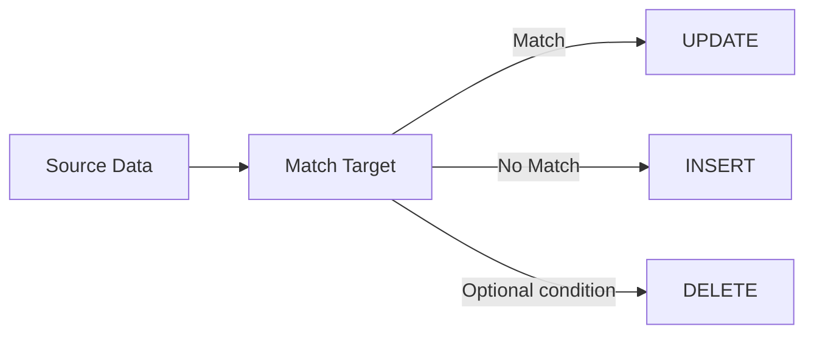
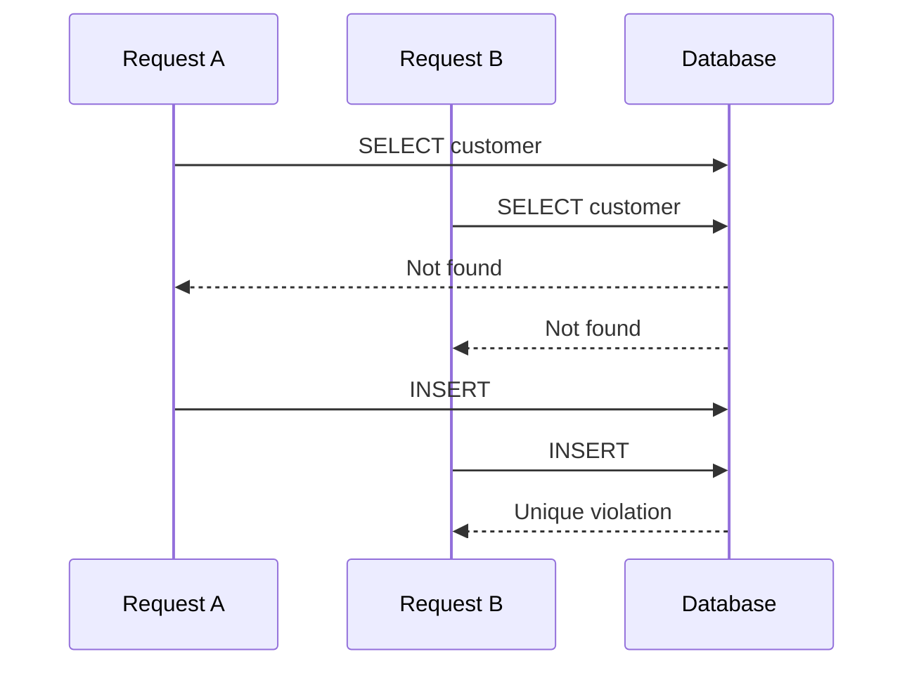

# 08- MERGE and Upsert Concepts

## Overview

`MERGE` and **upsert** patterns solve a common data-modification requirement:

> Insert a row when it does not exist; otherwise update the existing row.

This is common in backend systems that synchronize external data, process event streams, import batches, maintain materialized data, or implement idempotent writes.

The key distinction is that **upsert is a behavioral pattern**, while `MERGE` is a SQL statement that can express multiple conditional actions based on whether source rows match target rows.

Typical synchronization flow:



Different databases implement upsert differently:

| Database | Common mechanism |
|---|---|
| PostgreSQL | `INSERT ... ON CONFLICT` and `MERGE` |
| MySQL | `INSERT ... ON DUPLICATE KEY UPDATE` |
| SQL Server | `MERGE`, although many teams prefer separate `UPDATE`/`INSERT` patterns depending on workload and concurrency requirements |
| Oracle | `MERGE` |
| SQLite | `INSERT ... ON CONFLICT` |

The exact semantics, locking behavior, conflict handling, and concurrency guarantees are database-specific.

## Upsert Concept

An upsert combines two logical operations:

- **Insert** if the target row does not exist.
- **Update** if the target row already exists.

For example, suppose an application receives customer data identified by an external identifier:

```text
external_id = customer-123
name        = Alice
email       = alice@example.com
```

The desired behavior is:

```text
customer-123 exists?
       |
   +---+---+
   |       |
  Yes      No
   |       |
 UPDATE   INSERT
```

The database needs a reliable definition of "exists." This is normally provided by a `PRIMARY KEY` or `UNIQUE` constraint.

## Why the Conflict Constraint Matters

Consider:

```sql
CREATE TABLE customers (
    id BIGSERIAL PRIMARY KEY,
    external_id TEXT NOT NULL UNIQUE,
    name TEXT NOT NULL,
    email TEXT NOT NULL
);
```

The `external_id` uniqueness constraint provides the database-level invariant:

```text
One external_id -> At most one customer
```

An upsert should rely on this constraint rather than performing:

```text
SELECT -> if exists UPDATE -> else INSERT
```

from application code.

The application-side pattern has a race condition:



An atomic database upsert allows the database to resolve this conflict within the write operation.

## PostgreSQL ON CONFLICT

For PostgreSQL, the common upsert form is:

```sql
INSERT INTO customers (
    external_id,
    name,
    email
)
VALUES (
    $1,
    $2,
    $3
)
ON CONFLICT (external_id)
DO UPDATE SET
    name = EXCLUDED.name,
    email = EXCLUDED.email;
```

`EXCLUDED` represents the row that PostgreSQL attempted to insert.

Conceptually:

```text
Incoming row
     |
     v
INSERT
     |
     v
Unique constraint check
     |
 +---+---+
 |       |
No      Yes
conflict conflict
 |       |
 v       v
Insert  UPDATE
        using EXCLUDED
```

This is often the preferred PostgreSQL mechanism when the requirement is simply "insert or update based on a uniqueness conflict."

## Conditional Upsert

The update can have additional conditions.

```sql
INSERT INTO inventory (
    product_id,
    quantity,
    updated_at
)
VALUES (
    $1,
    $2,
    CURRENT_TIMESTAMP
)
ON CONFLICT (product_id)
DO UPDATE SET
    quantity = EXCLUDED.quantity,
    updated_at = CURRENT_TIMESTAMP
WHERE inventory.updated_at < EXCLUDED.updated_at;
```

This can prevent an older incoming record from overwriting newer database state.

The important engineering question is not merely:

> "Can I upsert?"

It is:

> "Under what exact condition should an existing row be replaced?"

## Idempotency

Upserts are useful for idempotent data processing.

Suppose a Kafka consumer receives:

```text
event_id = 8f3...
customer_id = 123
status = active
```

The consumer may process the same event more than once.

An appropriate uniqueness constraint can make repeated processing safe:

```sql
CREATE TABLE customer_events (
    event_id UUID PRIMARY KEY,
    customer_id BIGINT NOT NULL,
    status TEXT NOT NULL
);
```

Then:

```sql
INSERT INTO customer_events (
    event_id,
    customer_id,
    status
)
VALUES ($1, $2, $3)
ON CONFLICT (event_id)
DO NOTHING;
```

The operation becomes effectively idempotent for the `event_id`.

This is particularly useful in distributed systems because message delivery is often **at least once**, meaning duplicate delivery must be expected.

## MERGE

`MERGE` provides a more general synchronization model.

Instead of expressing only:

```text
INSERT OR UPDATE
```

it can express conditional actions based on whether source and target rows match.

Conceptually:

```sql
MERGE INTO target
USING source
ON matching_condition
WHEN MATCHED THEN
    UPDATE ...
WHEN NOT MATCHED THEN
    INSERT ...;
```

Some database systems also support additional branches such as deleting matched rows or handling source rows that do not match a target.

The exact syntax and supported clauses vary by database.

## Example MERGE

Suppose a staging table contains the latest customer information:

```sql
CREATE TABLE customer_staging (
    external_id TEXT NOT NULL,
    name TEXT NOT NULL,
    email TEXT NOT NULL
);
```

A PostgreSQL-style `MERGE` can synchronize it with the main table:

```sql
MERGE INTO customers AS target
USING customer_staging AS source
ON target.external_id = source.external_id
WHEN MATCHED THEN
    UPDATE SET
        name = source.name,
        email = source.email
WHEN NOT MATCHED THEN
    INSERT (
        external_id,
        name,
        email
    )
    VALUES (
        source.external_id,
        source.name,
        source.email
    );
```

The source acts as the input dataset, while the target is the table being synchronized.

## MERGE vs Upsert

`MERGE` and a simple upsert overlap, but they are not identical concepts.

| Requirement | Upsert | `MERGE` |
|---|---:|---:|
| Insert if missing | Yes | Yes |
| Update if matched | Yes | Yes |
| Multiple conditional branches | Limited | Strong |
| Synchronize source dataset | Possible | Natural fit |
| Delete based on source relationship | Usually separate | Supported by some engines |
| Conflict based on unique constraint | Natural | Depends on database semantics |
| Simple single-row API write | Excellent | Often unnecessary |
| Bulk synchronization | Useful | Often a better conceptual fit |

For a single-row API write, a database-specific upsert is usually simpler.

For synchronization between datasets, `MERGE` can express the business rule more directly.

## MERGE Source and Target Model

The mental model is:

```text
             SOURCE
        +----------------+
        | external_id    |
        | name           |
        | email          |
        +----------------+
                |
                | match condition
                v
             TARGET
        +----------------+
        | external_id    |
        | name           |
        | email          |
        +----------------+
                |
       +--------+--------+
       |                 |
    MATCHED           NOT MATCHED
       |                 |
       v                 v
    UPDATE             INSERT
```

The `ON` condition defines how source rows correspond to target rows.

That condition is therefore part of the data-integrity design, not just query syntax.

## Choosing the Match Key

A dangerous `MERGE` is one where the matching condition does not uniquely identify the intended target row.

Prefer stable business or natural identifiers:

```sql
ON target.external_id = source.external_id
```

rather than mutable attributes:

```sql
ON target.email = source.email
```

Email may change, may not be globally unique, and may have normalization requirements.

For multi-tenant systems, the match condition often needs tenant scope:

```sql
ON target.tenant_id = source.tenant_id
AND target.external_id = source.external_id
```

This prevents records from different tenants from being incorrectly matched.

## Source Duplicates

One of the most important `MERGE` considerations is source cardinality.

Suppose the source contains:

```text
external_id
-----------
customer-123
customer-123
```

while the target contains:

```text
external_id
-----------
customer-123
```

There is no unambiguous single source row that should update the target.

A robust synchronization pipeline should normally deduplicate the source first.

For example:

```sql
WITH ranked_source AS (
    SELECT
        external_id,
        name,
        email,
        ROW_NUMBER() OVER (
            PARTITION BY external_id
            ORDER BY updated_at DESC
        ) AS rn
    FROM customer_staging
)
SELECT
    external_id,
    name,
    email
FROM ranked_source
WHERE rn = 1;
```

The exact deduplication rule should reflect the domain's ordering semantics.

Do not arbitrarily use `DISTINCT` when two rows contain conflicting values. `DISTINCT` removes identical rows; it does not determine which conflicting version is authoritative.

## Conditional MERGE Logic

A synchronization process may need more than two outcomes.

For example:

```text
Source customer
      |
      v
Does target exist?
   /         \
 Yes          No
 |             |
 v             v
Is source      INSERT
newer?
 /    \
Yes    No
 |      |
 v      v
UPDATE Ignore
```

This makes version or timestamp fields important.

A common design is to carry:

```text
source_updated_at
version
event_id
```

and only allow newer source state to replace existing state.

This prevents out-of-order events from regressing data.

## MERGE and Concurrency

`MERGE` should not automatically be treated as a universal concurrency solution.

Concurrent operations can still interact through:

- Unique constraints.
- Locks.
- Isolation levels.
- Concurrent inserts.
- Concurrent updates.
- Trigger execution.
- Database-specific `MERGE` semantics.

For high-contention workloads, test the exact database behavior under concurrent execution.

When correctness depends on uniqueness, enforce it with a database constraint:

```sql
CREATE UNIQUE INDEX customers_external_id_uq
ON customers (external_id);
```

Application-level assumptions are not sufficient.

## Transactions

An upsert or merge is normally part of a transaction.

For example:

```sql
BEGIN;

INSERT INTO customers (
    external_id,
    name,
    email
)
VALUES ($1, $2, $3)
ON CONFLICT (external_id)
DO UPDATE SET
    name = EXCLUDED.name,
    email = EXCLUDED.email;

COMMIT;
```

If the write participates in a larger workflow, keep the transaction boundary aligned with the required consistency boundary.

Avoid unnecessarily long transactions around bulk synchronization because they can increase:

- Lock duration.
- WAL/redo generation.
- Replica lag.
- Rollback cost.
- MVCC cleanup pressure.

## Bulk Upserts

Bulk data ingestion often benefits from staging.

A common architecture is:


For large datasets, this is often easier to operate than issuing individual application-level writes.

The staging layer can provide:

- Validation.
- Deduplication.
- Transformation.
- Reprocessing.
- Auditability.
- Controlled batch execution.

## Python and Backend Integration

An API service should generally let the database enforce uniqueness and atomicity.

Using a PostgreSQL driver:

```python
sql = """
INSERT INTO customers (
    external_id,
    name,
    email
)
VALUES (%s, %s, %s)
ON CONFLICT (external_id)
DO UPDATE SET
    name = EXCLUDED.name,
    email = EXCLUDED.email
RETURNING id, external_id, name, email;
"""

cursor.execute(
    sql,
    [external_id, name, email],
)

customer = cursor.fetchone()
```

This avoids:

```python
existing = find_customer(external_id)

if existing:
    update_customer(existing.id, data)
else:
    create_customer(data)
```

The application-side version can race under concurrent requests.

The database-side upsert makes the uniqueness decision part of the write operation.

## Django Considerations

Django provides ORM APIs for conflict-aware bulk insertion and update behavior, but capabilities depend on the Django version and database backend.

For example, modern Django applications can use conflict handling with `bulk_create()` where supported:

```python
Customer.objects.bulk_create(
    customers,
    update_conflicts=True,
    update_fields=["name", "email"],
    unique_fields=["external_id"],
)
```

Before relying on ORM behavior in production, verify:

- Supported Django version.
- Database backend capabilities.
- Generated SQL.
- Unique constraints.
- Return-value behavior.
- Transaction boundaries.
- Trigger and signal expectations.

ORM abstractions should not obscure the underlying database concurrency model.

## When to Use Upsert

Use an upsert when:

- A single logical key determines whether the row already exists.
- Insert/update behavior is straightforward.
- The database supports an atomic conflict mechanism.
- API requests need idempotent writes.
- Event consumers must safely handle duplicates.
- A synchronization operation has relatively simple semantics.

Typical examples:

```text
PUT /customers/{external_id}
```

```text
Kafka event -> upsert projection
```

```text
External API -> local customer cache
```

```text
Configuration synchronization
```

## When to Use MERGE

Use `MERGE` when:

- A source dataset must be synchronized with a target.
- Matching and non-matching rows require different actions.
- Multiple conditional branches are required.
- Bulk synchronization is a first-class operation.
- The database engine's `MERGE` semantics fit the workload.

Typical examples include:

- Data warehouse synchronization.
- Staging-table ingestion.
- Batch ETL.
- Reference-data synchronization.
- Periodic external-system reconciliation.

## When Not to Use MERGE

Do not use `MERGE` simply because it can express an upsert.

For a straightforward single-row PostgreSQL operation:

```sql
INSERT ...
ON CONFLICT (...) DO UPDATE ...
```

is often easier to understand than:

```sql
MERGE INTO ...
USING ...
WHEN MATCHED ...
WHEN NOT MATCHED ...
```

The simpler operation is usually preferable when it accurately represents the business rule.

Also avoid relying on `MERGE` as a portability abstraction. Database implementations differ, and SQL generated for one engine may not transfer cleanly to another.

## Upsert vs Application-Side SELECT

| Approach | Concurrency safety | Network round trips | Typical recommendation |
|---|---|---:|---|
| `SELECT` then `INSERT/UPDATE` | Race-prone without additional locking | Multiple | Avoid for simple upsert |
| Application-side lock | Depends on lock design | Multiple | Use only when broader coordination is required |
| Atomic database upsert | Stronger | Usually one | Preferred |
| `MERGE` | Database-specific | Usually one statement | Good for dataset synchronization |

The important principle is:

> If the database owns the uniqueness constraint, let the database make the conflict decision.

## Performance Considerations

Upserts are writes, not free lookups.

Each operation may involve:

- Index lookup.
- Unique constraint checking.
- Row locking.
- Heap/table modification.
- Index maintenance.
- WAL/redo generation.
- Trigger execution.

For high-volume workloads, measure:

```text
Rows/sec
Transaction size
Lock waits
CPU
I/O
WAL/redo rate
Replica lag
```

Indexes required for conflict detection are particularly important.

For example:

```sql
CREATE UNIQUE INDEX customers_external_id_uq
ON customers (external_id);
```

Without an appropriate uniqueness mechanism, the desired upsert semantics cannot be safely enforced.

## Avoiding Unnecessary Updates

An upsert may update a row even when the incoming values are identical.

That can create unnecessary:

- Row versions.
- WAL.
- Index work.
- Trigger executions.
- Replication traffic.

PostgreSQL can condition the update:

```sql
INSERT INTO customers (
    external_id,
    name,
    email
)
VALUES ($1, $2, $3)
ON CONFLICT (external_id)
DO UPDATE SET
    name = EXCLUDED.name,
    email = EXCLUDED.email
WHERE customers.name IS DISTINCT FROM EXCLUDED.name
   OR customers.email IS DISTINCT FROM EXCLUDED.email;
```

This should be used deliberately because an update may intentionally be required for timestamps, auditing, cache invalidation, or other side effects.

## Security Considerations

Upsert and merge operations should enforce authorization and tenant boundaries.

For example, a multi-tenant uniqueness rule may require:

```sql
CREATE UNIQUE INDEX customers_tenant_external_id_uq
ON customers (tenant_id, external_id);
```

Then the upsert should use:

```sql
INSERT INTO customers (
    tenant_id,
    external_id,
    name,
    email
)
VALUES ($1, $2, $3, $4)
ON CONFLICT (tenant_id, external_id)
DO UPDATE SET
    name = EXCLUDED.name,
    email = EXCLUDED.email;
```

This prevents the same external identifier from being incorrectly treated as globally unique when it is only unique within a tenant.

Always parameterize application-supplied values.

## Observability

Production synchronization jobs should expose metrics such as:

| Metric | Purpose |
|---|---|
| Rows inserted | Detect expected ingestion |
| Rows updated | Detect synchronization volume |
| Rows skipped | Detect duplicate or stale data |
| Rows rejected | Detect validation problems |
| Execution duration | Detect performance regressions |
| Lock wait time | Detect contention |
| Deadlocks | Detect concurrency problems |
| WAL/redo volume | Estimate replication impact |
| Replica lag | Detect downstream impact |
| Source duplicate count | Detect upstream data-quality problems |

For batch synchronization, log a correlation or job identifier so that a specific source batch can be traced through validation, transformation, and database modification.

## Reliability and Recovery

Upserts can make retries safer, but they do not automatically make an entire workflow idempotent.

For example:

```text
Receive event
    |
    v
Upsert customer
    |
    v
Publish Kafka event
```

If the database commit succeeds but publishing fails, retry behavior must be designed carefully.

For reliable database-to-event workflows, consider patterns such as the **transactional outbox**:

```text
Application
    |
    +--> Customer upsert
    |
    +--> Outbox event
              |
              v
          Commit transaction
              |
              v
        Outbox publisher
              |
              v
             Kafka
```

The upsert solves one part of idempotency; the surrounding distributed workflow still needs its own consistency strategy.

## Common Mistakes

| Mistake | Why it happens | Prevention |
|---|---|---|
| `SELECT` followed by `INSERT` | Seems simpler | Use an atomic database upsert |
| No unique constraint | Application assumes uniqueness | Enforce the invariant in the database |
| Incorrect match key | Business identifier is misunderstood | Define and constrain the canonical key |
| Duplicate source rows | Staging data is assumed clean | Validate and deduplicate source data |
| Mutable field used as identity | Convenient field looks unique | Use stable identifiers |
| Missing tenant in match condition | Single-tenant thinking | Include tenant scope in key and match |
| Blindly updating every conflict | Upsert is treated as unconditional replacement | Add version/timestamp conditions where needed |
| Assuming MERGE is portable | SQL looks standardized | Verify target engine semantics |
| Ignoring concurrent writes | Query appears atomic | Test concurrency and understand locking |
| Using MERGE for simple API writes | Overengineering | Prefer the simplest correct upsert |
| Large unbounded synchronization | Bulk operation is treated as one transaction | Batch and monitor |
| Assuming upsert makes workflows idempotent | Database write is only one step | Design idempotency across the entire workflow |

## Interview Traps

### "Is upsert a SQL command?"

Not necessarily.

Upsert describes behavior: insert when absent and update when present. Different databases implement that behavior using different statements.

### "Is MERGE the same thing as upsert?"

No.

A simple upsert is one use case that `MERGE` can express. `MERGE` is more general because it can synchronize source and target datasets using multiple conditional actions.

### "Why is SELECT-then-INSERT unsafe?"

Because concurrent requests can both observe the row as absent before either inserts it.

A database-level uniqueness constraint plus an atomic upsert allows the database to resolve the race.

### "What prevents duplicate records during an upsert?"

Usually a `PRIMARY KEY` or `UNIQUE` constraint.

The SQL statement expresses the conflict behavior; the constraint establishes the invariant.

### "Does MERGE eliminate concurrency problems?"

No.

Concurrency behavior remains database-specific and depends on constraints, locking, isolation, triggers, and the exact statement semantics.

### "Why might an upsert update a row unnecessarily?"

Because the conflict branch executes an update even when values are unchanged. In high-write systems, unnecessary updates can increase WAL/redo generation, row-version churn, trigger execution, and replication traffic.

## Key Takeaways

- **Upsert describes insert-or-update behavior; `MERGE` is a broader source-to-target synchronization statement.**
- **Use database-enforced `PRIMARY KEY` or `UNIQUE` constraints as the foundation for correct and concurrent upserts.**
- **Prefer simple atomic upsert mechanisms such as PostgreSQL `INSERT ... ON CONFLICT` for straightforward single-row writes.**
- **Treat `MERGE` as a dataset-synchronization tool and carefully validate source uniqueness, match conditions, concurrency semantics, and database-specific behavior.**
- **For distributed systems, database upsert idempotency solves only the database-write problem; retries, events, and external side effects still require an end-to-end reliability design.**