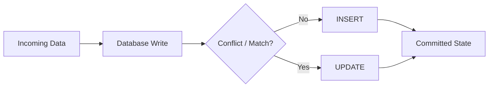
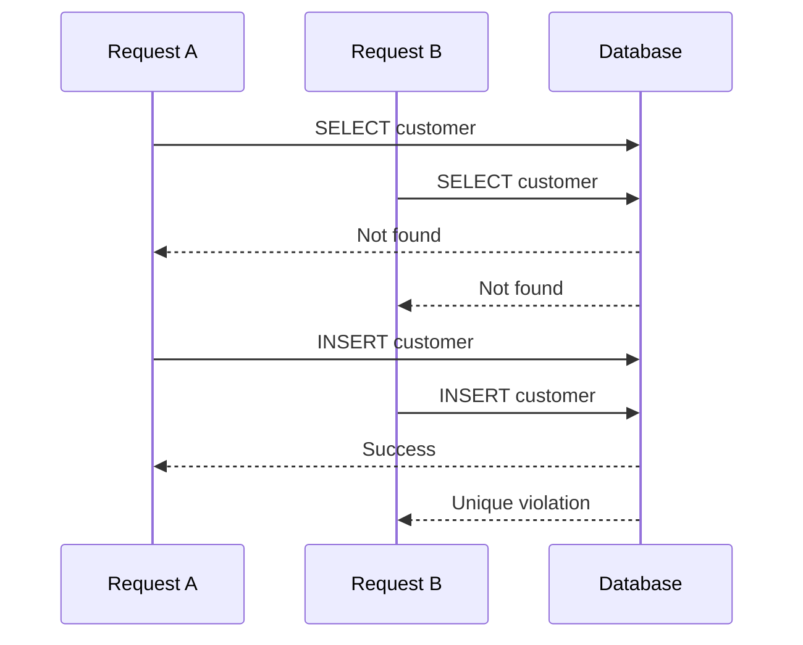
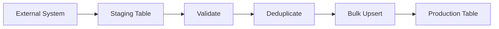
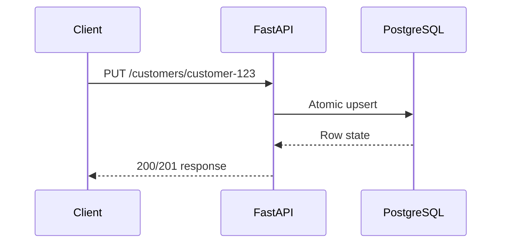
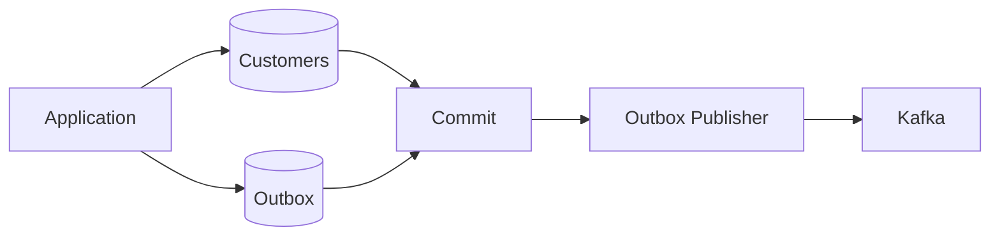

# 09- Upsert Patterns

## Overview

An **upsert** combines two write behaviors into a single logical operation:

- **Insert** a row when the target does not exist.
- **Update** the existing row when a defined conflict or match occurs.

Upserts are common in backend systems that synchronize external data, process duplicate-prone events, maintain projections, ingest batches, or implement idempotent APIs.

The important engineering principle is that an upsert should normally be backed by a database-enforced uniqueness rule. Application code should not independently decide whether a row exists and then issue a separate `INSERT` or `UPDATE` unless there is a specific reason to do so.



The exact syntax differs across database engines:

| Database | Common upsert mechanism |
|---|---|
| PostgreSQL | `INSERT ... ON CONFLICT` |
| MySQL | `INSERT ... ON DUPLICATE KEY UPDATE` |
| SQLite | `INSERT ... ON CONFLICT` |
| SQL Server | `MERGE` or explicit transactional patterns |
| Oracle | `MERGE` |

The syntax is database-specific, but the underlying design concerns are shared: **identity, uniqueness, concurrency, idempotency, transaction boundaries, and update semantics**.

## Why Upsert Patterns Matter

Consider an API receiving:

```text
external_id = customer-123
name        = Alice
email       = alice@example.com
```

The application wants:

```text
customer-123 exists?
        |
    +---+---+
    |       |
   Yes      No
    |       |
 UPDATE   INSERT
```

A naive implementation might perform:

```sql
SELECT id
FROM customers
WHERE external_id = $1;
```

and then choose between `UPDATE` and `INSERT`.

That creates a race condition:



Two concurrent requests can both observe "not found."

A database-level upsert moves the decision into the database's concurrency and constraint machinery.

## Establish the Unique Business Key

An upsert needs a reliable definition of identity.

For example:

```sql
CREATE TABLE customers (
    id BIGSERIAL PRIMARY KEY,
    external_id TEXT NOT NULL UNIQUE,
    name TEXT NOT NULL,
    email TEXT NOT NULL
);
```

Here:

```text
external_id -> one customer
```

is enforced by the database.

The uniqueness constraint is more important than the upsert syntax itself because it establishes the invariant that concurrent writes must respect.

For a multi-tenant system, uniqueness may be scoped by tenant:

```sql
CREATE TABLE customers (
    id BIGSERIAL PRIMARY KEY,
    tenant_id BIGINT NOT NULL,
    external_id TEXT NOT NULL,
    name TEXT NOT NULL,
    email TEXT NOT NULL,
    UNIQUE (tenant_id, external_id)
);
```

The logical identity is now:

```text
(tenant_id, external_id)
```

An upsert that ignores `tenant_id` would implement the wrong business rule.

## PostgreSQL Upsert with ON CONFLICT

PostgreSQL provides `INSERT ... ON CONFLICT` for common upsert scenarios.

```sql
INSERT INTO customers (
    external_id,
    name,
    email
)
VALUES (
    $1,
    $2,
    $3
)
ON CONFLICT (external_id)
DO UPDATE SET
    name = EXCLUDED.name,
    email = EXCLUDED.email
RETURNING id, external_id, name, email;
```

`EXCLUDED` refers to the row that PostgreSQL attempted to insert.

The operation can be understood as:

```text
INSERT incoming row
        |
        v
Check unique constraint
        |
   +----+----+
   |         |
No conflict Conflict
   |         |
   v         v
 INSERT    UPDATE
           existing row
           using EXCLUDED
```

This is generally preferable to implementing a simple upsert as multiple application-side statements.

## DO NOTHING

Not every conflict should update the existing row.

For duplicate event processing, the correct behavior may be to ignore the duplicate:

```sql
INSERT INTO processed_events (
    event_id,
    processed_at
)
VALUES (
    $1,
    CURRENT_TIMESTAMP
)
ON CONFLICT (event_id)
DO NOTHING;
```

This is useful when the unique key represents an idempotency key.

For example:

```text
Kafka event
    |
    v
event_id = abc123
    |
    v
INSERT processed_events
    |
    +--> First delivery  -> INSERT
    |
    +--> Duplicate       -> DO NOTHING
```

The database becomes the authoritative deduplication mechanism.

## Conditional Updates

A conflict does not always mean that the incoming row should overwrite the existing row.

For example, an external system may provide an `updated_at` timestamp.

```sql
INSERT INTO customer_profiles (
    external_id,
    name,
    email,
    source_updated_at
)
VALUES (
    $1,
    $2,
    $3,
    $4
)
ON CONFLICT (external_id)
DO UPDATE SET
    name = EXCLUDED.name,
    email = EXCLUDED.email,
    source_updated_at = EXCLUDED.source_updated_at
WHERE customer_profiles.source_updated_at < EXCLUDED.source_updated_at;
```

This protects against stale or out-of-order updates.

The same principle can be implemented with version numbers:

```text
Current version = 10
Incoming version = 9
        |
        v
Ignore
```

```text
Current version = 10
Incoming version = 11
        |
        v
Update
```

For distributed systems, explicit versioning is often safer than assuming messages arrive in order.

## Avoiding Unnecessary Updates

A straightforward upsert can perform an update even when the incoming values are identical.

That can generate unnecessary:

- Row versions.
- WAL/redo records.
- Index maintenance.
- Trigger execution.
- Replication traffic.
- Cache invalidation.
- Audit events.

PostgreSQL allows a condition on the conflict update:

```sql
INSERT INTO customers (
    external_id,
    name,
    email
)
VALUES ($1, $2, $3)
ON CONFLICT (external_id)
DO UPDATE SET
    name = EXCLUDED.name,
    email = EXCLUDED.email
WHERE customers.name IS DISTINCT FROM EXCLUDED.name
   OR customers.email IS DISTINCT FROM EXCLUDED.email;
```

Use this deliberately. An update may have intentional side effects such as:

- Updating `updated_at`.
- Creating an audit record.
- Firing triggers.
- Invalidating a cache.
- Updating a synchronization marker.

Avoiding updates is a performance optimization, not a universal rule.

## Upsert with Timestamps

A common pattern is to maintain application-level timestamps:

```sql
INSERT INTO orders (
    external_id,
    status,
    created_at,
    updated_at
)
VALUES (
    $1,
    $2,
    CURRENT_TIMESTAMP,
    CURRENT_TIMESTAMP
)
ON CONFLICT (external_id)
DO UPDATE SET
    status = EXCLUDED.status,
    updated_at = CURRENT_TIMESTAMP;
```

Be careful about the semantic difference between:

```text
created_at
```

and:

```text
updated_at
```

The existing `created_at` should normally remain unchanged during the conflict update.

## Upsert with Counters

Upsert logic can also update a value based on the existing row.

For example:

```sql
INSERT INTO product_inventory (
    product_id,
    quantity
)
VALUES (
    $1,
    $2
)
ON CONFLICT (product_id)
DO UPDATE SET
    quantity = product_inventory.quantity + EXCLUDED.quantity;
```

This means:

```text
existing quantity + incoming quantity
```

rather than:

```text
incoming quantity replaces existing quantity
```

This distinction is critical.

A replacement upsert:

```sql
quantity = EXCLUDED.quantity
```

has very different business semantics from an accumulation upsert:

```sql
quantity = product_inventory.quantity + EXCLUDED.quantity
```

For counters, inventory, balances, or other stateful values, define the operation explicitly before implementing it.

## Composite-Key Upserts

Business identity is often represented by multiple columns.

For example:

```sql
CREATE TABLE user_preferences (
    user_id BIGINT NOT NULL,
    preference_key TEXT NOT NULL,
    preference_value TEXT NOT NULL,
    PRIMARY KEY (user_id, preference_key)
);
```

The upsert can target that composite key:

```sql
INSERT INTO user_preferences (
    user_id,
    preference_key,
    preference_value
)
VALUES (
    $1,
    $2,
    $3
)
ON CONFLICT (user_id, preference_key)
DO UPDATE SET
    preference_value = EXCLUDED.preference_value;
```

The conflict target must correspond to the intended uniqueness rule.

## Partial and Conditional Uniqueness

Some business rules require conditional uniqueness.

For example, an application may allow multiple historical records but only one active record.

PostgreSQL can represent this using a partial unique index:

```sql
CREATE UNIQUE INDEX active_subscription_uq
ON subscriptions (customer_id)
WHERE status = 'active';
```

The upsert design must then account for the exact uniqueness mechanism and database behavior.

Do not assume that every unique-index design maps cleanly to every database's conflict-target syntax.

## Upsert from a Staging Table

For bulk synchronization, a staging table is often more appropriate than issuing one application-level upsert per row.



Example:

```sql
INSERT INTO customers (
    external_id,
    name,
    email
)
SELECT
    external_id,
    name,
    email
FROM customer_staging
ON CONFLICT (external_id)
DO UPDATE SET
    name = EXCLUDED.name,
    email = EXCLUDED.email;
```

For large workloads, staging provides useful operational boundaries:

- Validation.
- Deduplication.
- Transformation.
- Batch processing.
- Retryability.
- Auditability.
- Reprocessing.

## Deduplicating Source Data

Bulk upserts can fail or behave unexpectedly when the incoming dataset contains multiple rows for the same logical key.

For example:

```text
external_id | email
------------+--------------------
customer-1  | old@example.com
customer-1  | new@example.com
```

The system needs a deterministic rule for which row is authoritative.

A common PostgreSQL pattern is to rank source records:

```sql
WITH ranked AS (
    SELECT
        external_id,
        name,
        email,
        ROW_NUMBER() OVER (
            PARTITION BY external_id
            ORDER BY source_updated_at DESC
        ) AS rn
    FROM customer_staging
)
INSERT INTO customers (
    external_id,
    name,
    email
)
SELECT
    external_id,
    name,
    email
FROM ranked
WHERE rn = 1
ON CONFLICT (external_id)
DO UPDATE SET
    name = EXCLUDED.name,
    email = EXCLUDED.email;
```

Do not use `DISTINCT` as a substitute for business-level deduplication when duplicate keys contain different values.

## MySQL Upsert

MySQL uses a different syntax:

```sql
INSERT INTO customers (
    external_id,
    name,
    email
)
VALUES (
    ?,
    ?,
    ?
)
ON DUPLICATE KEY UPDATE
    name = VALUES(name),
    email = VALUES(email);
```

Exact syntax and preferred conventions can vary by MySQL version.

The important point for portable backend design is:

> Upsert behavior is portable as a concept; upsert syntax and semantics are not fully portable across database engines.

If an application must support PostgreSQL and MySQL, do not assume that SQL written for one engine can simply be copied to the other.

## SQL Server and MERGE

SQL Server supports `MERGE`, but production systems should evaluate its documented behavior, concurrency characteristics, and known operational considerations before adopting it.

For many workloads, explicit `UPDATE` and `INSERT` statements inside a carefully designed transaction can be easier to reason about.

The general lesson is broader than any specific database:

> Prefer the simplest concurrency-safe implementation that expresses the business rule correctly.

## Application-Level Upserts

An application can implement an upsert with multiple statements:

```python
existing = find_customer(external_id)

if existing:
    update_customer(existing.id, data)
else:
    create_customer(data)
```

This is easy to understand but is race-prone without appropriate transaction and locking design.

Two requests can execute:

```text
Request A: SELECT -> absent
Request B: SELECT -> absent
Request A: INSERT
Request B: INSERT
```

A unique constraint can prevent duplicate state, but the application still needs to handle the resulting conflict correctly.

For simple insert-or-update behavior, prefer the database's native atomic mechanism.

## Python and PostgreSQL

With a PostgreSQL driver, parameterized SQL can express the operation directly:

```python
sql = """
INSERT INTO customers (
    external_id,
    name,
    email
)
VALUES (%s, %s, %s)
ON CONFLICT (external_id)
DO UPDATE SET
    name = EXCLUDED.name,
    email = EXCLUDED.email
RETURNING id, external_id, name, email;
"""

cursor.execute(
    sql,
    [external_id, name, email],
)

customer = cursor.fetchone()
```

Use parameter binding rather than string interpolation.

Do not construct SQL like:

```python
sql = f"""
INSERT INTO customers (external_id, name)
VALUES ('{external_id}', '{name}')
"""
```

This introduces SQL injection risk and can also create quoting and encoding bugs.

## Django

Django provides ORM support for several conflict-aware bulk operations.

For supported database backends and Django versions:

```python
Customer.objects.bulk_create(
    customers,
    update_conflicts=True,
    update_fields=["name", "email"],
    unique_fields=["external_id"],
)
```

Before using this in production, verify:

- Django version.
- Database backend support.
- Generated SQL.
- Unique constraints.
- Transaction behavior.
- Return-value behavior.
- Trigger behavior.
- Whether model signals are involved.

ORM APIs simplify SQL construction but do not remove database concurrency semantics.

## FastAPI and REST APIs

Upsert semantics are particularly relevant to idempotent APIs.

A REST `PUT` operation commonly represents replacement of a resource at a known identifier:

```text
PUT /customers/customer-123
```

The service might map that operation to an upsert:



Whether an API should return `200`, `201`, or another status depends on the API contract and whether a resource was created or updated.

Do not assume that every `POST` should become an upsert. API method semantics, idempotency requirements, and business identity should be defined independently of the SQL implementation.

## Idempotency Keys

Upserts are useful for request idempotency.

Consider a payment-like operation where the client sends:

```text
Idempotency-Key: 9d4...
```

A database table might enforce uniqueness:

```sql
CREATE TABLE idempotency_records (
    idempotency_key TEXT PRIMARY KEY,
    response_payload JSONB NOT NULL,
    created_at TIMESTAMPTZ NOT NULL DEFAULT CURRENT_TIMESTAMP
);
```

A duplicate request can then be recognized using the unique key.

However, storing an idempotency record alone is not enough. The idempotency record and the protected business operation often need to participate in the same transaction.

Otherwise:

```text
Record idempotency key
        |
        X
Business operation fails
```

can incorrectly make a retry appear already processed.

## Upserts in Event-Driven Systems

Kafka and other message systems frequently require idempotent consumers because duplicate delivery can occur.

A consumer might process:

```text
event_id = 123
customer_id = 42
status = ACTIVE
```

and maintain a projection:

```sql
INSERT INTO customer_projection (
    customer_id,
    status,
    source_event_id
)
VALUES ($1, $2, $3)
ON CONFLICT (customer_id)
DO UPDATE SET
    status = EXCLUDED.status,
    source_event_id = EXCLUDED.source_event_id;
```

However, if events can arrive out of order, this is insufficient.

For example:

```text
Event 101 -> status ACTIVE
Event 102 -> status SUSPENDED
Event 101 arrives again
```

The older event must not overwrite the newer state.

A version or sequence number can enforce ordering semantics:

```sql
... DO UPDATE SET
    status = EXCLUDED.status,
    source_event_id = EXCLUDED.source_event_id,
    version = EXCLUDED.version
WHERE customer_projection.version < EXCLUDED.version;
```

The exact design depends on the event ordering guarantees.

## Transactions and Upserts

A native upsert is typically one SQL statement, but that does not mean the surrounding business operation is automatically atomic.

For example:

```text
Update customer
    |
    +--> Insert audit event
    |
    +--> Update another table
```

If all operations must succeed or fail together, they should share an appropriate transaction boundary.

```sql
BEGIN;

INSERT INTO customers (
    external_id,
    name,
    email
)
VALUES ($1, $2, $3)
ON CONFLICT (external_id)
DO UPDATE SET
    name = EXCLUDED.name,
    email = EXCLUDED.email;

INSERT INTO customer_audit (
    external_id,
    action
)
VALUES ($1, 'UPSERT');

COMMIT;
```

Avoid keeping transactions open while performing slow external calls.

## Upsert and Distributed Side Effects

Consider:

```text
Database upsert
      |
      v
Publish Kafka event
```

If the database transaction commits but publishing fails, the system can become inconsistent.

For workflows that require reliable database-to-message delivery, a transactional outbox is often appropriate:



The important distinction is:

> A database upsert can be atomic with respect to database state, but it cannot automatically make external side effects atomic.

## Concurrency Considerations

Upserts are designed to handle common write conflicts, but concurrency behavior still depends on the database.

Relevant mechanisms include:

- Unique constraints.
- Row locks.
- Index locks.
- Transaction isolation.
- Deadlock detection.
- MVCC.
- Triggers.
- Foreign-key enforcement.

High-contention upserts can produce lock waits even when they are logically correct.

For example, thousands of workers repeatedly updating the same row can create a hot key.

Potential mitigations include:

- Reducing contention.
- Partitioning state.
- Batching writes.
- Sharding hot keys.
- Aggregating updates before writing.
- Moving non-critical counters to an appropriate data store.
- Using retry with bounded backoff for transient failures.

Do not blindly increase transaction isolation to solve every concurrency problem. Higher isolation can increase contention and reduce throughput.

## Performance Considerations

An upsert typically requires both lookup and modification work.

Potential costs include:

- Unique-index lookup.
- Row locking.
- Table writes.
- Secondary-index maintenance.
- WAL/redo generation.
- Trigger execution.
- Replication.
- Cache invalidation.

For high-volume workloads, monitor:

| Metric | Why it matters |
|---|---|
| Rows/sec | Measures ingestion throughput |
| Query latency | Detects performance regression |
| Lock wait time | Detects contention |
| Deadlocks | Detects conflicting transactions |
| WAL/redo volume | Measures write amplification |
| CPU | Detects compute pressure |
| Disk I/O | Detects storage pressure |
| Replica lag | Detects replication impact |
| Batch size | Helps tune transaction overhead |

For large ingestion jobs, compare individual upserts with batch or staging-table approaches rather than assuming one is always faster.

## Retry Strategy

A production upsert operation should distinguish between:

- Permanent constraint violations.
- Serialization failures.
- Deadlocks.
- Connection failures.
- Validation failures.
- Transient infrastructure failures.

A retry should generally be applied only to errors that are safe and meaningful to retry.

For transient transaction failures:

```text
Attempt
  |
  v
Database operation
  |
  +--> Success
  |
  +--> Transient failure
          |
          v
      Backoff + retry
```

Use bounded retries with jitter rather than infinite retry loops.

Retries must also preserve idempotency. Retrying a non-idempotent operation can make a database problem worse.

## Security Considerations

Upsert operations should enforce:

- Authorization.
- Tenant isolation.
- Database constraints.
- Parameterized queries.
- Least-privilege database permissions.

For a tenant-scoped resource:

```sql
INSERT INTO customers (
    tenant_id,
    external_id,
    name,
    email
)
VALUES ($1, $2, $3, $4)
ON CONFLICT (tenant_id, external_id)
DO UPDATE SET
    name = EXCLUDED.name,
    email = EXCLUDED.email;
```

Do not trust the client to provide a tenant identifier if the server can derive it from authenticated context.

The SQL statement should not allow a caller to modify another tenant's row merely because the same external identifier exists elsewhere.

## Observability

For production ingestion and synchronization, useful metrics include:

| Metric | Purpose |
|---|---|
| Insert count | Measures newly created records |
| Update count | Measures existing records changed |
| Conflict count | Measures duplicate/conflict frequency |
| Skipped count | Measures ignored records |
| Validation failures | Detects bad source data |
| Query latency | Detects database performance issues |
| Lock waits | Detects contention |
| Deadlocks | Detects concurrency problems |
| Retry count | Detects transient failures |
| Batch duration | Measures ingestion efficiency |

Where possible, correlate a batch or request ID across:

```text
API / Consumer
    -> Application logs
    -> Database operation
    -> Audit / Outbox
    -> Kafka
```

This is particularly important when diagnosing duplicate processing or stale-data issues.

## Common Upsert Patterns

| Pattern | Typical use |
|---|---|
| Insert or update | Synchronize a resource by business key |
| Insert or ignore | Deduplicate events or idempotency keys |
| Insert or update if newer | Protect against stale writes |
| Insert or increment | Counters and additive state |
| Bulk staging + upsert | ETL and external-system synchronization |
| Composite-key upsert | Tenant/resource or user/setting relationships |
| Version-aware upsert | Event-driven projections |
| Upsert + outbox | Reliable database-to-event workflows |

## Common Mistakes

| Mistake | Why it happens | Better approach |
|---|---|---|
| `SELECT` then `INSERT` | Easy to understand | Use a native atomic upsert |
| No unique constraint | Application assumes uniqueness | Enforce the invariant in the database |
| Wrong conflict key | Business identity is unclear | Define a stable canonical key |
| Using mutable fields as identity | Convenient field looks unique | Use a stable identifier |
| Ignoring tenant scope | Single-tenant design leaks into multi-tenant system | Include tenant in the uniqueness rule |
| Blindly replacing newer state | Incoming data is assumed authoritative | Use version or timestamp conditions |
| Updating unchanged rows | Simpler SQL | Condition updates when write amplification matters |
| Ignoring duplicate source rows | Staging data is assumed clean | Deduplicate deterministically |
| Assuming upsert solves distributed consistency | Database write is only one workflow step | Design transaction/outbox/idempotency boundaries |
| Retrying every error | Retry logic is too broad | Retry only transient, safe failures |
| Using large transactions indefinitely | Batch correctness is prioritized over operations | Bound transaction size and monitor lock/WAL impact |
| Assuming SQL is portable | Upsert syntax appears conceptually similar | Encapsulate database-specific behavior |

## Production Checklist

Before deploying an upsert-heavy workflow, verify:

- [ ] The business identity is explicitly defined.
- [ ] A `PRIMARY KEY` or `UNIQUE` constraint enforces the invariant.
- [ ] The conflict key matches the business rule.
- [ ] Tenant scope is included where required.
- [ ] Concurrent writes have been tested.
- [ ] Duplicate source rows have deterministic handling.
- [ ] Stale or out-of-order updates cannot overwrite newer state.
- [ ] Transaction boundaries match the required consistency boundary.
- [ ] Retry behavior is limited to safe transient failures.
- [ ] Large workloads are appropriately batched.
- [ ] Lock waits and deadlocks are monitored.
- [ ] WAL/redo and replication impact are understood.
- [ ] Database-specific SQL is covered by integration tests.
- [ ] External side effects have an explicit reliability strategy.

## Interview Traps

### Is upsert a SQL command?

No. **Upsert is a behavioral pattern.**

Different databases provide different mechanisms for implementing insert-or-update behavior.

### Why is `SELECT` followed by `INSERT` unsafe?

Because two concurrent transactions can both observe that the row does not exist.

A database-enforced uniqueness constraint combined with an atomic write operation provides stronger correctness.

### What makes an upsert safe under concurrency?

The exact answer is database-specific, but the core ingredients are:

- Database constraints.
- Atomic conflict handling.
- Appropriate transaction semantics.
- Correct locking and isolation behavior.

### Does an upsert guarantee idempotency?

Not by itself.

An upsert can make a particular database write idempotent, but the entire workflow may include:

- External API calls.
- Kafka publishing.
- Emails.
- Payments.
- Cache updates.

Those operations require their own consistency and retry strategy.

### Why use `DO NOTHING`?

When duplicate input should have no effect.

A common example is deduplicating an event using a unique `event_id`.

### Why can an upsert be slower than expected?

Because it is still a write operation. It may require unique-index checks, row locking, index maintenance, WAL generation, triggers, and replication.

### What is the difference between replacement and accumulation upserts?

Replacement:

```sql
quantity = EXCLUDED.quantity
```

Accumulation:

```sql
quantity = inventory.quantity + EXCLUDED.quantity
```

The first replaces state; the second applies a delta.

### Is `MERGE` always better than `INSERT ... ON CONFLICT`?

No.

For a simple PostgreSQL insert-or-update operation, `ON CONFLICT` is often clearer and more directly expresses the conflict-based requirement. `MERGE` is more appropriate when synchronizing source and target datasets with multiple conditional actions.

## Key Takeaways

- **An upsert is a behavioral pattern; use database-enforced uniqueness and an atomic write mechanism to implement it safely.**
- **Define the canonical business key precisely, including tenant scope and composite identifiers where required.**
- **Use conditional and version-aware upserts when stale, duplicate, or out-of-order data must not overwrite newer state.**
- **For production workloads, account for locking, write amplification, batching, retries, observability, and transaction boundaries.**
- **Database upsert idempotency does not make an entire distributed workflow idempotent; external side effects require additional reliability patterns.**