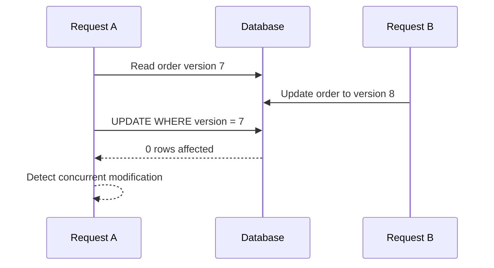
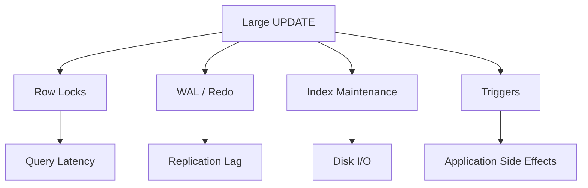

# 10- Safe UPDATE Practices

## Overview

`UPDATE` is one of the highest-risk SQL write operations because a syntactically valid statement can modify thousands or millions of rows when its filtering logic is incorrect.

Safe updates are therefore less about memorizing `UPDATE` syntax and more about controlling **scope, correctness, concurrency, transactions, and operational impact**.

A production-safe update should answer four questions before execution:

1. **Which rows can change?**
2. **Which columns can change?**
3. **What values should they receive?**
4. **How can the operation be verified or rolled back if the result is unexpected?**

A useful mental model is:

```text
Identify target rows
       |
       v
Preview affected rows
       |
       v
Validate predicates
       |
       v
Execute inside appropriate transaction
       |
       v
Verify affected rows
       |
       v
Commit
```

This discipline applies equally to application code, migrations, administrative SQL, data repair jobs, and production incident remediation.

## Basic UPDATE Structure

The general form is:

```sql
UPDATE table_name
SET
    column_a = value_a,
    column_b = value_b
WHERE condition;
```

For example:

```sql
UPDATE customers
SET
    status = 'inactive',
    updated_at = CURRENT_TIMESTAMP
WHERE id = $1;
```

The `WHERE` clause determines the target set.

Without a `WHERE` clause:

```sql
UPDATE customers
SET status = 'inactive';
```

every row can be modified.

This is not a SQL syntax error. It is valid SQL, which makes missing predicates particularly dangerous.

## The Most Important Rule: Verify the WHERE Clause

Before executing an important update, run the equivalent `SELECT`.

Instead of immediately executing:

```sql
UPDATE orders
SET status = 'cancelled'
WHERE customer_id = 42
  AND status = 'pending';
```

first inspect:

```sql
SELECT id, customer_id, status
FROM orders
WHERE customer_id = 42
  AND status = 'pending';
```

Check:

- Number of rows.
- Representative records.
- Business identifiers.
- Existing state.
- Whether the predicate matches the intended population.

Then execute the update.

This is especially important for:

- Production data fixes.
- Migration scripts.
- Bulk updates.
- Incident remediation.
- One-time administrative SQL.

## Always Define the Intended Scope

A safe predicate should correspond to a clear business rule.

Weak:

```sql
UPDATE users
SET status = 'inactive'
WHERE email LIKE '%example.com%';
```

Stronger:

```sql
UPDATE users
SET status = 'inactive'
WHERE tenant_id = $1
  AND status = 'active'
  AND email LIKE '%@example.com';
```

The stronger predicate makes the intended scope explicit.

Useful filters often include:

- Primary key.
- Foreign key.
- Tenant ID.
- Current state.
- Version.
- Time boundary.
- Business identifier.

Avoid relying on a single loosely defined attribute when the operation is destructive or high-volume.

## Primary-Key Updates

Updating by primary key is generally the safest application pattern.

```sql
UPDATE customers
SET
    email = $2,
    updated_at = CURRENT_TIMESTAMP
WHERE id = $1;
```

The application already knows the resource identity:

```text
HTTP request
    |
    v
Application
    |
    v
customer_id
    |
    v
UPDATE ... WHERE id = ?
```

A primary-key predicate usually gives the database an efficient lookup path through the primary-key index.

However, primary-key targeting does not eliminate all correctness problems. The application must still verify:

- The row belongs to the authenticated tenant.
- The current state permits the operation.
- The update is authorized.
- The row has not changed unexpectedly.

## Optimistic Concurrency Control

A particularly useful safety technique is to include the expected version or current state in the predicate.

For example:

```sql
UPDATE orders
SET
    status = 'shipped',
    version = version + 1,
    updated_at = CURRENT_TIMESTAMP
WHERE id = $1
  AND version = $2
  AND status = 'paid';
```

The application provides the version it previously read.

If another transaction changed the order first:

```text
Application version = 7
Database version     = 8
```

the update affects zero rows.

The application can then return a conflict instead of silently overwriting newer data.



This pattern is useful for REST APIs, administrative interfaces, and distributed workers.

## Check the Number of Rows Affected

The affected-row count is an important safety signal.

For example:

```python
cursor.execute(
    """
    UPDATE orders
    SET status = %s
    WHERE id = %s
      AND status = %s
    """,
    ["shipped", order_id, "paid"],
)

if cursor.rowcount != 1:
    raise RuntimeError("Order was not updated as expected")
```

For a single-row operation:

```text
Expected: 1 row
Actual:   1 row -> success
Actual:   0 rows -> investigate
Actual:   >1 rows -> unexpected scope
```

For bulk operations, establish an expected range rather than blindly accepting any count.

Be aware that affected-row semantics can differ across database engines and drivers, particularly when an update sets values to their existing values.

## Use Transactions for Critical Updates

A transaction provides a controlled boundary around the operation.

```sql
BEGIN;

SELECT id, status
FROM orders
WHERE id = 1001
FOR UPDATE;

UPDATE orders
SET
    status = 'cancelled',
    updated_at = CURRENT_TIMESTAMP
WHERE id = 1001
  AND status = 'pending';

COMMIT;
```

The transaction can ensure that the validation and update occur under a consistent concurrency model.

If validation fails:

```sql
ROLLBACK;
```

Do not assume that every update needs an explicit long-running transaction. Transactions should be kept as short as practical.

## Preview and Update in the Same Transaction

For high-risk manual changes, a transaction can provide an additional safety mechanism.

```sql
BEGIN;

SELECT id, status
FROM customers
WHERE tenant_id = 42
  AND status = 'active';

UPDATE customers
SET
    status = 'inactive',
    updated_at = CURRENT_TIMESTAMP
WHERE tenant_id = 42
  AND status = 'active';

-- Inspect affected-row count and results here.

ROLLBACK;
```

During testing or review, `ROLLBACK` allows the operation to be evaluated without committing the change.

After the update has been validated:

```sql
COMMIT;
```

Do not keep a production transaction open while performing unrelated analysis or waiting for human confirmation. Long transactions can hold locks, retain old row versions, increase storage pressure, and interfere with normal database operations.

## `RETURNING` for Verification

PostgreSQL supports `RETURNING`, which is useful when the application needs the modified rows.

```sql
UPDATE orders
SET
    status = 'shipped',
    updated_at = CURRENT_TIMESTAMP
WHERE id = $1
  AND status = 'paid'
RETURNING id, status, updated_at;
```

This avoids a separate query when the updated representation is required.

For example:

```python
cursor.execute(
    """
    UPDATE orders
    SET
        status = %s,
        updated_at = CURRENT_TIMESTAMP
    WHERE id = %s
      AND status = %s
    RETURNING id, status, updated_at
    """,
    ["shipped", order_id, "paid"],
)

updated_order = cursor.fetchone()

if updated_order is None:
    raise RuntimeError("Order was not updated")
```

The exact equivalent differs across database engines.

## Avoid Unnecessary Column Updates

Do not update columns that do not need to change.

Instead of:

```sql
UPDATE customers
SET
    name = $2,
    email = $3,
    phone = $4,
    address = $5,
    status = $6,
    updated_at = CURRENT_TIMESTAMP
WHERE id = $1;
```

when only the email changed, prefer:

```sql
UPDATE customers
SET
    email = $2,
    updated_at = CURRENT_TIMESTAMP
WHERE id = $1;
```

Unnecessary updates can cause:

- Additional row-version creation.
- WAL/redo generation.
- Index maintenance.
- Trigger execution.
- Replication traffic.
- Cache invalidation.
- Audit events.

The performance impact becomes significant for high-write tables.

## Updating Indexed Columns

Updating an indexed column can be more expensive than updating a non-indexed column because the database may need to maintain index entries.

For example:

```sql
UPDATE customers
SET email = $2
WHERE id = $1;
```

If `email` has a unique index, the database must enforce the uniqueness constraint and maintain the index.

This is usually the correct behavior, but high-volume bulk updates should account for the associated write cost.

## Avoid Functions on Indexed Predicates When Possible

This predicate:

```sql
UPDATE orders
SET status = 'expired'
WHERE DATE(created_at) = CURRENT_DATE;
```

may prevent efficient use of a normal index on `created_at`.

Prefer a range:

```sql
UPDATE orders
SET status = 'expired'
WHERE created_at >= CURRENT_DATE
  AND created_at < CURRENT_DATE + INTERVAL '1 day';
```

The exact syntax is database-specific, but the principle is broadly useful:

> Write predicates that allow the optimizer to use appropriate indexes.

Always verify important bulk-update plans with the database's execution-plan tooling.

## Safe Bulk UPDATEs

Bulk updates are often necessary, but they should be approached differently from single-row updates.

Example:

```sql
UPDATE sessions
SET
    status = 'expired',
    updated_at = CURRENT_TIMESTAMP
WHERE status = 'active'
  AND expires_at < CURRENT_TIMESTAMP;
```

Before execution:

```sql
SELECT COUNT(*)
FROM sessions
WHERE status = 'active'
  AND expires_at < CURRENT_TIMESTAMP;
```

Then inspect a sample:

```sql
SELECT id, status, expires_at
FROM sessions
WHERE status = 'active'
  AND expires_at < CURRENT_TIMESTAMP
ORDER BY expires_at
LIMIT 100;
```

For millions of rows, consider batching rather than executing one massive transaction.

## Batched Updates

Large updates can create significant:

- Lock duration.
- WAL/redo volume.
- Replication lag.
- Transaction-log growth.
- Vacuum pressure.
- I/O pressure.
- Application latency.

A batch-oriented design can reduce transaction size.

A PostgreSQL example can use a CTE to select a limited batch:

```sql
WITH batch AS (
    SELECT id
    FROM sessions
    WHERE status = 'active'
      AND expires_at < CURRENT_TIMESTAMP
    ORDER BY id
    LIMIT 1000
)
UPDATE sessions AS s
SET
    status = 'expired',
    updated_at = CURRENT_TIMESTAMP
FROM batch
WHERE s.id = batch.id;
```

The application or job can repeat this operation until no rows remain.

The exact batching strategy should account for:

- Index availability.
- Lock contention.
- Row distribution.
- Replica capacity.
- Autovacuum behavior.
- Job duration.

## Avoid `OFFSET` for Large Update Jobs

For repeated batches, offset-based pagination is often inefficient:

```sql
SELECT id
FROM sessions
WHERE status = 'active'
ORDER BY id
LIMIT 1000 OFFSET 1000000;
```

As the offset grows, the database may need to process and discard many preceding rows.

Keyset-style progression is usually better:

```sql
SELECT id
FROM sessions
WHERE status = 'active'
  AND id > $1
ORDER BY id
LIMIT 1000;
```

The application tracks the last processed primary key.

Be careful when the update changes the predicate itself. A batch job should be designed so that rows are neither repeatedly processed nor accidentally skipped.

## Conditional UPDATEs

The current value can be part of the safety condition.

```sql
UPDATE inventory
SET
    quantity = quantity - $2,
    updated_at = CURRENT_TIMESTAMP
WHERE product_id = $1
  AND quantity >= $2;
```

This makes the database enforce:

```text
quantity must not become negative
```

The application checks the affected-row count.

```text
1 row affected -> inventory reserved
0 rows affected -> insufficient inventory or missing product
```

This is generally safer than:

```text
SELECT quantity
UPDATE quantity
```

because the check and modification are expressed as one database operation.

## Do Not Read-Modify-Write Without Concurrency Analysis

This pattern is dangerous:

```python
quantity = get_quantity(product_id)

if quantity >= requested:
    update_quantity(product_id, quantity - requested)
```

Two workers can read the same quantity and both calculate a valid new value.

A conditional update is safer:

```sql
UPDATE inventory
SET quantity = quantity - $2
WHERE product_id = $1
  AND quantity >= $2;
```

The database evaluates the condition as part of the write operation.

For more complex state transitions, use appropriate transactions and locking.

## Avoid Accidental Full-Table Updates

A common production incident looks like:

```sql
UPDATE accounts
SET status = 'locked'
WHERE status = 'active';
```

when the intended operation was:

```sql
UPDATE accounts
SET status = 'locked'
WHERE id = $1
  AND status = 'active';
```

The first statement may affect a large portion of the table.

Useful defensive practices include:

- SQL review.
- Query linting.
- Migration review.
- Production permissions.
- Read-only database access for routine analysis.
- Explicit transaction handling.
- Affected-row thresholds.
- Automated integration tests.

Some database clients also provide safe-update modes that reject certain updates without restrictive predicates. These are useful developer safeguards but should not be treated as a substitute for correct SQL.

## Parameterized Queries

Never construct application SQL by concatenating user-controlled values.

Unsafe:

```python
sql = f"""
UPDATE customers
SET email = '{email}'
WHERE id = {customer_id}
"""
```

Use parameters:

```python
cursor.execute(
    """
    UPDATE customers
    SET email = %s
    WHERE id = %s
    """,
    [email, customer_id],
)
```

Parameterized queries protect against SQL injection and correctly handle values containing quotes or other special characters.

They do not automatically make the update logically safe. The `WHERE` clause still determines the scope.

## Authorization Must Be Part of the Predicate

In multi-tenant applications, authorization should not be implemented only in application memory.

For example:

```sql
UPDATE documents
SET title = $1
WHERE id = $2
  AND tenant_id = $3;
```

The application obtains the tenant identity from authenticated context rather than trusting a caller-provided tenant identifier.

This protects against a class of cross-tenant update bugs where a valid document ID belongs to another tenant.

For systems with PostgreSQL Row-Level Security, database-level policies can provide an additional enforcement layer.

## State-Transition Safety

Many backend updates represent state machines.

For example:

```text
pending -> paid -> shipped -> delivered
```

A naive update:

```sql
UPDATE orders
SET status = 'shipped'
WHERE id = $1;
```

allows the application to bypass state validation.

A safer update:

```sql
UPDATE orders
SET
    status = 'shipped',
    updated_at = CURRENT_TIMESTAMP
WHERE id = $1
  AND status = 'paid';
```

Now the database enforces part of the state transition.

For complex workflows, state validation may belong in application logic, database constraints, or both.

## Soft Deletes

A soft-delete update commonly looks like:

```sql
UPDATE customers
SET
    deleted_at = CURRENT_TIMESTAMP,
    updated_at = CURRENT_TIMESTAMP
WHERE id = $1
  AND deleted_at IS NULL;
```

The predicate prevents repeatedly "deleting" an already deleted row.

This is useful when records must remain available for:

- Auditing.
- Recovery.
- Historical reporting.
- Regulatory requirements.

However, soft deletion changes query semantics throughout the application. Every relevant read must correctly account for deleted rows.

## Updating Through JOINs

When an update depends on another table, database-specific syntax matters.

PostgreSQL commonly uses `UPDATE ... FROM`:

```sql
UPDATE orders AS o
SET
    customer_segment = c.segment,
    updated_at = CURRENT_TIMESTAMP
FROM customers AS c
WHERE o.customer_id = c.id
  AND o.customer_segment IS DISTINCT FROM c.segment;
```

Before executing it, inspect the join cardinality:

```sql
SELECT o.id, o.customer_id, c.segment
FROM orders AS o
JOIN customers AS c
  ON c.id = o.customer_id
WHERE o.customer_segment IS DISTINCT FROM c.segment;
```

An unexpected many-to-many join can produce incorrect results or database-specific behavior.

For critical updates, verify that the join produces exactly the intended target rows.

## Foreign Keys and UPDATE

Updating a primary key or referenced key can have broader consequences.

For example:

```sql
UPDATE customers
SET id = $2
WHERE id = $1;
```

If other tables reference `customers.id`, the operation may fail or cascade depending on the foreign-key configuration.

Primary keys are generally stable identifiers and should rarely need to change.

Prefer immutable identifiers when possible.

## Triggers and Side Effects

An `UPDATE` may trigger more work than is visible in the SQL statement.

Possible side effects include:

- Audit rows.
- Search-index updates.
- Cache invalidation.
- Event generation.
- Derived-table updates.
- Notification logic.

For example:

```sql
UPDATE customers
SET email = $2
WHERE id = $1;
```

may invoke an `AFTER UPDATE` trigger that writes to an audit table.

Before performing a bulk update, understand relevant triggers and database-side automation.

A one-million-row update can therefore generate far more than one million simple row modifications.

## Updating Through Views

Some databases allow updates through views when the view is sufficiently updatable.

However, views can hide underlying complexity.

Before using:

```sql
UPDATE active_customers
SET status = 'inactive'
WHERE id = $1;
```

understand:

- Which base tables are affected.
- Whether triggers exist.
- Whether the view filters rows.
- Whether the update is actually updatable.
- What permissions apply.

For operational data changes, explicit base-table updates can sometimes be easier to reason about.

## Isolation and Locking

An update interacts with concurrent transactions.

Consider:

```sql
UPDATE accounts
SET balance = balance - $1
WHERE id = $2;
```

The database must coordinate concurrent modifications to the same row.

Possible concerns include:

- Lock waits.
- Deadlocks.
- Serialization failures.
- Stale reads.
- Lost updates.
- Replication lag.

Do not solve every concurrency issue by selecting the strongest isolation level.

Instead, identify the invariant being protected and choose the smallest mechanism that guarantees it.

Common techniques include:

- Conditional updates.
- Optimistic version checks.
- Row-level locking.
- Short transactions.
- Appropriate isolation levels.

## Deadlocks

Two transactions can acquire locks in different orders:

```text
Transaction A:
  lock row 1
  lock row 2

Transaction B:
  lock row 2
  lock row 1
```

Neither can proceed.

For multi-row updates, reduce deadlock risk by using a consistent ordering where practical.

For example, process rows in ascending primary-key order:

```sql
ORDER BY id
```

Also keep transactions short and implement bounded retry for database errors that are explicitly safe to retry.

## Large UPDATEs and Production Impact

A large update can become an operational event rather than a normal query.

Potential consequences:



Before running a large update, evaluate:

- Estimated row count.
- Index usage.
- Transaction duration.
- Lock impact.
- WAL/redo generation.
- Replica capacity.
- Trigger behavior.
- Application traffic.
- Rollback cost.

A technically correct query can still be operationally unsafe.

## Rollback Strategy

For high-risk changes, establish how the operation can be reversed before execution.

For example, instead of blindly changing:

```sql
UPDATE customers
SET status = 'inactive'
WHERE ...;
```

identify:

```text
Old state
New state
Target rows
Rollback condition
```

If the original state varies by row, a generic reverse statement may not be sufficient.

For example:

```sql
UPDATE customers
SET status = 'active'
WHERE ...;
```

could incorrectly reactivate customers who were already inactive before the change.

For complex data repairs, capture affected identifiers and previous values in a dedicated backup or audit structure before modifying the data.

## Backups Are Not a Substitute for a Rollback Plan

A backup is essential for disaster recovery, but restoring a production database is usually much more disruptive than reversing a narrowly scoped transaction.

Before a high-risk update, distinguish:

| Mechanism | Purpose |
|---|---|
| Transaction rollback | Undo uncommitted changes |
| Backup | Recover database state after major failure |
| Audit table | Preserve row-level change history |
| Change log | Understand what changed |
| Point-in-time recovery | Restore database to an earlier point |
| Reverse migration/script | Correct a known deterministic change |

For large production changes, the recovery strategy should be explicitly understood before execution.

## Auditability

Production data changes should be attributable.

Useful audit information includes:

- Who initiated the change.
- When it happened.
- Which job or deployment initiated it.
- Why it happened.
- Which rows changed.
- Previous values.
- New values.

For application-driven changes, structured application logs and database audit mechanisms can complement each other.

For manual production repairs, record the exact SQL, parameters, expected row count, actual row count, and execution time.

## Monitoring UPDATE Operations

For normal application updates, monitor:

- Query latency.
- Database CPU.
- Lock waits.
- Deadlocks.
- Error rates.
- Connection pool saturation.
- Replication lag.

For bulk jobs, additionally monitor:

- Rows processed.
- Batch duration.
- Rows/sec.
- WAL/redo generation.
- Transaction duration.
- Replica lag.
- Remaining work.
- Retry count.

A useful operational pattern is:

```text
Batch
  |
  +--> Execute
  |
  +--> Verify row count
  |
  +--> Commit
  |
  +--> Record metrics
  |
  +--> Continue
```

## Safe UPDATE Workflow

A production-oriented workflow can be standardized.

### Identify

Define exactly:

```text
Target table
Target rows
Columns to change
Expected row count
Expected resulting state
```

### Preview

Run:

```sql
SELECT ...
FROM ...
WHERE ...;
```

and inspect both count and representative records.

### Check the Execution Plan

For large updates, inspect the planned access path.

PostgreSQL:

```sql
EXPLAIN
UPDATE sessions
SET status = 'expired'
WHERE status = 'active'
  AND expires_at < CURRENT_TIMESTAMP;
```

Use caution with `EXPLAIN ANALYZE` because it actually executes the statement for data-modifying queries.

### Execute Safely

Use:

- Parameterized SQL.
- Appropriate transaction boundaries.
- Conditional predicates.
- Batching where necessary.
- Concurrency controls where required.

### Verify

Check:

```sql
SELECT COUNT(*)
FROM sessions
WHERE status = 'expired'
  AND expires_at < CURRENT_TIMESTAMP;
```

Also inspect affected-row counts and application metrics.

### Commit or Roll Back

Do not commit merely because the statement succeeded syntactically.

Validate that the business result is correct.

## Safe UPDATE Checklist

### Before Execution

- [ ] Identify the exact target table.
- [ ] Identify the exact target rows.
- [ ] Define expected row count.
- [ ] Preview with `SELECT`.
- [ ] Verify the `WHERE` predicate.
- [ ] Check tenant and authorization boundaries.
- [ ] Check current-state conditions.
- [ ] Check indexes and execution plan for large operations.
- [ ] Understand triggers and side effects.
- [ ] Define rollback or recovery strategy.

### During Execution

- [ ] Use parameterized SQL.
- [ ] Use an appropriate transaction.
- [ ] Monitor lock waits and database load.
- [ ] Validate affected-row count.
- [ ] Batch large operations when appropriate.
- [ ] Avoid long-running transactions.

### After Execution

- [ ] Verify the resulting state.
- [ ] Check application errors.
- [ ] Check replication lag.
- [ ] Check relevant metrics.
- [ ] Record the change for auditability.
- [ ] Confirm downstream systems received expected changes.

## Common Mistakes

| Mistake | Risk | Safer approach |
|---|---|---|
| Missing `WHERE` | Entire table changes | Preview the predicate and enforce review |
| Wrong `WHERE` | Wrong rows change | Run equivalent `SELECT` first |
| No tenant predicate | Cross-tenant modification | Include tenant scope |
| No state predicate | Invalid transition | Include expected current state |
| No version check | Lost update | Use optimistic concurrency |
| Updating every column | Excessive write amplification | Update only required columns |
| One huge transaction | Lock and replication pressure | Batch when appropriate |
| No row-count validation | Unexpected scope goes unnoticed | Compare actual vs expected count |
| String-concatenated SQL | SQL injection | Parameterize values |
| Blind retry | Repeated or conflicting writes | Retry only safe transient failures |
| Ignoring triggers | Unexpected side effects | Inspect database behavior before bulk changes |
| Updating by mutable attributes | Wrong records | Prefer stable identifiers |
| Assuming backup equals rollback | Recovery is slow/disruptive | Design an explicit reversal strategy |
| Ignoring query plans | Full scans and long locks | Inspect plans for large updates |
| Long-running transaction | Bloat and blocking | Keep transactions bounded |

## Application Integration

A typical Django or FastAPI service should keep the update operation close to the business invariant.

For example:

```python
def ship_order(order_id: int, expected_version: int) -> bool:
    with connection.cursor() as cursor:
        cursor.execute(
            """
            UPDATE orders
            SET
                status = %s,
                version = version + 1,
                updated_at = CURRENT_TIMESTAMP
            WHERE id = %s
              AND version = %s
              AND status = %s
            """,
            ["shipped", order_id, expected_version, "paid"],
        )

        return cursor.rowcount == 1
```

The API layer can interpret:

```text
1 row -> transition succeeded
0 rows -> order changed, missing, or invalid transition
```

For a business-critical workflow, the service may wrap additional database operations in the same transaction.

## Migration Considerations

Schema migrations sometimes require data updates.

Avoid combining a massive table rewrite with a schema change when it can cause unacceptable locks or downtime.

A safer migration strategy may be:

```text
Add nullable column
        |
        v
Deploy application supporting both states
        |
        v
Backfill in batches
        |
        v
Monitor
        |
        v
Enforce constraint
        |
        v
Remove legacy behavior
```

This is particularly important for large PostgreSQL tables and high-traffic production systems.

## Interview Traps

### Is an UPDATE without WHERE always wrong?

No. It is valid when every row is intentionally meant to change.

For example:

```sql
UPDATE products
SET updated_at = CURRENT_TIMESTAMP;
```

can be intentional.

The engineering issue is not the absence of `WHERE` itself; it is the absence of an explicitly validated target scope.

### Does a successful UPDATE mean the operation was correct?

No.

SQL success only means the database accepted and executed the statement.

The application must validate:

- Affected rows.
- Resulting state.
- Business invariants.
- Side effects.

### Why use `WHERE status = 'pending'` when updating to another state?

It prevents invalid concurrent transitions and provides optimistic concurrency behavior.

```sql
UPDATE orders
SET status = 'paid'
WHERE id = $1
  AND status = 'pending';
```

If another worker already changed the order, zero rows are affected.

### Does a transaction prevent all concurrency problems?

No.

Transactions provide atomicity and isolation according to the chosen database semantics, but they do not automatically prevent every race condition, deadlock, or lost-update scenario.

### Why can a correct bulk UPDATE still be dangerous?

Because operational impact matters.

A large update can generate substantial WAL/redo, locks, I/O, replication lag, trigger activity, and transaction duration.

### Should every UPDATE use `SELECT ... FOR UPDATE` first?

No.

For many operations, a conditional `UPDATE` or optimistic version check is sufficient and more efficient.

Use explicit locking when the business invariant actually requires it.

## Key Takeaways

- **Treat the `WHERE` clause as a correctness boundary: preview it, validate its scope, and establish an expected affected-row count before important updates.**
- **Use primary keys, tenant boundaries, current-state predicates, and optimistic version checks to prevent unintended or stale writes.**
- **Keep updates small and focused; batch large operations to control locks, WAL/redo, replication lag, and transaction duration.**
- **Use parameterized SQL, appropriate transactions, and explicit verification rather than relying on successful SQL execution as proof of correctness.**
- **For production data changes, plan observability, auditability, side effects, and recovery before executing the update.**