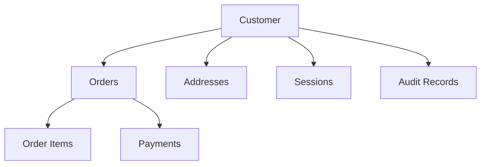
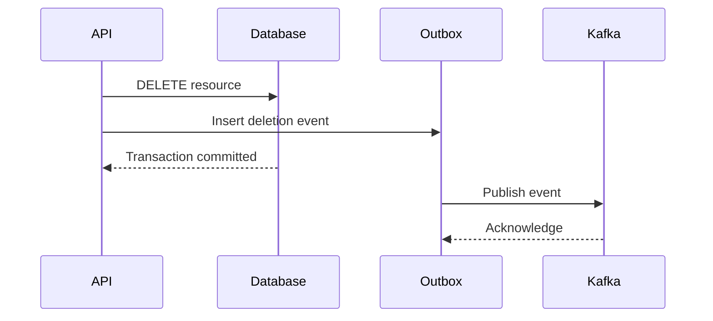

# 11- Safe DELETE Practices

## Overview

`DELETE` permanently removes rows from a table unless the database design uses a soft-delete pattern or another mechanism that preserves the data.

Like `UPDATE`, the primary risk is not SQL syntax. The risk is an incorrect target set:

```sql
DELETE FROM customers
WHERE id = $1;
```

is straightforward when `id` is correct, but:

```sql
DELETE FROM customers;
```

is also valid SQL and can remove every row.

Production-safe deletion therefore requires explicit control over:

- Target-row selection.
- Referential integrity.
- Authorization and tenant boundaries.
- Concurrency.
- Transaction scope.
- Cascading behavior.
- Recovery strategy.
- Auditability.
- Operational impact.

A useful mental model is:

```text
Identify target rows
       |
       v
Preview with SELECT
       |
       v
Validate scope and dependencies
       |
       v
Choose hard delete vs soft delete
       |
       v
Execute transactionally
       |
       v
Verify affected rows
       |
       v
Commit and record the change
```

## Basic DELETE Structure

The standard form is:

```sql
DELETE FROM table_name
WHERE condition;
```

For example:

```sql
DELETE FROM sessions
WHERE id = $1;
```

The `WHERE` clause defines which rows can be deleted.

A missing `WHERE` clause means every row is eligible:

```sql
DELETE FROM sessions;
```

This is valid SQL. It should therefore be treated as a potentially destructive operation rather than something the database will automatically reject.

## Verify the WHERE Clause Before DELETE

Before an important deletion, execute the equivalent `SELECT`.

Instead of immediately running:

```sql
DELETE FROM orders
WHERE customer_id = 42
  AND status = 'cancelled';
```

first run:

```sql
SELECT id, customer_id, status
FROM orders
WHERE customer_id = 42
  AND status = 'cancelled';
```

Then verify:

- The number of rows.
- Representative records.
- Customer or tenant ownership.
- Current state.
- Business meaning of the deletion.

For high-risk operations, establish the expected count explicitly:

```sql
SELECT COUNT(*)
FROM orders
WHERE customer_id = 42
  AND status = 'cancelled';
```

Do not treat a successful SQL execution as proof that the correct rows were selected.

## Prefer Stable Identifiers

Application-level deletion should normally target an immutable identifier.

```sql
DELETE FROM customers
WHERE id = $1;
```

is safer than:

```sql
DELETE FROM customers
WHERE email = $1;
```

because email addresses can change and may not uniquely identify the intended record.

For multi-tenant systems, include the tenant boundary:

```sql
DELETE FROM documents
WHERE id = $1
  AND tenant_id = $2;
```

The tenant identifier should come from trusted authenticated context rather than from an untrusted request parameter.

## Parameterized DELETE Statements

Never construct `DELETE` statements by concatenating user-controlled input.

Unsafe:

```python
sql = f"DELETE FROM customers WHERE id = {customer_id}"
cursor.execute(sql)
```

Use parameters:

```python
cursor.execute(
    """
    DELETE FROM customers
    WHERE id = %s
    """,
    [customer_id],
)
```

Parameterized queries protect against SQL injection and correctly handle values.

They do not protect against a logically incorrect predicate. This is still dangerous:

```python
cursor.execute(
    "DELETE FROM customers WHERE tenant_id = %s",
    [tenant_id],
)
```

if the application intended to delete only one customer.

## Check the Number of Rows Deleted

For a single-resource deletion:

```python
cursor.execute(
    """
    DELETE FROM customers
    WHERE id = %s
      AND tenant_id = %s
    """,
    [customer_id, tenant_id],
)

if cursor.rowcount != 1:
    raise RuntimeError("Customer was not deleted as expected")
```

The result provides a useful correctness signal:

| Result | Possible interpretation |
|---|---|
| `1` | Expected deletion |
| `0` | Missing row, wrong tenant, already deleted, or predicate mismatch |
| `>1` | Predicate is broader than expected |

For bulk deletion, establish an expected count or acceptable range before execution.

Driver semantics for affected rows can vary, so application code should use the database driver's documented behavior.

## Transactions

Use transactions when deletion must be coordinated with other database operations.

```sql
BEGIN;

DELETE FROM order_items
WHERE order_id = $1;

DELETE FROM orders
WHERE id = $1;

COMMIT;
```

If a validation or dependent operation fails:

```sql
ROLLBACK;
```

The transaction should be as short as practical.

Avoid keeping a production transaction open while waiting for human confirmation, performing unrelated analysis, or making external network calls.

Long transactions can cause:

- Lock contention.
- Old row-version retention.
- Storage growth.
- Vacuum pressure.
- Replication problems.
- Increased application latency.

## `RETURNING` for Verification

PostgreSQL supports `RETURNING`, which can make deletion verification and application responses more efficient.

```sql
DELETE FROM sessions
WHERE id = $1
RETURNING id, user_id, expires_at;
```

The application can determine whether a row was actually deleted without issuing a separate lookup.

```python
cursor.execute(
    """
    DELETE FROM sessions
    WHERE id = %s
    RETURNING id
    """,
    [session_id],
)

deleted = cursor.fetchone()

if deleted is None:
    raise RuntimeError("Session was not found")
```

This syntax is database-specific, so portability requirements should be considered.

## Foreign Keys and Referential Integrity

Deleting a parent row can affect related rows.

Consider:

```text
customers
   |
   +---- orders
           |
           +---- order_items
```

A customer may have orders, and orders may have order items.

A foreign key can prevent deletion:

```sql
DELETE FROM customers
WHERE id = $1;
```

if dependent rows still exist.

Alternatively, the foreign key may specify cascading behavior.

Conceptually:

```text
DELETE customer
      |
      v
DELETE dependent orders
      |
      v
DELETE dependent order_items
```

The exact behavior depends on the foreign-key configuration.

Before deleting a parent entity, understand:

- Foreign keys.
- `ON DELETE CASCADE`.
- `ON DELETE RESTRICT`.
- `ON DELETE SET NULL`.
- Triggers.
- Application-level dependencies.

## Cascading DELETE

Cascades can be useful when child records have no independent business meaning.

For example:

```sql
CREATE TABLE order_items (
    id bigint PRIMARY KEY,
    order_id bigint NOT NULL
        REFERENCES orders(id)
        ON DELETE CASCADE
);
```

Deleting an order automatically deletes its items.

Advantages:

- Referential integrity is enforced by the database.
- Application code does not need to manually delete every dependent row.
- The operation is transactional.

Risks:

- A single parent deletion can remove a large graph of data.
- The full impact may not be obvious from the application query.
- Cascades can cause significant lock and I/O activity.
- A mistaken parent deletion can become much more destructive.

Never assume that deleting one row means only one physical row will be affected.

## Understand the Dependency Graph

Before deleting a production entity, identify downstream dependencies.



The important distinction is between:

- Database-enforced dependencies.
- Application-enforced dependencies.
- External-system dependencies.

A foreign key may protect the first category but cannot automatically protect data stored in:

- Redis.
- Kafka.
- Elasticsearch/OpenSearch.
- Object storage.
- External services.

Deleting a database record may therefore require coordinated cleanup or event publication.

## Hard Delete vs Soft Delete

A hard delete physically removes the row from the table:

```sql
DELETE FROM customers
WHERE id = $1;
```

A soft delete records deletion state instead:

```sql
UPDATE customers
SET
    deleted_at = CURRENT_TIMESTAMP,
    updated_at = CURRENT_TIMESTAMP
WHERE id = $1
  AND deleted_at IS NULL;
```

| Concern | Hard delete | Soft delete |
|---|---|---|
| Physical removal | Yes | No |
| Recovery | Requires backup or other retained data | Usually straightforward |
| Storage reclamation | Possible | Requires separate cleanup |
| Auditability | Requires separate mechanism | Deletion timestamp can be retained |
| Query complexity | Simpler | Every relevant query must exclude deleted rows |
| Referential behavior | Can trigger cascades | Usually does not |
| Compliance suitability | Depends on requirements | Depends on requirements |
| Accidental deletion recovery | Difficult | Often easier |

Soft deletion is not automatically safer. It introduces a global data-access invariant:

```text
Normal queries must exclude deleted rows.
```

That invariant must be consistently enforced.

## When Hard Delete Is Appropriate

Hard deletion is often appropriate when:

- The data has no required retention period.
- The record is temporary.
- The data is operational and disposable.
- The business explicitly requires physical deletion.
- Regulatory or privacy requirements require actual erasure.

Examples include:

- Expired sessions.
- Temporary job records.
- Ephemeral workflow state.
- Disposable staging data.

However, retention and compliance requirements must be checked before implementing automatic hard deletion.

## When Soft Delete Is Appropriate

Soft deletion can be useful when records may need:

- Recovery.
- Historical reporting.
- Auditability.
- Temporary deactivation.
- Business-level restoration.

Example:

```sql
UPDATE projects
SET deleted_at = CURRENT_TIMESTAMP
WHERE id = $1
  AND deleted_at IS NULL;
```

Applications then filter active records:

```sql
SELECT id, name
FROM projects
WHERE tenant_id = $1
  AND deleted_at IS NULL;
```

For mature systems, consider enforcing this access pattern through repository/query abstractions or database views where appropriate.

## Soft Delete Pitfalls

Soft deletion creates several common problems.

### Forgetting the Filter

This query:

```sql
SELECT *
FROM customers
WHERE tenant_id = $1;
```

may accidentally expose deleted records.

The intended query is:

```sql
SELECT *
FROM customers
WHERE tenant_id = $1
  AND deleted_at IS NULL;
```

### Uniqueness Constraints

Suppose email must be unique among active users.

A normal unique constraint may prevent a new user from reusing the email even after the old user has been soft deleted.

PostgreSQL can use a partial unique index:

```sql
CREATE UNIQUE INDEX users_active_email_unique
ON users (lower(email))
WHERE deleted_at IS NULL;
```

This is a production-level example of how soft deletion changes schema design.

## DELETE with Conditions

Conditional deletion is often safer than deleting by identity alone.

For example:

```sql
DELETE FROM sessions
WHERE id = $1
  AND user_id = $2
  AND expires_at < CURRENT_TIMESTAMP;
```

The database now verifies multiple invariants.

For a state-based cleanup job:

```sql
DELETE FROM job_runs
WHERE status = 'completed'
  AND finished_at < CURRENT_TIMESTAMP - INTERVAL '90 days';
```

The condition expresses the retention policy directly.

## Concurrency-Safe DELETE

Suppose an application wants to delete a resource only if it is still in a specific state:

```sql
DELETE FROM carts
WHERE id = $1
  AND status = 'abandoned';
```

If another transaction changes the cart first, the deletion affects zero rows.

This can be safer than:

```text
SELECT cart
check status in application
DELETE cart
```

because the condition is evaluated as part of the write.

For more complex workflows, use appropriate transaction isolation or row locking.

## Optimistic Concurrency with DELETE

A version column can also protect deletion:

```sql
DELETE FROM documents
WHERE id = $1
  AND version = $2;
```

If the document has changed since it was read:

```text
Application version = 12
Database version     = 13
```

the deletion affects zero rows.

The API can return a conflict instead of deleting a newer version.

This is particularly useful for APIs where clients may hold stale representations.

## DELETE and Locking

A delete generally acquires locks needed to maintain database consistency.

Deleting a heavily referenced or frequently accessed row can therefore cause contention.

Potential symptoms include:

- Increased query latency.
- Lock waits.
- Deadlocks.
- Request timeouts.
- Replication lag.

For high-traffic systems, deletion should be designed with the workload in mind.

A single-row deletion is usually straightforward:

```sql
DELETE FROM sessions
WHERE id = $1;
```

A million-row cleanup is an operational workload:

```sql
DELETE FROM sessions
WHERE expires_at < CURRENT_TIMESTAMP;
```

The latter may require batching.

## Large DELETE Operations

Large deletes can generate substantial database work.

Potential effects include:

- WAL/redo generation.
- Index maintenance.
- Row locks.
- Table/index bloat.
- Vacuum pressure.
- Replication lag.
- Increased I/O.
- Long transaction duration.

Instead of deleting millions of rows in one transaction, process bounded batches.

A PostgreSQL example:

```sql
WITH batch AS (
    SELECT id
    FROM sessions
    WHERE expires_at < CURRENT_TIMESTAMP
    ORDER BY id
    LIMIT 1000
)
DELETE FROM sessions AS s
USING batch
WHERE s.id = batch.id;
```

Repeat until the batch returns zero deleted rows.

The batch size should be determined from production measurements rather than treated as a universal constant.

## Avoid `OFFSET` for Large Cleanup Jobs

For large deletion jobs, avoid repeatedly scanning through increasing offsets:

```sql
SELECT id
FROM sessions
WHERE expires_at < CURRENT_TIMESTAMP
ORDER BY id
LIMIT 1000 OFFSET 1000000;
```

Keyset-style progression is usually more efficient:

```sql
SELECT id
FROM sessions
WHERE expires_at < CURRENT_TIMESTAMP
  AND id > $1
ORDER BY id
LIMIT 1000;
```

However, the batching algorithm must account for rows disappearing as they are processed. The simplest strategy for many cleanup jobs is to repeatedly select the next batch of currently eligible rows until no eligible rows remain.

## Partitioning and Large-Scale Retention

For very large time-series or retention-oriented tables, repeatedly deleting old rows may be the wrong architecture.

If data is partitioned by time:

```text
events
├── events_2026_01
├── events_2026_02
├── events_2026_03
└── events_2026_04
```

retention can sometimes be implemented by dropping or detaching an old partition rather than deleting individual rows.

Conceptually:

```text
DELETE millions of rows
        |
        v
Heavy row-level work

vs.

DROP old partition
        |
        v
Fast metadata-oriented operation
```

Partitioning is not a universal solution, but for predictable time-based retention it can dramatically simplify deletion workloads.

## DELETE and Indexes

The database must maintain relevant indexes when rows are deleted.

Deleting a large number of rows therefore creates additional index work.

Indexes that support the deletion predicate can also make target-row discovery more efficient.

For example:

```sql
DELETE FROM sessions
WHERE expires_at < CURRENT_TIMESTAMP;
```

may benefit from an appropriate index depending on the workload and database engine.

However, indexing every cleanup predicate is not automatically beneficial. Indexes also increase:

- Storage.
- Write cost.
- Maintenance cost.
- Vacuum or cleanup work.

Use execution plans and workload measurements to validate the design.

## Query Plan Considerations

For a large deletion, inspect the execution plan before execution.

PostgreSQL:

```sql
EXPLAIN
DELETE FROM sessions
WHERE expires_at < CURRENT_TIMESTAMP;
```

For a data-modifying statement, be careful with:

```sql
EXPLAIN ANALYZE
```

because it executes the statement.

A plan can reveal whether the database expects to use:

- Index scans.
- Bitmap scans.
- Sequential scans.
- Join operations.

A sequential scan is not automatically wrong. For a predicate matching a large percentage of the table, it may be the most efficient plan.

## DELETE with JOINs

Deletion based on another table is database-specific.

For PostgreSQL, a common pattern is:

```sql
DELETE FROM sessions AS s
USING users AS u
WHERE s.user_id = u.id
  AND u.status = 'disabled';
```

Before executing:

```sql
SELECT s.id, s.user_id
FROM sessions AS s
JOIN users AS u
  ON s.user_id = u.id
WHERE u.status = 'disabled';
```

Validate the join cardinality and target set first.

A many-to-many join can produce a much broader target set than intended.

## Cascading Side Effects

A delete can trigger more than database row removal.

Potential side effects include:

- Database triggers.
- Audit records.
- Event publication.
- Cache invalidation.
- Search-index cleanup.
- Application callbacks.
- Foreign-key cascades.

For example:

```sql
DELETE FROM users
WHERE id = $1;
```

may trigger:

```text
User deletion
    |
    +--> Orders
    +--> Sessions
    +--> User preferences
    +--> Audit records
```

Before production deletion, inspect database triggers and application behavior.

## External Systems

Database transactions cannot automatically roll back changes already sent to external systems.

Consider:

```text
BEGIN
  DELETE database record
  publish Kafka event
COMMIT
```

If event publication succeeds but the database transaction later rolls back, the event may describe a deletion that never committed.

Conversely, if the database commits but the event is never published, consumers may never learn about the deletion.

For reliable event-driven architectures, consider an outbox pattern:



The deletion and outbox record are committed atomically. A separate publisher can retry event delivery.

## Auditability

Hard deletion removes the row, so auditability requires a separate mechanism if the business needs to know what existed.

Useful audit information includes:

- Actor.
- Timestamp.
- Resource identifier.
- Tenant.
- Operation.
- Reason.
- Previous state where appropriate.
- Request or job identifier.

For sensitive or regulated systems, deletion audit records should themselves be designed carefully so they do not accidentally retain data that was supposed to be erased.

## Recovery and Rollback

A transaction can reverse an uncommitted deletion:

```sql
BEGIN;

DELETE FROM customers
WHERE id = $1;

-- Verify the result.

ROLLBACK;
```

Once committed, normal transaction rollback is no longer available.

Recovery may then require:

- Backup restoration.
- Point-in-time recovery.
- Audit data.
- Soft-delete restoration.
- A purpose-built recovery workflow.

A backup is not the same as an operational rollback plan.

For high-risk deletion, determine recovery options before execution.

## Production DELETE Workflow

A disciplined deletion process should follow these stages.

### Identify

Define:

```text
Target table
Target rows
Expected count
Dependencies
Retention requirements
Recovery strategy
```

### Preview

Run the equivalent `SELECT`:

```sql
SELECT id
FROM target_table
WHERE ...;
```

Then count:

```sql
SELECT COUNT(*)
FROM target_table
WHERE ...;
```

### Inspect Dependencies

Check:

- Foreign keys.
- Cascades.
- Triggers.
- Application dependencies.
- External systems.
- Audit requirements.

### Choose the Deletion Strategy

Determine whether the correct approach is:

- Hard delete.
- Soft delete.
- Batched delete.
- Partition removal.
- Archival followed by deletion.

### Execute

Use:

- Parameterized SQL.
- Appropriate transaction boundaries.
- Concurrency controls.
- Bounded batches for large operations.

### Verify

Validate:

- Affected-row count.
- Remaining records.
- Referential integrity.
- Application behavior.
- Replication health.

### Commit and Record

For production changes, record:

- SQL or migration identifier.
- Parameters.
- Operator or job identity.
- Expected row count.
- Actual row count.
- Execution time.
- Recovery information.

## Safe DELETE Checklist

### Before Execution

- [ ] Identify the exact target table.
- [ ] Define the intended rows.
- [ ] Run an equivalent `SELECT`.
- [ ] Verify the expected row count.
- [ ] Check tenant and authorization boundaries.
- [ ] Check foreign keys and cascading behavior.
- [ ] Check triggers.
- [ ] Determine hard delete vs soft delete.
- [ ] Check retention and compliance requirements.
- [ ] Define recovery strategy.
- [ ] Inspect the execution plan for large deletes.

### During Execution

- [ ] Use parameterized SQL.
- [ ] Use an appropriate transaction.
- [ ] Monitor lock waits and database load.
- [ ] Validate affected-row counts.
- [ ] Batch large deletions.
- [ ] Keep transactions short.
- [ ] Monitor replication lag.

### After Execution

- [ ] Verify the target rows are gone or marked deleted.
- [ ] Verify dependent data is correct.
- [ ] Check application errors.
- [ ] Check replicas.
- [ ] Verify downstream events if applicable.
- [ ] Record the operation for auditability.

## Common Mistakes and Pitfalls

| Mistake | Risk | Safer approach |
|---|---|---|
| Missing `WHERE` | Entire table deleted | Require explicit target scope |
| Incorrect predicate | Wrong records deleted | Preview with `SELECT` |
| Deleting by mutable attributes | Wrong resource deleted | Prefer stable IDs |
| Missing tenant predicate | Cross-tenant deletion | Include tenant scope |
| Ignoring foreign keys | Operation fails or cascades unexpectedly | Inspect dependencies |
| Assuming one row means one deletion | Cascades remove children | Understand cascade graph |
| Ignoring triggers | Hidden side effects | Inspect trigger definitions |
| Huge single transaction | Locks, bloat, replication pressure | Batch deletion |
| No row-count check | Unexpected scope goes unnoticed | Validate affected rows |
| Hard delete without retention review | Irrecoverable data loss | Verify retention policy |
| Soft delete without query discipline | Deleted records remain visible | Enforce active-row filtering |
| No audit trail | Difficult incident investigation | Record deletion metadata |
| Publishing events outside transaction design | Inconsistent external state | Use an outbox or equivalent |
| Blind retry | Duplicate side effects or repeated work | Retry only known-safe operations |
| Assuming backup is rollback | Recovery is slow and disruptive | Define operational recovery before deletion |

## Application Integration

A typical backend deletion endpoint should enforce authorization and target scope in the database operation.

```python
def delete_document(document_id: int, tenant_id: int) -> bool:
    with connection.cursor() as cursor:
        cursor.execute(
            """
            DELETE FROM documents
            WHERE id = %s
              AND tenant_id = %s
            """,
            [document_id, tenant_id],
        )

        return cursor.rowcount == 1
```

The service layer can distinguish:

```text
1 row affected -> deletion succeeded
0 rows affected -> resource missing or not accessible
```

The API should avoid leaking unnecessary information about whether a resource exists in another tenant.

For more complex operations, wrap related database changes in a transaction.

## Django and ORM Considerations

Framework abstractions do not remove the need for deletion safety.

For example, a Django operation such as:

```python
Customer.objects.filter(
    id=customer_id,
    tenant_id=tenant_id,
).delete()
```

can affect related objects depending on model relationships and configured deletion behavior.

Before using bulk deletion, understand:

- Foreign-key `on_delete` behavior.
- Signals and callbacks.
- Whether individual model methods are invoked.
- Query count.
- Transaction boundaries.
- Cascading behavior.

Do not assume ORM syntax makes a destructive operation inherently safe.

## Security Considerations

Deletion endpoints are high-value authorization targets.

A secure design should validate:

- Authentication.
- Resource ownership.
- Tenant boundaries.
- Required roles or permissions.
- Business-state restrictions.
- Audit requirements.

For example:

```sql
DELETE FROM invoices
WHERE id = $1
  AND tenant_id = $2
  AND status = 'draft';
```

This prevents deletion of finalized invoices when the business rule requires them to be retained.

Database permissions should also follow least privilege. An application account that never needs arbitrary administrative deletion should not receive unrestricted database privileges.

## Monitoring DELETE Operations

Normal deletion requests should be monitored for:

- Latency.
- Error rate.
- Lock waits.
- Deadlocks.
- Connection pool saturation.

Bulk cleanup jobs should additionally track:

- Rows deleted.
- Batch duration.
- Rows per second.
- Remaining rows.
- Transaction duration.
- WAL/redo generation.
- Replica lag.
- Retry count.

For automated cleanup:

```text
Select batch
    |
    v
Delete batch
    |
    v
Verify count
    |
    v
Commit
    |
    v
Record metrics
    |
    v
Repeat
```

A cleanup job should be observable and interruptible rather than operating as an opaque background process.

## Interview Traps

### Is `DELETE FROM table` always wrong?

No. It is valid when every row is intentionally supposed to be removed.

The problem is executing it without explicitly confirming that the entire table is the intended target.

### Is soft delete always safer than hard delete?

No.

Soft deletion improves recoverability in many applications but creates additional query, indexing, storage, uniqueness, and retention complexity.

### Does `ON DELETE CASCADE` mean only child rows are removed?

It can remove an entire dependency chain. The exact scope depends on the foreign-key graph.

### Does a transaction make a DELETE recoverable forever?

No.

Rollback only works before the transaction commits. After commit, recovery requires another mechanism.

### Should every DELETE use `SELECT ... FOR UPDATE`?

No.

A conditional `DELETE`, optimistic version check, or appropriate transaction may be sufficient. Explicit locking should be used when the concurrency model requires it.

### Why can a correct DELETE still cause an outage?

Because correctness and operational safety are different concerns.

A large but logically correct delete can still create excessive locking, I/O, WAL/redo generation, vacuum pressure, or replication lag.

### Can a database transaction roll back a Kafka event?

No.

Database transactions and external messaging systems have separate consistency boundaries. Use an outbox or another distributed consistency pattern when atomic database-and-event behavior is required.

## Key Takeaways

- **Treat every `DELETE` as a potentially destructive production operation: preview the predicate, validate the target count, and understand dependencies before execution.**
- **Use stable identifiers, tenant boundaries, state/version predicates, and parameterized queries to prevent unauthorized or unintended deletion.**
- **Understand foreign-key cascades, triggers, and external-system dependencies because deleting one logical resource can affect many records and services.**
- **Use soft deletes, batching, partitioning, or hard deletes according to retention, recovery, scale, and business requirements rather than applying one pattern universally.**
- **For production deletion, design transactions, recovery, auditability, monitoring, and downstream event handling before the delete is committed.**