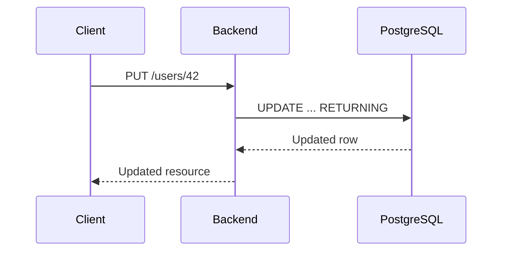

# 12- Returning Modified Rows

## Overview

`RETURNING` allows a data-modification statement to return rows affected by the operation as part of the same SQL statement.

In PostgreSQL, it can be used with:

- `INSERT ... RETURNING`
- `UPDATE ... RETURNING`
- `DELETE ... RETURNING`
- `MERGE ... RETURNING` in supported PostgreSQL versions

The key production benefit is that the application can obtain database-generated or modified values without issuing a separate query.

For example:

```sql
UPDATE users
SET last_login_at = CURRENT_TIMESTAMP
WHERE id = $1
RETURNING id, email, last_login_at;
```

Without `RETURNING`, an application commonly needs:

```text
UPDATE
  |
  v
SELECT updated row
  |
  v
Return response
```

With `RETURNING`:

```text
UPDATE ... RETURNING
        |
        v
Updated row returned
```

This reduces round trips and, more importantly, lets the database return the exact row state produced by the modification.

## Why Returning Modified Rows Matters

A database often determines values that the application should not attempt to reproduce itself.

Examples include:

- Identity-generated primary keys.
- Database timestamps.
- Default values.
- Trigger-generated values.
- Computed values.
- Values modified by database rules or triggers.
- The final state after an `UPDATE`.

Consider:

```sql
INSERT INTO orders (
    customer_id,
    total_amount
)
VALUES ($1, $2)
RETURNING id, created_at, status;
```

The application can immediately obtain the generated `id`, database-generated `created_at`, and default `status`.

This is preferable to:

```text
INSERT
  |
  v
SELECT using another lookup
```

because the second approach introduces another database round trip and can require an additional query to identify the inserted row.

## Basic Syntax

The general PostgreSQL pattern is:

```sql
INSERT INTO table_name (...)
VALUES (...)
RETURNING column1, column2;
```

```sql
UPDATE table_name
SET column = value
WHERE condition
RETURNING column1, column2;
```

```sql
DELETE FROM table_name
WHERE condition
RETURNING column1, column2;
```

The returned columns can be:

- Existing columns.
- Expressions.
- Aliases.
- Database-generated values.

For example:

```sql
UPDATE products
SET price = price * 1.10
WHERE category_id = $1
RETURNING id, price;
```

The returned `price` is the value after the update.

## INSERT ... RETURNING

`INSERT ... RETURNING` is especially useful when the database generates values.

```sql
INSERT INTO users (
    email,
    display_name
)
VALUES ($1, $2)
RETURNING id, email, display_name, created_at;
```

The database can generate:

```text
id
created_at
```

and potentially other values through defaults or triggers.

The application receives the authoritative database result directly.

### Why This Is Better Than a Follow-Up SELECT

A naive implementation might be:

```sql
INSERT INTO users (email, display_name)
VALUES ($1, $2);
```

followed by:

```sql
SELECT id, email, display_name, created_at
FROM users
WHERE email = $1;
```

This creates several problems:

- Additional network round trip.
- Additional query execution.
- Possible ambiguity if the lookup condition is not unique.
- More complicated application code.
- Greater opportunity for race conditions.

`RETURNING` avoids the lookup:

```sql
INSERT INTO users (email, display_name)
VALUES ($1, $2)
RETURNING id, email, display_name, created_at;
```

## UPDATE ... RETURNING

`UPDATE ... RETURNING` returns the rows that were actually updated.

```sql
UPDATE accounts
SET status = 'suspended'
WHERE id = $1
RETURNING id, status, updated_at;
```

This is useful for REST or gRPC APIs that need to return the updated resource.

The important distinction is that the returned row represents the database result, not merely the values supplied by the application.

For example:

```sql
UPDATE products
SET price = price * 1.05
WHERE id = $1
RETURNING id, price;
```

The application receives the actual calculated price.

## DELETE ... RETURNING

`DELETE ... RETURNING` returns the rows that were deleted.

```sql
DELETE FROM sessions
WHERE id = $1
RETURNING id, user_id, expires_at;
```

This is useful when the application needs to know whether a record existed and obtain information about the deleted record.

Instead of:

```text
SELECT session
    |
    v
DELETE session
```

the application can perform:

```sql
DELETE FROM sessions
WHERE id = $1
RETURNING id, user_id;
```

If no row is returned, the target did not match the deletion predicate.

## Affected Rows vs Returned Rows

These concepts should not be confused.

An `UPDATE` may affect multiple rows:

```sql
UPDATE users
SET status = 'inactive'
WHERE last_login_at < $1
RETURNING id;
```

The result may contain thousands of rows.

The application therefore needs to consider whether it actually needs all returned rows.

| Requirement | Better approach |
|---|---|
| Only need affected-row count | Use driver row-count facilities |
| Need generated ID | `RETURNING id` |
| Need updated resource | `RETURNING` selected columns |
| Need audit information | Return required identifiers/state |
| Large bulk modification | Avoid unnecessarily returning every column |

Returning data has a cost. Do not return large payloads simply because `RETURNING *` is convenient.

## Prefer Explicit Columns

Avoid blindly using:

```sql
UPDATE users
SET status = 'inactive'
WHERE id = $1
RETURNING *;
```

Prefer:

```sql
UPDATE users
SET status = 'inactive'
WHERE id = $1
RETURNING id, status, updated_at;
```

Explicit columns provide:

- Smaller network payloads.
- Stable API behavior.
- Less accidental exposure of sensitive data.
- Clearer contracts.
- Lower application memory usage.

This matters particularly for bulk updates.

## Returning Expressions

`RETURNING` can return expressions rather than only stored columns.

```sql
UPDATE products
SET price = price * 1.10
WHERE id = $1
RETURNING
    id,
    price AS new_price;
```

The database performs the calculation and returns the resulting value.

This is useful when the database owns part of the business calculation.

## Returning Database-Generated Values

Suppose a table uses a generated identity:

```sql
CREATE TABLE orders (
    id bigint GENERATED ALWAYS AS IDENTITY PRIMARY KEY,
    customer_id bigint NOT NULL,
    created_at timestamptz NOT NULL DEFAULT CURRENT_TIMESTAMP,
    status text NOT NULL DEFAULT 'pending'
);
```

The application can insert:

```sql
INSERT INTO orders (customer_id)
VALUES ($1)
RETURNING id, created_at, status;
```

The application receives:

```text
id         -> database-generated
created_at -> database-generated
status     -> database default
```

This is more reliable than attempting to recreate those values in Python.

## Returning Trigger-Modified Values

Database triggers can modify a row before the final result is returned.

For example, an update may cause a trigger to update:

```text
updated_at
version
audit metadata
```

Using:

```sql
UPDATE documents
SET content = $1
WHERE id = $2
RETURNING id, version, updated_at;
```

allows the application to receive the resulting values.

This is an important reason to treat the database as the authoritative source of persisted state.

## Request Lifecycle

A typical API flow can use `RETURNING` to avoid a follow-up read.



The database performs the mutation and produces the response data in one operation.

This is especially valuable for latency-sensitive APIs where avoiding an additional database round trip matters.

## Python Integration

With a PostgreSQL driver such as `psycopg`, a single-row insert can be handled directly.

```python
cursor.execute(
    """
    INSERT INTO orders (customer_id, total_amount)
    VALUES (%s, %s)
    RETURNING id, created_at, status
    """,
    [customer_id, total_amount],
)

order = cursor.fetchone()
```

The returned row is the database-generated result.

For an update:

```python
cursor.execute(
    """
    UPDATE users
    SET display_name = %s
    WHERE id = %s
      AND tenant_id = %s
    RETURNING id, display_name, updated_at
    """,
    [display_name, user_id, tenant_id],
)

user = cursor.fetchone()
```

If `fetchone()` returns `None`, no row matched the predicate.

This provides both mutation and existence verification in one database operation.

## Django Integration

Django supports returning affected rows through database-specific APIs and ORM capabilities depending on the operation and Django version.

For example, when using PostgreSQL-specific functionality, applications may use `RETURNING` through lower-level database access when they need precise control.

Raw SQL:

```python
from django.db import connection

with connection.cursor() as cursor:
    cursor.execute(
        """
        UPDATE users
        SET status = %s
        WHERE id = %s
        RETURNING id, status, updated_at
        """,
        ["active", user_id],
    )
    row = cursor.fetchone()
```

The important design principle is to use the ORM where it provides the required semantics, and use database-specific SQL deliberately when PostgreSQL features provide meaningful value.

## FastAPI and REST APIs

`RETURNING` fits naturally into APIs that return the newly created or updated resource.

For example:

```text
POST /orders
        |
        v
INSERT ... RETURNING
        |
        v
201 Created
{
  "id": 9812,
  "status": "pending",
  "created_at": "..."
}
```

This avoids:

```text
POST
 |
 v
INSERT
 |
 v
SELECT
 |
 v
HTTP response
```

The database result can be mapped directly into the response schema.

The API should still avoid exposing internal columns merely because they are available from `RETURNING`.

## Transaction Semantics

`RETURNING` is part of the same SQL statement and transaction.

For example:

```sql
BEGIN;

UPDATE accounts
SET balance = balance - $1
WHERE id = $2
RETURNING id, balance;

COMMIT;
```

The returned result does not independently commit the transaction.

If the transaction rolls back:

```sql
ROLLBACK;
```

the modification is undone.

This distinction is important when an application performs additional work after receiving the returned row but before committing the transaction.

## Concurrency Advantages

`RETURNING` can reduce a race-prone read-after-write sequence.

Consider:

```text
UPDATE
  |
  v
SELECT
```

The second query is separate from the mutation.

With:

```sql
UPDATE accounts
SET balance = balance - $1
WHERE id = $2
RETURNING balance;
```

the returned balance is the result of the update statement itself.

This is especially useful for counters, inventory quantities, versions, timestamps, and other values that can change concurrently.

It does not eliminate all concurrency problems. Correct transaction isolation and locking semantics are still required for multi-statement workflows.

## Optimistic Concurrency

`RETURNING` works well with optimistic concurrency checks.

```sql
UPDATE documents
SET
    content = $1,
    version = version + 1
WHERE id = $2
  AND version = $3
RETURNING id, content, version, updated_at;
```

There are two possible outcomes:

```text
Row returned
    -> update succeeded

No row returned
    -> document missing or version conflict
```

The application can then translate the result into an appropriate API response, such as a conflict.

## DELETE and Audit Information

`DELETE ... RETURNING` can provide information needed by the application before the row disappears.

```sql
DELETE FROM api_tokens
WHERE id = $1
  AND user_id = $2
RETURNING id, user_id, created_at;
```

The application can use the returned values to create an audit record or invalidate related cache state.

However, if audit consistency is critical, consider whether the audit record should be written in the same database transaction.

## Bulk Operations

`RETURNING` is powerful for bulk operations:

```sql
UPDATE orders
SET status = 'expired'
WHERE status = 'pending'
  AND expires_at < CURRENT_TIMESTAMP
RETURNING id;
```

But returning thousands or millions of rows can create significant:

- Network traffic.
- Database work.
- Application memory usage.
- Cursor processing time.

For large operations, ask whether the application needs:

```text
Every affected ID
```

or merely:

```text
Number of affected rows
```

If only the count is required, returning every row is unnecessary overhead.

## `RETURNING` and CTEs

PostgreSQL can combine data-modifying statements with common table expressions.

For example:

```sql
WITH deleted AS (
    DELETE FROM sessions
    WHERE user_id = $1
    RETURNING id
)
SELECT COUNT(*)
FROM deleted;
```

This can be useful when a workflow needs to consume the rows affected by a modification within the same SQL statement.

Another example is capturing affected identifiers for further processing:

```sql
WITH updated AS (
    UPDATE orders
    SET status = 'ready'
    WHERE status = 'paid'
    RETURNING id
)
SELECT id
FROM updated;
```

This allows subsequent SQL operations to work with the exact rows modified by the operation.

## Data Flow

A simplified PostgreSQL data flow is:


The important point is that the database performs the mutation and constructs the returned result as part of the statement execution.

## `RETURNING *` vs Explicit Columns

| Approach | Advantages | Risks |
|---|---|---|
| `RETURNING *` | Convenient, simple | Larger payload, accidental data exposure, unstable contract |
| Explicit columns | Precise, efficient, safer | Requires maintenance when required fields change |
| `RETURNING id` | Minimal overhead | Insufficient when response needs more state |
| `RETURNING` expressions | Can return computed results | Database-specific logic can increase coupling |

For production APIs, explicit columns are generally preferable.

## Performance Considerations

`RETURNING` can improve performance by eliminating a follow-up query.

However, it is not free.

The database must construct and transmit the requested result set.

For a single-row mutation:

```sql
UPDATE users
SET status = 'active'
WHERE id = $1
RETURNING id, status;
```

the overhead is usually small.

For a bulk operation:

```sql
UPDATE events
SET processed = true
WHERE processed = false
RETURNING *;
```

the returned data can be substantial.

Production decisions should therefore consider:

- Number of affected rows.
- Number and size of returned columns.
- Network bandwidth.
- Application memory.
- Driver buffering behavior.
- API response requirements.

## Security Considerations

`RETURNING` can accidentally expose sensitive information.

Avoid:

```sql
UPDATE users
SET password_hash = $1
WHERE id = $2
RETURNING *;
```

if the returned result can reach an API boundary.

Prefer:

```sql
UPDATE users
SET password_hash = $1
WHERE id = $2
RETURNING id, updated_at;
```

The database result should be treated as internal data until the application deliberately maps it to an externally safe response.

## Database Portability

`RETURNING` is not uniformly supported or implemented across all SQL databases.

PostgreSQL provides strong support, while other database engines have different syntax and capabilities.

For example, SQL Server commonly uses `OUTPUT`:

```sql
UPDATE users
SET status = 'active'
OUTPUT inserted.id, inserted.status
WHERE id = @id;
```

Oracle has its own `RETURNING INTO` syntax.

Therefore:

| Database | Common mechanism |
|---|---|
| PostgreSQL | `RETURNING` |
| SQL Server | `OUTPUT` |
| Oracle | `RETURNING ... INTO` |
| MySQL | Capabilities depend on statement and version; do not assume PostgreSQL-style `RETURNING` portability |

If the application must support multiple database engines, isolate database-specific behavior behind a repository or data-access layer.

## Common Mistakes and Pitfalls

| Mistake | Risk | Safer approach |
|---|---|---|
| Using `RETURNING *` everywhere | Excessive data transfer | Return explicit columns |
| Returning sensitive fields | Data exposure | Return only required fields |
| Assuming portability | Migration problems | Isolate database-specific SQL |
| Returning millions of rows | Memory and network pressure | Return only required data or process in bounded batches |
| Treating returned rows as committed data | Incorrect transaction assumptions | Respect transaction boundaries |
| Assuming `RETURNING` solves concurrency | Race conditions remain in multi-step workflows | Use appropriate transactions/locking |
| Performing a follow-up SELECT unnecessarily | Extra latency and queries | Use `RETURNING` when supported |
| Ignoring zero-row results | Missing/conflict cases become ambiguous | Explicitly handle no returned row |
| Mixing mutation and external side effects carelessly | Inconsistent state | Use transactional/outbox patterns where required |
| Exposing database rows directly as API responses | Schema/security leakage | Map database results to response DTOs |

## Interview Traps

### Does `RETURNING` execute another SELECT?

No.

It returns data from the same data-modification statement.

### Does `RETURNING` make a transaction commit?

No.

The modification remains subject to the surrounding transaction.

### Does `RETURNING` always return one row?

No.

`INSERT` may return one or multiple rows, and `UPDATE` or `DELETE` can return zero, one, or many rows.

### Is `RETURNING *` equivalent to an application-level SELECT?

No.

It is part of the modification statement and returns the affected rows from that operation. It does not represent a separate application-issued read.

### Does `RETURNING` eliminate concurrency problems?

No.

It reduces the need for some read-after-write queries and can return the result of an atomic modification, but multi-statement concurrency still requires correct transaction and locking design.

### Why is `RETURNING` valuable for generated IDs?

It lets the database return the authoritative generated identifier immediately after insertion without requiring a separate lookup.

## Production Best Practices

- Prefer `RETURNING` when the application needs values produced by the modification.
- Return only the columns required by the caller.
- Treat zero returned rows as an explicit application case.
- Use parameterized SQL.
- Keep tenant and authorization predicates in the mutation itself.
- Use transactions for multi-step workflows.
- Use optimistic concurrency predicates where appropriate.
- Avoid returning large result sets from bulk modifications unless required.
- Do not expose database rows directly as API contracts.
- Isolate PostgreSQL-specific behavior when database portability matters.
- Use `RETURNING` to eliminate unnecessary read-after-write round trips.
- Combine it with outbox or transactional patterns when database changes must drive external events.

## Key Takeaways

- **`RETURNING` lets PostgreSQL return rows affected by `INSERT`, `UPDATE`, and `DELETE` as part of the same statement, eliminating many follow-up reads.**
- **It is especially valuable for database-generated IDs, timestamps, trigger-modified values, calculated fields, and optimistic-concurrency workflows.**
- **Return explicit columns rather than `RETURNING *` to control network cost, memory usage, schema coupling, and sensitive-data exposure.**
- **`RETURNING` does not replace transaction or concurrency design; multi-statement workflows still require appropriate isolation, locking, and consistency mechanisms.**
- **Treat `RETURNING` as a database-specific capability when portability matters and isolate vendor-specific SQL behind the data-access layer.**