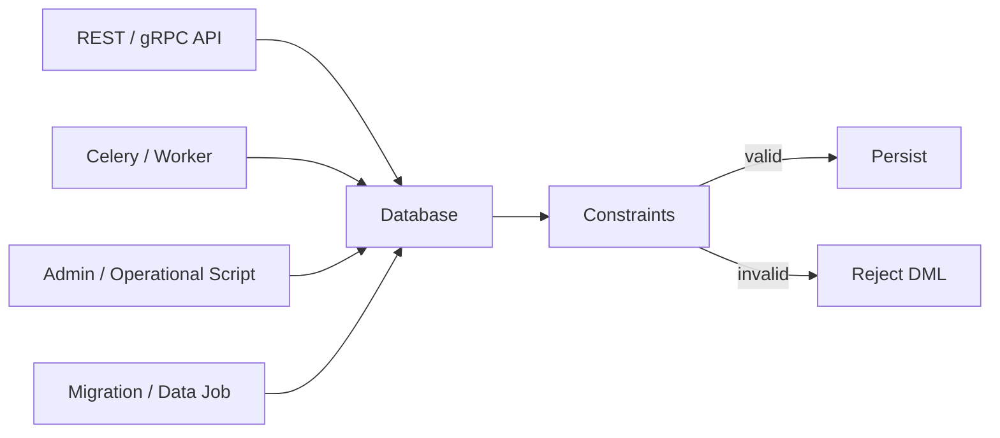
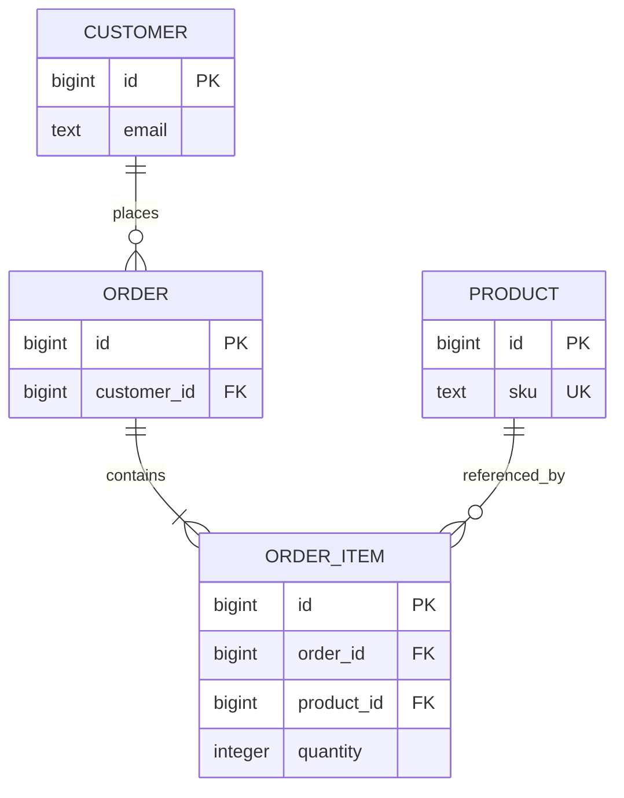

# 14- DML and Constraints

## Overview

Data Manipulation Language (DML) changes the state of database data through operations such as `INSERT`, `UPDATE`, `DELETE`, and, depending on the database, `MERGE` or upsert constructs.

Constraints define database-level invariants that DML must respect. They prevent invalid states from being persisted even when application code, background workers, migrations, or operational scripts make mistakes.

The key production principle is:

> Application validation improves user experience; database constraints enforce correctness.

Typical constraints involved in DML are:

| Constraint | Primary purpose | Typical DML impact |
|---|---|---|
| `NOT NULL` | Require a value | Rejects null inserts/updates |
| `UNIQUE` | Prevent duplicate values | Rejects conflicting inserts/updates |
| `PRIMARY KEY` | Identify a row uniquely | Rejects null or duplicate keys |
| `FOREIGN KEY` | Enforce relationships | Rejects invalid references |
| `CHECK` | Enforce row-level predicates | Rejects values violating a rule |
| `EXCLUDE` | Prevent conflicting values/ranges | Rejects conflicting rows where supported |
| `DEFAULT` | Supply a value when omitted | Changes insert behavior |

Constraints are particularly important in backend systems because multiple execution paths can modify the same data:



## DML and Constraint Enforcement

When a DML statement executes, the database evaluates the relevant constraints before allowing the transaction to reach a valid committed state.

Conceptually:

```text
DML statement
     |
     v
Identify affected rows
     |
     v
Apply expressions / modifications
     |
     v
Check applicable constraints
     |
     +---- violation ----> statement error
     |
     v
Transaction remains consistent
```

The exact timing differs by database and constraint type. Some constraints are checked immediately, while some databases support deferred constraint checking.

A failed DML statement normally produces an error rather than silently storing invalid data.

## INSERT and Constraints

`INSERT` creates new rows, so it can violate almost every common constraint.

Example:

```sql
CREATE TABLE users (
    id bigint PRIMARY KEY,
    email text NOT NULL UNIQUE,
    age integer CHECK (age >= 18)
);
```

This is valid:

```sql
INSERT INTO users (id, email, age)
VALUES (1, 'alice@example.com', 30);
```

These can fail for different reasons:

```sql
-- NOT NULL violation
INSERT INTO users (id, email, age)
VALUES (2, NULL, 30);

-- UNIQUE violation
INSERT INTO users (id, email, age)
VALUES (1, 'bob@example.com', 30);

-- CHECK violation
INSERT INTO users (id, email, age)
VALUES (3, 'bob@example.com', 16);
```

The database is enforcing different invariants at the point where the invalid state would otherwise be persisted.

## UPDATE and Constraints

`UPDATE` is frequently underestimated because it does not create a new row. However, changing an existing value can violate uniqueness, foreign-key, check, or not-null constraints.

Example:

```sql
UPDATE users
SET email = 'existing@example.com'
WHERE id = 10;
```

If another row already owns that email, the unique constraint rejects the update.

Likewise:

```sql
UPDATE users
SET age = 15
WHERE id = 10;
```

violates:

```sql
CHECK (age >= 18)
```

A production update therefore needs to be evaluated against the **post-update state**, not only the current state.

## DELETE and Constraints

`DELETE` primarily interacts with foreign-key constraints.

Suppose:

```sql
CREATE TABLE customers (
    id bigint PRIMARY KEY
);

CREATE TABLE orders (
    id bigint PRIMARY KEY,
    customer_id bigint NOT NULL REFERENCES customers(id)
);
```

If orders reference customer `1`:

```sql
DELETE FROM customers
WHERE id = 1;
```

may fail because deleting the parent would leave invalid child references.

The database can instead be configured with a foreign-key action such as:

```sql
ON DELETE CASCADE
```

or:

```sql
ON DELETE SET NULL
```

The correct action is a domain decision, not simply a convenience choice.

## Foreign-Key Actions

Common actions include:

| Action | Behavior when parent is deleted/updated |
|---|---|
| `NO ACTION` | Rejects the operation if the relationship would become invalid |
| `RESTRICT` | Prevents the parent operation when dependent rows exist |
| `CASCADE` | Propagates the delete/update |
| `SET NULL` | Sets the child FK to `NULL` |
| `SET DEFAULT` | Sets the child FK to its configured default |

Example:

```sql
CREATE TABLE order_items (
    id bigint PRIMARY KEY,
    order_id bigint NOT NULL
        REFERENCES orders(id)
        ON DELETE CASCADE
);
```

Deleting an order also deletes its items.

This can be useful when child rows have no independent business meaning.

It can be dangerous when the child records are legally, operationally, or analytically important.

## PRIMARY KEY and DML

A primary key provides row identity and implicitly requires uniqueness and non-nullability.

```sql
CREATE TABLE accounts (
    id bigint PRIMARY KEY,
    email text NOT NULL
);
```

This fails:

```sql
INSERT INTO accounts (id, email)
VALUES (NULL, 'alice@example.com');
```

It also fails when the key already exists:

```sql
INSERT INTO accounts (id, email)
VALUES (1, 'bob@example.com');
```

Primary keys are commonly generated using identity columns or equivalent database mechanisms.

For PostgreSQL:

```sql
CREATE TABLE accounts (
    id bigint GENERATED ALWAYS AS IDENTITY PRIMARY KEY,
    email text NOT NULL
);
```

The application should generally allow the database to generate the identifier rather than manually calculating the next ID.

## UNIQUE Constraints and DML

A unique constraint enforces uniqueness across the constrained key.

```sql
CREATE TABLE users (
    id bigint PRIMARY KEY,
    email text NOT NULL UNIQUE
);
```

Concurrent requests can both pass an application-level existence check:

```text
Request A -> SELECT email ... -> not found
Request B -> SELECT email ... -> not found
Request A -> INSERT
Request B -> INSERT
```

Without a database uniqueness constraint, both can succeed.

With the constraint, one operation wins and the other receives a uniqueness violation.

This is why:

```python
if not user_exists(email):
    create_user(email)
```

is not sufficient for enforcing uniqueness under concurrency.

The database constraint is the authoritative protection.

## Composite UNIQUE Constraints

Uniqueness can apply to combinations of columns.

```sql
CREATE TABLE memberships (
    organization_id bigint NOT NULL,
    user_id bigint NOT NULL,
    UNIQUE (organization_id, user_id)
);
```

This allows:

```text
(user=10, org=1)
(user=10, org=2)
```

but prevents:

```text
(user=10, org=1)
(user=10, org=1)
```

Composite uniqueness is common in multi-tenant systems.

The constraint should reflect the actual business identity of the record.

## CHECK Constraints

`CHECK` constraints enforce predicates on row values.

```sql
CREATE TABLE products (
    id bigint PRIMARY KEY,
    price numeric(12, 2) NOT NULL,
    stock integer NOT NULL,
    CHECK (price >= 0),
    CHECK (stock >= 0)
);
```

The following fails:

```sql
UPDATE products
SET stock = -5
WHERE id = 100;
```

A `CHECK` constraint is useful for invariants that can be expressed using the row's values.

Good candidates include:

- Non-negative quantities.
- Valid numeric ranges.
- Mutually compatible column values.
- Basic state restrictions.

For example:

```sql
CHECK (
    shipped_at IS NULL
    OR delivered_at IS NULL
    OR delivered_at >= shipped_at
)
```

Constraints should remain focused on invariants that belong to the database.

## NULL and CHECK Constraints

`CHECK` constraints have an important interaction with `NULL`.

In standard SQL semantics, a check passes when its expression evaluates to `TRUE` or `UNKNOWN`; it is rejected when it evaluates to `FALSE`.

For example:

```sql
CREATE TABLE users (
    age integer CHECK (age >= 18)
);
```

`age = 15` produces `FALSE` and is rejected.

But:

```sql
age = NULL
```

produces `UNKNOWN`, so the `CHECK` itself does not reject it.

If null is not allowed:

```sql
age integer NOT NULL CHECK (age >= 18)
```

Use both constraints when both invariants matter.

This distinction is a common interview and production trap.

## DEFAULT and Constraints

Defaults provide a value when an insert does not explicitly provide one.

```sql
CREATE TABLE jobs (
    id bigint PRIMARY KEY,
    status text NOT NULL DEFAULT 'pending'
);
```

This works:

```sql
INSERT INTO jobs (id)
VALUES (100);
```

The database supplies:

```text
status = 'pending'
```

But:

```sql
INSERT INTO jobs (id, status)
VALUES (101, NULL);
```

does not use the default. It violates `NOT NULL`.

The distinction is:

```text
column omitted -> DEFAULT may execute
DEFAULT        -> DEFAULT executes
NULL           -> NULL is supplied
```

## Constraint Violations and Transactions

A constraint violation is an error at the database level.

Consider:

```sql
BEGIN;

INSERT INTO users (id, email)
VALUES (1, 'alice@example.com');

INSERT INTO users (id, email)
VALUES (2, 'alice@example.com');

COMMIT;
```

The second insert violates the unique constraint.

The transaction's exact post-error behavior depends on the database and driver. In PostgreSQL, an error aborts the current transaction, so the application must roll back before issuing further transactional commands.

A Python application should therefore handle database errors deliberately:

```python
try:
    with connection:
        with connection.cursor() as cursor:
            cursor.execute(
                """
                INSERT INTO users (email)
                VALUES (%s)
                """,
                [email],
            )
except IntegrityError:
    # Translate the expected constraint violation into
    # an appropriate application-level response.
    raise
```

Do not catch every database error and convert it into a generic success response.

## DML and Constraint Ordering

A single transaction can perform several dependent operations.

For example:

```sql
BEGIN;

INSERT INTO customers (id, email)
VALUES (100, 'customer@example.com');

INSERT INTO orders (id, customer_id)
VALUES (500, 100);

COMMIT;
```

The foreign-key relationship is valid because the parent exists before the child is inserted.

However, some workflows require temporarily invalid intermediate states. Where supported, deferred constraints can allow the database to validate the final transaction state rather than every statement immediately.

This is an advanced feature and should be used only when the transaction semantics require it.

## Immediate vs Deferred Constraints

Some databases support deferrable constraints, particularly PostgreSQL.

Example:

```sql
CREATE TABLE employee_assignments (
    employee_id bigint PRIMARY KEY,
    manager_id bigint,
    CONSTRAINT employee_manager_fk
        FOREIGN KEY (manager_id)
        REFERENCES employee_assignments(employee_id)
        DEFERRABLE INITIALLY DEFERRED
);
```

The constraint can be checked at transaction commit rather than immediately after each statement.

Conceptually:

```text
Statement A -> temporary state
Statement B -> temporary state
Statement C -> final state
                         |
                         v
                     COMMIT
                         |
                         v
                  Constraint check
```

Advantages:

- Supports complex multi-step transactional changes.
- Can simplify certain cyclic or temporarily inconsistent transformations.

Limitations:

- Makes transactional behavior harder to reason about.
- Violations may surface at commit rather than at the statement that introduced them.
- Can complicate debugging and error handling.

Use deferrable constraints deliberately rather than as a workaround for poor transaction design.

## DML and Referential Integrity

Foreign keys are especially important in service architectures where multiple application paths modify related records.

For example:



DML against these tables must preserve the relationship invariants.

A senior engineer should ask:

- Can the parent be deleted?
- What happens to children?
- Can the relationship be temporarily absent?
- Is the foreign key nullable?
- Is cascade deletion appropriate?
- Can bulk jobs bypass application-level checks?
- Will deletion create unexpected data loss?

## Constraints and Upserts

Upserts rely heavily on constraints to determine conflicts.

PostgreSQL example:

```sql
INSERT INTO users (email, display_name)
VALUES ($1, $2)
ON CONFLICT (email)
DO UPDATE
SET display_name = EXCLUDED.display_name;
```

The unique constraint on `email` defines the conflict target.

The database handles the race atomically instead of requiring an unsafe application sequence:

```text
SELECT
  |
  v
Does it exist?
  |
  +-- no --> INSERT
```

The upsert instead lets the database coordinate the operation around the unique constraint.

## Constraints and Concurrency

Constraints are essential under concurrent writes.

Suppose two requests attempt:

```sql
INSERT INTO idempotency_keys (key, response_hash)
VALUES ('abc123', '...');
```

with:

```sql
UNIQUE (key)
```

Only one transaction can successfully establish that unique key.

This is a common building block for idempotent API processing.

The database constraint acts as the final concurrency boundary.

Application-level locks or Redis-based coordination can still be useful, but they should not replace a database constraint when the invariant belongs to the database.

## Constraints and Bulk DML

Bulk operations can trigger many constraint checks.

For example:

```sql
UPDATE orders
SET customer_id = $1
WHERE customer_id = $2;
```

If the target customer does not exist, a foreign-key constraint can reject the operation.

Large DML statements can also create operational pressure:

- Row locks.
- Transaction duration.
- WAL generation.
- Replica lag.
- Vacuum pressure in PostgreSQL.
- Increased contention.
- Large rollback cost.

For large migrations or data corrections, consider:

```text
Validate
   |
   v
Small batch
   |
   v
Commit
   |
   v
Measure
   |
   v
Repeat
```

Do not automatically batch every operation. A single atomic statement may be preferable when the affected set is reasonably sized and atomicity is important.

## Schema Changes and Existing Data

Adding a new constraint to an existing production table requires checking existing data first.

For example, before adding:

```sql
ALTER TABLE users
ADD CONSTRAINT users_email_not_empty
CHECK (length(trim(email)) > 0);
```

find violating rows:

```sql
SELECT id, email
FROM users
WHERE length(trim(email)) = 0
   OR email IS NULL;
```

A safe rollout commonly looks like:

```text
Existing data
    |
    v
Detect violations
    |
    v
Repair / migrate data
    |
    v
Deploy constraint
    |
    v
Application relies on invariant
```

Constraint deployment should be treated as a production migration, not simply as a DDL edit.

## Security Considerations

Constraints are not an authorization mechanism.

A `CHECK` constraint can enforce:

```sql
CHECK (amount >= 0)
```

but it cannot generally answer:

```text
Is this user allowed to modify this account?
```

Authorization belongs in the application/service or database security mechanisms such as row-level security where appropriate.

However, constraints provide valuable defense in depth against:

- Invalid references.
- Impossible states.
- Duplicate identifiers.
- Negative quantities.
- Corrupted relationships.
- Accidental writes from operational tooling.

Use both:

```text
Authorization
      +
Application validation
      +
Database constraints
```

rather than treating any one layer as sufficient.

## Monitoring Constraint Violations

Unexpected constraint violations can reveal:

- Application bugs.
- Race conditions.
- Bad deployments.
- Data migration errors.
- Contract mismatches between services.
- Incorrect retry behavior.
- Corrupted external data.

Monitor database errors at the application and infrastructure layers.

Useful metrics include:

| Signal | Why it matters |
|---|---|
| Unique violations | May indicate concurrency or duplicate requests |
| Foreign-key violations | May indicate lifecycle/order-of-operation bugs |
| Check violations | May indicate invalid business inputs |
| Not-null violations | May indicate API/schema contract mismatch |
| Transaction rollbacks | Can indicate broader DML failures |

Expected business conflicts should be distinguished from unexpected integrity failures.

For example, a duplicate email during registration might be an expected `409 Conflict`, while an unexpected foreign-key violation may indicate a service defect.

## Django and ORM Considerations

Django model validation and database constraints serve different purposes.

A Django model can define:

```python
from django.db import models


class User(models.Model):
    email = models.EmailField(unique=True)
```

The ORM can validate some conditions before issuing SQL, but concurrent requests can still race.

The database's unique constraint remains authoritative.

Similarly, bulk ORM operations can bypass some model-level behavior, signals, or validation paths.

Senior-level reasoning therefore asks:

```text
Does the invariant exist only in application code?
                    |
                    v
Can another worker / service / script violate it?
                    |
                    v
Should the database enforce it?
```

For critical invariants, prefer database-backed constraints.

## FastAPI and Service Boundaries

FastAPI or another API framework should validate request shape and provide useful client-facing errors.

For example:

```text
HTTP request
    |
    v
Pydantic validation
    |
    v
Service logic
    |
    v
SQL transaction
    |
    v
Database constraints
```

The application should translate expected integrity errors into appropriate API responses.

Do not expose raw database error messages to clients because they can reveal schema details and produce unstable API contracts.

## Common Mistakes

| Mistake | Why it is dangerous | Better approach |
|---|---|---|
| Relying only on application validation | Concurrent or alternate writers can bypass it | Enforce critical invariants in the DB |
| Checking uniqueness with `SELECT` before `INSERT` | Race condition under concurrency | Use `UNIQUE` and handle the conflict |
| Assuming `CHECK` rejects `NULL` | `UNKNOWN` can satisfy a check | Combine with `NOT NULL` when required |
| Using `ON DELETE CASCADE` everywhere | Can cause large unintended deletions | Choose referential actions deliberately |
| Catching all DB errors as duplicates | Hides real integrity failures | Handle specific constraint violations |
| Adding constraints without data cleanup | Existing rows may violate the new rule | Audit and repair before rollout |
| Updating foreign keys without checking relationships | Can cause constraint failures or unintended reassignment | Validate target relationships |
| Treating constraints as authorization | Integrity does not equal permission | Enforce authorization separately |
| Ignoring bulk-DML effects | Large operations can cause lock and replication pressure | Batch when appropriate and monitor |
| Using sentinels instead of nullable relationships | Weakens referential integrity | Model optional relationships explicitly |
| Assuming ORM validation is enough | Other writers can bypass the ORM | Make database constraints authoritative |
| Using cascades without understanding data ownership | Important records may be deleted transitively | Define retention and ownership semantics first |

## Production Best Practices

### Define Invariants at the Lowest Reliable Layer

If a rule must **always** hold, enforce it where every writer must pass.

Examples:

```text
Unique email
    -> UNIQUE

Required customer ID
    -> NOT NULL + FOREIGN KEY

Non-negative balance component
    -> CHECK

Valid parent-child relationship
    -> FOREIGN KEY
```

### Design Constraints Around Business Identity

Do not create constraints merely because they are easy to add.

Ask:

- What makes two records the same?
- Is uniqueness global or tenant-scoped?
- Is the relationship mandatory?
- Does `NULL` have meaningful semantics?
- Is deletion allowed?
- Should historical records remain immutable?

### Treat Constraint Violations as Signals

A constraint violation should not automatically be considered an application nuisance.

It can indicate:

```text
Expected conflict
    -> normal application response

Unexpected violation
    -> investigate application/data problem
```

This distinction is important for observability.

### Test Concurrent Behavior

Tests should cover more than sequential happy paths.

For uniqueness and idempotency, test:

- Two concurrent inserts.
- Retry after timeout.
- Duplicate API requests.
- Worker retries.
- Multiple service instances.
- Bulk updates.

The database constraint should remain correct regardless of execution order.

## Interview Questions

### Why are database constraints important if the application validates data?

Because application validation is not an atomic concurrency guarantee and may be bypassed by other writers. Database constraints enforce invariants at the authoritative storage boundary.

### Why can two requests both pass a uniqueness check?

Because both can execute the check before either transaction commits its insert. A unique constraint resolves the race at the database level.

### What happens when a foreign key references a deleted row?

The database follows the configured referential action, such as rejecting the delete, cascading it, setting the key to `NULL`, or applying a default.

### Why might a CHECK constraint allow NULL?

Because a check expression evaluating to `UNKNOWN` is not a `FALSE` result. If the column must be non-null, combine `CHECK` with `NOT NULL`.

### Should constraints replace application validation?

No. Application validation provides fast, user-friendly feedback and protects service contracts. Database constraints provide authoritative integrity enforcement.

### Why can a DELETE be much more expensive than expected?

A parent delete can trigger foreign-key checks or cascading operations across many child rows. The resulting locks, WAL, index changes, and transaction duration can be substantial.

## Key Takeaways

- **DML changes database state, while constraints define the invariants that every successful write must preserve.**
- **Critical invariants such as uniqueness, required values, valid relationships, and numeric rules should be enforced by database constraints, not only application code.**
- **`INSERT`, `UPDATE`, and `DELETE` interact differently with constraints, with foreign keys being especially important for updates and deletes involving related data.**
- **Concurrency, bulk DML, cascading actions, and constraint migrations can create significant production risks and require deliberate transaction and rollout strategies.**
- **Application validation and database constraints are complementary: validate early for good APIs, but enforce correctness at the database boundary.**