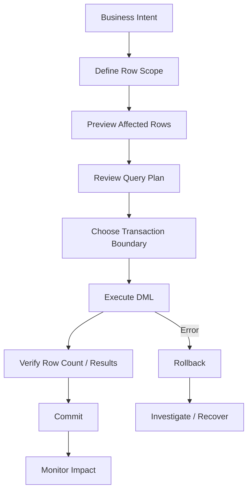

# 15- DML Rules and Safety Checklist

## Overview

Data Manipulation Language (DML) changes persistent database state through operations such as `INSERT`, `UPDATE`, `DELETE`, and upsert or `MERGE` operations.

DML is one of the highest-risk areas of production SQL because a syntactically valid statement can still:

- Modify the wrong rows.
- Delete substantially more data than intended.
- Create duplicate or inconsistent records.
- Hold locks for too long.
- Generate excessive WAL/redo/transaction-log volume.
- Cause replication lag.
- Trigger cascading changes.
- Produce application-visible inconsistencies.

A reliable DML workflow therefore treats correctness and operational safety as first-class requirements.

The core principle is:

> Never evaluate a write only by whether the SQL is syntactically correct. Evaluate which rows it affects, what constraints it changes, how much work it performs, and how safely it can be rolled back or recovered.

## DML Safety Model

A production DML operation should pass through several layers of protection:



The exact process varies by operation size and risk. A small transactional update from an API does not require the same operational workflow as a migration affecting hundreds of millions of rows.

## The Core DML Safety Checklist

Before executing production DML, verify:

- [ ] The business intent is unambiguous.
- [ ] The target table is correct.
- [ ] The target environment is correct.
- [ ] The `WHERE` clause identifies exactly the intended rows.
- [ ] The expected row count is known.
- [ ] The query has been tested against representative data.
- [ ] Existing constraints and foreign keys have been considered.
- [ ] Required indexes exist for the access path.
- [ ] The transaction boundary is appropriate.
- [ ] The operation can be rolled back or otherwise recovered.
- [ ] Locking and concurrency effects are understood.
- [ ] Replication and downstream effects are considered.
- [ ] Monitoring is available for the operation.
- [ ] Large operations have an explicit batching or throttling strategy.
- [ ] Sensitive data is not exposed through logs or diagnostics.

## Define the Business Intent First

SQL should implement a clearly defined business operation rather than become the source of the business decision.

For example:

```text
Deactivate customers who:
- have been inactive for more than 24 months
- have no active subscription
- are not under legal retention
```

This should become a precise predicate:

```sql
UPDATE customers
SET status = 'inactive',
    updated_at = CURRENT_TIMESTAMP
WHERE last_active_at < CURRENT_TIMESTAMP - INTERVAL '24 months'
  AND NOT EXISTS (
      SELECT 1
      FROM subscriptions s
      WHERE s.customer_id = customers.id
        AND s.status = 'active'
  )
  AND legal_hold = FALSE;
```

The important step is not writing `UPDATE`. It is translating the business rule into an exact, reviewable row-selection predicate.

## Always Inspect the Target Rows

Before an `UPDATE` or `DELETE`, run the equivalent `SELECT`.

Instead of immediately executing:

```sql
DELETE FROM sessions
WHERE expires_at < CURRENT_TIMESTAMP;
```

first inspect:

```sql
SELECT id, user_id, expires_at
FROM sessions
WHERE expires_at < CURRENT_TIMESTAMP
ORDER BY expires_at
LIMIT 100;
```

Then determine the total scope:

```sql
SELECT COUNT(*)
FROM sessions
WHERE expires_at < CURRENT_TIMESTAMP;
```

This gives you two different signals:

| Check | Purpose |
|---|---|
| Sample rows | Confirm the predicate selects the correct records |
| `COUNT(*)` | Estimate operation size |
| Query plan | Understand how the database will find them |
| Existing constraints | Understand downstream effects |

The sample should contain enough representative records to expose mistakes in the predicate.

## The WHERE Clause Is a Safety Boundary

For `UPDATE` and `DELETE`, the `WHERE` clause determines the rows that can be modified.

This is dangerous:

```sql
UPDATE users
SET status = 'disabled';
```

It affects every row.

The safer form is:

```sql
UPDATE users
SET status = 'disabled'
WHERE id = 1001;
```

For production operations, avoid mentally treating the `WHERE` clause as optional syntax. Treat it as part of the authorization boundary of the database operation.

## Primary-Key Targeting

When modifying a specific row, prefer a primary key or another uniquely constrained identifier.

```sql
UPDATE orders
SET status = 'cancelled'
WHERE id = 90001;
```

is safer than:

```sql
UPDATE orders
SET status = 'cancelled'
WHERE customer_id = 42;
```

if the intention is to modify only one order.

If the business operation genuinely targets multiple rows, the predicate should explicitly describe that set.

## Verify Expected Row Counts

A production write should have an expected cardinality.

For example:

```text
Expected: 1 row
Actual:   1 row
```

is materially different from:

```text
Expected: 1 row
Actual:   83,214 rows
```

Applications should also avoid silently ignoring affected-row counts when correctness depends on them.

Conceptually:

```python
cursor.execute(
    """
    UPDATE orders
    SET status = %s
    WHERE id = %s
      AND status = %s
    """,
    ["cancelled", order_id, "pending"],
)

if cursor.rowcount != 1:
    raise RuntimeError("Unexpected order update count")
```

The exact behavior of `rowcount` varies by driver and statement type, so application code should follow the semantics documented by its database driver.

## Optimistic Concurrency

A particularly useful safety technique is to include the expected current state in the `WHERE` clause.

Instead of:

```sql
UPDATE accounts
SET status = 'closed'
WHERE id = 100;
```

use:

```sql
UPDATE accounts
SET status = 'closed',
    updated_at = CURRENT_TIMESTAMP
WHERE id = 100
  AND status = 'open';
```

This prevents an operation from blindly overwriting a state that may have changed concurrently.

For version-based optimistic locking:

```sql
UPDATE documents
SET content = $1,
    version = version + 1,
    updated_at = CURRENT_TIMESTAMP
WHERE id = $2
  AND version = $3;
```

If zero rows are affected, another transaction may have modified the document.

This pattern is particularly useful in REST APIs, admin workflows, and distributed services.

## Parameterize DML

Never construct SQL by interpolating untrusted input.

Unsafe:

```python
query = f"""
UPDATE users
SET display_name = '{display_name}'
WHERE id = {user_id}
"""
```

Use parameterized SQL:

```python
cursor.execute(
    """
    UPDATE users
    SET display_name = %s
    WHERE id = %s
    """,
    [display_name, user_id],
)
```

Parameterized statements protect against SQL injection and allow the database driver to handle values correctly.

Parameterization does not mean identifiers can always be supplied as parameters. Dynamic table or column identifiers require database-specific identifier handling or strict allowlists.

## INSERT Safety

For `INSERT`, explicitly define the target columns.

Prefer:

```sql
INSERT INTO users (
    email,
    display_name,
    status
)
VALUES (
    $1,
    $2,
    'active'
);
```

over:

```sql
INSERT INTO users
VALUES ($1, $2, 'active');
```

Explicit columns make the statement resilient to schema changes and easier to review.

Database constraints should enforce critical invariants:

```sql
CREATE TABLE users (
    id bigint GENERATED ALWAYS AS IDENTITY PRIMARY KEY,
    email text NOT NULL UNIQUE,
    display_name text NOT NULL,
    status text NOT NULL CHECK (status IN ('active', 'disabled'))
);
```

Application validation improves error handling, but the database should remain authoritative for storage integrity.

## Safe Multiple-Row INSERT

For bulk insertion, use a set-based operation rather than issuing thousands of independent network round trips when the workload permits.

```sql
INSERT INTO order_items (
    order_id,
    product_id,
    quantity
)
VALUES
    ($1, $2, $3),
    ($4, $5, $6),
    ($7, $8, $9);
```

For larger datasets, database-specific bulk-loading facilities may be more appropriate.

Consider:

- Transaction size.
- Constraint checks.
- Index maintenance.
- WAL/redo volume.
- Lock duration.
- Replication lag.
- Failure and retry behavior.

## UPDATE Safety

A safe `UPDATE` should make four things clear:

1. Which table is modified.
2. Which columns change.
3. Which rows qualify.
4. What happens if zero or unexpectedly many rows qualify.

Example:

```sql
UPDATE inventory
SET available_quantity = available_quantity - $1,
    updated_at = CURRENT_TIMESTAMP
WHERE product_id = $2
  AND warehouse_id = $3
  AND available_quantity >= $1;
```

This is safer than:

```sql
SELECT available_quantity
FROM inventory
WHERE product_id = $2;

UPDATE inventory
SET available_quantity = available_quantity - $1
WHERE product_id = $2;
```

The second pattern can introduce a race between the read and the write and may also update more rows than intended.

## DELETE Safety

`DELETE` requires especially strong controls because the operation is destructive.

Before:

```sql
DELETE FROM users
WHERE status = 'inactive';
```

inspect:

```sql
SELECT id, email, status
FROM users
WHERE status = 'inactive'
ORDER BY id
LIMIT 100;
```

and:

```sql
SELECT COUNT(*)
FROM users
WHERE status = 'inactive';
```

If deletion is irreversible from an operational perspective, verify whether soft deletion, archival, or retention policies are more appropriate.

## Soft Delete vs Hard Delete

A soft delete usually marks a row instead of physically deleting it:

```sql
UPDATE users
SET deleted_at = CURRENT_TIMESTAMP
WHERE id = $1
  AND deleted_at IS NULL;
```

A hard delete physically removes the row:

```sql
DELETE FROM users
WHERE id = $1;
```

| Approach | Advantages | Limitations |
|---|---|---|
| Soft delete | Recoverable, useful for audit/history | Requires filtering and storage |
| Hard delete | Simple and removes data | Recovery is harder |
| Archive then delete | Controls primary-table size | More operational complexity |

Soft deletion is not automatically safer. It can create unique-index, query-filtering, retention, and storage complications.

## Transaction Boundaries

Transactions provide atomicity for related DML.

Example:

```sql
BEGIN;

UPDATE accounts
SET balance = balance - 100
WHERE id = 1;

UPDATE accounts
SET balance = balance + 100
WHERE id = 2;

COMMIT;
```

If the operation cannot safely be split, both changes should belong to the same transaction.

However, transactions should not remain open unnecessarily.

Long-running transactions can cause:

- Lock contention.
- Transaction ID pressure.
- Vacuum delays in PostgreSQL.
- Increased storage usage.
- Replica lag.
- Larger rollback work.

The correct principle is:

> Keep the transaction long enough to preserve the required invariant, but no longer.

## Rollback Strategy

For manual production DML, understand rollback before execution.

For transactional DML:

```sql
BEGIN;

UPDATE products
SET price = price * 1.10
WHERE category_id = 20;

-- Validate results before committing.

ROLLBACK;
```

After validation:

```sql
BEGIN;

UPDATE products
SET price = price * 1.10
WHERE category_id = 20;

COMMIT;
```

Do not assume every database operation can be reversed with `ROLLBACK`. Some DDL, external side effects, and administrative operations have different transactional behavior depending on the database.

For destructive operations, recovery planning should also consider:

- Backups.
- Point-in-time recovery.
- Replica availability.
- Audit records.
- Before/after identifiers.
- Recovery time objectives.

## Preview Before UPDATE or DELETE

A highly effective operational pattern is:

```sql
SELECT id
FROM target_table
WHERE <production predicate>;
```

followed by:

```sql
UPDATE target_table
SET ...
WHERE <same production predicate>;
```

or:

```sql
DELETE FROM target_table
WHERE <same production predicate>;
```

The predicates should be kept identical.

For complicated operations, materializing the intended IDs into a temporary or staging structure can reduce the risk of the selection changing between preview and execution.

## Query Plans and DML

`EXPLAIN` is useful for understanding how the database will locate affected rows.

For example:

```sql
EXPLAIN
UPDATE orders
SET status = 'expired'
WHERE expires_at < CURRENT_TIMESTAMP
  AND status = 'pending';
```

The plan can reveal whether the database is likely to perform:

- An index scan.
- A sequential scan.
- A bitmap scan.
- A join.
- Other database-specific operations.

For a production DML statement, the important question is not simply:

> Does this use an index?

It is:

> Is the chosen access path appropriate for the number and distribution of rows being modified?

An index may not be beneficial when a large fraction of a table must be updated.

## Large DML Operations

A single large update can be operationally expensive.

For example:

```sql
UPDATE events
SET archived = TRUE
WHERE created_at < CURRENT_TIMESTAMP - INTERVAL '2 years';
```

If this affects tens or hundreds of millions of rows, it can generate substantial database work.

Potential consequences include:

- Large WAL/redo generation.
- Long transactions.
- Extended locks.
- Replica lag.
- Table/index bloat.
- Increased I/O.
- Large rollback requirements.

For large maintenance operations, batching may be safer:

```sql
WITH batch AS (
    SELECT id
    FROM events
    WHERE created_at < CURRENT_TIMESTAMP - INTERVAL '2 years'
      AND archived = FALSE
    ORDER BY id
    LIMIT 5000
)
UPDATE events e
SET archived = TRUE
FROM batch
WHERE e.id = batch.id;
```

Repeat until no rows remain.

Batching introduces additional complexity, so it should be combined with:

- Deterministic ordering.
- Progress monitoring.
- Retry handling.
- Appropriate transaction boundaries.
- Rate limiting when necessary.

## DML with JOIN

Joined DML can be powerful but increases the risk of unintended row selection.

For example, PostgreSQL supports:

```sql
UPDATE orders o
SET status = 'priority'
FROM customers c
WHERE o.customer_id = c.id
  AND c.tier = 'enterprise'
  AND o.status = 'pending';
```

Before execution, inspect the equivalent result:

```sql
SELECT o.id, o.status, c.tier
FROM orders o
JOIN customers c
  ON c.id = o.customer_id
WHERE c.tier = 'enterprise'
  AND o.status = 'pending';
```

The join cardinality matters. If the join can produce multiple matches for a target row, understand the database-specific semantics and eliminate ambiguity where possible.

## DELETE with JOIN

Joined deletes require the same discipline.

PostgreSQL example:

```sql
DELETE FROM sessions s
USING users u
WHERE s.user_id = u.id
  AND u.status = 'deleted';
```

Preview first:

```sql
SELECT s.id, s.user_id
FROM sessions s
JOIN users u
  ON u.id = s.user_id
WHERE u.status = 'deleted';
```

Be particularly careful when the joined table contains duplicate or unexpected relationships.

## Upsert Safety

Upserts are often safer than an application-level:

```text
SELECT -> decide -> INSERT/UPDATE
```

because the conflict is resolved atomically by the database.

PostgreSQL example:

```sql
INSERT INTO user_preferences (
    user_id,
    timezone
)
VALUES ($1, $2)
ON CONFLICT (user_id)
DO UPDATE
SET timezone = EXCLUDED.timezone;
```

The unique constraint on `user_id` defines the conflict boundary.

Upserts still require careful consideration of:

- Which columns are overwritten.
- Whether updates should happen for every conflict.
- Trigger behavior.
- `updated_at` semantics.
- Concurrent modifications.
- Returned values.

## Constraints Are a Safety Net

Critical invariants should be enforced by the database.

Examples:

```sql
email text NOT NULL UNIQUE
```

```sql
customer_id bigint NOT NULL REFERENCES customers(id)
```

```sql
quantity integer NOT NULL CHECK (quantity >= 0)
```

Application code should still validate inputs, but database constraints protect against:

- Concurrent requests.
- Background workers.
- Admin tools.
- Data migrations.
- Other services.
- Operational scripts.

## Foreign Keys and Destructive DML

Before deleting parent rows, inspect dependent records.

```sql
SELECT COUNT(*)
FROM orders
WHERE customer_id = $1;
```

Then understand the configured foreign-key behavior.

```text
DELETE parent
     |
     +-- RESTRICT / NO ACTION --> reject
     |
     +-- CASCADE -------------> delete children
     |
     +-- SET NULL ------------> nullify relationship
```

Do not choose cascading deletes solely because they eliminate foreign-key errors.

Cascade behavior should match the ownership and retention semantics of the data.

## DML and Application Retries

Retries are common in distributed systems, but retrying DML blindly can create duplicate or repeated effects.

For example:

```text
API request
   |
   v
INSERT
   |
   +-- timeout after commit
           |
           v
       client retries
```

The original operation may already have succeeded.

Idempotency keys and unique constraints can protect operations such as payments, order creation, and message processing.

Example:

```sql
CREATE TABLE idempotency_keys (
    key text PRIMARY KEY,
    created_at timestamptz NOT NULL DEFAULT CURRENT_TIMESTAMP
);
```

The database constraint makes duplicate processing detectable.

## Logging and Auditability

Production DML should be observable without exposing sensitive data.

Useful information includes:

- Operation type.
- Application/service name.
- Request or job identifier.
- Target entity type.
- Number of affected rows.
- Duration.
- Success/failure.
- Constraint or error category.

Avoid logging:

- Passwords.
- Authentication tokens.
- Payment credentials.
- Sensitive personal data.
- Full SQL statements containing secrets or sensitive parameters.

For high-risk administrative operations, maintain an audit trail containing who performed the action, what was changed, when it happened, and the associated change/request identifier.

## Permissions and Least Privilege

Applications should not normally have unrestricted database privileges.

Separate roles where appropriate:

```text
Application role
    -> required DML only

Migration role
    -> schema/data migration permissions

Read-only analytics role
    -> SELECT only

Operational admin role
    -> tightly controlled elevated access
```

Least privilege reduces the blast radius of:

- SQL injection.
- Application bugs.
- Misconfigured jobs.
- Compromised credentials.
- Human mistakes.

## Production DML Workflow

A practical workflow for a high-risk manual or migration DML operation is:

### Define

Document:

- Business purpose.
- Target environment.
- Target table.
- Expected number of rows.
- Expected final state.
- Owner.
- Rollback/recovery strategy.

### Inspect

Run:

```sql
SELECT ...
FROM ...
WHERE ...;
```

and:

```sql
SELECT COUNT(*)
FROM ...
WHERE ...;
```

Confirm that the selected records are correct.

### Analyze

Review:

```sql
EXPLAIN ...
```

Consider:

- Indexes.
- Lock behavior.
- Join cardinality.
- Transaction duration.
- Replica impact.
- Trigger/cascade behavior.

### Execute

Use an appropriate transaction:

```sql
BEGIN;

-- DML

-- Verify affected rows and results.

COMMIT;
```

For large operations, use controlled batches rather than an unnecessarily large transaction.

### Verify

Check:

```sql
SELECT COUNT(*)
FROM ...
WHERE <expected post-condition>;
```

Also verify application-level effects and downstream systems when applicable.

### Monitor

Watch:

- Query latency.
- Lock waits.
- CPU.
- Memory.
- I/O.
- WAL/redo generation.
- Replica lag.
- Error rates.
- Application latency.

## Environment Safety

A common operational mistake is executing correct SQL against the wrong database.

Before manual DML:

```sql
SELECT current_database();
```

For PostgreSQL, additional context can be useful:

```sql
SELECT
    current_database(),
    current_user,
    inet_server_addr(),
    inet_server_port();
```

The exact diagnostic commands differ across database systems.

Operational tooling should make the environment obvious and, where possible, prevent production execution without explicit confirmation.

## DML in CI/CD and Migrations

Production data changes should preferably be represented as reviewed, version-controlled migrations or controlled operational jobs rather than undocumented shell history.

A migration should be:

- Reproducible.
- Reviewable.
- Idempotent where practical.
- Tested against realistic data volumes.
- Observable.
- Safe to deploy incrementally when necessary.

Do not assume a migration that works on a small development database will behave similarly on production data.

Differences in:

- Table size.
- Data distribution.
- Index selectivity.
- Concurrent traffic.
- Lock contention.
- Replica topology.

can materially change production behavior.

## Common Mistakes and Pitfalls

| Mistake | Risk | Prevention |
|---|---|---|
| Running `UPDATE` without `WHERE` | Entire table is modified | Require explicit scope |
| Running `DELETE` without preview | Large unintended data loss | Run equivalent `SELECT` first |
| Assuming `WHERE id = ...` affects one row | Schema may not enforce uniqueness | Use primary/unique keys |
| Ignoring affected-row count | Wrong scope can go unnoticed | Compare actual vs expected cardinality |
| Using application read-then-write logic | Race conditions | Use atomic SQL, constraints, or locking |
| Running huge DML in one transaction | Locks, WAL, lag, rollback pressure | Batch when appropriate |
| Ignoring foreign keys | DML may fail or cascade unexpectedly | Inspect relationships and actions |
| Blindly retrying writes | Duplicate side effects | Design idempotency |
| Logging raw SQL with parameters | Sensitive-data exposure | Use structured, sanitized logs |
| Testing only on small datasets | Production plan may differ | Test representative scale |
| Executing against the wrong environment | Potential production outage/data loss | Verify database/user/host |
| Assuming ORM validation is authoritative | Other writers bypass it | Enforce critical invariants in DB |
| Using `CASCADE` casually | Transitive deletion | Model ownership and retention explicitly |
| Ignoring replica lag | Read replicas become stale | Monitor and throttle large writes |
| Treating rollback as a recovery plan | Some effects are not transactionally reversible | Have backups/PITR and recovery procedures |

## Operational Checklist by Risk Level

| Risk | Typical example | Minimum controls |
|---|---|---|
| Low | Single-row update by primary key | Transaction, parameterization, affected-row check |
| Medium | Multi-row business update | Preview, count, transaction, query-plan review |
| High | Large production update/delete | Backup/recovery verification, batching, monitoring, controlled rollout |
| Critical | Destructive or compliance-sensitive change | Peer approval, explicit change record, recovery plan, audit trail, staged execution |

## Backend Engineering Checklist

### Before Writing SQL

- [ ] Identify the exact business operation.
- [ ] Identify the correct environment.
- [ ] Identify the target table.
- [ ] Identify the target rows.
- [ ] Determine expected cardinality.
- [ ] Check constraints and relationships.
- [ ] Determine whether the operation must be atomic.
- [ ] Determine whether concurrent writes are possible.

### Before UPDATE or DELETE

- [ ] Run an equivalent `SELECT`.
- [ ] Inspect representative rows.
- [ ] Run `COUNT(*)` where appropriate.
- [ ] Verify the `WHERE` predicate.
- [ ] Review joins.
- [ ] Review foreign-key and cascade behavior.
- [ ] Review the query plan.
- [ ] Determine whether batching is required.

### During Execution

- [ ] Use parameterized SQL.
- [ ] Use the correct transaction boundary.
- [ ] Track affected rows.
- [ ] Monitor locks and latency.
- [ ] Monitor replica lag for large writes.
- [ ] Stop if observed behavior deviates from expectations.

### After Execution

- [ ] Verify post-conditions.
- [ ] Verify expected row counts.
- [ ] Check application behavior.
- [ ] Check downstream effects where applicable.
- [ ] Review errors and lock behavior.
- [ ] Record the operation and outcome for high-risk changes.

## Interview Traps

### Is `SELECT` followed by `UPDATE` always safe?

No. Another transaction can change the row between the two statements. Atomic predicates, optimistic locking, appropriate isolation, or explicit locking may be required.

### Is an indexed `WHERE` clause automatically safe?

No. Indexing affects access efficiency, not correctness. A perfectly indexed query can still update every row matching an incorrect predicate.

### Is a transaction enough to make a DELETE safe?

No. A transaction provides atomicity according to the database's transactional semantics, but it does not prevent an incorrectly scoped delete from being committed.

### Should large updates always be batched?

No. Batching reduces the operational impact of large writes but adds complexity and may weaken all-or-nothing semantics. The correct choice depends on data volume, lock requirements, recovery objectives, and workload characteristics.

### Why can an UPDATE cause replication lag?

Updates generate database change records and require storage/index work. A large write can generate changes faster than replicas can replay them.

### Why are database constraints part of DML safety?

They enforce invariants at the storage boundary and protect against concurrent writers, application bugs, background jobs, migrations, and operational mistakes.

## Key Takeaways

- **Treat every production DML statement as a controlled state transition: define scope, preview rows, analyze impact, execute deliberately, and verify the result.**
- **For `UPDATE` and `DELETE`, the `WHERE` clause is the primary safety boundary; validate its expected cardinality before execution.**
- **Use transactions, constraints, parameterized SQL, optimistic concurrency, and idempotency to protect correctness under failures and concurrent writes.**
- **Large DML requires operational planning for locks, WAL/redo volume, replication lag, batching, monitoring, and recovery.**
- **Production-safe SQL is not only about correct syntax; it is about correctness, blast radius, observability, recoverability, and controlled execution.**