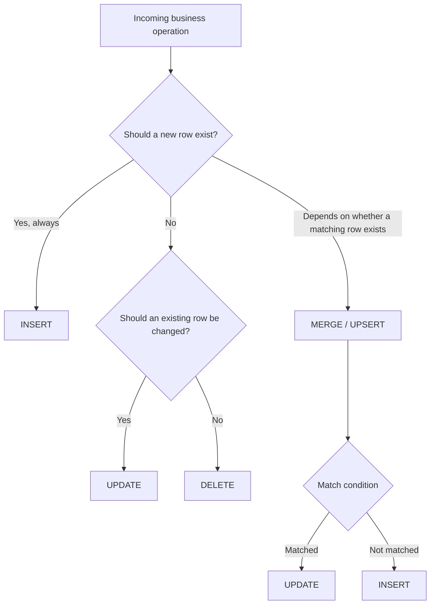
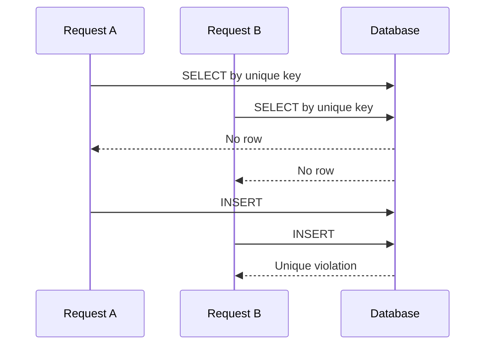
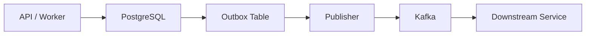

# 16- Choosing INSERT UPDATE DELETE MERGE

## Overview

`INSERT`, `UPDATE`, `DELETE`, and `MERGE` are the primary SQL operations for changing persistent relational data. Choosing between them is fundamentally a data-state and concurrency decision, not merely a syntax decision.

The correct operation depends on what the business operation means:

- **`INSERT`** — a new row should exist.
- **`UPDATE`** — an existing row should change.
- **`DELETE`** — an existing row should no longer exist.
- **`MERGE` / upsert** — incoming data must be reconciled with existing data according to matching rules.

The most important distinction is whether the application already knows the target state and identity of the row, or whether it needs to determine whether a row exists and then insert or update it.

## Decision Framework

A useful first decision tree is:



The key question for `MERGE` or an upsert is:

> What uniquely determines whether the incoming record corresponds to an existing record?

That match condition should normally be backed by a unique or primary-key constraint.

## Choosing the Operation

| Operation | Intent | Typical trigger | Main safety concern |
|---|---|---|---|
| `INSERT` | Create a new row | Resource creation | Duplicate records |
| `UPDATE` | Change existing state | Resource modification | Wrong-row updates / lost updates |
| `DELETE` | Remove existing state | Resource deletion/retention | Irreversible data loss |
| `MERGE` | Reconcile source and target | Synchronization/bulk ingestion | Ambiguous matching and unintended changes |
| Upsert | Insert or update atomically | Idempotent ingestion | Incorrect conflict key or overwrite |

The terminology differs slightly across database systems. `MERGE` is a standardized-style SQL construct, while database-specific upsert syntax such as PostgreSQL's `INSERT ... ON CONFLICT` is often preferable for simple conflict-based writes.

## INSERT

### What It Is

`INSERT` creates one or more rows in a table.

```sql
INSERT INTO users (
    email,
    display_name,
    status
)
VALUES (
    $1,
    $2,
    'active'
);
```

It is the correct operation when the business meaning is:

> This entity does not yet exist and should be created.

### When to Use It

Use `INSERT` when:

- A new resource is being created.
- A new event or audit record is being recorded.
- A new child entity is being created.
- An immutable historical record is being appended.
- The application knows the row should not already exist.

For example, creating an order:

```sql
INSERT INTO orders (
    customer_id,
    status,
    total_amount
)
VALUES (
    $1,
    'pending',
    $2
)
RETURNING id, created_at;
```

### Advantages

- Clear business intent.
- Simple execution model.
- Works naturally with auto-generated primary keys.
- Can be protected by `UNIQUE` constraints.
- Supports bulk insertion.

### Limitations

`INSERT` alone does not express what should happen when the target already exists.

For example:

```sql
INSERT INTO users (email)
VALUES ($1);
```

may fail with a unique constraint violation if the email already exists.

Do not solve this by blindly catching the error and issuing an `UPDATE` unless the concurrency semantics have been deliberately designed.

## INSERT and Duplicate Prevention

A unique constraint should normally define identity where duplicates are forbidden.

```sql
CREATE TABLE users (
    id bigint GENERATED ALWAYS AS IDENTITY PRIMARY KEY,
    email text NOT NULL UNIQUE,
    display_name text NOT NULL
);
```

Then:

```sql
INSERT INTO users (
    email,
    display_name
)
VALUES (
    $1,
    $2
);
```

The database, rather than application timing, determines whether the value is unique.

This is important under concurrent requests:

```text
Request A ──┐
            ├── INSERT email=X
Request B ──┘
```

Both requests may believe the email is available. A unique constraint provides the final correctness guarantee.

## UPDATE

### What It Is

`UPDATE` changes values in existing rows.

```sql
UPDATE users
SET display_name = $1,
    updated_at = CURRENT_TIMESTAMP
WHERE id = $2;
```

Use it when the target row is already known and the business operation means:

> Change the state of this existing entity.

### When to Use It

Typical examples include:

- Updating a user's profile.
- Changing an order state.
- Adjusting inventory.
- Marking records as processed.
- Applying a state transition.
- Updating denormalized data.

Example:

```sql
UPDATE orders
SET status = 'shipped',
    shipped_at = CURRENT_TIMESTAMP
WHERE id = $1
  AND status = 'paid';
```

The additional state predicate prevents an invalid transition from being silently applied.

### Advantages

- Directly expresses state mutation.
- Efficient for known rows.
- Can perform set-based updates.
- Can atomically incorporate business predicates.

### Limitations

An `UPDATE` assumes the row exists or that the application is prepared for zero affected rows.

It can also overwrite a concurrent change:

```sql
UPDATE documents
SET content = $1
WHERE id = $2;
```

If two clients independently read version `10` and both update the document, one change may overwrite the other.

Optimistic concurrency can solve this:

```sql
UPDATE documents
SET content = $1,
    version = version + 1,
    updated_at = CURRENT_TIMESTAMP
WHERE id = $2
  AND version = $3;
```

If zero rows are affected, the application can treat the operation as a concurrency conflict.

## UPDATE vs INSERT

Use the existence model to distinguish them:

```text
Does the entity already exist?

No  -> INSERT
Yes -> UPDATE
```

But the important engineering question is who determines existence.

An unsafe application pattern is:

```text
SELECT
  ↓
if found:
    UPDATE
else:
    INSERT
```

This creates a race:



For concurrent operations, prefer an atomic database mechanism such as an upsert when the semantics are genuinely "insert if absent, otherwise update."

## DELETE

### What It Is

`DELETE` removes rows from a table.

```sql
DELETE FROM sessions
WHERE id = $1;
```

Use it when the business meaning is:

> This row should no longer exist in this table.

### When to Use It

Typical use cases include:

- Expired sessions.
- Temporary records.
- Data subject deletion.
- Retention enforcement.
- Removing obsolete relationships.
- Cleanup of intentionally disposable data.

### Advantages

- Clearly removes the target row.
- Can reclaim storage eventually depending on the database and maintenance model.
- Can enforce retention requirements.
- Works naturally with foreign-key relationships.

### Limitations

Deletion may be difficult or impossible to recover without backups or other recovery mechanisms.

Foreign keys may also cause:

- Deletion failure.
- Cascading deletes.
- Related rows being set to `NULL`.

Therefore, `DELETE` should receive stricter operational scrutiny than ordinary updates.

## DELETE vs Soft Delete

Not every logical deletion should use physical `DELETE`.

A soft-delete design might use:

```sql
UPDATE users
SET deleted_at = CURRENT_TIMESTAMP
WHERE id = $1
  AND deleted_at IS NULL;
```

Choose soft deletion when historical retention or application-level recovery is important.

Choose hard deletion when:

- Data is genuinely disposable.
- Retention requirements require physical removal.
- The entity has no required historical representation.
- The storage model intentionally treats the row as ephemeral.

Soft deletion introduces its own complexity because every relevant query may need to exclude deleted rows.

## MERGE

### What It Is

`MERGE` reconciles rows from a source with a target based on a match condition.

Conceptually:

```text
Source row
    |
    v
Match target?
   / \
 Yes  No
  |    |
UPDATE INSERT
```

A representative form is:

```sql
MERGE INTO target_table AS t
USING source_table AS s
ON t.external_id = s.external_id
WHEN MATCHED THEN
    UPDATE SET
        name = s.name,
        status = s.status
WHEN NOT MATCHED THEN
    INSERT (external_id, name, status)
    VALUES (s.external_id, s.name, s.status);
```

Exact `MERGE` capabilities and syntax vary across database engines.

### Why MERGE Exists

`MERGE` is useful when the operation is fundamentally a reconciliation between a source dataset and a target dataset.

Typical use cases include:

- Data synchronization.
- ETL pipelines.
- Warehouse loading.
- Periodic imports.
- Synchronizing external-system records.
- Applying a source snapshot to a target table.

It is particularly useful when there are multiple actions based on matching state.

For example:

```text
Matched     -> UPDATE
Not matched -> INSERT
Matched but no longer valid -> possibly DELETE
```

The exact supported actions depend on the database implementation.

## MERGE vs Upsert

These concepts overlap but are not identical.

An upsert usually means:

```text
INSERT
    +
ON CONFLICT / duplicate-key behavior
    ↓
UPDATE
```

`MERGE` generally provides a more expressive source-to-target reconciliation model.

| Requirement | Prefer |
|---|---|
| Insert if missing, otherwise update | Upsert |
| PostgreSQL conflict-key operation | `INSERT ... ON CONFLICT` |
| Synchronize a source dataset | `MERGE` |
| Multiple source/target actions | `MERGE` |
| Simple API idempotency | Upsert |
| Bulk data reconciliation | `MERGE` or database-specific bulk strategy |

Do not choose `MERGE` merely because it can perform an upsert. Simpler SQL is often easier to review and operate.

## PostgreSQL Upsert

PostgreSQL commonly uses `INSERT ... ON CONFLICT`.

```sql
INSERT INTO user_preferences (
    user_id,
    timezone
)
VALUES (
    $1,
    $2
)
ON CONFLICT (user_id)
DO UPDATE SET
    timezone = EXCLUDED.timezone,
    updated_at = CURRENT_TIMESTAMP
RETURNING user_id, timezone, updated_at;
```

This is often preferable to a generic `MERGE` when the requirement is simply:

> Create this record, or update it when the unique key already exists.

The conflict target should correspond to an appropriate uniqueness constraint.

```sql
CREATE UNIQUE INDEX user_preferences_user_id_idx
ON user_preferences (user_id);
```

## Choosing Based on Business Semantics

A useful mapping is:

| Business requirement | SQL operation |
|---|---|
| "Create a new customer" | `INSERT` |
| "Change this customer's phone number" | `UPDATE` |
| "Remove this expired session" | `DELETE` |
| "Create preference if absent, otherwise change it" | Upsert |
| "Synchronize external customer records" | `MERGE` / bulk upsert |
| "Record every payment event" | `INSERT` |
| "Mark an order as shipped" | `UPDATE` |
| "Permanently remove records required by retention policy" | `DELETE` |

The operation should follow the domain semantics, not the convenience of the SQL syntax.

## API-to-DML Mapping

For REST APIs, DML often maps naturally to resource semantics.

| HTTP operation | Common SQL operation | Example |
|---|---|---|
| `POST /users` | `INSERT` | Create user |
| `GET /users/{id}` | `SELECT` | Read user |
| `PATCH /users/{id}` | `UPDATE` | Partial modification |
| `PUT /users/{id}` | `UPDATE` / upsert depending on contract | Replace known resource |
| `DELETE /users/{id}` | `DELETE` or soft-delete `UPDATE` | Remove resource |

The mapping is not mandatory. API semantics and database semantics are separate layers.

For example, an HTTP `DELETE` may intentionally produce:

```sql
UPDATE users
SET deleted_at = CURRENT_TIMESTAMP
WHERE id = $1;
```

when the application's deletion policy is soft deletion.

## Data Ingestion Example

Consider an external payment provider sending customer records.

The application receives:

```text
external_customer_id
email
name
status
```

If every record represents a new immutable event:

```sql
INSERT INTO payment_events (...);
```

If the record represents the current state of a known customer:

```sql
UPDATE customers
SET email = $2,
    name = $3,
    status = $4
WHERE external_customer_id = $1;
```

If the customer may or may not already exist:

```sql
INSERT INTO customers (
    external_customer_id,
    email,
    name,
    status
)
VALUES ($1, $2, $3, $4)
ON CONFLICT (external_customer_id)
DO UPDATE SET
    email = EXCLUDED.email,
    name = EXCLUDED.name,
    status = EXCLUDED.status;
```

The third operation is appropriate only if the external identifier is the correct identity boundary.

## Idempotency and Operation Selection

Idempotency is an important reason to prefer database-native upsert patterns.

Suppose a payment service retries an operation:

```text
Request
  |
  v
INSERT
  |
  +-- timeout
  |
  v
Retry
```

The original request may have committed even though the client did not receive the response.

A unique idempotency key can prevent duplicate creation:

```sql
CREATE TABLE payment_requests (
    idempotency_key text PRIMARY KEY,
    payment_id bigint NOT NULL,
    created_at timestamptz NOT NULL DEFAULT CURRENT_TIMESTAMP
);
```

The database constraint defines the duplicate boundary.

Do not use Redis alone as the final uniqueness guarantee when the database itself owns the transaction and durable state.

## Performance Considerations

Choosing the operation also affects database workload.

### INSERT

Costs can include:

- Heap/table insertion.
- Index maintenance.
- Constraint checks.
- WAL/redo generation.
- Trigger execution.

### UPDATE

An update may be more expensive than expected because indexed columns can require additional index maintenance. In PostgreSQL, updates can also interact with MVCC and table/index bloat.

### DELETE

Deletes generate transactional work and can leave storage requiring later cleanup depending on the database engine.

### MERGE / Upsert

These can perform both lookup and write work. Their efficiency depends heavily on:

- Match-key indexing.
- Source size.
- Target size.
- Conflict frequency.
- Constraint design.
- Transaction size.

The right operation is therefore not simply the one with the fewest SQL keywords.

## Indexing the Match Condition

Upsert and merge operations depend on efficient matching.

For example:

```sql
INSERT INTO inventory (
    sku,
    warehouse_id,
    quantity
)
VALUES ($1, $2, $3)
ON CONFLICT (sku, warehouse_id)
DO UPDATE SET
    quantity = EXCLUDED.quantity;
```

The conflict key should have appropriate uniqueness enforcement:

```sql
CREATE UNIQUE INDEX inventory_sku_warehouse_idx
ON inventory (sku, warehouse_id);
```

Without a well-designed match key, reconciliation workloads can become expensive as data volume grows.

## Concurrency Considerations

The choice between operations becomes more important under concurrent requests.

### Known Existing Row

Use:

```sql
UPDATE ...
WHERE id = $1;
```

with appropriate concurrency control.

### Known New Row

Use:

```sql
INSERT ...
```

and let uniqueness constraints reject duplicates.

### Unknown Existence

Prefer an atomic upsert:

```sql
INSERT ...
ON CONFLICT (...) DO UPDATE ...;
```

rather than:

```text
SELECT
  ↓
application decision
  ↓
INSERT or UPDATE
```

### Complex Synchronization

Use a carefully designed reconciliation operation such as `MERGE`, staging-table workflow, or separate set-based DML when the database engine and workload require it.

## Choosing Between MERGE and Separate Statements

`MERGE` is not automatically better than separate `INSERT` and `UPDATE` statements.

Separate statements can be preferable when:

- The workflow is easier to understand as independent phases.
- Each operation has different batching requirements.
- The source data is already classified.
- Operational observability is more important than statement compactness.
- Database-specific upsert syntax is more efficient or predictable.

`MERGE` can be preferable when:

- Matching source and target is central to the operation.
- Multiple actions depend on match status.
- The database provides strong and well-understood `MERGE` semantics.
- A single reconciliation statement simplifies the workflow.

Evaluate actual execution plans and database-specific behavior for high-volume workloads.

## Transaction Design

All four operations can participate in transactions.

A business operation involving multiple DML statements should use a transaction when intermediate states must not become visible.

Example:

```sql
BEGIN;

UPDATE inventory
SET quantity = quantity - $1
WHERE product_id = $2
  AND quantity >= $1;

INSERT INTO inventory_movements (
    product_id,
    quantity,
    movement_type
)
VALUES (
    $2,
    $1,
    'sale'
);

COMMIT;
```

The transaction preserves the relationship between the inventory change and its movement record.

However, database transactions do not automatically include external systems such as Kafka, Redis, or HTTP services.

If a successful DML operation must trigger an external event, consider an outbox pattern rather than attempting to make the database transaction and external network call appear atomic.

## DML and Event-Driven Systems

A common backend architecture is:



For example:

```sql
BEGIN;

UPDATE orders
SET status = 'shipped'
WHERE id = $1
  AND status = 'paid';

INSERT INTO outbox_events (
    event_type,
    aggregate_id,
    payload
)
VALUES (
    'order.shipped',
    $1,
    $2
);

COMMIT;
```

The database mutation and event record become atomic from the database's perspective. A separate publisher can then deliver the event to Kafka.

This avoids the failure mode where the database commits but the application crashes before publishing the event.

## Security Considerations

All DML should use parameterized values:

```sql
UPDATE users
SET display_name = $1
WHERE id = $2;
```

Do not construct statements through string concatenation.

Also consider:

- Least-privilege database roles.
- Authorization before performing sensitive updates/deletes.
- Row-level security where appropriate.
- Audit logging for administrative changes.
- Protection of sensitive values in logs.
- Restricted production database access.

Database correctness does not replace application authorization.

A correctly parameterized:

```sql
DELETE FROM users WHERE id = $1;
```

can still be dangerous if the application allows an unauthorized user to supply another user's ID.

## Production Decision Matrix

| Scenario | Recommended operation | Additional controls |
|---|---|---|
| Create immutable event | `INSERT` | Unique event ID, transaction |
| Create resource with known uniqueness | `INSERT` | Unique constraint |
| Modify known resource | `UPDATE` | Primary key, state/version predicate |
| Delete temporary data | `DELETE` | Bounded predicate, batching if large |
| Logical deletion | `UPDATE` | `deleted_at`, consistent filtering |
| Insert-or-update one record | Upsert | Unique conflict key |
| Synchronize external dataset | `MERGE` / bulk upsert | Staging, validation, batching |
| Large reconciliation | Set-based DML | Query-plan and replication monitoring |
| Retryable create request | Upsert or idempotency design | Durable unique idempotency key |

## Common Mistakes and Pitfalls

| Mistake | Why it happens | Better approach |
|---|---|---|
| Using `INSERT` followed by `UPDATE` manually | Application controls existence | Use an atomic upsert where appropriate |
| Using `MERGE` for every upsert | Treating expressive syntax as universally better | Prefer the simplest correct operation |
| Updating without a precise predicate | Assuming the application already identified the row | Use primary key and state/version checks |
| Deleting instead of soft-deleting | Treating logical and physical deletion as identical | Model retention requirements explicitly |
| Using `SELECT` then `INSERT` under concurrency | Race between existence check and write | Use uniqueness + atomic write |
| Omitting unique constraints | Relying on application checks | Enforce identity in the database |
| Ignoring affected-row counts | Assuming the predicate worked | Validate expected cardinality |
| Updating a row without version checking | Lost-update risk | Use optimistic locking where required |
| Using a non-unique merge key | Ambiguous source/target matching | Define a deterministic unique identity |
| Running large reconciliation in one transaction | Underestimating operational impact | Batch and monitor |
| Assuming API `DELETE` means SQL `DELETE` | Confusing API semantics with storage semantics | Choose storage strategy deliberately |
| Blindly retrying DML | Distributed systems can time out after commit | Design for idempotency |

## Interview Traps

### Is `MERGE` the same as an upsert?

No. An upsert is generally the narrower "insert or update on conflict" pattern. `MERGE` is designed for broader source-to-target reconciliation and can express multiple match-dependent actions depending on the database.

### Should you always use MERGE instead of INSERT plus UPDATE?

No. Use the simplest operation that correctly expresses the business semantics. A database-native upsert may be clearer and more efficient for a simple conflict-key operation.

### Why isn't SELECT followed by INSERT safe?

Because two concurrent transactions can both observe that the row does not exist and then both attempt to insert it. A unique constraint plus atomic insert/upsert resolves the race.

### Does an UPDATE always mean the row exists?

No. An `UPDATE` may affect zero rows. Production code should distinguish "no matching row" from successful modification when that distinction matters.

### Is DELETE always preferable to soft delete?

No. Hard deletion is appropriate when the data should genuinely disappear. Soft deletion is useful when historical visibility, recovery, or application-level retention is required.

### Can a unique constraint replace application validation?

It can enforce the invariant, but application validation is still useful for user-facing error handling and early feedback. The database should remain the final authority for uniqueness.

### Does an HTTP PUT always require MERGE?

No. HTTP semantics and SQL operation selection are separate concerns. A `PUT` may map to `UPDATE`, upsert, or another persistence workflow depending on the API contract.

## Practical Selection Checklist

Before choosing a DML operation, ask:

1. **Does the entity already exist?**
   - Known new entity → `INSERT`
   - Known existing entity → `UPDATE`
   - Known obsolete entity → `DELETE`
   - Unknown existence → upsert or reconciliation

2. **What defines identity?**
   - Primary key?
   - Natural key?
   - External-system identifier?
   - Composite key?

3. **Can concurrent requests perform the same operation?**
   - If yes, prefer database-enforced uniqueness and atomic state transitions.

4. **Does the operation need multiple match-dependent actions?**
   - If yes, consider `MERGE` or a staged reconciliation workflow.

5. **Is the operation idempotent?**
   - If retries are possible, design for repeated execution.

6. **How many rows can be affected?**
   - Single row → direct DML may be sufficient.
   - Large set → consider batching and operational controls.

7. **What happens to related data?**
   - Check foreign keys, cascades, triggers, and downstream consumers.

8. **Can the operation be recovered?**
   - Ensure transactions, backups, point-in-time recovery, or another recovery mechanism are appropriate.

## Key Takeaways

- **Use `INSERT` for creation, `UPDATE` for known existing state changes, `DELETE` for genuine removal, and upsert/`MERGE` when existence or source-target matching determines the action.**
- **Prefer atomic database operations over application-level `SELECT`-then-decide logic when concurrent requests can target the same data.**
- **Use unique and primary-key constraints to define identity and enforce correctness under concurrency.**
- **Choose `MERGE` for reconciliation complexity, not simply because it can perform an upsert; simpler database-native upsert syntax is often preferable for simple conflict handling.**
- **The correct DML choice must account for transactions, idempotency, locking, scale, constraints, recovery, and downstream system effects—not just SQL syntax.**