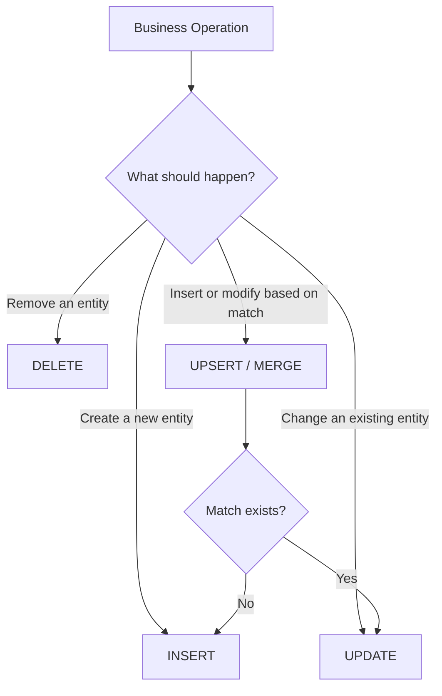
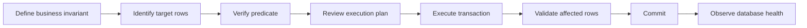
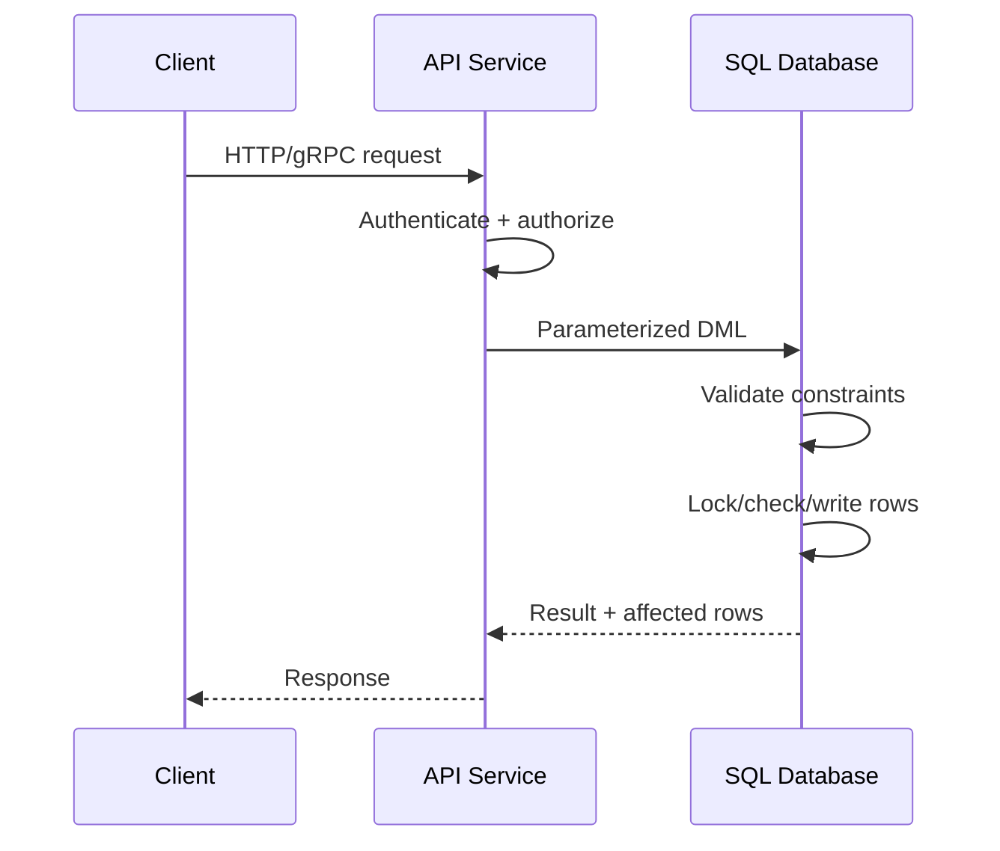

# README

## Overview

The **Data Modification** section covers SQL operations that change persistent relational data. It focuses on `INSERT`, `UPDATE`, `DELETE`, `MERGE`, upsert patterns, and the safety controls required to execute these operations reliably in production systems.

These statements are simple syntactically but carry significant operational risk. A poorly scoped `UPDATE` or `DELETE` can affect millions of rows, while an incorrectly designed upsert can create duplicates, overwrite concurrent changes, or violate business invariants.

The section progresses from individual DML operations to production-grade patterns involving:

- Set-based data modification
- Bulk writes
- Upserts and reconciliation
- `MERGE`
- `NULL` and constraint behavior
- Transactions
- Concurrency
- Idempotency
- Safe execution practices
- Referential integrity
- Returning modified rows
- Performance and operational safety

## Navigation

- [01- INSERT Fundamentals](./01-%20INSERT%20Fundamentals.md) — Creating rows correctly with INSERT
- [02- INSERT Multiple Rows](./02-%20INSERT%20Multiple%20Rows.md) — Bulk insertion and write efficiency
- [03- INSERT from SELECT](./03-%20INSERT%20from%20SELECT.md) — Set-based data movement with INSERT ... SELECT
- [04- UPDATE Fundamentals](./04-%20UPDATE%20Fundamentals.md) — Modifying existing rows correctly
- [05- UPDATE with JOIN](./05-%20UPDATE%20with%20JOIN.md) — Updating rows based on related data
- [06- DELETE Fundamentals](./06-%20DELETE%20Fundamentals.md) — Removing rows safely
- [07- DELETE with JOIN](./07-%20DELETE%20with%20JOIN.md) — Deleting rows based on related data
- [08- MERGE and Upsert Concepts](./08-%20MERGE%20and%20Upsert%20Concepts.md) — Insert-or-update and reconciliation semantics
- [09- Upsert Patterns](./09-%20Upsert%20Patterns.md) — Database-specific and production-safe upsert patterns
- [10- Safe UPDATE Practices](./10-%20Safe%20UPDATE%20Practices.md) — Preventing accidental mass modifications
- [11- Safe DELETE Practices](./11-%20Safe%20DELETE%20Practices.md) — Preventing accidental data loss
- [12- Returning Modified Rows](./12-%20Returning%20Modified%20Rows.md) — Obtaining affected rows from DML statements
- [13- DML and NULL](./13-%20DML%20and%20NULL.md) — Correct handling of unknown and missing values in DML
- [14- DML and Constraints](./14-%20DML%20and%20Constraints.md) — Primary keys, foreign keys, unique and check constraints in DML
- [15- DML Rules and Safety Checklist](./15-%20DML%20Rules%20and%20Safety%20Checklist.md) — Production execution checklist for DML statements
- [16- Choosing INSERT UPDATE DELETE MERGE](./16-%20Choosing%20INSERT%20UPDATE%20DELETE%20MERGE.md) — Selecting the correct DML operation for a business requirement

## DML Fundamentals

The four core operations represent different state transitions:

| Operation | Business meaning | Typical use |
|---|---|---|
| `INSERT` | Create new persistent state | Create user, order, event |
| `UPDATE` | Change existing persistent state | Change order status |
| `DELETE` | Remove persistent state | Delete expired session |
| `MERGE` | Reconcile source and target state | Synchronize external records |

The operation should reflect the business semantics rather than merely the easiest SQL syntax.



## Core Engineering Principles

### Prefer Set-Based DML

Relational databases are optimized for operations over sets of rows.

Prefer:

```sql
UPDATE orders
SET status = 'expired'
WHERE expires_at < CURRENT_TIMESTAMP
  AND status = 'pending';
```

over fetching every row into application code and executing one `UPDATE` per row.

Set-based DML generally reduces:

- Network round trips.
- Application CPU usage.
- Transaction duration.
- SQL parsing overhead.
- Application/database coordination complexity.

### Make Predicates Explicit

Every production `UPDATE` and `DELETE` should have an intentional target predicate.

```sql
UPDATE users
SET status = 'inactive'
WHERE last_login_at < $1
  AND status = 'active';
```

The absence of a `WHERE` clause is a high-risk operation:

```sql
UPDATE users
SET status = 'inactive';
```

It modifies every row.

The same applies to:

```sql
DELETE FROM users;
```

A production workflow should make accidental unrestricted DML difficult to execute.

### Let Constraints Enforce Invariants

Application validation improves user experience, but the database should enforce critical invariants.

Typical constraints include:

- `PRIMARY KEY`
- `UNIQUE`
- `FOREIGN KEY`
- `NOT NULL`
- `CHECK`

For example:

```sql
CREATE TABLE users (
    id bigint GENERATED ALWAYS AS IDENTITY PRIMARY KEY,
    email text NOT NULL UNIQUE,
    age integer CHECK (age >= 0)
);
```

This protects the database even when multiple application instances, background workers, migrations, or administrative scripts modify the same data.

## Transactions

DML operations should be grouped into a transaction when multiple changes must succeed or fail together.

```sql
BEGIN;

UPDATE inventory
SET quantity = quantity - $1
WHERE product_id = $2
  AND quantity >= $1;

INSERT INTO inventory_movements (
    product_id,
    quantity,
    movement_type
)
VALUES (
    $2,
    $1,
    'sale'
);

COMMIT;
```

Transactions provide atomicity, but transaction scope should remain deliberate. Large transactions can increase:

- Lock duration.
- WAL/redo volume.
- Replication lag.
- Rollback cost.
- Resource consumption.
- Impact on concurrent workloads.

For large maintenance operations, batching is often safer than modifying an entire dataset in one transaction.

## Concurrency and Idempotency

DML frequently executes concurrently in backend systems.

An unsafe existence-check pattern is:

```text
SELECT
    ↓
Does row exist?
    ↓
Application decision
    ↓
INSERT or UPDATE
```

Two concurrent requests can both observe the same state before either writes.

Prefer database-enforced uniqueness and atomic write patterns.

For example, PostgreSQL supports:

```sql
INSERT INTO user_preferences (
    user_id,
    timezone
)
VALUES ($1, $2)
ON CONFLICT (user_id)
DO UPDATE SET
    timezone = EXCLUDED.timezone;
```

Idempotency is particularly important for retryable API requests, message consumers, scheduled jobs, and distributed workflows.

## Safe Modification Workflow

A production DML workflow should generally follow this pattern:



For high-risk changes, perform the selection independently first:

```sql
SELECT id
FROM orders
WHERE status = 'pending'
  AND expires_at < CURRENT_TIMESTAMP;
```

After verifying the target set, execute the corresponding modification.

## Affected-Row Validation

Do not assume a DML statement changed what the application expected.

For example:

```sql
UPDATE orders
SET status = 'shipped'
WHERE id = $1
  AND status = 'paid';
```

The application should inspect the affected-row count.

Possible outcomes:

| Affected rows | Possible meaning |
|---:|---|
| `1` | Expected transition succeeded |
| `0` | Order does not exist or state predicate failed |
| `>1` | Predicate is broader than intended |

Affected-row validation is particularly important for:

- Optimistic locking.
- State transitions.
- Administrative scripts.
- Batch jobs.
- Data migrations.

## Performance Considerations

DML performance depends on more than the number of rows written.

Important factors include:

- Predicate selectivity.
- Index availability.
- Number of indexes maintained.
- Foreign-key checks.
- Triggers.
- Row-level locking.
- Transaction size.
- WAL/redo generation.
- Replication.
- Table and index bloat.
- Storage throughput.

A predicate such as:

```sql
DELETE FROM sessions
WHERE expires_at < CURRENT_TIMESTAMP;
```

may require an appropriate index when the table is large and the operation is frequent.

For very large cleanup jobs, consider bounded batches:

```sql
DELETE FROM sessions
WHERE id IN (
    SELECT id
    FROM sessions
    WHERE expires_at < CURRENT_TIMESTAMP
    ORDER BY id
    LIMIT 10000
);
```

The exact batching strategy should be adapted to the database engine and workload.

## Backend Application Integration

DML usually sits behind an application service rather than being exposed directly to clients.

A typical request path is:



With Python frameworks such as Django or FastAPI:

- Validate input at the API boundary.
- Authorize the requested operation.
- Use parameterized SQL or ORM-generated SQL.
- Keep transaction boundaries explicit.
- Handle constraint violations intentionally.
- Return appropriate application-level errors.

Do not rely on an ORM to eliminate database-level correctness requirements.

## Security

DML must be parameterized.

Prefer:

```sql
UPDATE users
SET display_name = $1
WHERE id = $2;
```

Never construct SQL from untrusted input through string concatenation.

Security also requires authorization:

```text
Authentication
    ↓
Authorization
    ↓
DML
```

A perfectly parameterized query can still be dangerous if an unauthorized caller can choose the target row.

Production systems should also consider:

- Least-privilege database roles.
- Audit logging for sensitive modifications.
- Restricted production write access.
- Row-level security where appropriate.
- Secrets management.
- Protection of sensitive values in application and database logs.

## Data Integrity

DML must preserve relationships between tables.

For example:

```sql
CREATE TABLE orders (
    id bigint PRIMARY KEY,
    customer_id bigint NOT NULL
        REFERENCES customers(id)
);
```

Deleting a customer may therefore require an explicit policy:

- Reject deletion.
- Cascade deletion.
- Reassign related records.
- Preserve the customer but mark it inactive.

Foreign-key behavior should be deliberately designed rather than discovered during production operations.

## Soft Delete vs Hard Delete

Logical deletion often uses:

```sql
UPDATE users
SET deleted_at = CURRENT_TIMESTAMP
WHERE id = $1
  AND deleted_at IS NULL;
```

Physical deletion uses:

```sql
DELETE FROM users
WHERE id = $1;
```

The choice depends on:

- Retention requirements.
- Audit requirements.
- Recovery requirements.
- Regulatory requirements.
- Storage lifecycle.
- Domain semantics.

Soft deletion is not free. Every relevant query must consistently account for the deleted state, and indexes and uniqueness rules may require additional design.

## Bulk Modification

Bulk DML is useful for:

- Data migrations.
- Backfills.
- Retention jobs.
- Reconciliation.
- Batch processing.
- Administrative operations.

However, large bulk writes can affect the entire database workload.

Production strategies include:

- Process bounded batches.
- Order by a stable indexed key.
- Keep transactions reasonably sized.
- Monitor replication lag.
- Monitor locks.
- Schedule heavy operations during appropriate windows.
- Test execution plans on production-like data.
- Make jobs resumable where possible.

For large migrations, a background worker such as Celery may execute batches rather than keeping an API request open.

## DML and Distributed Systems

Database changes often trigger downstream actions.

For example:

```text
PostgreSQL
    ↓
Outbox
    ↓
Publisher
    ↓
Kafka
    ↓
Consumers
```

When a DML operation must produce an event, an outbox pattern can keep the database mutation and event record in the same transaction.

```sql
BEGIN;

UPDATE orders
SET status = 'shipped'
WHERE id = $1
  AND status = 'paid';

INSERT INTO outbox_events (
    event_type,
    aggregate_id,
    payload
)
VALUES (
    'order.shipped',
    $1,
    $2
);

COMMIT;
```

This prevents a common failure mode where the database commits but the application crashes before publishing the corresponding event.

## Common Pitfalls

| Pitfall | Risk | Prevention |
|---|---|---|
| Missing `WHERE` | Mass modification/deletion | Require explicit predicates |
| `SELECT` then `INSERT` | Race condition | Use unique constraints + atomic upsert |
| Blind retries | Duplicate writes | Design idempotent operations |
| Large single transaction | Locks, replication lag, rollback cost | Batch work |
| Ignoring affected rows | Silent failures | Validate row counts |
| Missing indexes | Slow scans and long locks | Inspect execution plans |
| Application-only validation | Race conditions | Enforce invariants in DB |
| Incorrect soft-delete handling | Deleted data appears in queries | Centralize filtering strategy |
| Broad `UPDATE` predicate | Unexpected rows changed | Verify target set first |
| Uncontrolled production scripts | Operator error | Review, dry-run, audit, restrict access |

## Operational Checklist

Before executing a significant `INSERT`, `UPDATE`, `DELETE`, or `MERGE`:

- [ ] Confirm the business requirement.
- [ ] Identify the exact target rows.
- [ ] Verify the primary/unique key or match condition.
- [ ] Confirm the `WHERE` or `ON` predicate.
- [ ] Check affected-row expectations.
- [ ] Review relevant indexes.
- [ ] Review foreign keys, triggers, and constraints.
- [ ] Check transaction boundaries.
- [ ] Consider concurrent writers.
- [ ] Consider retry and idempotency behavior.
- [ ] Estimate lock and replication impact.
- [ ] Test against production-like data.
- [ ] Confirm backup/PITR or recovery capability for destructive operations.
- [ ] Monitor the database during large changes.
- [ ] Record or audit high-risk production modifications.

## Key Takeaways

- **DML operations represent business state changes and should be selected according to their semantics, not merely SQL convenience.**
- **Safe production DML depends on explicit predicates, database constraints, transactions, concurrency control, and affected-row validation.**
- **Atomic upserts and database-enforced uniqueness are preferred over application-level existence checks when concurrent writes are possible.**
- **Large modifications require operational planning around batching, locks, replication, WAL/redo, execution plans, and recovery.**
- **The database must remain the final authority for critical data-integrity invariants even when application frameworks and ORMs provide additional validation.**