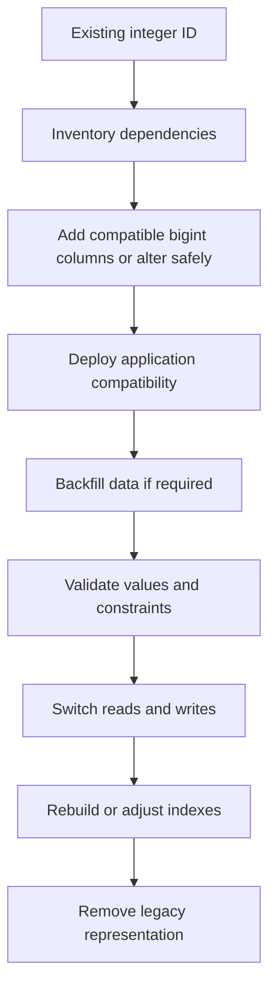

# 02- Integer Types

## Overview

Integer types represent whole numbers without fractional components. They are used extensively for identifiers, counters, quantities, ordering values, status codes, version numbers, and other discrete values in backend systems.

Integer type selection is primarily a **domain and capacity decision**. The smallest type is not automatically the best type; the chosen type must accommodate realistic growth while avoiding unnecessary storage and index overhead.

PostgreSQL provides three primary signed integer types:

| Type | Storage | Signed range | Typical use |
|---|---:|---:|---|
| `smallint` | 2 bytes | `-32,768` to `32,767` | Small bounded counters |
| `integer` | 4 bytes | `-2,147,483,648` to `2,147,483,647` | General-purpose integers |
| `bigint` | 8 bytes | `-9,223,372,036,854,775,808` to `9,223,372,036,854,775,807` | Large identifiers and counters |

PostgreSQL also provides serial-style pseudo-types and identity columns for automatically generated integer identifiers. For modern schemas, identity columns are generally preferable to the older `serial` syntax.

## Integer Type Selection

The central question is:

> What is the maximum realistic value this column can reach during the lifetime of the system?

For example:

```sql
CREATE TABLE products (
    id bigint GENERATED ALWAYS AS IDENTITY PRIMARY KEY,
    stock_quantity integer NOT NULL DEFAULT 0,
    display_order smallint NOT NULL DEFAULT 0
);
```

Each choice reflects a different expected range:

- `id` may grow into billions of rows, so `bigint` provides substantial headroom.
- `stock_quantity` normally fits comfortably within `integer`.
- `display_order` is intentionally bounded and can use `smallint`.

Do not select a type solely from current data. A production database can outlive the assumptions made when the first schema was created.

## `smallint`

`smallint` is a signed 16-bit integer.

```sql
CREATE TABLE priorities (
    id smallint PRIMARY KEY,
    priority smallint NOT NULL
);
```

### When to Use

`smallint` is appropriate when the domain has a genuinely small, well-understood range.

Examples include:

- Small priority values.
- Small bounded counters.
- Compact status codes.
- Configuration values with strict limits.

### Advantages

- Requires only 2 bytes.
- Smaller indexes than wider integer types.
- Useful for very large tables where the range is definitively bounded.

### Limitations

The range is small:

```text
-32,768 through 32,767
```

A value that appears bounded today may not remain bounded as product requirements change.

### Production Consideration

Do not use `smallint` merely to save 2 bytes on a column without considering migration cost.

For a table containing 500 million rows, reducing a column from 4 bytes to 2 bytes can matter. For a small table, the operational complexity and future capacity risk may outweigh the storage savings.

## `integer`

`integer` is a signed 32-bit integer and is the normal default for many ordinary integer values.

```sql
CREATE TABLE inventory (
    id integer GENERATED ALWAYS AS IDENTITY PRIMARY KEY,
    quantity integer NOT NULL DEFAULT 0
);
```

Its signed range is:

```text
-2,147,483,648 through 2,147,483,647
```

### When to Use

Use `integer` when:

- The value is naturally an integer.
- The expected maximum is comfortably below the 32-bit limit.
- There is no strong reason to use `smallint` or `bigint`.

Examples:

```sql
retry_count integer NOT NULL DEFAULT 0
quantity integer NOT NULL DEFAULT 0
sort_order integer NOT NULL DEFAULT 0
```

### Advantages

- Good general-purpose choice.
- Smaller than `bigint`.
- Large enough for most ordinary application values.
- Widely supported across relational databases and programming languages.

### Limitation

The maximum positive value is approximately 2.1 billion.

That limit can matter for:

- High-volume event tables.
- Globally increasing identifiers.
- Long-lived systems.
- Large counters.
- Systems that ingest data continuously.

## `bigint`

`bigint` is a signed 64-bit integer.

```sql
CREATE TABLE events (
    id bigint GENERATED ALWAYS AS IDENTITY PRIMARY KEY,
    sequence_number bigint NOT NULL
);
```

Its positive range is approximately:

```text
0 through 9.22 × 10^18
```

### When to Use

`bigint` is particularly useful for:

- Large table primary keys.
- High-volume event identifiers.
- Monotonically increasing counters.
- Distributed sequence values.
- Data expected to survive many years of growth.

For high-growth backend systems, using `bigint` for primary keys is often a conservative long-term design choice.

### Advantages

- Extremely large range.
- Provides substantial growth headroom.
- Commonly supported by database drivers and backend languages.

### Limitations

It consumes twice the storage of a 32-bit integer:

```text
integer → 4 bytes
bigint  → 8 bytes
```

The difference becomes relevant when the column is:

- Stored in hundreds of millions of rows.
- Used as a primary key.
- Repeated in foreign keys.
- Included in multiple indexes.

## Comparing Integer Types

| Property | `smallint` | `integer` | `bigint` |
|---|---:|---:|---:|
| Width | 16-bit | 32-bit | 64-bit |
| Storage | 2 bytes | 4 bytes | 8 bytes |
| Signed maximum | 32,767 | 2.1B | 9.22E18 |
| Typical role | Small bounded values | General integers | IDs/counters with large growth |
| Index footprint | Smallest | Medium | Largest |
| Overflow risk | Highest | Medium | Extremely low for ordinary applications |

The correct type depends on the domain rather than simply choosing the smallest storage size.

## Identity Columns

For automatically generated identifiers, PostgreSQL supports SQL-standard identity columns.

```sql
CREATE TABLE users (
    id bigint GENERATED ALWAYS AS IDENTITY PRIMARY KEY,
    email text NOT NULL UNIQUE
);
```

The database generates the identifier when the row is inserted.

Two common forms are:

```sql
GENERATED ALWAYS AS IDENTITY
```

and:

```sql
GENERATED BY DEFAULT AS IDENTITY
```

`GENERATED ALWAYS` more strongly communicates that the database owns value generation. Explicit overrides require additional syntax.

### Why Identity Columns Matter

They separate identifier generation from application logic.

Instead of:

```text
Application
    ↓
"What's the next ID?"
    ↓
Database
```

the application simply inserts the row:

```text
Application
    ↓
INSERT without ID
    ↓
Database generates ID
```

This avoids application-level race conditions around manually calculating the next identifier.

### Identity Values Are Not Gap-Free

An identity-backed sequence can contain gaps.

For example:

```text
100
101
103
104
```

A transaction may allocate `102` and subsequently roll back.

Do not use an auto-generated integer ID as a business document number when the business requires gap-free numbering.

## Integer Primary Keys

A common production schema is:

```sql
CREATE TABLE customers (
    id bigint GENERATED ALWAYS AS IDENTITY PRIMARY KEY,
    name text NOT NULL
);
```

The primary key creates a unique index and enforces non-nullability.

The identifier is then referenced by foreign keys:

```sql
CREATE TABLE orders (
    id bigint GENERATED ALWAYS AS IDENTITY PRIMARY KEY,
    customer_id bigint NOT NULL REFERENCES customers(id)
);
```

### Important Rule: Match Foreign Key Types

If the referenced key is:

```sql
customers.id bigint
```

the foreign key should normally also be:

```sql
customer_id bigint
```

Avoid designing:

```text
customers.id       bigint
orders.customer_id integer
```

Even when implicit conversion makes a particular query possible, mismatched types complicate schema design and can cause unnecessary casts or incompatibilities.

A consistent identifier type across the relationship is the safer design.

## Integer Arithmetic

SQL performs arithmetic according to the operand types and database-specific rules.

Example:

```sql
SELECT 10 + 20;
```

For expressions involving different numeric types, the database may promote values to a compatible type.

Explicit casts can make intent clearer:

```sql
SELECT quantity::bigint * price;
```

When calculations can exceed the range of the original integer type, consider the resulting expression type and whether explicit casting is required.

## Integer Division

Integer division is a common source of bugs.

For example:

```sql
SELECT 5 / 2;
```

With integer operands in PostgreSQL, the result is integer division:

```text
2
```

If a fractional result is required, use an appropriate numeric type:

```sql
SELECT 5::numeric / 2;
```

which produces:

```text
2.5
```

This matters in backend code for calculations such as:

- Percentages.
- Ratios.
- Pagination metrics.
- Conversion rates.
- Aggregated statistics.

A query can be syntactically valid while still producing mathematically incorrect business results.

## Integer Overflow

Integer overflow occurs when a value exceeds the representable range of its type.

For example, an `integer` counter cannot grow indefinitely.

A continuously incremented counter:

```sql
UPDATE metrics
SET request_count = request_count + 1
WHERE id = 1;
```

can eventually exceed the column's capacity.

The correct solution is not to wait for the failure. Estimate growth before choosing the type.

A counter receiving:

```text
1,000,000 increments/day
```

has a very different lifecycle from one receiving:

```text
100 increments/day
```

Long-lived systems should model this growth explicitly.

## Integer Types and Index Performance

Integer columns are efficient index keys, but width still matters.

Suppose a table has:

```sql
CREATE INDEX idx_orders_customer_id
ON orders(customer_id);
```

If `customer_id` is `bigint`, the indexed key is wider than if it were `integer`.

Wider indexes can mean:

- More disk usage.
- More memory pressure.
- More cache consumption.
- More I/O during index operations.
- Potentially more index pages.

However, choosing `integer` solely for index compactness is dangerous if the domain may exceed its range.

A useful rule is:

> Optimize width only after establishing that the smaller type is safely sufficient for the system's expected lifetime.

## Integer Types and Table Size

Consider a large table:

```text
1 billion rows
```

A 4-byte integer column requires approximately:

```text
4 GB
```

for the raw column values alone, before tuple overhead, indexes, visibility information, and other storage structures.

An 8-byte `bigint` requires approximately:

```text
8 GB
```

for those raw values.

Real PostgreSQL storage will differ because of row layout, alignment, indexes, compression where applicable, and other overhead.

This is why type width becomes increasingly relevant at large scale.

## Integer Types in Python

Python's `int` is not limited to 32-bit or 64-bit signed integer ranges in the same way as PostgreSQL integer types.

```python
count = 10_000_000_000
```

is valid Python.

That does **not** mean a PostgreSQL `integer` column can store the value.

The database remains constrained by its column definition:

```sql
CREATE TABLE counters (
    value integer NOT NULL
);
```

Attempting to persist a value outside the database type's range can fail.

Therefore, application and database models must agree on realistic bounds.

## Integer Types in Django

Django provides corresponding model fields:

```python
from django.db import models


class Event(models.Model):
    id = models.BigAutoField(primary_key=True)
    retry_count = models.PositiveIntegerField(default=0)
```

Common fields include:

| Django field | Typical database representation |
|---|---|
| `SmallIntegerField` | Small integer |
| `IntegerField` | Integer |
| `BigIntegerField` | Big integer |
| `AutoField` | Auto-generated integer |
| `BigAutoField` | Auto-generated big integer |
| `PositiveIntegerField` | Non-negative integer representation |

The exact database representation can vary by database backend.

For high-growth applications, using a sufficiently wide primary key from the beginning can avoid expensive identifier migrations later.

## Non-Negative Values

Many domains should not permit negative values:

```text
quantity >= 0
retry_count >= 0
priority >= 0
```

Do not rely exclusively on application validation.

Use a database constraint when the invariant belongs to persistent data integrity:

```sql
CREATE TABLE inventory (
    id bigint GENERATED ALWAYS AS IDENTITY PRIMARY KEY,
    quantity integer NOT NULL CHECK (quantity >= 0)
);
```

This protects the database regardless of whether the write originates from:

- Django.
- FastAPI.
- A background worker.
- An administrative script.
- A migration.
- Another service.

## Integer IDs vs UUIDs

Integer IDs are not the only identifier strategy.

| Characteristic | Integer ID | UUID |
|---|---|---|
| Storage | Smaller | Larger |
| Generation | Database sequence/identity | Can be generated independently |
| Distributed generation | Less convenient | Natural fit |
| Sequential locality | Strong | Depends on UUID strategy |
| Guessability | Sequential IDs are predictable | Generally harder to enumerate |
| Cross-system uniqueness | Requires coordination | Large global namespace |
| Typical use | Internal relational identifiers | Distributed/external identifiers |

Do not choose UUIDs solely because integer IDs are "insecure." Authorization must be enforced independently of identifier design.

Similarly, do not choose integers solely because they are smaller. Distributed architecture and external identifier requirements may justify UUIDs.

## Integer Types and Distributed Systems

In a microservice architecture, identifier generation may occur in multiple services.

A database-generated sequence works well when one database owns the identifier space.

For independently generated identifiers, alternatives such as UUIDs may be more appropriate.

The decision should consider:

- Where IDs are generated.
- Whether services share a database.
- Whether records are merged across databases.
- Whether IDs are exposed through public APIs.
- Whether insertion locality matters.
- Whether ordering is required.

Do not introduce a distributed ID-generation scheme without a concrete architectural requirement.

## Migration from `integer` to `bigint`

Changing a heavily used identifier from `integer` to `bigint` can be operationally expensive.

A relationship might look like:

```text
customers.id
     ↑
     |
orders.customer_id
```

Changing only the primary key is insufficient. Dependent foreign keys, indexes, ORM definitions, and application assumptions must also be considered.

A large migration may require:

1. Inventorying all dependent columns.
2. Checking current maximum values.
3. Evaluating index and table size.
4. Testing migration duration on production-scale data.
5. Assessing lock behavior.
6. Considering replication lag.
7. Updating application models.
8. Deploying compatible application code.
9. Migrating dependent columns.
10. Verifying constraints and indexes.

For very large systems, an online or phased migration strategy may be required.

## Safe Integer Migration Pattern

A generic phased approach can look like:



The exact procedure depends heavily on the database engine, table size, foreign keys, replication topology, and downtime requirements.

Never assume that a type change is operationally cheap simply because the logical change is small.

## Production Considerations

### Capacity Planning

For counters and identifiers, estimate:

```text
expected rate × expected lifetime
```

For example:

```text
5 million events/day
×
10 years
≈
18.25 billion events
```

A 32-bit signed integer cannot represent that number, while a 64-bit integer can.

Capacity planning should include:

- Current row count.
- Daily growth.
- Expected retention period.
- Peak growth.
- Historical data migration.
- Multi-tenant expansion.
- Future product features.

### Constraints

Use constraints to encode integer invariants:

```sql
CREATE TABLE jobs (
    id bigint GENERATED ALWAYS AS IDENTITY PRIMARY KEY,
    retry_count integer NOT NULL DEFAULT 0
        CHECK (retry_count >= 0 AND retry_count <= 100)
);
```

This prevents invalid states regardless of the application path used to modify the data.

### Monitoring

Monitor for:

- Approaching integer limits.
- Unexpectedly rapid counter growth.
- Constraint violations.
- Failed casts.
- Overflow errors.
- Migration failures.
- Replica lag during large type migrations.

For high-value counters, periodically measure the maximum stored value:

```sql
SELECT MAX(sequence_number)
FROM events;
```

Capacity monitoring is especially important for systems with continuously increasing identifiers.

### High Availability

Large integer type migrations can affect:

- Primary database availability.
- Replica lag.
- Lock duration.
- Connection pool behavior.
- Deployment sequencing.

Before modifying a high-volume table:

- Test the migration against production-scale data.
- Measure lock acquisition and duration.
- Monitor replication.
- Establish rollback or recovery procedures.
- Schedule during an appropriate operational window when necessary.

### Security

Sequential integer IDs can make resource enumeration easier:

```text
GET /orders/1001
GET /orders/1002
GET /orders/1003
```

This is not primarily an integer-type problem. The API must enforce authorization:

```text
Authenticated user
       ↓
Authorization check
       ↓
Is this order accessible?
       ↓
Database query
```

If exposing sequential IDs is undesirable, opaque identifiers can be used, but authorization remains mandatory.

## Common Mistakes and Pitfalls

| Mistake | Problem | Better approach |
|---|---|---|
| Using `smallint` everywhere | Easy to exhaust | Use only for genuinely bounded domains |
| Using `integer` for every primary key | Creates future capacity risk | Evaluate lifetime growth |
| Using `bigint` for every value | Unnecessary storage/index width | Use it where capacity justifies it |
| Mismatching PK/FK types | Complicates joins and schema consistency | Keep relationship types aligned |
| Assuming Python `int` determines DB capacity | Python and DB limits differ | Design against database type limits |
| Ignoring integer division | Produces incorrect ratios | Cast to numeric when fractions are required |
| Treating identity IDs as gap-free | Rollbacks and sequence behavior create gaps | Use a dedicated business-numbering mechanism |
| Relying only on application validation | Other writers can bypass it | Add database `CHECK` constraints |
| Changing IDs without auditing dependencies | Foreign keys and indexes are missed | Map the complete dependency graph |
| Choosing types only for storage savings | Creates avoidable migration risk | Balance capacity, width, and operational cost |

## Interview Traps

### Is `bigint` Always Better Than `integer`?

No.

`bigint` provides much greater capacity but consumes more storage and can increase index size. The correct choice depends on expected domain range and system lifetime.

### Does an Identity Column Guarantee Consecutive IDs?

No.

Identity generation is designed for uniqueness and efficient allocation, not gap-free numbering. Rollbacks and sequence allocation can leave gaps.

### Should Foreign Keys Use the Same Integer Type as Primary Keys?

Yes, in normal schema design they should use a compatible matching type. This keeps the relationship consistent and avoids unnecessary type conversion concerns.

### Can a Python `int` Overflow Like a PostgreSQL `integer`?

Python's `int` supports arbitrary-precision integers subject to available memory. PostgreSQL's `integer` has a fixed 32-bit range. Application code therefore cannot assume that a Python integer is automatically safe for a database column.

### Does a Smaller Integer Always Make Queries Faster?

No.

Smaller values can reduce storage and index footprint, but query performance depends on the complete workload, including indexes, selectivity, cache behavior, joins, query plans, and I/O.

## Key Takeaways

- **Choose `smallint`, `integer`, or `bigint` from domain capacity and expected lifetime growth, not simply from today's values.**
- **Use sufficiently wide and consistent types for primary keys and foreign keys; `bigint` is often appropriate for high-growth identifiers.**
- **Identity columns delegate ID generation to the database, but generated IDs are not guaranteed to be gap-free.**
- **Integer width affects table and index storage, so balance long-term capacity against the cost of wider keys.**
- **Protect integer invariants with database constraints and treat large integer-type migrations as production operations requiring dependency, locking, replication, and rollback planning.**