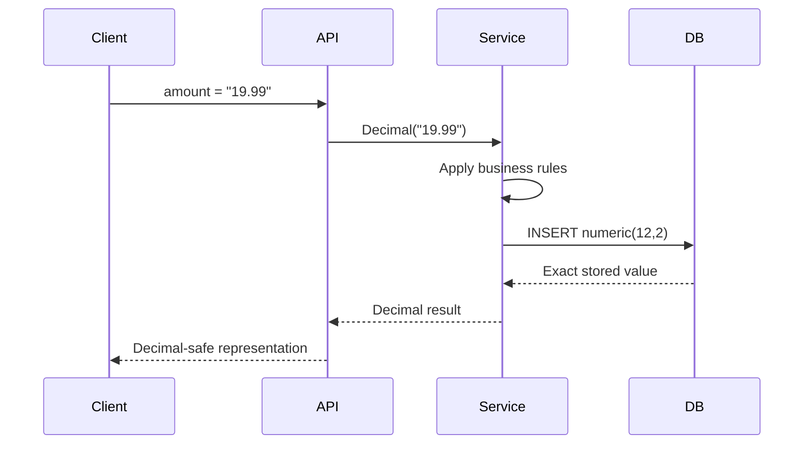

# 03- Decimal and Numeric Types

## Overview

Exact numeric types are used when fractional values must be stored and calculated without the binary floating-point approximation associated with types such as `real` and `double precision`.

For backend systems, the distinction between **exact numeric arithmetic** and **floating-point arithmetic** is critical. Financial amounts, prices, rates, measurements with contractual precision, and accounting values should generally use an exact decimal representation rather than floating-point types.

In PostgreSQL, the primary exact decimal type is `numeric`, which is also available under the SQL-standard name `decimal`.

```sql
CREATE TABLE invoices (
    id bigint GENERATED ALWAYS AS IDENTITY PRIMARY KEY,
    subtotal numeric(12, 2) NOT NULL,
    tax numeric(12, 2) NOT NULL,
    total numeric(12, 2) NOT NULL
);
```

The key design questions are:

- Does the value require exact decimal arithmetic?
- What is the maximum magnitude?
- How many fractional digits are required?
- Does the business domain require a fixed scale?
- Will values be aggregated at high volume?
- How will the database type map to the application language?

## `numeric` and `decimal`

In PostgreSQL, `numeric` and `decimal` are equivalent types.

```sql
CREATE TABLE payments (
    amount numeric(12, 2) NOT NULL
);
```

The same declaration can be written as:

```sql
CREATE TABLE payments (
    amount decimal(12, 2) NOT NULL
);
```

`numeric` is commonly used in PostgreSQL-oriented schemas, while `decimal` is familiar across SQL implementations.

### Why Exact Numeric Types Exist

Binary floating-point types represent numbers using a finite binary format. Many decimal fractions cannot be represented exactly in that format.

For example, a value such as:

```text
0.1
```

cannot generally be represented exactly as a binary floating-point value.

This can produce behavior such as:

```text
0.1 + 0.2 ≠ exactly 0.3
```

for floating-point arithmetic.

An exact decimal type instead represents decimal values according to decimal precision and scale, making it appropriate for domains where exact decimal arithmetic matters.

## Precision and Scale

A declaration such as:

```sql
numeric(12, 2)
```

contains two important parameters:

- **Precision**: total number of significant decimal digits.
- **Scale**: number of digits allowed to the right of the decimal point.

Therefore:

```text
numeric(12, 2)
```

allows up to:

```text
10 digits before the decimal point
2 digits after the decimal point
```

The largest positive value is:

```text
9999999999.99
```

The total number of digits is 12.

### Examples

| Type | Maximum positive value |
|---|---:|
| `numeric(5, 2)` | `999.99` |
| `numeric(8, 2)` | `999999.99` |
| `numeric(12, 2)` | `9999999999.99` |
| `numeric(19, 4)` | `999999999999999.9999` |

Precision and scale should be chosen from the business domain rather than arbitrary conventions.

## Fixed Scale vs Unconstrained `numeric`

PostgreSQL supports both constrained and unconstrained numeric values.

### Constrained Numeric

```sql
amount numeric(12, 2)
```

This explicitly defines the maximum precision and scale.

It is useful when the domain has strict requirements, such as currency stored to two decimal places.

### Unconstrained Numeric

```sql
amount numeric
```

This permits a much broader range of exact numeric values.

It can be appropriate when the application genuinely requires variable precision, but it provides less schema-level documentation and validation of the intended domain.

### Production Recommendation

Prefer a constrained type when the business domain has a known precision and scale.

For example:

```sql
price numeric(12, 2) NOT NULL
```

communicates substantially more intent than:

```sql
price numeric NOT NULL
```

The schema becomes part of the data contract.

## Scale and Rounding

Consider:

```sql
CREATE TABLE products (
    price numeric(10, 2) NOT NULL
);
```

An application attempts to insert:

```sql
INSERT INTO products(price)
VALUES (19.999);
```

PostgreSQL applies the declared scale and rounds the value according to its numeric rules.

For a production system, do not rely on implicit database rounding to implement an important business rule.

If the business requires explicit rounding behavior, make it visible in application or SQL logic:

```sql
SELECT round(19.999::numeric, 2);
```

This makes the transformation explicit and easier to test.

## Exact Arithmetic

PostgreSQL's `numeric` type supports exact arithmetic within its supported precision and scale.

```sql
SELECT
    10.25::numeric + 5.75::numeric AS total,
    10.25::numeric * 2 AS doubled;
```

Results:

```text
15.00
20.50
```

This makes `numeric` suitable for calculations where small floating-point errors can become financially or operationally significant.

Typical examples include:

- Money.
- Tax calculations.
- Discounts.
- Interest rates.
- Exchange rates.
- Account balances.
- Financial reporting.
- Precise measurements.

## Monetary Values

A common production schema is:

```sql
CREATE TABLE accounts (
    id bigint GENERATED ALWAYS AS IDENTITY PRIMARY KEY,
    balance numeric(19, 4) NOT NULL DEFAULT 0
        CHECK (balance >= 0)
);
```

The exact precision and scale should reflect the domain.

For example:

- `numeric(12, 2)` may be sufficient for ordinary retail prices.
- `numeric(19, 4)` may be more appropriate for financial calculations requiring additional fractional precision.

Do not blindly assume that every currency uses exactly two decimal places. Currency and financial instruments can have different precision requirements.

## Money vs `numeric`

PostgreSQL also provides a `money` type.

For application schemas, `numeric` is generally easier to reason about because its precision and scale can be explicitly defined.

| Type | Characteristics | Typical recommendation |
|---|---|---|
| `numeric(p,s)` | Exact, explicit precision and scale | Preferred for most application financial values |
| `numeric` | Exact, flexible precision | Use when precision requirements are variable |
| `money` | Currency-oriented database type | Use only when its semantics fit the application |
| `real` | Approximate floating point | Avoid for exact financial values |
| `double precision` | Approximate floating point | Use for scientific/statistical workloads where approximation is acceptable |

The important distinction is **exactness**, not simply whether the column contains a decimal point.

## Floating Point vs Exact Numeric

| Property | `numeric` / `decimal` | `real` / `double precision` |
|---|---|---|
| Arithmetic | Exact decimal arithmetic | Approximate |
| Storage | Variable | Fixed-width |
| Financial values | Strong fit | Poor fit |
| Scientific calculations | Often unnecessary | Strong fit |
| Performance | Generally slower | Generally faster |
| Precision | User-controlled | Limited by representation |
| Rounding behavior | Decimal-oriented | Binary floating-point |

Floating point is not inherently bad. It is appropriate when approximate numerical computation is the actual requirement.

Examples include:

- Scientific measurements.
- Sensor data.
- Statistical calculations.
- Graphics.
- Machine-learning calculations.
- Large numerical workloads where approximate representation is acceptable.

The mistake is using floating point for a domain that requires exact decimal semantics.

## `numeric` Storage and Performance

Exact numeric arithmetic has a cost.

Compared with fixed-width integer or floating-point values, `numeric` can require more CPU and storage, particularly when values contain many digits.

This matters for workloads involving:

- Large aggregations.
- High-frequency calculations.
- Large analytical queries.
- Massive fact tables.
- Complex numeric expressions.

For example:

```sql
SELECT SUM(amount)
FROM transactions;
```

If `amount` is a high-precision `numeric` across billions of rows, the computational cost can become significant.

This does not mean `numeric` should be avoided. It means precision should be deliberately chosen rather than made unnecessarily large.

## Numeric Precision and Schema Design

Avoid arbitrary declarations such as:

```sql
amount numeric(100, 50)
```

unless the domain actually requires them.

Excessive precision can increase:

- Storage requirements.
- CPU cost.
- Index size where applicable.
- Aggregation cost.
- Application serialization complexity.

Instead, model the actual business invariant:

```sql
price numeric(12, 2)
exchange_rate numeric(18, 8)
```

These communicate different requirements.

## Negative Values

Whether negative values are valid depends on the domain.

For a balance that must never be negative:

```sql
balance numeric(19, 4)
    CHECK (balance >= 0)
```

For an accounting ledger, negative values may be completely valid.

Do not encode a generic "positive numbers only" rule simply because the column contains money.

The database constraint should represent the actual domain invariant.

## Numeric Aggregations

Exact numeric types are especially useful for aggregate operations.

```sql
SELECT
    customer_id,
    SUM(amount) AS total_spend,
    AVG(amount) AS average_spend
FROM payments
GROUP BY customer_id;
```

For financial reporting, using exact numeric types prevents floating-point approximation from propagating through aggregate results.

However, aggregation precision should still be explicitly understood.

For example, an average can naturally produce more fractional digits than the original monetary value.

If the business requires a specific display or settlement precision:

```sql
SELECT round(AVG(amount), 2)
FROM payments;
```

The rounding operation should correspond to the business rule rather than merely formatting output.

## Integer vs Numeric

Integers are preferable when the domain is inherently discrete.

```sql
quantity integer NOT NULL
retry_count integer NOT NULL
```

Use `numeric` when fractional decimal values are meaningful.

```sql
price numeric(12, 2) NOT NULL
tax_rate numeric(7, 4) NOT NULL
```

| Domain | Recommended type |
|---|---|
| Item count | `integer` / `bigint` |
| Retry count | `integer` |
| Database ID | `bigint` |
| Currency amount | `numeric(p,s)` |
| Tax rate | `numeric(p,s)` |
| Exchange rate | `numeric(p,s)` |
| Scientific approximation | `double precision` |
| Exact measurement | `numeric(p,s)` |

Do not use `numeric` simply because it can represent integers. Use the type that best communicates the domain.

## Numeric vs Scaled Integer

An alternative for monetary values is storing the smallest currency unit as an integer.

For example:

```text
$19.99 → 1999 cents
```

Schema:

```sql
CREATE TABLE orders (
    id bigint GENERATED ALWAYS AS IDENTITY PRIMARY KEY,
    total_cents bigint NOT NULL CHECK (total_cents >= 0)
);
```

### Advantages

- Integer arithmetic is fast and predictable.
- No decimal scale is required in the database.
- The smallest currency unit is explicit.
- Can simplify some application-level calculations.

### Limitations

- Requires explicit conversion for display.
- Not every currency has the same smallest unit.
- More complicated when calculations require fractional intermediate values.
- Can be less expressive for multi-currency or financial domains with varying precision.

Both approaches can be valid.

A team should choose one representation consistently rather than mixing:

```text
orders.total_cents
payments.amount
invoices.total
```

without clearly defined semantics.

## Application Mapping in Python

Python's `decimal.Decimal` is the natural application-level counterpart to SQL exact decimal values.

```python
from decimal import Decimal

price = Decimal("19.99")
tax = Decimal("1.60")
total = price + tax
```

Prefer constructing `Decimal` from strings or exact integer values:

```python
Decimal("19.99")
```

rather than:

```python
Decimal(19.99)
```

The latter starts from an already approximate binary floating-point value.

For financial application code, maintain decimal semantics from input through calculation and persistence.

## Django Decimal Fields

Django provides `DecimalField`:

```python
from django.db import models


class Product(models.Model):
    price = models.DecimalField(
        max_digits=12,
        decimal_places=2,
    )
```

This corresponds conceptually to:

```sql
price numeric(12, 2)
```

Application validation and database constraints serve different purposes.

Application validation provides useful feedback before persistence, while database constraints protect the stored data against all write paths.

For important invariants, use both where appropriate.

## FastAPI and Pydantic

For API schemas, use `Decimal` when exact decimal semantics matter.

```python
from decimal import Decimal

from pydantic import BaseModel


class PaymentRequest(BaseModel):
    amount: Decimal
```

An API should define how decimal values are serialized and validated.

For example, do not casually convert:

```text
Decimal → float → JSON
```

because doing so can reintroduce floating-point approximation.

Prefer an API contract that preserves decimal semantics.

## Data Flow in a Backend System

A production payment flow might look like:



The key principle is to avoid accidentally converting an exact decimal value into a binary floating-point representation somewhere in the pipeline.

## Rounding Strategy

Rounding is a business rule, not merely a database formatting concern.

Consider a tax calculation:

```sql
SELECT round(125.55::numeric * 0.18, 2);
```

The correct strategy depends on the business domain.

Questions that should be explicitly answered include:

- At what stage is rounding performed?
- Is tax rounded per line item or after aggregation?
- Which rounding mode is required?
- How are fractional cents handled?
- Are intermediate calculations retained at higher precision?
- Does the accounting system define a canonical result?

For financial systems, these rules should be specified and tested rather than inferred from database defaults.

## Currency and Precision

Avoid treating currency as simply:

```text
amount + currency_code
```

without considering precision requirements.

A production model might include:

```sql
CREATE TABLE payments (
    id bigint GENERATED ALWAYS AS IDENTITY PRIMARY KEY,
    amount numeric(19, 4) NOT NULL,
    currency_code char(3) NOT NULL
);
```

The application should still understand the currency's rules.

For example, different currencies can have different conventional decimal precision. Financial instruments can also require precision beyond ordinary currency display.

The database type provides numeric capacity; it does not automatically enforce all currency semantics.

## Indexing Numeric Columns

Numeric columns can be indexed when query patterns justify it.

```sql
CREATE INDEX idx_payments_amount
ON payments(amount);
```

However, indexing every numeric column is unnecessary.

An index is useful when queries frequently perform selective predicates such as:

```sql
SELECT *
FROM payments
WHERE amount >= 1000;
```

Index usefulness depends on:

- Selectivity.
- Query frequency.
- Table size.
- Data distribution.
- Sort requirements.
- Alternative indexes.
- Query planner behavior.

For analytical workloads, an index on a frequently aggregated numeric column may provide little benefit.

## Numeric Values and Concurrency

Exact numeric types do not by themselves solve concurrent update problems.

Consider:

```sql
UPDATE accounts
SET balance = balance - 10.00
WHERE id = 42;
```

A single SQL update is generally preferable to:

```text
SELECT balance
↓
application subtracts 10
↓
UPDATE balance
```

because the latter can introduce a lost-update race without appropriate transaction handling.

For critical balances, combine exact numeric representation with correct transaction and concurrency semantics.

For example:

```sql
UPDATE accounts
SET balance = balance - 10.00
WHERE id = 42
  AND balance >= 10.00;
```

The application can then verify whether a row was actually updated.

The type controls numeric representation; the transaction controls correctness under concurrency.

## Production Considerations

### Financial Data

For monetary values:

- Prefer exact decimal arithmetic.
- Define precision and scale deliberately.
- Define rounding rules explicitly.
- Preserve decimal semantics in application code.
- Avoid unnecessary float conversions.
- Store currency information separately.
- Enforce domain constraints in the database.

### API Boundaries

Be careful with JSON serialization.

A value such as:

```text
19.99
```

may be interpreted differently by clients depending on their numeric implementation.

For APIs where exact decimal semantics are important, a string representation can be preferable:

```json
{
  "amount": "19.99",
  "currency": "USD"
}
```

The API contract should explicitly define the representation.

### Database Migrations

Changing:

```sql
numeric(10, 2)
```

to:

```sql
numeric(19, 4)
```

may be straightforward logically, but production migration behavior still needs to be evaluated for large tables.

Before changing a high-volume column:

- Check existing values.
- Verify compatibility.
- Test migration duration.
- Understand locking behavior.
- Test replicas.
- Monitor application errors.
- Validate ORM-generated migrations.
- Plan rollback or recovery.

### Monitoring

Monitor:

- Numeric constraint violations.
- Unexpected rounding.
- Failed conversions.
- Values approaching defined limits.
- Aggregate calculation anomalies.
- Serialization errors.
- Application/database type mismatches.

For financial systems, reconciliation is often more important than simply monitoring database errors.

A successful SQL statement does not guarantee that the resulting business calculation is correct.

## Common Mistakes and Pitfalls

| Mistake | Problem | Better approach |
|---|---|---|
| Using `double precision` for money | Floating-point approximation | Use `numeric` or an appropriate scaled integer |
| Using unconstrained `numeric` everywhere | Weak domain definition | Define precision and scale when known |
| Choosing excessive precision | Unnecessary storage and CPU cost | Model actual business requirements |
| Converting `Decimal` to `float` | Reintroduces approximation | Preserve `Decimal` through the data path |
| Constructing `Decimal` from a float | Imports floating-point error | Construct from strings or integers |
| Assuming scale defines business rounding | Database representation is not the full business rule | Define and test rounding explicitly |
| Ignoring currency precision | Different domains can have different requirements | Model currency rules explicitly |
| Relying only on ORM validation | Other database writers can bypass it | Enforce critical invariants in SQL |
| Reading then updating balances in application code | Race conditions | Use atomic SQL updates and proper transactions |
| Using huge precision "just in case" | Higher operational cost without value | Choose realistic capacity |

## Interview Traps

### Why Should Money Usually Not Use `float`?

Binary floating-point cannot represent many decimal fractions exactly. Repeated arithmetic can therefore introduce small errors that are unacceptable for financial values.

### What Is the Difference Between Precision and Scale?

For:

```sql
numeric(12, 2)
```

`12` is the total number of decimal digits, while `2` is the number of digits to the right of the decimal point.

Therefore, up to 10 digits can appear before the decimal point.

### Are `numeric` and `decimal` Different in PostgreSQL?

No. PostgreSQL treats `decimal` as an alias for `numeric`.

### Is `numeric` Always Better Than `double precision`?

No.

`numeric` is preferable when exact decimal arithmetic matters. `double precision` can be substantially more appropriate for scientific or statistical calculations where approximation is acceptable and performance matters.

### Is `numeric(12, 2)` Equivalent to "Money"?

Not universally.

It defines a numeric capacity and scale. It does not automatically encode currency, rounding policy, tax rules, settlement rules, or currency-specific semantics.

### Does `numeric` Solve Concurrent Balance Updates?

No.

It provides exact numeric representation. Correct concurrent updates still require atomic SQL operations, transactions, and appropriate locking or isolation semantics.

## Key Takeaways

- **Use `numeric`/`decimal` when exact decimal arithmetic matters; avoid floating-point types for financial values.**
- **Precision defines total digits and scale defines fractional digits, so choose `numeric(p,s)` from actual domain requirements.**
- **Preserve decimal semantics across the entire backend path, especially with Python `Decimal`, Django `DecimalField`, and API serialization.**
- **Rounding, currency precision, and financial rules are business invariants that must be explicitly designed and tested.**
- **Exact numeric representation does not solve concurrency; critical updates still require atomic SQL and correct transaction handling.**