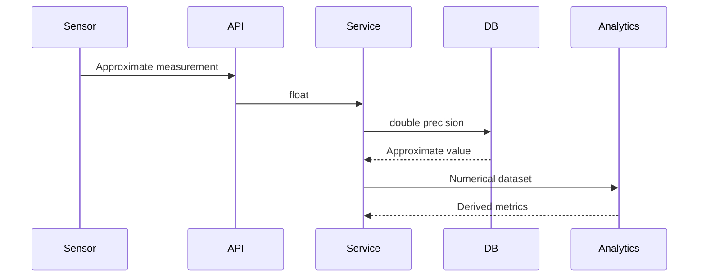

# 04- Floating Point Types

## Overview

Floating-point types store **approximate numeric values** using a finite binary representation. They are designed for workloads where a wide numeric range, compact storage, and fast arithmetic are more important than exact decimal representation.

In PostgreSQL, the primary floating-point types are:

- `real` — single-precision floating point.
- `double precision` — double-precision floating point.

Floating-point types are appropriate for domains such as scientific measurements, simulations, telemetry, statistics, and other workloads where small representation errors are acceptable.

They are generally a poor choice for financial amounts, accounting balances, currency values, and other domains that require exact decimal arithmetic.

```sql
CREATE TABLE sensor_readings (
    id bigint GENERATED ALWAYS AS IDENTITY PRIMARY KEY,
    sensor_id bigint NOT NULL,
    temperature double precision NOT NULL,
    recorded_at timestamptz NOT NULL
);
```

The central engineering decision is not whether floating point is "good" or "bad". It is whether **approximate representation matches the semantics of the data**.

## Floating Point Fundamentals

A floating-point number represents a value approximately using components conceptually similar to:

```text
sign × significand × base^exponent
```

Modern systems typically use IEEE 754 binary floating-point representations.

A finite number of bits must represent:

- The sign.
- The significant digits.
- The exponent.

Because the representation is binary, many decimal fractions cannot be represented exactly.

For example:

```text
0.1
```

has no finite exact representation in binary floating point.

Consequently, arithmetic can produce results such as:

```text
0.1 + 0.2 ≈ 0.30000000000000004
```

The exact displayed result depends on the programming language, database, data type, and formatting rules, but the underlying issue is the same: the representation is approximate.

## PostgreSQL Floating-Point Types

PostgreSQL provides two standard floating-point types.

| Type | Approximate precision | Typical storage | Typical use |
|---|---:|---:|---|
| `real` | ~6 decimal digits | 4 bytes | Space-sensitive approximate values |
| `double precision` | ~15 decimal digits | 8 bytes | General-purpose floating-point calculations |

The number of decimal digits is an approximation because binary floating-point precision does not map directly to a fixed number of decimal digits.

### `real`

```sql
CREATE TABLE measurements (
    value real NOT NULL
);
```

`real` uses single precision and consumes less storage than `double precision`.

It can be appropriate when:

- Approximation is acceptable.
- Precision requirements are modest.
- Storage footprint matters.
- The source data itself has limited precision.

However, the reduced precision can become problematic when values are repeatedly transformed or aggregated.

### `double precision`

```sql
CREATE TABLE telemetry (
    value double precision NOT NULL
);
```

`double precision` provides substantially greater precision and range than `real` while remaining a fixed-width floating-point type.

It is generally the better default when floating-point arithmetic is required and there is no strong reason to use single precision.

Typical applications include:

- Scientific calculations.
- Geographic calculations.
- Sensor data.
- Statistical computations.
- Performance-oriented numerical processing.
- Approximate ratios and metrics.
- Simulation data.

## Exact Numeric vs Floating Point

The most important comparison is between approximate floating point and exact decimal arithmetic.

| Property | `numeric` / `decimal` | `real` | `double precision` |
|---|---|---|---|
| Representation | Exact decimal | Approximate binary | Approximate binary |
| Storage | Variable | 4 bytes | 8 bytes |
| Arithmetic | Exact within defined semantics | Approximate | Approximate |
| Performance | Generally slower | Fast | Fast |
| Range | Very large | Large | Very large |
| Financial values | Preferred | Avoid | Avoid |
| Scientific calculations | Often unnecessary | Sometimes suitable | Commonly suitable |
| Repeated calculations | Predictable decimal semantics | Error can accumulate | Error can accumulate |

Use floating point because the domain accepts approximation, not merely because the database supports it.

## Why Decimal Fractions Are Approximate

Consider:

```text
0.1
```

In decimal:

```text
0.1 = 1 / 10
```

In binary, the denominator contains a factor of 5:

```text
10 = 2 × 5
```

Therefore, the binary expansion is repeating rather than finite.

A floating-point implementation must truncate or round that representation to fit into its available bits.

This means that the stored value can be extremely close to `0.1` without being exactly `0.1`.

The same principle applies to many other decimal fractions.

## Precision and Range

Floating-point types trade precision for range.

A floating-point number can represent extremely large and extremely small magnitudes because the exponent provides a wide dynamic range.

However, precision is limited.

For example, a floating-point type may be unable to distinguish between two very large numbers that differ by a small amount.

Conceptually:

```text
large_value
large_value + 1
```

may become indistinguishable once the magnitude becomes sufficiently large relative to the available significand precision.

This matters in systems that:

- Accumulate large totals.
- Mix very large and very small values.
- Perform repeated transformations.
- Require exact ordering near large magnitudes.

## Comparison Problems

Direct equality comparisons with floating-point values can be unsafe.

Avoid assuming:

```sql
SELECT 0.1::double precision + 0.2::double precision
       = 0.3::double precision;
```

will behave like exact decimal arithmetic.

For approximate values, comparisons often need a tolerance.

For example:

```sql
SELECT abs(actual_value - expected_value) < 0.000001
FROM measurements;
```

The tolerance should come from the domain's acceptable error rather than being an arbitrary constant.

A relative comparison can be more appropriate when values vary greatly in magnitude.

Conceptually:

```text
absolute_error <= tolerance
```

may be suitable for values within a known range, while:

```text
relative_error <= tolerance
```

is often more meaningful across different scales.

## Rounding

Rounding a floating-point value for display does not make the underlying representation exact.

For example:

```sql
SELECT round(1.234567::numeric, 2);
```

uses `numeric` explicitly and produces a decimal result.

Do not use presentation rounding as a substitute for selecting the correct data type.

If the domain requires exact two-decimal monetary arithmetic:

```sql
amount numeric(12, 2)
```

is preferable to:

```sql
amount double precision
```

followed by:

```sql
round(amount, 2)
```

The latter may hide approximation rather than eliminate it.

## Accumulation Error

Floating-point errors can accumulate during repeated calculations.

Consider:

```sql
SELECT SUM(measurement)
FROM sensor_readings;
```

The result is approximate if `measurement` is floating point.

This can matter when:

- Billions of values are aggregated.
- Values have dramatically different magnitudes.
- Repeated transformations are performed.
- The result is used as an exact threshold.
- Small errors have business significance.

For analytical and scientific workloads, this is often acceptable.

For accounting workloads, it usually is not.

## Order of Operations

Floating-point arithmetic is not always associative in the mathematical sense.

Conceptually:

```text
(a + b) + c
```

can produce a slightly different result from:

```text
a + (b + c)
```

because each intermediate operation may round the result.

This becomes important in:

- Large aggregations.
- Parallel computation.
- Distributed systems.
- Scientific simulations.
- Numerical algorithms.

A senior engineer should therefore avoid assuming that mathematically equivalent execution plans necessarily produce bit-for-bit identical floating-point results.

## Database and Application Boundaries

Floating-point semantics must remain consistent across the backend.

A typical data flow might be:



The important property is that every layer understands the value as approximate.

Problems occur when one layer assumes exactness:

```text
Client → float → database → exact business decision
```

The representation is approximate, but the business logic treats it as exact.

## Python and Floating Point

Python's `float` normally corresponds to a C double-precision floating-point value.

```python
value = 0.1 + 0.2

print(value)
```

This demonstrates the same binary floating-point behavior encountered in databases.

For scientific and numerical workloads, Python's `float` is often appropriate.

For exact decimal calculations:

```python
from decimal import Decimal

value = Decimal("0.1") + Decimal("0.2")
```

This produces exact decimal arithmetic under `Decimal` semantics.

The application type should match the database type and domain requirements.

## Django Field Mapping

Django provides `FloatField` for floating-point values.

```python
from django.db import models


class SensorReading(models.Model):
    sensor_id = models.BigIntegerField()
    temperature = models.FloatField()
    recorded_at = models.DateTimeField()
```

`FloatField` is appropriate for approximate numerical data.

For exact decimal values, use:

```python
class Product(models.Model):
    price = models.DecimalField(
        max_digits=12,
        decimal_places=2,
    )
```

Do not select `FloatField` merely because the Python application receives JSON numbers.

The correct choice depends on the domain semantics.

## FastAPI and Pydantic

A FastAPI endpoint might accept an approximate measurement as:

```python
from pydantic import BaseModel


class SensorReading(BaseModel):
    temperature: float
```

This is reasonable when the source measurement itself is approximate.

For an exact monetary amount:

```python
from decimal import Decimal

from pydantic import BaseModel


class PaymentRequest(BaseModel):
    amount: Decimal
```

The distinction should be preserved across API validation, application logic, and persistence.

## Scientific and Telemetry Data

Floating point is a natural fit for sensor and telemetry workloads.

```sql
CREATE TABLE cpu_metrics (
    host_id bigint NOT NULL,
    utilization double precision NOT NULL,
    collected_at timestamptz NOT NULL
);
```

A value such as:

```text
0.734921
```

does not normally need exact decimal semantics.

The system is usually more concerned with:

- Efficient ingestion.
- Storage footprint.
- Query throughput.
- Statistical analysis.
- Aggregation.
- Time-series processing.

Floating-point approximation is often insignificant compared with the measurement uncertainty of the underlying sensor.

## Geographic Calculations

Floating-point types are commonly used for approximate coordinates and calculations.

For example:

```sql
CREATE TABLE device_locations (
    device_id bigint PRIMARY KEY,
    latitude double precision NOT NULL,
    longitude double precision NOT NULL
);
```

However, geography has additional requirements.

If the application requires accurate geospatial operations, use PostgreSQL's appropriate spatial extensions and types rather than assuming `double precision` alone provides geospatial correctness.

The numeric type determines representation; it does not provide coordinate-system or spatial semantics.

## Special Floating-Point Values

PostgreSQL floating-point types can represent special values such as:

```text
NaN
Infinity
-Infinity
```

These values can have surprising behavior in application code and SQL expressions.

Example:

```sql
SELECT 'NaN'::double precision;
```

Whether special values are valid should be an explicit domain decision.

For ordinary telemetry or API data, accepting `NaN` or infinity may create downstream problems because not every serialization format, language runtime, or client handles them consistently.

If the domain does not permit them, validate input accordingly.

## NULL vs NaN

`NULL` and `NaN` are fundamentally different.

| Value | Meaning |
|---|---|
| `NULL` | No value / unknown / missing |
| `NaN` | A floating-point special value representing "not a number" |
| `Infinity` | Positive unbounded floating-point value |
| `-Infinity` | Negative unbounded floating-point value |

Do not use `NaN` as a generic replacement for missing data.

If a sensor failed to report a measurement, the correct representation may be:

```sql
temperature double precision NULL
```

rather than:

```sql
temperature double precision NOT NULL
```

with `NaN`.

The correct choice depends on the domain and downstream processing requirements.

## Constraints on Floating-Point Columns

Database constraints can still protect floating-point data.

For example:

```sql
CREATE TABLE sensors (
    id bigint GENERATED ALWAYS AS IDENTITY PRIMARY KEY,
    temperature double precision NOT NULL,
    CHECK (temperature >= -100 AND temperature <= 200)
);
```

This protects against values outside the application's expected physical range.

However, the constraint does not make the floating-point value exact.

It only enforces a domain boundary.

For systems accepting external measurements, validation should occur at the API boundary and at the database boundary when the invariant is important.

## Indexing Floating-Point Values

Floating-point columns can be indexed.

```sql
CREATE INDEX idx_sensor_readings_temperature
ON sensor_readings(temperature);
```

Whether this is useful depends on the query workload.

A query such as:

```sql
SELECT *
FROM sensor_readings
WHERE temperature > 80;
```

may benefit from an index if the predicate is selective.

However, queries based on approximate equality are usually more complicated:

```sql
WHERE temperature = 21.5
```

A value that is mathematically expected to be `21.5` may not have exactly the representation assumed by the application.

For approximate matching, consider a range:

```sql
WHERE temperature >= 21.499999
  AND temperature <= 21.500001
```

The tolerance should be domain-specific.

## Performance Characteristics

Floating-point arithmetic is generally efficient because the values use fixed-width representations and modern CPUs provide hardware support for common floating-point operations.

Compared with high-precision `numeric` calculations, floating point can offer:

- Lower storage cost.
- Faster arithmetic.
- Better CPU cache behavior.
- Efficient vectorized processing.
- Efficient analytical workloads.

However, database performance is not determined by the numeric type alone.

Query plans, indexes, memory, I/O, parallelism, and workload characteristics often dominate total query performance.

Do not switch from `numeric` to `double precision` solely for theoretical performance without measuring the actual workload.

## Production Considerations

### Choose Floating Point for Approximate Domains

Good candidates include:

- Temperature.
- Pressure.
- Sensor readings.
- Probabilities.
- Statistical measurements.
- Simulation output.
- Scientific calculations.
- Approximate ratios.

The key question is whether small representation errors can be tolerated.

### Avoid Floating Point for Financial Data

Avoid:

```sql
price double precision
balance double precision
tax double precision
```

Prefer:

```sql
price numeric(12, 2)
balance numeric(19, 4)
tax numeric(12, 2)
```

or a carefully designed scaled-integer representation where appropriate.

### Define Acceptable Error

For numerical systems, document:

- Expected precision.
- Acceptable absolute error.
- Acceptable relative error.
- Rounding behavior.
- Valid range.
- Handling of `NaN`.
- Handling of infinity.
- Overflow and underflow behavior.

A requirement such as "temperature must be accurate" is incomplete.

A requirement such as "measurements must remain within ±0.01°C for values between -50°C and 150°C" is operationally meaningful.

### Serialization

JSON and other interchange formats can introduce additional issues.

A backend may receive:

```json
{
  "temperature": 21.35
}
```

The value is interpreted by the receiving language and eventually converted into its numerical representation.

For approximate measurements this is normally acceptable.

For exact decimals, an explicit decimal representation may be preferable:

```json
{
  "amount": "19.99"
}
```

The API contract should define the intended semantics.

### Distributed Systems

Floating-point results can vary slightly across:

- Different languages.
- CPU architectures.
- Database engines.
- Compiler optimizations.
- Parallel execution strategies.
- Aggregation order.

Do not use exact floating-point equality as a distributed consistency mechanism.

For example, two services independently calculating the same metric may produce values differing in the final few bits.

If the value is used for business decisions, define an acceptable tolerance or use an exact representation.

## Common Mistakes and Pitfalls

| Mistake | Problem | Better approach |
|---|---|---|
| Using `double precision` for money | Approximation can affect financial correctness | Use `numeric` or scaled integers |
| Comparing floats with `=` | Exact binary representation may differ | Compare using an appropriate tolerance |
| Assuming `round()` makes float exact | Rounding affects the result, not the fundamental representation | Use an exact type when exactness is required |
| Using `real` without a precision requirement | Six-ish decimal digits may be insufficient | Evaluate whether `double precision` is safer |
| Treating `NaN` as missing data | `NaN` is not equivalent to SQL `NULL` | Use `NULL` when the value is missing |
| Ignoring accumulation error | Repeated operations can amplify error | Define numerical error requirements |
| Assuming mathematical associativity | Floating-point operation order can affect results | Design numerical algorithms accordingly |
| Converting float to `Decimal` after the fact | Approximation may already be embedded | Preserve exact decimal input from the beginning |
| Assuming database and application floats are identical | Language/runtime differences can matter | Define and test cross-system numerical behavior |
| Using arbitrary tolerances | Can hide real defects or reject valid results | Derive tolerance from domain requirements |

## Interview Traps

### Why Is `0.1 + 0.2` Not Necessarily Exactly `0.3`?

Because binary floating-point cannot exactly represent many decimal fractions. Each value is stored as the nearest representable binary value, so arithmetic can introduce a small representation error.

### Why Use `double precision` Instead of `numeric`?

When approximate arithmetic is acceptable and the workload benefits from fixed-width floating-point representation, `double precision` can provide efficient computation with a wide range.

`numeric` is preferable when exact decimal semantics are required.

### Is Floating Point Inaccurate?

"Floating point is inaccurate" is an incomplete statement.

Floating point is **approximate by design**. It provides a controlled trade-off between precision, range, storage, and performance.

For scientific computation, that approximation can be entirely appropriate.

### Why Can Floating-Point Results Differ Between Systems?

Operations can be affected by:

- Floating-point representation.
- Operation ordering.
- CPU instructions.
- Compiler optimizations.
- Parallel execution.
- Database execution plans.

Therefore, exact bit-for-bit equality should not automatically be expected across independent implementations.

### What Is the Difference Between `real` and `double precision`?

`real` uses single precision and requires less storage. `double precision` uses double precision and provides substantially more precision.

When floating point is required, `double precision` is generally the safer default unless the lower precision and storage requirements of `real` are intentional.

### Is `NaN` the Same as `NULL`?

No.

`NULL` represents the absence or unknown state of a database value, while `NaN` is a floating-point special value.

They have different SQL semantics and should not be treated interchangeably.

## Key Takeaways

- **Floating-point types are approximate by design and are appropriate when the domain can tolerate numerical error.**
- **Use `double precision` for most general-purpose floating-point workloads unless single precision is an explicit requirement.**
- **Do not use floating point for financial or other exact-decimal domains; use `numeric`/`decimal` or a carefully designed scaled-integer representation.**
- **Avoid direct floating-point equality when approximate values are expected; use domain-defined tolerances and understand accumulation and ordering errors.**
- **Treat `NULL`, `NaN`, and infinity as distinct states and define their handling explicitly across the database, application, and API boundaries.**