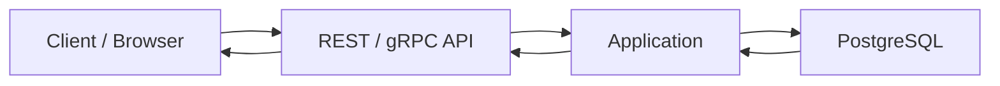
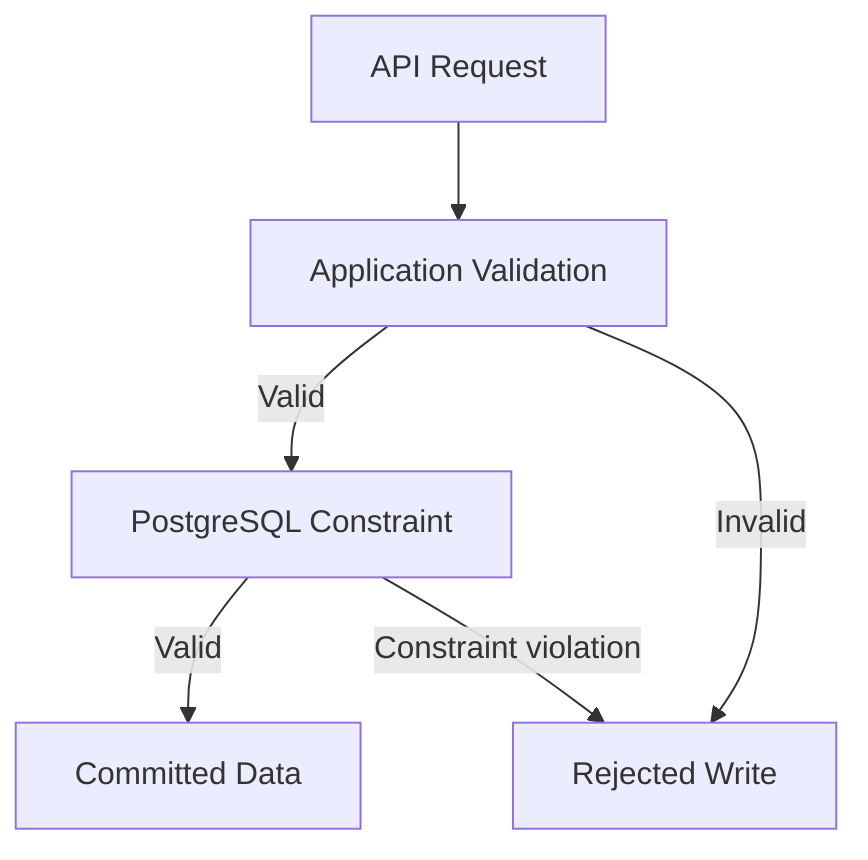

# 05- Character Types

## Overview

Character types store textual data such as names, identifiers, labels, descriptions, email addresses, and free-form content. Choosing the correct character type affects storage, validation, indexing, comparison semantics, portability, and application behavior.

In PostgreSQL, the primary character types are:

- `character varying(n)` / `varchar(n)` — variable-length strings with an optional maximum length.
- `character(n)` / `char(n)` — fixed-length strings, padded to the declared length.
- `text` — variable-length strings without a declared maximum length.

For most PostgreSQL applications, `text` or unconstrained `varchar` is the practical default. Length restrictions should generally be modeled as business constraints only when they have actual domain meaning.

```sql
CREATE TABLE users (
    id bigint GENERATED ALWAYS AS IDENTITY PRIMARY KEY,
    username text NOT NULL,
    email text NOT NULL,
    display_name text,
    created_at timestamptz NOT NULL DEFAULT now()
);
```

The important design question is not simply "Which string type is fastest?" It is **where the application's text constraints belong and what semantics the database must enforce**.

## PostgreSQL Character Types

| Type | Storage model | Length restriction | Typical use |
|---|---|---|---|
| `text` | Variable length | None | General application text |
| `varchar` | Variable length | None if no `n` | General application text / portability |
| `varchar(n)` | Variable length | Maximum of `n` characters | Domain-level maximum length |
| `char(n)` | Fixed-length, blank-padded | Exactly `n` characters semantically | Fixed-width domain values |

`text` and `varchar` without a length limit have essentially equivalent storage and performance characteristics in PostgreSQL.

### `text`

```sql
CREATE TABLE customers (
    id bigint GENERATED ALWAYS AS IDENTITY PRIMARY KEY,
    name text NOT NULL
);
```

`text` is PostgreSQL's general-purpose variable-length string type.

Use it when:

- The domain does not have a meaningful maximum length.
- The database does not need to enforce a length limit.
- The application already validates input.
- The column stores general textual data.

Advantages:

- No arbitrary maximum length.
- Simple schema.
- No performance penalty compared with unconstrained `varchar`.
- Works naturally with PostgreSQL text functions and indexes.

A `text` column can still have a business constraint:

```sql
CREATE TABLE products (
    id bigint GENERATED ALWAYS AS IDENTITY PRIMARY KEY,
    name text NOT NULL,
    CHECK (char_length(name) BETWEEN 1 AND 200)
);
```

This separates the **storage type** from the **business rule**.

### `varchar`

```sql
CREATE TABLE users (
    username varchar NOT NULL
);
```

In PostgreSQL, `varchar` without a length behaves similarly to `text`.

The choice is therefore usually about:

- Schema conventions.
- SQL portability.
- Team preference.
- Existing database standards.

Do not assume `varchar` is inherently faster or more storage-efficient than `text` in PostgreSQL.

### `varchar(n)`

```sql
CREATE TABLE users (
    username varchar(100) NOT NULL
);
```

`varchar(100)` enforces a maximum length.

An insert exceeding the declared limit fails:

```sql
INSERT INTO users (username)
VALUES ('a-very-long-value-that-exceeds-the-declared-limit');
```

Use `varchar(n)` when the maximum length is a meaningful domain invariant.

For example, if an external protocol guarantees an identifier cannot exceed 64 characters and that limit is part of the domain contract, encoding the constraint in the database can be reasonable.

However, do not add arbitrary limits simply because the column "looks like it should have one."

### `char(n)`

```sql
CREATE TABLE country_codes (
    code char(2) NOT NULL
);
```

`char(n)` is a fixed-length character type and is blank-padded to the declared length.

For example:

```sql
code char(5)
```

conceptually stores values using a fixed declared width.

`char(n)` is rarely the best choice for ordinary application strings.

It can be appropriate for genuinely fixed-width values where the fixed-width semantics are part of the data model.

## `char(n)` vs `varchar(n)` vs `text`

| Requirement | Recommended type |
|---|---|
| General text | `text` |
| Variable-length string with no database maximum | `text` or `varchar` |
| Variable-length string with meaningful maximum | `varchar(n)` or `text` + `CHECK` |
| Truly fixed-width value | `char(n)` |
| Large textual content | `text` |
| User-generated descriptions | `text` |
| Short business identifier | `text`/`varchar` with an appropriate constraint |
| Binary data | `bytea`, not a character type |

## Character Length vs Byte Length

One important distinction is between:

- Character count.
- Byte count.

PostgreSQL's character types use character-oriented length semantics rather than simply treating a string as a sequence of bytes.

For example:

```sql
SELECT char_length('café');
```

returns the number of characters, while:

```sql
SELECT octet_length('café');
```

returns the number of bytes in the encoded representation.

The distinction matters for Unicode text because one character can require multiple bytes in UTF-8.

```text
Character count ≠ byte count
```

This is important when designing:

- API limits.
- Database constraints.
- Message sizes.
- Storage estimates.
- External protocol integrations.

## Unicode and Encoding

Modern backend systems should assume that textual data can contain Unicode unless the domain explicitly restricts it.

Examples include:

```text
José
東京
Москва
مرحبا
😀
```

PostgreSQL databases use a database encoding configured at database creation time. UTF-8 is the standard choice for modern applications.

The application, database, API, and external systems should agree on encoding semantics.

A typical request path is:



Text can be transformed or validated at every boundary. A character that is accepted by the application may still fail downstream if an external system has stricter encoding or length requirements.

## String Length

PostgreSQL provides functions for examining text length.

```sql
SELECT
    char_length('hello') AS characters,
    octet_length('hello') AS bytes;
```

For Unicode:

```sql
SELECT
    char_length('東京') AS characters,
    octet_length('東京') AS bytes;
```

Use `char_length()` when the business rule is expressed in characters.

Use `octet_length()` when the requirement concerns encoded bytes.

For example, an API gateway or external protocol might impose a byte-level payload restriction rather than a character-level restriction.

## Constraints vs Data Types

A common design mistake is assuming that the type itself should encode every business rule.

Instead of:

```sql
username varchar(50) NOT NULL
```

you may prefer:

```sql
username text NOT NULL
    CHECK (char_length(username) BETWEEN 3 AND 50)
```

The second form makes the rule explicit as a constraint.

This becomes useful when the restriction is a business invariant rather than a storage characteristic.

For example:

```sql
CREATE TABLE accounts (
    id bigint GENERATED ALWAYS AS IDENTITY PRIMARY KEY,
    username text NOT NULL,
    CHECK (char_length(username) BETWEEN 3 AND 50)
);
```

The database now protects the invariant regardless of whether the write originated from:

- Django.
- FastAPI.
- A background worker.
- A migration.
- An administrative SQL session.
- Another microservice.

## Application Validation vs Database Constraints

Application validation improves user experience, while database constraints protect data integrity.

A production system often needs both.



For example, a FastAPI application might validate:

```python
from pydantic import BaseModel, Field


class CreateUserRequest(BaseModel):
    username: str = Field(min_length=3, max_length=50)
```

The database should still enforce the invariant if it is critical:

```sql
CHECK (char_length(username) BETWEEN 3 AND 50)
```

Application validation is not a substitute for database integrity constraints.

## Case Sensitivity

Character comparisons are affected by database collation and comparison semantics.

For example:

```sql
SELECT 'User' = 'user';
```

does not simply mean "compare the strings ignoring case."

Case-insensitive application requirements should be modeled explicitly.

For example, PostgreSQL provides the `citext` extension for case-insensitive text semantics:

```sql
CREATE EXTENSION IF NOT EXISTS citext;

CREATE TABLE accounts (
    email citext NOT NULL UNIQUE
);
```

Alternatively, a system can normalize values at write time.

For example:

```text
Input:
User@Example.com

Canonical representation:
user@example.com
```

The correct approach depends on the domain.

Do not assume that lowercasing every string is universally correct. Case can be semantically meaningful for some identifiers and textual data.

## Collation

Collation determines how text is compared and sorted according to locale and database configuration.

It can affect:

- Ordering.
- Equality in some contexts.
- Pattern matching behavior.
- Index behavior.
- Locale-specific comparisons.

For example:

```sql
SELECT name
FROM customers
ORDER BY name;
```

does not necessarily produce the same ordering under every collation.

Production systems should explicitly understand the database's locale and collation configuration, especially when supporting internationalized applications.

## Trailing Spaces and `char(n)`

`char(n)` has special semantics around padding.

For example:

```sql
CREATE TABLE codes (
    value char(5)
);
```

A value shorter than five characters is blank-padded according to the type's semantics.

This can create surprising behavior when application code expects ordinary variable-length strings.

For most application identifiers:

```sql
text
```

or:

```sql
varchar(n)
```

is easier to reason about.

Use `char(n)` only when fixed-width semantics provide a real domain benefit.

## Empty String vs NULL

These are distinct states:

```sql
NULL
```

means the value is absent or unknown, while:

```sql
''
```

is an existing string containing zero characters.

For example:

```sql
SELECT
    NULL IS NULL,
    '' = '';
```

Applications should define whether an empty string is meaningful.

A nullable field:

```sql
display_name text
```

allows both:

```text
NULL
''
```

unless a constraint prevents one of them.

If empty strings should not be stored:

```sql
display_name text
    CHECK (char_length(trim(display_name)) > 0)
```

For nullable values, remember that `CHECK` constraints need careful design because SQL's three-valued logic treats `NULL` differently.

A stricter constraint might be:

```sql
CHECK (
    display_name IS NULL
    OR char_length(trim(display_name)) > 0
)
```

## Whitespace Normalization

Do not automatically assume whitespace is insignificant.

These values may be different:

```text
"Acme"
" Acme"
"Acme "
"Acme  Corporation"
```

Whether they should be normalized depends on the domain.

For usernames, email addresses, search keys, and external identifiers, canonicalization can be useful.

For human-readable names and descriptions, silently modifying user input can be undesirable.

A production design should define:

- Leading whitespace behavior.
- Trailing whitespace behavior.
- Repeated whitespace behavior.
- Unicode normalization requirements.
- Case normalization requirements.

## Indexing Character Columns

Text columns can be indexed using standard B-tree indexes.

```sql
CREATE INDEX idx_users_username
ON users (username);
```

This can support appropriate equality and ordered comparisons.

For prefix searches:

```sql
SELECT *
FROM users
WHERE username LIKE 'admin%';
```

a suitable index may be usable depending on database configuration, collation, operator class, and query shape.

For general substring searches:

```sql
WHERE username LIKE '%admin%'
```

a normal B-tree index generally cannot efficiently satisfy the leading-wildcard search.

PostgreSQL's `pg_trgm` extension can be useful for such workloads:

```sql
CREATE EXTENSION IF NOT EXISTS pg_trgm;

CREATE INDEX idx_users_username_trgm
ON users USING gin (username gin_trgm_ops);
```

Use specialized indexes based on measured query patterns rather than indexing every text column by default.

## Full-Text Search

Do not use ordinary `LIKE` queries as a general-purpose search engine for large textual datasets.

PostgreSQL provides full-text search capabilities using types and functions such as:

```sql
to_tsvector()
to_tsquery()
```

Example:

```sql
SELECT id, title
FROM articles
WHERE to_tsvector('english', body)
      @@ plainto_tsquery('english', 'distributed systems');
```

For large-scale search requirements, a dedicated search engine may be more appropriate depending on workload and relevance requirements.

The important design distinction is:

```text
Exact lookup → B-tree
Prefix lookup → Appropriate B-tree strategy
Substring lookup → pg_trgm / specialized index
Semantic/full-text search → Full-text search or search platform
```

## Large Text Values and Storage

PostgreSQL can store large `text` values. Internally, PostgreSQL may use mechanisms such as TOAST to store large variable-length values outside the main table page.

This allows a row to contain text larger than the size of a single ordinary heap page without requiring application-managed large-object storage for typical use cases.

However, large text values can still affect:

- I/O.
- Network transfer.
- Query latency.
- Memory usage.
- Replication traffic.
- Backup size.
- Application serialization cost.

Do not select `text` merely because PostgreSQL supports large values. Model large content according to how it will actually be accessed.

For very large documents, images, videos, and other objects, object storage such as Amazon S3 is often more appropriate than storing the payload directly in a relational table.

## Character Types and APIs

REST APIs commonly serialize strings as JSON strings:

```json
{
  "username": "aranya",
  "display_name": "Backend Engineer"
}
```

The API contract should define meaningful limits where necessary.

For example:

```python
from pydantic import BaseModel, Field


class ProfileUpdate(BaseModel):
    display_name: str | None = Field(default=None, max_length=200)
```

The database can independently enforce the same invariant:

```sql
CHECK (
    display_name IS NULL
    OR char_length(display_name) <= 200
)
```

This provides defense in depth.

## Character Types in Django

Django commonly uses `CharField` for bounded strings and `TextField` for unrestricted text.

```python
from django.db import models


class UserProfile(models.Model):
    username = models.CharField(max_length=50)
    bio = models.TextField()
```

The distinction is useful at the application layer because Django requires `max_length` for `CharField`.

For PostgreSQL specifically, do not assume that choosing `TextField` instead of `CharField` automatically provides a database-level maximum. If a maximum is a real invariant, enforce it explicitly.

Django can also apply validation constraints at the model/application level, but critical invariants should be enforced by the database where practical.

## Character Types and Microservices

In a microservice architecture, textual constraints should be consistent across service boundaries.

Consider:

```text
Service A
    ↓
Kafka
    ↓
Service B
    ↓
PostgreSQL
```

If Service A permits:

```text
username <= 500 characters
```

while Service B assumes:

```text
username <= 50 characters
```

the system has an implicit contract violation.

Prefer explicit schemas and contracts for shared data:

- OpenAPI.
- Protobuf.
- JSON Schema.
- Kafka schema management.
- Database constraints.

Do not rely solely on documentation to communicate critical limits.

## Security Considerations

Character fields frequently contain attacker-controlled input.

Use parameterized queries rather than constructing SQL with string interpolation.

Bad:

```python
query = f"SELECT * FROM users WHERE username = '{username}'"
```

Good:

```python
cursor.execute(
    "SELECT id, username FROM users WHERE username = %s",
    (username,),
)
```

Character types do not protect against SQL injection. Query parameterization does.

Also consider:

- Maximum request sizes.
- Maximum string lengths.
- Unicode normalization.
- Control characters.
- Log injection.
- HTML escaping.
- Output encoding.
- Sensitive data exposure.
- Search abuse.
- Regex or pattern-matching denial-of-service risks.

Database storage and presentation-layer escaping solve different problems.

## Performance and Scalability

Character columns can become expensive when they are:

- Very large.
- Frequently selected unnecessarily.
- Repeatedly serialized.
- Included in large indexes.
- Used in expensive pattern searches.

For example, avoid:

```sql
SELECT *
FROM users;
```

when a query only needs:

```sql
SELECT id, username
FROM users;
```

This reduces database I/O and application-side serialization.

For high-throughput APIs:

- Select only required columns.
- Avoid unnecessarily large text fields in hot queries.
- Index lookup fields selectively.
- Use pagination.
- Use specialized search indexes for search workloads.
- Measure query plans with `EXPLAIN (ANALYZE, BUFFERS)`.

## Production Recommendations

### Prefer Semantic Constraints

Do not blindly use:

```sql
varchar(255)
```

for every string.

The number `255` is often inherited from historical conventions rather than an actual domain requirement.

Instead, ask:

- Does the domain have a real maximum?
- Is the limit defined by an external protocol?
- Does the API contract require a limit?
- Does the database need to reject oversized values?
- Is the constraint measured in characters or bytes?

### Keep Validation at Multiple Boundaries

A robust system can validate:

```text
API → Application → Database
```

Each layer serves a different purpose:

| Layer | Primary purpose |
|---|---|
| API | Client feedback and contract enforcement |
| Application | Business validation and normalization |
| Database | Final integrity guarantee |

### Avoid Premature Indexing

A text index consumes storage and increases write cost.

Before adding one, determine:

- Query frequency.
- Selectivity.
- Query pattern.
- Table size.
- Write volume.
- Index maintenance cost.

Use `EXPLAIN` to validate the expected query plan.

### Define Canonical Representations

For identifiers used in uniqueness checks, define canonicalization rules explicitly.

For example:

```text
Email:
Case normalization → defined
Whitespace → trimmed
Unicode normalization → defined if required
Database uniqueness → enforced
```

Do not rely on accidental behavior across different application services.

## Common Mistakes and Pitfalls

| Mistake | Problem | Better approach |
|---|---|---|
| Using `varchar(255)` everywhere | Arbitrary limits become accidental domain rules | Use `text` or a meaningful constraint |
| Assuming `varchar` is faster than `text` | PostgreSQL treats them similarly when unconstrained | Choose based on semantics |
| Using `char(n)` for ordinary strings | Padding and comparison semantics can surprise application code | Prefer `text` or `varchar` |
| Confusing characters with bytes | Unicode makes the distinction important | Use `char_length()` or `octet_length()` appropriately |
| Treating `NULL` and `''` as equivalent | Creates inconsistent data semantics | Define and enforce the intended representation |
| Comparing strings without understanding collation | Ordering and comparison may differ by locale | Define collation requirements |
| Using `LIKE '%term%'` on huge tables | Leading wildcard prevents efficient normal B-tree lookup | Consider `pg_trgm` or full-text search |
| Storing huge objects directly in hot rows | Increases I/O and network costs | Consider object storage such as S3 |
| Relying only on application validation | Other writers can bypass it | Enforce critical invariants in the database |
| Building SQL with string interpolation | Creates SQL injection risk | Use parameterized queries |
| Lowercasing every string | Can destroy meaningful case semantics | Normalize only according to domain rules |
| Indexing every text column | Increases storage and write overhead | Index based on actual query patterns |

## Interview Traps

### Is `text` slower than `varchar` in PostgreSQL?

Generally, no. `text` and `varchar` without a length modifier use essentially the same underlying variable-length representation and have comparable performance characteristics.

### Why Not Use `varchar(255)` Everywhere?

Because `255` is usually an arbitrary limit. If the domain has no such constraint, it adds schema complexity without providing meaningful integrity.

Use a real domain constraint when a maximum matters.

### When Should You Use `char(n)`?

Use it when fixed-width semantics are genuinely part of the domain. It is rarely appropriate for normal application strings.

### What Is the Difference Between `char_length()` and `octet_length()`?

`char_length()` counts characters, while `octet_length()` counts bytes in the encoded representation.

Unicode makes these values potentially different.

### Is `NULL` the Same as an Empty String?

No.

`NULL` represents an absent or unknown value. `''` represents an existing string with zero characters.

### Why Can a Normal Index Not Efficiently Handle `LIKE '%abc%'`?

A standard B-tree index is ordered and can efficiently support patterns anchored at the beginning under appropriate conditions. A leading wildcard means the database cannot directly narrow the search to a contiguous index range.

For large substring-search workloads, specialized indexes such as `pg_trgm` may be appropriate.

### Should String Validation Exist in Both the API and Database?

For important invariants, yes.

The API provides fast, user-friendly validation, while the database provides integrity regardless of which application or process performs the write.

## Key Takeaways

- **Use `text` or unconstrained `varchar` for general PostgreSQL strings; use `varchar(n)` or explicit `CHECK` constraints when a maximum length is a real domain invariant.**
- **Avoid `char(n)` for ordinary application text because fixed-width padding introduces semantics that rarely provide value.**
- **Design explicitly for Unicode, distinguishing character length from byte length and understanding encoding and collation behavior.**
- **Treat `NULL`, empty strings, case normalization, and whitespace as domain decisions rather than incidental implementation details.**
- **Choose text indexes according to query patterns: B-tree for suitable lookups, specialized indexes for substring search, and full-text/search infrastructure for broader search requirements.**