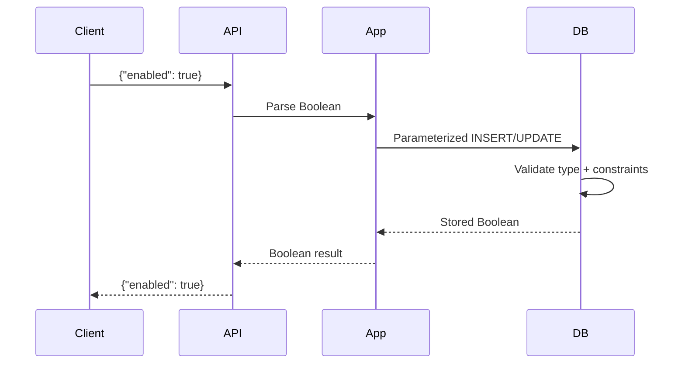

# 06- Boolean Types

## Overview

Boolean types represent logical state: `true` or `false`. They are commonly used for feature flags, activation state, soft-delete markers, verification status, visibility, and other binary business conditions.

In PostgreSQL, the native Boolean type is `boolean` (also accepted as `bool`).

```sql
CREATE TABLE users (
    id bigint GENERATED ALWAYS AS IDENTITY PRIMARY KEY,
    email text NOT NULL,
    is_active boolean NOT NULL DEFAULT true,
    email_verified boolean NOT NULL DEFAULT false
);
```

A Boolean column looks simple, but production design depends on an important distinction:

> A Boolean can represent either **two states** (`true`/`false`) or **three states** (`true`/`false`/`NULL`).

The third state is often where data-modeling bugs appear.

## PostgreSQL Boolean Type

PostgreSQL's Boolean type stores logical values:

```sql
true
false
```

PostgreSQL also supports several input representations, including:

```sql
TRUE
FALSE
't'
'f'
'yes'
'no'
'on'
'off'
'1'
'0'
```

For application schemas, prefer canonical SQL Boolean literals:

```sql
INSERT INTO users (email, is_active)
VALUES ('user@example.com', TRUE);
```

The output representation is normally:

```text
t
f
```

when displayed through common PostgreSQL clients, although applications typically receive the value through the database driver's Boolean mapping.

## Why Boolean Types Matter

Boolean columns encode state directly in the relational model instead of relying on conventions such as:

```text
status = 'Y'
status = 'N'
enabled = 1
enabled = 0
```

A native Boolean provides:

- Clear schema semantics.
- Type checking by the database.
- Natural application-language mapping.
- Straightforward predicates.
- Better readability.
- Compatibility with database constraints and indexes.

For example:

```sql
SELECT id
FROM users
WHERE is_active = TRUE;
```

is more expressive than:

```sql
SELECT id
FROM users
WHERE is_active = 1;
```

## Boolean Columns Should Usually Be `NOT NULL`

For genuinely binary state, prefer:

```sql
is_active boolean NOT NULL DEFAULT true
```

rather than:

```sql
is_active boolean
```

The nullable version permits three logical states:

| Stored value | Meaning |
|---|---|
| `TRUE` | Enabled |
| `FALSE` | Disabled |
| `NULL` | Unknown / absent / not applicable |

If the domain only has two states, allowing `NULL` creates unnecessary complexity.

### Two-State Model

```sql
CREATE TABLE feature_flags (
    id bigint GENERATED ALWAYS AS IDENTITY PRIMARY KEY,
    name text NOT NULL UNIQUE,
    enabled boolean NOT NULL DEFAULT false
);
```

The invariant is:

```text
enabled ∈ {true, false}
```

### Three-State Model

A nullable Boolean is appropriate when the third state has real business meaning.

```sql
CREATE TABLE customer_preferences (
    id bigint GENERATED ALWAYS AS IDENTITY PRIMARY KEY,
    customer_id bigint NOT NULL,
    marketing_email_opt_in boolean
);
```

Possible semantics could be:

```text
TRUE  → Customer opted in
FALSE → Customer explicitly opted out
NULL  → Customer has not made a choice
```

Here, `NULL` is not an accidental missing value. It represents a meaningful state.

## Boolean and `NULL`

SQL uses three-valued logic:

```text
TRUE
FALSE
UNKNOWN
```

`NULL` represents the absence of a known value, so Boolean expressions involving `NULL` can produce `UNKNOWN`.

For example:

```sql
SELECT NULL = TRUE;
```

does not return `TRUE` or `FALSE`; it evaluates to `NULL`/unknown.

This affects filtering.

Consider:

```sql
CREATE TABLE users (
    id bigint GENERATED ALWAYS AS IDENTITY PRIMARY KEY,
    is_active boolean
);
```

Then:

```sql
SELECT *
FROM users
WHERE is_active = TRUE;
```

returns only rows where `is_active` is `TRUE`.

It does not return rows where the value is `NULL`.

Similarly:

```sql
SELECT *
FROM users
WHERE is_active = FALSE;
```

returns only explicit `FALSE` values.

Neither query treats `NULL` as equivalent to either Boolean value.

## Boolean Predicates

PostgreSQL allows concise Boolean predicates.

Instead of:

```sql
SELECT *
FROM users
WHERE is_active = TRUE;
```

you can write:

```sql
SELECT *
FROM users
WHERE is_active;
```

For `FALSE`:

```sql
SELECT *
FROM users
WHERE NOT is_active;
```

These forms clearly express that the column itself is being used as a predicate.

For nullable Booleans, be careful:

```sql
WHERE NOT is_active
```

does not include `NULL`.

If the requirement is "anything that is not explicitly true," use:

```sql
WHERE is_active IS NOT TRUE;
```

Likewise:

```sql
WHERE is_active IS NOT FALSE;
```

includes both `TRUE` and `NULL`.

This distinction is an important SQL interview and production concept.

## `IS TRUE`, `IS FALSE`, and `IS UNKNOWN`

PostgreSQL supports explicit Boolean predicates:

```sql
WHERE is_active IS TRUE
```

```sql
WHERE is_active IS FALSE
```

```sql
WHERE is_active IS UNKNOWN
```

These are especially useful with nullable Boolean columns because they explicitly handle the three-valued logic.

| Predicate | `TRUE` | `FALSE` | `NULL` |
|---|---:|---:|---:|
| `value IS TRUE` | ✓ | | |
| `value IS FALSE` | | ✓ | |
| `value IS NOT TRUE` | | ✓ | ✓ |
| `value IS NOT FALSE` | ✓ | | ✓ |
| `value IS UNKNOWN` | | | ✓ |

When a Boolean is nullable, prefer explicit predicates when the intended treatment of `NULL` matters.

## Boolean Defaults

A default defines what happens when an insert omits the column.

```sql
CREATE TABLE jobs (
    id bigint GENERATED ALWAYS AS IDENTITY PRIMARY KEY,
    name text NOT NULL,
    enabled boolean NOT NULL DEFAULT true
);
```

This:

```sql
INSERT INTO jobs (name)
VALUES ('email-worker');
```

produces:

```text
enabled = true
```

A default does **not** prevent an explicitly supplied `NULL` from being stored if the column is nullable.

For example:

```sql
CREATE TABLE jobs (
    enabled boolean DEFAULT true
);
```

allows:

```sql
INSERT INTO jobs (enabled)
VALUES (NULL);
```

Therefore:

```sql
DEFAULT
```

and:

```sql
NOT NULL
```

solve different problems.

- `DEFAULT` supplies a value when one is omitted.
- `NOT NULL` prevents the column from containing `NULL`.

For a binary state, they are commonly used together:

```sql
enabled boolean NOT NULL DEFAULT true
```

## Boolean Constraints

Boolean values already have strong type semantics, but additional constraints can document business rules.

For example:

```sql
CREATE TABLE subscriptions (
    id bigint GENERATED ALWAYS AS IDENTITY PRIMARY KEY,
    is_active boolean NOT NULL DEFAULT false,
    cancelled boolean NOT NULL DEFAULT false,
    CHECK (NOT (is_active AND cancelled))
);
```

The constraint prevents an impossible combination:

```text
is_active = true
cancelled = true
```

However, when state transitions become complex, several independent Booleans may become difficult to reason about.

## Multiple Booleans vs Status Columns

Suppose a job can be:

```text
pending
running
completed
failed
cancelled
```

Modeling this with:

```sql
is_pending boolean,
is_running boolean,
is_completed boolean,
is_failed boolean,
is_cancelled boolean
```

creates many invalid combinations.

For example:

```text
is_running = true
is_completed = true
```

may be contradictory.

A status column is usually better:

```sql
status text NOT NULL
    CHECK (status IN (
        'pending',
        'running',
        'completed',
        'failed',
        'cancelled'
    ))
```

Use a Boolean when the domain is genuinely binary.

Use a status/state model when the entity has mutually exclusive lifecycle states.

## Boolean vs Enum-Like Status

| Requirement | Better model |
|---|---|
| Account enabled/disabled | `boolean` |
| Email verified/not verified | `boolean` |
| Feature enabled/disabled | `boolean` |
| Job lifecycle with many states | Status column |
| Order lifecycle | Status column |
| Payment lifecycle | Status column |
| Permission granted/not granted | `boolean` |
| User has accepted terms | `boolean` |
| Processing state with transitions | Status/state model |

A senior-level design question is not "Can I represent this with a Boolean?" but:

> "Does the Boolean accurately represent the domain's state space?"

## Boolean Indexing

A Boolean column has low cardinality:

```text
TRUE
FALSE
```

That means a conventional index on a Boolean is not automatically useful.

For example:

```sql
CREATE INDEX idx_users_is_active
ON users (is_active);
```

may provide limited benefit when approximately half the rows are active.

The optimizer may prefer a sequential scan because reading a large fraction of the table through an index can be more expensive.

### Partial Indexes

Partial indexes are often more useful when one Boolean value is highly selective and queried frequently.

For example:

```sql
CREATE INDEX idx_users_active
ON users (id)
WHERE is_active IS TRUE;
```

This can be useful for queries such as:

```sql
SELECT id
FROM users
WHERE is_active IS TRUE
  AND id > 100000;
```

A more realistic example is a work queue:

```sql
CREATE INDEX idx_jobs_pending
ON jobs (created_at, id)
WHERE processed IS FALSE;
```

This keeps the index focused on rows that are relevant to the workload.

Always validate the actual query plan:

```sql
EXPLAIN (ANALYZE, BUFFERS)
SELECT id
FROM jobs
WHERE processed IS FALSE
ORDER BY created_at, id
LIMIT 100;
```

Do not create Boolean indexes solely because a Boolean column appears in a `WHERE` clause.

## Boolean Columns and Query Performance

Boolean predicates are usually cheap to evaluate:

```sql
WHERE is_active
```

The larger performance question is typically **how many rows satisfy the predicate**.

For example:

```text
1% active     → potentially highly selective
50% active    → low selectivity
99% active    → low selectivity for active-row queries
```

This affects whether an index is useful.

For high-volume tables, consider:

- Selectivity.
- Query frequency.
- Table size.
- Data distribution.
- Index maintenance cost.
- Vacuum behavior.
- Actual execution plans.

## Boolean Data Flow in Backend Systems

A typical request might flow through multiple Boolean representations:



The database should remain the authoritative integrity boundary.

For example, an API might validate that a request contains a Boolean, but the database should still enforce:

```sql
enabled boolean NOT NULL
```

when the field is required to be binary.

## Boolean Types in Python

Python has native Boolean values:

```python
True
False
```

Database drivers generally map PostgreSQL `boolean` values to Python `bool`.

For example:

```python
enabled = True

cursor.execute(
    """
    UPDATE feature_flags
    SET enabled = %s
    WHERE name = %s
    """,
    (enabled, "new-checkout"),
)
```

Use parameterized queries rather than constructing SQL dynamically.

Avoid:

```python
query = f"""
    UPDATE feature_flags
    SET enabled = {enabled}
    WHERE name = '{name}'
"""
```

Parameterization protects the query from SQL injection and lets the database driver perform appropriate type handling.

## Boolean Types in Django

Django's `BooleanField` maps naturally to database Boolean types on PostgreSQL.

```python
from django.db import models


class FeatureFlag(models.Model):
    name = models.CharField(max_length=100, unique=True)
    enabled = models.BooleanField(default=False)
```

For a required binary field:

```python
enabled = models.BooleanField(default=False)
```

is generally preferable to designing an unnecessary nullable Boolean.

A nullable field:

```python
enabled = models.BooleanField(null=True)
```

introduces a third state and should have an explicit business meaning.

Django also has form and serializer-level validation behavior that is separate from the database constraint. Critical data invariants should still be enforced at the database layer where practical.

## Boolean Types in FastAPI

FastAPI with Pydantic can validate Boolean input at the API boundary.

```python
from pydantic import BaseModel


class FeatureFlagUpdate(BaseModel):
    enabled: bool
```

A request such as:

```json
{
  "enabled": true
}
```

can then be converted into a Python `bool`.

For partial updates:

```python
from pydantic import BaseModel


class FeatureFlagPatch(BaseModel):
    enabled: bool | None = None
```

Be careful here: `None` can mean "field not supplied" or "explicitly supplied as null" depending on how the request model is designed and accessed.

For PATCH semantics, distinguish between:

```text
field omitted
field = false
field = null
```

when the API contract requires those states to differ.

## Boolean API Design

A Boolean API field should use actual JSON Boolean values:

```json
{
  "is_active": true
}
```

not strings:

```json
{
  "is_active": "true"
}
```

and not arbitrary numeric conventions:

```json
{
  "is_active": 1
}
```

Using the correct Boolean representation keeps the contract consistent across:

```text
JSON → Python → PostgreSQL
```

and avoids coercion ambiguity.

## Boolean State Transitions

A Boolean often represents a state transition:

```text
false → true
true → false
```

For example:

```sql
UPDATE users
SET email_verified = TRUE
WHERE id = $1
  AND email_verified IS FALSE;
```

This pattern can be useful when the transition itself matters.

The condition prevents unnecessarily updating rows already in the desired state and can help implement compare-and-set style operations.

For more complex workflows, use explicit state transitions rather than accumulating independent Boolean flags.

## Concurrency Considerations

A Boolean update is still subject to normal database concurrency rules.

Consider two workers attempting:

```sql
UPDATE jobs
SET processed = TRUE
WHERE id = 42
  AND processed = FALSE;
```

Only one transaction may successfully change the row from `FALSE` to `TRUE` under normal row-locking behavior for the update.

The application should inspect the affected-row count if ownership of the transition matters.

For example:

```python
cursor.execute(
    """
    UPDATE jobs
    SET processed = TRUE
    WHERE id = %s
      AND processed = FALSE
    """,
    (job_id,),
)

if cursor.rowcount == 1:
    # This worker performed the transition.
    ...
else:
    # Another worker already processed it.
    ...
```

This is safer than:

```text
SELECT processed
UPDATE processed
```

when the two operations are performed independently without appropriate locking.

## Boolean and Soft Deletes

A common pattern is:

```sql
deleted boolean NOT NULL DEFAULT false
```

However, production systems often benefit from a timestamp:

```sql
deleted_at timestamptz
```

because it records when deletion occurred.

Compare:

| Model | Information |
|---|---|
| `deleted boolean` | Whether deleted |
| `deleted_at timestamptz` | Whether deleted + when |
| `deleted_by bigint` | Whether deleted + who |
| Combined audit model | Rich deletion history |

A Boolean is appropriate when only the binary state matters.

If operational or compliance requirements require historical information, a Boolean alone is insufficient.

## Boolean and Auditability

Boolean changes can be operationally important:

```text
is_active
is_suspended
is_verified
is_locked
```

A current Boolean tells you the current state but not:

- Who changed it.
- When it changed.
- Why it changed.
- What the previous value was.

For security-sensitive or operationally significant state, use an audit mechanism where required.

For example:

```text
users.is_locked
        +
security_events
```

This separates current state from historical events.

## Boolean and Security

Boolean fields are often involved in authorization and account state:

```sql
is_admin
is_active
is_verified
is_suspended
```

Do not treat a Boolean as sufficient authorization architecture by itself.

For example:

```sql
WHERE is_admin = TRUE
```

may be part of an authorization query, but authorization decisions should also account for:

- Authentication.
- Tenant boundaries.
- Resource ownership.
- Roles and permissions.
- Account state.
- Service identity.
- Database authorization where appropriate.

Never expose administrative Boolean fields directly to untrusted clients without authorization.

For example, a generic PATCH endpoint should not blindly allow:

```json
{
  "is_admin": true
}
```

unless the caller is explicitly authorized to change that field.

## Common Mistakes and Pitfalls

| Mistake | Problem | Better approach |
|---|---|---|
| Allowing `NULL` for a binary field | Creates unnecessary third-state semantics | Use `NOT NULL` |
| Assuming `DEFAULT false` prevents `NULL` | Defaults apply when values are omitted, not when `NULL` is explicitly supplied | Combine `DEFAULT` with `NOT NULL` |
| Treating `NULL` as `FALSE` | SQL uses three-valued logic | Use explicit `IS TRUE` / `IS FALSE` semantics |
| Using multiple Booleans for a multi-state workflow | Creates contradictory combinations | Use a status/state model |
| Indexing every Boolean column | Low cardinality often makes indexes ineffective | Measure selectivity and query plans |
| Using `1`/`0` conventions unnecessarily | Loses native type semantics | Use `boolean` |
| Sending `"true"` as a JSON string | Introduces type ambiguity | Send JSON `true`/`false` |
| Using a Boolean for audit history | Current state does not capture historical changes | Add timestamps/events/audit records |
| Blindly exposing Boolean fields in PATCH APIs | Can create privilege escalation | Explicitly authorize sensitive fields |
| Performing `SELECT` then `UPDATE` for state transitions | Creates race conditions without proper locking | Use atomic conditional updates |
| Using a Boolean for complex lifecycle state | Domain model becomes difficult to enforce | Use a status/state representation |

## Production Checklist

Before adding a Boolean column, verify:

- **Is the domain genuinely binary?**
  - If not, use a status/state model.

- **Does `NULL` have meaningful business semantics?**
  - If not, use `NOT NULL`.

- **What should the default be?**
  - Define it explicitly when new rows require a known state.

- **Can clients modify the field?**
  - Sensitive state fields require explicit authorization.

- **Does the field participate in concurrency-sensitive transitions?**
  - Prefer atomic conditional updates where appropriate.

- **Will the field be queried frequently?**
  - Measure before adding an index.

- **Is a Boolean sufficient for auditability?**
  - Add timestamps or audit events when historical changes matter.

- **Does the API represent the field as a real Boolean?**
  - Use JSON `true`/`false`, not string or integer conventions.

## Interview Traps

### Does `BOOLEAN NOT NULL DEFAULT false` mean every inserted row is automatically false?

Not exactly.

If the column is omitted during insertion, the default is used:

```sql
INSERT INTO flags DEFAULT VALUES;
```

But `NOT NULL` is what guarantees that `NULL` cannot be stored.

Together:

```sql
enabled boolean NOT NULL DEFAULT false
```

provide a reliable two-state column with a default.

### Is `NULL` the same as `FALSE`?

No.

`NULL` means unknown/absent, while `FALSE` is an explicit Boolean value.

This affects expressions and filtering.

### Why Can `WHERE NOT is_active` Miss Rows?

For a nullable Boolean:

```sql
NOT NULL
```

does not evaluate to `TRUE`. It remains unknown.

If the requirement is "not explicitly active," use:

```sql
WHERE is_active IS NOT TRUE;
```

### Should You Index a Boolean Column?

Not automatically.

Boolean values usually have low cardinality. A normal index may not provide enough selectivity to justify its cost.

Partial indexes can be valuable when one state is rare and frequently queried.

### When Should You Use a Status Column Instead of Multiple Booleans?

When the entity has multiple mutually exclusive states.

For example:

```text
pending → processing → completed
                  ↘ failed
```

is better modeled as a state/status field than several independent flags.

### Can a Boolean Implement a Job Queue?

A Boolean can represent a simple state such as `processed`, but queue ownership and concurrency usually require more than one flag.

Production job processing may require:

```text
status
attempt_count
locked_at
available_at
worker_id
processed_at
```

depending on reliability requirements.

## Key Takeaways

- **Use PostgreSQL `boolean` for genuinely binary domain state, and prefer `NOT NULL` when `NULL` has no business meaning.**
- **Understand SQL three-valued logic: `NULL` is not `FALSE`, and predicates such as `IS TRUE` and `IS FALSE` make nullable Boolean semantics explicit.**
- **Do not replace multi-state workflows with collections of Boolean flags; model mutually exclusive lifecycle states explicitly.**
- **Boolean indexes are not automatically useful because of low cardinality; use measured query plans and consider partial indexes for selective states.**
- **Treat sensitive Boolean fields as business and security state: protect updates, use atomic transitions when concurrency matters, and add audit history when current state alone is insufficient.**