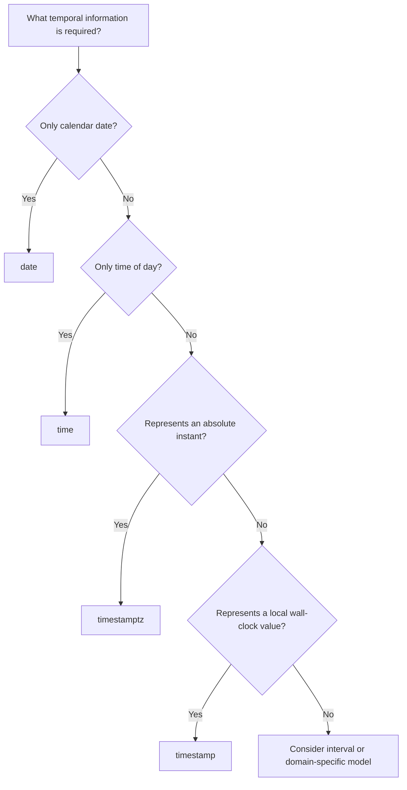

# 07- Date and Time Types

## Overview

Date and time data appears throughout backend systems: timestamps for records, scheduled jobs, payment deadlines, authentication events, subscriptions, audit logs, and distributed-system coordination.

The most important design decision is not simply which SQL type to use. It is determining **what temporal information the application actually needs**:

- A calendar date.
- A time of day.
- A timestamp representing an absolute instant.
- A timestamp representing a local wall-clock value.
- A duration or elapsed interval.

PostgreSQL provides dedicated types for these concepts:

| Type | Represents | Typical use |
|---|---|---|
| `date` | Calendar date | Birth date, business date |
| `time` | Time of day | Store opening time |
| `time with time zone` | Time of day with offset semantics | Rare; usually avoid |
| `timestamp` | Date + time without timezone | Local/wall-clock timestamp |
| `timestamptz` | Absolute point in time | Events, audit timestamps |
| `interval` | Duration | Time windows, elapsed periods |

For most backend systems, `timestamptz` should be the default choice when recording **when something happened**.

## Date vs Time vs Timestamp

The database type should match the semantic meaning of the value.

### `date`

Use `date` when only the calendar date matters.

```sql
CREATE TABLE customers (
    id bigint GENERATED ALWAYS AS IDENTITY PRIMARY KEY,
    birth_date date NOT NULL
);
```

A birth date does not need a timezone or time-of-day.

Other examples:

```text
billing_date
holiday_date
subscription_start_date
business_date
```

### `time`

Use `time` when only the time of day matters.

```sql
CREATE TABLE stores (
    id bigint GENERATED ALWAYS AS IDENTITY PRIMARY KEY,
    opening_time time NOT NULL,
    closing_time time NOT NULL
);
```

This represents values such as:

```text
09:00:00
18:30:00
```

It does not represent a specific moment in global time.

### `timestamp`

PostgreSQL's `timestamp` without time zone stores a calendar date and time without timezone information.

```sql
CREATE TABLE appointments (
    id bigint GENERATED ALWAYS AS IDENTITY PRIMARY KEY,
    scheduled_at timestamp NOT NULL
);
```

A value such as:

```text
2026-08-31 14:30:00
```

does not tell you whether that means:

```text
14:30 UTC
14:30 IST
14:30 America/New_York
```

The timezone must come from external context.

### `timestamptz`

Despite its name, PostgreSQL's `timestamptz` does not store a timezone identifier such as `Asia/Kolkata`.

It represents an **instant in time**. PostgreSQL converts input to an instant and displays it according to the session timezone.

```sql
CREATE TABLE orders (
    id bigint GENERATED ALWAYS AS IDENTITY PRIMARY KEY,
    created_at timestamptz NOT NULL DEFAULT now()
);
```

This is generally the appropriate type for:

```text
created_at
updated_at
processed_at
published_at
deleted_at
verified_at
last_login_at
```

## Choosing the Correct Temporal Type

A useful decision framework is:



The key distinction is:

> **Instant in time** and **local calendar/time representation** are different concepts.

## `timestamp` vs `timestamptz`

This is one of the most important PostgreSQL date/time design decisions.

| Requirement | Recommended type |
|---|---|
| When an HTTP request happened | `timestamptz` |
| When an order was created | `timestamptz` |
| When a payment completed | `timestamptz` |
| When a message was published | `timestamptz` |
| User's birth date | `date` |
| Store opens at 09:00 local time | `time` |
| Recurring local business schedule | `time` + timezone/domain data |
| Absolute appointment instant | `timestamptz` |
| Local wall-clock value intentionally detached from timezone | `timestamp` |

Do not select `timestamp` simply because the application displays local time.

If the value represents an actual event in time, store the instant.

## How `timestamptz` Works

Consider:

```sql
SET TIME ZONE 'UTC';

SELECT TIMESTAMPTZ '2026-08-31 09:00:00+00';
```

The same instant can be displayed in another session timezone:

```sql
SET TIME ZONE 'Asia/Kolkata';

SELECT TIMESTAMPTZ '2026-08-31 09:00:00+00';
```

The displayed wall-clock value changes, but the underlying instant does not.

Conceptually:

```text
Input timestamp + offset
        ↓
Normalize to absolute instant
        ↓
Store instant
        ↓
Render using session/application timezone
```

This is why `timestamptz` is appropriate for distributed systems.

## Timezone Storage

A common misconception is:

> "`timestamptz` stores the user's timezone."

It does not.

PostgreSQL stores the instant, not the original timezone name.

For example:

```text
2026-08-31 09:00:00+05:30
```

and:

```text
2026-08-31 03:30:00+00:00
```

represent the same instant.

If the application must remember the user's timezone, store it separately:

```sql
CREATE TABLE users (
    id bigint GENERATED ALWAYS AS IDENTITY PRIMARY KEY,
    email text NOT NULL UNIQUE,
    timezone text NOT NULL DEFAULT 'UTC'
);
```

A production application may store an IANA timezone identifier such as:

```text
Asia/Kolkata
America/New_York
Europe/London
```

This is different from storing an offset such as:

```text
+05:30
```

An IANA timezone contains historical and daylight-saving rules, while an offset is only a fixed displacement from UTC at a particular moment.

## UTC as the Storage Convention

For backend systems, a strong default is:

```text
Store instants in PostgreSQL as timestamptz.
Use UTC-oriented application logic.
Convert to the user's timezone at presentation boundaries.
```

For example:

```text
Browser
  ↓
API request
  ↓
Application
  ↓
PostgreSQL timestamptz
  ↓
Application
  ↓
User timezone
  ↓
UI
```

The database does not need to store every timestamp in the user's local display timezone.

## Precision

PostgreSQL timestamp types support fractional seconds.

For example:

```sql
SELECT TIMESTAMPTZ '2026-08-31 14:30:15.123456+00';
```

PostgreSQL supports microsecond precision.

You can explicitly define precision:

```sql
created_at timestamptz(3) NOT NULL DEFAULT now()
```

which keeps millisecond precision.

Typical considerations:

| Precision | Example | Use |
|---|---|---|
| Seconds | `14:30:15` | Low-resolution business events |
| Milliseconds | `14:30:15.123` | Common application/event data |
| Microseconds | `14:30:15.123456` | High-resolution database events |

Do not assume that higher precision automatically provides more useful information. Application clocks, network timing, and database execution may not have meaningful microsecond-level accuracy.

## `now()` and Transaction Time

PostgreSQL's:

```sql
now()
```

returns the transaction start timestamp.

Within a transaction:

```sql
SELECT now();
```

returns the same value even if the transaction remains open for some time.

This is useful for consistent transaction timestamps.

PostgreSQL also provides:

```sql
statement_timestamp()
```

for the start time of the current statement, and:

```sql
clock_timestamp()
```

for the actual current wall-clock time, which can change during a statement or transaction.

| Function | Semantics |
|---|---|
| `now()` | Transaction start time |
| `transaction_timestamp()` | Same transaction-start semantics |
| `statement_timestamp()` | Current statement start |
| `clock_timestamp()` | Actual current time |

For normal audit columns:

```sql
created_at timestamptz NOT NULL DEFAULT now()
```

is usually appropriate.

Do not use `clock_timestamp()` merely because it sounds more accurate.

## `CURRENT_TIMESTAMP`

SQL-standard syntax:

```sql
CURRENT_TIMESTAMP
```

is equivalent to PostgreSQL's transaction timestamp semantics.

For example:

```sql
CREATE TABLE events (
    id bigint GENERATED ALWAYS AS IDENTITY PRIMARY KEY,
    created_at timestamptz NOT NULL DEFAULT CURRENT_TIMESTAMP
);
```

Both styles are valid:

```sql
DEFAULT now()
```

and:

```sql
DEFAULT CURRENT_TIMESTAMP
```

Choose a consistent convention within the project.

## `CURRENT_DATE` and `CURRENT_TIME`

PostgreSQL also provides:

```sql
CURRENT_DATE
CURRENT_TIME
CURRENT_TIMESTAMP
```

Example:

```sql
SELECT CURRENT_DATE;
SELECT CURRENT_TIME;
SELECT CURRENT_TIMESTAMP;
```

These are useful when the database itself should supply the current temporal value.

## Application-Generated vs Database-Generated Timestamps

There are two common strategies.

### Database-Generated

```sql
created_at timestamptz NOT NULL DEFAULT now()
```

Advantages:

- Centralized source of truth.
- Not dependent on application host clocks.
- Works consistently across application instances.
- Good for audit metadata.

### Application-Generated

Python:

```python
from datetime import datetime, timezone

created_at = datetime.now(timezone.utc)
```

Advantages:

- Timestamp available before persistence.
- Useful when the value participates in application logic.
- Can simplify certain event-generation workflows.

However, distributed application hosts can have clock differences.

For database audit columns, database-generated timestamps are often preferable unless the architecture has a specific reason to generate them in the application.

## Python Date and Time Handling

Python distinguishes timezone-aware and naive `datetime` values.

Prefer timezone-aware UTC values:

```python
from datetime import datetime, timezone

timestamp = datetime.now(timezone.utc)
```

Avoid:

```python
from datetime import datetime

timestamp = datetime.now()
```

The latter produces a naive datetime with no timezone information.

A useful application invariant is:

```text
datetime values representing instants → timezone-aware
```

This prevents ambiguity when communicating with PostgreSQL.

## Django Date and Time Fields

Django provides:

```python
from django.db import models


class Order(models.Model):
    created_at = models.DateTimeField(auto_now_add=True)
    updated_at = models.DateTimeField(auto_now=True)
```

For PostgreSQL-backed applications, Django's timezone-aware configuration should be enabled:

```python
USE_TZ = True
```

With timezone support enabled, Django works with aware datetimes and PostgreSQL's timezone-aware timestamp representation.

For a date-only value:

```python
birth_date = models.DateField()
```

For a time-only value:

```python
opening_time = models.TimeField()
```

Do not use `DateTimeField` when the business concept is only a calendar date.

## FastAPI and Pydantic

Pydantic can parse ISO 8601 timestamps into Python `datetime` values.

```python
from datetime import datetime

from pydantic import BaseModel


class Event(BaseModel):
    occurred_at: datetime
```

Prefer API timestamps that include timezone information:

```json
{
  "occurred_at": "2026-08-31T09:00:00Z"
}
```

rather than ambiguous values:

```json
{
  "occurred_at": "2026-08-31 09:00:00"
}
```

The `Z` indicates UTC.

For APIs that accept timestamps from multiple clients, define the expected timezone semantics explicitly.

## REST API Date/Time Representation

ISO 8601 is the common representation for API timestamps:

```text
2026-08-31T09:00:00Z
```

An offset can also be represented:

```text
2026-08-31T14:30:00+05:30
```

These can identify the same instant.

For APIs, a consistent representation is more important than forcing every client to use a particular display timezone.

A common convention is:

```text
Database: timestamptz
Application: timezone-aware datetime
API: ISO 8601 timestamp
UI: user-localized representation
```

## Date Range Queries

Temporal filtering is a frequent source of subtle bugs.

Prefer half-open intervals:

```text
[start, end)
```

For example:

```sql
SELECT *
FROM orders
WHERE created_at >= TIMESTAMPTZ '2026-08-01 00:00:00+00'
  AND created_at <  TIMESTAMPTZ '2026-09-01 00:00:00+00';
```

This is generally safer than:

```sql
WHERE created_at BETWEEN
    '2026-08-01 00:00:00'
    AND '2026-08-31 23:59:59';
```

The second approach introduces precision and boundary problems.

Half-open ranges naturally compose:

```text
[Aug 1, Aug 2)
[Aug 2, Aug 3)
[Aug 3, Aug 4)
```

There is no overlap and no missing instant at the boundary.

## Sargability and Date Queries

Avoid wrapping an indexed timestamp column in a function when possible.

Less index-friendly:

```sql
WHERE DATE(created_at) = DATE '2026-08-31'
```

Prefer:

```sql
WHERE created_at >= TIMESTAMPTZ '2026-08-31 00:00:00+00'
  AND created_at <  TIMESTAMPTZ '2026-09-01 00:00:00+00';
```

The second form allows PostgreSQL to use an index on `created_at` more effectively because the indexed column remains directly comparable.

For high-volume tables:

```sql
CREATE INDEX idx_orders_created_at
ON orders (created_at);
```

can then support range queries.

## Timezones in Date Queries

A business date depends on a timezone.

Suppose an Indian business wants:

```text
Orders created on August 31 in India.
```

That is not necessarily:

```text
2026-08-31 00:00 UTC → 2026-09-01 00:00 UTC
```

The correct UTC boundaries depend on the relevant timezone rules.

PostgreSQL can perform timezone-aware conversions, but application code should make the business timezone explicit.

For example:

```sql
SELECT *
FROM orders
WHERE created_at >= TIMESTAMPTZ '2026-08-30 18:30:00+00'
  AND created_at <  TIMESTAMPTZ '2026-08-31 18:30:00+00';
```

for a UTC+05:30 business day.

The important principle is:

> Define the business timezone first, then derive the UTC instant range.

## Daylight Saving Time

DST creates problems when applications assume every local day has exactly 24 hours.

A local day can be:

```text
23 hours
24 hours
25 hours
```

depending on timezone rules.

Therefore, avoid logic such as:

```text
next_day = current_timestamp + 24 hours
```

when the requirement is actually:

```text
same local time tomorrow
```

These are different operations.

For recurring local schedules, store:

- The local time.
- The IANA timezone.
- The recurrence rule where necessary.

For example:

```text
09:00
America/New_York
Every weekday
```

Then calculate the actual instant for each occurrence.

## `interval`

PostgreSQL's `interval` represents a duration or amount of calendar time.

Examples:

```sql
SELECT INTERVAL '15 minutes';
SELECT INTERVAL '2 hours';
SELECT INTERVAL '7 days';
```

It can be used in temporal calculations:

```sql
SELECT now() + INTERVAL '30 days';
```

However, `interval '1 day'` and `interval '24 hours'` are not always equivalent around daylight-saving transitions when timezone-aware timestamps are involved.

That distinction matters in scheduling systems.

Use `interval` when the business concept is genuinely a duration or calendar offset.

## Date/Time Arithmetic

PostgreSQL supports temporal arithmetic:

```sql
SELECT TIMESTAMPTZ '2026-08-31 09:00:00+00'
       + INTERVAL '2 hours';
```

Subtracting timestamps produces an interval:

```sql
SELECT
    TIMESTAMPTZ '2026-08-31 12:00:00+00'
    - TIMESTAMPTZ '2026-08-31 09:30:00+00';
```

Result:

```text
02:30:00
```

Date arithmetic is also supported:

```sql
SELECT DATE '2026-08-31' + 7;
```

which produces a date seven days later.

## Scheduling and Job Systems

Temporal modeling becomes more important in background processing systems such as Celery or Kubernetes jobs.

A queue might contain:

```sql
CREATE TABLE jobs (
    id bigint GENERATED ALWAYS AS IDENTITY PRIMARY KEY,
    status text NOT NULL,
    available_at timestamptz NOT NULL,
    created_at timestamptz NOT NULL DEFAULT now(),
    processed_at timestamptz
);
```

A worker can find available jobs:

```sql
SELECT id
FROM jobs
WHERE status = 'pending'
  AND available_at <= now()
ORDER BY available_at, id
LIMIT 100;
```

An index can support this workload:

```sql
CREATE INDEX idx_jobs_available
ON jobs (available_at, id)
WHERE status = 'pending';
```

For high-throughput queues, temporal columns often become part of concurrency, indexing, and retention strategies.

## Temporal Columns and Indexes

Timestamp columns are commonly indexed:

```sql
CREATE INDEX idx_events_created_at
ON events (created_at);
```

This supports queries such as:

```sql
SELECT *
FROM events
WHERE created_at >= $1
  AND created_at < $2;
```

For large append-heavy event tables, consider:

- B-tree indexes for common range queries.
- BRIN indexes when data is naturally correlated with physical insertion order and the table is very large.
- Partitioning when retention or workload isolation justifies it.
- Appropriate retention policies.

For example:

```sql
CREATE INDEX idx_events_created_at_brin
ON events USING BRIN (created_at);
```

A BRIN index is compact and can be highly effective for large tables where `created_at` roughly follows physical row order.

Do not select BRIN merely because a table is large; validate workload and data correlation.

## Partitioning by Time

Large event or audit tables are often candidates for time-based partitioning.

Conceptually:

```text
events
├── events_2026_07
├── events_2026_08
└── events_2026_09
```

Example:

```sql
CREATE TABLE events (
    id bigint NOT NULL,
    created_at timestamptz NOT NULL,
    payload jsonb NOT NULL
) PARTITION BY RANGE (created_at);
```

A monthly partition might be:

```sql
CREATE TABLE events_2026_08
PARTITION OF events
FOR VALUES FROM ('2026-08-01 00:00:00+00')
             TO   ('2026-09-01 00:00:00+00');
```

Benefits can include:

- Efficient retention operations.
- Partition pruning.
- Smaller indexes per partition.
- Easier archival.

Partitioning introduces operational complexity and should be justified by scale and workload.

## Temporal Columns and Auditing

A common production schema includes:

```sql
created_at timestamptz NOT NULL DEFAULT now(),
updated_at timestamptz NOT NULL DEFAULT now()
```

`created_at` is straightforward.

`updated_at` requires an update mechanism. PostgreSQL does not automatically update it simply because a `DEFAULT` exists.

Application code can update it:

```sql
UPDATE orders
SET
    status = 'completed',
    updated_at = now()
WHERE id = $1;
```

Alternatively, a database trigger can maintain it centrally.

Do not assume:

```sql
updated_at timestamptz DEFAULT now()
```

automatically changes on every update.

## Temporal Data and Transactions

Date/time values interact with transaction semantics.

For example:

```sql
BEGIN;

UPDATE orders
SET status = 'processing'
WHERE id = 100;

SELECT now();

COMMIT;
```

The `now()` value represents the transaction start time.

This can be useful for consistent audit timestamps across multiple writes in one transaction.

For independent event timestamps, statement or wall-clock semantics may be more appropriate depending on the requirement.

The key is to choose the timestamp semantics deliberately rather than treating all "current time" functions as interchangeable.

## Clock Synchronization in Distributed Systems

Application servers, containers, Kubernetes nodes, and database hosts can have slightly different system clocks.

This matters when timestamps are generated outside the database.

For example:

```text
API server A: 10:00:00.100
API server B: 09:59:59.950
```

Even though B processes an event later, its local timestamp could appear earlier.

For ordering distributed events, timestamps should not automatically be treated as a perfect global ordering mechanism.

Depending on the architecture, consider:

- Database-generated timestamps.
- Kafka offsets.
- Monotonic sequence numbers.
- Database transaction ordering.
- Event IDs.
- Logical clocks where required.

A timestamp answers "approximately when did this happen?" but does not necessarily answer "which event happened first globally?"

## Temporal Data and Event Ordering

In event-driven systems:

```text
event_time
ingestion_time
processing_time
```

may all be different.

For example:

```sql
CREATE TABLE events (
    id bigint GENERATED ALWAYS AS IDENTITY PRIMARY KEY,
    event_time timestamptz NOT NULL,
    ingested_at timestamptz NOT NULL DEFAULT now(),
    processed_at timestamptz
);
```

This distinction is important for:

- Kafka consumers.
- Analytics pipelines.
- Delayed messages.
- Retries.
- Out-of-order events.
- Monitoring systems.

Do not overwrite the original event timestamp with processing time.

## Common Mistakes and Pitfalls

| Mistake | Problem | Better approach |
|---|---|---|
| Using `timestamp` for every timestamp | Loses timezone/instant semantics | Use `timestamptz` for instants |
| Assuming `timestamptz` stores a timezone name | It stores an instant, not the original IANA zone | Store timezone separately when required |
| Storing local time for distributed events | Makes cross-region interpretation ambiguous | Store absolute instants |
| Using naive Python `datetime` | Creates timezone ambiguity | Use timezone-aware datetimes |
| Using `BETWEEN` for day ranges | Can create precision and boundary bugs | Prefer `[start, end)` |
| Applying `DATE()` to indexed timestamps | Can reduce index usability | Use timestamp range predicates |
| Assuming every day is 24 hours | Fails around DST transitions | Use timezone-aware calendar calculations |
| Assuming `DEFAULT now()` updates automatically | Defaults only apply when inserting omitted values | Explicitly update or use a trigger |
| Using fixed UTC offsets for recurring local schedules | Breaks when timezone rules change | Store IANA timezone identifiers |
| Treating timestamps as a global event order | Distributed clocks are not perfectly synchronized | Use explicit ordering mechanisms when required |
| Storing timezone in every timestamp | Duplicates information and complicates queries | Store instant + user/business timezone separately |
| Using strings for dates/timestamps | Loses database type validation and efficient operators | Use native temporal types |
| Overusing microsecond precision | Adds complexity without meaningful accuracy | Choose precision based on business requirements |

## Production Best Practices

### Prefer `timestamptz` for Event Timestamps

Use:

```sql
created_at timestamptz NOT NULL DEFAULT now()
```

for most event/audit timestamps.

### Keep Business Dates Separate from Instants

If a billing record belongs to:

```text
2026-08-31
```

as a business date, use:

```sql
billing_date date NOT NULL
```

Do not invent a midnight timestamp merely to represent a date.

### Store User Timezones Separately

If the system needs to display or calculate local schedules:

```text
instant → timestamptz
timezone → IANA timezone identifier
```

This preserves both pieces of information.

### Use Half-Open Ranges

Prefer:

```sql
created_at >= :start
AND created_at < :end
```

over manually constructed end-of-day timestamps.

### Keep Temporal Predicates Sargable

Prefer:

```sql
WHERE created_at >= :start
  AND created_at < :end
```

over:

```sql
WHERE DATE(created_at) = :date
```

when an index on `created_at` is expected to support the query.

### Make Timezone Semantics Explicit

For every temporal field, be able to answer:

```text
Is this a date?
Is this a local time?
Is this an absolute instant?
Is this a duration?
Whose timezone applies?
```

If these questions cannot be answered clearly, the schema is probably underspecified.

## Security and Reliability Considerations

Temporal data can influence security-sensitive behavior:

```text
session expiration
password reset expiration
API token expiry
account lockout
payment deadlines
authorization windows
```

Use database-supported comparisons rather than trusting client-provided current time.

For example:

```sql
SELECT id
FROM password_reset_tokens
WHERE token_hash = $1
  AND expires_at > now();
```

Do not allow a client to determine whether an expiration has passed.

For distributed authentication systems, also account for small clock differences between systems. Avoid extremely tight expiration windows unless clock synchronization and operational behavior are well understood.

## Monitoring and Operations

Temporal columns are frequently used in operational monitoring.

Examples:

```sql
SELECT
    count(*)
FROM jobs
WHERE status = 'pending'
  AND available_at < now() - INTERVAL '5 minutes';
```

This can detect jobs that have exceeded an expected processing delay.

Useful metrics include:

- Event ingestion latency.
- Queue age.
- Processing duration.
- Database write latency.
- Replication lag.
- Age of oldest pending job.
- Data retention age.
- Clock synchronization health.

For observability, distinguish between:

```text
event timestamp
log timestamp
ingestion timestamp
processing timestamp
```

when latency and ordering analysis matters.

## Interview Traps

### What is the difference between `timestamp` and `timestamptz` in PostgreSQL?

`timestamp` stores a date and time without timezone semantics.

`timestamptz` represents an absolute instant and renders it according to the session timezone.

The name `timestamptz` does not mean that PostgreSQL stores a timezone identifier alongside the value.

### Should timestamps always be stored in UTC?

For absolute events, store them as an absolute instant, typically using `timestamptz`. UTC is the common operational representation, but the key property is unambiguous instant semantics.

User or business timezone information may still need to be stored separately.

### Why is `BETWEEN` problematic for date ranges?

Because timestamps have precision and the desired range is usually naturally expressed as:

```text
[start, end)
```

For example:

```sql
WHERE created_at >= '2026-08-01'
  AND created_at < '2026-09-01'
```

This avoids constructing an artificial final instant such as:

```text
23:59:59.999999
```

### Does PostgreSQL store `timestamptz` in the timezone supplied by the client?

No. PostgreSQL normalizes the value to an absolute instant. The session timezone controls how the value is displayed.

### Is `now()` the actual wall-clock time at every point in a transaction?

No. PostgreSQL's `now()` uses transaction-start semantics.

Use `statement_timestamp()` or `clock_timestamp()` when those semantics are specifically required.

### Should a recurring "9 AM every day" job be stored as a UTC timestamp?

Not necessarily.

If the requirement is "9 AM in the user's local timezone," the system needs the local schedule and timezone rules. A single UTC timestamp does not adequately represent a recurring local-time schedule across daylight-saving transitions.

### Why should date filters use timestamp ranges instead of `DATE(created_at)`?

A range predicate can allow PostgreSQL to use an index directly on `created_at`, while applying a function to the indexed column can make the query less index-friendly.

## Key Takeaways

- **Use `timestamptz` for absolute points in time, `date` for calendar dates, `time` for time-of-day values, and `interval` for durations.**
- **Do not confuse an instant with a local wall-clock value; store user or business timezone information separately when local-time semantics matter.**
- **Prefer timezone-aware application datetimes and ISO 8601 API timestamps, with clear UTC/offset semantics across service boundaries.**
- **Use half-open temporal ranges such as `[start, end)` and keep timestamp predicates sargable to preserve correctness and index performance.**
- **Treat time as distributed-system data: clock skew, DST, transaction timestamp semantics, event ordering, scheduling, and retention all affect production correctness.**