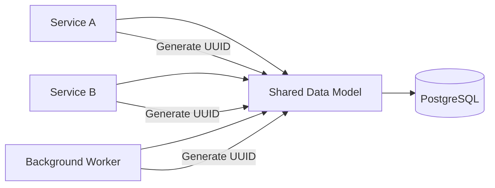

# 08- UUID Types

## Overview

A UUID (Universally Unique Identifier) is a 128-bit identifier designed to provide a practically unique value without requiring a central sequence generator.

UUIDs are widely used as primary keys and public resource identifiers in distributed backend systems because independent application instances can generate identifiers without coordinating with a database sequence.

PostgreSQL has a native `uuid` data type:

```sql
CREATE TABLE users (
    id uuid PRIMARY KEY,
    email text NOT NULL UNIQUE
);
```

UUIDs are particularly useful when identifiers must be generated across multiple services, regions, queues, or databases. They also avoid exposing simple row counts or insertion order through sequential public IDs.

However, UUIDs are not automatically the best primary key for every table. Their size, generation strategy, index behavior, locality, and operational requirements should be considered at schema-design time.

## UUID Structure

A UUID contains 128 bits, normally represented as 32 hexadecimal characters separated by hyphens:

```text
550e8400-e29b-41d4-a716-446655440000
```

The canonical textual representation is:

```text
8-4-4-4-12
```

which represents:

```text
32 hexadecimal characters
128 bits
16 bytes
```

The database representation is binary rather than a 36-character string.

This distinction matters because:

```text
uuid    → 16 bytes
text    → potentially 36+ bytes plus string/index overhead
```

Using PostgreSQL's native `uuid` type is therefore preferable to storing UUIDs as `text` or `varchar`.

## Why UUIDs Exist

Traditional relational databases commonly generate identifiers using sequences:

```sql
id bigint GENERATED ALWAYS AS IDENTITY
```

This works extremely well for many applications, but identifiers must generally be allocated through a database-local mechanism.

UUIDs allow different producers to generate IDs independently:

```text
API instance A ─┐
API instance B ─┼──→ UUID generation
Worker instance ─┤
Service C ──────┘
```

No central sequence is required to generate a unique identifier.

This is particularly useful in:

- Microservices.
- Multi-region systems.
- Offline-capable applications.
- Event-driven architectures.
- Data ingestion pipelines.
- Database migrations and merges.
- Systems where IDs are generated before persistence.

## UUID Versions

UUID is a family of identifier-generation schemes rather than one single algorithm.

Common versions include:

| Version | Main characteristic | Typical consideration |
|---|---|---|
| UUID v1 | Time + node information | Historically useful but exposes structural information |
| UUID v3 | Name-based, MD5 | Deterministic but based on MD5 |
| UUID v4 | Random | Simple and widely supported |
| UUID v5 | Name-based, SHA-1 | Deterministic |
| UUID v6 | Reordered time-based UUID | Better database locality than v1 |
| UUID v7 | Unix timestamp + randomness | Strong fit for modern distributed systems |
| UUID v8 | Application-defined | For specialized/custom formats |

For new systems, UUID v4 and UUID v7 are the most important choices to understand.

## UUID v4

UUID v4 is primarily random.

Example:

```text
9f4c8d1e-7b2a-4f36-a8d2-1c5e9b7f4032
```

Advantages:

- Simple.
- Widely supported.
- Does not encode creation time.
- Extremely low collision probability when generated correctly.
- Works well across independent services.

Limitations:

- Random values have poor insertion locality for B-tree indexes.
- UUIDs are larger than 64-bit integer identifiers.
- The ID itself does not provide meaningful ordering.

For moderate workloads, UUID v4 is often perfectly acceptable.

## UUID v7

UUID v7 combines a Unix timestamp component with randomness.

Conceptually:

```text
┌──────────────────────┬────────────────────────────┐
│ Timestamp component  │ Random / uniqueness bits   │
└──────────────────────┴────────────────────────────┘
```

This provides identifiers that are approximately sortable by creation time while retaining distributed-generation properties.

That makes UUID v7 particularly attractive for high-write systems where UUIDs are used as clustered or primary indexes.

Benefits include:

- Distributed generation.
- Approximate chronological ordering.
- Better index locality than purely random UUIDs.
- No centralized ID allocation.
- Useful identifiers for event-heavy systems.

UUID v7 does not replace an explicit `created_at` column. Its timestamp component should not be treated as the authoritative business timestamp.

## UUID v4 vs UUID v7

| Characteristic | UUID v4 | UUID v7 |
|---|---|---|
| Generation | Random | Time-ordered + random |
| Globally unique | Practically | Practically |
| Sortable by creation time | No | Approximately |
| Index locality | Poorer | Better |
| Reveals approximate creation time | No | Yes |
| Distributed generation | Yes | Yes |
| Good default for new systems | Yes | Often preferred for write-heavy systems |

The choice should depend on workload and information exposure requirements.

## PostgreSQL `uuid` Type

PostgreSQL provides native UUID support:

```sql
CREATE TABLE orders (
    id uuid PRIMARY KEY,
    customer_id uuid NOT NULL,
    created_at timestamptz NOT NULL DEFAULT now()
);
```

The database validates UUID syntax and stores the value efficiently.

Prefer:

```sql
id uuid
```

over:

```sql
id varchar(36)
```

or:

```sql
id text
```

when the domain value is actually a UUID.

Native types provide better type safety and make the schema's intent explicit.

## UUID Generation

There are several places where UUIDs can be generated:

- Application.
- Database.
- Client.
- Dedicated ID service.

The right choice depends on ownership and architecture.

### Application-Generated UUID

Python:

```python
from uuid import uuid4

user_id = uuid4()
```

This allows the application to know the identifier before sending the insert.

For example:

```python
from uuid import UUID, uuid4


def create_order() -> UUID:
    return uuid4()
```

Application-generated IDs are useful when multiple records or events need to reference the same identifier before persistence.

### Database-Generated UUID

PostgreSQL can generate UUIDs using supported extensions/functions.

For example, with `pgcrypto`:

```sql
CREATE EXTENSION IF NOT EXISTS pgcrypto;

CREATE TABLE users (
    id uuid PRIMARY KEY DEFAULT gen_random_uuid(),
    email text NOT NULL UNIQUE
);
```

Then:

```sql
INSERT INTO users (email)
VALUES ('user@example.com')
RETURNING id;
```

The database generates the identifier.

Advantages:

- Centralized database generation.
- Application does not need to generate IDs.
- Strong consistency with database writes.

Application generation may still be preferable when IDs need to exist before the insert.

## UUIDs as Primary Keys

A UUID can be used directly as a primary key:

```sql
CREATE TABLE products (
    id uuid PRIMARY KEY DEFAULT gen_random_uuid(),
    name text NOT NULL
);
```

The primary key creates a unique B-tree index.

For a typical backend API:

```text
POST /orders
       │
       ▼
Application
       │
       ├── generate UUID
       │
       ▼
PostgreSQL
       │
       └── INSERT
```

The client can then receive:

```json
{
  "id": "550e8400-e29b-41d4-a716-446655440000"
}
```

## UUID vs Integer Primary Keys

UUIDs should be compared against integer identifiers based on actual requirements.

| Property | `bigint` | `uuid` |
|---|---|---|
| Storage | 8 bytes | 16 bytes |
| Human readability | Better | Worse |
| Sequential | Naturally | Depends on version |
| Distributed generation | Requires coordination for sequence | Yes |
| Index size | Smaller | Larger |
| Random v4 locality | N/A | Poor |
| Enumeration resistance | Poor with public sequential IDs | Better |
| Cross-database merge | More coordination | Easier |
| API exposure | Can reveal ordering/counts | Less revealing |
| Generation overhead | Very low | Very low |

Neither type is universally superior.

For a single PostgreSQL application with high write throughput and no distributed-ID requirement, `bigint` can be an excellent choice.

For distributed systems or public identifiers, UUIDs often provide stronger architectural properties.

## UUID Storage and Index Cost

UUIDs are twice the size of `bigint`:

```text
bigint → 8 bytes
uuid   → 16 bytes
```

The impact extends beyond the table column itself.

UUID primary keys can increase:

- Primary-key index size.
- Foreign-key index size.
- Cache pressure.
- Memory requirements.
- I/O during index traversal.
- Storage requirements for large relational datasets.

For example:

```sql
CREATE TABLE order_items (
    id uuid PRIMARY KEY,
    order_id uuid NOT NULL REFERENCES orders(id)
);

CREATE INDEX idx_order_items_order_id
ON order_items (order_id);
```

The UUID appears in both the table and related indexes.

At millions or billions of rows, this additional storage can become operationally significant.

## Index Locality

B-tree indexes perform best when inserted keys have useful locality.

Random UUID v4 values can cause inserts to occur across many parts of the B-tree:

```text
UUID v4

A → random page
B → another page
C → another page
D → another page
```

This can increase:

- Page splits.
- Random I/O.
- Cache churn.
- Index fragmentation.

Time-ordered UUIDs such as UUID v7 improve locality because newly generated values tend to cluster near recent values:

```text
UUID v7

T1 → T1
T2 → T2
T3 → T3
T4 → T4
       ↑
    recent index area
```

The improvement is workload-dependent, but the principle is important for senior-level database design.

## UUIDs and Foreign Keys

UUID primary keys propagate into related tables.

```sql
CREATE TABLE customers (
    id uuid PRIMARY KEY DEFAULT gen_random_uuid()
);

CREATE TABLE orders (
    id uuid PRIMARY KEY DEFAULT gen_random_uuid(),
    customer_id uuid NOT NULL REFERENCES customers(id)
);
```

Both columns use 16-byte UUID values.

This makes schema consistency important.

Avoid mixing semantically identical identifiers as different SQL types:

```text
customers.id        uuid
orders.customer_id  varchar
```

Prefer:

```text
customers.id        uuid
orders.customer_id  uuid
```

Matching types reduce conversion problems and make relationships explicit.

## UUIDs and API Design

UUIDs are often useful as public resource identifiers:

```http
GET /api/orders/550e8400-e29b-41d4-a716-446655440000
```

Compared with:

```http
GET /api/orders/12345
```

a UUID makes simple sequential enumeration more difficult.

However:

> UUIDs are not an authorization mechanism.

An attacker who obtains a valid UUID can still access the resource if authorization is incorrectly implemented.

Always enforce authorization independently:

```text
authenticate
    ↓
authorize resource
    ↓
query resource
```

Do not rely on the unpredictability of UUIDs as a security boundary.

## UUIDs and Enumeration

Sequential IDs make naive enumeration easy:

```text
/orders/100
/orders/101
/orders/102
```

UUIDs make blind enumeration much harder because the search space is enormous.

This is a useful security property, but it should be considered **defense in depth**, not access control.

A secure API still needs:

- Authentication.
- Authorization.
- Object-level permission checks.
- Rate limiting where appropriate.
- Audit logging.
- Input validation.

## UUID Validation at API Boundaries

FastAPI can validate UUID values using Python's `UUID` type.

```python
from uuid import UUID

from fastapi import FastAPI


app = FastAPI()


@app.get("/orders/{order_id}")
def get_order(order_id: UUID):
    return {"order_id": str(order_id)}
```

Invalid UUID input is rejected by the API validation layer rather than reaching the database as arbitrary text.

This creates a useful boundary:

```text
HTTP request
    ↓
UUID validation
    ↓
Authorization
    ↓
Parameterized SQL
    ↓
PostgreSQL uuid column
```

## Django UUID Models

Django provides `UUIDField`:

```python
import uuid

from django.db import models


class Order(models.Model):
    id = models.UUIDField(
        primary_key=True,
        default=uuid.uuid4,
        editable=False,
    )
    created_at = models.DateTimeField(auto_now_add=True)
```

For UUID v4, `uuid.uuid4` is a common choice.

For systems requiring UUID v7, use a UUID v7 implementation supported by the application's Python/runtime dependencies and verify that the database and deployment environment handle the chosen representation correctly.

## UUIDs in Event-Driven Systems

UUIDs are particularly useful for event identifiers.

```sql
CREATE TABLE events (
    event_id uuid PRIMARY KEY DEFAULT gen_random_uuid(),
    aggregate_id uuid NOT NULL,
    event_type text NOT NULL,
    created_at timestamptz NOT NULL DEFAULT now(),
    payload jsonb NOT NULL
);
```

A message can contain:

```json
{
  "event_id": "550e8400-e29b-41d4-a716-446655440000",
  "aggregate_id": "7c3f0c21-4d9a-4d8b-9d90-9f0c5f6d2e31",
  "event_type": "order.created"
}
```

The `event_id` can be used for:

- Idempotency.
- Deduplication.
- Audit correlation.
- Trace correlation.
- Consumer-side processing records.

UUID uniqueness alone does not make a consumer idempotent, but it provides a useful stable event identity.

## UUIDs and Idempotency

Consider a payment API:

```http
POST /payments
Idempotency-Key: 550e8400-e29b-41d4-a716-446655440000
```

An idempotency key can be stored with a uniqueness constraint:

```sql
CREATE TABLE payments (
    id uuid PRIMARY KEY DEFAULT gen_random_uuid(),
    idempotency_key uuid NOT NULL UNIQUE,
    amount numeric(12,2) NOT NULL,
    created_at timestamptz NOT NULL DEFAULT now()
);
```

The uniqueness constraint provides the database-level guarantee.

Do not implement idempotency as:

```text
SELECT whether key exists
INSERT if not exists
```

without concurrency protection.

Two concurrent requests can both observe that the key does not exist.

Prefer a unique constraint and handle the conflict atomically.

## UUID Generation and Collisions

For correctly implemented UUID generation, collisions are practically negligible.

For random UUIDs, the probability follows the birthday paradox rather than being literally zero.

With approximately 122 random bits in UUID v4, the collision probability remains extremely small at realistic application scales.

The correct engineering statement is:

> UUIDs provide practical uniqueness, not mathematical impossibility of collision.

Database constraints should still enforce uniqueness:

```sql
id uuid PRIMARY KEY
```

Do not remove the primary key or unique constraint simply because UUID collisions are unlikely.

## UUIDs and Ordering

UUIDs should not generally be used as a replacement for an explicit ordering column.

UUID v4:

```text
UUID A
UUID B
UUID C
```

has no meaningful chronological relationship.

UUID v7 provides approximate chronological ordering, but it should still not replace:

```sql
created_at timestamptz NOT NULL
```

when business logic depends on event time.

For deterministic ordering, use:

```sql
ORDER BY created_at, id
```

rather than assuming UUID ordering alone is sufficient.

The UUID can act as a tie-breaker:

```sql
SELECT *
FROM events
ORDER BY created_at, event_id;
```

## UUIDs and Distributed Systems

UUIDs are useful when multiple services create records independently.



Each producer can generate identifiers without waiting for a central sequence.

This can simplify:

- Multi-region writes.
- Service-to-service communication.
- Offline creation.
- Database migration.
- Data synchronization.
- Event creation.

However, UUIDs do not eliminate all distributed-system coordination. Uniqueness is only one part of consistency.

## Migration from Integer IDs to UUIDs

Changing a large production table from `bigint` to `uuid` can be expensive and operationally risky.

Avoid a simplistic:

```sql
ALTER TABLE orders
ALTER COLUMN id TYPE uuid;
```

when the table has extensive foreign-key relationships and production traffic.

A safer migration commonly involves:

1. Add a nullable UUID column.
2. Backfill UUIDs in controlled batches.
3. Add unique constraints/indexes.
4. Add UUID foreign-key columns to dependent tables.
5. Dual-write during migration.
6. Backfill dependent rows.
7. Validate consistency.
8. Gradually migrate application reads.
9. Switch primary/public identifier usage.
10. Remove legacy columns only after verification.

For large systems, the migration should be treated as a deployment project rather than a simple schema change.

## UUIDs and Data Migration

UUIDs simplify merging independently generated datasets.

For example:

```text
Database A
  user UUIDs

Database B
  user UUIDs

        ↓ merge

Central database
```

With globally generated UUIDs, identifiers are much less likely to collide than independently generated sequential integer IDs.

This does not eliminate the need to resolve business-level conflicts such as:

```text
same email
same external account
same business identifier
```

UUID uniqueness solves identifier collision, not domain duplication.

## Production Considerations

### Prefer Native UUID Types

Use:

```sql
uuid
```

rather than:

```sql
varchar(36)
```

when the value is a UUID.

### Choose the UUID Version Deliberately

For new systems:

- UUID v4 is simple and broadly supported.
- UUID v7 is attractive when index locality and approximate chronological ordering matter.
- Deterministic UUID versions may be appropriate for namespace-based identifiers.

Do not choose a version merely because it is newer.

### Keep Explicit Timestamps

Even with UUID v7:

```sql
id uuid PRIMARY KEY,
created_at timestamptz NOT NULL DEFAULT now()
```

is usually preferable.

The UUID identifies the entity; the timestamp represents the event time.

### Index Only What the Workload Requires

UUID indexes consume more storage than `bigint` indexes.

Avoid unnecessary secondary indexes on UUID columns.

### Consider Table Size

At small to moderate scale, the additional UUID storage may be insignificant.

At very large scale, calculate:

```text
table storage
+ primary-key index
+ foreign-key indexes
+ secondary indexes
+ cache impact
+ replication traffic
+ backup storage
```

before standardizing UUIDs everywhere.

## Security Considerations

UUIDs can reduce accidental information disclosure compared with sequential identifiers, but they should not be treated as secrets.

Do not:

- Put sensitive information inside UUIDs.
- Assume UUID unpredictability replaces authorization.
- Accept arbitrary UUID strings and interpolate them into SQL.
- Use client-generated UUIDs as proof of identity.
- Expose internal identifiers without considering the API contract.

Always use parameterized queries:

```python
cursor.execute(
    """
    SELECT id, status
    FROM orders
    WHERE id = %s
    """,
    (order_id,),
)
```

Do not construct SQL using string interpolation.

## Performance Considerations

UUID performance depends heavily on:

- UUID version.
- Insert rate.
- Index size.
- Working-set size.
- Hardware.
- PostgreSQL version.
- Table size.
- Query patterns.

For a write-heavy table, compare:

```text
bigint + sequential IDs
```

against:

```text
uuid v4
```

and:

```text
uuid v7
```

using realistic workload tests.

Measure:

- Insert throughput.
- Index growth.
- Buffer-cache hit ratio.
- WAL volume.
- Query latency.
- Page splits.
- Storage consumption.
- Replication impact.

Do not assume benchmark results from a different workload apply directly to your system.

## Common Mistakes and Pitfalls

| Mistake | Problem | Better approach |
|---|---|---|
| Storing UUIDs as `varchar` | Loses native type semantics and wastes space | Use PostgreSQL `uuid` |
| Assuming UUIDs are secrets | UUIDs can be exposed and copied | Enforce authorization |
| Using random UUID v4 blindly for huge write-heavy indexes | Poorer index locality | Evaluate UUID v7 or another key strategy |
| Removing uniqueness constraints | Collision is unlikely but not impossible | Keep PK/UNIQUE constraints |
| Using UUID as an ordering mechanism | v4 has no ordering; v7 is only approximately time ordered | Use explicit timestamps/order columns |
| Mixing UUID and text foreign keys | Causes conversions and inconsistent schema design | Use matching UUID types |
| Generating IDs through a centralized service unnecessarily | Adds a dependency and bottleneck | Generate UUIDs locally when appropriate |
| Treating UUID v7 timestamp as authoritative event time | Identifier timestamp has different semantics | Store `created_at` explicitly |
| Migrating a large PK in one operation | Can cause locks, downtime, and excessive I/O | Use staged migration |
| Assuming UUID solves idempotency | Uniqueness alone does not implement request semantics | Use unique constraints and atomic conflict handling |
| Using UUIDs everywhere without measuring | Larger indexes and storage may matter | Choose identifier type per workload |

## Interview Traps

### Is UUID always better than `bigint`?

No.

UUIDs provide distributed-generation and public-identifier advantages, while `bigint` provides smaller, sequential keys with excellent index locality.

The correct choice depends on architecture and workload.

### How large is a UUID?

A UUID contains:

```text
128 bits = 16 bytes
```

Its common textual representation is 36 characters including hyphens, but PostgreSQL's native `uuid` type stores it efficiently rather than as a 36-character string.

### Does UUID guarantee uniqueness?

No absolute mathematical guarantee exists.

UUID generation makes collisions practically negligible under correct generation, while database constraints provide the actual integrity guarantee.

### Why can UUID v4 perform worse as a primary key?

UUID v4 values are random, so inserts are distributed throughout the B-tree rather than naturally progressing toward recent index pages.

This can increase index maintenance and reduce locality.

### Why is UUID v7 attractive for databases?

UUID v7 combines time ordering with randomness, giving distributed generation while generally providing better insertion locality than random UUID v4 values.

### Does UUID v7 replace `created_at`?

No.

UUID v7 can provide approximate ordering and contains timestamp information, but `created_at timestamptz` remains the clearer and independently queryable representation of the record's creation time.

### Are UUIDs secure?

UUIDs can make blind identifier enumeration harder, but they are not an authorization mechanism and should not be treated as secrets.

### Should UUIDs be generated by the application or database?

Either can be correct.

Application generation is useful when the ID is needed before persistence or across multiple operations. Database generation centralizes generation and is convenient for database-owned identifiers.

## Key Takeaways

- **Use PostgreSQL's native `uuid` type rather than storing UUIDs as strings, and enforce uniqueness with primary-key or unique constraints.**
- **Choose the UUID generation strategy deliberately: v4 is simple and random, while v7 provides distributed generation with better chronological locality.**
- **UUIDs improve distributed ID generation and reduce simple identifier enumeration, but they do not replace authorization, idempotency, or explicit ordering mechanisms.**
- **UUIDs consume more storage and can increase index costs compared with `bigint`, so evaluate primary-key locality, table size, write throughput, and cache pressure.**
- **Keep UUID identifiers separate from temporal semantics: use UUIDs for identity and explicit `timestamptz` columns for authoritative event timestamps.**