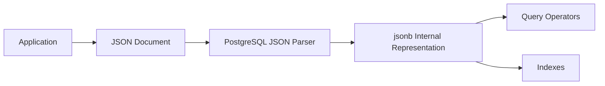
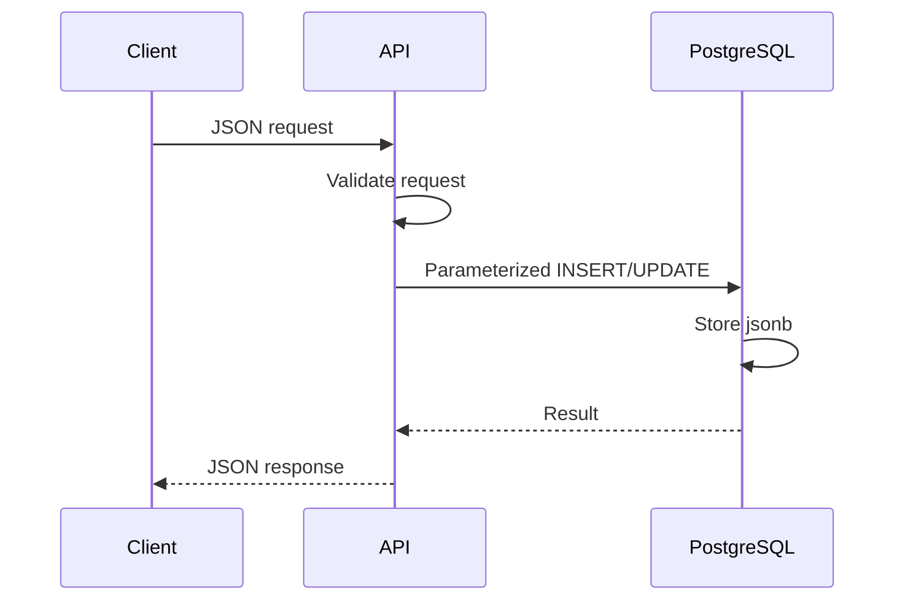

# 09- JSON and JSONB

## Overview

PostgreSQL provides two JSON types:

- `json` stores the input JSON representation and preserves whitespace, object-key order, and duplicate object keys.
- `jsonb` stores JSON in a decomposed binary representation optimized for processing and indexing.

For most production PostgreSQL applications, `jsonb` is the preferred choice when JSON must be queried, filtered, indexed, or modified inside the database.

JSON is useful when a domain contains genuinely variable or semi-structured attributes. It should not automatically replace relational columns. Data that participates in joins, constraints, frequent filtering, aggregation, or core business rules usually belongs in typed relational columns.

A practical rule is:

> Use relational columns for stable, important domain data and `jsonb` for genuinely flexible data.

## JSON vs JSONB

| Characteristic | `json` | `jsonb` |
|---|---|---|
| Storage | Original JSON text representation | Decomposed binary representation |
| Input formatting preserved | Yes | No |
| Object key order preserved | Yes | No |
| Duplicate object keys preserved | Yes | No |
| Parsing on read | More work | Already parsed |
| Querying | Supported | Better suited |
| Indexing | Limited | Extensive |
| Insert representation cost | Lower | Higher |
| Query performance | Usually worse for repeated processing | Usually better |
| Recommended default | Rarely | Usually |

Example:

```sql
CREATE TABLE products (
    id bigint GENERATED ALWAYS AS IDENTITY PRIMARY KEY,
    name text NOT NULL,
    metadata jsonb NOT NULL DEFAULT '{}'::jsonb
);
```

The `metadata` column can contain attributes that vary between products without requiring a schema migration for every new attribute.

## Why JSONB Exists

Relational schemas work best when the shape of data is known and stable:

```text
products
├── id
├── name
├── price
└── status
```

Some systems also have attributes whose structure legitimately changes:

```json
{
  "color": "black",
  "material": "aluminium",
  "dimensions": {
    "width": 20,
    "height": 10
  }
}
```

or:

```json
{
  "provider": "stripe",
  "provider_metadata": {
    "customer_type": "business",
    "risk_level": "low"
  }
}
```

A `jsonb` column provides flexibility without forcing every possible attribute into nullable relational columns.

This is particularly useful for:

- External API payloads.
- Provider-specific metadata.
- Product attributes with variable structure.
- Configuration documents.
- Event payloads.
- Integration metadata.
- Feature-specific optional fields.

The important design question is not:

> "Can this data be stored as JSON?"

It is:

> "Does this data benefit from remaining semi-structured?"

## JSONB Storage Model

`jsonb` is not simply a string containing JSON.

When PostgreSQL receives:

```json
{
  "status": "active",
  "priority": 3
}
```

it parses and stores the document in a decomposed internal representation.

Conceptually:



Because the document is parsed when stored, PostgreSQL can inspect individual keys and values without reparsing the entire textual representation for every query.

This improves database-side JSON processing but means `jsonb` generally requires more work during writes than storing raw JSON text.

## Basic JSONB Operations

Create a table:

```sql
CREATE TABLE users (
    id bigint GENERATED ALWAYS AS IDENTITY PRIMARY KEY,
    profile jsonb NOT NULL DEFAULT '{}'::jsonb
);
```

Insert a document:

```sql
INSERT INTO users (profile)
VALUES (
    '{
        "name": "Arun",
        "role": "backend-engineer",
        "skills": ["Python", "PostgreSQL"]
    }'::jsonb
);
```

Query the entire document:

```sql
SELECT profile
FROM users;
```

Query a top-level field:

```sql
SELECT profile->'name'
FROM users;
```

Extract a JSON value as text:

```sql
SELECT profile->>'name'
FROM users;
```

The distinction between `->` and `->>` is important.

| Operator | Result |
|---|---|
| `->` | JSON/JSONB value |
| `->>` | Text value |

For example:

```sql
SELECT profile->'skills'
FROM users;
```

returns a JSON array, while:

```sql
SELECT profile->>'role'
FROM users;
```

returns text.

## Navigating Nested JSON

Consider:

```json
{
  "address": {
    "city": "Bengaluru",
    "country": "India"
  }
}
```

Access the nested object:

```sql
SELECT profile->'address'
FROM users;
```

Access the nested scalar:

```sql
SELECT profile->'address'->>'city'
FROM users;
```

PostgreSQL also supports path extraction:

```sql
SELECT profile #>> '{address,city}'
FROM users;
```

For a JSON value rather than text:

```sql
SELECT profile #> '{address,city}'
FROM users;
```

## Filtering JSONB

Filter using a JSON value:

```sql
SELECT id, profile
FROM users
WHERE profile->>'role' = 'backend-engineer';
```

This is straightforward but may require an expression index for efficient execution at scale.

JSONB containment is often more useful:

```sql
SELECT id
FROM users
WHERE profile @> '{"role": "backend-engineer"}'::jsonb;
```

The `@>` operator means that the left-hand JSON document contains the right-hand JSON structure.

For example:

```json
{
  "role": "backend-engineer",
  "location": "India"
}
```

contains:

```json
{
  "role": "backend-engineer"
}
```

but not necessarily:

```json
{
  "role": "frontend-engineer"
}
```

## JSONB Operators

Common operators include:

| Operator | Purpose | Example |
|---|---|---|
| `->` | Get JSON object/array element | `data->'profile'` |
| `->>` | Get element as text | `data->>'status'` |
| `#>` | Get nested JSON value | `data#>'{a,b}'` |
| `#>>` | Get nested value as text | `data#>>'{a,b}'` |
| `@>` | Contains | `data @> '{"active": true}'` |
| `<@` | Is contained by | `data <@ '{"active": true}'` |
| `?` | Contains key/element | `data ? 'status'` |
| `?|` | Contains any key/element | `data ?| array['a','b']` |
| `?&` | Contains all keys/elements | `data ?& array['a','b']` |
| `||` | Concatenate JSONB values | `data || '{"x": 1}'` |
| `-` | Remove key/element | `data - 'temporary'` |
| `#-` | Remove nested path | `data #- '{a,b}'` |

These operators make `jsonb` substantially more capable than treating JSON as plain text.

## JSONB Arrays

Consider:

```json
{
  "skills": ["Python", "PostgreSQL", "Kafka"]
}
```

Extract the array:

```sql
SELECT profile->'skills'
FROM users;
```

Check whether an array contains a value:

```sql
SELECT id
FROM users
WHERE profile->'skills' ? 'Kafka';
```

For more complex array processing, PostgreSQL provides JSON functions such as `jsonb_array_elements`.

```sql
SELECT
    u.id,
    skill
FROM users AS u
CROSS JOIN LATERAL jsonb_array_elements_text(u.profile->'skills') AS skill;
```

This expands each JSON array element into a row.

## Updating JSONB

A JSONB value can be replaced:

```sql
UPDATE users
SET profile = '{"role": "staff-engineer"}'::jsonb
WHERE id = 1;
```

For production systems, replacing the entire document can be dangerous if multiple application components own different fields.

Prefer targeted updates when appropriate.

Set a nested value:

```sql
UPDATE users
SET profile = jsonb_set(
    profile,
    '{role}',
    '"staff-engineer"'::jsonb
)
WHERE id = 1;
```

The path:

```text
{role}
```

identifies the JSON key.

Nested updates can use:

```sql
UPDATE users
SET profile = jsonb_set(
    profile,
    '{address,city}',
    '"Mumbai"'::jsonb
)
WHERE id = 1;
```

## JSONB and NULL

JSONB has an important distinction between:

```sql
NULL
```

and:

```json
null
```

SQL `NULL` means the column itself has no value:

```sql
profile IS NULL
```

JSON `null` is a value inside the JSON document:

```json
{
  "phone": null
}
```

These are different states.

For example:

```sql
SELECT profile->'phone'
FROM users;
```

may produce a JSON `null` value when the key exists with JSON null.

A missing key is another case:

```json
{}
```

Applications should define whether these states mean different things:

```text
missing field
JSON null
SQL NULL
empty string
empty array
```

Ambiguous semantics create difficult production bugs.

## JSON vs JSONB Example

Suppose the application receives:

```json
{
  "name": "Arun",
  "tags": ["backend", "sql"]
}
```

With `json`, PostgreSQL retains the original textual representation.

With `jsonb`, PostgreSQL normalizes the representation for database processing.

For example, formatting differences are not semantically significant to `jsonb`.

This makes `jsonb` better suited to database-side querying and indexing.

## JSONB Indexing

A JSONB column can be indexed.

The most common general-purpose approach is a GIN index:

```sql
CREATE INDEX idx_users_profile_gin
ON users
USING GIN (profile);
```

This is useful for operators such as:

```sql
@>
?
?| 
?&
```

For example:

```sql
SELECT id
FROM users
WHERE profile @> '{"role": "backend-engineer"}'::jsonb;
```

can benefit from a suitable GIN index.

However, a GIN index is not automatically the best index for every JSONB query.

## GIN Indexes

GIN indexes are designed for indexing composite values such as JSONB documents.

Conceptually:

```text
JSONB document
      │
      ▼
extract searchable tokens
      │
      ▼
GIN index
 ┌────┼────┐
 ▼    ▼    ▼
key  value path
```

The exact internal representation depends on the operator class.

GIN indexes can be substantially larger than simple B-tree indexes and can increase write amplification.

Therefore:

> Index JSONB based on actual query patterns, not because the column happens to be JSONB.

## `jsonb_ops` vs `jsonb_path_ops`

PostgreSQL provides different GIN operator classes.

The default `jsonb_ops` supports a broad set of JSONB operators.

For containment-heavy workloads, `jsonb_path_ops` can provide a smaller and more specialized index:

```sql
CREATE INDEX idx_users_profile_path_gin
ON users
USING GIN (profile jsonb_path_ops);
```

The trade-off is reduced operator support compared with the default operator class.

| Operator class | Strength | Trade-off |
|---|---|---|
| `jsonb_ops` | Broad JSONB operator support | Larger/more general index |
| `jsonb_path_ops` | Efficient containment indexing | More limited operator support |

Choose based on the actual queries generated by the application.

## Expression Indexes

Suppose the application frequently executes:

```sql
SELECT id
FROM users
WHERE profile->>'role' = 'backend-engineer';
```

A GIN index on the entire document is not necessarily the best index.

Create an expression index:

```sql
CREATE INDEX idx_users_profile_role
ON users ((profile->>'role'));
```

Now PostgreSQL can efficiently use the extracted scalar value.

This is often a better design when one JSON field has become a high-value query dimension.

For frequently filtered scalar attributes, this can be an indicator that the field may deserve a relational column.

## Partial JSONB Indexes

If only a subset of rows needs an index:

```sql
CREATE INDEX idx_users_active_role
ON users ((profile->>'role'))
WHERE profile->>'status' = 'active';
```

Partial indexes reduce index size and write overhead when the predicate matches the workload.

## JSONB and Constraints

JSONB is flexible, but flexibility can weaken database-enforced structure.

For example:

```json
{
  "age": "thirty"
}
```

is syntactically valid JSON even when the application expects:

```json
{
  "age": 30
}
```

PostgreSQL does not automatically enforce your application's JSON schema.

If a JSONB field has important structural requirements, enforce them through:

- Application validation.
- Database constraints where practical.
- Generated columns.
- Carefully designed domain-specific validation.
- Schema validation at service boundaries.

For example:

```sql
ALTER TABLE users
ADD CONSTRAINT profile_is_object
CHECK (jsonb_typeof(profile) = 'object');
```

This guarantees that the top-level JSONB value is an object.

## JSONB in Backend APIs

A common architecture is:



The API's JSON representation and PostgreSQL's JSONB representation can be closely aligned, but they serve different purposes.

The API contract should remain explicit even if the database column is flexible.

Do not assume:

```text
JSON API = arbitrary JSONB database column
```

A public API should still have defined validation and compatibility rules.

## JSONB with Python

Python dictionaries map naturally to JSON objects.

```python
from typing import Any

import psycopg


profile: dict[str, Any] = {
    "role": "backend-engineer",
    "skills": ["Python", "PostgreSQL"],
}

with psycopg.connect("dbname=app") as conn:
    with conn.cursor() as cur:
        cur.execute(
            """
            INSERT INTO users (profile)
            VALUES (%s)
            RETURNING id
            """,
            (profile,),
        )
        user_id = cur.fetchone()[0]
```

The important production property is parameterization.

Do not construct SQL like:

```python
sql = f"""
INSERT INTO users (profile)
VALUES ('{profile}')
"""
```

Use the database driver's parameter binding instead.

## JSONB with Django

Django provides `JSONField`, which maps to PostgreSQL's JSONB type when PostgreSQL is used.

```python
from django.db import models


class Product(models.Model):
    name = models.CharField(max_length=255)
    metadata = models.JSONField(default=dict)
```

Query a JSON field:

```python
Product.objects.filter(
    metadata__provider="stripe",
)
```

For production applications, keep frequently queried and business-critical fields as explicit model fields when they need strong relational semantics.

JSONField is best used for genuinely flexible data rather than as an escape hatch from schema design.

## JSONB with FastAPI

FastAPI can validate structured JSON before it reaches PostgreSQL.

```python
from typing import Any

from fastapi import FastAPI
from pydantic import BaseModel, Field


class ProductRequest(BaseModel):
    name: str
    metadata: dict[str, Any] = Field(default_factory=dict)


app = FastAPI()


@app.post("/products")
def create_product(request: ProductRequest):
    return request
```

This creates a useful division of responsibility:

```text
Pydantic
  ↓
API contract validation

PostgreSQL
  ↓
Persistence + relational integrity
```

Do not move all validation responsibility into the database simply because the data is stored as JSONB.

## When JSONB Is a Good Fit

Use JSONB when:

### The Structure Is Genuinely Variable

Example:

```json
{
  "provider": "payment_provider_a",
  "provider_data": {
    "risk_score": 42
  }
}
```

Different providers may have different metadata.

### The Data Is Mostly Retrieved as a Document

Configuration or metadata may naturally be consumed as a whole document.

### The Schema Evolves Frequently

If adding optional metadata should not require a relational schema migration, JSONB can reduce migration overhead.

### The Database Still Needs to Query the Data

Unlike a blob stored in an external object store, JSONB can be filtered and indexed by PostgreSQL.

## When JSONB Is a Poor Fit

Avoid JSONB for core relational attributes such as:

```text
user_id
email
status
created_at
tenant_id
price
currency
```

when those fields require:

- Foreign keys.
- Unique constraints.
- Frequent joins.
- Strong type guarantees.
- Frequent filtering.
- Aggregation.
- Stable indexes.
- Referential integrity.

For example, this is usually inferior:

```sql
CREATE TABLE orders (
    id uuid PRIMARY KEY,
    data jsonb
);
```

with:

```json
{
  "customer_id": "...",
  "status": "paid",
  "total": 1299.99
}
```

if those values are central to the order domain.

A better design is:

```sql
CREATE TABLE orders (
    id uuid PRIMARY KEY,
    customer_id uuid NOT NULL REFERENCES customers(id),
    status text NOT NULL,
    total numeric(12,2) NOT NULL,
    metadata jsonb NOT NULL DEFAULT '{}'::jsonb
);
```

Use JSONB for the flexible part rather than hiding the entire relational model inside one document.

## JSONB vs Normalized Tables

| Requirement | JSONB | Relational tables |
|---|---:|---:|
| Flexible schema | Excellent | Requires migrations |
| Strong typing | Limited | Excellent |
| Foreign keys | Not directly inside JSON structure | Excellent |
| Joins | Possible but awkward | Excellent |
| Ad-hoc document attributes | Excellent | More schema work |
| Aggregation | Possible | Usually better |
| Referential integrity | Limited | Excellent |
| Indexing | Powerful but specialized | Mature and predictable |
| Stable business fields | Usually inferior | Preferred |
| External/provider metadata | Excellent | Often unnecessary complexity |

A senior design generally combines both models rather than treating them as mutually exclusive.

## Hybrid Data Modelling

A practical production table might look like:

```sql
CREATE TABLE orders (
    id uuid PRIMARY KEY DEFAULT gen_random_uuid(),
    customer_id uuid NOT NULL REFERENCES customers(id),
    status text NOT NULL,
    total_amount numeric(12,2) NOT NULL,
    currency char(3) NOT NULL,
    created_at timestamptz NOT NULL DEFAULT now(),
    metadata jsonb NOT NULL DEFAULT '{}'::jsonb
);
```

The stable domain model remains relational:

```text
id
customer_id
status
total_amount
currency
created_at
```

Flexible information goes into:

```text
metadata
```

This preserves database integrity while allowing controlled extensibility.

## JSONB and Generated Columns

If a JSON attribute becomes important enough to query frequently, a generated column can expose it relationally.

For example:

```sql
CREATE TABLE users (
    id uuid PRIMARY KEY DEFAULT gen_random_uuid(),
    profile jsonb NOT NULL DEFAULT '{}'::jsonb,
    country text GENERATED ALWAYS AS (profile->>'country') STORED
);
```

Then:

```sql
CREATE INDEX idx_users_country
ON users (country);
```

This can be useful when legacy or integration-driven data must remain JSONB but the application needs efficient relational-style access to selected fields.

However, if the attribute becomes a core domain concept, explicitly modelling it as a normal column may be clearer.

## JSONB Query Performance

JSONB queries can be fast, but performance depends on the operator and indexes.

A query such as:

```sql
WHERE metadata @> '{"provider": "stripe"}'
```

has different indexing requirements from:

```sql
WHERE metadata->>'provider' = 'stripe'
```

Before adding an index:

```sql
EXPLAIN (ANALYZE, BUFFERS)
SELECT id
FROM payments
WHERE metadata->>'provider' = 'stripe';
```

Inspect:

- Access path.
- Actual row counts.
- Buffer hits.
- Buffer reads.
- Execution time.
- Whether the expected index is used.

Indexing should follow measured workload behavior.

## Large JSONB Documents

Large JSONB documents create several operational concerns.

Updating one field can result in a new row version because PostgreSQL uses MVCC.

For a frequently updated large JSONB document, this can produce:

- More WAL.
- More table bloat.
- More vacuum work.
- Higher replication traffic.
- Increased write amplification.

For example, repeatedly modifying:

```json
{
  "large": "...very large document..."
}
```

may be significantly more expensive than updating a narrow relational column.

If a JSON document becomes large and frequently mutable, reconsider its data model.

Potential alternatives include:

- Normalized relational columns.
- Separate child tables.
- Append-only event records.
- Object storage for large immutable payloads.
- Dedicated document storage when the workload truly requires it.

## JSONB and MVCC

PostgreSQL updates generally create a new row version rather than modifying the old row in place.

Therefore:

```sql
UPDATE users
SET profile = jsonb_set(profile, '{status}', '"active"')
WHERE id = 1;
```

can generate a new row version even when only one JSON property changes.

This matters for high-frequency updates.

Monitor:

- Table bloat.
- Autovacuum behavior.
- WAL generation.
- Replication lag.
- Update frequency.
- Row size.

JSONB flexibility does not make partial updates free.

## JSONB and Statistics

PostgreSQL's query planner needs statistics to estimate row counts.

JSONB queries can be more difficult for the planner than ordinary typed columns, particularly when querying arbitrary document paths.

If a JSON attribute becomes important to query planning and indexing, consider exposing it through:

- An expression index.
- A generated column.
- A normal column.

This is another reason not to put every field into JSONB simply for schema flexibility.

## Security Considerations

JSONB can contain untrusted external data.

Treat JSONB payloads as application input.

Validate:

- Maximum document size.
- Allowed keys.
- Expected value types.
- Nested structure.
- Sensitive fields.
- Business rules.

Avoid blindly persisting entire external API responses if they may contain:

- Credentials.
- Access tokens.
- Personal information.
- Internal provider metadata.
- Unexpectedly large payloads.

If sensitive data is stored, apply the same encryption, access-control, retention, and auditing requirements as other sensitive database data.

## Production Checklist

Before introducing a JSONB field, ask:

- Is the structure genuinely variable?
- Which fields are guaranteed to exist?
- Which fields are queried frequently?
- Which fields need constraints?
- Which fields participate in joins?
- How large can the document become?
- How frequently will it be updated?
- What indexes are required?
- Does the application validate the structure?
- Is the data sensitive?
- Will analytics need to query individual attributes?
- Could a relational model be simpler?

For an important JSONB query, verify the actual execution plan:

```sql
EXPLAIN (ANALYZE, BUFFERS)
SELECT id
FROM orders
WHERE metadata @> '{"provider": "stripe"}'::jsonb;
```

Do not add broad GIN indexes automatically. They consume storage and increase write costs.

## Common Mistakes and Pitfalls

| Mistake | Problem | Better approach |
|---|---|---|
| Using JSONB for the entire domain model | Loses relational integrity and makes queries harder | Keep stable domain fields relational |
| Using `json` when database querying is required | Less efficient for repeated processing and indexing | Prefer `jsonb` |
| Adding a GIN index automatically | Increases storage and write overhead | Index based on measured query patterns |
| Using `->>` everywhere | Converts JSON values to text and may prevent the intended operator/index strategy | Choose operators deliberately |
| Treating JSONB as schema-free | Applications still depend on an implicit schema | Define and validate the document contract |
| Storing large frequently updated documents | Increases MVCC, WAL, bloat, and replication costs | Normalize frequently changing data |
| Confusing SQL `NULL` with JSON `null` | Produces incorrect application semantics | Define missing/null semantics explicitly |
| Storing IDs that need foreign keys only inside JSONB | Loses referential integrity | Use relational FK columns |
| Building SQL with JSON strings | Creates SQL injection and escaping risks | Use parameterized queries |
| Persisting arbitrary third-party payloads | Can create security, size, and retention problems | Validate, minimize, and selectively persist |
| Assuming JSONB is always faster | Performance depends on query and indexing strategy | Benchmark with `EXPLAIN (ANALYZE, BUFFERS)` |
| Allowing a flexible field to become a core business field | Creates long-term schema debt | Promote stable, important attributes to columns |

## Interview Traps

### Is JSONB just JSON stored as binary?

Not exactly.

PostgreSQL's `jsonb` uses a decomposed internal representation optimized for processing. It is not simply the original JSON string converted into an opaque binary blob.

### Which should normally be preferred in PostgreSQL: JSON or JSONB?

For most applications that need to query or index JSON data, `jsonb` is preferred.

Use `json` when preserving the exact input representation is important.

### Does JSONB preserve object key order?

No.

JSONB does not preserve the original textual representation, including object-key order and insignificant whitespace.

### Can JSONB have indexes?

Yes.

GIN indexes are commonly used for JSONB, while expression indexes are often better for frequently queried scalar paths.

### Is a GIN index always required for JSONB?

No.

The correct index depends on the query pattern. An expression B-tree index can be more appropriate for:

```sql
WHERE metadata->>'status' = 'active'
```

while GIN is useful for many containment/key-existence queries.

### Does JSONB provide schema validation?

No.

JSONB validates that the value is valid JSON, but it does not automatically enforce your application's expected document structure or business rules.

### Should foreign keys be stored inside JSONB?

Usually not.

If an identifier represents a real relational relationship, model it with a relational foreign-key column so PostgreSQL can enforce referential integrity.

### Does updating one JSONB property update only that property on disk?

Do not assume so.

PostgreSQL's MVCC update model means an update can create a new row version. Large, frequently modified JSONB values can therefore create substantial write amplification.

### When should a JSONB field become a normal column?

When the attribute becomes stable and important enough to require strong typing, constraints, joins, frequent filtering, aggregation, or predictable indexing.

## Key Takeaways

- **Prefer `jsonb` over `json` for PostgreSQL workloads that need database-side querying, indexing, and manipulation; use `json` mainly when preserving the original JSON representation matters.**
- **Use JSONB for genuinely flexible or integration-specific data, while keeping stable business attributes, relationships, and constrained values as relational columns.**
- **Index JSONB according to actual query patterns: GIN is broadly useful, while expression or partial indexes can be better for frequently queried scalar attributes.**
- **JSONB is not schema-free: validate its structure at application boundaries and carefully define semantics for missing keys, JSON `null`, and SQL `NULL`.**
- **Large or frequently updated JSONB documents can increase MVCC, WAL, bloat, replication, and indexing costs, so model high-churn data relationally when appropriate.**