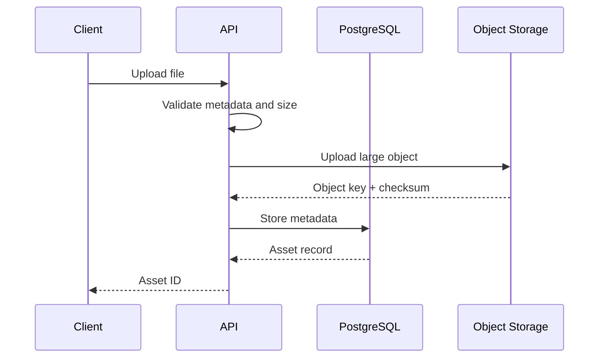
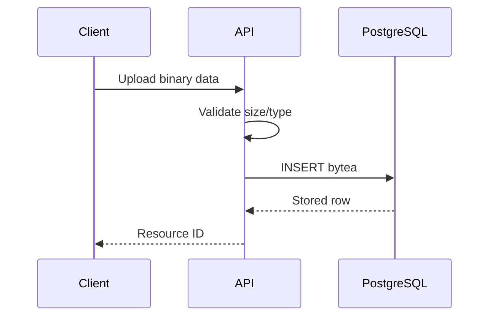
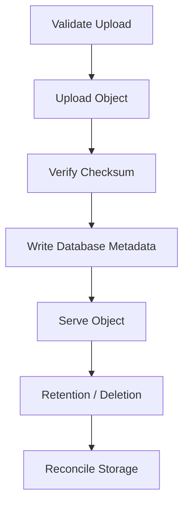

# 10- Binary Types

## Overview

Binary data represents arbitrary bytes rather than text. In PostgreSQL, the primary native type for storing binary data is `bytea`.

Use `bytea` when binary content is small enough to belong in the database and the application needs transactional access to that content. Examples include cryptographic digests, encrypted application data, small serialized payloads, thumbnails, or other bounded binary values.

For large files such as videos, backups, images, and documents, object storage such as Amazon S3 is generally a better architectural choice. Store the object in S3 and keep its metadata, identifier, checksum, and location in PostgreSQL.

The key design decision is therefore not simply whether PostgreSQL can store binary data. It can. The important question is whether binary data belongs in the database given its size, access pattern, lifecycle, and operational requirements.

## PostgreSQL `bytea`

`bytea` stores a variable-length sequence of bytes.

```sql
CREATE TABLE file_assets (
    id bigint GENERATED ALWAYS AS IDENTITY PRIMARY KEY,
    filename text NOT NULL,
    content_type text NOT NULL,
    content bytea NOT NULL,
    created_at timestamptz NOT NULL DEFAULT now()
);
```

Binary values can be inserted using PostgreSQL's supported binary input representations. Hexadecimal format is commonly used:

```sql
INSERT INTO file_assets (
    filename,
    content_type,
    content
)
VALUES (
    'example.bin',
    'application/octet-stream',
    '\x48656c6c6f'::bytea
);
```

The bytes represent:

```text
48 65 6c 6c 6f
 H  e  l  l  o
```

Retrieve the value:

```sql
SELECT content
FROM file_assets
WHERE id = 1;
```

## Why Binary Types Exist

Text types are designed around character data and character encoding.

Binary data has no inherent character encoding:

```text
PNG bytes
PDF bytes
compressed data
encrypted ciphertext
hash output
serialized binary protocol
```

Attempting to treat arbitrary bytes as text can cause:

- Encoding errors.
- Data corruption.
- Unnecessary transformations.
- Incorrect character conversions.
- Increased storage requirements.

`bytea` provides a database-native representation for arbitrary byte sequences.

## `bytea` vs Text

| Requirement | `bytea` | `text` |
|---|---:|---:|
| Arbitrary bytes | Yes | No |
| Human-readable text | No | Yes |
| Encoding semantics | None | Database encoding applies |
| Binary files | Suitable | Not recommended |
| Search as text | Limited | Excellent |
| Character operations | No | Yes |
| Typical API representation | Bytes | String |
| Large-file storage | Usually not ideal | Not applicable |

Do not Base64-encode binary data into a `text` column simply because the database supports text.

Base64 represents binary data using text characters and typically increases the payload size by roughly one-third before other overhead.

## Binary Data Flow

A typical backend request looks like:



For small binary values that belong in PostgreSQL:



The second architecture is simpler, but the database now carries the storage and operational burden of the binary content.

## When to Use `bytea`

`bytea` is appropriate when:

- The binary value is relatively small.
- The data must participate in database transactions.
- The application frequently reads the binary data together with relational data.
- Database backup and replication requirements are acceptable.
- The content has a lifecycle tied closely to the database row.
- Keeping the data in one transactional system materially simplifies the design.

Examples include:

- Cryptographic hashes.
- Encrypted tokens or secrets where appropriate.
- Small thumbnails.
- Small generated artifacts.
- Binary protocol payloads.
- Compact serialized values.

A digest is an especially good example:

```sql
CREATE TABLE documents (
    id uuid PRIMARY KEY,
    content_sha256 bytea NOT NULL,
    created_at timestamptz NOT NULL DEFAULT now()
);
```

For a SHA-256 digest, `bytea` stores the 32 raw bytes directly.

## When Not to Use `bytea`

Avoid storing large, frequently accessed files directly in PostgreSQL unless there is a strong architectural reason.

Examples include:

- Videos.
- Large images.
- Large PDFs.
- User-uploaded archives.
- Backups.
- Machine-generated datasets.
- Large build artifacts.

A more scalable architecture is:

```text
Client
  │
  ▼
API
  │
  ├──► Object Storage
  │       └── Large binary object
  │
  └──► PostgreSQL
          ├── asset_id
          ├── object_key
          ├── content_type
          ├── size
          ├── checksum
          └── metadata
```

PostgreSQL remains the system of record for metadata while object storage handles large immutable objects.

## `bytea` and Object Storage

For a production file-upload service, a table might look like:

```sql
CREATE TABLE assets (
    id uuid PRIMARY KEY,
    object_key text NOT NULL UNIQUE,
    content_type text NOT NULL,
    size_bytes bigint NOT NULL,
    checksum_sha256 bytea NOT NULL,
    created_at timestamptz NOT NULL DEFAULT now()
);
```

The binary content is stored externally:

```text
s3://bucket/assets/<object-key>
```

PostgreSQL stores the reference and transactional metadata.

This provides several advantages:

- Database size remains smaller.
- Large object delivery can use object-storage infrastructure.
- CDN integration is easier.
- Independent object lifecycle policies are possible.
- Database backups remain focused on application state.
- Large downloads do not consume database connections and database I/O unnecessarily.

## Binary Representation

PostgreSQL supports different textual representations for `bytea`.

Hexadecimal representation is commonly encountered:

```text
\x48656c6c6f
```

The `\x` prefix indicates hexadecimal binary representation.

The PostgreSQL wire protocol and client drivers can also transmit binary values without requiring the application to manually convert them to hexadecimal.

Application code should generally allow the database driver to perform the appropriate encoding and decoding.

## Python and `bytea`

Python's `bytes` type maps naturally to PostgreSQL `bytea`.

Using `psycopg`:

```python
import psycopg

payload = b"\x48\x65\x6c\x6c\x6f"

with psycopg.connect("dbname=app") as conn:
    with conn.cursor() as cur:
        cur.execute(
            """
            INSERT INTO binary_payloads (payload)
            VALUES (%s)
            RETURNING id
            """,
            (payload,),
        )

        payload_id = cur.fetchone()[0]
```

Read it back:

```python
with psycopg.connect("dbname=app") as conn:
    with conn.cursor() as cur:
        cur.execute(
            """
            SELECT payload
            FROM binary_payloads
            WHERE id = %s
            """,
            (payload_id,),
        )

        payload = cur.fetchone()[0]

assert isinstance(payload, bytes)
```

The driver handles the conversion between Python `bytes` and PostgreSQL `bytea`.

## Django and BinaryField

Django provides `BinaryField` for binary data.

```python
from django.db import models


class BinaryPayload(models.Model):
    payload = models.BinaryField()
    created_at = models.DateTimeField(auto_now_add=True)
```

For bounded binary values, this can be appropriate.

However, `BinaryField` should not automatically become the implementation for file storage. Django's file-storage abstractions and object storage are generally more appropriate for application files.

For example, a production model might store a reference to an object-storage key rather than the entire file:

```python
from django.db import models


class Asset(models.Model):
    object_key = models.CharField(max_length=512, unique=True)
    content_type = models.CharField(max_length=255)
    size_bytes = models.BigIntegerField()
    checksum_sha256 = models.BinaryField()
```

## Binary Data and Transactions

One major advantage of database-backed binary storage is transactional consistency.

For example:

```sql
BEGIN;

INSERT INTO documents (
    id,
    content,
    status
)
VALUES (
    gen_random_uuid(),
    '\x48656c6c6f'::bytea,
    'ready'
);

COMMIT;
```

The binary value and relational metadata are committed atomically.

With object storage, the application must coordinate two systems:

```text
Object Storage
      +
PostgreSQL
```

This introduces lifecycle concerns such as:

- Object uploaded but database transaction fails.
- Database row committed but object upload fails.
- Object deleted but metadata remains.
- Retry operations creating duplicate objects.

A production object-storage workflow should therefore be designed to be idempotent and capable of reconciling orphaned objects.

## Database Size and Binary Data

Binary values can significantly increase database storage requirements.

A database containing:

```text
100 million rows
× large binary payload
```

can become difficult to:

- Back up.
- Restore.
- Replicate.
- Vacuum.
- Rebuild indexes around.
- Clone for development.
- Move between environments.

Binary storage therefore has an operational cost beyond the raw size of the content.

Monitor:

- Table size.
- WAL generation.
- Replication lag.
- Backup duration.
- Restore duration.
- Disk utilization.
- I/O latency.

## WAL and Replication Implications

PostgreSQL's write-ahead logging records changes required for durability and recovery.

Large binary inserts and updates can therefore produce substantial WAL.

In a replicated PostgreSQL deployment:

```text
Primary
   │
   ├── WAL ──► Replica 1
   │
   └── WAL ──► Replica 2
```

large binary writes can increase:

- WAL volume.
- Network traffic.
- Replica replay work.
- Replication lag.
- Storage consumption.

This matters especially when the application performs frequent updates to large binary values.

Large immutable objects are often better suited to object storage, where replication and durability are handled by infrastructure designed for object data.

## Updating Binary Data

Replacing a binary value is an ordinary SQL update:

```sql
UPDATE binary_payloads
SET payload = '\x01020304'::bytea
WHERE id = 42;
```

For large values, frequent updates are expensive because PostgreSQL's MVCC model creates new row versions.

If a binary object changes frequently, consider whether the data should instead be:

- Stored as immutable objects.
- Versioned separately.
- Stored in object storage.
- Split into smaller relational records.

Immutable object designs are generally easier to operate at scale.

## Large Values and TOAST

PostgreSQL uses TOAST (The Oversized-Attribute Storage Technique) for large variable-length values.

A large `bytea` value may be stored out-of-line in a TOAST table rather than directly in the main heap tuple.

Conceptually:

```text
Main table row
┌─────────────────────┐
│ id                  │
│ metadata            │
│ TOAST pointer ──────┼──────► TOAST storage
└─────────────────────┘              │
                                     ▼
                              large bytea value
```

TOAST allows PostgreSQL to handle values larger than the size that would be practical to keep directly inside a normal heap tuple.

However, TOAST does not make large binary storage free.

Large values can still affect:

- Disk usage.
- WAL.
- I/O.
- Backups.
- Replication.
- Query latency.
- Cache behavior.

TOAST solves a storage-layout problem; it does not automatically solve an architecture problem.

## `bytea` vs Large Objects

PostgreSQL also provides a Large Object facility.

These are distinct mechanisms:

| Feature | `bytea` | Large Objects |
|---|---|---|
| SQL column value | Yes | No; referenced by OID |
| Normal relational model | Excellent | More specialized |
| Transaction support | Yes | Yes |
| Application complexity | Lower | Higher |
| Streaming APIs | Driver-dependent | Supported by LO APIs |
| Typical modern application choice | Preferred for bounded binary values | Specialized use cases |

For new application designs, `bytea` is generally simpler for bounded binary attributes.

Large Objects can still be useful for specialized workloads that require their particular API and semantics.

## Binary Data and Indexing

Do not create a normal index on arbitrary large binary content simply because indexing is available.

If the application needs to identify content, index a digest instead.

For example:

```sql
CREATE TABLE assets (
    id uuid PRIMARY KEY,
    content bytea NOT NULL,
    checksum_sha256 bytea NOT NULL UNIQUE
);
```

The checksum provides a compact lookup key:

```sql
SELECT id
FROM assets
WHERE checksum_sha256 = %s;
```

A B-tree index can efficiently support equality lookup on the digest.

This is generally preferable to comparing entire binary payloads.

## Content-Addressable Storage

A common production pattern is content-addressable storage.

The content is hashed:

```text
binary content
      │
      ▼
 SHA-256
      │
      ▼
digest
      │
      ▼
object key
```

For example:

```text
assets/
  ab/
    cdef1234...
```

The database stores:

```text
checksum
object key
size
content type
```

while the object store contains the actual content.

Benefits include:

- Deduplication opportunities.
- Integrity verification.
- Stable object identifiers.
- Efficient equality checks.
- Easier corruption detection.

A cryptographic digest is not itself proof of content authenticity; authenticity requirements may require signatures or other mechanisms.

## Binary Data and Security

Binary content should be treated as untrusted input.

For uploaded files, validate:

- Maximum size.
- Declared content type.
- Actual file format where required.
- Authentication and authorization.
- Malware scanning where appropriate.
- Retention requirements.
- Access permissions.

Do not trust a client-provided filename or MIME type as proof of content.

For example:

```text
invoice.pdf.exe
```

may not actually be a PDF.

For sensitive binary data, consider:

- Encryption at rest.
- Encryption in transit.
- Application-level encryption where required.
- Key management.
- Access auditing.
- Data retention and deletion policies.

When using AWS object storage, use appropriate IAM policies and bucket controls rather than exposing objects publicly by default.

## Avoid Base64 for Database Storage

A common pattern is:

```text
binary
  ↓
Base64
  ↓
text
  ↓
database
```

This can be useful at an API boundary where JSON requires textual data, but it is usually unnecessary inside PostgreSQL.

For example, an API might transport a small binary value as Base64:

```json
{
  "payload": "SGVsbG8="
}
```

The application can decode it into Python `bytes` before storing it in `bytea`.

Do not store the Base64 representation as text merely because the API uses Base64.

The preferred flow is:

```text
API Base64
    ↓
decode
    ↓
Python bytes
    ↓
PostgreSQL bytea
```

## Performance Considerations

Binary storage performance depends heavily on:

- Payload size.
- Read/write frequency.
- Row width.
- Cache behavior.
- Network bandwidth.
- Database I/O.
- Replication topology.
- Backup strategy.

A small 32-byte digest is fundamentally different from a 100 MB binary payload.

For large binary transfers, avoid unnecessary application hops:

```text
Client
  ↓
API
  ↓
Database
  ↓
API
  ↓
Client
```

This architecture makes the API and database carry the entire file transfer.

Prefer:

```text
Client
  ├──► API: metadata/authentication
  │
  └──► Object Storage: binary content
```

The API remains responsible for authorization while object storage handles bulk data transfer.

## API Design Considerations

If an API returns binary data directly, use an appropriate content type rather than serializing it unnecessarily into JSON.

For example:

```http
GET /assets/42
Accept: application/pdf
```

The response can be:

```http
Content-Type: application/pdf
Content-Length: 183421
```

For large objects, a better API pattern is often to return an authorized object-storage URL or use a controlled download endpoint.

The application should still enforce authorization before issuing access.

## Common Mistakes and Pitfalls

| Mistake | Problem | Better approach |
|---|---|---|
| Storing every uploaded file in PostgreSQL | Database grows rapidly and backups become expensive | Use object storage for large files |
| Base64-encoding binary into `text` | Adds encoding overhead and increases storage | Use `bytea` for binary database values |
| Treating `bytea` as a file-storage architecture | PostgreSQL becomes responsible for large object delivery | Use S3/object storage for large files |
| Updating large binary values frequently | Creates MVCC/WAL/replication overhead | Prefer immutable objects or separate versions |
| Trusting MIME type from clients | Malicious or incorrect content can bypass validation | Inspect and validate actual content |
| Indexing large binary payloads | Can create expensive and ineffective indexes | Index compact hashes/digests when lookup is required |
| Ignoring backup growth | Binary content can dominate backup size | Measure storage and restore requirements |
| Ignoring replication impact | Large writes can increase replica lag | Monitor WAL volume and replication latency |
| Using filenames as object identifiers | Names can collide or contain unsafe input | Generate controlled object keys |
| Exposing object storage publicly | Bypasses application authorization | Use private objects and controlled access |
| Assuming TOAST eliminates large-object costs | Storage layout improves but operational costs remain | Evaluate workload architecture |
| Storing secrets without an explicit security model | Binary values may contain sensitive material | Define encryption, access, rotation, and retention controls |

## Production Decision Guide

| Scenario | Recommended approach |
|---|---|
| SHA-256 digest | `bytea` |
| Small encrypted token | `bytea`, with appropriate key management |
| Small binary protocol payload | `bytea` |
| Small thumbnail tightly coupled to a row | `bytea` can be appropriate |
| User profile image | Object storage |
| PDF document | Object storage |
| Video | Object storage |
| Backup archive | Object storage |
| Large generated report | Object storage |
| Content checksum | `bytea` |
| Frequently updated large binary document | Usually redesign storage strategy |

The boundary is workload-dependent rather than a strict byte-size rule. The important factors are size, access pattern, transactional requirements, operational cost, and lifecycle.

## Production Checklist

Before storing binary data in PostgreSQL, verify:

- Is the binary value small and bounded?
- Does it need transactional consistency with relational data?
- How frequently is it read?
- How frequently is it updated?
- What is the maximum payload size?
- How will database backups scale?
- What is the WAL impact?
- What is the replication impact?
- How long must the data be retained?
- Does the application need content-addressable lookup?
- Would S3 or another object store be operationally simpler?
- Is the binary data sensitive?
- Are access controls and deletion requirements defined?
- Can the system restore the data within the required RTO?

For object storage, maintain a clear lifecycle:



The reconciliation step matters because PostgreSQL and object storage do not share a transaction boundary.

## Interview Traps

### What is PostgreSQL's binary type?

`bytea` is PostgreSQL's native variable-length binary data type.

### Why not store binary data in `text`?

Text has character encoding semantics. Arbitrary bytes do not necessarily represent valid text. Base64 can encode binary as text, but introduces unnecessary representation overhead when the database can store bytes directly.

### Does `bytea` mean PostgreSQL can efficiently store unlimited files?

No.

PostgreSQL can handle large values using mechanisms such as TOAST, but large binary workloads still affect storage, WAL, replication, backups, and I/O. Object storage is often a better architecture for large files.

### What is the difference between `bytea` and a large object?

`bytea` is a normal SQL column value. PostgreSQL Large Objects are a separate facility referenced through object identifiers and accessed through specialized APIs.

### How should binary content be indexed?

Usually, do not index the complete binary content. If equality or deduplication lookup is required, store a compact cryptographic digest such as SHA-256 and index that value.

### Why can object storage be preferable to PostgreSQL?

Object storage is designed for large objects and high-volume binary transfer. It can reduce database size, backup pressure, replication traffic, and database I/O while providing lifecycle and delivery capabilities suited to files.

### What is the transactional disadvantage of object storage?

PostgreSQL and object storage generally do not participate in the same database transaction. The application must therefore handle partial failures and reconcile orphaned objects or metadata.

## Key Takeaways

- **Use PostgreSQL `bytea` for bounded binary values that genuinely belong with relational data; do not treat it as a universal file-storage mechanism.**
- **Prefer object storage such as S3 for large files because database size, WAL, replication, backup, and I/O costs grow with binary payloads.**
- **Use parameterized database operations and let the database driver map application `bytes` to `bytea` instead of manually constructing binary SQL.**
- **Index compact digests rather than large binary payloads when content lookup or deduplication is required.**
- **Treat binary uploads as untrusted data and design validation, authorization, encryption, retention, backup, and cross-system reconciliation explicitly.**