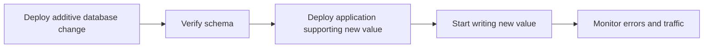
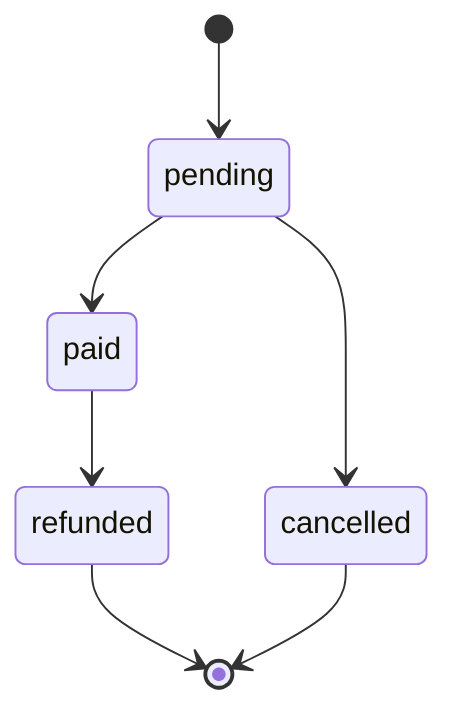
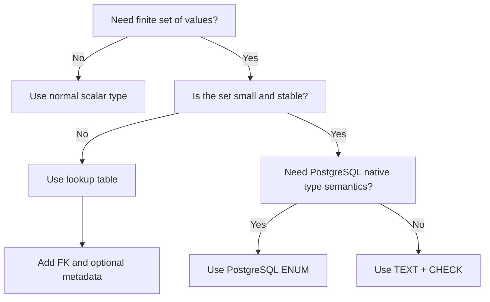

# 11- Enum Types

## Overview

An enum type represents a column whose value must come from a predefined set of named values.

Enums are useful when the domain contains a **small, stable, explicitly defined set of states or categories**, such as:

- `pending`, `paid`, `failed`
- `active`, `suspended`, `deleted`
- `free`, `pro`, `enterprise`

PostgreSQL supports native enum types. They provide database-level validation while keeping the stored representation readable.

The important production decision is whether the allowed values are stable enough to justify a database-level enum. For frequently changing business values, a lookup table with a foreign key is often more flexible.

## Why Enum Types Exist

Without a constraint, an application may accidentally write invalid values:

```sql
INSERT INTO orders (status)
VALUES ('pendng');
```

A database enum rejects values outside its definition:

```text
Application
    │
    ▼
INSERT status = 'pendng'
    │
    ▼
PostgreSQL
    │
    ├── Valid enum value ──► Store row
    │
    └── Invalid value ─────► Reject statement
```

This makes the database an enforcement boundary rather than relying exclusively on Python, Django, FastAPI, or another application layer.

## PostgreSQL Enum Syntax

Create an enum:

```sql
CREATE TYPE order_status AS ENUM (
    'pending',
    'paid',
    'cancelled'
);
```

Use it in a table:

```sql
CREATE TABLE orders (
    id bigint GENERATED ALWAYS AS IDENTITY PRIMARY KEY,
    status order_status NOT NULL,
    created_at timestamptz NOT NULL DEFAULT now()
);
```

Insert valid values:

```sql
INSERT INTO orders (status)
VALUES ('pending');
```

An invalid value is rejected:

```sql
INSERT INTO orders (status)
VALUES ('completed');
```

The database enforces the allowed set.

## Enum Values Are Data Constraints

An enum is not merely a convenient application-level constant.

The database itself understands that:

```text
order_status =
    pending
    paid
    cancelled
```

Only those values are valid.

This provides stronger integrity than:

```sql
status text
```

with no constraint.

However, the constraint is also a schema dependency. Adding, renaming, or removing values can require database migrations and careful coordination with application deployments.

## Enum vs `CHECK` Constraint

A common alternative is a text column with a `CHECK` constraint.

### Enum

```sql
CREATE TYPE order_status AS ENUM (
    'pending',
    'paid',
    'cancelled'
);

CREATE TABLE orders (
    id bigint GENERATED ALWAYS AS IDENTITY PRIMARY KEY,
    status order_status NOT NULL
);
```

### `CHECK`

```sql
CREATE TABLE orders (
    id bigint GENERATED ALWAYS AS IDENTITY PRIMARY KEY,
    status text NOT NULL,
    CONSTRAINT orders_status_check
        CHECK (status IN ('pending', 'paid', 'cancelled'))
);
```

Both enforce a finite set of values.

| Property | PostgreSQL `ENUM` | `TEXT` + `CHECK` |
|---|---|---|
| Database-level validation | Yes | Yes |
| Values are reusable across tables | Yes | Constraint must be repeated |
| Easy to modify | Moderate | Generally easier |
| Schema dependency | Strong | Lower |
| Type safety inside PostgreSQL | Strong | Lower |
| Portable across databases | Lower | Higher |
| Good for stable states | Excellent | Excellent |
| Good for frequently changing values | Usually no | Better |
| Supports descriptive metadata | No | No |

For many application schemas, `text` plus a `CHECK` constraint is easier to evolve. Native enums are most attractive when the value set is genuinely part of the database type system and is relatively stable.

## Enum vs Lookup Table

For business-controlled categories, a lookup table is often more appropriate.

```sql
CREATE TABLE order_statuses (
    code text PRIMARY KEY,
    description text NOT NULL,
    is_active boolean NOT NULL DEFAULT true
);

CREATE TABLE orders (
    id bigint GENERATED ALWAYS AS IDENTITY PRIMARY KEY,
    status text NOT NULL REFERENCES order_statuses(code)
);
```

Now the status can carry metadata:

```text
order_statuses
┌─────────┬──────────────────────┬───────────┐
│ code    │ description          │ is_active │
├─────────┼──────────────────────┼───────────┤
│ pending │ Awaiting payment     │ true      │
│ paid    │ Payment completed    │ true      │
│ failed  │ Payment failed       │ true      │
└─────────┴──────────────────────┴───────────┘
```

This is useful when business users or administrators need to manage the values or when each value has additional attributes.

## Decision Guide

| Requirement | Recommended approach |
|---|---|
| Small, stable set of database-level values | PostgreSQL `ENUM` |
| Values need simple validation | `TEXT` + `CHECK` |
| Values change frequently | Lookup table |
| Values have descriptions/metadata | Lookup table |
| Values are tenant-configurable | Lookup table |
| Values need lifecycle flags | Lookup table |
| Cross-database portability is important | `TEXT` + `CHECK` |
| Strong PostgreSQL type semantics are valuable | `ENUM` |

The most important question is **how stable the domain is**, not simply how many values currently exist.

## Creating and Altering Enums

PostgreSQL supports adding enum values:

```sql
ALTER TYPE order_status
ADD VALUE 'refunded';
```

You can also control ordering relative to existing values:

```sql
ALTER TYPE order_status
ADD VALUE 'refunded' AFTER 'paid';
```

The exact migration behavior and transaction restrictions depend on the PostgreSQL version and the specific operation, so production migrations should be tested against the exact PostgreSQL version used by the deployment.

### Renaming an Enum Value

PostgreSQL supports renaming enum values:

```sql
ALTER TYPE order_status
RENAME VALUE 'cancelled' TO 'canceled';
```

This is a schema change and can affect application code, APIs, reports, background jobs, and integrations.

### Removing an Enum Value

Removing an enum value is significantly more complicated than adding one.

Do not design a production workflow around frequent enum-value deletion.

If a value becomes obsolete, a safer approach is often to:

- Stop creating new rows with the value.
- Migrate existing rows.
- Deploy application changes.
- Retain the obsolete value temporarily if required for compatibility.

This is one reason lookup tables or `CHECK` constraints can be easier to evolve.

## Deployment Strategy

Enum changes must be coordinated with application deployments.

Suppose the current enum is:

```text
pending
paid
cancelled
```

A new application version starts writing:

```text
refunded
```

If the application is deployed before the database migration:

```text
New application
      │
      ▼
status = 'refunded'
      │
      ▼
Old database enum
      │
      ▼
ERROR
```

A safe deployment sequence is:



For a newly added enum value, a typical expansion deployment is:

1. Add the enum value.
2. Verify the migration succeeds.
3. Deploy application code that understands the value.
4. Begin producing the new value.
5. Monitor consumers and integrations.

This follows the broader **expand-and-contract** principle.

## Enum Ordering

PostgreSQL enum values have an ordering.

For example:

```sql
CREATE TYPE priority AS ENUM (
    'low',
    'medium',
    'high'
);
```

Comparisons can use that defined ordering:

```sql
SELECT *
FROM tasks
ORDER BY priority;
```

The ordering is based on the enum definition, not alphabetical ordering.

This can be useful, but it can also create subtle bugs if engineers assume:

```text
enum ordering == alphabetical ordering
```

or assume that business priority can freely change without considering the type's ordering semantics.

If ordering is an important business concept, a lookup table with an explicit numeric priority is often clearer:

```sql
CREATE TABLE priorities (
    code text PRIMARY KEY,
    sort_order integer NOT NULL UNIQUE
);
```

## Enum and NULL

An enum column can still be nullable:

```sql
CREATE TABLE users (
    id bigint GENERATED ALWAYS AS IDENTITY PRIMARY KEY,
    account_status order_status
);
```

The enum restricts non-`NULL` values, but `NULL` remains valid.

If the column must always contain a status:

```sql
CREATE TABLE users (
    id bigint GENERATED ALWAYS AS IDENTITY PRIMARY KEY,
    account_status order_status NOT NULL
);
```

This distinction matters because:

```text
NULL
```

does not mean:

```text
pending
```

and does not mean:

```text
unknown enum value
```

It means the value is absent or unknown according to SQL's three-valued logic.

## Enum and SQL Queries

Enums can be used naturally in predicates:

```sql
SELECT id, status
FROM orders
WHERE status = 'paid';
```

Aggregate queries work normally:

```sql
SELECT status, count(*)
FROM orders
GROUP BY status
ORDER BY status;
```

The database type remains useful while SQL operations continue to behave as expected.

## Indexing Enum Columns

Enum columns can be indexed normally.

```sql
CREATE INDEX orders_status_idx
ON orders (status);
```

However, indexing every enum column is not automatically useful.

Consider:

```text
10 million rows
status = 'paid' for 9.9 million rows
status = 'pending' for 100,000 rows
```

An index on `status` may provide limited benefit for queries selecting the dominant value because the predicate has low selectivity.

For common production queries, index based on the complete access pattern:

```sql
CREATE INDEX orders_status_created_idx
ON orders (status, created_at);
```

Or use a partial index when the workload justifies it:

```sql
CREATE INDEX orders_pending_created_idx
ON orders (created_at)
WHERE status = 'pending';
```

Index decisions should be based on actual query plans and workload rather than the existence of an enum.

## Enum Storage and Performance

Enums are compact and PostgreSQL can compare them efficiently.

The primary advantage of enums, however, is **data integrity**, not dramatic performance improvement.

Do not choose an enum because you expect it to make application queries significantly faster.

For most backend workloads, the performance difference between:

```sql
status order_status
```

and:

```sql
status text CHECK (...)
```

is less important than:

- Correct indexing.
- Query selectivity.
- Data modeling.
- Connection management.
- Query volume.
- Transaction design.

## Application Integration

The application should have a consistent representation of the allowed values.

For Python:

```python
from enum import StrEnum


class OrderStatus(StrEnum):
    PENDING = "pending"
    PAID = "paid"
    CANCELLED = "cancelled"
```

This avoids scattering string literals throughout the codebase:

```python
if order.status == "paid":
    ...
```

Prefer:

```python
if order.status == OrderStatus.PAID:
    ...
```

The database remains the final integrity boundary.

## FastAPI and Enum Validation

FastAPI can use Python enums for request validation.

```python
from enum import StrEnum

from fastapi import FastAPI
from pydantic import BaseModel


class OrderStatus(StrEnum):
    PENDING = "pending"
    PAID = "paid"
    CANCELLED = "cancelled"


class UpdateOrderRequest(BaseModel):
    status: OrderStatus


app = FastAPI()
```

An incoming API request such as:

```json
{
  "status": "paid"
}
```

can be validated before reaching the database.

This creates multiple layers of validation:

```text
HTTP Request
     │
     ▼
Pydantic validation
     │
     ▼
Application/domain logic
     │
     ▼
PostgreSQL enum
     │
     ▼
Persistent data integrity
```

Application validation improves API behavior, while database validation protects the database from every client, script, migration, job, and service that can access it.

## Django Considerations

Django supports Python enums for model choices.

```python
from django.db import models


class OrderStatus(models.TextChoices):
    PENDING = "pending", "Pending"
    PAID = "paid", "Paid"
    CANCELLED = "cancelled", "Cancelled"


class Order(models.Model):
    status = models.CharField(
        max_length=20,
        choices=OrderStatus,
    )
```

Django's `choices` provide application/model-level validation and metadata, but they are not automatically equivalent to a PostgreSQL native enum.

For most Django applications, `CharField` with choices is often easier to evolve than a PostgreSQL enum.

If a native PostgreSQL enum is deliberately required, manage it through explicit database migrations and ensure Django's model definition and database schema remain consistent.

## API Compatibility

Enums become especially important when values cross service boundaries.

Consider:

```text
Order Service
      │
      ├── REST API
      │
      ├── Kafka event
      │
      └── gRPC service
```

If one service changes:

```text
paid
```

to:

```text
payment_completed
```

every consumer must understand the new representation.

For public APIs and event streams, enum values are effectively part of the contract.

Avoid casually renaming or reusing values.

A value that means:

```text
cancelled
```

today should not later be repurposed to mean:

```text
refunded
```

Even if the database accepts the string, downstream consumers may interpret it using the old semantics.

## Event-Driven Systems

Enums in Kafka events or other asynchronous messages require additional compatibility discipline.

Example:

```json
{
  "order_id": "8d8c...",
  "status": "paid"
}
```

A new producer might emit:

```json
{
  "order_id": "8d8c...",
  "status": "refunded"
}
```

Consumers must be designed to tolerate the new value where appropriate.

A robust consumer should distinguish between:

```text
Known value
Unknown future value
Malformed value
```

Do not assume an enum used internally by PostgreSQL can automatically be evolved safely across distributed systems.

## Enum and State Machines

An enum is useful for representing states, but an enum alone does not enforce valid **transitions**.

For example:

```text
pending → paid → refunded
```

may be valid, while:

```text
refunded → pending
```

may be invalid.

The enum defines the state set:

```text
pending
paid
refunded
```

It does not necessarily define the state transition graph.

Application logic or database mechanisms must enforce transition rules.

A simple state transition model can be represented as:



For critical financial or workflow systems, explicitly model and test state transitions rather than assuming that an enum provides workflow integrity.

## Security Considerations

Enums can improve integrity but are not an authorization mechanism.

This is incorrect reasoning:

```text
status = 'admin'
```

being impossible means the system is secure.

Authorization must still be enforced independently:

```text
Authentication
      ↓
Authorization
      ↓
Business validation
      ↓
Database constraints
```

Also avoid exposing internal database enum names blindly through public APIs. Public API contracts may need a stable representation that can evolve independently from internal schema details.

## Migration and Rollback Risks

Enum migrations deserve special attention in CI/CD.

Adding a value is usually easier than removing or renaming one.

A rollback problem can occur when:

```text
Deployment A
    │
    ▼
Application writes "refunded"
    │
    ▼
Deployment B rollback
    │
    ▼
Old application does not understand "refunded"
```

The database may contain values that the older application cannot process.

This is another reason to use backward-compatible deployment strategies.

Before a migration, determine:

- Which application versions can read the new value?
- Which versions can write it?
- Are background workers deployed independently?
- Are consumers reading the same values?
- Can the deployment be rolled back safely?
- Do historical rows contain the new value?

## Common Mistakes and Pitfalls

| Mistake | Problem | Better approach |
|---|---|---|
| Using enums for rapidly changing business values | Schema migrations become frequent | Use a lookup table |
| Assuming enum prevents invalid state transitions | Enum only restricts possible values | Enforce transition rules separately |
| Renaming values casually | Breaks APIs, events, reports, and consumers | Treat enum values as contracts |
| Removing enum values during normal operation | Existing rows or old services may depend on them | Migrate data and use expand-and-contract |
| Using enum solely for performance | Integrity is usually the stronger benefit | Choose based on domain semantics |
| Assuming `NULL` is an enum state | `NULL` means absence/unknown | Use explicit enum values when a state is required |
| Indexing every enum column | Low-cardinality indexes may provide little benefit | Validate with query plans |
| Exposing database enum directly as public API contract | Couples external API to internal schema | Define stable API semantics |
| Deploying code before enum migration | New writes can fail | Apply compatible schema changes first |
| Reusing an old enum value for a new meaning | Historical consumers misinterpret it | Introduce a new value |
| Assuming Django choices create PostgreSQL enums | Model choices and native enums are different | Understand the actual database schema |
| Forgetting asynchronous consumers | Kafka/Celery consumers may not understand new values | Coordinate all producers and consumers |

## Production Best Practices

### Keep Enum Sets Small and Stable

Good:

```text
payment_status:
    pending
    paid
    failed
```

Less suitable:

```text
customer_segment:
    ...
```

when business users continuously create and modify segments.

### Treat Values as Immutable Contracts

Once an enum value is used in:

- APIs.
- Kafka events.
- Database records.
- Reports.
- Analytics.
- Background jobs.

its meaning becomes difficult to change safely.

Prefer adding a new value over changing the meaning of an existing one.

### Prefer Expand-and-Contract Deployments

For new values:

```text
1. Add database value
2. Deploy code that understands it
3. Start producing it
4. Update consumers
5. Remove old behavior only after compatibility is established
```

### Keep Business Metadata Out of the Enum

If you need:

```text
status
display_name
sort_order
is_active
description
tenant-specific behavior
```

use a lookup table.

### Validate at Multiple Boundaries

A production system may validate the value at:

```text
API schema
    ↓
Domain logic
    ↓
Database constraint
    ↓
Event schema / consumer
```

Each layer serves a different purpose.

## Choosing the Right Representation

A useful decision process is:



The choice should reflect expected domain evolution, not just today's schema.

## Interview Traps

### Is an enum the same as a lookup table?

No.

An enum is a database type with a predefined set of values. A lookup table stores rows that represent valid values and can attach metadata, lifecycle information, permissions, or other attributes.

### Does an enum enforce state transitions?

No.

It restricts the set of valid states. Transition rules require additional application or database logic.

### Are PostgreSQL enums easy to remove?

No.

Adding values is generally straightforward, while removing or restructuring enum values can require more involved migrations and coordination with existing data and applications.

### Why might `TEXT` plus `CHECK` be preferable?

It can be easier to evolve and is generally more portable across database systems.

### When is a lookup table better?

When values are expected to change, need metadata, are administrator-managed, are tenant-specific, or participate in richer business rules.

### Does Django `choices` create a PostgreSQL enum?

Not by default.

Django's normal `choices` pattern typically uses a character column with application-level choice metadata. A PostgreSQL native enum requires explicit database-level schema management.

### Why is adding an enum value a deployment concern?

Because application servers, background workers, and event consumers may run different versions simultaneously. The database must not accept values that active consumers cannot safely process.

## Key Takeaways

- **Use PostgreSQL enums for small, stable value sets where database-level type enforcement is valuable; do not use them for frequently changing business data.**
- **An enum constrains possible values but does not enforce state transitions, authorization, or broader business rules.**
- **Treat enum values as durable contracts once they appear in APIs, events, reports, or persistent data.**
- **For evolving or metadata-rich domains, prefer `TEXT` + `CHECK` or a lookup table with a foreign key.**
- **Deploy enum changes using backward-compatible migration strategies so application servers, workers, and distributed consumers remain compatible.**