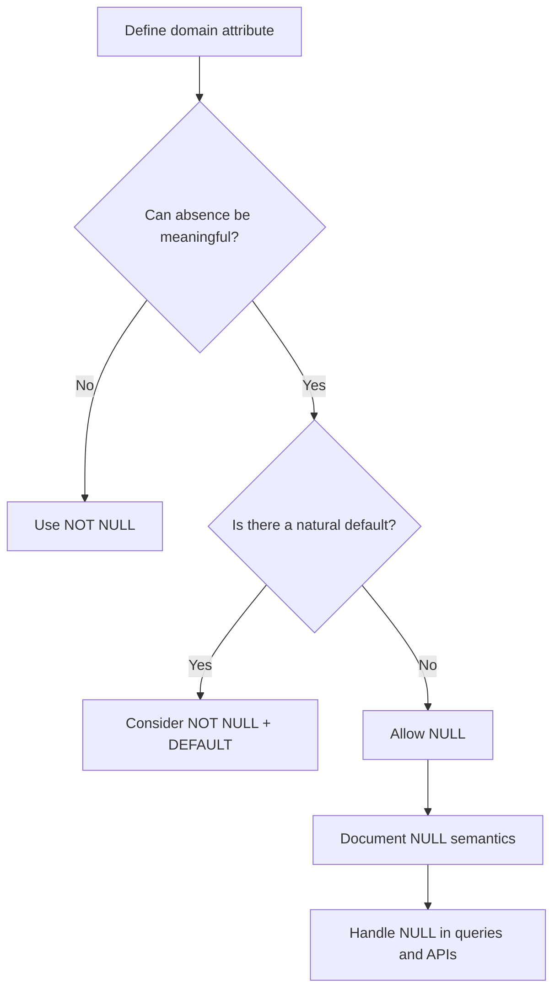

# 12- NULL and Data Types

## Overview

`NULL` represents the absence of a value in SQL. It is not zero, an empty string, `false`, or a default value. `NULL` is a special marker that interacts with SQL's three-valued logic and therefore affects comparisons, expressions, constraints, sorting, aggregation, joins, and application behavior.

Understanding `NULL` is particularly important when choosing SQL data types because every nullable column effectively has two dimensions:

- The **type of the value**, such as `integer`, `text`, `boolean`, `date`, or `jsonb`.
- Whether the value may be **absent**, represented by `NULL`.

A production schema should make this distinction deliberate. Nullable columns are useful when "unknown", "not provided", or "not applicable" is a legitimate domain state, but unnecessary nullability increases query complexity and can hide data-quality problems.

## NULL Is Not a Data Type

`NULL` is not a SQL data type.

For example:

```sql
CREATE TABLE users (
    id bigint PRIMARY KEY,
    age integer,
    display_name text
);
```

Both columns have concrete data types:

```text
age          → integer
display_name → text
```

They may additionally contain `NULL`:

```text
age          → 42 or NULL
display_name → 'Aranya' or NULL
```

Conceptually:

```text
Column definition
      │
      ├── Data type
      │     ├── integer
      │     ├── text
      │     ├── boolean
      │     └── timestamptz
      │
      └── Nullability
            ├── nullable
            └── NOT NULL
```

This distinction is important when designing schemas and application models.

## Why NULL Exists

Real systems frequently encounter information that is genuinely unavailable.

Examples:

| Situation | Appropriate representation |
|---|---|
| User has no middle name | `NULL` |
| Payment has not happened yet | Domain-specific status such as `pending` |
| Delivery date is not known yet | `NULL` |
| Customer explicitly provided an empty note | `''` |
| Quantity is zero | `0` |
| Feature is disabled | `false` |
| Optional JSON attribute is absent | Depends on domain semantics |

The key engineering question is:

> Does the absence of a value have a distinct business meaning?

If yes, `NULL` may be appropriate. If no, prefer a non-null value with an explicit default or domain representation.

## NULL and Three-Valued Logic

SQL does not use only `TRUE` and `FALSE`.

Expressions involving `NULL` can produce:

- `TRUE`
- `FALSE`
- `UNKNOWN`

For example:

```sql
SELECT 10 = NULL;
```

does not return `TRUE` or `FALSE`. It evaluates to `UNKNOWN`.

Similarly:

```sql
SELECT NULL = NULL;
```

also produces `UNKNOWN`.

This is why the following query is incorrect:

```sql
SELECT *
FROM users
WHERE deleted_at = NULL;
```

Use:

```sql
SELECT *
FROM users
WHERE deleted_at IS NULL;
```

And for non-null values:

```sql
SELECT *
FROM users
WHERE deleted_at IS NOT NULL;
```

## Comparison Behavior

The basic comparison operators interact with `NULL` differently from ordinary values.

| Expression | Result |
|---|---|
| `5 = NULL` | `UNKNOWN` |
| `5 <> NULL` | `UNKNOWN` |
| `NULL = NULL` | `UNKNOWN` |
| `NULL <> NULL` | `UNKNOWN` |
| `NULL IS NULL` | `TRUE` |
| `NULL IS NOT NULL` | `FALSE` |

The same principle applies to comparisons involving nullable columns.

```sql
SELECT *
FROM orders
WHERE shipped_at > now();
```

Rows where `shipped_at` is `NULL` do not satisfy the predicate because:

```text
NULL > now() → UNKNOWN
```

A `WHERE` clause keeps rows only when its condition evaluates to `TRUE`.

## NULL and WHERE Clauses

This is one of the most important operational consequences of `NULL`.

Consider:

```sql
SELECT *
FROM orders
WHERE status <> 'cancelled';
```

It is tempting to interpret this as:

```text
status is anything except cancelled
```

But rows with:

```text
status = NULL
```

are not returned.

The evaluation is:

```text
NULL <> 'cancelled'
        ↓
     UNKNOWN
        ↓
   WHERE rejects row
```

If the intended semantics are "not cancelled, including unknown status", the predicate must explicitly handle `NULL`:

```sql
SELECT *
FROM orders
WHERE status <> 'cancelled'
   OR status IS NULL;
```

Whether this is correct depends on the business requirement.

## NULL and Boolean Logic

Three-valued logic becomes particularly important with `AND`, `OR`, and `NOT`.

| Expression | Result |
|---|---|
| `TRUE AND UNKNOWN` | `UNKNOWN` |
| `FALSE AND UNKNOWN` | `FALSE` |
| `TRUE OR UNKNOWN` | `TRUE` |
| `FALSE OR UNKNOWN` | `UNKNOWN` |
| `NOT UNKNOWN` | `UNKNOWN` |

Example:

```sql
SELECT *
FROM users
WHERE is_active = true
  AND deleted_at IS NULL;
```

This is straightforward because the nullable field is handled explicitly.

Avoid assuming that:

```sql
WHERE is_active
```

and:

```sql
WHERE is_active = true
```

are always equivalent from a modeling perspective when the column permits `NULL`.

A nullable boolean has three possible states:

```text
TRUE
FALSE
NULL
```

If the domain only requires:

```text
enabled
disabled
```

use:

```sql
is_enabled boolean NOT NULL
```

rather than creating an accidental third state.

## NULL and NOT NULL

`NOT NULL` is one of the most important schema constraints for preventing accidental missing data.

```sql
CREATE TABLE payments (
    id bigint GENERATED ALWAYS AS IDENTITY PRIMARY KEY,
    amount numeric(12, 2) NOT NULL,
    status text NOT NULL,
    created_at timestamptz NOT NULL DEFAULT now()
);
```

The database rejects inserts that omit these required values:

```sql
INSERT INTO payments (status)
VALUES ('pending');
```

This fails because `amount` is required.

`NOT NULL` should be used whenever the application cannot meaningfully operate with the field absent.

## Nullable vs NOT NULL

| Design | Advantages | Risks |
|---|---|---|
| `NOT NULL` | Strong integrity, simpler queries | Requires a meaningful value/default |
| Nullable | Represents genuine absence | More complex queries and application logic |
| Nullable with default | Convenient writes | Can hide whether a value was explicitly supplied |
| Nullable boolean | Represents three states | Often creates accidental ambiguity |
| Nullable foreign key | Supports optional relationships | Requires explicit handling of missing relationships |

A senior-level schema design does not aim to eliminate every `NULL`. It aims to make every nullable column intentional.

## NULL and Default Values

A default is not the same as `NOT NULL`.

```sql
CREATE TABLE accounts (
    id bigint GENERATED ALWAYS AS IDENTITY PRIMARY KEY,
    login_count integer NOT NULL DEFAULT 0
);
```

If the application omits `login_count`, PostgreSQL uses:

```text
0
```

But explicitly inserting `NULL` is still invalid because of `NOT NULL`:

```sql
INSERT INTO accounts (login_count)
VALUES (NULL);
```

The combination:

```sql
NOT NULL DEFAULT 0
```

is useful when the domain has a natural zero value.

For optional information, however:

```sql
last_login_at timestamptz
```

may legitimately remain `NULL` until the first login.

## NULL and COALESCE

`COALESCE` returns the first non-null expression.

```sql
SELECT COALESCE(display_name, 'Unknown')
FROM users;
```

For numeric values:

```sql
SELECT COALESCE(discount_amount, 0)
FROM orders;
```

For timestamps:

```sql
SELECT COALESCE(shipped_at, created_at)
FROM orders;
```

`COALESCE` is useful when query output needs a fallback representation.

However, do not use it indiscriminately.

This:

```sql
SELECT COALESCE(amount, 0)
FROM payments;
```

changes the meaning of the result from:

```text
unknown/missing amount
```

to:

```text
zero amount
```

That may be incorrect.

Prefer to preserve `NULL` when the distinction matters.

## NULL and CASE

`CASE` can explicitly handle nullable values:

```sql
SELECT
    CASE
        WHEN shipped_at IS NULL THEN 'not shipped'
        ELSE 'shipped'
    END AS shipping_state
FROM orders;
```

For nullable boolean values:

```sql
SELECT
    CASE
        WHEN is_verified = true THEN 'verified'
        WHEN is_verified = false THEN 'not verified'
        ELSE 'unknown'
    END AS verification_state
FROM users;
```

This is often clearer than relying on implicit three-valued logic.

## NULL and Aggregation

Aggregate functions have important `NULL` semantics.

Consider:

```sql
CREATE TABLE payments (
    amount numeric(12, 2)
);
```

with:

```text
100.00
200.00
NULL
```

Then:

```sql
SELECT
    COUNT(*) AS rows,
    COUNT(amount) AS amounts,
    SUM(amount) AS total,
    AVG(amount) AS average
FROM payments;
```

Conceptually:

| Expression | Result |
|---|---:|
| `COUNT(*)` | 3 |
| `COUNT(amount)` | 2 |
| `SUM(amount)` | 300.00 |
| `AVG(amount)` | 150.00 |

Most aggregate functions ignore `NULL` values.

`COUNT(*)` counts rows, while `COUNT(column)` counts non-null values.

This distinction is critical in reporting systems.

## NULL and SUM

If all input values are `NULL`, `SUM()` returns `NULL`, not zero.

```sql
SELECT SUM(amount)
FROM payments
WHERE customer_id = 123;
```

If the desired reporting behavior is zero when no non-null amount exists:

```sql
SELECT COALESCE(SUM(amount), 0)
FROM payments
WHERE customer_id = 123;
```

Again, this is a semantic decision rather than merely a formatting decision.

## NULL and DISTINCT

`DISTINCT` treats `NULL` values as one distinct value for result-set purposes.

For example:

```sql
SELECT DISTINCT department_id
FROM employees;
```

If multiple employees have:

```text
department_id = NULL
```

the result contains a single `NULL` entry.

This is different from ordinary equality semantics where:

```sql
NULL = NULL
```

is `UNKNOWN`.

## NULL and ORDER BY

Sorting nullable values requires understanding where `NULL` appears.

PostgreSQL allows explicit control:

```sql
SELECT *
FROM orders
ORDER BY shipped_at ASC NULLS LAST;
```

Or:

```sql
SELECT *
FROM orders
ORDER BY shipped_at DESC NULLS FIRST;
```

This is often preferable to relying on database-specific defaults.

For example, an operational dashboard might want:

```text
Oldest shipped orders
...
Never shipped
```

which can be expressed explicitly with:

```sql
ORDER BY shipped_at ASC NULLS LAST;
```

## NULL and Unique Constraints

`NULL` has special behavior with uniqueness.

In PostgreSQL, a standard unique constraint generally allows multiple `NULL` values:

```sql
CREATE TABLE users (
    id bigint GENERATED ALWAYS AS IDENTITY PRIMARY KEY,
    external_id text UNIQUE
);
```

Multiple rows can have:

```text
external_id = NULL
```

because `NULL` represents an absent/unknown value rather than a value equal to another `NULL`.

If the business requirement is uniqueness among non-null values, the standard unique constraint already provides that behavior.

For more specialized semantics, PostgreSQL also supports unique indexes with configurable null treatment in modern versions.

Always verify the exact uniqueness requirement rather than assuming:

```text
UNIQUE → only one NULL
```

## NULL and Foreign Keys

Nullable foreign keys are common:

```sql
CREATE TABLE orders (
    id bigint GENERATED ALWAYS AS IDENTITY PRIMARY KEY,
    assigned_worker_id bigint REFERENCES workers(id)
);
```

A row with:

```text
assigned_worker_id = NULL
```

means no worker is currently assigned.

This can be a valid domain model:

```text
Order
  │
  └── assigned_worker_id
          ├── worker ID
          └── NULL = unassigned
```

However, avoid using `NULL` merely because the relationship is inconvenient to model.

If every order must have an owner, use:

```sql
assigned_worker_id bigint NOT NULL REFERENCES workers(id)
```

## NULL and JOINs

Nullable values become especially important with joins.

Consider:

```sql
SELECT
    orders.id,
    workers.name
FROM orders
LEFT JOIN workers
    ON workers.id = orders.assigned_worker_id;
```

An unassigned order produces:

```text
workers.name = NULL
```

because there is no matching worker row.

This is expected behavior for a `LEFT JOIN`.

A common production bug is accidentally converting the behavior into an inner join:

```sql
SELECT
    orders.id,
    workers.name
FROM orders
LEFT JOIN workers
    ON workers.id = orders.assigned_worker_id
WHERE workers.name = 'Alice';
```

The `WHERE` predicate removes rows where `workers.name` is `NULL`, effectively eliminating unmatched rows.

If the filtering condition belongs to the joined table while preserving unmatched orders, place it in the join condition when appropriate:

```sql
SELECT
    orders.id,
    workers.name
FROM orders
LEFT JOIN workers
    ON workers.id = orders.assigned_worker_id
   AND workers.name = 'Alice';
```

## NULL and Data Types

Every major SQL type can generally participate in nullable columns.

| Data type | Example nullable value | Common interpretation |
|---|---|---|
| `integer` | `NULL` | Unknown/missing quantity |
| `numeric` | `NULL` | Unknown amount |
| `text` | `NULL` | Not provided |
| `boolean` | `NULL` | Unknown/not determined |
| `date` | `NULL` | Date not known/applicable |
| `timestamptz` | `NULL` | Event has not occurred |
| `uuid` | `NULL` | Identifier not assigned |
| `jsonb` | `NULL` | Entire JSON document absent |
| `enum` | `NULL` | State not specified |
| `bytea` | `NULL` | Binary value absent |

The semantic meaning must come from the domain model.

## NULL vs Empty Values

One of the most common modeling mistakes is treating these as interchangeable:

```text
NULL
''
0
false
'{}'
[]
```

They can represent very different states.

For example, in a customer profile:

```text
phone_number = NULL
```

might mean:

> Customer has not provided a phone number.

While:

```text
phone_number = ''
```

might mean:

> Customer explicitly supplied an empty value.

In many systems the latter is undesirable and should be normalized to `NULL`.

For numeric fields:

```text
balance = 0
```

usually means:

> The balance is known and is zero.

Whereas:

```text
balance = NULL
```

usually means:

> The balance is unknown or not applicable.

Do not substitute one for another without an explicit domain decision.

## NULL and JSON/JSONB

For PostgreSQL `jsonb`, distinguish between a SQL `NULL` and a JSON `null`.

SQL `NULL`:

```sql
INSERT INTO events (payload)
VALUES (NULL);
```

JSON `null`:

```sql
INSERT INTO events (payload)
VALUES ('null'::jsonb);
```

These represent different states.

Conceptually:

```text
SQL NULL
└── no database value

JSON null
└── JSON document containing the null literal
```

Likewise, an absent JSON key differs from a key containing `null`:

```json
{}
```

versus:

```json
{
  "email": null
}
```

This distinction becomes important when building APIs and event schemas.

## NULL and Application Code

Application frameworks must map SQL `NULL` correctly.

In Python, SQL `NULL` is normally represented as:

```python
None
```

For example:

```python
user.last_login_at is None
```

not:

```python
user.last_login_at == ""
```

In Django:

```python
User.objects.filter(last_login_at__isnull=True)
```

corresponds conceptually to:

```sql
WHERE last_login_at IS NULL
```

In SQLAlchemy:

```python
query.where(User.last_login_at.is_(None))
```

Framework abstractions are useful, but engineers should still understand the SQL semantics underneath them.

## API Semantics

Nullable database fields should not automatically become ambiguous API fields.

For example:

```json
{
  "last_login_at": null
}
```

might mean:

- User has never logged in.
- Login history is unavailable.
- Value was intentionally cleared.

The API contract should define the meaning.

For update APIs, distinguish carefully between:

```json
{}
```

and:

```json
{
  "phone_number": null
}
```

For a PATCH-style API:

```text
field absent
    → do not modify

field = null
    → explicitly clear
```

This is particularly important when the database column is nullable.

## Schema Design Guidance

A practical schema-design process is:



For every nullable field, document what `NULL` means.

Good:

```sql
last_login_at timestamptz
-- NULL means the user has never successfully logged in.
```

Poor:

```sql
some_date timestamptz
-- NULL because reasons
```

Explicit semantics make future maintenance much safer.

## Production Performance Considerations

`NULL` itself is rarely a meaningful performance problem. The main performance concerns arise from how nullable columns are queried and indexed.

For example:

```sql
SELECT *
FROM orders
WHERE shipped_at IS NULL;
```

can use an appropriate index when the planner determines it is beneficial.

For a large table where only a small fraction of orders remain unshipped, a partial index can be highly effective:

```sql
CREATE INDEX orders_unshipped_idx
ON orders (created_at)
WHERE shipped_at IS NULL;
```

This keeps the index focused on the relevant subset.

For a nullable status or state field, evaluate:

- Cardinality.
- Selectivity.
- Query frequency.
- Table size.
- Data distribution.
- Index maintenance cost.

Use `EXPLAIN (ANALYZE, BUFFERS)` to validate actual query behavior.

## Production Reliability Considerations

Nullable columns increase the number of possible application states.

For example:

```text
is_verified boolean NOT NULL
```

has:

```text
TRUE
FALSE
```

while:

```text
is_verified boolean
```

has:

```text
TRUE
FALSE
NULL
```

Every additional state can affect:

- Validation.
- Serialization.
- Business logic.
- Query predicates.
- Reporting.
- Caching.
- Event processing.
- Testing.

This is not inherently bad. It means the third state must be intentional.

## Common Mistakes and Pitfalls

| Mistake | Why it happens | Better approach |
|---|---|---|
| `WHERE column = NULL` | Treating `NULL` like a normal value | Use `IS NULL` |
| `WHERE column <> value` while expecting NULL rows | Forgetting three-valued logic | Explicitly handle `NULL` |
| Nullable boolean for a binary concept | Avoiding a `NOT NULL` decision | Use `boolean NOT NULL` |
| Using `NULL` instead of `0` | Confusing unknown with zero | Define domain semantics |
| Using empty string instead of `NULL` | Treating missing and empty as identical | Define and enforce one representation |
| Assuming `COUNT(column)` counts all rows | Forgetting it excludes `NULL` | Use `COUNT(*)` when counting rows |
| Replacing every `NULL` with `0` using `COALESCE` | Trying to simplify output | Preserve semantic differences |
| Assuming `NULL = NULL` is true | Applying ordinary equality reasoning | Use `IS NULL` |
| Accidentally turning `LEFT JOIN` into an inner join | Filtering nullable joined columns in `WHERE` | Move appropriate predicates into `ON` |
| Making every column nullable | Avoiding schema decisions | Default to `NOT NULL` when absence is invalid |
| Treating SQL `NULL` and JSON `null` as identical | Ignoring representation boundaries | Model the two states explicitly |
| Assuming defaults eliminate `NULL` | Default only applies when a value is omitted | Add `NOT NULL` when required |
| Ignoring API null semantics | Mapping database behavior directly to HTTP | Define absent vs explicit `null` behavior |

## Interview Traps

### Is NULL equal to NULL?

No.

```sql
NULL = NULL
```

evaluates to `UNKNOWN`.

Use:

```sql
NULL IS NULL
```

when checking for `NULL`.

### Is NULL the same as zero?

No.

```text
0    → known numeric value
NULL → absent/unknown/not applicable
```

### Is NULL the same as an empty string?

No.

```text
NULL → absent/unknown
''   → known string containing zero characters
```

### Why does `COUNT(*)` differ from `COUNT(column)`?

`COUNT(*)` counts rows. `COUNT(column)` counts only rows where the column is non-null.

### Why does `WHERE column <> 'x'` exclude NULL rows?

Because:

```text
NULL <> 'x'
```

evaluates to `UNKNOWN`, and `WHERE` retains only `TRUE`.

### Can a primary key contain NULL?

No. A primary key must identify a row and is therefore non-null.

### Can a foreign key be NULL?

Yes, if the foreign-key column is nullable. This is commonly used to represent an optional relationship.

### Does DEFAULT prevent NULL?

No.

This:

```sql
status text DEFAULT 'pending'
```

does not prevent:

```sql
INSERT INTO orders (status)
VALUES (NULL);
```

Use:

```sql
status text NOT NULL DEFAULT 'pending'
```

when `NULL` is invalid.

## Operational Checklist

Before making a column nullable, verify:

- [ ] `NULL` has a clearly documented business meaning.
- [ ] The application handles `None`/`NULL` correctly.
- [ ] API semantics distinguish absent fields from explicit `null` where necessary.
- [ ] Queries use `IS NULL` / `IS NOT NULL` where appropriate.
- [ ] Aggregations account for `NULL` behavior.
- [ ] Joins have been reviewed for nullable relationships.
- [ ] Indexes support important `IS NULL` or `IS NOT NULL` queries when needed.
- [ ] Reports do not incorrectly convert unknown values into zero or empty values.
- [ ] Background workers and event consumers handle nullable fields.
- [ ] Tests cover both populated and `NULL` states.
- [ ] A `NOT NULL` constraint is used wherever absence is invalid.

## Key Takeaways

- **`NULL` is not a data type; it represents the absence or unknown state of a value belonging to another SQL data type.**
- **SQL uses three-valued logic, so comparisons with `NULL` produce `UNKNOWN`; use `IS NULL` and `IS NOT NULL` for null checks.**
- **Use `NOT NULL` by default when a field is required, and allow `NULL` only when absence has intentional domain semantics.**
- **Never casually equate `NULL` with `0`, `false`, empty strings, empty JSON, or other default values because they can represent different business states.**
- **Nullable data affects queries, joins, aggregates, APIs, indexes, and application logic, so nullability must be treated as a production-level schema design decision.**