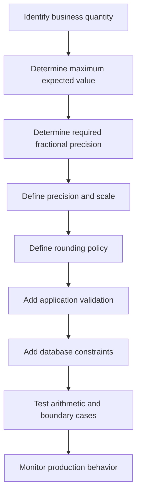

# 13- Precision and Scale

## Overview

Precision and scale define how exact a numeric value can be when using fixed-point decimal types such as PostgreSQL `numeric` and SQL `DECIMAL`.

They are particularly important for values where rounding errors are unacceptable or where the database must enforce a strict numeric representation:

- Monetary amounts
- Tax rates
- Interest rates
- Exchange rates
- Measurements requiring controlled decimal precision
- Financial and accounting calculations
- Quantities with a defined number of fractional digits

For a declaration such as:

```sql
numeric(12, 2)
```

- **Precision** = `12`: maximum number of significant decimal digits.
- **Scale** = `2`: maximum number of digits to the right of the decimal point.

Therefore, the largest positive value representable without overflow is:

```text
9,999,999,999.99
```

Precision and scale are not formatting options. They are part of the database's data model and directly affect correctness, validation, storage, arithmetic, and application behavior.

## Precision

Precision is the **total number of significant decimal digits** allowed in a fixed-precision numeric value.

For:

```sql
numeric(12, 2)
```

there can be at most:

```text
12 total digits
```

including both sides of the decimal point.

Examples:

```text
1234567890.12  → 12 digits → valid
123456789.12   → 11 digits → valid
12345678901.12 → 13 digits → exceeds precision
```

Precision answers:

> How many decimal digits can the value contain in total?

## Scale

Scale specifies the number of digits allowed to the right of the decimal point.

For:

```sql
numeric(12, 2)
```

the scale is:

```text
2
```

Examples:

```text
100.00
25.50
0.99
```

Scale answers:

> How many fractional decimal digits should the type preserve?

The number of digits available before the decimal point is approximately:

```text
precision - scale
```

For:

```sql
numeric(12, 2)
```

that gives:

```text
12 - 2 = 10
```

digits before the decimal point.

## Precision vs Scale

| Definition | Example `numeric(12,2)` |
|---|---:|
| Precision | 12 |
| Scale | 2 |
| Maximum integer digits | 10 |
| Maximum fractional digits | 2 |
| Maximum positive value | 9,999,999,999.99 |
| Minimum negative value | -9,999,999,999.99 |

A useful mental model is:

```text
numeric(precision, scale)
       │          │
       │          └── digits after decimal
       │
       └───────────── total digits
```

## Why Precision and Scale Matter

Without explicit numeric constraints, an application may accidentally accept values outside the intended business domain.

Consider an order amount:

```sql
amount numeric(12, 2) NOT NULL
```

This communicates several domain rules:

```text
Maximum fractional precision → 2 decimal places
Maximum total digits         → 12
Maximum integer digits       → 10
```

Compare that with:

```sql
amount numeric
```

The latter leaves precision and scale unconstrained at the column-definition level.

For financial data, making the intended numeric boundaries explicit can prevent invalid data from entering the system.

## Common Numeric Definitions

```sql
price numeric(10, 2)
tax_rate numeric(7, 4)
exchange_rate numeric(18, 8)
quantity numeric(12, 3)
```

The appropriate values depend on the domain.

| Use case | Example | Reason |
|---|---|---|
| Currency amount | `numeric(12,2)` | Usually two fractional digits |
| Tax rate | `numeric(7,4)` | More fractional precision |
| Exchange rate | `numeric(18,8)` | Fine-grained rate representation |
| Physical quantity | `numeric(12,3)` | Supports thousandths |
| Percentage | `numeric(7,4)` | Supports precise fractional rates |

These are examples rather than universal standards. Domain requirements should determine the actual precision and scale.

## How `numeric(p,s)` Works

Suppose:

```sql
CREATE TABLE products (
    price numeric(10, 2) NOT NULL
);
```

The database allows:

```text
12345678.90
```

because:

```text
integer digits = 8
fractional digits = 2
total digits = 10
```

But:

```text
123456789.00
```

requires:

```text
9 integer digits + 2 fractional digits = 11 digits
```

and therefore exceeds `numeric(10,2)`.

Conceptually:

```text
numeric(10,2)

12345678.90
└────8────┘ └2┘
 integer   fraction

Total = 10 digits
```

## Scale and Input Rounding

Fixed-scale numeric columns can round input values when the supplied value has more fractional digits than the declared scale.

For example:

```sql
CREATE TABLE payments (
    amount numeric(10, 2)
);

INSERT INTO payments (amount)
VALUES (12.345);
```

The stored value is rounded according to PostgreSQL's numeric behavior:

```text
12.35
```

This is important because scale is not merely a validation rule that rejects every value with additional fractional digits.

Applications should not rely on database rounding as their primary business rule. If rounding is business-critical, make the rounding policy explicit in the application or SQL expression and test it.

## Precision Overflow

Scale does not protect against excessively large integer values.

For:

```sql
numeric(10, 2)
```

the integer portion can contain at most:

```text
10 - 2 = 8 digits
```

Therefore:

```text
99,999,999.99 → valid
100,000,000.00 → exceeds precision
```

The second value contains:

```text
9 integer digits + 2 fractional digits = 11 digits
```

which exceeds the precision of `10`.

## Negative Values

The sign does not count toward precision.

For:

```sql
numeric(8, 2)
```

this is valid:

```text
-999999.99
```

The digits are:

```text
6 integer digits + 2 fractional digits = 8
```

The `-` sign is not one of those digits.

## Trailing Zeros

Trailing zeros after the decimal point are significant to the declared scale but do not change the numeric mathematical value.

For example:

```text
10.00
10.0
10
```

represent the same numeric quantity.

With a column defined as:

```sql
numeric(10, 2)
```

the database can represent the value with the intended two-decimal scale.

Do not confuse numeric representation with display formatting. Formatting such as:

```text
$10.00
```

belongs to the presentation layer, while:

```text
10.00
```

is a numeric database value.

## Precision and Arithmetic

Numeric expressions can produce values with precision and scale different from their input columns.

For example:

```sql
SELECT
    price * quantity AS total
FROM order_items;
```

If:

```text
price    → numeric(10,2)
quantity → numeric(10,3)
```

the resulting expression has its own numeric precision and scale determined by the database's numeric arithmetic rules.

Do not assume that:

```text
result precision = input precision
result scale = input scale
```

When arithmetic is important, inspect the resulting type and explicitly cast or round when the business rule requires a specific representation.

For example:

```sql
SELECT ROUND(price * quantity, 2)
FROM order_items;
```

## Rounding vs Truncation

Rounding and truncation are different operations.

### Rounding

```sql
SELECT round(12.345, 2);
```

produces:

```text
12.35
```

### Truncation

```sql
SELECT trunc(12.345, 2);
```

produces:

```text
12.34
```

The distinction matters in financial and measurement systems.

Never use truncation when the business rule requires rounding.

## Rounding Policy Is a Business Rule

Financial systems should define how fractional values are rounded.

Common policies include:

- Round half up
- Round half away from zero
- Round half to even
- Truncate
- Currency-specific rules

Do not assume that the database's default rounding behavior automatically matches the organization's accounting requirements.

For example, tax calculations may require:

```text
tax = round(subtotal × tax_rate, 2)
```

while another calculation may require carrying additional precision internally and rounding only at settlement.

The important architectural question is:

> At which stage does the system intentionally reduce precision?

## Currency Modeling

For currencies with two decimal places, a common PostgreSQL design is:

```sql
CREATE TABLE payments (
    id bigint GENERATED ALWAYS AS IDENTITY PRIMARY KEY,
    amount numeric(12, 2) NOT NULL,
    currency char(3) NOT NULL
);
```

This avoids using floating-point types for monetary amounts.

For example:

```text
amount   = 1499.99
currency = USD
```

The currency code is a separate attribute because the numeric value alone does not identify the monetary unit.

Do not assume all currencies use two fractional digits. Currency-specific rules can differ, so a global `numeric(12,2)` policy may be inappropriate for systems supporting multiple currencies.

## Percentage and Rate Modeling

Rates often require more fractional precision than currency.

For example:

```sql
tax_rate numeric(7, 4)
```

could represent:

```text
18.0000
7.5000
0.1250
```

An alternative domain representation is to store a fractional rate:

```text
0.180000
```

rather than:

```text
18.000000
```

Either can work, but the convention must be explicit.

For example:

```sql
subtotal * tax_rate
```

has very different results depending on whether:

```text
tax_rate = 18
```

or:

```text
tax_rate = 0.18
```

A strong schema makes the representation obvious through naming and documentation.

## Fixed-Point vs Floating-Point

Precision and scale are primarily associated with **exact decimal arithmetic**.

Compare:

| Property | `numeric/decimal` | `real/double precision` |
|---|---|---|
| Arithmetic model | Exact decimal representation | Approximate binary floating point |
| Exact decimal storage | Yes | Generally no |
| Good for money | Yes | No |
| Good for scientific calculations | Sometimes | Often |
| Predictable decimal rounding | Stronger | Requires care |
| Typical performance | Slower | Faster |
| Typical use | Financial/business values | Scientific/engineering measurements |

For example, binary floating point cannot generally represent decimal fractions such as `0.1` exactly.

This can produce results such as:

```text
0.1 + 0.2 ≠ exactly 0.3
```

depending on the language and representation.

For financial values, use an exact decimal representation such as PostgreSQL `numeric`.

## PostgreSQL `numeric` vs Python `float`

A common backend mistake is correctly choosing `numeric` in PostgreSQL but converting the value to Python `float`.

Prefer:

```python
from decimal import Decimal

amount = Decimal("19.99")
```

rather than:

```python
amount = float("19.99")
```

Python's `Decimal` is designed for decimal arithmetic and is a much better match for PostgreSQL `numeric`.

With Django, `DecimalField` maps naturally to this model:

```python
from django.db import models

class Payment(models.Model):
    amount = models.DecimalField(
        max_digits=12,
        decimal_places=2,
    )
```

Conceptually:

```text
PostgreSQL numeric(12,2)
        ↕
Django DecimalField(max_digits=12, decimal_places=2)
        ↕
Python Decimal
```

Keeping the representation exact across the application and database prevents unnecessary precision loss.

## API Boundaries

JSON APIs require additional care because many clients represent numbers using IEEE 754 floating-point values.

For example:

```json
{
  "amount": 19.99
}
```

may be parsed differently across programming languages and runtimes.

For monetary APIs, many systems still expose decimal amounts as JSON numbers, but the API contract must explicitly define:

- Precision.
- Scale.
- Rounding behavior.
- Currency.
- Whether excessive fractional digits are rejected or rounded.
- Maximum permitted value.

For high-integrity financial workflows, representing decimal monetary values as strings can also be appropriate:

```json
{
  "amount": "19.99",
  "currency": "USD"
}
```

The correct choice depends on the API contract and client ecosystem.

## Database vs Application Validation

Validation should exist at the appropriate layers.

For example:

```text
Client
  ↓
API validation
  ↓
Application/domain validation
  ↓
Database constraints
  ↓
Storage
```

The application should provide useful validation errors before attempting the write.

The database should still enforce the invariant because applications are not the only possible writers.

For example:

```sql
amount numeric(12, 2) NOT NULL CHECK (amount >= 0)
```

protects the database even if data is written by:

- REST APIs
- Background workers
- Celery tasks
- Administrative scripts
- Data migrations
- ETL jobs
- Other services

Application validation improves user experience; database constraints provide the final integrity boundary.

## Schema Evolution

Changing precision or scale in production requires care.

For example, changing:

```sql
numeric(10, 2)
```

to:

```sql
numeric(14, 2)
```

expands the permitted integer range.

Changing:

```sql
numeric(12, 4)
```

to:

```sql
numeric(12, 2)
```

can cause values with more than two fractional digits to be rounded and may alter business meaning.

Before reducing scale:

1. Identify existing values with excessive fractional precision.
2. Determine the required rounding policy.
3. Validate downstream consumers.
4. Test the migration on production-sized data.
5. Deploy application changes compatible with both schema versions where necessary.
6. Monitor the migration and resulting data.

For large PostgreSQL tables, schema changes should be planned according to their locking and rewrite characteristics rather than treated as trivial DDL.

## Indexing and Precision

Numeric columns can be indexed normally:

```sql
CREATE INDEX payments_amount_idx
ON payments (amount);
```

However, indexing should be driven by query patterns rather than the fact that a column has a numeric type.

For example:

```sql
SELECT *
FROM payments
WHERE amount >= 1000;
```

may benefit from an index depending on selectivity and table size.

If the application frequently queries a calculated or rounded value, consider whether an expression index or a generated/stored representation is appropriate rather than repeatedly applying transformations at query time.

Always validate with:

```sql
EXPLAIN (ANALYZE, BUFFERS)
SELECT *
FROM payments
WHERE amount >= 1000;
```

## Storage and Performance

Exact numeric arithmetic is generally more computationally expensive than native fixed-width integer arithmetic or floating-point arithmetic.

For many backend workloads this difference is irrelevant compared with network, disk, indexing, and query-planning costs.

At very high throughput, however, numeric-heavy workloads can make arithmetic cost relevant.

Consider:

- Whether exact decimal arithmetic is required.
- Whether integer minor units are a better model.
- Whether calculations can be performed asynchronously.
- Whether aggregation workloads need precomputed values.
- Whether indexes are appropriate.
- Whether numeric precision is unnecessarily large.

Do not sacrifice correctness for a theoretical performance gain. Optimize after measuring.

## Integer Minor Units as an Alternative

For some monetary systems, amounts can be stored as integer minor units.

For example:

```text
$19.99 → 1999 cents
```

Schema:

```sql
CREATE TABLE payments (
    id bigint GENERATED ALWAYS AS IDENTITY PRIMARY KEY,
    amount_minor bigint NOT NULL,
    currency char(3) NOT NULL
);
```

Advantages:

- Exact arithmetic.
- Simple comparisons.
- Efficient integer operations.
- No decimal rounding during basic addition/subtraction.

Limitations:

- Currency-specific minor-unit rules become important.
- Division and percentage calculations still require careful handling.
- The field's unit must be documented.
- Multi-currency systems require explicit currency handling.

This approach is often effective for simple monetary amounts, but `numeric` is more natural when calculations inherently require decimal precision.

## Choosing Precision and Scale

Use domain requirements rather than arbitrary large values.

A practical process:



For example, if an invoice amount must support:

```text
Up to 9,999,999.99
```

then:

```sql
numeric(10, 2)
```

is sufficient because:

```text
8 integer digits + 2 fractional digits = 10 digits
```

Do not automatically choose:

```sql
numeric(30, 10)
```

just because the database supports it.

Excessive precision can hide poor domain modeling and make arithmetic semantics less obvious.

## Production Best Practices

### Make the domain explicit

Prefer:

```sql
amount numeric(12, 2) NOT NULL
```

over:

```sql
amount numeric
```

when the business domain has a defined precision and scale.

### Define rounding once

Avoid different rounding rules in:

- Django
- FastAPI
- Celery
- SQL
- frontend JavaScript

unless each difference is intentional.

Centralize business rounding rules and test them.

### Preserve exactness across boundaries

Use:

```text
PostgreSQL numeric
        ↓
Python Decimal
        ↓
Explicit API serialization
```

rather than:

```text
PostgreSQL numeric
        ↓
Python float
        ↓
JSON floating point
```

when exact decimal behavior matters.

### Protect the database

Combine type constraints with domain constraints:

```sql
amount numeric(12, 2)
    NOT NULL
    CHECK (amount >= 0)
```

This prevents invalid values regardless of which service performs the write.

## Common Mistakes and Pitfalls

| Mistake | Why it happens | Better approach |
|---|---|---|
| Confusing precision with scale | Similar terminology | Precision = total digits; scale = fractional digits |
| Choosing `numeric(10,2)` without calculating range | Treating precision as arbitrary | Calculate required integer and fractional digits |
| Using `float` for money | Assuming decimal-looking numbers are exact | Use `numeric`/`Decimal` or integer minor units |
| Assuming scale means rejection | Expecting `12.345` to fail for `numeric(10,2)` | Understand database rounding behavior |
| Truncating when business rules require rounding | Using the wrong numeric operation | Define and test the rounding policy |
| Converting `Decimal` to `float` | Framework or serialization shortcuts | Preserve decimal semantics |
| Using excessive precision everywhere | Trying to "future-proof" schemas | Choose precision from domain requirements |
| Ignoring currency | Treating amount as a complete monetary value | Store amount and currency explicitly |
| Validating only in the API | Assuming all writes go through one service | Enforce critical invariants in the database |
| Reducing scale without data analysis | Treating DDL as purely structural | Audit existing values before migration |
| Mixing rate representations | Some code uses `18`, other code uses `0.18` | Establish one representation and document it |
| Relying on client-side rounding | Different clients use different numeric semantics | Enforce server-side/domain rounding rules |

## Interview Traps

### What is the difference between precision and scale?

For:

```sql
numeric(12, 2)
```

precision is `12` total digits, while scale is `2` digits after the decimal point.

### How many digits can appear before the decimal point?

Approximately:

```text
precision - scale
```

For:

```sql
numeric(12, 2)
```

that is:

```text
10 digits
```

### Is `numeric(12,2)` the same as `numeric(10,2)`?

No.

Both allow two fractional digits, but `numeric(12,2)` allows two additional total digits and therefore a larger integer range.

### Should money use floating point?

Generally no. Floating-point types use approximate binary representations and can introduce unexpected rounding behavior.

Use exact decimal types or integer minor units when the domain requires exact monetary arithmetic.

### Does scale mean the database rejects extra decimal digits?

Not necessarily. PostgreSQL `numeric` can round values to the declared scale.

For example, a value with three fractional digits inserted into a scale-2 column can be rounded.

### Why not use maximum precision everywhere?

Because data modeling should communicate domain constraints. Excessive precision can obscure intended ranges and may increase computational and storage requirements without providing business value.

### Why can Python `Decimal` still be problematic?

`Decimal` preserves decimal arithmetic, but values should be constructed carefully.

Prefer:

```python
from decimal import Decimal

amount = Decimal("0.1")
```

rather than:

```python
amount = Decimal(0.1)
```

because the latter starts from an already inexact binary floating-point value.

## Boundary Testing

Precision and scale should be tested at their boundaries.

For:

```sql
numeric(10, 2)
```

test values such as:

```text
99,999,999.99
99,999,999.999
100,000,000.00
0.01
0.001
0
-99,999,999.99
```

Tests should verify:

- Maximum valid value.
- Minimum valid value.
- Values requiring rounding.
- Values exceeding precision.
- Negative values when allowed.
- Zero.
- `NULL` if the column is nullable.
- Arithmetic results.
- Serialization through the API.
- Application/database consistency.

Boundary testing is particularly important for financial systems because errors often occur at the transition between valid and invalid ranges.

## Key Takeaways

- **Precision is the total number of decimal digits; scale is the number of digits after the decimal point.**
- **Choose `numeric(p,s)` from explicit domain requirements for range, fractional precision, and rounding behavior rather than using arbitrary values.**
- **Use exact decimal arithmetic or integer minor units for monetary data; avoid floating-point types when exact decimal results are required.**
- **Preserve numeric semantics across PostgreSQL, Python, Django/FastAPI, and API boundaries instead of converting exact decimals into binary floating point.**
- **Treat precision, scale, and rounding as data-model invariants that require database constraints, boundary testing, and careful production migrations.**