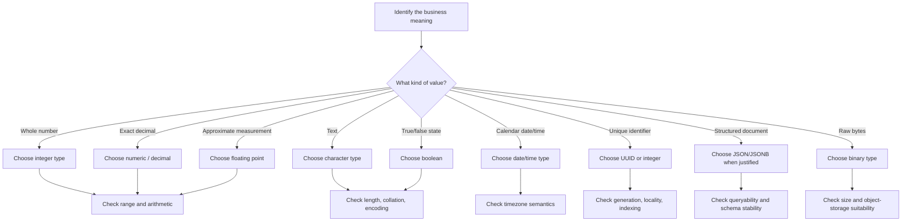

# 14- Choosing the Right Data Type

## Overview

Choosing a SQL data type is a data-modeling decision, not merely a storage decision. The type determines what values are representable, how comparisons and arithmetic behave, how invalid data is rejected, how much storage is required, and how efficiently the database can index and process the column.

A strong schema chooses the **narrowest type that correctly represents the domain without creating artificial constraints that will become operational problems later**.

For example:

```sql
CREATE TABLE payments (
    id bigint GENERATED ALWAYS AS IDENTITY PRIMARY KEY,
    amount numeric(12, 2) NOT NULL,
    currency char(3) NOT NULL,
    paid_at timestamptz NOT NULL
);
```

The choices communicate domain intent:

- `bigint` identifies a database-generated identifier.
- `numeric(12,2)` represents an exact monetary amount.
- `char(3)` represents a fixed-length currency code.
- `timestamptz` represents an absolute point in time.

The goal is not to memorize every SQL type. The goal is to reason about **domain semantics, correctness, range, precision, query behavior, and operational consequences**.

## The Data Type Decision Process

A practical decision process is:



Before choosing a type, answer:

1. What does the value represent?
2. What is its valid range?
3. Does it require exact or approximate arithmetic?
4. Is it optional?
5. Will it be frequently filtered, joined, sorted, or indexed?
6. Does its representation need to survive across services and languages?
7. Is the domain likely to evolve?
8. Can the database enforce important invariants?

## Integer Types

Use integer types for values that are inherently whole numbers.

Common PostgreSQL choices:

| Type | Size | Range | Typical use |
|---|---:|---|---|
| `smallint` | 2 bytes | -32,768 to 32,767 | Small bounded values |
| `integer` / `int` | 4 bytes | -2,147,483,648 to 2,147,483,647 | General-purpose counts |
| `bigint` | 8 bytes | Approximately ±9.22 × 10¹⁸ | Large identifiers, counters |

Choose based on the **actual domain and expected growth**, not simply on habit.

For example:

```sql
retry_count integer NOT NULL DEFAULT 0
```

is more appropriate than:

```sql
retry_count numeric
```

when fractional values have no meaning.

### When to use `bigint`

`bigint` is often appropriate for:

- High-volume identifiers.
- Event offsets or sequence values.
- Large counters.
- Tables expected to grow significantly.

For example:

```sql
CREATE TABLE events (
    id bigint GENERATED ALWAYS AS IDENTITY PRIMARY KEY,
    sequence_number bigint NOT NULL
);
```

A four-byte integer may be perfectly valid today but become a migration problem if the domain can exceed its range.

### Avoid arbitrary `bigint` everywhere

`bigint` is not automatically the best integer type.

For a tightly bounded value such as a small status code or bounded quantity, a smaller type may be sufficient. However, storage savings should not dominate the decision when the type's range is not the primary cost of the system.

The important rule is:

> Choose a type that safely covers the domain and foreseeable growth.

## Decimal and Numeric Types

Use exact decimal types when decimal arithmetic must be predictable.

PostgreSQL:

```sql
numeric(12, 2)
```

is appropriate for many monetary amounts.

For example:

```sql
CREATE TABLE invoices (
    id bigint GENERATED ALWAYS AS IDENTITY PRIMARY KEY,
    subtotal numeric(12, 2) NOT NULL,
    tax numeric(12, 2) NOT NULL,
    total numeric(12, 2) NOT NULL
);
```

`numeric(p,s)` defines:

- `p` = total precision.
- `s` = fractional scale.

For:

```text
numeric(12,2)
```

there are up to:

```text
12 total digits
2 fractional digits
10 integer digits
```

Do not use floating-point types for financial values merely because they appear to work in basic tests.

In Python, preserve the decimal representation with `Decimal`:

```python
from decimal import Decimal

amount = Decimal("19.99")
```

rather than converting it to `float`.

## Floating-Point Types

Use floating-point types when the domain accepts approximate values and performance or range is more important than exact decimal representation.

Typical examples include:

- Scientific measurements.
- Sensor readings.
- Some statistical calculations.
- Engineering calculations.

Do not use them for:

- Currency.
- Accounting balances.
- Exact decimal business rules.

For example:

```sql
temperature double precision NOT NULL
```

may be appropriate because a sensor measurement does not necessarily require exact decimal arithmetic.

The important distinction is:

```text
Exact decimal requirement → numeric / decimal
Approximate measurement   → real / double precision
```

## Character Types

Character types represent textual data.

Common PostgreSQL choices include:

| Type | Characteristics | Typical use |
|---|---|---|
| `text` | Variable-length text | General strings |
| `varchar(n)` | Variable-length with length constraint | Domain-enforced maximum length |
| `char(n)` | Fixed-length | Fixed-width codes where appropriate |

For most PostgreSQL application fields, `text` is a strong default unless a length constraint has business meaning.

For example:

```sql
email text NOT NULL
```

can be preferable to:

```sql
email varchar(255) NOT NULL
```

if the `255` limit is arbitrary.

Use a length constraint when it represents an actual domain rule:

```sql
country_code varchar(2) NOT NULL
```

Although for strongly constrained codes, a database constraint may be more explicit than relying solely on a length.

### Do not confuse storage limits with validation

A database column length does not necessarily express all domain rules.

For example:

```sql
username varchar(30)
```

only says that the stored string cannot exceed the defined length. It does not establish:

- Allowed characters.
- Case sensitivity.
- Uniqueness.
- Reserved names.
- Normalization rules.

Those may require additional constraints or application-level validation.

## Boolean Types

Use boolean when the domain genuinely has two states.

```sql
is_active boolean NOT NULL DEFAULT true
```

This is preferable to:

```sql
status integer
```

when the only domain meaning is active/inactive.

However, not every state model should be reduced to a boolean.

If a resource can be:

```text
pending
processing
completed
failed
```

use an explicit status representation rather than several booleans such as:

```text
is_pending
is_processing
is_completed
is_failed
```

Multiple booleans can permit contradictory states.

## Date and Time Types

Time-related types require explicit semantic decisions.

Typical PostgreSQL choices:

| Type | Meaning | Typical use |
|---|---|---|
| `date` | Calendar date | Birthday, business date |
| `time` | Time without date | Local recurring time |
| `timestamp` | Date + time without timezone semantics | Values intentionally local/naive |
| `timestamptz` | Absolute instant represented with timezone-aware semantics | Events, audit timestamps |

For distributed backend systems, `timestamptz` is usually the safer choice for timestamps representing real-world instants.

For example:

```sql
created_at timestamptz NOT NULL DEFAULT now()
```

A timestamp such as:

```text
2026-08-31 10:30:00+05:30
```

represents a specific instant.

A value such as:

```text
10:30
```

does not identify an instant by itself.

### `date` vs `timestamptz`

A person's birthday is usually a calendar date:

```sql
birth_date date
```

A payment event is a point in time:

```sql
paid_at timestamptz
```

Do not store every temporal value as a timestamp simply because it is convenient.

## UUID Types

UUIDs are useful for identifiers that need a large globally unique namespace and may be generated outside the database.

```sql
CREATE TABLE users (
    id uuid PRIMARY KEY,
    email text NOT NULL UNIQUE
);
```

Advantages include:

- Global uniqueness.
- Suitable for distributed generation.
- Less dependent on a single database sequence.
- Useful when identifiers cross service boundaries.

Trade-offs include:

- Larger indexes than a 64-bit integer.
- Random UUID values can have locality implications depending on the UUID version and generation strategy.
- Less convenient for humans to read and debug.

For distributed systems, UUIDs can be a strong choice, but they are not automatically superior to integer identifiers.

## JSON and JSONB

PostgreSQL `jsonb` is useful when data is genuinely semi-structured or schema evolution is expected.

```sql
CREATE TABLE products (
    id bigint GENERATED ALWAYS AS IDENTITY PRIMARY KEY,
    metadata jsonb NOT NULL DEFAULT '{}'::jsonb
);
```

Good use cases include:

- External provider payloads.
- Optional metadata.
- Configuration-like structures.
- Attributes whose schema varies by entity.

Do not use JSONB as a substitute for relational modeling when the data:

- Has stable structure.
- Is frequently joined.
- Requires strong referential integrity.
- Is heavily queried relationally.

For frequently queried JSONB fields, appropriate indexes can be important:

```sql
CREATE INDEX products_metadata_idx
ON products USING gin (metadata);
```

The correct index depends on the operators and query patterns actually used.

## Binary Data

Binary types are appropriate for raw byte sequences.

Potential examples:

- Cryptographic material where appropriate.
- Compact binary representations.
- Small protocol payloads.
- Hashes.

However, large files generally belong in object storage rather than database rows.

A production architecture often looks like:

```text
Application
    │
    ├── Metadata ──> PostgreSQL
    │
    └── Large Object ──> Object Storage
                         │
                         └── S3-compatible service
```

For example, store:

```sql
object_key text NOT NULL
```

rather than placing a multi-megabyte video directly into a normal relational table unless there is a strong reason to do so.

## Enum Types

Enums are useful when a column has a small, stable set of valid values.

For example:

```sql
CREATE TYPE order_status AS ENUM (
    'pending',
    'paid',
    'shipped',
    'cancelled'
);
```

Then:

```sql
CREATE TABLE orders (
    id bigint GENERATED ALWAYS AS IDENTITY PRIMARY KEY,
    status order_status NOT NULL
);
```

Advantages:

- Database-enforced valid values.
- Compact representation.
- Clear domain semantics.

Limitations:

- Schema changes are required when values evolve.
- Application and database deployments must coordinate carefully.
- Dynamic or frequently changing states may be better represented with a lookup table or constrained text value.

For rapidly evolving business workflows, a lookup table can provide greater flexibility.

## NULLability Is Part of Type Design

The type alone does not define the entire domain.

This:

```sql
price numeric(12,2)
```

is different from:

```sql
price numeric(12,2) NOT NULL
```

`NULL` represents the absence of a value, not zero, false, an empty string, or an unknown numeric value.

When a field is mandatory, prefer:

```sql
NOT NULL
```

and use a default only when a meaningful default exists.

For example:

```sql
retry_count integer NOT NULL DEFAULT 0
```

is reasonable because zero has a clear domain meaning.

Avoid arbitrary defaults such as:

```sql
deleted_at timestamptz NOT NULL DEFAULT now()
```

if `NULL` is actually required to represent "not deleted."

## Data Type and Constraints Work Together

A strong schema uses both types and constraints.

For example:

```sql
CREATE TABLE products (
    id bigint GENERATED ALWAYS AS IDENTITY PRIMARY KEY,
    name text NOT NULL,
    price numeric(12, 2) NOT NULL CHECK (price >= 0),
    stock_quantity integer NOT NULL CHECK (stock_quantity >= 0),
    is_active boolean NOT NULL DEFAULT true,
    created_at timestamptz NOT NULL DEFAULT now()
);
```

The type establishes the broad representation, while constraints enforce domain invariants.

```text
Data type
    ↓
Representation and range
    ↓
NOT NULL / DEFAULT
    ↓
CHECK constraints
    ↓
UNIQUE / PRIMARY KEY / FOREIGN KEY
    ↓
Valid persisted state
```

Application validation remains useful for user-facing errors, but the database should enforce critical invariants independently.

## Data Types and Indexes

Data type selection directly affects indexes.

For example:

```sql
id bigint PRIMARY KEY
```

produces an indexable fixed-width identifier.

A UUID is larger:

```sql
id uuid PRIMARY KEY
```

and therefore typically requires more index storage than a `bigint`.

Large text values can also produce substantially larger indexes than compact numeric values.

Before indexing a column, consider:

- Data cardinality.
- Query frequency.
- Predicate selectivity.
- Sort patterns.
- Join patterns.
- Index size.
- Write amplification.

A smaller type can reduce storage and memory pressure, but **query design and access patterns usually matter more than saving a few bytes per row**.

## Data Types and Query Performance

Type compatibility matters during comparisons and joins.

For example, avoid designing one service around:

```text
user_id bigint
```

and another around:

```text
user_id text
```

unless there is a deliberate integration boundary.

Inconsistent types can cause:

- Implicit casts.
- Less predictable query plans.
- More complicated joins.
- Application conversion overhead.
- Data-quality problems.

Keep shared identifiers and domain values consistent across tables and services whenever practical.

Use:

```sql
EXPLAIN (ANALYZE, BUFFERS)
SELECT *
FROM orders
WHERE customer_id = 1001;
```

to verify actual query behavior rather than assuming a type or index choice is optimal.

## Application Mapping

The database type should map cleanly to application types.

A common Python/PostgreSQL mapping looks like:

| SQL/PostgreSQL | Python | Typical backend use |
|---|---|---|
| `integer` | `int` | Counts |
| `bigint` | `int` | Large IDs/counters |
| `numeric` | `Decimal` | Money/exact decimals |
| `double precision` | `float` | Approximate measurements |
| `text` | `str` | Text |
| `boolean` | `bool` | Binary state |
| `date` | `datetime.date` | Calendar dates |
| `timestamptz` | timezone-aware `datetime` | Instants |
| `uuid` | `uuid.UUID` | UUID identifiers |
| `jsonb` | `dict`/`list` | Structured data |

Django exposes many of these semantics directly:

```python
from django.db import models


class Payment(models.Model):
    id = models.UUIDField(primary_key=True)
    amount = models.DecimalField(max_digits=12, decimal_places=2)
    paid_at = models.DateTimeField()
    metadata = models.JSONField(default=dict)
```

The application should preserve the database's intended semantics rather than converting values into less precise or less constrained representations.

## Choosing Between Similar Types

| Requirement | Preferred direction | Reason |
|---|---|---|
| Whole-number count | Integer | Exact and efficient |
| Large identifier | `bigint` or UUID | Depends on identifier strategy |
| Exact money | `numeric` or minor-unit integer | Avoid floating-point error |
| Scientific approximation | `double precision` | Appropriate approximate arithmetic |
| General text | `text` | Avoid arbitrary length restrictions |
| Fixed-size code | `char(n)` or constrained text | Domain-dependent |
| Binary true/false | `boolean` | Expresses intent directly |
| Absolute event time | `timestamptz` | Represents an instant |
| Calendar date | `date` | Avoid unnecessary time semantics |
| Globally generated ID | UUID | Distributed generation |
| Stable relational state | Enum/lookup table | Database-enforced domain |
| Semi-structured metadata | `jsonb` | Flexible structure |
| Large file | Object storage + metadata | Better operational scalability |

## Production Considerations

### Schema evolution

A data type becomes part of the long-lived database contract.

Before changing a type in production, evaluate:

- Existing values.
- Maximum observed values.
- Application compatibility.
- ORM behavior.
- Index impact.
- Locking behavior.
- Migration duration.
- Rollback strategy.
- Downstream services.

A type change should be treated as a production deployment concern, not merely a code change.

### Backward compatibility

When multiple application versions run simultaneously during a rolling deployment, schema changes must often support both versions temporarily.

For example:

```text
Version A ─┐
           ├── PostgreSQL
Version B ─┘
```

Avoid migrations that immediately invalidate requests from older application instances unless deployment ordering explicitly guarantees compatibility.

### Observability

Monitor data-quality failures as operational signals.

Useful metrics include:

- Constraint violation rates.
- Numeric overflow errors.
- Invalid enum values at API boundaries.
- Serialization failures.
- Migration failures.
- Query latency by query pattern.
- Index growth.
- Table growth.

A sudden increase in database constraint violations may indicate an application deployment bug rather than a database problem.

### Disaster recovery

Data type choices affect backup size and restoration time indirectly through row and index size.

For critical databases:

- Test backups regularly.
- Validate restore procedures.
- Measure restore time.
- Monitor storage growth.
- Maintain appropriate point-in-time recovery capabilities.

Correct types reduce unnecessary storage, but correctness and recoverability remain the primary goals.

## Security Considerations

Data types do not replace authorization or security controls, but good modeling can reduce attack surface and data-quality problems.

Recommendations:

- Enforce maximum lengths where domain limits are real.
- Use database constraints for security-relevant invariants.
- Avoid storing sensitive data in arbitrary JSON structures without clear governance.
- Do not use user-controlled strings as SQL identifiers or dynamic SQL fragments.
- Use parameterized queries.
- Restrict database permissions according to service responsibilities.

For example, application code should use parameters:

```python
cursor.execute(
    "SELECT id FROM users WHERE email = %s",
    [email],
)
```

rather than constructing SQL with string interpolation.

## Common Mistakes

| Mistake | Problem | Better approach |
|---|---|---|
| Using `float` for money | Approximate arithmetic | `numeric` or integer minor units |
| Using arbitrary `varchar(255)` everywhere | Artificial constraints | Use `text` unless the limit is meaningful |
| Storing every timestamp without timezone semantics | Ambiguous instants | Use `timestamptz` for real-world instants |
| Using `text` for everything | Weak domain semantics | Choose a type matching the value |
| Using UUIDs without considering index locality | Potential index/storage costs | Choose an appropriate UUID generation strategy |
| Storing large files in relational rows | Database bloat and operational cost | Use object storage when appropriate |
| Using JSONB for relational data | Weak integrity and difficult joins | Normalize stable relational structures |
| Using multiple booleans for multi-state workflows | Contradictory states | Use status representation |
| Relying only on application validation | Other writers can bypass it | Enforce critical invariants in SQL |
| Choosing types only for minimum storage | Future range limitations | Account for domain growth |
| Mixing identifier types | Implicit casts and integration complexity | Standardize shared identifiers |
| Converting `Decimal` to `float` | Precision loss | Preserve decimal semantics |
| Treating `NULL` as zero or false | Incorrect domain semantics | Model absence explicitly |

## Interview Traps

### Is the smallest data type always the best?

No. A type must safely represent the domain and expected growth. Saving a few bytes is not useful if the column reaches its range and requires a risky migration.

### Why not use `text` for every column?

`text` provides flexible storage but does not communicate or enforce the semantics of numeric, temporal, boolean, UUID, or structured values.

The database should understand the data it stores.

### Why is `numeric` preferable to floating point for money?

`numeric` provides exact decimal semantics, while floating-point types use approximate binary representations.

### Should every timestamp use UTC?

The deeper requirement is to model an **absolute instant** correctly. In PostgreSQL, `timestamptz` is generally appropriate for instants; applications commonly standardize on UTC for storage and convert to local time for presentation.

### When should JSONB replace normalized tables?

When the structure is genuinely semi-structured, variable, or naturally document-oriented. JSONB should not be used simply to avoid designing relational tables.

### UUID or `bigint`?

Neither is universally better.

Use `bigint` when compact, sequential database identifiers are appropriate. UUIDs are useful when identifiers need distributed generation or a large global namespace.

Consider index size, locality, exposure requirements, generation strategy, and service architecture.

### Is `varchar(255)` more efficient than `text` in PostgreSQL?

Not inherently. In PostgreSQL, `text` and unconstrained `varchar` have essentially the same storage characteristics. Use a length constraint when it represents a meaningful domain rule.

## Practical Review Checklist

Before approving a schema, verify:

### Domain correctness

- [ ] Does the type represent the actual business meaning?
- [ ] Is the value exact or approximate?
- [ ] Is the valid range understood?
- [ ] Is fractional precision required?
- [ ] Is `NULL` meaningful?

### Application compatibility

- [ ] Does the Python type preserve database semantics?
- [ ] Does Django/FastAPI validation match the database?
- [ ] Are JSON serialization rules explicit?
- [ ] Are shared types consistent across services?

### Database integrity

- [ ] Is `NOT NULL` used where appropriate?
- [ ] Are meaningful defaults defined?
- [ ] Are `CHECK` constraints required?
- [ ] Are `UNIQUE` and foreign-key constraints present where needed?

### Performance

- [ ] Will this type create unnecessarily large indexes?
- [ ] Are high-volume arithmetic operations appropriate for the type?
- [ ] Are join columns type-compatible?
- [ ] Have important queries been verified with `EXPLAIN`?

### Operations

- [ ] Can the type evolve safely?
- [ ] What happens at the maximum range?
- [ ] Is the migration backward compatible?
- [ ] Will storage or index size materially affect operations?
- [ ] Are backup and restore requirements understood?

## A Production-Oriented Example

Consider an order service:

```sql
CREATE TABLE orders (
    id bigint GENERATED ALWAYS AS IDENTITY PRIMARY KEY,
    customer_id uuid NOT NULL,
    subtotal numeric(12, 2) NOT NULL CHECK (subtotal >= 0),
    tax numeric(12, 2) NOT NULL CHECK (tax >= 0),
    total numeric(12, 2) NOT NULL CHECK (total >= 0),
    status text NOT NULL CHECK (
        status IN ('pending', 'paid', 'shipped', 'cancelled')
    ),
    metadata jsonb NOT NULL DEFAULT '{}'::jsonb,
    created_at timestamptz NOT NULL DEFAULT now()
);

CREATE INDEX orders_customer_id_idx
ON orders (customer_id);

CREATE INDEX orders_created_at_idx
ON orders (created_at);
```

Each type has a specific reason:

| Column | Type | Reason |
|---|---|---|
| `id` | `bigint` | Compact, ordered database-generated identifier |
| `customer_id` | `uuid` | Distributed/service-level identifier |
| `subtotal` | `numeric(12,2)` | Exact monetary value |
| `tax` | `numeric(12,2)` | Exact monetary value |
| `total` | `numeric(12,2)` | Exact monetary value |
| `status` | constrained `text` | Explicit stable domain values |
| `metadata` | `jsonb` | Semi-structured optional attributes |
| `created_at` | `timestamptz` | Absolute creation instant |

The schema is stronger because each type expresses a specific domain decision rather than simply storing everything as strings.

## Key Takeaways

- **Choose data types from domain semantics, valid ranges, precision requirements, and expected growth—not from habit or minimum storage size alone.**
- **Use exact types for exact domains: integers for whole numbers, `numeric` for exact decimals, booleans for binary state, and timezone-aware timestamps for real-world instants.**
- **Keep database and application representations semantically aligned, especially for `numeric`/`Decimal`, timestamps, UUIDs, and JSON data.**
- **Combine data types with `NOT NULL`, `CHECK`, `UNIQUE`, and foreign-key constraints to make the database an active integrity boundary.**
- **Treat type selection as a long-term schema contract: evaluate indexing, query performance, migrations, compatibility, storage, and operational growth before committing to a design.**